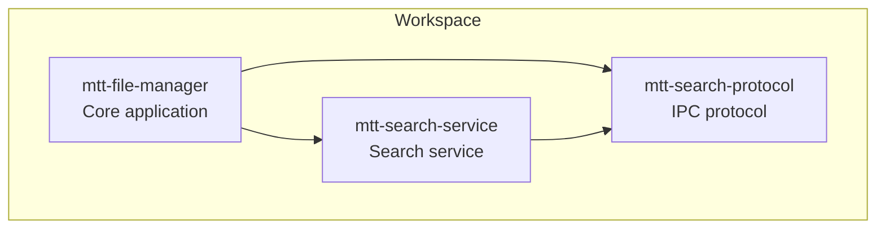
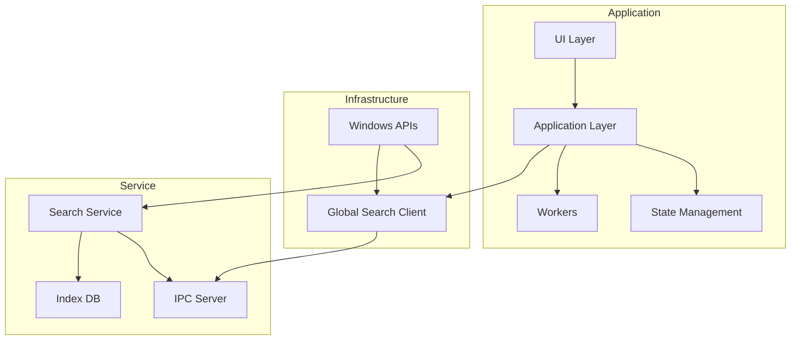
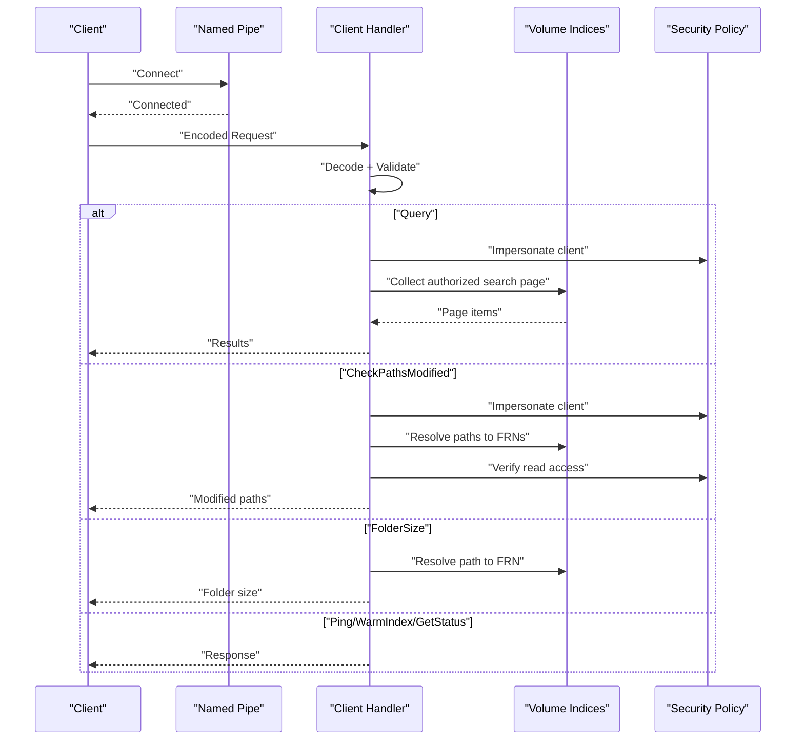
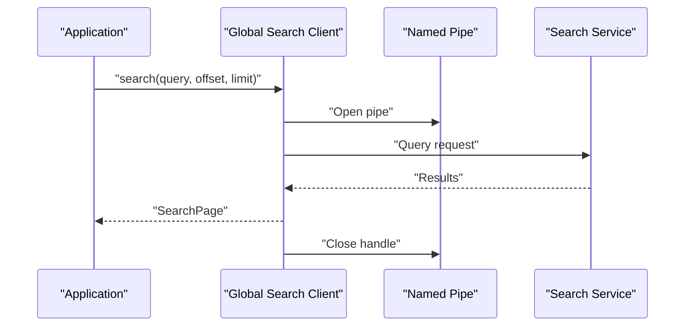
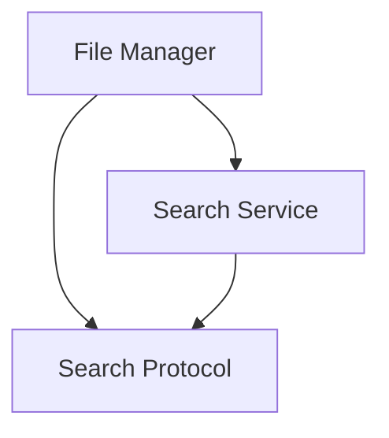

# API Reference

<cite>
**Referenced Files in This Document**
- [Cargo.toml](file://Cargo.toml)
- [lib.rs](file://src/lib.rs)
- [mod.rs (search protocol)](file://crates/mtt-search-protocol/src/lib.rs)
- [main.rs (search service)](file://crates/mtt-search-service/src/main.rs)
- [mod.rs (search service ipc_server)](file://crates/mtt-search-service/src/ipc_server/mod.rs)
- [handler.rs (search service ipc_server)](file://crates/mtt-search-service/src/ipc_server/handler.rs)
- [pipe_io.rs (search service ipc_server)](file://crates/mtt-search-service/src/ipc_server/pipe_io.rs)
- [global_search.rs (client)](file://src/infrastructure/global_search.rs)
- [mod.rs (windows infra)](file://src/infrastructure/windows/mod.rs)
- [shell_operations.rs (windows infra)](file://src/infrastructure/windows/shell_operations.rs)
- [mod.rs (app state)](file://src/app/state/mod.rs)
- [mod.rs (workers)](file://src/workers/mod.rs)
- [mod.rs (ui)](file://src/ui/mod.rs)
- [mod.rs (application)](file://src/application/mod.rs)
- [file_entry.rs (domain)](file://src/domain/file_entry.rs)
- [errors.rs (domain)](file://src/domain/errors.rs)
</cite>

## Table of Contents
1. [Introduction](#introduction)
2. [Project Structure](#project-structure)
3. [Core Components](#core-components)
4. [Architecture Overview](#architecture-overview)
5. [Detailed Component Analysis](#detailed-component-analysis)
6. [Dependency Analysis](#dependency-analysis)
7. [Performance Considerations](#performance-considerations)
8. [Troubleshooting Guide](#troubleshooting-guide)
9. [Conclusion](#conclusion)
10. [Appendices](#appendices)

## Introduction
This document provides comprehensive API documentation for MTT File Manager’s public interfaces and protocols. It covers:
- IPC communication between the main application and the search service, including message formats, request/response schemas, and error handling
- Windows API integration interfaces for file operations, shell integration, and system notifications
- Internal application APIs for state management, worker communication, and UI component interfaces
- Data models and domain objects used throughout the application
- Parameter specifications, return value documentation, and usage examples for each API endpoint
- Extension points and plugin interfaces available for developers extending the application functionality

## Project Structure
The project is organized into a workspace with a core application crate and two primary libraries:
- mtt-search-protocol: Defines IPC message formats and constants
- mtt-search-service: Implements the search service with IPC server, indexing, and security policies
- mtt-file-manager: The main application integrating UI, workers, infrastructure, and domain logic

**Diagram sources**
- [Cargo.toml:1-137](file://Cargo.toml#L1-L137)
- [lib.rs:1-20](file://src/lib.rs#L1-L20)

**Section sources**
- [Cargo.toml:1-137](file://Cargo.toml#L1-L137)
- [lib.rs:1-20](file://src/lib.rs#L1-L20)

## Core Components
This section documents the public interfaces and protocols used by the application.

- IPC Protocol (mtt-search-protocol)
  - Named pipe path constant and limits for query length, result items, and checked paths
  - Request types: Query, GetStatus, Ping, WarmIndex, CheckPathsModified, FolderSize
  - Response types: Results, Status, Pong, WarmStarted, PathsModified, FolderSize, Error
  - Message encoding/decoding with length-prefixed bincode serialization

- Search Service (mtt-search-service)
  - IPC server with rate limiting, watchdog timeouts, and security policy enforcement
  - Client handler implementing request routing, authorization, and response building
  - Pipe I/O utilities with ACL-based access control and server verification

- Client Library (mtt-file-manager)
  - Named pipe client for search queries, status, warm-up, path modification checks, and folder size
  - Server verification against pipe server process and token identity
  - Read/write helpers with timeouts and validation

- Windows Integration (mtt-file-manager)
  - Windows API modules for file system, shell operations, metadata, and system info
  - Re-exported APIs for shell context menus, file operations, and shell folder enumeration

- Domain Models (mtt-file-manager)
  - FileEntry and related enums for sorting, view modes, and sync status
  - Error types and helpers for robust error propagation

- Application State (mtt-file-manager)
  - ImageViewerApp state container with channels, caches, UI state, and worker coordination
  - Global search state and worker integration

- Workers and UI (mtt-file-manager)
  - Worker modules for file operations, thumbnails, global search, and prefetch
  - UI modules for app lifecycle, overlays, components, and rendering

**Section sources**
- [mod.rs (search protocol):1-290](file://crates/mtt-search-protocol/src/lib.rs#L1-L290)
- [mod.rs (search service ipc_server):1-275](file://crates/mtt-search-service/src/ipc_server/mod.rs#L1-L275)
- [handler.rs (search service ipc_server):1-619](file://crates/mtt-search-service/src/ipc_server/handler.rs#L1-L619)
- [pipe_io.rs (search service ipc_server):1-258](file://crates/mtt-search-service/src/ipc_server/pipe_io.rs#L1-L258)
- [global_search.rs (client):1-580](file://src/infrastructure/global_search.rs#L1-L580)
- [mod.rs (windows infra):1-60](file://src/infrastructure/windows/mod.rs#L1-L60)
- [shell_operations.rs (windows infra):1-15](file://src/infrastructure/windows/shell_operations.rs#L1-L15)
- [file_entry.rs (domain):1-321](file://src/domain/file_entry.rs#L1-L321)
- [errors.rs (domain):1-180](file://src/domain/errors.rs#L1-L180)
- [mod.rs (app state):1-444](file://src/app/state/mod.rs#L1-L444)
- [mod.rs (workers):1-9](file://src/workers/mod.rs#L1-L9)
- [mod.rs (ui):1-22](file://src/ui/mod.rs#L1-L22)
- [mod.rs (application):1-47](file://src/application/mod.rs#L1-L47)

## Architecture Overview
The application uses a modular architecture with clear separation of concerns:
- IPC layer: Named pipes with bincode-encoded messages
- Service layer: Search service with indexing, authorization, and status reporting
- Client layer: Application-side client with server verification and timeouts
- Infrastructure layer: Windows API integrations for shell, file system, and metadata
- Domain layer: Data models and error handling
- Application layer: State management, UI, and worker coordination

**Diagram sources**
- [Cargo.toml:1-137](file://Cargo.toml#L1-L137)
- [mod.rs (search service ipc_server):1-275](file://crates/mtt-search-service/src/ipc_server/mod.rs#L1-L275)
- [handler.rs (search service ipc_server):1-619](file://crates/mtt-search-service/src/ipc_server/handler.rs#L1-L619)
- [global_search.rs (client):1-580](file://src/infrastructure/global_search.rs#L1-L580)

## Detailed Component Analysis

### IPC Protocol Specification
The IPC protocol defines the message formats and constraints for communication between the application and the search service.

- Constants
  - PIPE_NAME: Named pipe identifier
  - MAX_QUERY_TEXT_LEN: Maximum query text length
  - MAX_RESULT_ITEMS: Maximum number of returned items
  - MAX_CHECK_PATHS: Maximum number of paths in CheckPathsModified

- Request Types
  - Query(text: String, offset: u32, limit: u32)
  - GetStatus()
  - Ping()
  - WarmIndex()
  - CheckPathsModified(paths: Vec<String>, threshold_secs: u32)
  - FolderSize(path: String)

- Response Types
  - Results(items: Vec<SearchResultItem>, has_more: bool, total_matches: Option<u32>)
  - Status(IndexStatusInfo)
  - Pong()
  - WarmStarted()
  - PathsModified(modified: Vec<String>)
  - FolderSize(path: String, total_size: u64, file_count: u64, folder_count: u64)
  - Error(message: String)

- Data Models
  - SearchResultItem(name: String, full_path: String, is_dir: bool, size: u64)
  - IndexStatusInfo(volumes: Vec<VolumeStatus>, total_files_indexed: u64, service_executable_path: String)
  - VolumeStatus(drive_letter: char, state: String, files_indexed: u64, phase: String, phase_progress: Option<u64>, phase_total: Option<u64>, sizes_loading: bool)

- Encoding/Decoding
  - encode_message<T: Serialize>(msg: &T): Encodes with 4-byte little-endian length prefix using bincode
  - decode_message<T: Deserialize<'de>>(data: &[u8]): Decodes with payload size limit

Usage examples
- Query: Construct SearchRequest::Query with text, offset, limit; serialize; send via pipe; deserialize SearchResponse::Results
- Status: Send SearchRequest::GetStatus; receive IndexStatusInfo
- Ping: Send SearchRequest::Ping; receive SearchResponse::Pong
- WarmIndex: Send SearchRequest::WarmIndex; receive SearchResponse::WarmStarted
- CheckPathsModified: Send SearchRequest::CheckPathsModified with paths and threshold; receive PathsModified
- FolderSize: Send SearchRequest::FolderSize with path; receive FolderSize or Error

Validation
- SearchRequest.validate(): Enforces query length, result limit, path counts, and path length
- SearchResponse.validate(): Enforces maximum result items

**Section sources**
- [mod.rs (search protocol):1-290](file://crates/mtt-search-protocol/src/lib.rs#L1-L290)

### Search Service IPC Server
The search service exposes a named pipe server with robust security and concurrency controls.

- Server Loop
  - Creates pipe with ACL allowing authenticated users and LocalSystem
  - Accepts connections with overlapped I/O and periodic shutdown checks
  - Rate limiting with MAX_ACTIVE_CLIENTS
  - Watchdog thread to disconnect slow clients after IO_TIMEOUT_SECS

- Client Handler
  - Reads and decodes messages with MAX_REQUEST_PAYLOAD limit
  - Validates requests and responses
  - Routes to handlers for Ping, WarmIndex, GetStatus, Query, CheckPathsModified, FolderSize
  - Applies security policies and impersonation for authorization checks

- Security Features
  - First-instance pipe creation to prevent squatting
  - Server verification against executable basename and token SID
  - Redaction of sensitive metrics based on policy

- Handlers
  - Ping: Immediate Pong response
  - WarmIndex: Immediate WarmStarted; background warming with cooldown
  - GetStatus: Builds status response with volume states and metrics
  - Query: Performs authorized search with SIMD in-memory search
  - CheckPathsModified: Impersonates client and checks recent modifications
  - FolderSize: Computes from in-memory MFT index with zero disk I/O

**Diagram sources**
- [mod.rs (search service ipc_server):1-275](file://crates/mtt-search-service/src/ipc_server/mod.rs#L1-L275)
- [handler.rs (search service ipc_server):1-619](file://crates/mtt-search-service/src/ipc_server/handler.rs#L1-L619)
- [pipe_io.rs (search service ipc_server):1-258](file://crates/mtt-search-service/src/ipc_server/pipe_io.rs#L1-L258)

**Section sources**
- [mod.rs (search service ipc_server):1-275](file://crates/mtt-search-service/src/ipc_server/mod.rs#L1-L275)
- [handler.rs (search service ipc_server):1-619](file://crates/mtt-search-service/src/ipc_server/handler.rs#L1-L619)
- [pipe_io.rs (search service ipc_server):1-258](file://crates/mtt-search-service/src/ipc_server/pipe_io.rs#L1-L258)

### Client Library API
The client library provides a high-level interface to communicate with the search service via named pipes.

- Public Functions
  - search(query: &str, offset: u32, limit: u32) -> Result<SearchPage, String>
    - Sends Query request; returns SearchPage with items, has_more, total_matches
  - warm_index() -> Result<(), String>
    - Sends WarmIndex request; returns immediately with WarmStarted
  - ping() -> bool
    - Sends Ping; returns true if service is reachable (including transient errors)
  - get_status() -> Result<IndexStatusInfo, String>
    - Sends GetStatus; returns status information
  - check_paths_modified(paths: &[String], threshold_secs: u32) -> Result<Vec<String>, String>
    - Sends CheckPathsModified; returns subset of modified paths
  - folder_size(path: &Path) -> Result<(u64, u64, u64), String>
    - Sends FolderSize; returns (total_size, file_count, folder_count)

- Server Verification
  - verify_server_process(pipe: HANDLE) -> Result<(), String>
    - Verifies server process identity and token SID

- Transport Utilities
  - write_message<T: Serialize>(pipe: HANDLE, msg: &T) -> Result<(), String>
  - read_response<T: Deserialize<'de>>(pipe: HANDLE, timeout_ms: u64) -> Result<T, String>
  - read_validated_response(pipe: HANDLE, timeout_ms: u64) -> Result<SearchResponse, String>
  - read_exact_with_timeout(pipe: HANDLE, buf: &mut [u8], timeout_ms: u64) -> Result<(), String>

- Timeouts and Retries
  - SEARCH_PIPE_IO_TIMEOUT_MS: 8000 ms for search
  - CONTROL_PIPE_IO_TIMEOUT_MS: 5000 ms for control operations
  - CHECK_PATHS_TIMEOUT_MS: 2000 ms for CheckPathsModified
  - FOLDER_SIZE_TIMEOUT_MS: 8000 ms for FolderSize
  - BUSY_RETRY_COUNT and BUSY_WAIT_MS for pipe busy handling

**Diagram sources**
- [global_search.rs (client):1-580](file://src/infrastructure/global_search.rs#L1-L580)

**Section sources**
- [global_search.rs (client):1-580](file://src/infrastructure/global_search.rs#L1-L580)

### Windows API Integration Interfaces
The application integrates with Windows APIs for file operations, shell integration, and system notifications.

- Windows Module Re-exports
  - ComScope, BitmapConversion, CodecRegistry, DeviceChange, Drives, FileFlags, FileSystem, FileType, FolderSize, Formatting, HDDirectoryReader, Icons, IsoMount, KeyState, MediaFoundation, Metadata, NativeMenu, OwnedHandle, ProcessSnapshot, RecycleBin, ShellFolder, ShellOperations, SystemInfo, WindowFocus, WindowCorners, WindowSubclass

- Shell Operations
  - Context menu: show_shell_context_menu, open_with_shell
  - File operations: copy_item_with_file_op, copy_items_with_file_op, move_item_with_file_op, move_items_with_file_op
  - Shell operations: copy_item_with_shell, copy_items_with_shell, delete_item_with_shell, delete_items_permanently_with_shell, delete_items_with_shell, move_item_with_shell, move_items_with_shell, rename_item_with_shell

- Notifications
  - Notification system integrated via application layer

**Section sources**
- [mod.rs (windows infra):1-60](file://src/infrastructure/windows/mod.rs#L1-L60)
- [shell_operations.rs (windows infra):1-15](file://src/infrastructure/windows/shell_operations.rs#L1-L15)

### Internal Application APIs
The application exposes internal APIs for state management, worker communication, and UI component interfaces.

- State Management
  - ImageViewerApp: Central state container with navigation, sorting, caching, UI state, worker channels, and persistence
  - GlobalSearchState: Integration with global search service
  - FileOperationState: File operation tracking and worker coordination
  - FolderSizeState: Asynchronous folder size computation

- Worker Communication
  - PriorityThumbnailQueue: Priority queue for thumbnail generation
  - Channels for metadata, live file size, icon loading, and shell menu extraction
  - Worker modules: file_operation_worker, folder_preview_worker, global_search_worker, idle_warmup, prefetch_worker, thumbnail

- UI Component Interfaces
  - UI modules: app, app_impl, cache, components, context_menu, global_search_overlay, icon_loader, navigation, preview_panel, sidebar, sidebar_tree, status_bar, svg_icons, tab_bar, theme, toolbar, views, widgets
  - Integration with eframe and egui for rendering and lifecycle management

**Section sources**
- [mod.rs (app state):1-444](file://src/app/state/mod.rs#L1-L444)
- [mod.rs (workers):1-9](file://src/workers/mod.rs#L1-L9)
- [mod.rs (ui):1-22](file://src/ui/mod.rs#L1-L22)
- [mod.rs (application):1-47](file://src/application/mod.rs#L1-L47)

### Data Models and Domain Objects
Domain models define the core data structures used across the application.

- FileEntry
  - path: PathBuf
  - name: String
  - is_dir: bool
  - size: u64
  - modified: u64
  - folder_cover: Option<PathBuf>
  - drive_info: Option<DriveInfo>
  - sync_status: SyncStatus
  - is_hidden: bool
  - recycle_bin: Option<Box<RecycleBinMeta>>

- DriveInfo
  - file_system: String
  - total_space: u64
  - free_space: u64
  - drive_type: DriveType

- RecycleBinMeta
  - deletion_date: String
  - original_path: PathBuf

- Enums
  - SortMode: Name, Date, Size, Type, DriveTotalSpace, DriveFreeSpace
  - ViewMode: Grid, List
  - IconSize: Small, Large, Jumbo
  - FoldersPosition: First, Last, Mixed
  - SyncStatus: None, CloudOnly, Syncing, Pinned, LocallyAvailable

- Error Types
  - AppError: Security, WindowsApi, Io, ThumbnailExtraction, FileOperation, InvalidState, Config, Worker, UiRendering
  - Helpers: windows_error, file_operation_error, invalid_state_error, config_error, worker_error, ui_rendering_error
  - Macros: safe_unwrap, safe_expect, OptionExt, ResultExt

**Section sources**
- [file_entry.rs (domain):1-321](file://src/domain/file_entry.rs#L1-L321)
- [errors.rs (domain):1-180](file://src/domain/errors.rs#L1-L180)

### Extension Points and Plugin Interfaces
The application provides extension points for developers to extend functionality.

- Worker Modules
  - file_operation_worker: Extensible file operation handling
  - folder_preview_worker: Custom folder preview logic
  - global_search_worker: Enhanced search capabilities
  - idle_warmup: Background warming strategies
  - prefetch_worker: Prefetch optimization hooks
  - thumbnail: Stages and processing pipeline for thumbnails

- UI Components
  - Custom components under ui/components for specialized views and overlays
  - Widgets and toolbar extensions for additional controls

- Windows API Integrations
  - Additional shell operations and metadata extraction can be integrated via windows module re-exports
  - System notifications and device change handling can be extended

- IPC Protocol Extensions
  - New request/response variants can be added to mtt-search-protocol with corresponding handlers in the service and client

**Section sources**
- [mod.rs (workers):1-9](file://src/workers/mod.rs#L1-L9)
- [mod.rs (ui):1-22](file://src/ui/mod.rs#L1-L22)
- [mod.rs (windows infra):1-60](file://src/infrastructure/windows/mod.rs#L1-L60)
- [mod.rs (search protocol):1-290](file://crates/mtt-search-protocol/src/lib.rs#L1-L290)

## Dependency Analysis
The application uses a layered dependency structure with explicit boundaries between modules.

**Diagram sources**
- [Cargo.toml:1-137](file://Cargo.toml#L1-L137)

**Section sources**
- [Cargo.toml:1-137](file://Cargo.toml#L1-L137)

## Performance Considerations
- IPC throughput and latency
  - Length-prefixed bincode encoding minimizes framing overhead
  - Overlapped I/O and watchdog threads prevent resource exhaustion
  - Rate limiting and timeouts protect against DoS and slow clients

- Indexing and search
  - In-memory SIMD search for Query requests
  - WarmIndex to bring pages back into RAM
  - FolderSize from MFT index for zero-disk I/O on NTFS

- UI responsiveness
  - Priority queues and channels decouple UI from heavy operations
  - LRU caches and bounded collections prevent memory growth
  - Virtualization and predictive scrolling reduce GPU upload costs

[No sources needed since this section provides general guidance]

## Troubleshooting Guide
Common issues and resolutions:

- Pipe connectivity
  - All pipe instances are busy: Retry with exponential backoff; service may be saturated
  - No process is on the other end of the pipe: Service not running or stopped
  - Pipe closed during read/write: Client disconnected or service shutdown

- Authorization failures
  - CheckPathsModified and FolderSize require client impersonation; ensure proper token level
  - Server verification failures indicate potential pipe squatting or incorrect server identity

- Validation errors
  - Query text too long or result limit exceeded: Adjust request parameters
  - Too many result items: Reduce limit or refine query

- Service status
  - Volume not indexed or not ready: Wait for indexing to complete or trigger warm-up
  - Sizes not loaded: Allow background size loading to complete

**Section sources**
- [global_search.rs (client):1-580](file://src/infrastructure/global_search.rs#L1-L580)
- [handler.rs (search service ipc_server):1-619](file://crates/mtt-search-service/src/ipc_server/handler.rs#L1-L619)

## Conclusion
MTT File Manager provides a robust, secure, and performant IPC-based search service with comprehensive Windows API integration. The documented APIs enable developers to extend functionality through workers, UI components, and protocol enhancements while maintaining strong security and performance characteristics.

[No sources needed since this section summarizes without analyzing specific files]

## Appendices

### API Endpoints Summary

- search(query: &str, offset: u32, limit: u32) -> Result<SearchPage, String>
  - Purpose: Execute a search query
  - Parameters: query (text), offset (page offset), limit (max results)
  - Returns: SearchPage with items, has_more, total_matches
  - Errors: Invalid request, service busy, server verification failure

- warm_index() -> Result<(), String>
  - Purpose: Warm in-memory index
  - Returns: Immediate confirmation; background warming
  - Errors: Invalid request, service busy

- ping() -> bool
  - Purpose: Health check
  - Returns: True if reachable (including transient errors)

- get_status() -> Result<IndexStatusInfo, String>
  - Purpose: Retrieve indexing status
  - Returns: IndexStatusInfo with volume states and metrics

- check_paths_modified(paths: &[String], threshold_secs: u32) -> Result<Vec<String>, String>
  - Purpose: Detect recently modified paths
  - Returns: Subset of paths modified within threshold
  - Errors: Authorization failure, invalid paths

- folder_size(path: &Path) -> Result<(u64, u64, u64), String>
  - Purpose: Compute folder size from index
  - Returns: (total_size, file_count, folder_count)
  - Errors: Volume not indexed, not ready, sizes not loaded, invalid path

**Section sources**
- [global_search.rs (client):1-580](file://src/infrastructure/global_search.rs#L1-L580)