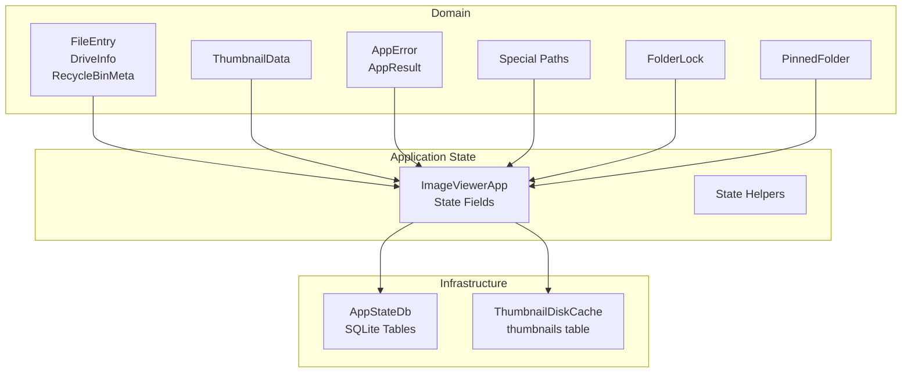
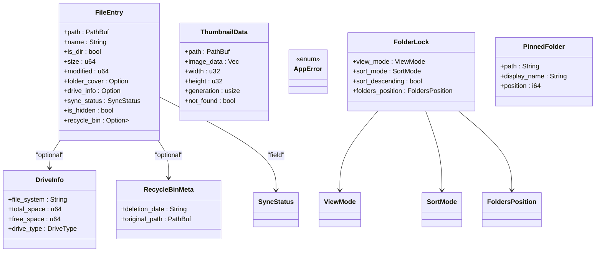
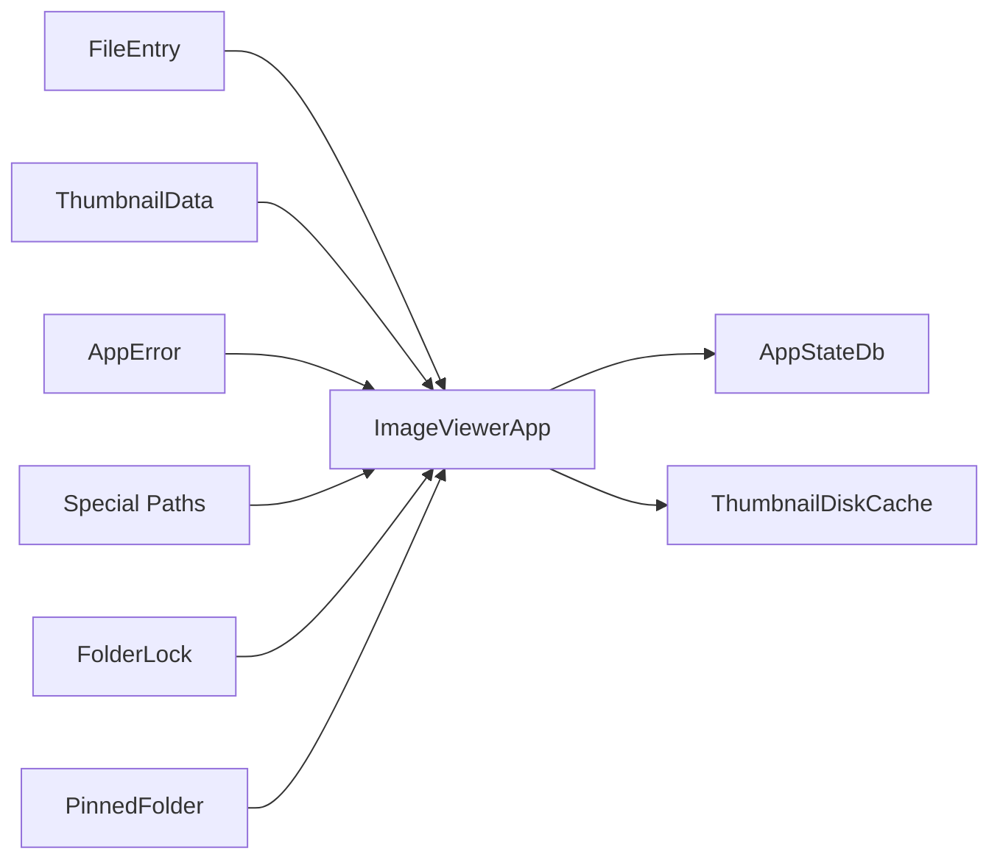

# Data Models

<cite>
**Referenced Files in This Document**
- [file_entry.rs](file://src/domain/file_entry.rs)
- [thumbnail.rs](file://src/domain/thumbnail.rs)
- [errors.rs](file://src/domain/errors.rs)
- [special_paths.rs](file://src/domain/special_paths.rs)
- [folder_lock.rs](file://src/domain/folder_lock.rs)
- [pinned_folder.rs](file://src/domain/pinned_folder.rs)
- [mod.rs](file://src/domain/mod.rs)
- [state.rs](file://src/app/state/mod.rs)
- [helpers.rs](file://src/app/state/helpers.rs)
- [app_state_db_mod.rs](file://src/infrastructure/app_state_db/mod.rs)
- [thumbnails_repo.rs](file://src/infrastructure/disk_cache/thumbnails_repo.rs)
</cite>

## Table of Contents
1. [Introduction](#introduction)
2. [Project Structure](#project-structure)
3. [Core Components](#core-components)
4. [Architecture Overview](#architecture-overview)
5. [Detailed Component Analysis](#detailed-component-analysis)
6. [Dependency Analysis](#dependency-analysis)
7. [Performance Considerations](#performance-considerations)
8. [Troubleshooting Guide](#troubleshooting-guide)
9. [Conclusion](#conclusion)

## Introduction
This document describes the data models used across MTT File Manager’s domain, state, and infrastructure layers. It focuses on:
- FileEntry and related enumerations for file and folder representation
- ThumbnailData for thumbnail generation and caching
- Error domain models and handling patterns
- Special paths for virtual views
- State data models for application, UI, and worker coordination
- Serialization formats, persistence strategies, and transformation patterns

## Project Structure
The data models are primarily defined under the domain layer and integrated with application state and infrastructure persistence.

**Diagram sources**
- [file_entry.rs:22-35](file://src/domain/file_entry.rs#L22-L35)
- [thumbnail.rs:3-12](file://src/domain/thumbnail.rs#L3-L12)
- [errors.rs:6-39](file://src/domain/errors.rs#L6-L39)
- [special_paths.rs:1-13](file://src/domain/special_paths.rs#L1-L13)
- [folder_lock.rs:3-12](file://src/domain/folder_lock.rs#L3-L12)
- [pinned_folder.rs:1-11](file://src/domain/pinned_folder.rs#L1-L11)
- [state.rs:65-435](file://src/app/state/mod.rs#L65-L435)
- [helpers.rs:7-197](file://src/app/state/helpers.rs#L7-L197)
- [app_state_db_mod.rs:21-167](file://src/infrastructure/app_state_db/mod.rs#L21-L167)
- [thumbnails_repo.rs:7-175](file://src/infrastructure/disk_cache/thumbnails_repo.rs#L7-L175)

**Section sources**
- [mod.rs:1-9](file://src/domain/mod.rs#L1-L9)
- [state.rs:1-444](file://src/app/state/mod.rs#L1-L444)

## Core Components
This section documents the primary domain models and enums used to represent files, thumbnails, errors, and special paths.

- FileEntry: Core item model for files and folders, including cached metadata and optional extended fields.
- DriveInfo: Volume metadata for “This PC” view.
- RecycleBinMeta: Optional recycle-bin metadata for items originating from the Recycle Bin.
- ThumbnailData: Extracted thumbnail payload with dimensions and validity tracking.
- AppError: Centralized error type with helpers and macros for propagation.
- Special paths: Virtual view identifiers and helpers.
- FolderLock: Locked view preferences for a folder.
- PinnedFolder: Quick Access entry.

**Section sources**
- [file_entry.rs:22-35](file://src/domain/file_entry.rs#L22-L35)
- [file_entry.rs:5-12](file://src/domain/file_entry.rs#L5-L12)
- [file_entry.rs:14-20](file://src/domain/file_entry.rs#L14-L20)
- [thumbnail.rs:3-12](file://src/domain/thumbnail.rs#L3-L12)
- [errors.rs:6-39](file://src/domain/errors.rs#L6-L39)
- [special_paths.rs:1-13](file://src/domain/special_paths.rs#L1-L13)
- [folder_lock.rs:3-12](file://src/domain/folder_lock.rs#L3-L12)
- [pinned_folder.rs:1-11](file://src/domain/pinned_folder.rs#L1-L11)

## Architecture Overview
The data models integrate with application state and infrastructure layers to support UI rendering, background workers, and persistent storage.

**Diagram sources**
- [file_entry.rs:22-35](file://src/domain/file_entry.rs#L22-L35)
- [file_entry.rs:5-12](file://src/domain/file_entry.rs#L5-L12)
- [file_entry.rs:14-20](file://src/domain/file_entry.rs#L14-L20)
- [thumbnail.rs:3-12](file://src/domain/thumbnail.rs#L3-L12)
- [errors.rs:6-39](file://src/domain/errors.rs#L6-L39)
- [folder_lock.rs:3-12](file://src/domain/folder_lock.rs#L3-L12)
- [pinned_folder.rs:1-11](file://src/domain/pinned_folder.rs#L1-L11)

## Detailed Component Analysis

### FileEntry and Related Types
- Purpose: Represent a file or folder with cached metadata and optional extended fields for UI and performance.
- Key fields:
  - path: Absolute path to the item.
  - name: Cached file name for fast sorting and display.
  - is_dir: Directory indicator.
  - size: Byte length for files; zero for directories.
  - modified: Last modified timestamp in seconds since Unix epoch.
  - folder_cover: First image found in a folder for preview.
  - drive_info: Drive metadata for “This PC” view.
  - sync_status: OneDrive sync state.
  - is_hidden: Hidden attribute.
  - recycle_bin: Optional boxed metadata for recycle-bin items.
- Methods:
  - Deletion date and original path accessors for recycle items.
  - On-demand media detection by extension.
  - Archive detection helpers and path parsing utilities for virtual archives.
- Enums used:
  - SortMode, ViewMode, IconSize, FoldersPosition, SyncStatus.

Validation and relationships:
- Optional fields reduce memory footprint for non-recycle items.
- Archive helpers optimize path traversal and labeling without allocating intermediate strings excessively.

Serialization and transformation:
- No explicit serde annotations observed in the file; transformations occur via helper functions and Windows APIs.

**Section sources**
- [file_entry.rs:22-35](file://src/domain/file_entry.rs#L22-L35)
- [file_entry.rs:37-124](file://src/domain/file_entry.rs#L37-L124)
- [file_entry.rs:126-251](file://src/domain/file_entry.rs#L126-L251)
- [file_entry.rs:253-298](file://src/domain/file_entry.rs#L253-L298)

### ThumbnailData Model
- Purpose: Encapsulates extracted thumbnail image data and associated metadata.
- Fields:
  - path: Source path of the thumbnail.
  - image_data: Compressed image bytes.
  - width/height: Final dimensions after processing.
  - generation: Tracks extraction validity for cache coherency.
  - not_found: Indicates the file no longer exists on disk.
- Generation and caching:
  - Used alongside a priority queue and UI receiver to coordinate worker-to-UI updates.
  - Eviction tracking prevents stale uploads from overriding newer results.

Serialization and transformation:
- Stored in SQLite via ThumbnailDiskCache with WebP encoding and dimension metadata.

**Section sources**
- [thumbnail.rs:3-12](file://src/domain/thumbnail.rs#L3-L12)
- [state.rs:77-88](file://src/app/state/mod.rs#L77-L88)
- [thumbnails_repo.rs:87-175](file://src/infrastructure/disk_cache/thumbnails_repo.rs#L87-L175)

### Error Domain Models
- AppError: Centralized error enum covering security, Windows API, I/O, thumbnail extraction, file operations, invalid state, configuration, worker, and UI rendering errors.
- AppResult: Type alias for Result<T, AppError>.
- Helpers:
  - Constructors for specific error categories.
  - Macros for safe unwrapping and expectations with logging and structured propagation.
  - Extension traits to convert Option and generic Result into AppResult with context.

Error handling patterns:
- Prefer structured propagation over panics.
- Use macros to centralize logging and context injection.

**Section sources**
- [errors.rs:6-39](file://src/domain/errors.rs#L6-L39)
- [errors.rs:44-72](file://src/domain/errors.rs#L44-L72)
- [errors.rs:74-112](file://src/domain/errors.rs#L74-L112)
- [errors.rs:114-142](file://src/domain/errors.rs#L114-L142)

### Special Paths
- Constants:
  - COMPUTER_VIEW_ID: Virtual identifier for “This PC.”
  - RECYCLE_BIN_VIEW_ID: Virtual identifier for Recycle Bin.
- Helper:
  - is_virtual_path: Determines if a path corresponds to a virtual view.

Usage:
- Internal routing and navigation history comparisons; display labels are localized separately.

**Section sources**
- [special_paths.rs:1-13](file://src/domain/special_paths.rs#L1-L13)

### State Data Models
Application state is encapsulated in ImageViewerApp, which coordinates UI, workers, caches, and persistence.

Key areas:
- Thumbnails pipeline: Priority queue, receiver, pending buffer, eviction skips, and snapshot of stale items.
- Items and loading: Loaded path tracking, async loading channels, rebuild requests, and generation counters.
- Caches: Directory cache, metadata cache, live file size cache, and icon loader.
- Sorting and view: Active and normal modes, sort direction, folders position, and view mode.
- Persistence: AppStateDb (preferences, folder locks, pinned folders, folder covers), ThumbnailDiskCache.
- Watcher system: Event channels, fallback polling, and consistency probes.
- UI and UX: Selected items, drag-and-drop state, preview panel assets, notifications, and keyboard shortcuts.

State helpers:
- Restore burst detection and memory maintenance routines to adapt to OS paging and memory pressure.
- Visibility estimation for folder previews to tune cache sizes.

**Section sources**
- [state.rs:65-435](file://src/app/state/mod.rs#L65-L435)
- [helpers.rs:7-197](file://src/app/state/helpers.rs#L7-L197)

### Persistence Strategies and Data Transformation Patterns
- AppStateDb (SQLite):
  - Dual writer/reader connections with WAL and migrations.
  - Tables: user_preferences, folder_covers, folder_locks, pinned_folders.
  - Robust fallback to temporary directory if primary ACL hardening fails.
- ThumbnailDiskCache (SQLite + Image Processing):
  - Stable path hashing (blake3) for cache keys.
  - On-write processing: resize to a maximum dimension, choose RGB or RGBA encoding, encode to WebP lossy, and persist with metadata.
  - On-read: exact modified-time match or latest entry retrieval.

Transformation patterns:
- Path normalization and hashing for cache keys.
- Dimension-aware resizing and format selection based on alpha presence.
- Metadata-driven eviction and coherency via generation counters and snapshots.

**Section sources**
- [app_state_db_mod.rs:21-167](file://src/infrastructure/app_state_db/mod.rs#L21-L167)
- [thumbnails_repo.rs:7-175](file://src/infrastructure/disk_cache/thumbnails_repo.rs#L7-L175)

## Dependency Analysis
The following diagram shows how domain models and state components depend on each other and on infrastructure.

**Diagram sources**
- [file_entry.rs:22-35](file://src/domain/file_entry.rs#L22-L35)
- [thumbnail.rs:3-12](file://src/domain/thumbnail.rs#L3-L12)
- [errors.rs:6-39](file://src/domain/errors.rs#L6-L39)
- [special_paths.rs:1-13](file://src/domain/special_paths.rs#L1-L13)
- [folder_lock.rs:3-12](file://src/domain/folder_lock.rs#L3-L12)
- [pinned_folder.rs:1-11](file://src/domain/pinned_folder.rs#L1-L11)
- [state.rs:65-435](file://src/app/state/mod.rs#L65-L435)
- [app_state_db_mod.rs:21-167](file://src/infrastructure/app_state_db/mod.rs#L21-L167)
- [thumbnails_repo.rs:7-175](file://src/infrastructure/disk_cache/thumbnails_repo.rs#L7-L175)

**Section sources**
- [state.rs:65-435](file://src/app/state/mod.rs#L65-L435)

## Performance Considerations
- Lazy metadata loading in FileEntry to avoid blocking UI.
- Optional boxed recycle-bin metadata to save memory for most entries.
- Thumbnail pipeline with priority queue, pending buffer, and eviction skips to prevent stale uploads.
- Memory maintenance routines adjust cache sizes and trim aggressively under high memory pressure.
- ThumbnailDiskCache resizes large images and selects appropriate encodings to balance quality and size.

[No sources needed since this section provides general guidance]

## Troubleshooting Guide
Common issues and diagnostics:
- Thumbnail extraction failures: Inspect AppError::ThumbnailExtraction and logs emitted by safe_unwrap macro.
- Invalid state errors: Use safe_expect macro to convert missing values into structured errors with context.
- Windows API errors: Construct via helper and propagate using AppError::from where applicable.
- Thumbnail not found: Check ThumbnailData.not_found flag and generation counter to detect stale results.

**Section sources**
- [errors.rs:74-112](file://src/domain/errors.rs#L74-L112)
- [errors.rs:166-178](file://src/domain/errors.rs#L166-L178)
- [state.rs:77-88](file://src/app/state/mod.rs#L77-L88)

## Conclusion
MTT File Manager’s data models are designed for performance and clarity:
- FileEntry optimizes UI responsiveness with cached metadata and lazy initialization.
- ThumbnailData and ThumbnailDiskCache provide robust, efficient thumbnail caching with dimension-aware processing.
- AppError centralizes error handling with helpful macros and helpers.
- ImageViewerApp orchestrates state, workers, and persistence to deliver a responsive and resilient file manager.

[No sources needed since this section summarizes without analyzing specific files]