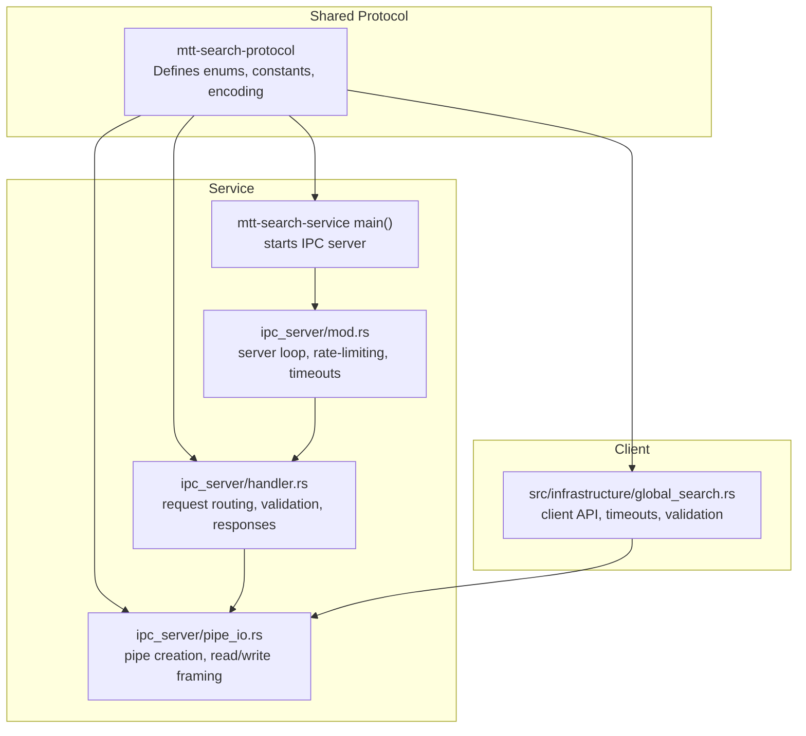
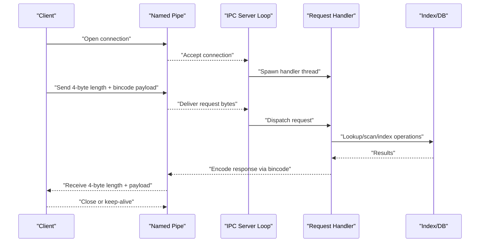
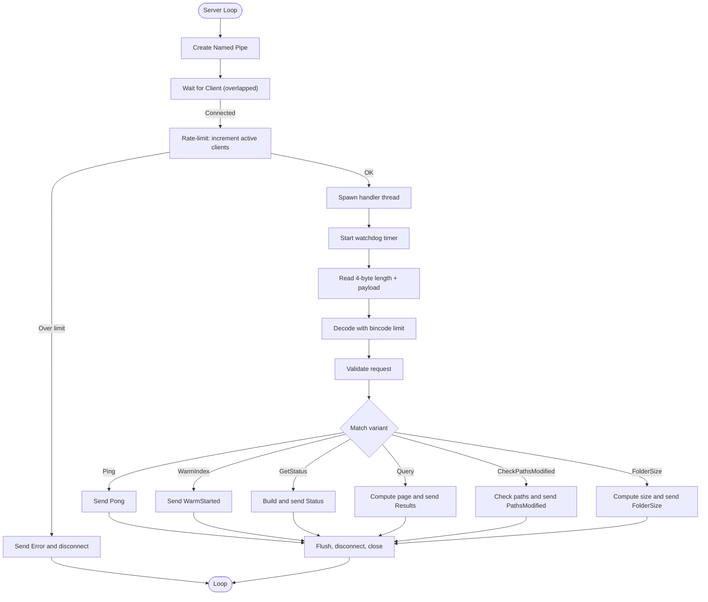
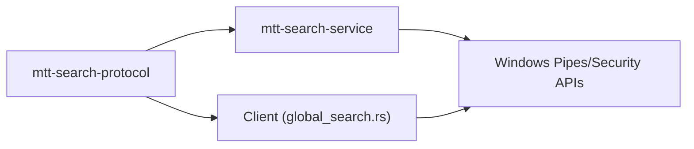

# IPC Protocols

<cite>
**Referenced Files in This Document**
- [lib.rs](file://crates/mtt-search-protocol/src/lib.rs)
- [Cargo.toml](file://crates/mtt-search-protocol/Cargo.toml)
- [main.rs](file://crates/mtt-search-service/src/main.rs)
- [mod.rs](file://crates/mtt-search-service/src/ipc_server/mod.rs)
- [handler.rs](file://crates/mtt-search-service/src/ipc_server/handler.rs)
- [pipe_io.rs](file://crates/mtt-search-service/src/ipc_server/pipe_io.rs)
- [Cargo.toml](file://crates/mtt-search-service/Cargo.toml)
- [global_search.rs](file://src/infrastructure/global_search.rs)
</cite>

## Table of Contents
1. [Introduction](#introduction)
2. [Project Structure](#project-structure)
3. [Core Components](#core-components)
4. [Architecture Overview](#architecture-overview)
5. [Detailed Component Analysis](#detailed-component-analysis)
6. [Dependency Analysis](#dependency-analysis)
7. [Performance Considerations](#performance-considerations)
8. [Troubleshooting Guide](#troubleshooting-guide)
9. [Conclusion](#conclusion)

## Introduction
This document specifies the Inter-Process Communication (IPC) protocol used by the main application and the search service over Windows Named Pipes. It defines the request and response message types, validation rules, transport framing, and operational behavior. The protocol is designed for robustness, security, and high-throughput scenarios typical of desktop search workloads.

## Project Structure
The IPC protocol is defined in a shared crate consumed by both the client and the service. The service exposes a named pipe server that accepts connections, validates requests, and sends responses. The client communicates via the same protocol.

**Diagram sources**
- [lib.rs:1-290](file://crates/mtt-search-protocol/src/lib.rs#L1-L290)
- [main.rs:112-307](file://crates/mtt-search-service/src/main.rs#L112-L307)
- [mod.rs:35-214](file://crates/mtt-search-service/src/ipc_server/mod.rs#L35-L214)
- [handler.rs:111-440](file://crates/mtt-search-service/src/ipc_server/handler.rs#L111-L440)
- [pipe_io.rs:115-257](file://crates/mtt-search-service/src/ipc_server/pipe_io.rs#L115-L257)
- [global_search.rs:1-200](file://src/infrastructure/global_search.rs#L1-L200)

**Section sources**
- [lib.rs:1-290](file://crates/mtt-search-protocol/src/lib.rs#L1-L290)
- [Cargo.toml:1-9](file://crates/mtt-search-protocol/Cargo.toml#L1-L9)
- [main.rs:112-307](file://crates/mtt-search-service/src/main.rs#L112-L307)
- [mod.rs:35-214](file://crates/mtt-search-service/src/ipc_server/mod.rs#L35-L214)
- [handler.rs:111-440](file://crates/mtt-search-service/src/ipc_server/handler.rs#L111-L440)
- [pipe_io.rs:115-257](file://crates/mtt-search-service/src/ipc_server/pipe_io.rs#L115-L257)
- [Cargo.toml:1-33](file://crates/mtt-search-service/Cargo.toml#L1-L33)
- [global_search.rs:1-200](file://src/infrastructure/global_search.rs#L1-L200)

## Core Components
- Pipe naming and transport
  - Pipe name: a Windows named pipe path used by both ends.
  - Transport: byte-stream pipe with 4-byte little-endian length prefix framing and bincode serialization.
- Message types
  - SearchRequest: request variants and parameters.
  - SearchResponse: response variants and payloads.
- Validation and limits
  - Query text length, result items, and path checks are bounded to protect against abuse and resource exhaustion.
- Client API
  - High-level functions for search, warm index, ping, status, path change detection, and folder size queries.

**Section sources**
- [lib.rs:3-185](file://crates/mtt-search-protocol/src/lib.rs#L3-L185)
- [global_search.rs:1-200](file://src/infrastructure/global_search.rs#L1-L200)

## Architecture Overview
The service starts an IPC server that listens on the named pipe. Clients connect, send a framed message, and receive a framed response. The server validates requests, applies rate limiting and timeouts, and routes to handlers that compute results or status.

**Diagram sources**
- [main.rs:298-303](file://crates/mtt-search-service/src/main.rs#L298-L303)
- [mod.rs:35-195](file://crates/mtt-search-service/src/ipc_server/mod.rs#L35-L195)
- [handler.rs:111-440](file://crates/mtt-search-service/src/ipc_server/handler.rs#L111-L440)
- [pipe_io.rs:189-232](file://crates/mtt-search-service/src/ipc_server/pipe_io.rs#L189-L232)
- [lib.rs:165-192](file://crates/mtt-search-protocol/src/lib.rs#L165-L192)

## Detailed Component Analysis

### Transport Protocol
- Pipe naming convention
  - The service announces the pipe name constant; clients use the same constant to connect.
- Framing
  - Each message is preceded by a 4-byte little-endian unsigned integer indicating payload length.
  - Payload is serialized with bincode using fixed-size integers and a strict size limit.
- Read/write behavior
  - The service reads the length prefix, validates it against a maximum payload size, then reads the payload in chunks.
  - Writes are performed in a loop until all bytes are sent; partial writes are handled.
- Security and access
  - The first pipe instance uses a flag to prevent pre-emptive pipe squatting.
  - Access control lists restrict access to authenticated users and LocalSystem.

**Section sources**
- [lib.rs:3-185](file://crates/mtt-search-protocol/src/lib.rs#L3-L185)
- [pipe_io.rs:115-187](file://crates/mtt-search-service/src/ipc_server/pipe_io.rs#L115-L187)
- [pipe_io.rs:189-257](file://crates/mtt-search-service/src/ipc_server/pipe_io.rs#L189-L257)
- [mod.rs:18-32](file://crates/mtt-search-service/src/ipc_server/mod.rs#L18-L32)

### Message Encoding and Decoding
- Encoding
  - Bincode serialization with fixint encoding and explicit payload length.
  - Prepend 4-byte little-endian length prefix.
- Decoding
  - Enforce a strict size limit equal to the buffer size to prevent oversized internal lengths.
  - Deserialize into strongly-typed enums.

**Section sources**
- [lib.rs:165-192](file://crates/mtt-search-protocol/src/lib.rs#L165-L192)

### SearchRequest Enum and Validation
- Variants and parameters
  - Query(text, offset, limit)
  - GetStatus
  - Ping
  - WarmIndex
  - CheckPathsModified(paths, threshold_secs)
  - FolderSize(path)
- Validation rules
  - Query: text length capped at a configured maximum; limit capped at result item maximum.
  - CheckPathsModified: path count capped at a configured maximum.
  - FolderSize: path must be non-empty and within length limits.
- Behavior
  - Requests are validated before processing; invalid requests receive an Error response.

**Section sources**
- [lib.rs:18-88](file://crates/mtt-search-protocol/src/lib.rs#L18-L88)
- [handler.rs:134-138](file://crates/mtt-search-service/src/ipc_server/handler.rs#L134-L138)

### SearchResponse Enum and Validation
- Variants and payloads
  - Results(items, has_more, total_matches?)
  - Status(IndexStatusInfo)
  - Pong
  - WarmStarted
  - PathsModified(modified: Vec<String>)
  - FolderSize(path, total_size, file_count, folder_count)
  - Error(String)
- Validation rules
  - Results: item count capped at result item maximum.
- Behavior
  - Responses are validated before being returned to the client; oversized responses are rejected.

**Section sources**
- [lib.rs:90-132](file://crates/mtt-search-protocol/src/lib.rs#L90-L132)
- [handler.rs:253-271](file://crates/mtt-search-service/src/ipc_server/handler.rs#L253-L271)

### Client API and Timeouts
- Client functions
  - search(query, offset, limit) -> SearchPage
  - warm_index() -> ()
  - ping() -> bool
  - get_status() -> IndexStatusInfo
  - check_paths_modified(paths, threshold_secs) -> Vec<String>
  - folder_size(path) -> (u64, u64, u64)
- Timeouts and polling
  - Read loop polls availability and reads in small chunks with a configurable poll interval.
  - Separate timeouts for search, control, and specialized operations.
- Validation
  - Client-side decoding is followed by response validation to ensure safety.

**Section sources**
- [global_search.rs:22-200](file://src/infrastructure/global_search.rs#L22-L200)
- [global_search.rs:504-580](file://src/infrastructure/global_search.rs#L504-L580)

### Server Control Flow and Security
- Server loop
  - Creates the named pipe with optional first-instance protection.
  - Accepts connections with overlapped I/O and periodic shutdown checks.
  - Enforces rate limiting on active clients and a per-connection I/O timeout to mitigate slowloris-style attacks.
- Request handling
  - Reads the message, decodes, validates, and dispatches to handlers.
  - Applies additional security checks (e.g., impersonation for path checks).
- Response sending
  - Encodes responses using the shared protocol and writes them to the pipe.

**Diagram sources**
- [mod.rs:35-214](file://crates/mtt-search-service/src/ipc_server/mod.rs#L35-L214)
- [handler.rs:111-440](file://crates/mtt-search-service/src/ipc_server/handler.rs#L111-L440)
- [pipe_io.rs:189-232](file://crates/mtt-search-service/src/ipc_server/pipe_io.rs#L189-L232)

**Section sources**
- [mod.rs:35-214](file://crates/mtt-search-service/src/ipc_server/mod.rs#L35-L214)
- [handler.rs:111-440](file://crates/mtt-search-service/src/ipc_server/handler.rs#L111-L440)
- [pipe_io.rs:189-232](file://crates/mtt-search-service/src/ipc_server/pipe_io.rs#L189-L232)

## Dependency Analysis
- Shared protocol crate
  - Provides enums, constants, and encoding/decoding functions used by both client and service.
- Service crate
  - Depends on the protocol crate and Windows APIs for pipes and security.
  - Implements the server loop, handler logic, and pipe I/O.
- Client module
  - Depends on the protocol crate and Windows APIs for pipe operations.
  - Implements the public client API and integrates with the application.

**Diagram sources**
- [Cargo.toml:1-9](file://crates/mtt-search-protocol/Cargo.toml#L1-L9)
- [Cargo.toml:1-33](file://crates/mtt-search-service/Cargo.toml#L1-L33)
- [lib.rs:1-290](file://crates/mtt-search-protocol/src/lib.rs#L1-L290)
- [main.rs:112-307](file://crates/mtt-search-service/src/main.rs#L112-L307)
- [global_search.rs:1-200](file://src/infrastructure/global_search.rs#L1-L200)

**Section sources**
- [Cargo.toml:1-9](file://crates/mtt-search-protocol/Cargo.toml#L1-L9)
- [Cargo.toml:1-33](file://crates/mtt-search-service/Cargo.toml#L1-L33)
- [lib.rs:1-290](file://crates/mtt-search-protocol/src/lib.rs#L1-L290)
- [main.rs:112-307](file://crates/mtt-search-service/src/main.rs#L112-L307)
- [global_search.rs:1-200](file://src/infrastructure/global_search.rs#L1-L200)

## Performance Considerations
- Throughput and batching
  - Use Query with appropriate offset and limit to page results efficiently.
  - WarmIndex can be triggered to bring frequently accessed index pages into RAM.
- Concurrency and rate limiting
  - The server limits concurrent clients to prevent overload; clients should retry on rejection.
- Timeouts
  - Configure client timeouts according to workload: search queries, path checks, and folder size requests have different expected durations.
- Serialization overhead
  - Bincode with fixint encoding is compact; keep payloads minimal and avoid unnecessary fields.

[No sources needed since this section provides general guidance]

## Troubleshooting Guide
- Common error categories
  - Invalid request: occurs when validation fails (e.g., oversized text, too many paths).
  - Authorization failures: path checks require impersonation; failures indicate insufficient permissions.
  - Server busy: rate-limited when too many clients are connected.
  - Pipe errors: transient conditions such as “no process on the other end” or “pipe closed.”
- Diagnostic tips
  - Use ping to detect liveness; transient errors may indicate temporary pipe issues.
  - For FolderSize, ensure the volume is indexed and sizes are loaded.
  - Inspect server logs for redacted status and error summaries.

**Section sources**
- [handler.rs:124-138](file://crates/mtt-search-service/src/ipc_server/handler.rs#L124-L138)
- [handler.rs:264-270](file://crates/mtt-search-service/src/ipc_server/handler.rs#L264-L270)
- [handler.rs:342-348](file://crates/mtt-search-service/src/ipc_server/handler.rs#L342-L348)
- [handler.rs:364-373](file://crates/mtt-search-service/src/ipc_server/handler.rs#L364-L373)
- [global_search.rs:81-130](file://src/infrastructure/global_search.rs#L81-L130)

## Conclusion
The IPC protocol provides a secure, validated, and efficient communication channel between the main application and the search service. Its design emphasizes safety through strict limits and validation, robustness via timeouts and rate limiting, and performance through careful framing and serialization. The documented request and response semantics enable reliable integration and predictable behavior across varied workloads.