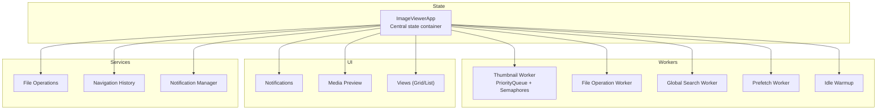
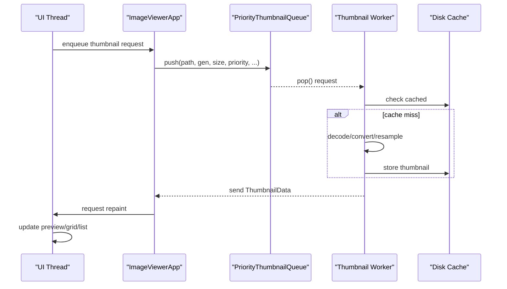
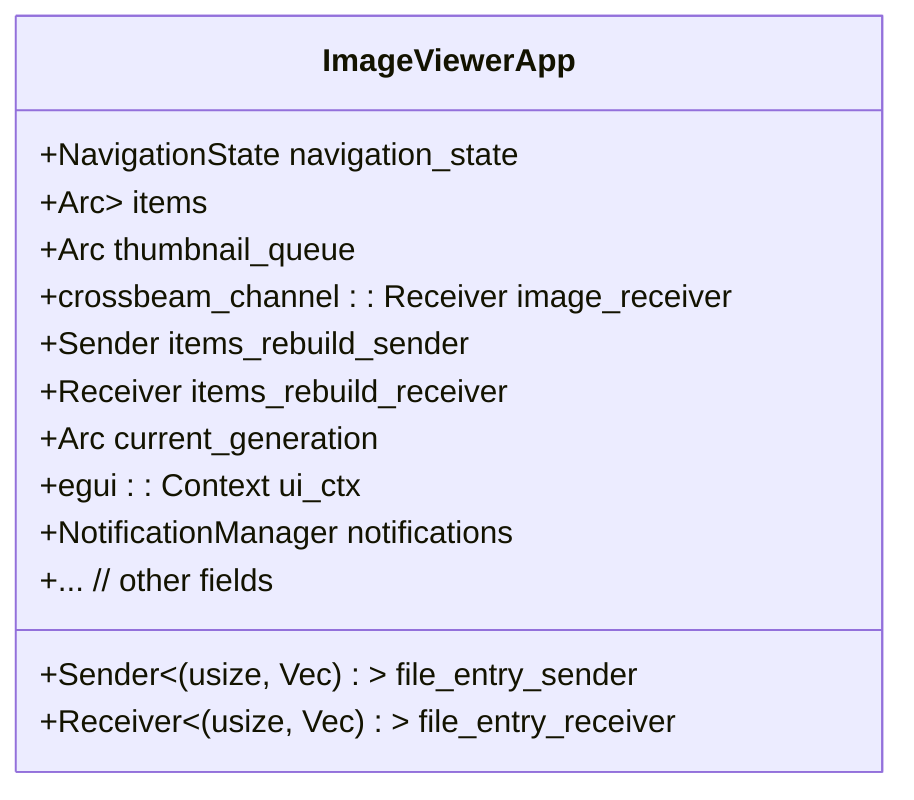
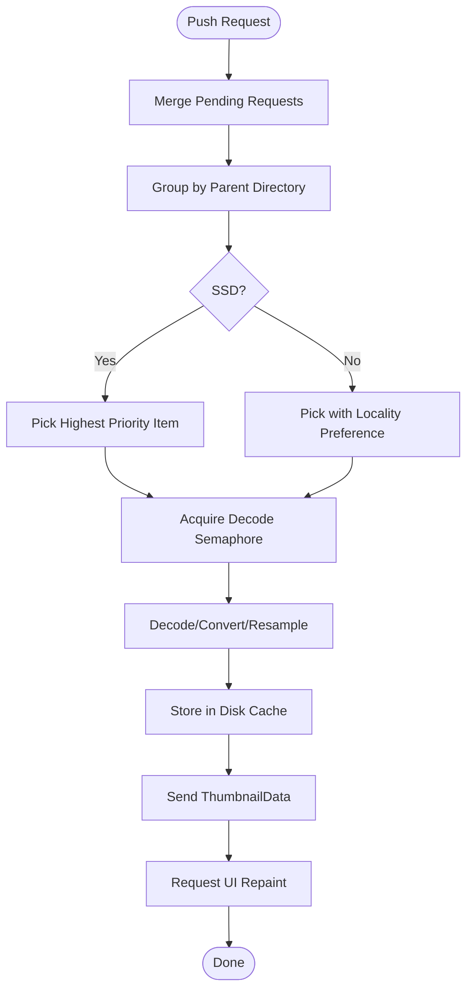
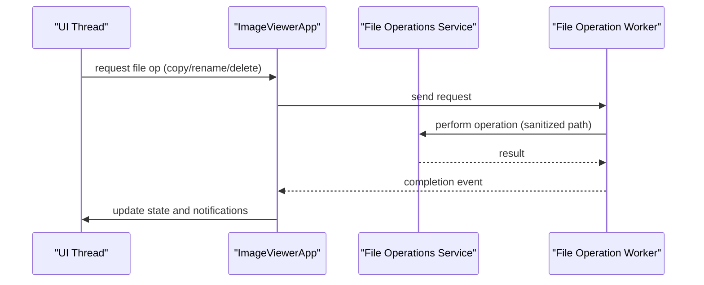
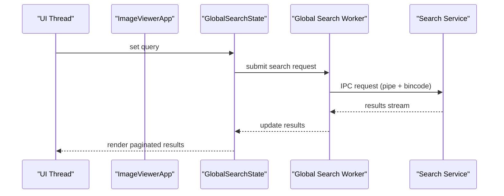
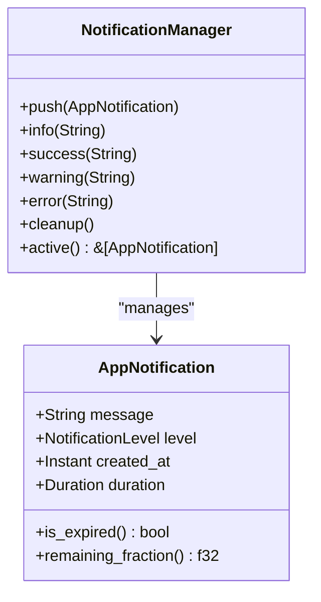
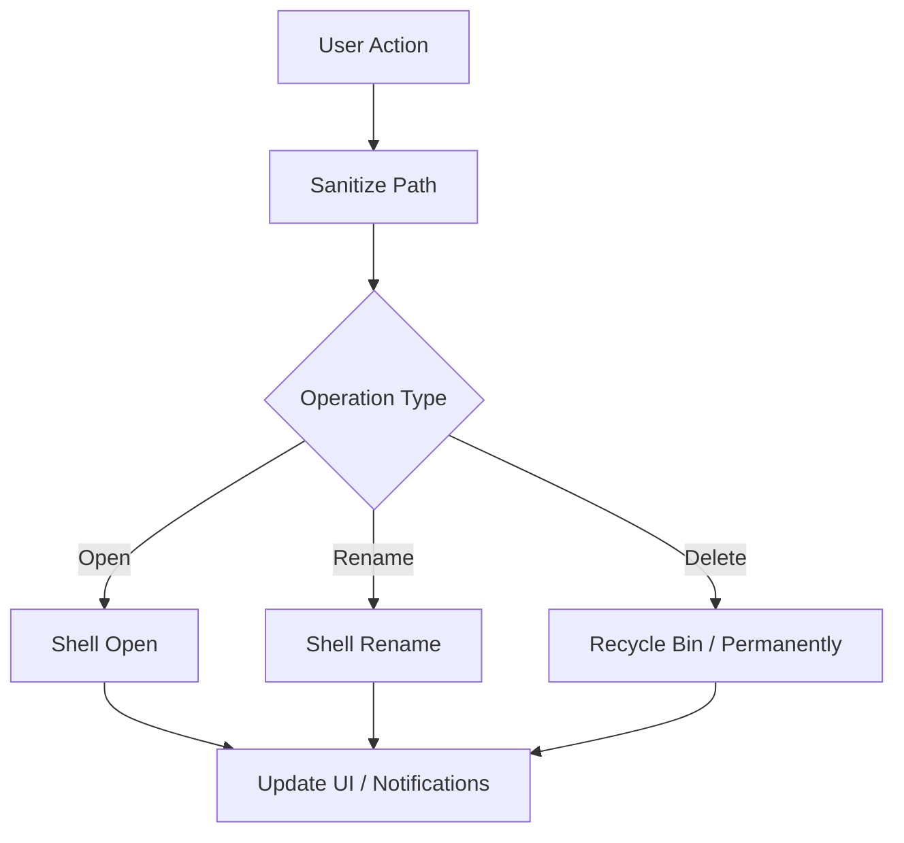
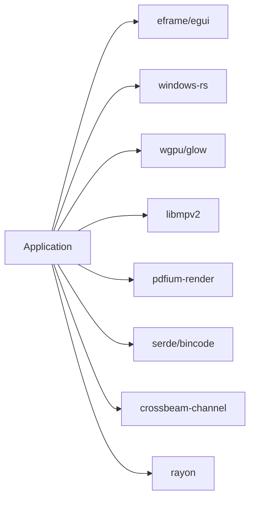

# Internal Application APIs

<cite>
**Referenced Files in This Document**
- [README.md](file://README.md)
- [Cargo.toml](file://Cargo.toml)
- [src/app/state/mod.rs](file://src/app/state/mod.rs)
- [src/app/state/helpers.rs](file://src/app/state/helpers.rs)
- [src/workers/mod.rs](file://src/workers/mod.rs)
- [src/workers/thumbnail/mod.rs](file://src/workers/thumbnail/mod.rs)
- [src/workers/thumbnail/worker.rs](file://src/workers/thumbnail/worker.rs)
- [src/workers/thumbnail/queue.rs](file://src/workers/thumbnail/queue.rs)
- [src/application/notification.rs](file://src/application/notification.rs)
- [src/ui/components/mod.rs](file://src/ui/components/mod.rs)
- [src/application/file_operations.rs](file://src/application/file_operations.rs)
- [src/application/navigation.rs](file://src/application/navigation.rs)
- [src/domain/mod.rs](file://src/domain/mod.rs)
</cite>

## Table of Contents
1. [Introduction](#introduction)
2. [Project Structure](#project-structure)
3. [Core Components](#core-components)
4. [Architecture Overview](#architecture-overview)
5. [Detailed Component Analysis](#detailed-component-analysis)
6. [Dependency Analysis](#dependency-analysis)
7. [Performance Considerations](#performance-considerations)
8. [Troubleshooting Guide](#troubleshooting-guide)
9. [Conclusion](#conclusion)
10. [Appendices](#appendices)

## Introduction
This document describes the internal APIs and interfaces used within the MTT File Manager application. It focuses on:
- State management interfaces and thread-safe access patterns
- Worker communication protocols for thumbnails, file operations, and global search
- UI component interfaces and state synchronization
- Application service interfaces for file operations, navigation, and notifications
- Extension points and integration patterns

The goal is to enable contributors to safely extend functionality while preserving responsiveness, correctness, and performance.

## Project Structure
The application is organized around a central state container, worker subsystems, UI components, and domain/service layers. Key areas:
- Central state: a comprehensive struct aggregates UI state, worker channels, caches, and observers
- Workers: background systems for thumbnails, file operations, global search, prefetch, and idle warmup
- UI: immediate-mode GUI with layered components, notifications, and preview panels
- Services: file operations, navigation history, and notification delivery
- Domain: shared types and business entities

**Diagram sources**
- [src/app/state/mod.rs:65-435](file://src/app/state/mod.rs#L65-L435)
- [src/workers/mod.rs:1-9](file://src/workers/mod.rs#L1-L9)
- [src/ui/components/mod.rs:1-18](file://src/ui/components/mod.rs#L1-L18)
- [src/application/file_operations.rs:1-333](file://src/application/file_operations.rs#L1-L333)
- [src/application/navigation.rs:1-180](file://src/application/navigation.rs#L1-L180)
- [src/application/notification.rs:109-161](file://src/application/notification.rs#L109-L161)

**Section sources**
- [README.md:1-287](file://README.md#L1-L287)
- [Cargo.toml:1-137](file://Cargo.toml#L1-L137)

## Core Components
- Central state container: holds UI state, worker channels, caches, and observers; designed for efficient cloning and cross-thread sharing
- Worker subsystems: modular background processors for thumbnails, file operations, global search, prefetch, and idle tasks
- UI components: notifications, media preview, and views with virtualization and GPU upload coordination
- Application services: file operations, navigation history, and notification delivery

Key responsibilities:
- State management: thread-safe access via channels, atomic counters, and shared caches
- Worker communication: typed queues, progress tracking, and backpressure
- UI synchronization: repaint triggers, visibility-aware updates, and debouncing
- Services: secure path handling, history bounds, and notification lifecycles

**Section sources**
- [src/app/state/mod.rs:65-435](file://src/app/state/mod.rs#L65-L435)
- [src/workers/mod.rs:1-9](file://src/workers/mod.rs#L1-L9)
- [src/ui/components/mod.rs:1-18](file://src/ui/components/mod.rs#L1-L18)
- [src/application/file_operations.rs:1-333](file://src/application/file_operations.rs#L1-L333)
- [src/application/navigation.rs:1-180](file://src/application/navigation.rs#L1-L180)
- [src/application/notification.rs:109-161](file://src/application/notification.rs#L109-L161)

## Architecture Overview
The system uses a central state container with explicit channels for worker/UI communication. Workers are spawned with concurrency limits and backpressure controls. UI updates are coordinated via repaint triggers and visibility-aware logic.

**Diagram sources**
- [src/app/state/mod.rs:77-83](file://src/app/state/mod.rs#L77-L83)
- [src/workers/thumbnail/queue.rs:67-116](file://src/workers/thumbnail/queue.rs#L67-L116)
- [src/workers/thumbnail/worker.rs:192-289](file://src/workers/thumbnail/worker.rs#L192-L289)
- [src/workers/thumbnail/mod.rs:17-24](file://src/workers/thumbnail/mod.rs#L17-L24)

## Detailed Component Analysis

### State Management Interfaces
The central state container aggregates UI state, worker channels, caches, and observers. It supports:
- Thread-safe access patterns: shared references, atomic counters, and channels
- Mutation protocols: controlled updates via channels and immutable snapshots
- Observer registration: repaint triggers and debounced UI updates

Key elements:
- Channels for thumbnail, metadata, icon, and file operation results
- Shared caches for disk state, directory indices, and UI assets
- Generation counters and visibility-aware buffers for smooth updates
- Debounce and throttle mechanisms for watchers, memory maintenance, and UI responsiveness

**Diagram sources**
- [src/app/state/mod.rs:65-435](file://src/app/state/mod.rs#L65-L435)

**Section sources**
- [src/app/state/mod.rs:65-435](file://src/app/state/mod.rs#L65-L435)
- [src/app/state/helpers.rs:7-197](file://src/app/state/helpers.rs#L7-L197)

### Worker Communication Protocols

#### Thumbnail Worker System
The thumbnail pipeline is multi-stage and prioritized:
- Priority queue with directory grouping for HDD locality and per-request merging
- Concurrency control via semaphores and virtual drive gating
- Backpressure and failure tracking with exponential backoff
- Progress tracking for bulk scans and completion counters

**Diagram sources**
- [src/workers/thumbnail/queue.rs:118-178](file://src/workers/thumbnail/queue.rs#L118-L178)
- [src/workers/thumbnail/queue.rs:310-481](file://src/workers/thumbnail/queue.rs#L310-L481)
- [src/workers/thumbnail/worker.rs:192-289](file://src/workers/thumbnail/worker.rs#L192-L289)
- [src/workers/thumbnail/mod.rs:71-147](file://src/workers/thumbnail/mod.rs#L71-L147)

**Section sources**
- [src/workers/thumbnail/queue.rs:1-559](file://src/workers/thumbnail/queue.rs#L1-L559)
- [src/workers/thumbnail/worker.rs:1-338](file://src/workers/thumbnail/worker.rs#L1-L338)
- [src/workers/thumbnail/mod.rs:1-148](file://src/workers/thumbnail/mod.rs#L1-L148)

#### File Operation Worker Interface
File operations are executed via a background worker channel to keep the UI responsive. The service layer provides secure path sanitization and Windows Shell integration.

**Diagram sources**
- [src/application/file_operations.rs:93-102](file://src/application/file_operations.rs#L93-L102)
- [src/application/file_operations.rs:121-152](file://src/application/file_operations.rs#L121-L152)

**Section sources**
- [src/application/file_operations.rs:1-333](file://src/application/file_operations.rs#L1-L333)

#### Global Search Worker Interface
The global search worker integrates with a dedicated search service via named pipes and bincode serialization. The UI state tracks query, results, and pagination.

**Diagram sources**
- [src/app/state/mod.rs:414-416](file://src/app/state/mod.rs#L414-L416)
- [Cargo.toml:49-50](file://Cargo.toml#L49-L50)

**Section sources**
- [src/app/state/mod.rs:414-416](file://src/app/state/mod.rs#L414-L416)
- [Cargo.toml:49-50](file://Cargo.toml#L49-L50)

### UI Component Interfaces
The UI uses an immediate-mode framework with layered components:
- Notifications: toast messages with severity levels and auto-expiry
- Media preview: docked/fullscreen player with keyboard focus rules
- Views: grid and list with virtualization, prefetch, and GPU upload coordination

State synchronization mechanisms:
- Repaint triggers via the UI context
- Visibility-aware updates and pending buffers
- Debounce policies for keyboard navigation and paste operations

**Diagram sources**
- [src/application/notification.rs:109-161](file://src/application/notification.rs#L109-L161)

**Section sources**
- [src/application/notification.rs:1-161](file://src/application/notification.rs#L1-L161)
- [src/ui/components/mod.rs:1-18](file://src/ui/components/mod.rs#L1-L18)
- [src/app/state/helpers.rs:77-161](file://src/app/state/helpers.rs#L77-L161)

### Application Service Interfaces
- File operations: secure path sanitization, Windows Shell integration, and COM apartment management
- Navigation: bounded history with MRU tracking and timeline traversal
- Notifications: severity-based styling, auto-expiry, and batch cleanup

**Diagram sources**
- [src/application/file_operations.rs:93-102](file://src/application/file_operations.rs#L93-L102)
- [src/application/file_operations.rs:121-152](file://src/application/file_operations.rs#L121-L152)
- [src/application/navigation.rs:20-118](file://src/application/navigation.rs#L20-L118)

**Section sources**
- [src/application/file_operations.rs:1-333](file://src/application/file_operations.rs#L1-L333)
- [src/application/navigation.rs:1-180](file://src/application/navigation.rs#L1-L180)
- [src/application/notification.rs:109-161](file://src/application/notification.rs#L109-L161)

## Dependency Analysis
The application relies on a focused set of external crates for Windows integration, GPU rendering, concurrency, and IPC. Notable dependencies include:
- Immediate-mode GUI and GPU backends
- Windows API bindings for shell, media foundation, and system services
- Concurrency primitives and crossbeam channels
- IPC protocol and serialization for search service integration

**Diagram sources**
- [Cargo.toml:15-109](file://Cargo.toml#L15-L109)

**Section sources**
- [Cargo.toml:1-137](file://Cargo.toml#L1-L137)

## Performance Considerations
- Concurrency and backpressure: worker counts and decode limits adapt to CPU cores; semaphores cap peak memory use
- Disk locality: directory grouping minimizes HDD seeks; SSD paths bypass grouping
- Memory management: LRU caches, pending queue limits, and aggressive trimming during high memory pressure
- Visibility-aware updates: pending buffers and visible range tracking reduce unnecessary work
- IO priority: background priority for thumbnail workers to reduce contention with playback

[No sources needed since this section provides general guidance]

## Troubleshooting Guide
Common issues and remedies:
- Thumbnail extraction failures: transient failures use exponential backoff; permanent failures are tracked separately; clear caches to retry
- UI stutters during video playback: docked video playback triggers upload throttling; restore burst mode accelerates cache refill after OS paging
- Memory growth: periodic memory maintenance trims caches and clears non-visible assets; adjust thresholds if needed
- Watcher drift on non-USN filesystems: adaptive consistency probes and fallback polling mitigate missed events

**Section sources**
- [src/workers/thumbnail/mod.rs:71-147](file://src/workers/thumbnail/mod.rs#L71-L147)
- [src/app/state/helpers.rs:77-161](file://src/app/state/helpers.rs#L77-L161)
- [src/app/state/mod.rs:203-249](file://src/app/state/mod.rs#L203-L249)

## Conclusion
The MTT File Manager employs a robust, multi-layered architecture centered on a thread-safe state container and efficient worker subsystems. Clear separation of concerns enables scalable UI updates, reliable background processing, and secure file operations. The documented APIs and patterns provide a solid foundation for extending functionality while maintaining performance and stability.

[No sources needed since this section summarizes without analyzing specific files]

## Appendices

### API Usage Guidelines
- State mutations: always use channels or shared atomic counters; avoid direct mutable access from UI
- Worker submissions: prefer priority queues with generation tracking; merge pending requests to reduce churn
- UI updates: request repaints judiciously; leverage visibility-aware buffers and debouncing
- Notifications: use severity-appropriate levels; set durations based on urgency; clean up expired entries

[No sources needed since this section provides general guidance]