# Windows API Interfaces

<cite>
**Referenced Files in This Document**
- [mod.rs](file://src/infrastructure/windows/mod.rs)
- [shell_operations.rs](file://src/infrastructure/windows/shell_operations.rs)
- [context_menu.rs](file://src/infrastructure/windows/shell_operations/context_menu.rs)
- [file_op.rs](file://src/infrastructure/windows/shell_operations/file_op.rs)
- [shfile_ops.rs](file://src/infrastructure/windows/shell_operations/shfile_ops.rs)
- [file_system.rs](file://src/infrastructure/windows/file_system.rs)
- [drives.rs](file://src/infrastructure/windows/drives.rs)
- [system_info.rs](file://src/infrastructure/windows/system_info.rs)
- [codec_registry.rs](file://src/infrastructure/windows/codec_registry.rs)
- [known_codecs.rs](file://src/infrastructure/windows/codec_registry/known_codecs.rs)
- [mf_queries.rs](file://src/infrastructure/windows/codec_registry/mf_queries.rs)
- [registry_queries.rs](file://src/infrastructure/windows/codec_registry/registry_queries.rs)
- [media_foundation.rs](file://src/infrastructure/windows/media_foundation.rs)
- [com_scope.rs](file://src/infrastructure/windows/com_scope.rs)
- [main.rs](file://crates/mtt-search-service/src/main.rs)
- [Cargo.toml](file://crates/mtt-search-service/Cargo.toml)
</cite>

## Table of Contents
1. [Introduction](#introduction)
2. [Project Structure](#project-structure)
3. [Core Components](#core-components)
4. [Architecture Overview](#architecture-overview)
5. [Detailed Component Analysis](#detailed-component-analysis)
6. [Dependency Analysis](#dependency-analysis)
7. [Performance Considerations](#performance-considerations)
8. [Troubleshooting Guide](#troubleshooting-guide)
9. [Conclusion](#conclusion)

## Introduction
This document describes the Windows API integration points implemented in the project, focusing on:
- Shell operations: file operations (copy, move, delete, rename), context menu integration, and shell namespace manipulation
- File system operations: NTFS-specific features, USN journal integration, and drive enumeration
- Windows service integration for the search service: installation, startup parameters, and inter-process communication
- Windows-specific utilities: codec registry queries, Media Foundation integration, and system information retrieval
- COM interface usage patterns, handle management, and error handling strategies specific to Windows API calls

## Project Structure
The Windows integration is organized under a dedicated module tree with clear separation of concerns:
- Shell operations: context menus, IFileOperation-based file operations, and SHFileOperation-based operations
- File system utilities: attribute checks, Windows path detection, and low-level Windows APIs
- Drive and volume utilities: volume label rename, drive enumeration, filesystem detection, and USN capability checks
- System information: drive type detection and memory usage
- Codec registry: dynamic codec name resolution via Media Foundation and registry
- Media Foundation: video metadata extraction as a robust fallback
- COM scope: RAII wrappers for COM initialization
- Search service: Windows service integration, IPC server, and volume indexing

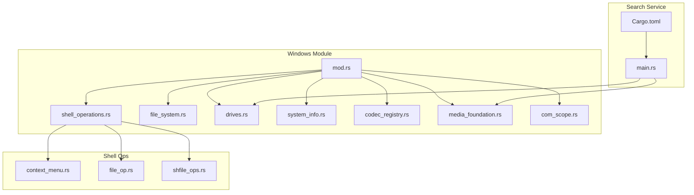

**Diagram sources**
- [mod.rs:1-60](file://src/infrastructure/windows/mod.rs#L1-L60)
- [shell_operations.rs:1-15](file://src/infrastructure/windows/shell_operations.rs#L1-L15)
- [context_menu.rs:1-194](file://src/infrastructure/windows/shell_operations/context_menu.rs#L1-L194)
- [file_op.rs:1-245](file://src/infrastructure/windows/shell_operations/file_op.rs#L1-L245)
- [shfile_ops.rs:1-242](file://src/infrastructure/windows/shell_operations/shfile_ops.rs#L1-L242)
- [file_system.rs:1-43](file://src/infrastructure/windows/file_system.rs#L1-L43)
- [drives.rs:1-550](file://src/infrastructure/windows/drives.rs#L1-L550)
- [system_info.rs:1-100](file://src/infrastructure/windows/system_info.rs#L1-L100)
- [codec_registry.rs:1-444](file://src/infrastructure/windows/codec_registry.rs#L1-L444)
- [media_foundation.rs:1-439](file://src/infrastructure/windows/media_foundation.rs#L1-L439)
- [com_scope.rs:1-41](file://src/infrastructure/windows/com_scope.rs#L1-L41)
- [main.rs:1-389](file://crates/mtt-search-service/src/main.rs#L1-L389)
- [Cargo.toml:1-33](file://crates/mtt-search-service/Cargo.toml#L1-L33)

**Section sources**
- [mod.rs:1-60](file://src/infrastructure/windows/mod.rs#L1-L60)
- [shell_operations.rs:1-15](file://src/infrastructure/windows/shell_operations.rs#L1-L15)
- [drives.rs:1-550](file://src/infrastructure/windows/drives.rs#L1-L550)
- [main.rs:1-389](file://crates/mtt-search-service/src/main.rs#L1-L389)

## Core Components
- Shell operations
  - Context menu integration via COM-based IShellFolder and IContextMenu
  - Robust file operations using IFileOperation with fallback to SHFileOperation
  - Single and batch copy/move/delete/rename operations with progress dialogs and undo support
- File system utilities
  - Attribute checks, directory/file detection, and Windows system path suppression
- Drive and volume utilities
  - Volume label rename with elevation handling and helper process orchestration
  - Drive enumeration, volume information retrieval, and filesystem capability checks
- System information
  - Drive type classification and current process memory usage
- Codec registry
  - Dynamic codec name resolution using Media Foundation, registry, and known mappings
- Media Foundation
  - Video metadata extraction via IMFSourceReader with COM and MF guards
- COM scope
  - RAII wrappers for COM initialization and uninitialization
- Search service
  - Windows service control, console mode, and IPC server with shared state

**Section sources**
- [context_menu.rs:1-194](file://src/infrastructure/windows/shell_operations/context_menu.rs#L1-L194)
- [file_op.rs:1-245](file://src/infrastructure/windows/shell_operations/file_op.rs#L1-L245)
- [shfile_ops.rs:1-242](file://src/infrastructure/windows/shell_operations/shfile_ops.rs#L1-L242)
- [file_system.rs:1-43](file://src/infrastructure/windows/file_system.rs#L1-L43)
- [drives.rs:1-550](file://src/infrastructure/windows/drives.rs#L1-L550)
- [system_info.rs:1-100](file://src/infrastructure/windows/system_info.rs#L1-L100)
- [codec_registry.rs:1-444](file://src/infrastructure/windows/codec_registry.rs#L1-L444)
- [media_foundation.rs:1-439](file://src/infrastructure/windows/media_foundation.rs#L1-L439)
- [com_scope.rs:1-41](file://src/infrastructure/windows/com_scope.rs#L1-L41)
- [main.rs:112-307](file://crates/mtt-search-service/src/main.rs#L112-L307)

## Architecture Overview
The Windows integration follows a layered architecture:
- Low-level Windows API wrappers (attributes, drives, system info)
- Shell operation abstractions (COM-based and SHFileOperation-based)
- Utility modules (codec registry, Media Foundation)
- Service layer (search service) orchestrating indexing and IPC

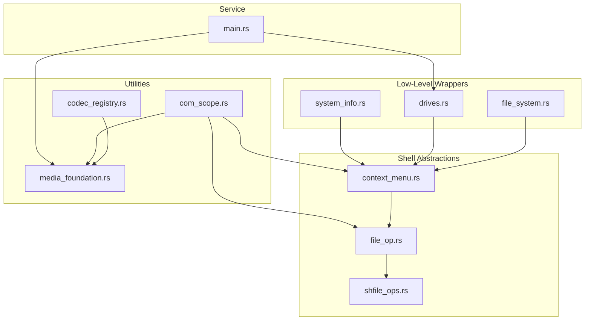

**Diagram sources**
- [file_system.rs:1-43](file://src/infrastructure/windows/file_system.rs#L1-L43)
- [drives.rs:1-550](file://src/infrastructure/windows/drives.rs#L1-L550)
- [system_info.rs:1-100](file://src/infrastructure/windows/system_info.rs#L1-L100)
- [context_menu.rs:1-194](file://src/infrastructure/windows/shell_operations/context_menu.rs#L1-L194)
- [file_op.rs:1-245](file://src/infrastructure/windows/shell_operations/file_op.rs#L1-L245)
- [shfile_ops.rs:1-242](file://src/infrastructure/windows/shell_operations/shfile_ops.rs#L1-L242)
- [codec_registry.rs:1-444](file://src/infrastructure/windows/codec_registry.rs#L1-L444)
- [media_foundation.rs:1-439](file://src/infrastructure/windows/media_foundation.rs#L1-L439)
- [com_scope.rs:1-41](file://src/infrastructure/windows/com_scope.rs#L1-L41)
- [main.rs:190-307](file://crates/mtt-search-service/src/main.rs#L190-L307)

## Detailed Component Analysis

### Shell Operations: Context Menu Integration
This component integrates with the native Windows shell to show context menus and invoke commands. It uses COM initialization, PIDL management, and IContextMenu to populate and execute shell commands.

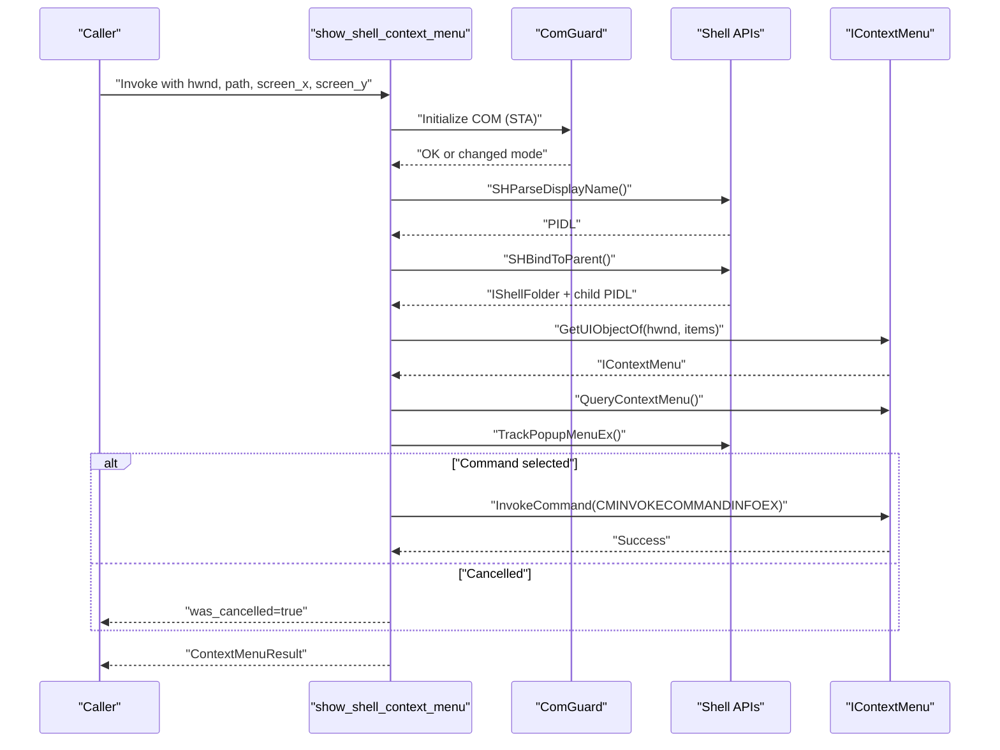

**Diagram sources**
- [context_menu.rs:75-193](file://src/infrastructure/windows/shell_operations/context_menu.rs#L75-L193)

**Section sources**
- [context_menu.rs:1-194](file://src/infrastructure/windows/shell_operations/context_menu.rs#L1-L194)

### Shell Operations: IFileOperation and SHFileOperation
This component provides robust file operations with fallbacks:
- IFileOperation-based copy/move supporting virtual paths and progress dialogs
- SHFileOperation-based single/batch operations with undo support and confirmation dialogs

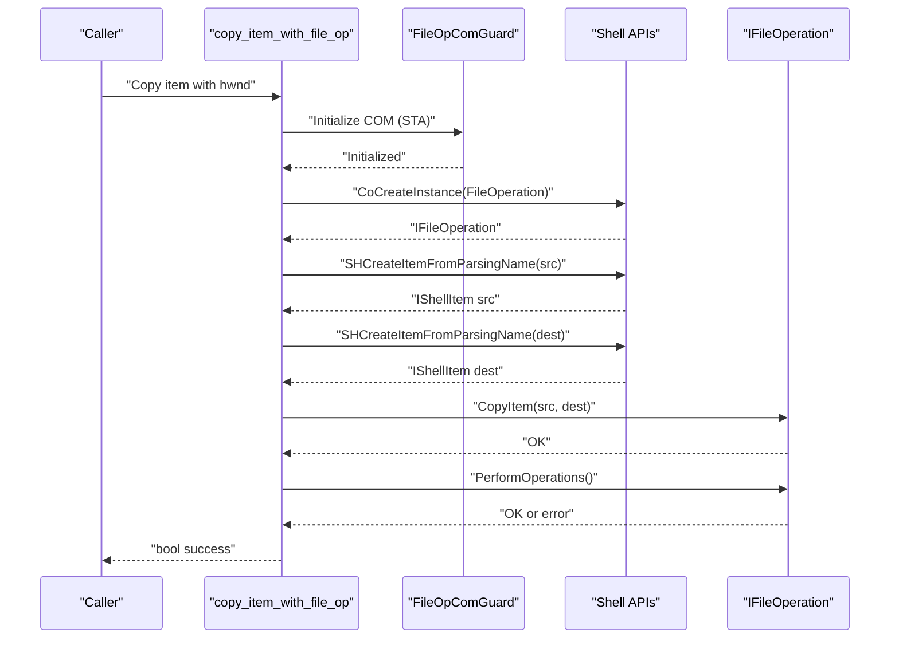

**Diagram sources**
- [file_op.rs:31-71](file://src/infrastructure/windows/shell_operations/file_op.rs#L31-L71)

**Section sources**
- [file_op.rs:1-245](file://src/infrastructure/windows/shell_operations/file_op.rs#L1-L245)
- [shfile_ops.rs:1-242](file://src/infrastructure/windows/shell_operations/shfile_ops.rs#L1-L242)

### File System Utilities
Provides low-level file attribute checks and Windows system path detection.

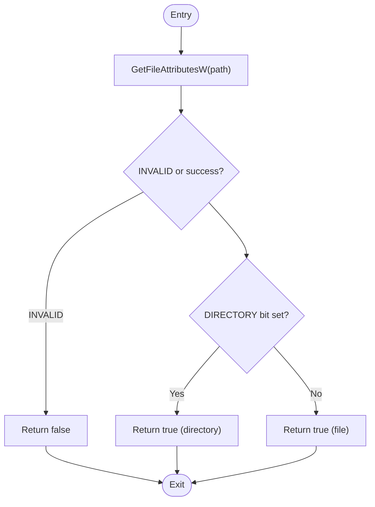

**Diagram sources**
- [file_system.rs:8-31](file://src/infrastructure/windows/file_system.rs#L8-L31)

**Section sources**
- [file_system.rs:1-43](file://src/infrastructure/windows/file_system.rs#L1-L43)

### Drive and Volume Utilities
Handles volume label rename with elevation, drive enumeration, and filesystem capability checks.

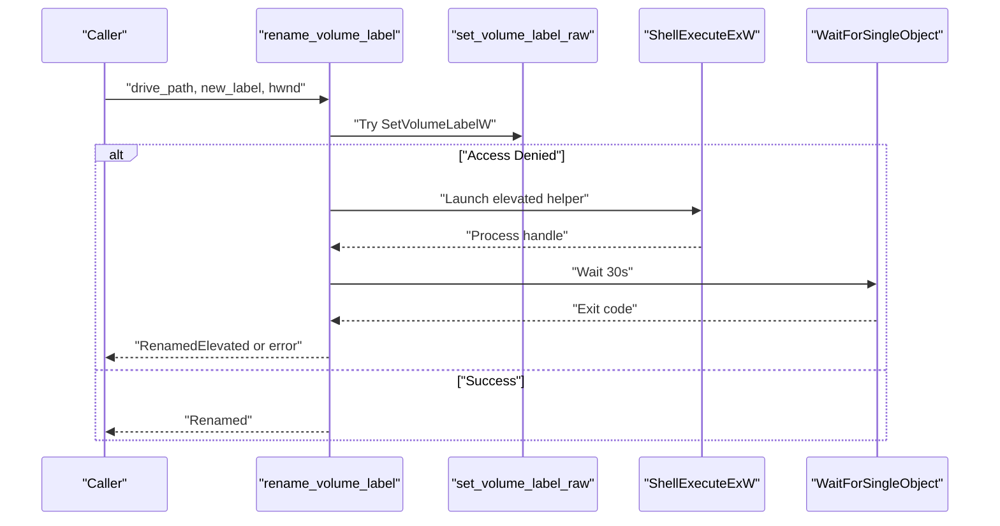

**Diagram sources**
- [drives.rs:278-300](file://src/infrastructure/windows/drives.rs#L278-L300)
- [drives.rs:193-276](file://src/infrastructure/windows/drives.rs#L193-L276)

**Section sources**
- [drives.rs:1-550](file://src/infrastructure/windows/drives.rs#L1-L550)

### System Information
Provides drive type classification and current process memory usage.

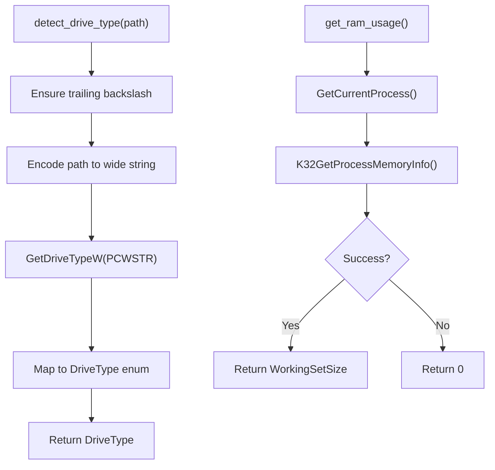

**Diagram sources**
- [system_info.rs:64-81](file://src/infrastructure/windows/system_info.rs#L64-L81)
- [system_info.rs:84-99](file://src/infrastructure/windows/system_info.rs#L84-L99)

**Section sources**
- [system_info.rs:1-100](file://src/infrastructure/windows/system_info.rs#L1-L100)

### Codec Registry Integration
Resolves codec GUIDs to human-readable names using multiple strategies with caching.

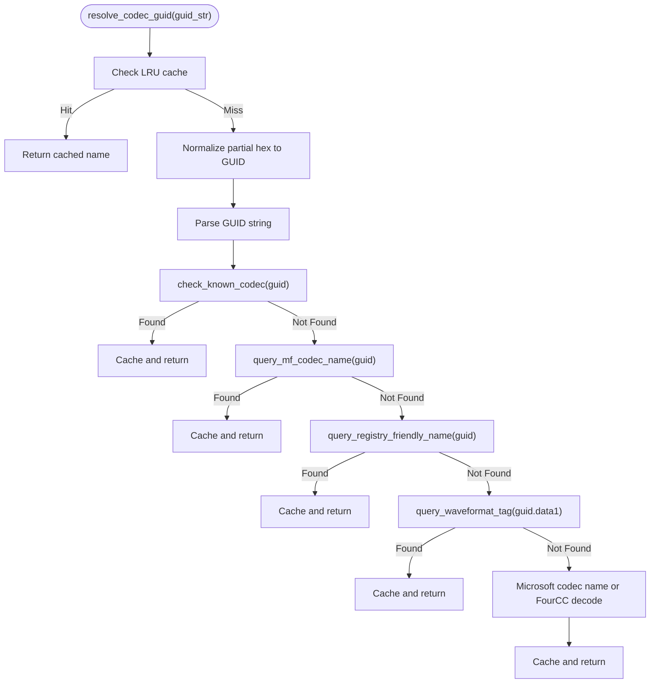

**Diagram sources**
- [codec_registry.rs:57-167](file://src/infrastructure/windows/codec_registry.rs#L57-L167)
- [known_codecs.rs](file://src/infrastructure/windows/codec_registry/known_codecs.rs)
- [mf_queries.rs](file://src/infrastructure/windows/codec_registry/mf_queries.rs)
- [registry_queries.rs](file://src/infrastructure/windows/codec_registry/registry_queries.rs)

**Section sources**
- [codec_registry.rs:1-444](file://src/infrastructure/windows/codec_registry.rs#L1-L444)

### Media Foundation Integration
Extracts video metadata using IMFSourceReader with COM and MediaFoundation guards.

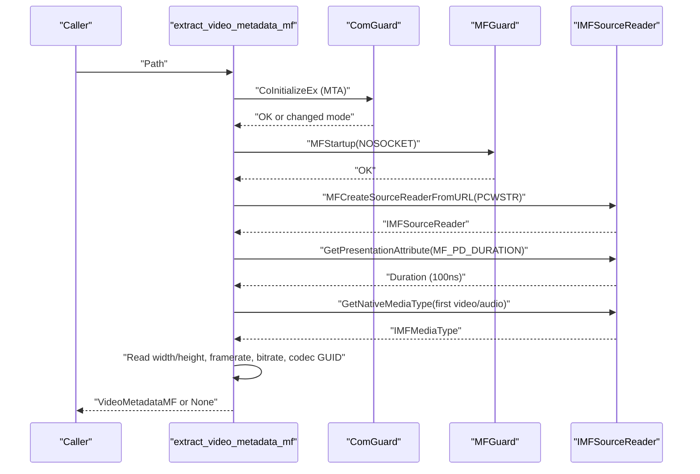

**Diagram sources**
- [media_foundation.rs:104-144](file://src/infrastructure/windows/media_foundation.rs#L104-L144)
- [media_foundation.rs:152-231](file://src/infrastructure/windows/media_foundation.rs#L152-L231)

**Section sources**
- [media_foundation.rs:1-439](file://src/infrastructure/windows/media_foundation.rs#L1-L439)

### COM Scope and Handle Management
RAII wrappers ensure proper COM initialization and uninitialization, preventing leaks.

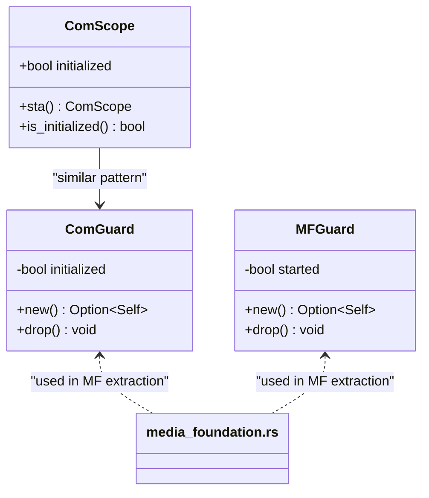

**Diagram sources**
- [com_scope.rs:1-41](file://src/infrastructure/windows/com_scope.rs#L1-L41)
- [media_foundation.rs:42-98](file://src/infrastructure/windows/media_foundation.rs#L42-L98)

**Section sources**
- [com_scope.rs:1-41](file://src/infrastructure/windows/com_scope.rs#L1-L41)
- [media_foundation.rs:42-98](file://src/infrastructure/windows/media_foundation.rs#L42-L98)

### Windows Service Integration (Search Service)
The search service integrates with Windows SCM, supports console mode, and runs an IPC server.

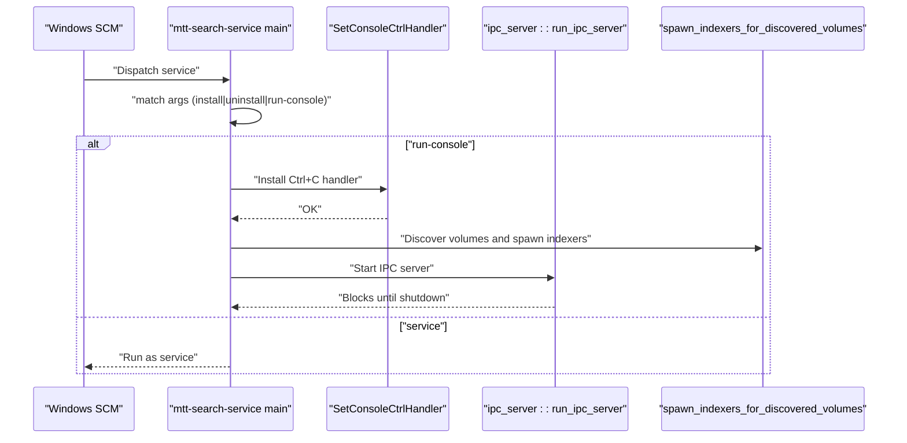

**Diagram sources**
- [main.rs:112-156](file://crates/mtt-search-service/src/main.rs#L112-L156)
- [main.rs:168-187](file://crates/mtt-search-service/src/main.rs#L168-L187)
- [main.rs:190-307](file://crates/mtt-search-service/src/main.rs#L190-L307)

**Section sources**
- [main.rs:112-307](file://crates/mtt-search-service/src/main.rs#L112-L307)
- [Cargo.toml:1-33](file://crates/mtt-search-service/Cargo.toml#L1-L33)

## Dependency Analysis
The Windows module re-exports are centralized in the module root, enabling clean imports across the application.

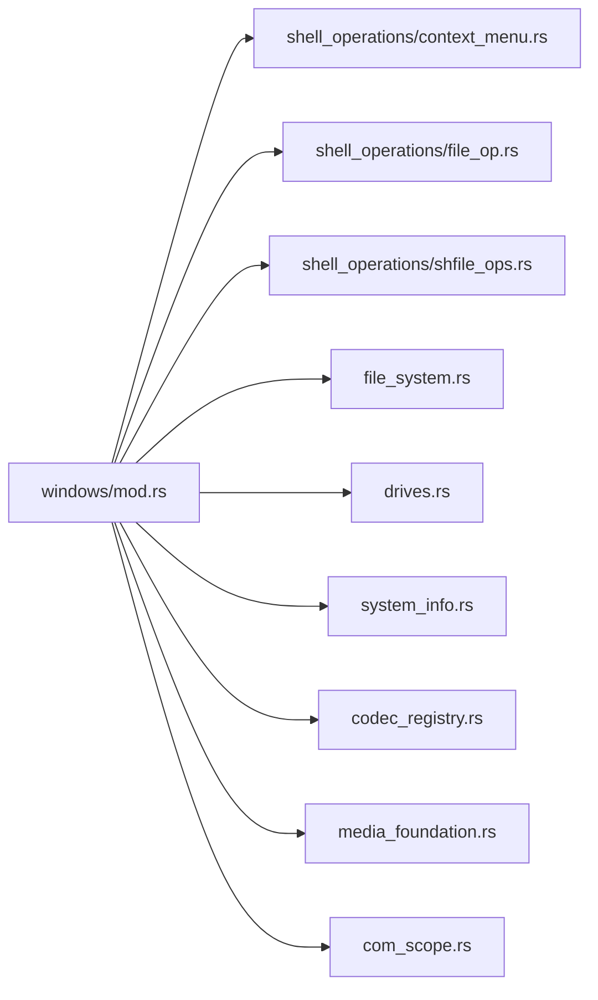

**Diagram sources**
- [mod.rs:31-60](file://src/infrastructure/windows/mod.rs#L31-L60)

**Section sources**
- [mod.rs:1-60](file://src/infrastructure/windows/mod.rs#L1-L60)

## Performance Considerations
- Prefer IFileOperation for batch operations to reduce UI overhead and improve reliability
- Use LRU caching for codec name resolution to minimize registry and Media Foundation queries
- Avoid heavy I/O on Windows system paths to leverage Shell optimizations
- Use 64-bit free-space APIs for large volumes to prevent overflow
- Initialize COM once per thread and drop it deterministically to avoid resource leaks

## Troubleshooting Guide
- Context menu invocation failures: ensure COM is initialized with the correct threading model and that PIDLs are freed on all error paths
- File operation failures: fall back from IFileOperation to SHFileOperation and verify undo/confirmation flags
- Volume label rename failures: handle access denied by launching an elevated helper and checking exit codes
- Media Foundation initialization: handle RPC_E_CHANGED_MODE and ensure MFStartup/MFShutdown pairing
- Service startup: verify DLL search directory hardening and SCM dispatch paths

**Section sources**
- [context_menu.rs:37-59](file://src/infrastructure/windows/shell_operations/context_menu.rs#L37-L59)
- [file_op.rs:36-42](file://src/infrastructure/windows/shell_operations/file_op.rs#L36-L42)
- [drives.rs:193-276](file://src/infrastructure/windows/drives.rs#L193-L276)
- [media_foundation.rs:46-69](file://src/infrastructure/windows/media_foundation.rs#L46-L69)
- [main.rs:112-125](file://crates/mtt-search-service/src/main.rs#L112-L125)

## Conclusion
The project’s Windows API integration is structured around robust shell operations, safe COM usage, and resilient system utilities. The search service demonstrates production-grade Windows service patterns with IPC and indexing orchestration. Following the documented patterns ensures correctness, performance, and maintainability when extending Windows-specific functionality.