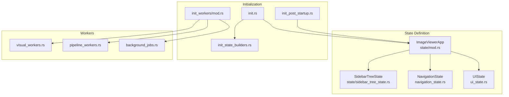
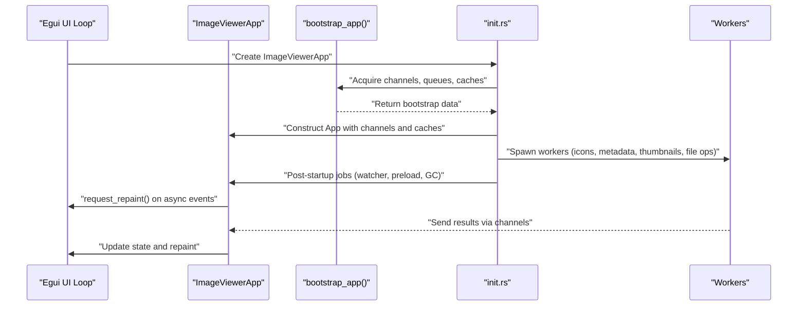
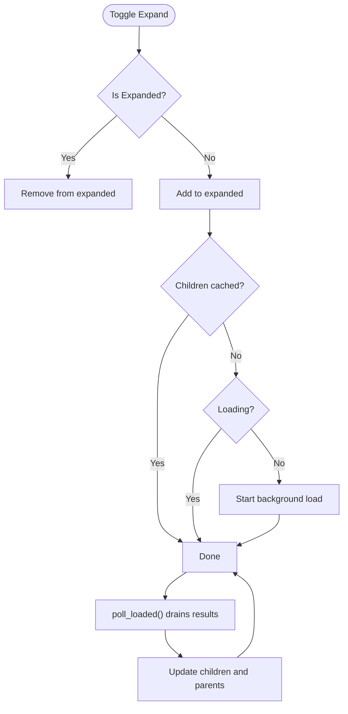
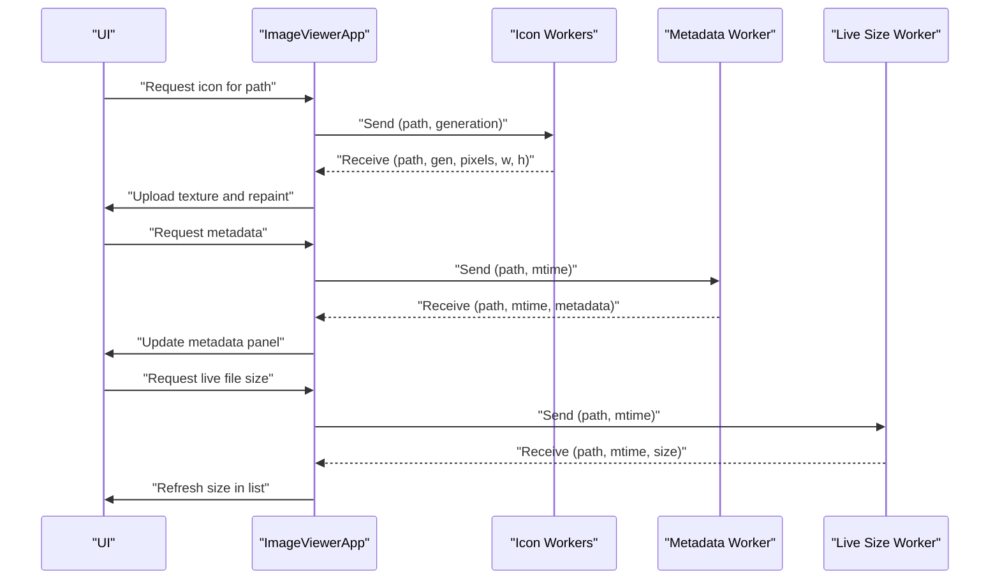
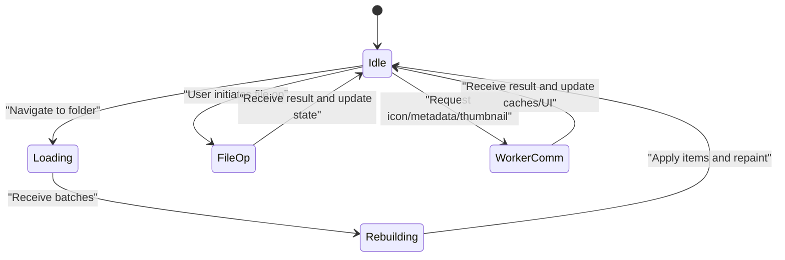
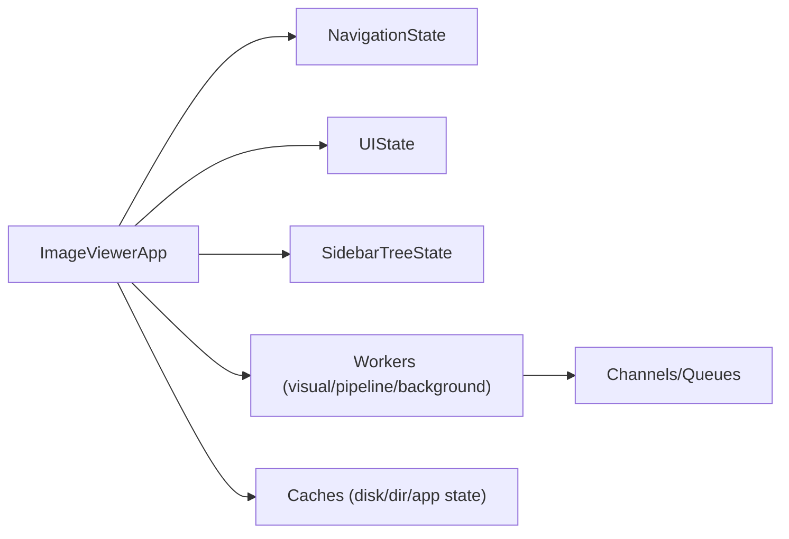

# Application State Management

<cite>
**Referenced Files in This Document**
- [mod.rs](file://src/app/state/mod.rs)
- [helpers.rs](file://src/app/state/helpers.rs)
- [sidebar_tree_state.rs](file://src/app/state/sidebar_tree_state.rs)
- [navigation_state.rs](file://src/app/navigation_state.rs)
- [ui_state.rs](file://src/app/ui_state.rs)
- [init.rs](file://src/app/init.rs)
- [init_state_builders.rs](file://src/app/init_state_builders.rs)
- [init_post_startup.rs](file://src/app/init_post_startup.rs)
- [mod.rs](file://src/app/init_workers/mod.rs)
- [background_jobs.rs](file://src/app/init_workers/background_jobs.rs)
- [pipeline_workers.rs](file://src/app/init_workers/pipeline_workers.rs)
- [visual_workers.rs](file://src/app/init_workers/visual_workers.rs)
</cite>

## Table of Contents
1. [Introduction](#introduction)
2. [Project Structure](#project-structure)
3. [Core Components](#core-components)
4. [Architecture Overview](#architecture-overview)
5. [Detailed Component Analysis](#detailed-component-analysis)
6. [Dependency Analysis](#dependency-analysis)
7. [Performance Considerations](#performance-considerations)
8. [Troubleshooting Guide](#troubleshooting-guide)
9. [Conclusion](#conclusion)

## Introduction
This document explains the application state management system centered around ImageViewerApp, detailing the state structure, initialization patterns, lifecycle management, thread-safe access using Arc<> and channels, persistence mechanisms, and coordination between UI updates and background workers. It also covers state transitions during navigation, file operations, and worker communications, along with the bootstrap process, post-startup initialization, and synchronization across components.

## Project Structure
The state management spans several modules:
- State definition and helpers for ImageViewerApp
- Navigation and UI state
- Initialization and builder functions for subsystems
- Worker spawning and coordination
- Post-startup tasks

**Diagram sources**
- [mod.rs:65-435](file://src/app/state/mod.rs#L65-L435)
- [sidebar_tree_state.rs:27-48](file://src/app/state/sidebar_tree_state.rs#L27-L48)
- [navigation_state.rs:19-44](file://src/app/navigation_state.rs#L19-L44)
- [ui_state.rs:4-44](file://src/app/ui_state.rs#L4-L44)
- [init.rs:77-625](file://src/app/init.rs#L77-L625)
- [init_state_builders.rs:22-155](file://src/app/init_state_builders.rs#L22-L155)
- [init_post_startup.rs:6-22](file://src/app/init_post_startup.rs#L6-L22)
- [mod.rs:1-23](file://src/app/init_workers/mod.rs#L1-L23)

**Section sources**
- [mod.rs:1-444](file://src/app/state/mod.rs#L1-L444)
- [init.rs:1-627](file://src/app/init.rs#L1-L627)

## Core Components
- ImageViewerApp: Central state container holding UI state, navigation, file lists, worker channels, caches, and configuration. It orchestrates worker communication and UI updates.
- SidebarTreeState: Hierarchical sidebar state with expansion, caching, and background loading.
- NavigationState: Tracks current path, history, and view modes.
- UIState: Lightweight UI-only state for rendering and interactions.
- Builders: Construct subsystem states (DriveState, FolderSizeState, FileOperationState, LayoutState) with channels and caches.
- Workers: Spawned via init_workers to handle thumbnails, icons, metadata, live sizes, prefetching, file operations, and garbage collection.

Key thread-safe patterns:
- Arc<T> for shared ownership across threads (e.g., caches, queues, atomic counters).
- Channels (std mpsc and crossbeam) for worker-to-main-thread communication.
- Atomic types for counters and flags (generation, scanning, cancellation).
- LruCache and HashSet/FxHashSet for bounded caches and sets.

**Section sources**
- [mod.rs:65-435](file://src/app/state/mod.rs#L65-L435)
- [sidebar_tree_state.rs:27-48](file://src/app/state/sidebar_tree_state.rs#L27-L48)
- [navigation_state.rs:19-44](file://src/app/navigation_state.rs#L19-L44)
- [ui_state.rs:4-44](file://src/app/ui_state.rs#L4-L44)
- [init_state_builders.rs:22-155](file://src/app/init_state_builders.rs#L22-L155)
- [visual_workers.rs:125-302](file://src/app/init_workers/visual_workers.rs#L125-L302)
- [pipeline_workers.rs:13-68](file://src/app/init_workers/pipeline_workers.rs#L13-L68)
- [background_jobs.rs:40-103](file://src/app/init_workers/background_jobs.rs#L40-L103)

## Architecture Overview
The system initializes ImageViewerApp, bootstraps workers, and coordinates state updates across UI and background threads.

**Diagram sources**
- [init.rs:77-140](file://src/app/init.rs#L77-L140)
- [init.rs:593-594](file://src/app/init.rs#L593-L594)
- [mod.rs:7-22](file://src/app/init_workers/mod.rs#L7-L22)

**Section sources**
- [init.rs:77-625](file://src/app/init.rs#L77-L625)
- [mod.rs:1-23](file://src/app/init_workers/mod.rs#L1-L23)

## Detailed Component Analysis

### ImageViewerApp State Structure and Lifecycle
ImageViewerApp aggregates:
- Navigation and view state (paths, history, view modes)
- File lists and rebuild channels (Arc<Vec<FileEntry>> and channels)
- Thumbnail pipeline (queue, receiver, pending buffer, eviction skips)
- Metadata and live size workers (requests/responses, caches)
- Folder preview and cover workers
- Disk cache, directory cache/index, app state DB
- UI state (selection, drag-drop, preview, notifications)
- Watcher system (auto-reload, fallback probing, device events)
- Tabs, sidebar tree, global search, file operation state
- Preferences debounce and performance metrics

Lifecycle:
- Construction: Initializes channels, caches, timers, and delegates to builder functions for subsystems.
- Post-startup: Watches current folder, preloads drive info, spawns incremental GC.
- Runtime: Processes channel messages, updates caches, triggers repaints, manages memory, and coordinates worker communications.

Thread-safe access:
- Arc for shared data (items, caches, queues).
- AtomicUsize for generation counters.
- Crossbeam channels for high-throughput worker-to-UI transfers.
- Mutex-free design via channels and atomic flags.

Persistence:
- AppStateDb for preferences, folder locks, pinned folders, covers.
- DirectoryCache and DirectoryIndex for directory listings.
- ThumbnailDiskCache for persisted thumbnails.

**Section sources**
- [mod.rs:65-435](file://src/app/state/mod.rs#L65-L435)
- [init.rs:77-625](file://src/app/init.rs#L77-L625)
- [init_post_startup.rs:6-22](file://src/app/init_post_startup.rs#L6-L22)
- [init_state_builders.rs:22-155](file://src/app/init_state_builders.rs#L22-L155)

### SidebarTreeState: Hierarchical Sidebar Management
Responsibilities:
- Expand/collapse nodes and maintain children cache.
- Background loading of subdirectories using DirectoryCache.
- Polling for completed loads and updating UI safely.
- Refresh expanded nodes periodically to reflect external changes.
- Toggle visibility of hidden items and invalidate caches accordingly.

Concurrency model:
- Uses std mpsc channels to communicate load results.
- Maintains HashSet for loading paths and HashMap for cached children.
- Drains results each frame to update state atomically.

**Diagram sources**
- [sidebar_tree_state.rs:137-147](file://src/app/state/sidebar_tree_state.rs#L137-L147)
- [sidebar_tree_state.rs:206-245](file://src/app/state/sidebar_tree_state.rs#L206-L245)
- [sidebar_tree_state.rs:248-289](file://src/app/state/sidebar_tree_state.rs#L248-L289)

**Section sources**
- [sidebar_tree_state.rs:27-48](file://src/app/state/sidebar_tree_state.rs#L27-L48)
- [sidebar_tree_state.rs:137-147](file://src/app/state/sidebar_tree_state.rs#L137-L147)
- [sidebar_tree_state.rs:206-245](file://src/app/state/sidebar_tree_state.rs#L206-L245)
- [sidebar_tree_state.rs:248-289](file://src/app/state/sidebar_tree_state.rs#L248-L289)

### NavigationState and UIState
NavigationState tracks current path, navigation history, and view modes (computer, recycle bin). UIState holds transient UI flags and dimensions.

Usage:
- NavigationState is part of ImageViewerApp and influences view mode and rendering.
- UIState complements ImageViewerApp for UI-only concerns (selected items, search, settings toggles).

**Section sources**
- [navigation_state.rs:19-44](file://src/app/navigation_state.rs#L19-L44)
- [ui_state.rs:4-44](file://src/app/ui_state.rs#L4-L44)

### State Builders: Subsystem Initialization
Builders construct subsystem states with appropriate channels and caches:
- build_layout_state: Loads persisted column widths and window geometry.
- build_drive_state: Creates drive scanning and info channels with caches.
- build_folder_size_state: Sets up batch and single-size workers with cancellation.
- build_file_operation_state: Wires file operation worker and related subsystems.

These builders encapsulate worker wiring and cache sizing, ensuring consistent initialization across the app.

**Section sources**
- [init_state_builders.rs:22-155](file://src/app/init_state_builders.rs#L22-L155)

### Worker Coordination and Channels
Workers are spawned during initialization and coordinated via channels:
- Visual workers: icon extraction, metadata, live file size, cover worker, async font loader.
- Pipeline workers: prefetching, idle warmup, file operation worker, global search worker.
- Background jobs: incremental garbage collection and drive info preload.

Patterns:
- Fan-out pattern for icon workers using a crossbeam bounded channel to distribute work.
- Atomic generation checks to drop stale requests when users navigate quickly.
- Dedicated channels per worker type to decouple UI from background processing.

**Diagram sources**
- [visual_workers.rs:125-302](file://src/app/init_workers/visual_workers.rs#L125-L302)
- [visual_workers.rs:304-360](file://src/app/init_workers/visual_workers.rs#L304-L360)
- [pipeline_workers.rs:35-52](file://src/app/init_workers/pipeline_workers.rs#L35-L52)

**Section sources**
- [visual_workers.rs:125-302](file://src/app/init_workers/visual_workers.rs#L125-L302)
- [visual_workers.rs:304-360](file://src/app/init_workers/visual_workers.rs#L304-L360)
- [pipeline_workers.rs:13-68](file://src/app/init_workers/pipeline_workers.rs#L13-L68)

### Bootstrap and Post-Startup Initialization
Bootstrap:
- The bootstrap phase creates channels, queues, caches, and shared atomic counters, returning them to the initializer.

Post-startup:
- Watches current folder.
- Preloads drive information asynchronously.
- Spawns incremental garbage collection worker.

These steps ensure the app is responsive and ready to handle user interactions immediately.

**Section sources**
- [init.rs:77-140](file://src/app/init.rs#L77-L140)
- [init.rs:593-594](file://src/app/init.rs#L593-L594)
- [init_post_startup.rs:6-22](file://src/app/init_post_startup.rs#L6-L22)
- [background_jobs.rs:13-38](file://src/app/init_workers/background_jobs.rs#L13-L38)

### State Transitions: Navigation, File Operations, and Worker Communications
Navigation:
- On navigation, ImageViewerApp updates current path, resets loading flags, and optionally preserves modified hints for preview consistency.
- Generation counters coordinate rebuilds and drop stale results.

File operations:
- Requests are sent to the file operation worker; results are received asynchronously and applied to state (e.g., pending deletions, mounted ISO drives).

Worker communications:
- Thumbnails: UI sends to PriorityThumbnailQueue; workers reply via crossbeam channel; pending buffer throttles uploads.
- Icons/metadata/live size: UI sends requests; workers reply via mpsc channels; caches deduplicate and debounce.

[No sources needed since this diagram shows conceptual workflow, not actual code structure]

## Dependency Analysis
The state management system exhibits low coupling and high cohesion:
- ImageViewerApp depends on subsystems (navigation, UI, workers, caches) but delegates construction to builders and workers to init_workers.
- Channels decouple UI from workers, minimizing shared mutable state.
- Arc and atomic types enable safe sharing across threads without explicit locking.

**Diagram sources**
- [mod.rs:65-435](file://src/app/state/mod.rs#L65-L435)
- [navigation_state.rs:19-44](file://src/app/navigation_state.rs#L19-L44)
- [ui_state.rs:4-44](file://src/app/ui_state.rs#L4-L44)
- [sidebar_tree_state.rs:27-48](file://src/app/state/sidebar_tree_state.rs#L27-L48)
- [mod.rs:1-23](file://src/app/init_workers/mod.rs#L1-L23)

**Section sources**
- [mod.rs:65-435](file://src/app/state/mod.rs#L65-L435)
- [init.rs:77-625](file://src/app/init.rs#L77-L625)
- [mod.rs:1-23](file://src/app/init_workers/mod.rs#L1-L23)

## Performance Considerations
- Bounded caches (LruCache) and sets (FxHashSet/DashMap) prevent unbounded growth.
- Pending buffers and throttling (pending_thumbnails, upload budget) manage GPU upload rates.
- Adaptive memory maintenance trims caches based on working set and restore burst conditions.
- Crossbeam channels and fan-out icon workers improve throughput.
- Generation-based staleness checks avoid wasted work on quick navigation.

[No sources needed since this section provides general guidance]

## Troubleshooting Guide
Common state management challenges and solutions:
- Stale thumbnail uploads after navigation: Use eviction skips and generation checks to drop stale results.
- UI freeze during heavy loads: Use async loading channels and rebuild streams; throttle list rebuilds.
- Excessive memory usage: Run memory maintenance routines and trim caches aggressively under pressure.
- Watcher drift on non-USN filesystems: Enable fallback polling and consistency probes; debounce mtime rechecks.
- Drive info not available: Preload drive info asynchronously and request repaint on completion.

**Section sources**
- [helpers.rs:77-161](file://src/app/state/helpers.rs#L77-L161)
- [mod.rs:248-250](file://src/app/state/mod.rs#L248-L250)
- [background_jobs.rs:40-103](file://src/app/init_workers/background_jobs.rs#L40-L103)

## Conclusion
ImageViewerApp’s state management combines a centralized state container with robust worker orchestration, thread-safe access patterns, and persistence mechanisms. The design emphasizes responsiveness, scalability, and resilience through channels, atomic counters, bounded caches, and adaptive resource management. The bootstrap and post-startup phases ensure a smooth user experience, while the builders and workers encapsulate complexity and promote maintainability.