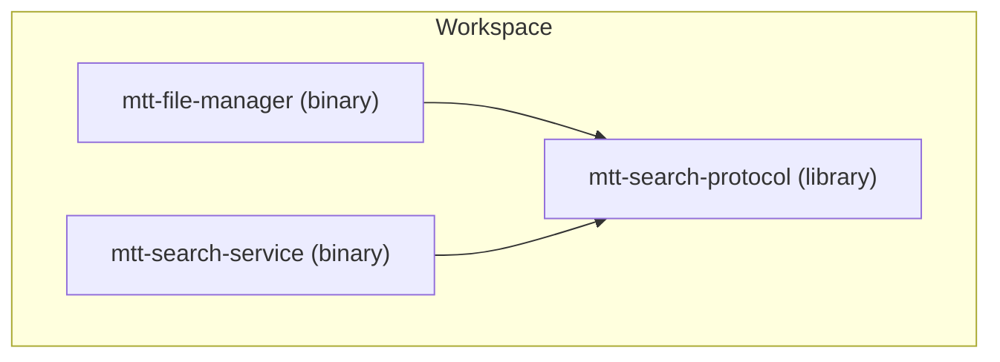
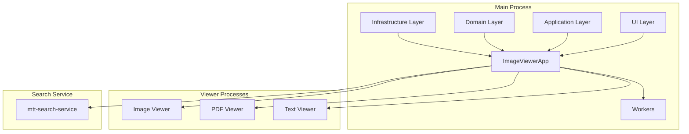
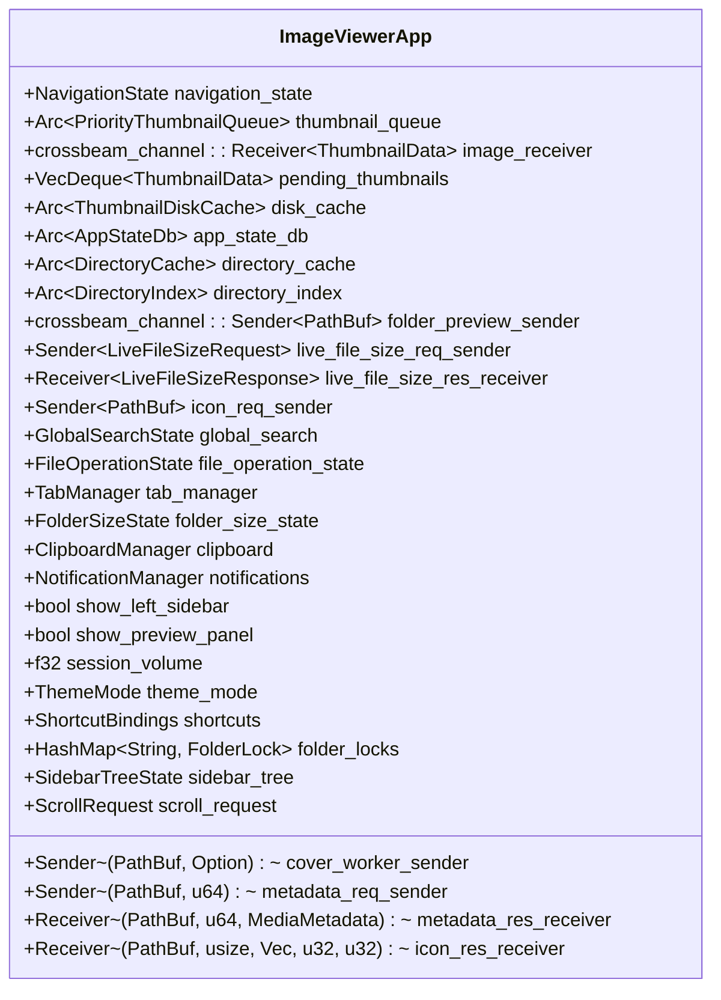
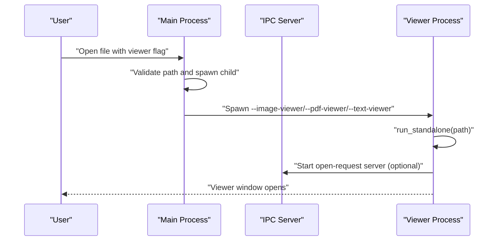
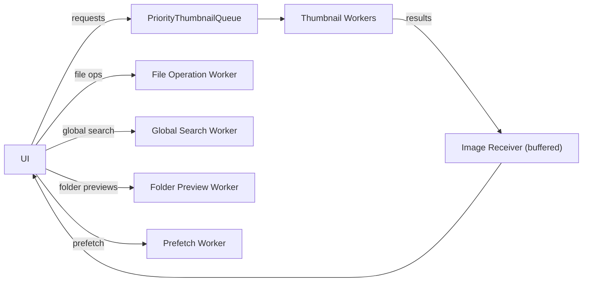
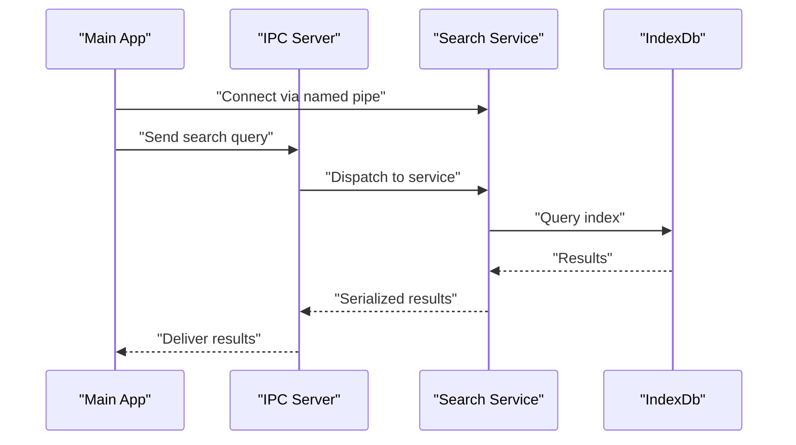
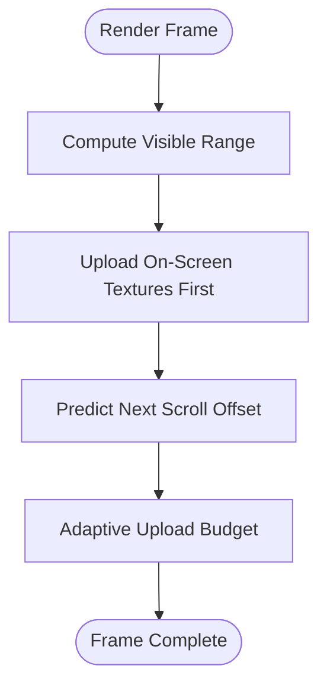
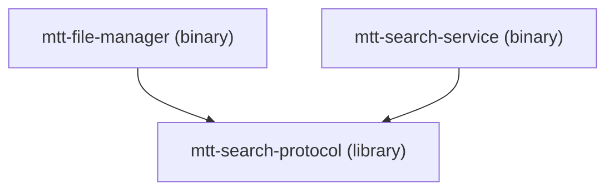

# Architecture & Design

<cite>
**Referenced Files in This Document**
- [src/main.rs](file://src/main.rs)
- [src/lib.rs](file://src/lib.rs)
- [src/app/mod.rs](file://src/app/mod.rs)
- [src/app/state/mod.rs](file://src/app/state/mod.rs)
- [src/application/mod.rs](file://src/application/mod.rs)
- [src/domain/mod.rs](file://src/domain/mod.rs)
- [src/infrastructure/mod.rs](file://src/infrastructure/mod.rs)
- [src/ui/mod.rs](file://src/ui/mod.rs)
- [src/workers/mod.rs](file://src/workers/mod.rs)
- [src/image_viewer/mod.rs](file://src/image_viewer/mod.rs)
- [src/pdf_viewer/mod.rs](file://src/pdf_viewer/mod.rs)
- [src/text_viewer/mod.rs](file://src/text_viewer/mod.rs)
- [crates/mtt-search-service/src/main.rs](file://crates/mtt-search-service/src/main.rs)
- [Cargo.toml](file://Cargo.toml)
</cite>

## Table of Contents
1. [Introduction](#introduction)
2. [Project Structure](#project-structure)
3. [Core Components](#core-components)
4. [Architecture Overview](#architecture-overview)
5. [Detailed Component Analysis](#detailed-component-analysis)
6. [Dependency Analysis](#dependency-analysis)
7. [Performance Considerations](#performance-considerations)
8. [Troubleshooting Guide](#troubleshooting-guide)
9. [Conclusion](#conclusion)

## Introduction
This document describes the architectural design of MTT File Manager, focusing on its layered architecture and multi-process runtime model. The system is organized into clear layers—UI, application, domain, and infrastructure—each with well-defined responsibilities. The application state is centrally managed by ImageViewerApp, which coordinates UI updates, worker threads, caches, and persistence. The runtime employs a multi-process model: a main application process and dedicated viewer processes for images, PDFs, and text. Background worker threads handle heavy tasks such as thumbnail generation, file operations, global search, and folder previews. Cross-cutting concerns include threading, inter-process communication (IPC), and memory management, with patterns such as Command and Observer supporting decoupled workflows.

## Project Structure
The project is a Rust workspace with a primary binary crate and two member crates:
- mtt-file-manager (binary): main file manager application
- mtt-search-protocol (library): shared protocol definitions for IPC
- mtt-search-service (binary): background service for indexing and search

**Diagram sources**
- [Cargo.toml:1-3](file://Cargo.toml#L1-L3)

The main application binary orchestrates startup, UI, and viewer processes. The search service runs as a separate process, communicating with the main application via named pipes.

**Section sources**
- [Cargo.toml:1-3](file://Cargo.toml#L1-L3)
- [src/main.rs:106-305](file://src/main.rs#L106-L305)

## Core Components
- ImageViewerApp: Central application state container and coordinator for UI, workers, caches, and persistence. It manages channels to worker pools, UI rendering state, watcher events, and global search integration.
- UI layer: Provides views, components, and rendering logic built on eframe/egui.
- Application layer: Encapsulates high-level business logic such as navigation, sorting, clipboard, and notifications.
- Domain layer: Defines core data types and business entities (e.g., FileEntry, Thumbnail).
- Infrastructure layer: Implements Windows-specific integrations, caching, IO prioritization, drive watching, and media support.
- Workers: Background modules for thumbnail generation, file operations, global search, prefetching, and folder previews.
- Viewer runtimes: Dedicated processes for image, PDF, and text viewing, each with its own entry point and security validations.

**Section sources**
- [src/app/state/mod.rs:65-435](file://src/app/state/mod.rs#L65-L435)
- [src/app/mod.rs:1-32](file://src/app/mod.rs#L1-L32)
- [src/application/mod.rs:1-47](file://src/application/mod.rs#L1-L47)
- [src/domain/mod.rs:1-9](file://src/domain/mod.rs#L1-L9)
- [src/infrastructure/mod.rs:1-26](file://src/infrastructure/mod.rs#L1-L26)
- [src/workers/mod.rs:1-9](file://src/workers/mod.rs#L1-L9)
- [src/ui/mod.rs:1-22](file://src/ui/mod.rs#L1-L22)
- [src/image_viewer/mod.rs:201-318](file://src/image_viewer/mod.rs#L201-L318)
- [src/pdf_viewer/mod.rs:142-202](file://src/pdf_viewer/mod.rs#L142-L202)
- [src/text_viewer/mod.rs:153-210](file://src/text_viewer/mod.rs#L153-L210)

## Architecture Overview
The system follows a layered architecture with explicit boundaries:

- UI Layer: Renders views and components, interacts with ImageViewerApp for state and commands.
- Application Layer: Coordinates business logic, worker orchestration, and high-level operations.
- Domain Layer: Holds immutable data structures and domain rules.
- Infrastructure Layer: Provides platform-specific services, caches, IO scheduling, and Windows integrations.

Multi-process runtime:
- Main process: Initializes UI, state, and workers; spawns dedicated viewer processes.
- Viewer processes: Image, PDF, and text viewers run as separate processes with isolated entry points and IPC forwarding.

Background worker threads:
- Thumbnail worker pool: Priority queues and staged extraction pipeline.
- File operation worker: Asynchronous shell operations.
- Global search worker: Integrates with mtt-search-service via IPC.
- Folder preview worker: Native Windows shell previews.
- Prefetch worker: Preloads data for responsive UI.

**Diagram sources**
- [src/app/state/mod.rs:65-435](file://src/app/state/mod.rs#L65-L435)
- [src/main.rs:144-215](file://src/main.rs#L144-L215)
- [src/image_viewer/mod.rs:201-318](file://src/image_viewer/mod.rs#L201-L318)
- [src/pdf_viewer/mod.rs:142-202](file://src/pdf_viewer/mod.rs#L142-L202)
- [src/text_viewer/mod.rs:153-210](file://src/text_viewer/mod.rs#L153-L210)
- [crates/mtt-search-service/src/main.rs:112-307](file://crates/mtt-search-service/src/main.rs#L112-L307)

## Detailed Component Analysis

### ImageViewerApp: Central State Coordinator
ImageViewerApp aggregates UI state, worker channels, caches, and persistence. It coordinates:
- Thumbnail pipeline: priority queue to worker pool and buffered results to UI
- Async loading and rebuild: streaming batches and generation counters
- Watcher system: notify-based file system monitoring with fallbacks
- Global search: integration with mtt-search-service via IPC
- Media preview: video/image preview state and lifecycle
- Tabs and layout: multi-tab management and persistent layout
- File operations: background shell operations and progress tracking
- Metadata and live sizes: asynchronous metadata retrieval and caching
- Clipboard and context menus: shell menu worker integration

**Diagram sources**
- [src/app/state/mod.rs:65-435](file://src/app/state/mod.rs#L65-L435)

**Section sources**
- [src/app/state/mod.rs:65-435](file://src/app/state/mod.rs#L65-L435)

### Multi-Process Runtime and Viewer Entry Points
The main binary supports dedicated viewer modes via command-line flags. Each viewer validates the input path, spawns a new process if needed, and runs a specialized viewer app.

**Diagram sources**
- [src/main.rs:144-215](file://src/main.rs#L144-L215)
- [src/image_viewer/mod.rs:125-199](file://src/image_viewer/mod.rs#L125-L199)
- [src/pdf_viewer/mod.rs:114-139](file://src/pdf_viewer/mod.rs#L114-L139)
- [src/text_viewer/mod.rs:126-149](file://src/text_viewer/mod.rs#L126-L149)

**Section sources**
- [src/main.rs:144-215](file://src/main.rs#L144-L215)
- [src/image_viewer/mod.rs:201-318](file://src/image_viewer/mod.rs#L201-L318)
- [src/pdf_viewer/mod.rs:142-202](file://src/pdf_viewer/mod.rs#L142-L202)
- [src/text_viewer/mod.rs:153-210](file://src/text_viewer/mod.rs#L153-L210)

### Worker Coordination and Pipeline Patterns
Workers are coordinated through channels and queues:
- Thumbnail worker pool: PriorityThumbnailQueue feeds workers; results stream back to UI with buffering and eviction handling.
- File operation worker: Receives shell operations and reports progress.
- Global search worker: Communicates with mtt-search-service via IPC.
- Folder preview worker: Native Windows shell previews with sandwich effect.
- Prefetch worker: Preloads data for responsive UI.

**Diagram sources**
- [src/app/state/mod.rs:78-111](file://src/app/state/mod.rs#L78-L111)
- [src/workers/mod.rs:1-9](file://src/workers/mod.rs#L1-L9)

**Section sources**
- [src/app/state/mod.rs:78-111](file://src/app/state/mod.rs#L78-L111)
- [src/workers/mod.rs:1-9](file://src/workers/mod.rs#L1-L9)

### Global Search Service and IPC
The mtt-search-service runs as a separate process, exposing an IPC server for queries. It maintains shared state for indices and progress, and spawns volume indexers for discovered drives.

**Diagram sources**
- [crates/mtt-search-service/src/main.rs:112-307](file://crates/mtt-search-service/src/main.rs#L112-L307)

**Section sources**
- [crates/mtt-search-service/src/main.rs:112-307](file://crates/mtt-search-service/src/main.rs#L112-L307)

### UI Rendering and Virtualization
The UI layer implements virtualized grid and list views with predictive scrolling, visible range tracking, and GPU upload prioritization. These mechanisms reduce per-frame allocations and optimize texture uploads.

**Diagram sources**
- [src/app/state/mod.rs:342-381](file://src/app/state/mod.rs#L342-L381)

**Section sources**
- [src/app/state/mod.rs:342-381](file://src/app/state/mod.rs#L342-L381)

## Dependency Analysis
The workspace uses a multi-crate structure with explicit dependencies:
- mtt-search-protocol provides IPC protocol definitions used by both the main application and the search service.
- mtt-search-service depends on mtt-search-protocol and implements the search backend.
- The main binary crate depends on eframe/wgpu for rendering, Windows APIs for shell and media, and various crates for caching, IO, and utilities.

**Diagram sources**
- [Cargo.toml:1-3](file://Cargo.toml#L1-L3)

**Section sources**
- [Cargo.toml:1-3](file://Cargo.toml#L1-L3)

## Performance Considerations
- GPU and rendering: The main process requests a discrete GPU and low-latency presentation to improve throughput and reduce latency.
- Throttling and budgets: Texture upload budgets and adaptive throttling prevent UI stalls during heavy loads.
- Memory management: Bounded caches (LRU) and eviction strategies control memory footprint.
- Worker pools: Priority queues and staged pipelines distribute work efficiently across threads.
- Startup optimization: Early preference loading and async font loading reduce perceived startup time.

**Section sources**
- [src/main.rs:254-277](file://src/main.rs#L254-L277)
- [src/app/state/mod.rs:358-381](file://src/app/state/mod.rs#L358-L381)

## Troubleshooting Guide
- Viewer process issues: If a viewer fails to open, verify path validation and ensure the viewer process is spawned with the correct flag. Logs indicate whether the request was forwarded to an existing instance or if spawning failed.
- Search service connectivity: Confirm the search service is running and the named pipe is accessible. The service exposes installation and console modes for diagnostics.
- Logging levels: On Windows, when no console is attached, the default log level is raised to reduce background worker log noise that can cause UI stutter.

**Section sources**
- [src/image_viewer/mod.rs:144-199](file://src/image_viewer/mod.rs#L144-L199)
- [src/pdf_viewer/mod.rs:114-139](file://src/pdf_viewer/mod.rs#L114-L139)
- [src/text_viewer/mod.rs:126-149](file://src/text_viewer/mod.rs#L126-L149)
- [crates/mtt-search-service/src/main.rs:112-156](file://crates/mtt-search-service/src/main.rs#L112-L156)
- [src/main.rs:121-136](file://src/main.rs#L121-L136)

## Conclusion
MTT File Manager’s architecture cleanly separates concerns across UI, application, domain, and infrastructure layers, with ImageViewerApp serving as the central coordinator. The multi-process runtime isolates viewers for robustness and security, while background workers handle intensive tasks efficiently. The system leverages patterns like Command and Observer to maintain loose coupling, and employs careful threading, IPC, and memory management to achieve performance and scalability.