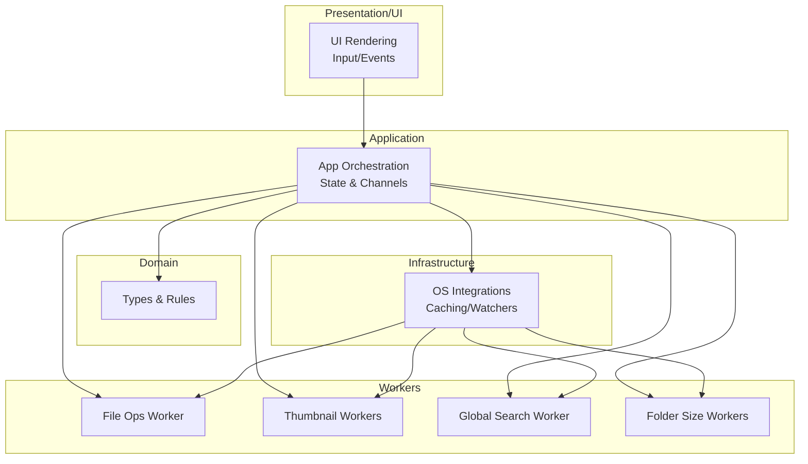
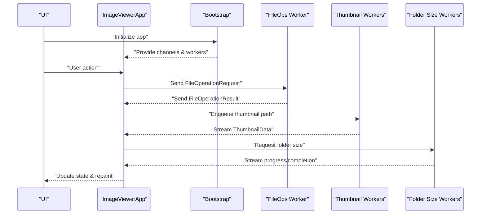
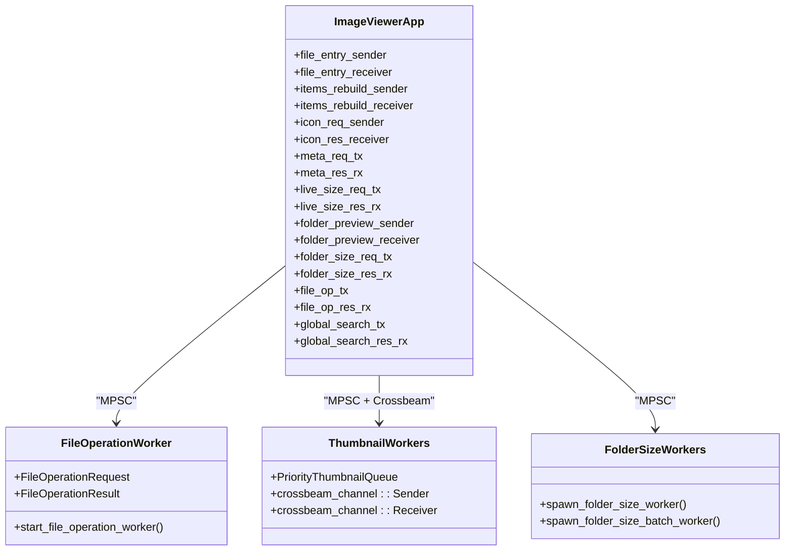
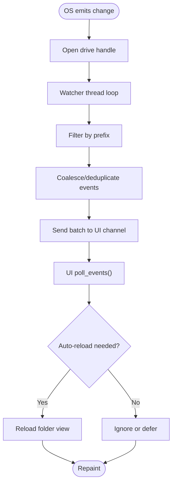
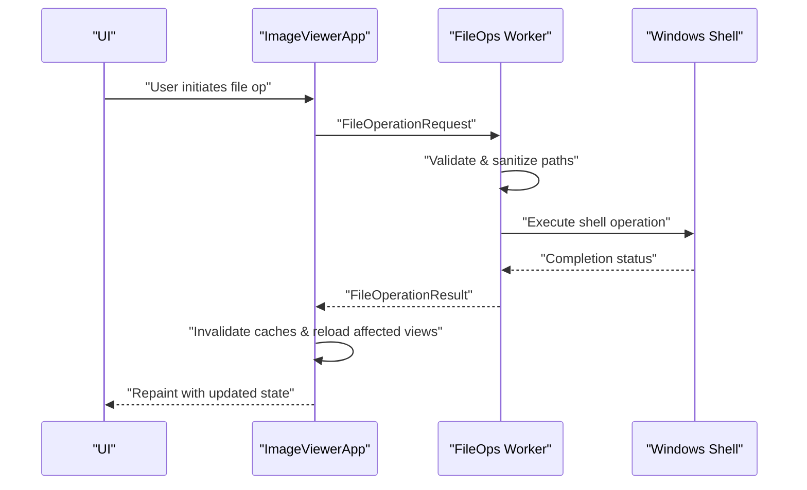
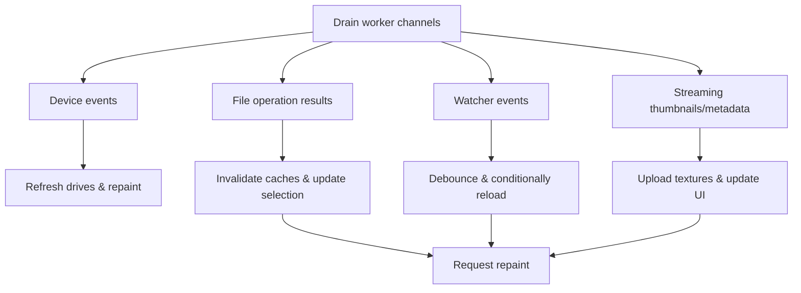
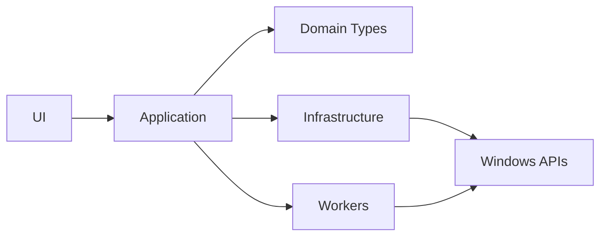
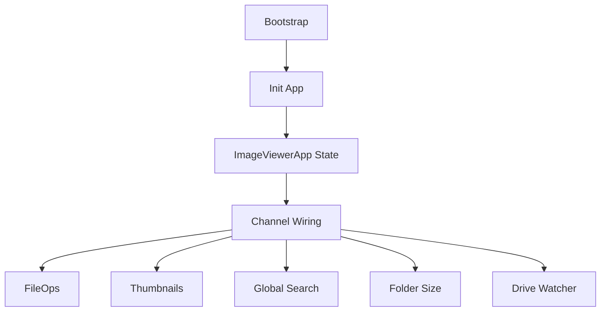

# Component Relationships & Communication

<cite>
**Referenced Files in This Document**
- [lib.rs](file://src/lib.rs)
- [main.rs](file://src/main.rs)
- [init.rs](file://src/app/init.rs)
- [init_bootstrap.rs](file://src/app/init_bootstrap.rs)
- [mod.rs (init_workers)](file://src/app/init_workers/mod.rs)
- [filesystem_workers.rs](file://src/app/init_workers/filesystem_workers.rs)
- [pipeline_workers.rs](file://src/app/init_workers/pipeline_workers.rs)
- [file_operation_worker.rs](file://src/workers/file_operation_worker.rs)
- [handlers.rs](file://src/workers/file_operation_worker/handlers.rs)
- [drive_watcher.rs](file://src/infrastructure/drive_watcher.rs)
- [mod.rs (message_handler)](file://src/app/operations/message_handler/mod.rs)
- [file_op_events.rs](file://src/app/operations/message_handler/file_op_events.rs)
- [state/mod.rs](file://src/app/state/mod.rs)
- [domain/mod.rs](file://src/domain/mod.rs)
</cite>

## Table of Contents
1. [Introduction](#introduction)
2. [Project Structure](#project-structure)
3. [Core Components](#core-components)
4. [Architecture Overview](#architecture-overview)
5. [Detailed Component Analysis](#detailed-component-analysis)
6. [Dependency Analysis](#dependency-analysis)
7. [Performance Considerations](#performance-considerations)
8. [Troubleshooting Guide](#troubleshooting-guide)
9. [Conclusion](#conclusion)

## Introduction
This document explains the component relationships and communication patterns across the system’s layers. It focuses on:
- The MPSC channel architecture connecting the UI to workers
- The observer pattern for filesystem events
- The command pattern for file operations
- Data flow between presentation, application, domain, and infrastructure layers
- Active worker channels, message passing protocols, and synchronization mechanisms
- Examples of cross-layer communication, error propagation, and state coordination
- Architectural decisions enabling loose coupling and high cohesion

## Project Structure
The application is organized into layered modules:
- Presentation/UI: UI rendering, input handling, and state orchestration
- Application: Orchestration, state, and message routing between UI and workers
- Domain: Core data types and business rules
- Infrastructure: Platform-specific integrations, caching, and OS watchers
- Workers: Background tasks for file operations, thumbnails, metadata, and search

**Diagram sources**
- [lib.rs:1-20](file://src/lib.rs#L1-L20)
- [main.rs:106-305](file://src/main.rs#L106-L305)
- [init.rs:77-625](file://src/app/init.rs#L77-L625)
- [state/mod.rs:65-435](file://src/app/state/mod.rs#L65-L435)

**Section sources**
- [lib.rs:1-20](file://src/lib.rs#L1-L20)
- [main.rs:106-305](file://src/main.rs#L106-L305)
- [init.rs:77-625](file://src/app/init.rs#L77-L625)
- [state/mod.rs:65-435](file://src/app/state/mod.rs#L65-L435)

## Core Components
- Bootstrap initializes channels and spawns workers, wiring the entire system at startup.
- The UI maintains an ImageViewerApp state with typed channels to workers.
- Workers expose request/result enums and channels for message passing.
- Observers (watchers) push events into channels for the UI to process.
- Commands (file operation requests) are sent to a dedicated worker that validates and executes.

Key channels and roles:
- File operation: UI sends requests; worker responds with results.
- Thumbnails: UI enqueues paths; workers stream decoded images.
- Metadata/live size: UI sends requests; workers stream results.
- Folder size: UI sends paths; workers stream progress/completion.
- Watcher: OS emits events; watcher converts to domain events; UI processes.

**Section sources**
- [init_bootstrap.rs:120-358](file://src/app/init_bootstrap.rs#L120-L358)
- [state/mod.rs:65-435](file://src/app/state/mod.rs#L65-L435)
- [file_operation_worker.rs:226-328](file://src/workers/file_operation_worker.rs#L226-L328)
- [drive_watcher.rs:60-266](file://src/infrastructure/drive_watcher.rs#L60-L266)

## Architecture Overview
The system uses a layered, event-driven design:
- UI constructs ImageViewerApp and delegates to bootstrap to wire channels and workers.
- Application state holds all channels and orchestrates message routing.
- Workers operate independently, communicating via channels and shared caches.
- Observers (drive watcher) translate OS events into domain events for the UI.
- Synchronization uses atomic flags, bounded channels, and careful batching to maintain responsiveness.

**Diagram sources**
- [init.rs:77-625](file://src/app/init.rs#L77-L625)
- [init_bootstrap.rs:120-358](file://src/app/init_bootstrap.rs#L120-L358)
- [file_operation_worker.rs:226-328](file://src/workers/file_operation_worker.rs#L226-L328)
- [filesystem_workers.rs:259-435](file://src/app/init_workers/filesystem_workers.rs#L259-L435)

## Detailed Component Analysis

### MPSC Channel Architecture: UI to Workers
- Bootstrap creates typed channels for each worker category (file ops, thumbnails, metadata, folder size, global search).
- ImageViewerApp stores receivers/senders for each channel, enabling the UI to enqueue work and the app to process results.
- Crossbeam channels are used for high-throughput fan-out (e.g., folder preview worker requests).
- Bounded channels prevent unbounded memory growth; unbounded crossbeam channels are used where throughput demands outweigh backpressure needs.

**Diagram sources**
- [state/mod.rs:65-435](file://src/app/state/mod.rs#L65-L435)
- [init_bootstrap.rs:34-118](file://src/app/init_bootstrap.rs#L34-L118)
- [file_operation_worker.rs:68-160](file://src/workers/file_operation_worker.rs#L68-L160)
- [filesystem_workers.rs:224-257](file://src/app/init_workers/filesystem_workers.rs#L224-L257)

**Section sources**
- [init_bootstrap.rs:34-118](file://src/app/init_bootstrap.rs#L34-L118)
- [state/mod.rs:65-435](file://src/app/state/mod.rs#L65-L435)
- [filesystem_workers.rs:224-257](file://src/app/init_workers/filesystem_workers.rs#L224-L257)
- [pipeline_workers.rs:13-68](file://src/app/init_workers/pipeline_workers.rs#L13-L68)

### Observer Pattern: Filesystem Event Watching
- DriveWatcher monitors an entire drive root and filters events to the current prefix.
- Events are deduplicated and coalesced in the watcher thread; the UI polls batches safely.
- The UI processes watcher events and triggers auto-reload with debouncing and cooldown to avoid thrashing.

**Diagram sources**
- [drive_watcher.rs:60-266](file://src/infrastructure/drive_watcher.rs#L60-L266)
- [init.rs:299-320](file://src/app/init.rs#L299-L320)

**Section sources**
- [drive_watcher.rs:60-266](file://src/infrastructure/drive_watcher.rs#L60-L266)
- [init.rs:299-320](file://src/app/init.rs#L299-L320)

### Command Pattern: File Operations
- UI sends strongly-typed FileOperationRequest commands to the file operation worker.
- The worker validates paths, initializes COM (STA), and executes operations.
- Results are streamed back as FileOperationResult, enabling the UI to update caches, selections, and views.

**Diagram sources**
- [file_operation_worker.rs:226-328](file://src/workers/file_operation_worker.rs#L226-L328)
- [handlers.rs:10-404](file://src/workers/file_operation_worker/handlers.rs#L10-L404)
- [file_op_events.rs:8-110](file://src/app/operations/message_handler/file_op_events.rs#L8-L110)

**Section sources**
- [file_operation_worker.rs:68-160](file://src/workers/file_operation_worker.rs#L68-L160)
- [handlers.rs:10-404](file://src/workers/file_operation_worker/handlers.rs#L10-L404)
- [file_op_events.rs:8-110](file://src/app/operations/message_handler/file_op_events.rs#L8-L110)

### Message Handler Pipeline: Cross-Layer Coordination
- The UI periodically drains worker channels and updates state.
- File operation results trigger cache invalidations, selection updates, and selective reloads.
- Watcher events are batched and debounced; auto-reload is suppressed during heavy operations to avoid flicker.

**Diagram sources**
- [mod.rs (message_handler):35-96](file://src/app/operations/message_handler/mod.rs#L35-L96)
- [file_op_events.rs:8-110](file://src/app/operations/message_handler/file_op_events.rs#L8-L110)

**Section sources**
- [mod.rs (message_handler):35-96](file://src/app/operations/message_handler/mod.rs#L35-L96)
- [file_op_events.rs:8-110](file://src/app/operations/message_handler/file_op_events.rs#L8-L110)

### Data Flow Across Layers
- Presentation: UI renders and dispatches user actions.
- Application: Orchestrates channels, batches messages, and coordinates worker lifecycles.
- Domain: Defines types (FileEntry, ThumbnailData, DriveWatcherEvent) and business rules.
- Infrastructure: Implements OS integrations (watchers, disk caches), IO prioritization, and platform-specific APIs.

**Diagram sources**
- [domain/mod.rs:1-9](file://src/domain/mod.rs#L1-L9)
- [init.rs:77-625](file://src/app/init.rs#L77-L625)
- [drive_watcher.rs:60-266](file://src/infrastructure/drive_watcher.rs#L60-L266)

**Section sources**
- [domain/mod.rs:1-9](file://src/domain/mod.rs#L1-L9)
- [init.rs:77-625](file://src/app/init.rs#L77-L625)
- [drive_watcher.rs:60-266](file://src/infrastructure/drive_watcher.rs#L60-L266)

## Dependency Analysis
- Loose coupling is achieved via typed channels and shared atomic flags.
- Cohesion is maintained by grouping related workers (visual, filesystem, pipeline) under dedicated modules.
- Bootstrap centralizes dependency wiring, ensuring consistent initialization across layers.

**Diagram sources**
- [init_bootstrap.rs:120-358](file://src/app/init_bootstrap.rs#L120-L358)
- [init.rs:77-625](file://src/app/init.rs#L77-L625)
- [mod.rs (init_workers):1-23](file://src/app/init_workers/mod.rs#L1-L23)

**Section sources**
- [init_bootstrap.rs:120-358](file://src/app/init_bootstrap.rs#L120-L358)
- [init.rs:77-625](file://src/app/init.rs#L77-L625)
- [mod.rs (init_workers):1-23](file://src/app/init_workers/mod.rs#L1-L23)

## Performance Considerations
- Bounded channels prevent memory pressure; crossbeam channels avoid serialization bottlenecks for fan-out scenarios.
- Retry/backoff for folder size queries on transient failures; cancellation flags ensure prompt aborts.
- Debouncing and cooldowns for watcher auto-reload prevent UI thrashing during heavy write bursts.
- Prioritized IO and adaptive throttling optimize GPU upload budgets and frame pacing.

[No sources needed since this section provides general guidance]

## Troubleshooting Guide
- File operation panics are caught and reported as OperationFailed; UI displays warnings and requests repaint.
- Drive watcher failures are logged; UI continues with degraded functionality.
- Cache invalidation distinguishes between transient and permanent events; virtual/network paths avoid aggressive pruning.

**Section sources**
- [file_operation_worker.rs:300-320](file://src/workers/file_operation_worker.rs#L300-L320)
- [drive_watcher.rs:100-118](file://src/infrastructure/drive_watcher.rs#L100-L118)
- [filesystem_workers.rs:157-222](file://src/app/init_workers/filesystem_workers.rs#L157-L222)

## Conclusion
The system achieves robust, responsive behavior through a clean separation of concerns:
- Typed channels decouple UI from workers
- Observers convert OS events into domain events for safe consumption
- Commands encapsulate file operations with validation and error reporting
- Synchronization primitives and batching ensure performance and stability

These patterns enable future enhancements—such as adding new worker types or extending the watcher—to integrate seamlessly with existing layers.