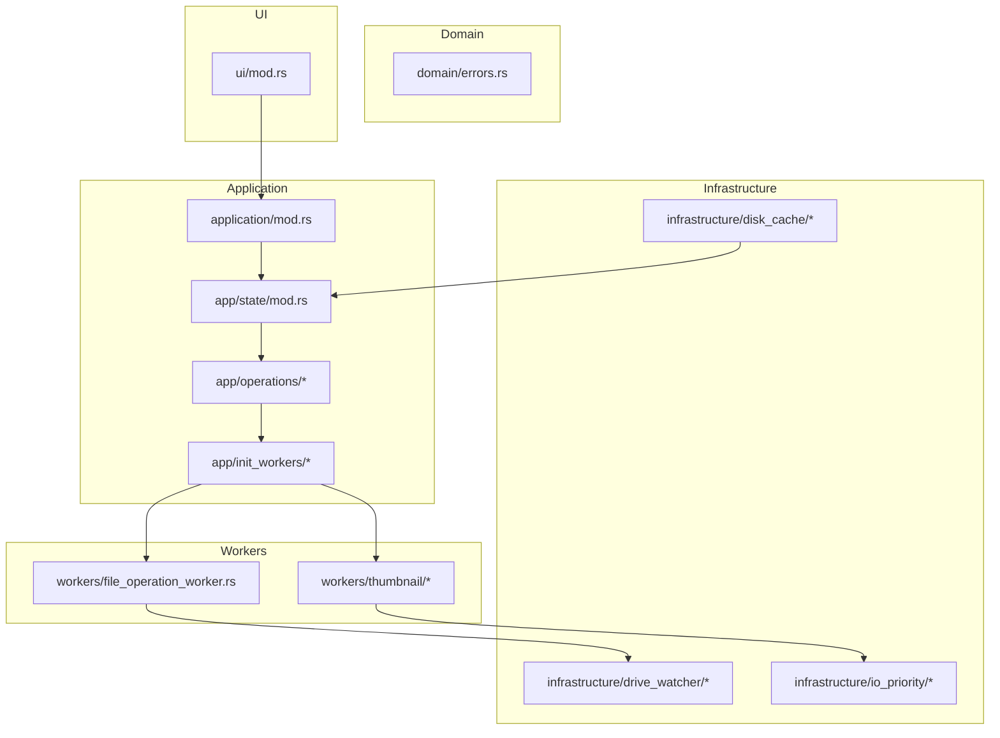
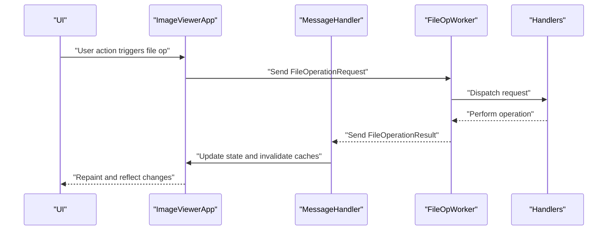
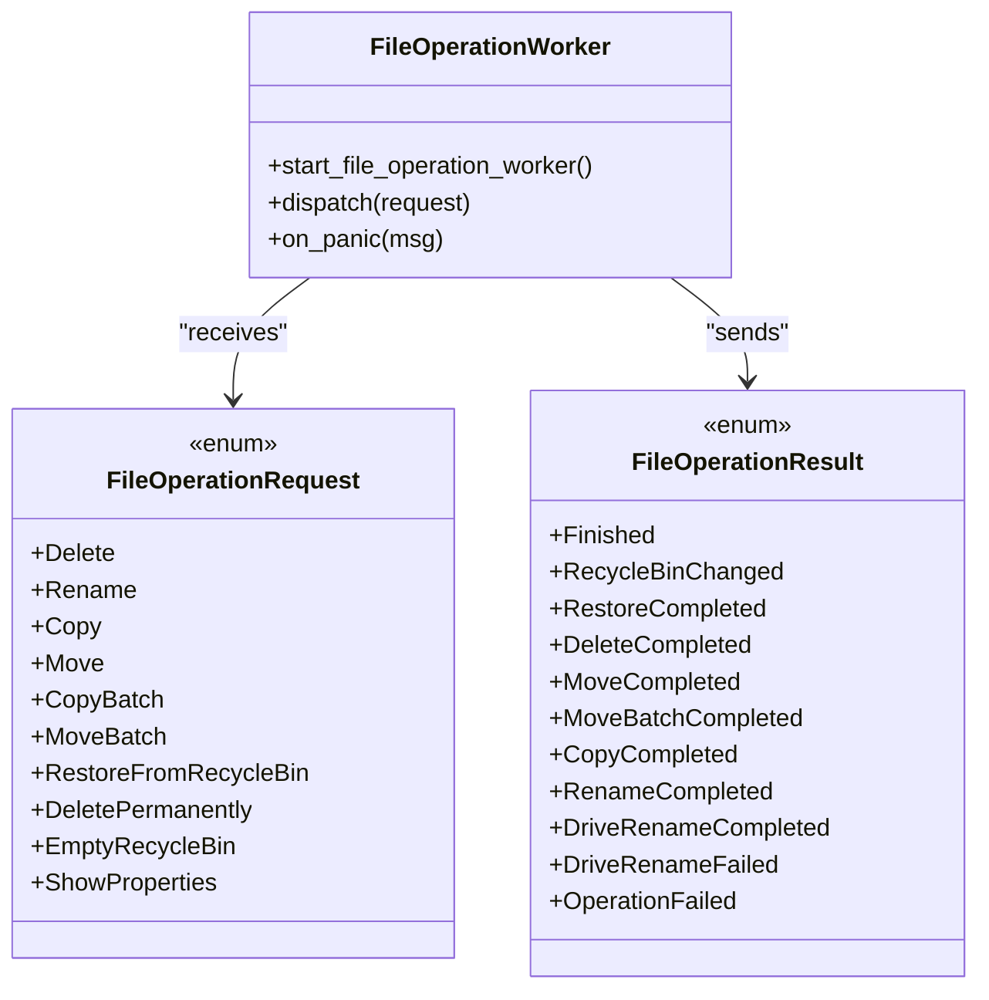
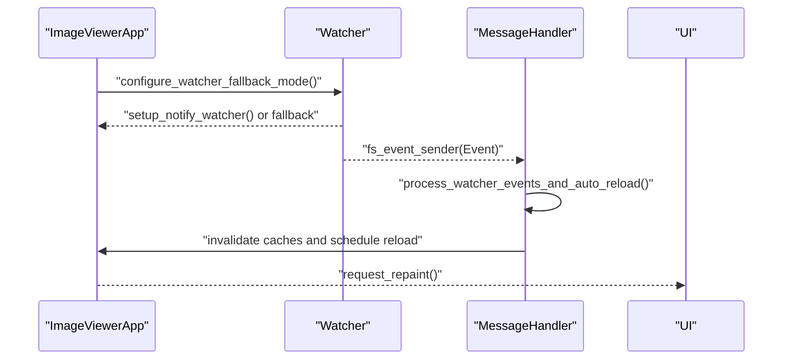
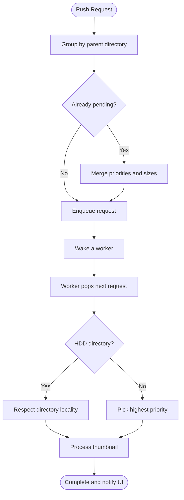
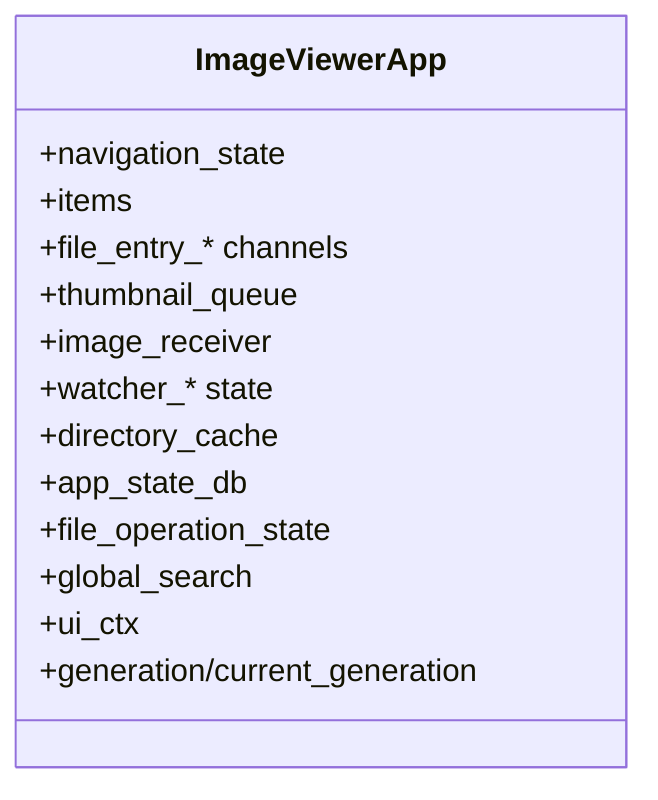
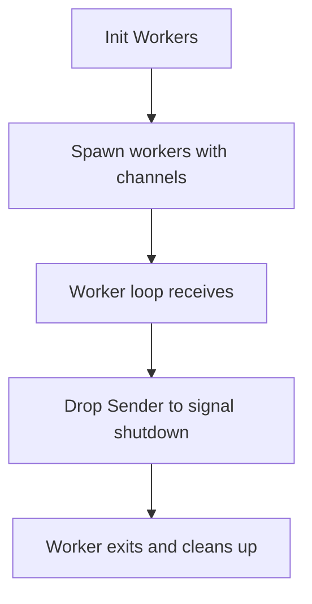
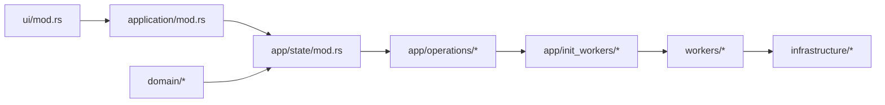

# Design Patterns & Architectural Principles

<cite>
**Referenced Files in This Document**
- [file_operation_worker.rs](file://src/workers/file_operation_worker.rs)
- [handlers.rs](file://src/workers/file_operation_worker/handlers.rs)
- [watcher.rs](file://src/app/operations/watcher.rs)
- [mod.rs (drive_watcher)](file://src/infrastructure/drive_watcher/mod.rs)
- [thread_loop.rs](file://src/infrastructure/drive_watcher/thread_loop.rs)
- [mod.rs (message_handler)](file://src/app/operations/message_handler/mod.rs)
- [watcher_legacy.rs](file://src/app/operations/message_handler/watcher_legacy.rs)
- [mod.rs (thumbnail queue)](file://src/workers/thumbnail/queue.rs)
- [worker.rs (thumbnail worker)](file://src/workers/thumbnail/worker.rs)
- [request_processing.rs (thumbnail worker)](file://src/workers/thumbnail/worker/request_processing.rs)
- [mod.rs (workers)](file://src/workers/mod.rs)
- [mod.rs (app state)](file://src/app/state/mod.rs)
- [mod.rs (app operations)](file://src/app/operations/mod.rs)
- [mod.rs (application layer)](file://src/application/mod.rs)
- [mod.rs (app init_workers)](file://src/app/init_workers/mod.rs)
- [pipeline_workers.rs](file://src/app/init_workers/pipeline_workers.rs)
- [shutdown.rs](file://src/app/operations/shutdown.rs)
- [errors.rs](file://src/domain/errors.rs)
- [mod.rs (ui)](file://src/ui/mod.rs)
</cite>

## Table of Contents
1. [Introduction](#introduction)
2. [Project Structure](#project-structure)
3. [Core Components](#core-components)
4. [Architecture Overview](#architecture-overview)
5. [Detailed Component Analysis](#detailed-component-analysis)
6. [Dependency Analysis](#dependency-analysis)
7. [Performance Considerations](#performance-considerations)
8. [Troubleshooting Guide](#troubleshooting-guide)
9. [Conclusion](#conclusion)

## Introduction
This document explains the design patterns and architectural principles implemented in MTT File Manager, focusing on:
- Command pattern for file operations
- Observer pattern for filesystem watchers
- Worker Pool pattern for background processing
- Application State pattern for centralized state management

It also documents layered architecture, separation of concerns, and SOLID principles, with concrete examples from the codebase, benefits, trade-offs, and how these patterns improve maintainability, testability, and performance.

## Project Structure
The application follows a layered architecture:
- Domain: Business entities and error handling
- Infrastructure: Platform integrations, IO, caching, and OS-specific features
- Application: State orchestration, worker coordination, and high-level operations
- UI: Rendering and user interaction

**Diagram sources**
- [mod.rs (app state):65-435](file://src/app/state/mod.rs#L65-L435)
- [mod.rs (app operations):1-31](file://src/app/operations/mod.rs#L1-L31)
- [mod.rs (application layer):1-47](file://src/application/mod.rs#L1-L47)
- [mod.rs (app init_workers):1-23](file://src/app/init_workers/mod.rs#L1-L23)
- [file_operation_worker.rs:1-353](file://src/workers/file_operation_worker.rs#L1-L353)
- [mod.rs (thumbnail queue):1-559](file://src/workers/thumbnail/queue.rs#L1-L559)
- [mod.rs (ui):1-22](file://src/ui/mod.rs#L1-L22)

**Section sources**
- [mod.rs (app state):1-444](file://src/app/state/mod.rs#L1-L444)
- [mod.rs (app operations):1-31](file://src/app/operations/mod.rs#L1-L31)
- [mod.rs (application layer):1-47](file://src/application/mod.rs#L1-L47)
- [mod.rs (app init_workers):1-23](file://src/app/init_workers/mod.rs#L1-L23)
- [mod.rs (ui):1-22](file://src/ui/mod.rs#L1-L22)

## Core Components
- Centralized Application State: A single struct aggregates UI state, worker channels, caches, and subsystems.
- Worker Pool: Dedicated background workers coordinate via typed channels and queues.
- File Operation Worker: Encapsulates Windows Shell operations behind a command interface.
- Watcher System: Observes filesystem changes and auto-refreshes content.
- Message Handler: Processes asynchronous results and updates state safely.

Benefits:
- Clear separation of concerns across layers
- Testability via isolated modules and channels
- Scalable background processing with prioritization
- Predictable state transitions and UI responsiveness

Trade-offs:
- Complexity in channel wiring and state synchronization
- Risk of deadlocks if not careful with shutdown and backpressure
- Performance overhead from coalescing and deduplication requires tuning

**Section sources**
- [mod.rs (app state):65-435](file://src/app/state/mod.rs#L65-L435)
- [file_operation_worker.rs:1-353](file://src/workers/file_operation_worker.rs#L1-L353)
- [mod.rs (thumbnail queue):1-559](file://src/workers/thumbnail/queue.rs#L1-L559)
- [watcher.rs:1-207](file://src/app/operations/watcher.rs#L1-L207)
- [mod.rs (message_handler):1-156](file://src/app/operations/message_handler/mod.rs#L1-L156)

## Architecture Overview
The system uses a hybrid of command and observer patterns with a central state container and worker pools.

**Diagram sources**
- [file_operation_worker.rs:225-328](file://src/workers/file_operation_worker.rs#L225-L328)
- [handlers.rs](file://src/workers/file_operation_worker/handlers.rs)
- [mod.rs (message_handler):70-96](file://src/app/operations/message_handler/mod.rs#L70-L96)
- [mod.rs (app state):417-418](file://src/app/state/mod.rs#L417-L418)

## Detailed Component Analysis

### Command Pattern: File Operations
The File Operation Worker encapsulates commands as a sealed enum and dispatches them to handlers. The worker thread runs a loop receiving commands, executes them, and sends results back.

Implementation highlights:
- Command envelope: a discriminated union of operations
- Dispatch loop with panic isolation and result signaling
- Security-aware path sanitization and namespace bypass rules
- Dedicated Windows COM STA thread for Shell operations

Benefits:
- Encapsulation of Shell complexity behind a simple command interface
- Isolation of UI thread from long-running operations
- Easy extensibility with new commands

Trade-offs:
- Requires careful error propagation and result handling
- COM threading constraints add operational complexity

Concrete examples:
- Command creation helpers for each operation variant
- Panic wrapping and result broadcasting
- Security validation and namespace handling

**Diagram sources**
- [file_operation_worker.rs:67-160](file://src/workers/file_operation_worker.rs#L67-L160)
- [file_operation_worker.rs:225-328](file://src/workers/file_operation_worker.rs#L225-L328)

**Section sources**
- [file_operation_worker.rs:1-353](file://src/workers/file_operation_worker.rs#L1-L353)
- [handlers.rs](file://src/workers/file_operation_worker/handlers.rs)

### Observer Pattern: Filesystem Watchers
The watcher system observes filesystem changes and triggers auto-reloads. It combines:
- Per-folder notify watcher (optional)
- Fallback mechanisms for non-USN filesystems
- Coalesced event delivery and UI-safe polling

Key behaviors:
- Adaptive fallback: USN journal vs polling vs verification mode
- Event coalescing and batching for UI throughput
- Debounced metadata rechecks and selective reloads

**Diagram sources**
- [watcher.rs:104-140](file://src/app/operations/watcher.rs#L104-L140)
- [watcher.rs:142-205](file://src/app/operations/watcher.rs#L142-L205)
- [mod.rs (message_handler):73-74](file://src/app/operations/message_handler/mod.rs#L73-L74)
- [mod.rs (message_handler):98-154](file://src/app/operations/message_handler/mod.rs#L98-L154)

**Section sources**
- [watcher.rs:1-207](file://src/app/operations/watcher.rs#L1-L207)
- [mod.rs (message_handler):1-156](file://src/app/operations/message_handler/mod.rs#L1-L156)
- [watcher_legacy.rs:265-308](file://src/app/operations/message_handler/watcher_legacy.rs#L265-L308)

### Worker Pool Pattern: Background Processing
The thumbnail subsystem demonstrates a worker pool with:
- A priority queue that groups by directory for HDD locality
- Multiple worker threads consuming from the queue
- Backpressure and shutdown signaling

**Diagram sources**
- [mod.rs (thumbnail queue):118-178](file://src/workers/thumbnail/queue.rs#L118-L178)
- [mod.rs (thumbnail queue):310-340](file://src/workers/thumbnail/queue.rs#L310-L340)
- [mod.rs (thumbnail queue):342-431](file://src/workers/thumbnail/queue.rs#L342-L431)
- [worker.rs (thumbnail worker)](file://src/workers/thumbnail/worker.rs)
- [request_processing.rs (thumbnail worker)](file://src/workers/thumbnail/worker/request_processing.rs)

**Section sources**
- [mod.rs (thumbnail queue):1-559](file://src/workers/thumbnail/queue.rs#L1-L559)
- [mod.rs (workers):1-9](file://src/workers/mod.rs#L1-L9)
- [mod.rs (app init_workers):1-23](file://src/app/init_workers/mod.rs#L1-L23)
- [pipeline_workers.rs:1-36](file://src/app/init_workers/pipeline_workers.rs#L1-L36)

### Application State Pattern: Centralized State Management
The central state container holds:
- UI state, worker channels, caches, and subsystems
- Generation counters for coordinated invalidation
- Watcher state and fallback logic
- Thumbnails, metadata, and live file size channels

Benefits:
- Single source of truth for UI and workers
- Simplifies inter-module communication via channels
- Enables consistent invalidation and cache management

Trade-offs:
- Requires disciplined updates and careful locking
- Risk of state divergence if not synchronized properly

**Diagram sources**
- [mod.rs (app state):65-435](file://src/app/state/mod.rs#L65-L435)

**Section sources**
- [mod.rs (app state):1-444](file://src/app/state/mod.rs#L1-L444)

### Shutdown and Cleanup
Graceful shutdown disconnects worker channels, allowing worker loops to exit deterministically.

**Diagram sources**
- [shutdown.rs:1-35](file://src/app/operations/shutdown.rs#L1-L35)
- [pipeline_workers.rs:13-36](file://src/app/init_workers/pipeline_workers.rs#L13-L36)

**Section sources**
- [shutdown.rs:1-35](file://src/app/operations/shutdown.rs#L1-L35)
- [pipeline_workers.rs:1-36](file://src/app/init_workers/pipeline_workers.rs#L1-L36)

## Dependency Analysis
The system exhibits strong separation of concerns:
- UI depends on Application layer
- Application orchestrates state and workers
- Workers depend on Infrastructure for IO and platform features
- Domain provides shared types and error handling

**Diagram sources**
- [mod.rs (ui):1-22](file://src/ui/mod.rs#L1-L22)
- [mod.rs (application layer):1-47](file://src/application/mod.rs#L1-L47)
- [mod.rs (app state):1-444](file://src/app/state/mod.rs#L1-L444)
- [mod.rs (app operations):1-31](file://src/app/operations/mod.rs#L1-L31)
- [mod.rs (app init_workers):1-23](file://src/app/init_workers/mod.rs#L1-L23)
- [mod.rs (workers):1-9](file://src/workers/mod.rs#L1-L9)

**Section sources**
- [mod.rs (ui):1-22](file://src/ui/mod.rs#L1-L22)
- [mod.rs (application layer):1-47](file://src/application/mod.rs#L1-L47)
- [mod.rs (app state):1-444](file://src/app/state/mod.rs#L1-L444)
- [mod.rs (app operations):1-31](file://src/app/operations/mod.rs#L1-L31)
- [mod.rs (app init_workers):1-23](file://src/app/init_workers/mod.rs#L1-L23)
- [mod.rs (workers):1-9](file://src/workers/mod.rs#L1-L9)

## Performance Considerations
- Worker pools and queues prioritize critical tasks and reduce disk seeks on HDDs
- Watcher coalescing and fallback modes minimize UI thread impact
- Message handler batches and throttles expensive operations
- Caching and LRU eviction limit memory footprint
- Shutdown disconnects ensure timely resource release

[No sources needed since this section provides general guidance]

## Troubleshooting Guide
Common issues and mitigations:
- Watcher floods: The message handler detects event floods and triggers full reloads and cache invalidations
- File operation panics: The worker wraps execution and reports failures without crashing the app
- State inconsistencies: Generation counters and shared atomic values coordinate updates across workers and UI

Concrete references:
- Flood detection and reload logic
- Panic handling and result signaling
- Generation and shared counters for coordinated updates

**Section sources**
- [watcher_legacy.rs:277-302](file://src/app/operations/message_handler/watcher_legacy.rs#L277-L302)
- [file_operation_worker.rs:300-320](file://src/workers/file_operation_worker.rs#L300-L320)
- [mod.rs (app state):182-183](file://src/app/state/mod.rs#L182-L183)

## Conclusion
MTT File Manager applies well-established patterns to achieve a responsive, scalable, and maintainable file manager:
- Command pattern encapsulates file operations cleanly
- Observer pattern with adaptive fallbacks keeps the UI current
- Worker Pool pattern with prioritization and locality optimization improves throughput
- Centralized Application State enables predictable updates and simplifies coordination

These patterns collectively enhance testability, maintainability, and performance, while preserving a clear separation of concerns and adherence to SOLID principles.