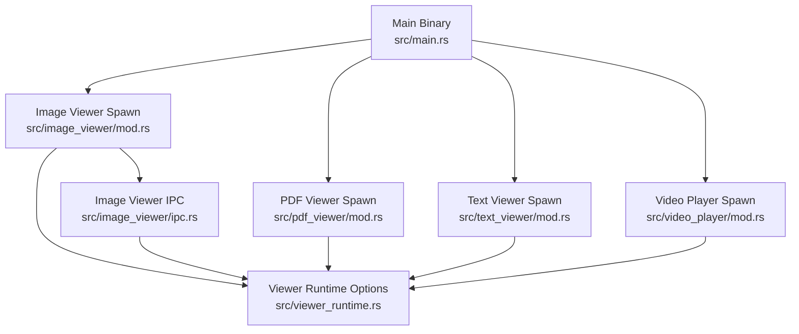
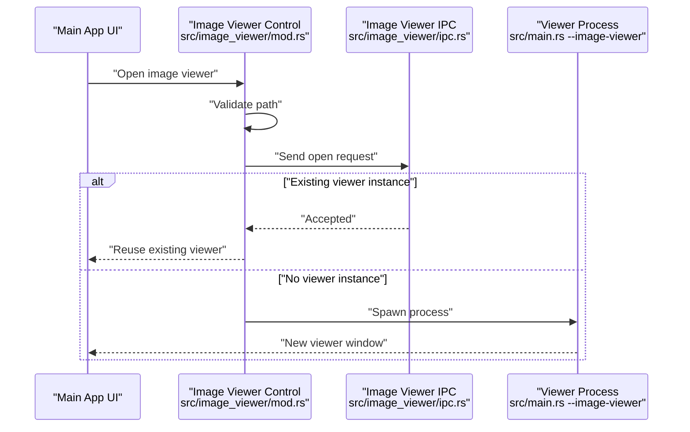
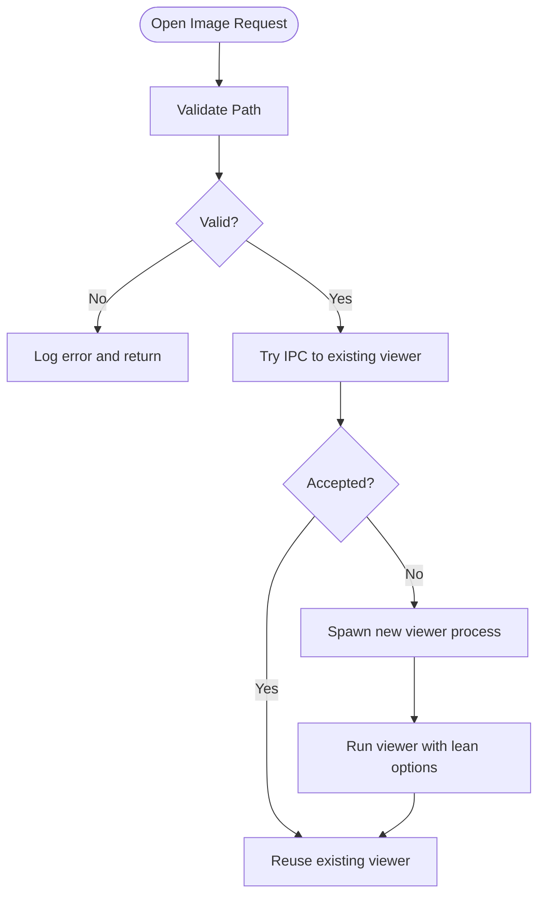
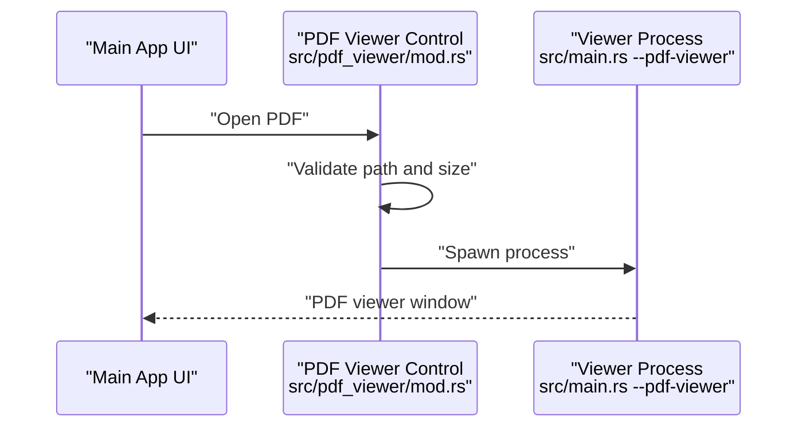
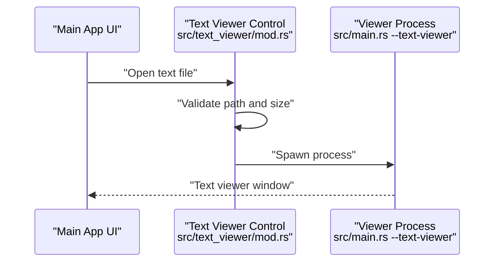
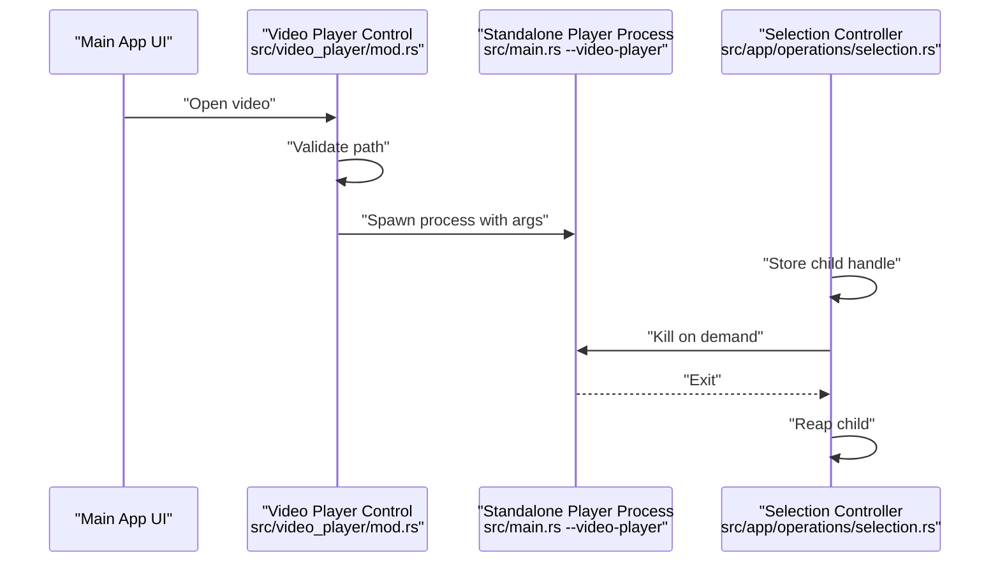
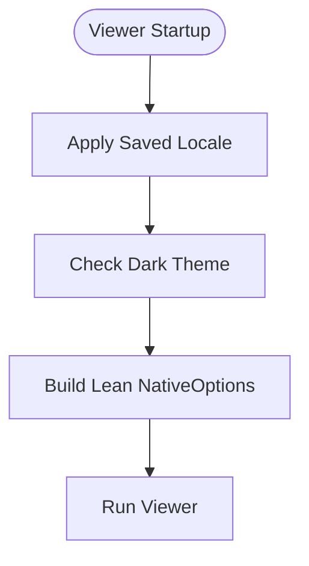
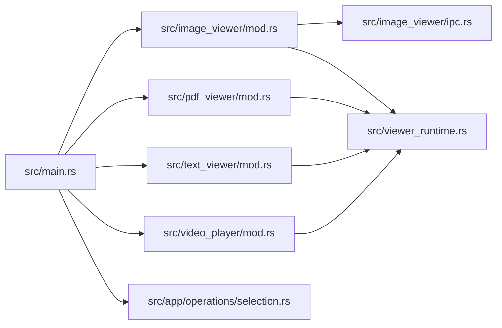

# Multi-Process Architecture

<cite>
**Referenced Files in This Document**
- [main.rs](file://src/main.rs)
- [viewer_runtime.rs](file://src/viewer_runtime.rs)
- [image_viewer/mod.rs](file://src/image_viewer/mod.rs)
- [image_viewer/ipc.rs](file://src/image_viewer/ipc.rs)
- [pdf_viewer/mod.rs](file://src/pdf_viewer/mod.rs)
- [text_viewer/mod.rs](file://src/text_viewer/mod.rs)
- [video_player/mod.rs](file://src/video_player/mod.rs)
- [app/operations/selection.rs](file://src/app/operations/selection.rs)
</cite>

## Table of Contents
1. [Introduction](#introduction)
2. [Project Structure](#project-structure)
3. [Core Components](#core-components)
4. [Architecture Overview](#architecture-overview)
5. [Detailed Component Analysis](#detailed-component-analysis)
6. [Dependency Analysis](#dependency-analysis)
7. [Performance Considerations](#performance-considerations)
8. [Troubleshooting Guide](#troubleshooting-guide)
9. [Conclusion](#conclusion)

## Introduction
This document explains the multi-process architecture used by the file manager to isolate viewers for images, PDFs, text, and videos. The main application binary doubles as a viewer launcher and spawns dedicated viewer processes for each file type. Viewer processes are short-lived, lightweight, and isolated from the main application to improve stability, security, and memory footprint. A shared runtime module configures lean startup defaults for viewers, and IPC mechanisms coordinate viewer reuse and lifecycle management.

## Project Structure
The multi-process design centers around a single binary with distinct entry points:
- Main application entry point initializes the primary UI and orchestrates viewer spawning.
- Dedicated viewer crates implement type-specific validation, UI, and lifecycle.
- A shared runtime module supplies lean startup options and locale/theme preferences for viewers.

**Diagram sources**
- [main.rs:144-215](file://src/main.rs#L144-L215)
- [image_viewer/mod.rs:125-199](file://src/image_viewer/mod.rs#L125-L199)
- [image_viewer/ipc.rs:32-91](file://src/image_viewer/ipc.rs#L32-L91)
- [pdf_viewer/mod.rs:114-139](file://src/pdf_viewer/mod.rs#L114-L139)
- [text_viewer/mod.rs:126-149](file://src/text_viewer/mod.rs#L126-L149)
- [video_player/mod.rs:108-144](file://src/video_player/mod.rs#L108-L144)
- [viewer_runtime.rs:73-85](file://src/viewer_runtime.rs#L73-L85)

**Section sources**
- [main.rs:144-215](file://src/main.rs#L144-L215)
- [viewer_runtime.rs:1-86](file://src/viewer_runtime.rs#L1-L86)

## Core Components
- Main binary entry point: Parses viewer flags, validates arguments, and delegates to the appropriate viewer runner.
- Viewer runtime: Supplies locale/theme and lean eframe NativeOptions tailored for low-memory viewers.
- Image viewer: Implements path validation, IPC to reuse an existing viewer instance, and process spawning.
- PDF viewer: Validates PDF-specific constraints and spawns a dedicated process.
- Text viewer: Validates text constraints and spawns a dedicated process.
- Video player: Validates media constraints, spawns a dedicated process, and manages mpv configuration.
- Selection controller: Manages lifecycle of the standalone video player process (kill/reap).

**Section sources**
- [main.rs:106-305](file://src/main.rs#L106-L305)
- [viewer_runtime.rs:32-85](file://src/viewer_runtime.rs#L32-L85)
- [image_viewer/mod.rs:125-199](file://src/image_viewer/mod.rs#L125-L199)
- [image_viewer/ipc.rs:32-91](file://src/image_viewer/ipc.rs#L32-L91)
- [pdf_viewer/mod.rs:114-151](file://src/pdf_viewer/mod.rs#L114-L151)
- [text_viewer/mod.rs:126-210](file://src/text_viewer/mod.rs#L126-L210)
- [video_player/mod.rs:108-144](file://src/video_player/mod.rs#L108-L144)
- [app/operations/selection.rs:50-67](file://src/app/operations/selection.rs#L50-L67)

## Architecture Overview
The multi-process architecture separates concerns by:
- Process isolation: Each viewer runs in its own process, preventing crashes and memory leaks from affecting the main application.
- Lightweight viewers: Viewer processes use a minimal runtime to avoid loading heavy subsystems (e.g., WGPU backends) unless needed.
- Viewer reuse: The image viewer uses named-pipe IPC to forward open requests to an existing viewer instance, avoiding redundant processes.
- Lifecycle control: The main app spawns viewers and can terminate or reap them as needed (notably the video player).

**Diagram sources**
- [image_viewer/mod.rs:125-199](file://src/image_viewer/mod.rs#L125-L199)
- [image_viewer/ipc.rs:32-91](file://src/image_viewer/ipc.rs#L32-L91)
- [main.rs:164-171](file://src/main.rs#L164-L171)

## Detailed Component Analysis

### Image Viewer: Process Spawning and IPC
- Path validation prevents unsafe paths and invalid extensions.
- IPC attempts to reuse an existing viewer instance by sending an open request through a named pipe. If the pipe is not present, a new process is spawned.
- The viewer process applies locale/theme and starts with lean eframe options.

**Diagram sources**
- [image_viewer/mod.rs:143-199](file://src/image_viewer/mod.rs#L143-L199)
- [image_viewer/ipc.rs:32-91](file://src/image_viewer/ipc.rs#L32-L91)
- [viewer_runtime.rs:58-85](file://src/viewer_runtime.rs#L58-L85)

**Section sources**
- [image_viewer/mod.rs:125-199](file://src/image_viewer/mod.rs#L125-L199)
- [image_viewer/ipc.rs:32-91](file://src/image_viewer/ipc.rs#L32-L91)
- [viewer_runtime.rs:58-85](file://src/viewer_runtime.rs#L58-L85)

### PDF Viewer: Process Spawning and Validation
- Validates extension, existence, and file size limits.
- Spawns a dedicated process with lean runtime options and locale/theme applied.

**Diagram sources**
- [pdf_viewer/mod.rs:114-139](file://src/pdf_viewer/mod.rs#L114-L139)
- [main.rs:172-179](file://src/main.rs#L172-L179)

**Section sources**
- [pdf_viewer/mod.rs:114-151](file://src/pdf_viewer/mod.rs#L114-L151)
- [main.rs:172-179](file://src/main.rs#L172-L179)

### Text Viewer: Process Spawning and Validation
- Validates extension set, existence, and file size limits.
- Spawns a dedicated process with lean runtime options and locale/theme applied.

**Diagram sources**
- [text_viewer/mod.rs:126-149](file://src/text_viewer/mod.rs#L126-L149)
- [main.rs:180-187](file://src/main.rs#L180-L187)

**Section sources**
- [text_viewer/mod.rs:126-210](file://src/text_viewer/mod.rs#L126-L210)
- [main.rs:180-187](file://src/main.rs#L180-L187)

### Video Player: Process Spawning and Lifecycle Management
- Validates path and file size limits.
- Spawns a dedicated process with optional position and volume arguments.
- The main app can kill the process immediately or reap it when it exits.

**Diagram sources**
- [video_player/mod.rs:108-144](file://src/video_player/mod.rs#L108-L144)
- [main.rs:189-214](file://src/main.rs#L189-L214)
- [app/operations/selection.rs:50-67](file://src/app/operations/selection.rs#L50-L67)

**Section sources**
- [video_player/mod.rs:108-144](file://src/video_player/mod.rs#L108-L144)
- [main.rs:189-214](file://src/main.rs#L189-L214)
- [app/operations/selection.rs:50-67](file://src/app/operations/selection.rs#L50-L67)

### Viewer Runtime: Lean Startup Defaults
- Reads locale and theme preferences via a minimal SQLite read.
- Builds eframe NativeOptions with a lightweight renderer and disabled optional buffers to reduce memory footprint.

**Diagram sources**
- [viewer_runtime.rs:58-85](file://src/viewer_runtime.rs#L58-L85)

**Section sources**
- [viewer_runtime.rs:32-85](file://src/viewer_runtime.rs#L32-L85)

## Dependency Analysis
- Viewer reuse relies on a named pipe IPC channel for the image viewer. If the pipe is absent, the main app spawns a new viewer process.
- All viewers share the same binary and rely on the shared runtime for lean startup.
- The selection controller coordinates the lifecycle of the standalone video player process.

**Diagram sources**
- [main.rs:144-215](file://src/main.rs#L144-L215)
- [image_viewer/mod.rs:125-199](file://src/image_viewer/mod.rs#L125-L199)
- [image_viewer/ipc.rs:32-91](file://src/image_viewer/ipc.rs#L32-L91)
- [pdf_viewer/mod.rs:114-139](file://src/pdf_viewer/mod.rs#L114-L139)
- [text_viewer/mod.rs:126-149](file://src/text_viewer/mod.rs#L126-L149)
- [video_player/mod.rs:108-144](file://src/video_player/mod.rs#L108-L144)
- [viewer_runtime.rs:58-85](file://src/viewer_runtime.rs#L58-L85)
- [app/operations/selection.rs:50-67](file://src/app/operations/selection.rs#L50-L67)

**Section sources**
- [main.rs:144-215](file://src/main.rs#L144-L215)
- [image_viewer/ipc.rs:32-91](file://src/image_viewer/ipc.rs#L32-L91)
- [viewer_runtime.rs:58-85](file://src/viewer_runtime.rs#L58-L85)
- [app/operations/selection.rs:50-67](file://src/app/operations/selection.rs#L50-L67)

## Performance Considerations
- Reduced memory footprint: Viewers use a lightweight renderer and disable optional buffers, minimizing RSS even for tiny text files.
- Faster startup: Lean runtime avoids initializing heavy subsystems (e.g., WGPU backends) until necessary.
- Viewer reuse: IPC forwarding reduces process creation overhead when opening the same or another image.
- Controlled latency: The main app configures WGPU with a single-frame latency for responsive UI updates.

[No sources needed since this section provides general guidance]

## Troubleshooting Guide
- Viewer does not open:
  - Verify path validation messages for images/PDFs/text.
  - Confirm the viewer process is spawned with the correct flag and path.
- Viewer reuse not working:
  - Check IPC server thread status and pipe availability.
  - Ensure the pipe is not busy and that the viewer instance is running.
- Video player lifecycle issues:
  - Use the selection controller to kill or reap the process if needed.
  - Confirm optional arguments (position, volume) are parsed correctly.

**Section sources**
- [image_viewer/mod.rs:143-199](file://src/image_viewer/mod.rs#L143-L199)
- [image_viewer/ipc.rs:93-139](file://src/image_viewer/ipc.rs#L93-L139)
- [app/operations/selection.rs:50-67](file://src/app/operations/selection.rs#L50-L67)

## Conclusion
The multi-process architecture isolates viewers for images, PDFs, text, and videos, improving stability, security, and memory efficiency. The shared runtime ensures lean startup, while IPC enables viewer reuse for images. The main application retains control over viewer lifecycles, particularly for the video player. Together, these patterns deliver robustness and responsiveness across diverse file types.