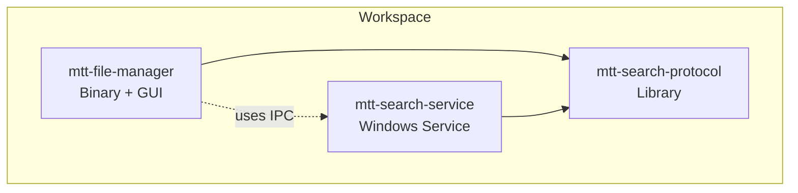
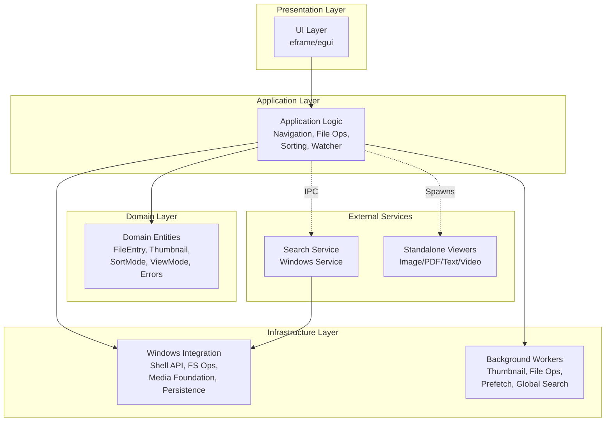
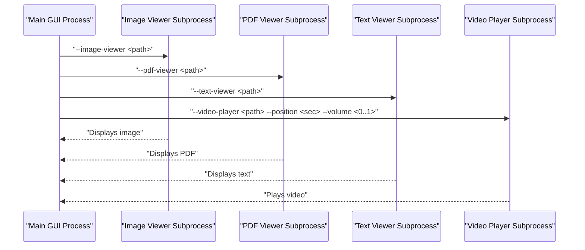
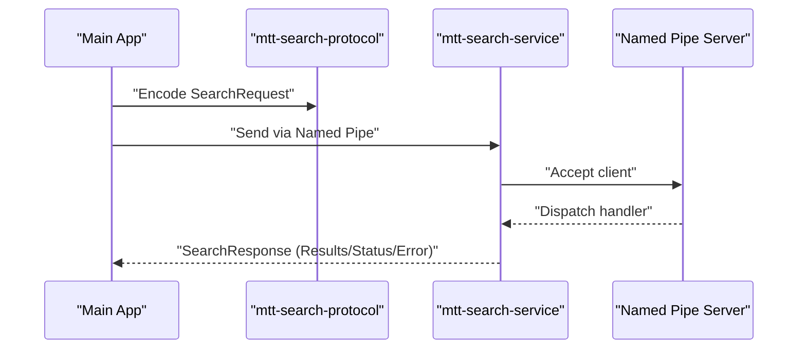
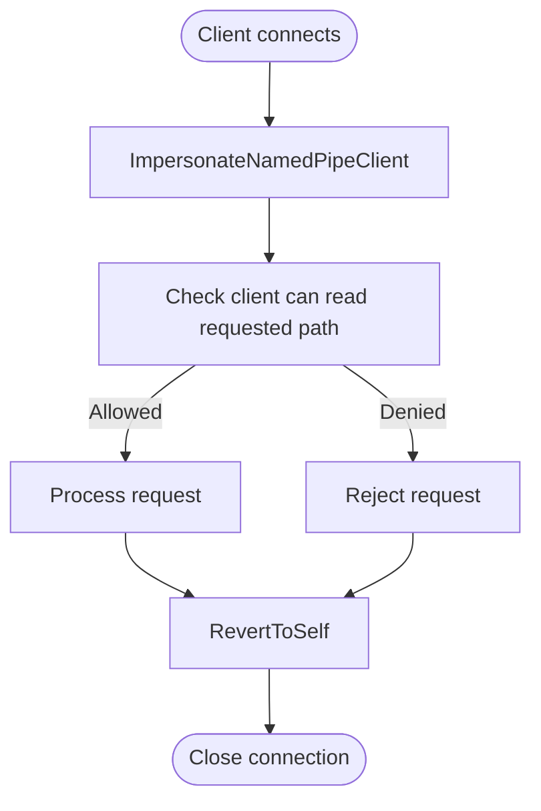
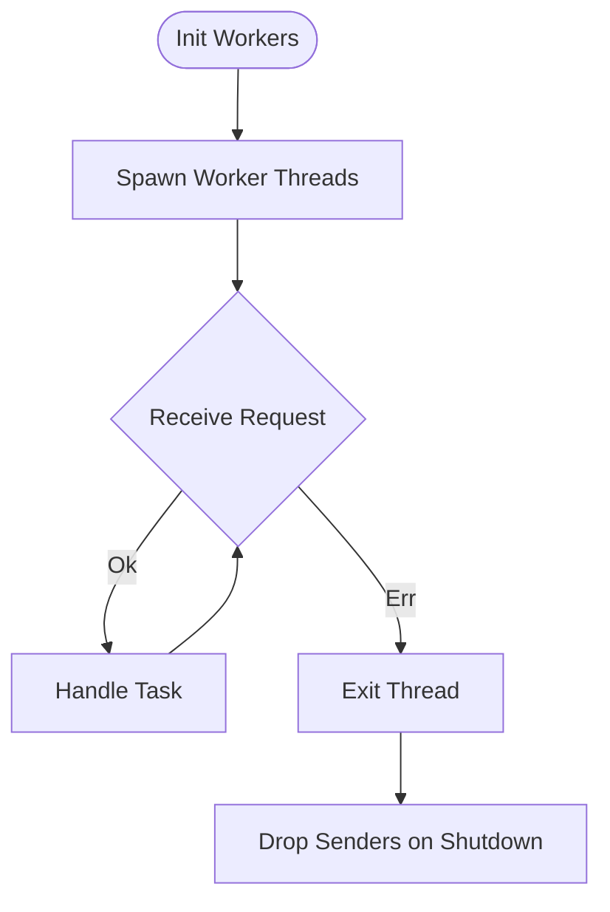
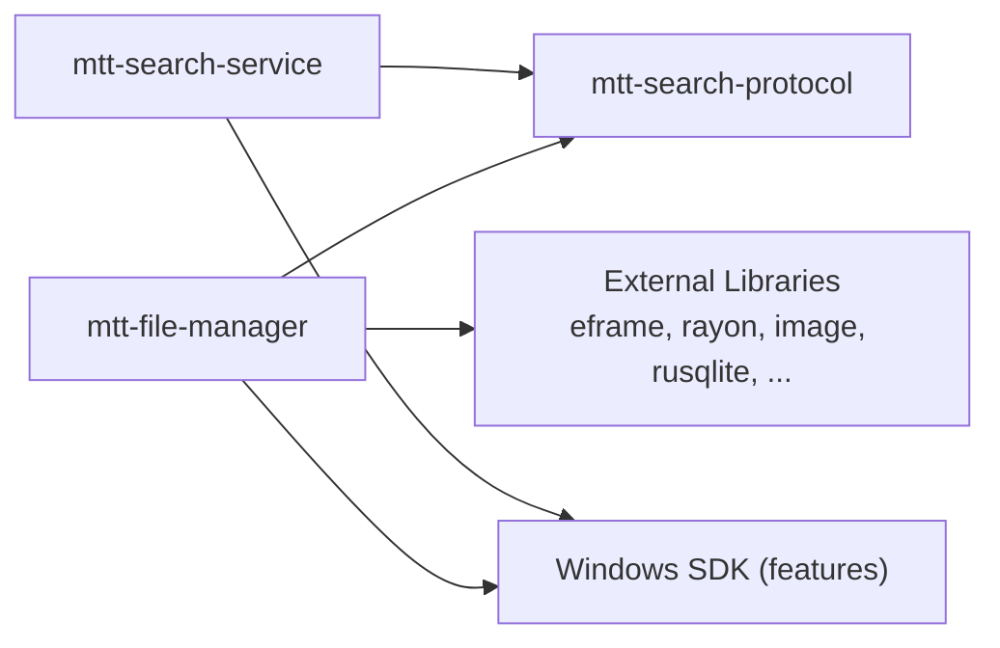

# Overall System Architecture

<cite>
**Referenced Files in This Document**
- [Cargo.toml](file://Cargo.toml)
- [src/lib.rs](file://src/lib.rs)
- [src/main.rs](file://src/main.rs)
- [src/app/mod.rs](file://src/app/mod.rs)
- [src/infrastructure/mod.rs](file://src/infrastructure/mod.rs)
- [src/workers/mod.rs](file://src/workers/mod.rs)
- [src/viewer_runtime.rs](file://src/viewer_runtime.rs)
- [crates/mtt-search-protocol/src/lib.rs](file://crates/mtt-search-protocol/src/lib.rs)
- [crates/mtt-search-service/src/main.rs](file://crates/mtt-search-service/src/main.rs)
- [crates/mtt-search-service/src/ipc_server/mod.rs](file://crates/mtt-search-service/src/ipc_server/mod.rs)
- [crates/mtt-search-service/src/ipc_authorization.rs](file://crates/mtt-search-service/src/ipc_authorization.rs)
- [docs/03_architecture.md](file://docs/03_architecture.md)
- [docs/04_module_map.md](file://docs/04_module_map.md)
</cite>

## Update Summary
**Changes Made**
- Updated to reflect the comprehensive architecture documentation (docs/03_architecture.md) that was added
- Enhanced layered architecture coverage with detailed component responsibilities
- Expanded multi-process design documentation with specific viewer processes
- Added comprehensive search service architecture details
- Updated communication patterns and lifecycle management sections
- Enhanced security and IPC authorization documentation

## Table of Contents
1. [Introduction](#introduction)
2. [Project Structure](#project-structure)
3. [Core Components](#core-components)
4. [Architecture Overview](#architecture-overview)
5. [Detailed Component Analysis](#detailed-component-analysis)
6. [Dependency Analysis](#dependency-analysis)
7. [Performance Considerations](#performance-considerations)
8. [Troubleshooting Guide](#troubleshooting-guide)
9. [Conclusion](#conclusion)

## Introduction
This document describes the overall system architecture of MTT File Manager. It explains the layered architecture separating Presentation, Application, Domain, and Infrastructure concerns, documents the multi-process design (main GUI process, dedicated viewer processes, and background worker threads), and details the workspace structure with three crates: mtt-file-manager, mtt-search-protocol, and mtt-search-service. It also covers system boundaries, component relationships, and data flow patterns, and presents architectural diagrams to illustrate interactions between the UI, workers, infrastructure, and external services.

**Updated** Enhanced with comprehensive architecture documentation covering detailed component responsibilities and communication patterns.

## Project Structure
The project is organized as a Cargo workspace with three crates:
- mtt-file-manager (binary): Main GUI application built with eframe/egui, hosting the primary UI and coordinating workers and infrastructure.
- mtt-search-protocol (library): Defines shared IPC types and serialization for communication with the search service.
- mtt-search-service (binary): A Windows service that performs hybrid indexing (USN-based and fallback scanning), persists indices, and exposes a named pipe server for search queries.

**Diagram sources**
- [Cargo.toml:1-137](file://Cargo.toml#L1-L137)
- [docs/03_architecture.md:1-20](file://docs/03_architecture.md#L1-L20)

**Section sources**
- [Cargo.toml:1-137](file://Cargo.toml#L1-L137)
- [docs/03_architecture.md:1-20](file://docs/03_architecture.md#L1-L20)
- [docs/04_module_map.md:291-322](file://docs/04_module_map.md#L291-L322)

## Core Components
- **Presentation Layer**: Built on eframe/egui, providing the immediate-mode UI with toolbars, tab bar, file list, sidebar, and preview panel. The main entry point initializes the window, GPU backend preferences, and optional viewer modes.
- **Application Layer**: Orchestrates navigation, file operations, clipboard, sorting, watchers, and UI state transitions. It coordinates background workers and integrates with infrastructure for file system operations and caching.
- **Domain Layer**: Encapsulates core domain entities such as FileEntry, DriveInfo, Thumbnail, SortMode, ViewMode, and error types (AppError).
- **Infrastructure Layer**: Provides Windows-specific integrations (Shell API, File System, Media Foundation, COM), persistence (SQLite), caching (disk and directory caches), and worker threading primitives. Also includes specialized modules for OneDrive, security, and virtual drive configuration.

Key runtime characteristics:
- **Multi-process design**: The main GUI process spawns dedicated viewer subprocesses for images, PDFs, text, and videos. Each viewer process uses a lightweight runtime to minimize resource usage.
- **Background workers**: Dedicated worker threads handle thumbnail extraction, file operations, prefetching, global search, and idle warmup. They communicate via channels and are designed for graceful shutdown.

**Updated** Enhanced with detailed component responsibilities and runtime characteristics from the comprehensive architecture documentation.

**Section sources**
- [src/lib.rs:1-20](file://src/lib.rs#L1-L20)
- [src/main.rs:106-305](file://src/main.rs#L106-L305)
- [src/app/mod.rs:1-32](file://src/app/mod.rs#L1-L32)
- [src/infrastructure/mod.rs:1-26](file://src/infrastructure/mod.rs#L1-L26)
- [src/workers/mod.rs:1-9](file://src/workers/mod.rs#L1-L9)
- [src/viewer_runtime.rs:1-86](file://src/viewer_runtime.rs#L1-L86)

## Architecture Overview
MTT File Manager follows a layered architecture with clear separation of responsibilities:

**Diagram sources**
- [docs/03_architecture.md:22-101](file://docs/03_architecture.md#L22-L101)
- [src/main.rs:144-215](file://src/main.rs#L144-L215)
- [crates/mtt-search-service/src/main.rs:112-307](file://crates/mtt-search-service/src/main.rs#L112-L307)

**Section sources**
- [docs/03_architecture.md:22-101](file://docs/03_architecture.md#L22-L101)

## Detailed Component Analysis

### Multi-Process Design
The system employs a multi-process architecture:
- **Main GUI process**: Initializes the eframe window, manages UI state, and coordinates workers. It supports optional viewer modes via command-line flags.
- **Dedicated viewer processes**: Separate subprocesses for image, PDF, text, and video viewing. Each uses a lightweight runtime to reduce startup overhead and memory footprint.
- **Search service process**: A Windows service that runs independently, performing indexing and exposing a named pipe interface for search queries.

**Diagram sources**
- [src/main.rs:144-215](file://src/main.rs#L144-L215)
- [src/viewer_runtime.rs:75-85](file://src/viewer_runtime.rs#L75-L85)

**Section sources**
- [src/main.rs:144-215](file://src/main.rs#L144-L215)
- [src/viewer_runtime.rs:1-86](file://src/viewer_runtime.rs#L1-L86)

### Search Service and IPC
The search service runs as a separate Windows service, exposing a named pipe interface for the main application to query file metadata and status. The protocol crate defines strongly-typed requests and responses with validation limits to prevent abuse.

**Diagram sources**
- [crates/mtt-search-protocol/src/lib.rs:1-290](file://crates/mtt-search-protocol/src/lib.rs#L1-L290)
- [crates/mtt-search-service/src/main.rs:112-307](file://crates/mtt-search-service/src/main.rs#L112-L307)
- [crates/mtt-search-service/src/ipc_server/mod.rs:68-104](file://crates/mtt-search-service/src/ipc_server/mod.rs#L68-L104)

**Section sources**
- [crates/mtt-search-protocol/src/lib.rs:1-290](file://crates/mtt-search-protocol/src/lib.rs#L1-L290)
- [crates/mtt-search-service/src/main.rs:112-307](file://crates/mtt-search-service/src/main.rs#L112-L307)
- [crates/mtt-search-service/src/ipc_server/mod.rs:68-104](file://crates/mtt-search-service/src/ipc_server/mod.rs#L68-L104)

### IPC Authorization and Security
The search service enforces client authorization to ensure only authorized clients can access the pipe. It impersonates the named pipe client to evaluate permissions against requested paths and reverts to self afterward.

**Diagram sources**
- [crates/mtt-search-service/src/ipc_authorization.rs:30-76](file://crates/mtt-search-service/src/ipc_authorization.rs#L30-L76)

**Section sources**
- [crates/mtt-search-service/src/ipc_authorization.rs:30-76](file://crates/mtt-search-service/src/ipc_authorization.rs#L30-L76)

### Background Workers and Threading
The application spawns dedicated worker threads for tasks such as thumbnail extraction, file operations, prefetching, and global search. These workers are designed for graceful shutdown by dropping their senders, which causes receive loops to exit deterministically.

**Diagram sources**
- [src/app/operations/shutdown.rs:1-35](file://src/app/operations/shutdown.rs#L1-L35)
- [src/workers/mod.rs:1-9](file://src/workers/mod.rs#L1-L9)

**Section sources**
- [src/app/operations/shutdown.rs:1-35](file://src/app/operations/shutdown.rs#L1-L35)
- [src/workers/mod.rs:1-9](file://src/workers/mod.rs#L1-L9)

### Detailed Layered Architecture
The system follows a comprehensive layered architecture with detailed responsibilities:

**Presentation Layer (UI)**
- **Location**: `src/ui/`
- **Components**: Toolbar, tab bar, file views, sidebar, preview panel, status bar, app lifecycle, notifications
- **Framework**: eframe/egui immediate-mode GUI

**Application Layer**
- **Location**: `src/application/`
- **Responsibilities**: Navigation history, file operations, clipboard management, sorting and filtering, filesystem watchers
- **Services**: Toast notifications, file rename logic, context menu handling

**Domain Layer**
- **Location**: `src/domain/`
- **Entities**: FileEntry, DriveInfo, Thumbnail, SortMode, ViewMode, AppError
- **Structures**: FolderLock, PinnedFolder, SpecialPaths

**Infrastructure Layer**
- **Location**: `src/infrastructure/`
- **Windows Integration**: Shell API, File System, Media Foundation, COM wrappers
- **Data Layer**: SQLite cache, filesystem access, memory cache, directory index
- **Specialized Modules**: OneDrive integration, security validation, virtual drive configuration

**Workers Layer**
- **Location**: `src/workers/`
- **Types**: Thumbnail extraction (multi-stage), file operations, folder preview, prefetch, idle warmup, global search

**Section sources**
- [docs/03_architecture.md:103-228](file://docs/03_architecture.md#L103-L228)

### Search Service Architecture
The search service implements a sophisticated hybrid indexing system:

**Service Components**
- **Volume Management**: USN journal for NTFS/ReFS, fallback full-tree scanner for other filesystems
- **Index Persistence**: Binary snapshots and SQLite for startup acceleration
- **In-Memory Search**: SIMD matcher for fast query responses
- **Security**: Client authorization, path validation, rate limiting

**Indexing Strategy**
1. Volume discovery via `GetVolumeInformationW`
2. Per-volume indexing threads with USN journal catch-up
3. Binary snapshot caching with CRC validation
4. SQLite metadata synchronization
5. Incremental 2-second loop for USN updates

**IPC Protocol**
- **Transport**: Named pipes with bincode serialization
- **Security**: DACL enforcement, client impersonation
- **Limits**: Payload size caps, result count limits, query timeouts
- **Requests**: Query, GetStatus, Ping, WarmIndex, CheckPathsModified, FolderSize

**Section sources**
- [docs/03_architecture.md:229-261](file://docs/03_architecture.md#L229-L261)
- [crates/mtt-search-service/src/main.rs:190-307](file://crates/mtt-search-service/src/main.rs#L190-L307)

### Viewer Process Architecture
The system includes dedicated viewer processes for different file types:

**Image Viewer**
- **Process**: Separate process with `--image-viewer` flag
- **Cache**: GPU texture sliding window with crossbeam channels
- **Decoding**: Memory-mapped files, EXIF orientation, WIC fallback
- **Performance**: Atomic center tracking, bounded channels, previous image visibility

**PDF Viewer**
- **Process**: Native PDF rendering via pdfium library
- **Security**: Path validation, file size limits, dynamic DLL loading
- **Features**: Text selection, toolbar navigation, bounded texture cache

**Text Viewer**
- **Process**: Lightweight text rendering with shared runtime
- **Memory**: Content storage as String with line offsets
- **Validation**: Path validation, size limits, extension checks

**Video Player**
- **Process**: mpv-based player with D3D11 pipeline
- **Controls**: Native OSC controls, subtitle picker
- **Parameters**: Position and volume passed via CLI

**Section sources**
- [docs/03_architecture.md:262-319](file://docs/03_architecture.md#L262-L319)

### Application Lifecycle Management
The application follows a structured lifecycle with clear startup, operation, and shutdown phases:

**Startup Sequence**
1. Initialize codec registry
2. Load application icon
3. Clean eframe storage
4. Configure viewport (hidden, borderless, small initial size)
5. Read GPU backend preference
6. Initialize eframe with WGPU options
7. Create ImageViewerApp instance

**Main Loop Operations**
1. Process worker messages (thumbnails, files, icons, metadata)
2. Handle filesystem events (watcher)
3. Update UI state
4. Process user input (keyboard, mouse)
5. Render components
6. Update cache and thumbnails
7. Manage animations (GIFs, videos)

**Shutdown Process**
- Drop worker senders to signal threads
- Persist cache automatically
- Release COM resources via RAII
- Force-kill if process hangs

**Section sources**
- [docs/03_architecture.md:342-385](file://docs/03_architecture.md#L342-L385)

## Dependency Analysis
The workspace dependencies define the relationship between crates and shared libraries. The main application depends on the search protocol crate and integrates Windows APIs and third-party libraries for UI, media, and file operations.

**Diagram sources**
- [Cargo.toml:1-137](file://Cargo.toml#L1-L137)
- [crates/mtt-search-service/Cargo.toml:1-33](file://crates/mtt-search-service/Cargo.toml#L1-L33)
- [crates/mtt-search-protocol/Cargo.toml:1-9](file://crates/mtt-search-protocol/Cargo.toml#L1-L9)

**Section sources**
- [Cargo.toml:1-137](file://Cargo.toml#L1-L137)
- [crates/mtt-search-service/Cargo.toml:1-33](file://crates/mtt-search-service/Cargo.toml#L1-L33)
- [crates/mtt-search-protocol/Cargo.toml:1-9](file://crates/mtt-search-protocol/Cargo.toml#L1-L9)

## Performance Considerations
- **GPU backend selection**: The main GUI process selects a high-performance GPU backend and minimizes frame latency by limiting queued frames.
- **Lightweight viewers**: Standalone viewers use a minimal runtime and a simpler renderer to reduce memory usage and improve responsiveness.
- **Background worker design**: Workers use channels and atomic flags for graceful shutdown, preventing resource leaks and ensuring clean termination.
- **IPC limits**: The protocol enforces maximum payload sizes and result counts to mitigate abuse and protect system resources.
- **DLL search hardening**: Both the main process and the search service remove the current working directory from the default DLL search order to prevent DLL planting attacks.
- **Adaptive batching**: Directory loading uses adaptive batch sizing to optimize performance across different storage types.
- **Memory management**: Sliding-window GPU texture caching in viewers prevents memory accumulation during navigation.
- **I/O priority**: Grouped queue management ensures critical operations receive appropriate system resources.

**Updated** Enhanced with additional performance optimizations including adaptive batching, memory management, and I/O priority considerations.

## Troubleshooting Guide
- **Logging levels**: The main process adjusts log verbosity depending on whether a console is attached to avoid excessive allocations on background threads.
- **Graceful shutdown**: The application disconnects worker senders during shutdown to signal threads to exit cleanly.
- **IPC connectivity**: The image viewer IPC server retries connecting to the pipe with backoff and validates payloads to prevent injection attacks.
- **Service mode**: The search service supports installation, uninstallation, and console modes for debugging and deployment.
- **Authorization failures**: Client impersonation failures typically indicate SQOS issues or permission problems.
- **Indexing timeouts**: Extended indexing operations may indicate slow storage or antivirus interference.
- **Viewer crashes**: Memory issues in viewers often stem from large image files or insufficient GPU memory.

**Section sources**
- [src/main.rs:121-141](file://src/main.rs#L121-L141)
- [src/app/operations/shutdown.rs:1-35](file://src/app/operations/shutdown.rs#L1-L35)
- [src/image_viewer/ipc.rs:67-296](file://src/image_viewer/ipc.rs#L67-L296)
- [crates/mtt-search-service/src/main.rs:112-156](file://crates/mtt-search-service/src/main.rs#L112-L156)

## Conclusion
MTT File Manager's architecture cleanly separates concerns across Presentation, Application, Domain, and Infrastructure layers, while leveraging a multi-process design for scalability and maintainability. The main GUI process coordinates extensive background workers, integrates with Windows subsystems, and communicates with a dedicated search service via a secure named pipe interface. The workspace is structured around three crates that encapsulate the GUI, IPC protocol, and the search service, enabling clear boundaries and focused responsibilities. These design choices support performance, scalability, and robustness across diverse file management scenarios.

**Updated** Enhanced conclusion reflecting the comprehensive architecture documentation and detailed component analysis provided in the new architecture document.