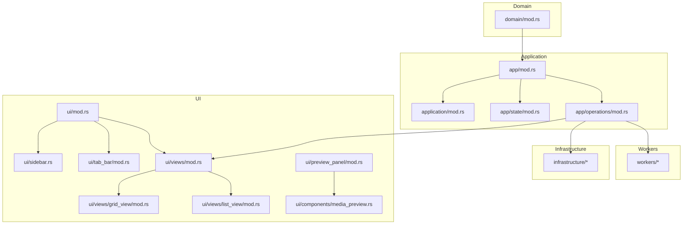
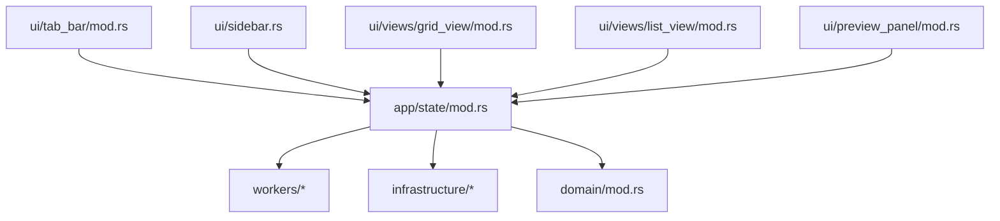
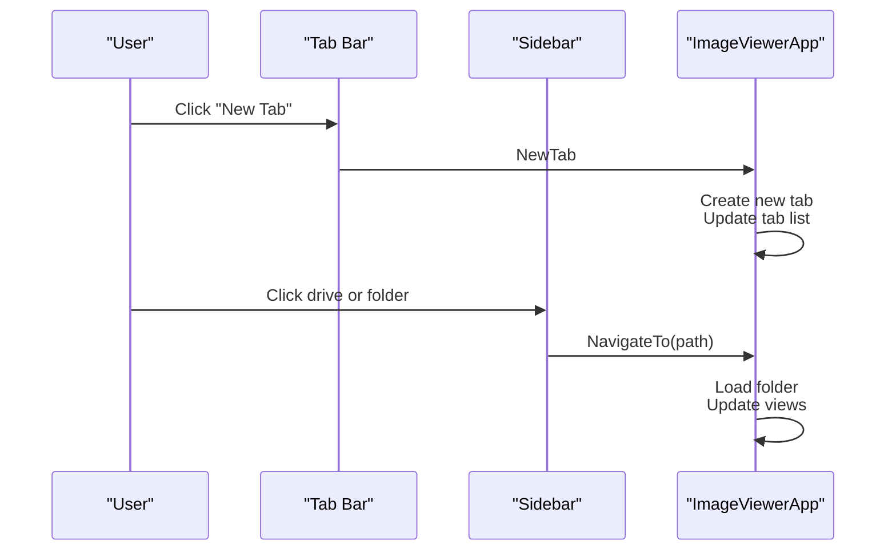
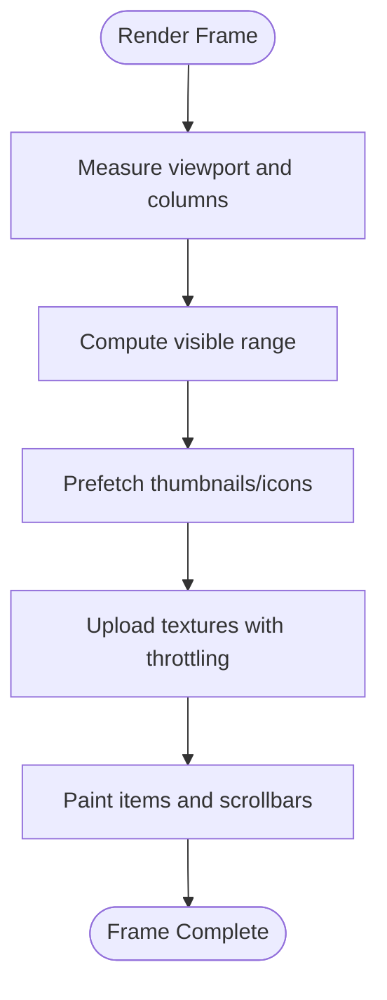
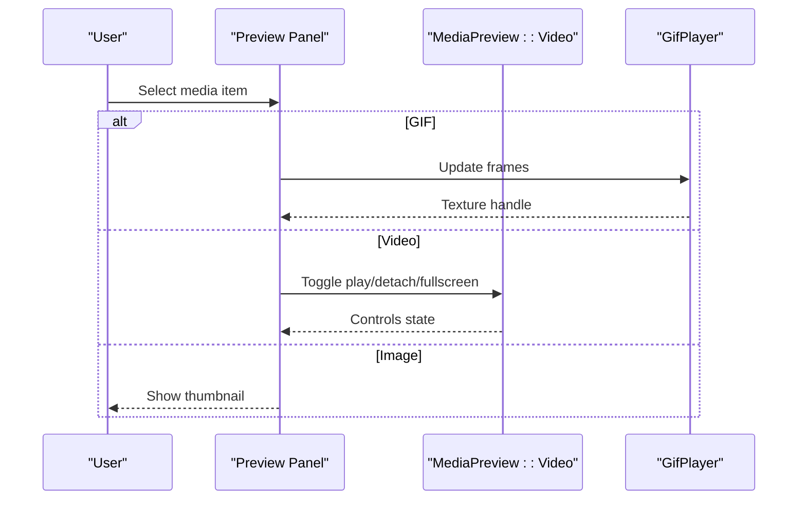
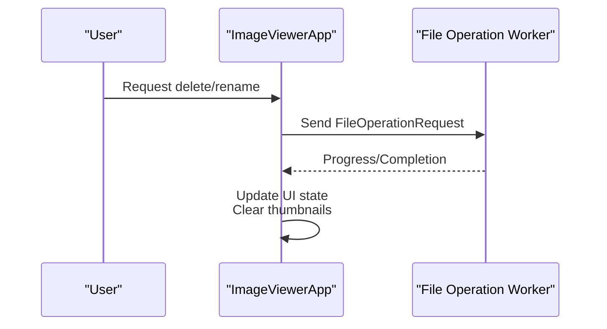
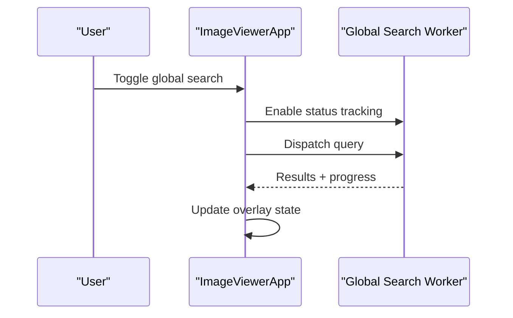
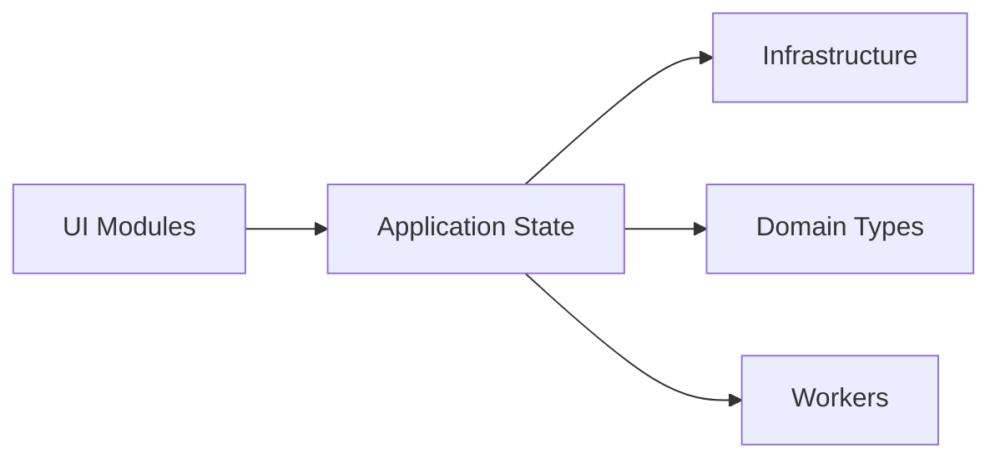

# Core Features

<cite>
**Referenced Files in This Document**
- [app/mod.rs](file://src/app/mod.rs)
- [ui/mod.rs](file://src/ui/mod.rs)
- [application/mod.rs](file://src/application/mod.rs)
- [domain/mod.rs](file://src/domain/mod.rs)
- [app/operations/mod.rs](file://src/app/operations/mod.rs)
- [ui/views/mod.rs](file://src/ui/views/mod.rs)
- [ui/sidebar.rs](file://src/ui/sidebar.rs)
- [ui/tab_bar/mod.rs](file://src/ui/tab_bar/mod.rs)
- [ui/views/grid_view/mod.rs](file://src/ui/views/grid_view/mod.rs)
- [ui/views/list_view/mod.rs](file://src/ui/views/list_view/mod.rs)
- [ui/preview_panel/mod.rs](file://src/ui/preview_panel/mod.rs)
- [app/operations/global_search.rs](file://src/app/operations/global_search.rs)
- [app/operations/file_ops.rs](file://src/app/operations/file_ops.rs)
- [ui/components/media_preview.rs](file://src/ui/components/media_preview.rs)
- [app/state/mod.rs](file://src/app/state/mod.rs)
</cite>

## Table of Contents
1. [Introduction](#introduction)
2. [Project Structure](#project-structure)
3. [Core Components](#core-components)
4. [Architecture Overview](#architecture-overview)
5. [Detailed Component Analysis](#detailed-component-analysis)
6. [Dependency Analysis](#dependency-analysis)
7. [Performance Considerations](#performance-considerations)
8. [Troubleshooting Guide](#troubleshooting-guide)
9. [Conclusion](#conclusion)

## Introduction
This document explains MTT File Manager’s core features with a focus on navigation and interface (tabbed navigation, custom window, sidebar), view modes (grid and list), media preview system (integrated preview, standalone viewers), file operations (copy, move, delete, rename), and global search. It describes implementation approaches, user interaction patterns, and integrations with underlying systems. Feature interdependencies are highlighted to show how they work together to deliver a cohesive user experience. Configuration options, customization possibilities, and performance considerations are included for each major feature area.

## Project Structure
The application follows a layered architecture:
- Domain: foundational types and business logic
- Application: state management, worker coordination, and high-level business logic
- UI: rendering, components, overlays, and interactions
- Infrastructure: platform-specific integrations (Windows), workers, caches, and I/O
- Workers: background tasks for file operations, thumbnails, global search, and prefetch

**Diagram sources**
- [app/mod.rs:1-32](file://src/app/mod.rs#L1-L32)
- [ui/mod.rs:1-22](file://src/ui/mod.rs#L1-L22)
- [application/mod.rs:1-47](file://src/application/mod.rs#L1-L47)
- [domain/mod.rs:1-9](file://src/domain/mod.rs#L1-L9)
- [app/state/mod.rs:65-444](file://src/app/state/mod.rs#L65-L444)
- [app/operations/mod.rs:1-46](file://src/app/operations/mod.rs#L1-L46)
- [ui/views/mod.rs:1-14](file://src/ui/views/mod.rs#L1-L14)
- [ui/sidebar.rs:1-843](file://src/ui/sidebar.rs#L1-L843)
- [ui/tab_bar/mod.rs:1-146](file://src/ui/tab_bar/mod.rs#L1-L146)
- [ui/views/grid_view/mod.rs:1-379](file://src/ui/views/grid_view/mod.rs#L1-L379)
- [ui/views/list_view/mod.rs:1-411](file://src/ui/views/list_view/mod.rs#L1-L411)
- [ui/preview_panel/mod.rs:1-181](file://src/ui/preview_panel/mod.rs#L1-L181)
- [ui/components/media_preview.rs:1-548](file://src/ui/components/media_preview.rs#L1-L548)

**Section sources**
- [app/mod.rs:1-32](file://src/app/mod.rs#L1-L32)
- [ui/mod.rs:1-22](file://src/ui/mod.rs#L1-L22)
- [application/mod.rs:1-47](file://src/application/mod.rs#L1-L47)
- [domain/mod.rs:1-9](file://src/domain/mod.rs#L1-L9)
- [app/state/mod.rs:65-444](file://src/app/state/mod.rs#L65-L444)

## Core Components
- Navigation and interface
  - Tabbed navigation: Windows 11-style tab bar with dynamic sizing, new tab area, and window controls
  - Custom window: borderless window with draggable title bar and integrated controls
  - Sidebar: fixed top (This PC, Quick Access), scrollable drives and folder tree, drag-and-drop, inline drive rename, and context menus
- View modes
  - Grid view: virtualized rendering, predictive prefetch, GPU upload throttling, and drag-and-drop
  - List view: resizable columns, virtualized rows, truncation caches, and sort header interactions
- Media preview system
  - Integrated preview panel: image, GIF, and MPV-backed video preview with docked and detached modes
  - Standalone viewers: optional external player process for video playback
- File operations
  - Copy/cut/paste via clipboard manager and background worker
  - Delete (recycle/bin) and permanent delete via shell operations
  - Rename with shell API and guarded open for risky sources
- Global search
  - Overlay with paging, status tracking, and result rendering

**Section sources**
- [ui/tab_bar/mod.rs:35-146](file://src/ui/tab_bar/mod.rs#L35-L146)
- [ui/sidebar.rs:77-843](file://src/ui/sidebar.rs#L77-L843)
- [ui/views/grid_view/mod.rs:230-379](file://src/ui/views/grid_view/mod.rs#L230-L379)
- [ui/views/list_view/mod.rs:293-411](file://src/ui/views/list_view/mod.rs#L293-L411)
- [ui/preview_panel/mod.rs:22-181](file://src/ui/preview_panel/mod.rs#L22-L181)
- [ui/components/media_preview.rs:120-548](file://src/ui/components/media_preview.rs#L120-L548)
- [app/operations/file_ops.rs:96-386](file://src/app/operations/file_ops.rs#L96-L386)
- [app/operations/global_search.rs:7-82](file://src/app/operations/global_search.rs#L7-L82)

## Architecture Overview
The system separates concerns across layers:
- UI renders views and overlays, delegates operations to application state, and interacts with workers via channels
- Application state coordinates workers, caches, and persistent settings
- Infrastructure provides platform integrations (Windows APIs), caches, and background workers
- Domain defines core types (FileEntry, thumbnail, errors)

**Diagram sources**
- [ui/tab_bar/mod.rs:35-146](file://src/ui/tab_bar/mod.rs#L35-L146)
- [ui/sidebar.rs:77-843](file://src/ui/sidebar.rs#L77-L843)
- [ui/views/grid_view/mod.rs:230-379](file://src/ui/views/grid_view/mod.rs#L230-L379)
- [ui/views/list_view/mod.rs:293-411](file://src/ui/views/list_view/mod.rs#L293-L411)
- [ui/preview_panel/mod.rs:22-181](file://src/ui/preview_panel/mod.rs#L22-L181)
- [app/state/mod.rs:65-444](file://src/app/state/mod.rs#L65-L444)
- [domain/mod.rs:1-9](file://src/domain/mod.rs#L1-L9)

## Detailed Component Analysis

### Navigation and Interface
- Tabbed navigation
  - Dynamic tab width, hover and active visuals, close/new/drag areas, and window controls
  - Integrates with media preview ownership and mute toggles
- Custom window
  - Borderless with draggable title bar and Windows-style controls
- Sidebar
  - Fixed top: This PC, Quick Access (OneDrive, Recycle Bin), pinned folders
  - Scrollable drives: expand/collapse, eject, inline rename, drag-and-drop targets
  - Tree rendering for folder hierarchy with expand/collapse and drop zones
  - Context menus for drives and items

**Diagram sources**
- [ui/tab_bar/mod.rs:118-132](file://src/ui/tab_bar/mod.rs#L118-L132)
- [ui/sidebar.rs:56-73](file://src/ui/sidebar.rs#L56-L73)
- [app/state/mod.rs:65-444](file://src/app/state/mod.rs#L65-L444)

**Section sources**
- [ui/tab_bar/mod.rs:35-146](file://src/ui/tab_bar/mod.rs#L35-L146)
- [ui/sidebar.rs:77-843](file://src/ui/sidebar.rs#L77-L843)
- [app/state/mod.rs:65-444](file://src/app/state/mod.rs#L65-L444)

### View Modes: Grid and List
- Grid view
  - Virtualized rendering with predictive prefetch, GPU upload throttling, and scroll synchronization
  - Drag-and-drop within content, hover highlights, and multi-selection
  - Thumbnail and icon caching, live file size, and folder preview integration
- List view
  - Resizable columns with truncation caches and proportional scaling
  - Sort header interactions, virtualized rows, and detailed metadata rendering
  - OneDrive-specific status column and computer view metrics

**Diagram sources**
- [ui/views/grid_view/mod.rs:230-379](file://src/ui/views/grid_view/mod.rs#L230-L379)
- [ui/views/list_view/mod.rs:293-411](file://src/ui/views/list_view/mod.rs#L293-L411)

**Section sources**
- [ui/views/grid_view/mod.rs:230-379](file://src/ui/views/grid_view/mod.rs#L230-L379)
- [ui/views/list_view/mod.rs:293-411](file://src/ui/views/list_view/mod.rs#L293-L411)

### Media Preview System
- Integrated preview panel
  - Multi-selection summary, fallback renderer, and file info table
  - Image/GIF static preview and MPV-backed video preview
- Media preview component
  - GIF player with non-blocking frame updates
  - Video player with docked/standalone modes, controls, OSD, and external subtitle support
- Standalone viewers
  - Optional external process for video playback

**Diagram sources**
- [ui/preview_panel/mod.rs:22-181](file://src/ui/preview_panel/mod.rs#L22-L181)
- [ui/components/media_preview.rs:120-548](file://src/ui/components/media_preview.rs#L120-L548)

**Section sources**
- [ui/preview_panel/mod.rs:22-181](file://src/ui/preview_panel/mod.rs#L22-L181)
- [ui/components/media_preview.rs:120-548](file://src/ui/components/media_preview.rs#L120-L548)

### File Operations
- Delete and rename
  - Delete via shell with background worker; tracks pending deletions and clears thumbnails
  - Rename guarded by risk checks; uses shell API via worker
- Properties and shortcuts
  - Opens Windows properties dialog via background worker
  - Creates shell shortcuts in current directory
- Copy/cut/paste
  - Managed by clipboard manager and background worker; integrates with drag-and-drop

**Diagram sources**
- [app/operations/file_ops.rs:96-386](file://src/app/operations/file_ops.rs#L96-L386)

**Section sources**
- [app/operations/file_ops.rs:96-386](file://src/app/operations/file_ops.rs#L96-L386)

### Global Search
- Overlay lifecycle
  - Open/close toggles, focus request, pagination, and status tracking
- Results and rendering
  - Paging, loading states, and result generation tracking
- Integration
  - Uses dedicated search worker and IPC; maintains caches for metadata and tooltips

**Diagram sources**
- [app/operations/global_search.rs:7-82](file://src/app/operations/global_search.rs#L7-L82)

**Section sources**
- [app/operations/global_search.rs:7-82](file://src/app/operations/global_search.rs#L7-L82)

## Dependency Analysis
- UI depends on application state for data and operations
- Application state coordinates workers and caches
- Infrastructure provides platform integrations and background workers
- Domain types define shared structures across layers

**Diagram sources**
- [ui/mod.rs:1-22](file://src/ui/mod.rs#L1-L22)
- [app/state/mod.rs:65-444](file://src/app/state/mod.rs#L65-L444)
- [domain/mod.rs:1-9](file://src/domain/mod.rs#L1-L9)

**Section sources**
- [ui/mod.rs:1-22](file://src/ui/mod.rs#L1-L22)
- [app/state/mod.rs:65-444](file://src/app/state/mod.rs#L65-L444)
- [domain/mod.rs:1-9](file://src/domain/mod.rs#L1-L9)

## Performance Considerations
- Virtualization and throttling
  - Grid and list views use manual virtualization, predictive prefetch, and GPU upload throttling to maintain smooth scrolling
- Caching
  - Texture, icon, and metadata caches with LRU eviction; truncation and font-width caches for list columns
- Asynchronous workers
  - Thumbnails, folder previews, metadata, and file operations offloaded to background workers
- Adaptive behavior
  - Scroll predictors, frame-time tracking, and restore burst mode mitigate stalls after inactivity or heavy loads

[No sources needed since this section provides general guidance]

## Troubleshooting Guide
- Preview panel issues
  - Fallback renderer displays when media extraction fails; check metadata and thumbnail caches
- Media playback problems
  - Use docked/standalone toggles; external subtitles and OSD controls assist in diagnostics
- File operation failures
  - Review notifications and logs; guarded open prevents risky UNC/shell namespace sources without confirmation
- Global search
  - Ensure status tracking is enabled and monitor progress; adjust page limits and query timing

**Section sources**
- [ui/preview_panel/mod.rs:22-181](file://src/ui/preview_panel/mod.rs#L22-L181)
- [ui/components/media_preview.rs:120-548](file://src/ui/components/media_preview.rs#L120-L548)
- [app/operations/file_ops.rs:50-94](file://src/app/operations/file_ops.rs#L50-L94)
- [app/operations/global_search.rs:29-44](file://src/app/operations/global_search.rs#L29-L44)

## Conclusion
MTT File Manager’s core features are built around a clean separation of concerns: UI renders views and overlays, application state orchestrates workers and caches, and infrastructure provides robust platform integrations. Navigation and interface (tabs, sidebar, custom window) integrate tightly with view modes (grid/list), media preview system (integrated and standalone), file operations (copy/move/delete/rename), and global search. Performance is addressed through virtualization, caching, asynchronous workers, and adaptive throttling. Together, these components deliver a responsive, customizable, and cohesive file management experience.