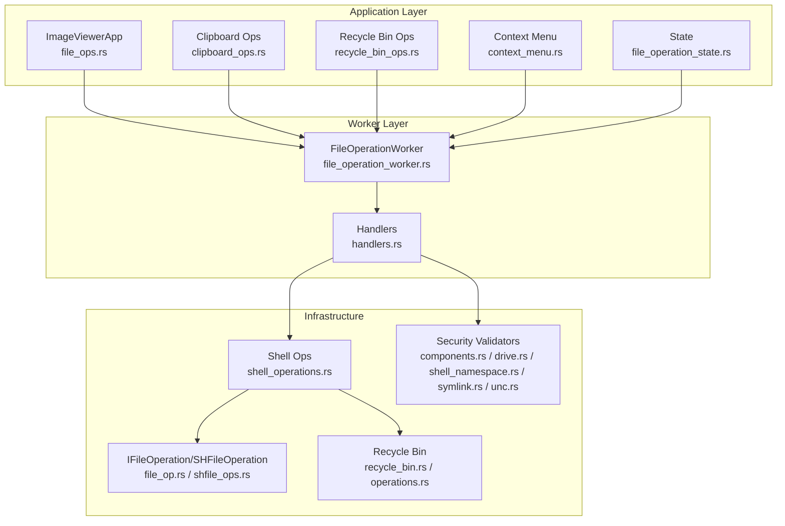
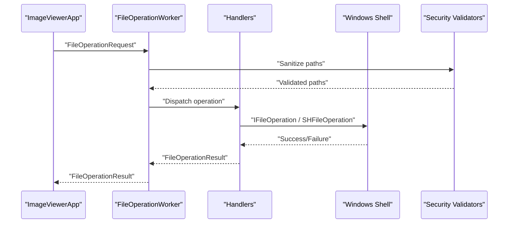
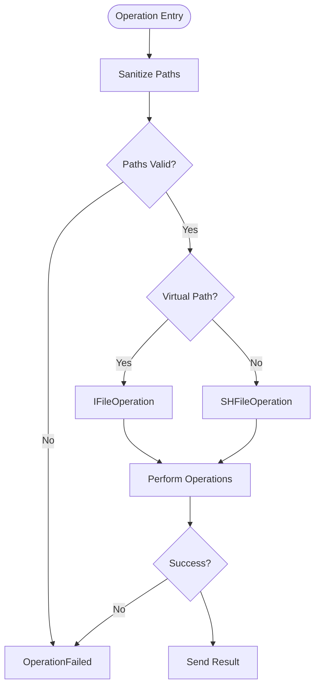
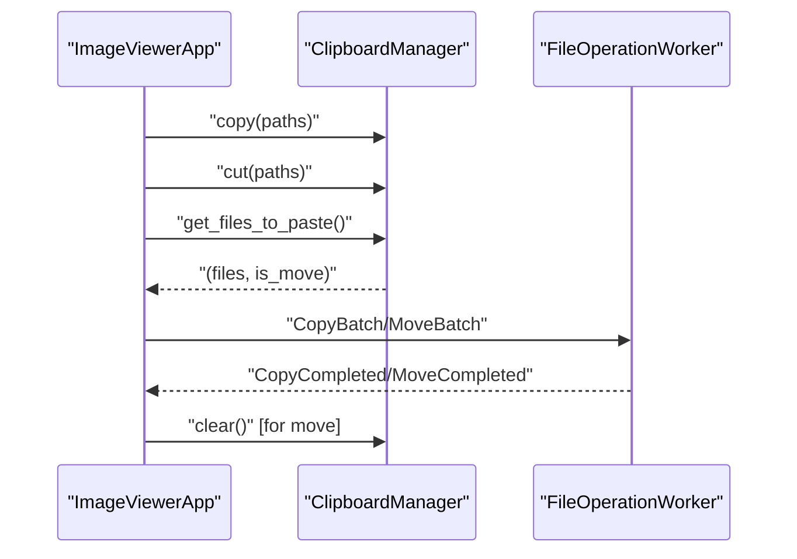
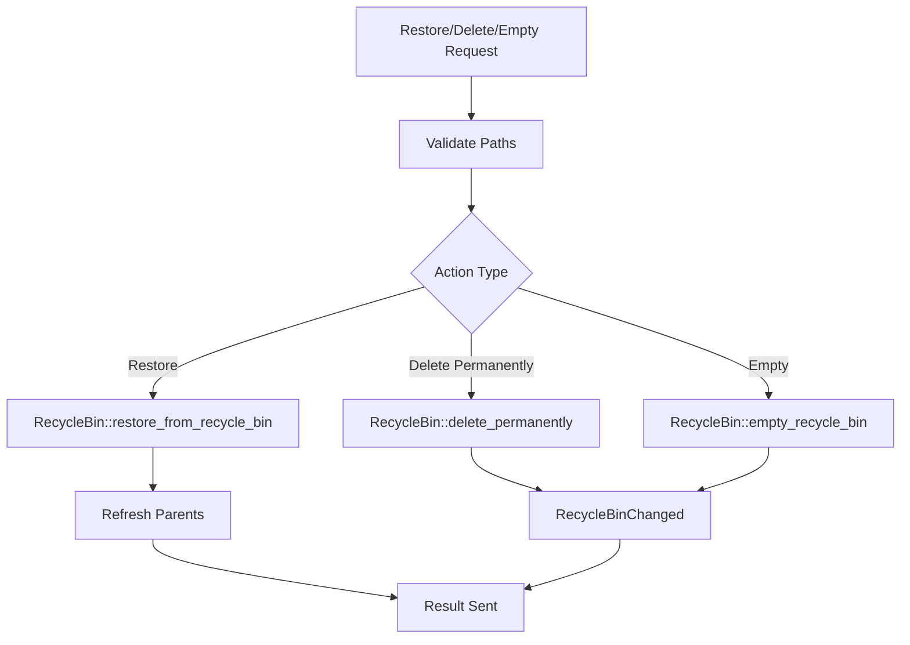
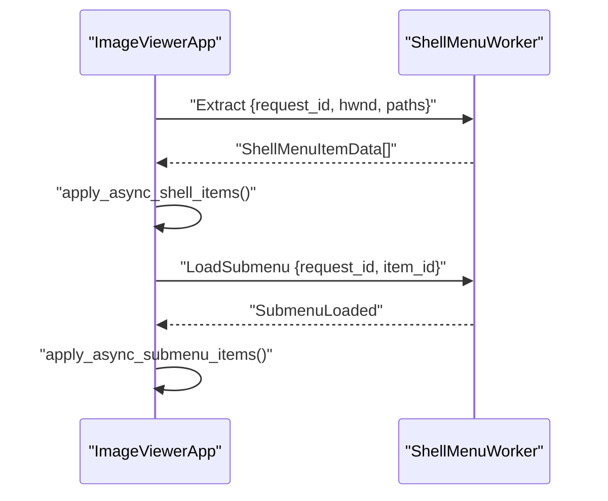
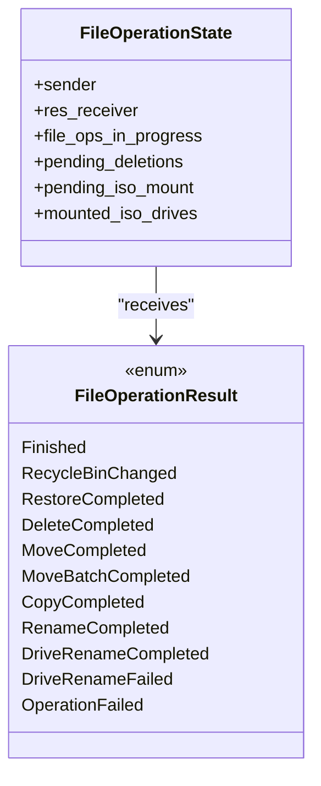
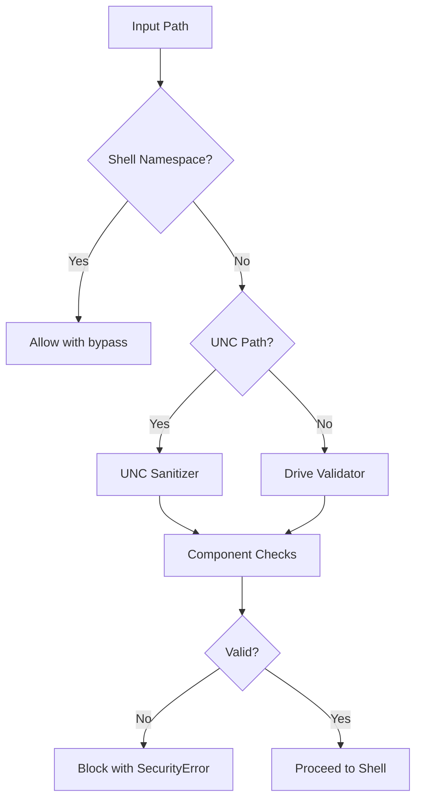
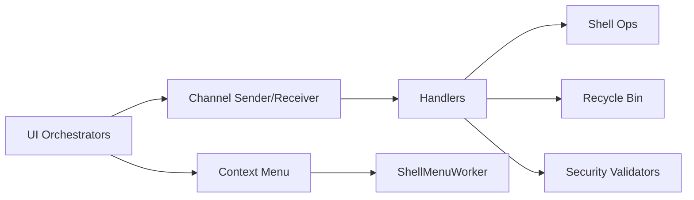

# File Operations

<cite>
**Referenced Files in This Document**
- [file_ops.rs](file://src/app/operations/file_ops.rs)
- [clipboard_ops.rs](file://src/app/operations/clipboard_ops.rs)
- [recycle_bin_ops.rs](file://src/app/operations/recycle_bin_ops.rs)
- [context_menu.rs](file://src/app/operations/context_menu.rs)
- [file_operation_state.rs](file://src/app/file_operation_state.rs)
- [file_operations.rs](file://src/application/file_operations.rs)
- [shell_operations.rs](file://src/infrastructure/windows/shell_operations.rs)
- [file_op.rs](file://src/infrastructure/windows/shell_operations/file_op.rs)
- [shfile_ops.rs](file://src/infrastructure/windows/shell_operations/shfile_ops.rs)
- [recycle_bin.rs](file://src/infrastructure/windows/recycle_bin.rs)
- [operations.rs](file://src/infrastructure/windows/recycle_bin/operations.rs)
- [file_operation_worker.rs](file://src/workers/file_operation_worker.rs)
- [handlers.rs](file://src/workers/file_operation_worker/handlers.rs)
- [components.rs](file://src/infrastructure/security/components.rs)
- [drive.rs](file://src/infrastructure/security/drive.rs)
- [shell_namespace.rs](file://src/infrastructure/security/shell_namespace.rs)
- [symlink.rs](file://src/infrastructure/security/symlink.rs)
- [unc.rs](file://src/infrastructure/security/unc.rs)
</cite>

## Table of Contents
1. [Introduction](#introduction)
2. [Project Structure](#project-structure)
3. [Core Components](#core-components)
4. [Architecture Overview](#architecture-overview)
5. [Detailed Component Analysis](#detailed-component-analysis)
6. [Dependency Analysis](#dependency-analysis)
7. [Performance Considerations](#performance-considerations)
8. [Troubleshooting Guide](#troubleshooting-guide)
9. [Conclusion](#conclusion)
10. [Appendices](#appendices)

## Introduction
This document explains the MTT File Manager’s file operations subsystem. It covers Windows Shell integration for native copy, move, delete, and rename operations; clipboard operations (copy/cut/paste) with system integration; Recycle Bin handling for safe deletion; context menu population and merging of native Shell items; state management, progress tracking, and error handling; security validations; performance optimization for bulk operations; operation queuing and user feedback; and configuration options for behavior and customization.

## Project Structure
The file operations system spans several layers:
- Application orchestration: UI actions dispatch requests to a background worker.
- Worker thread: Executes Shell operations under a COM Single-Threaded Apartment (STA).
- Infrastructure: Windows Shell wrappers, Recycle Bin APIs, and security validators.
- UI state: Tracks operation progress, pending deletions, and user notifications.

**Diagram sources**
- [file_ops.rs:1-386](file://src/app/operations/file_ops.rs#L1-L386)
- [clipboard_ops.rs:1-191](file://src/app/operations/clipboard_ops.rs#L1-L191)
- [recycle_bin_ops.rs:1-131](file://src/app/operations/recycle_bin_ops.rs#L1-L131)
- [context_menu.rs:1-476](file://src/app/operations/context_menu.rs#L1-L476)
- [file_operation_state.rs:1-20](file://src/app/file_operation_state.rs#L1-L20)
- [file_operation_worker.rs:1-353](file://src/workers/file_operation_worker.rs#L1-L353)
- [handlers.rs:1-404](file://src/workers/file_operation_worker/handlers.rs#L1-L404)
- [shell_operations.rs:1-15](file://src/infrastructure/windows/shell_operations.rs#L1-L15)
- [file_op.rs:1-245](file://src/infrastructure/windows/shell_operations/file_op.rs#L1-L245)
- [shfile_ops.rs:1-242](file://src/infrastructure/windows/shell_operations/shfile_ops.rs#L1-L242)
- [recycle_bin.rs:1-132](file://src/infrastructure/windows/recycle_bin.rs#L1-L132)
- [operations.rs:1-97](file://src/infrastructure/windows/recycle_bin/operations.rs#L1-L97)
- [components.rs:1-117](file://src/infrastructure/security/components.rs#L1-L117)
- [drive.rs:1-102](file://src/infrastructure/security/drive.rs#L1-L102)
- [shell_namespace.rs:1-84](file://src/infrastructure/security/shell_namespace.rs#L1-L84)
- [symlink.rs:1-43](file://src/infrastructure/security/symlink.rs#L1-L43)
- [unc.rs:1-32](file://src/infrastructure/security/unc.rs#L1-L32)

**Section sources**
- [file_ops.rs:1-386](file://src/app/operations/file_ops.rs#L1-L386)
- [file_operation_worker.rs:1-353](file://src/workers/file_operation_worker.rs#L1-L353)

## Core Components
- Application-level orchestration:
  - File operations entry points: delete, rename, create folder, properties, shortcuts.
  - Clipboard commands: copy, cut, paste, copy path.
  - Recycle Bin operations: restore, delete permanently, empty.
  - Context menu assembly and merging of native Shell items.
- Worker and handlers:
  - Request types and result types for all operations.
  - Security sanitization and path validation.
  - Native Shell API dispatch via IFileOperation and SHFileOperation.
- Infrastructure:
  - Windows Shell wrappers for copy/move/delete/rename.
  - Recycle Bin enumeration and operations.
  - Security validators for UNC, drive, symlinks, reserved names, and shell namespace paths.

**Section sources**
- [file_ops.rs:1-386](file://src/app/operations/file_ops.rs#L1-L386)
- [clipboard_ops.rs:1-191](file://src/app/operations/clipboard_ops.rs#L1-L191)
- [recycle_bin_ops.rs:1-131](file://src/app/operations/recycle_bin_ops.rs#L1-L131)
- [context_menu.rs:1-476](file://src/app/operations/context_menu.rs#L1-L476)
- [file_operation_worker.rs:67-117](file://src/workers/file_operation_worker.rs#L67-L117)
- [handlers.rs:10-50](file://src/workers/file_operation_worker/handlers.rs#L10-L50)
- [shell_operations.rs:7-14](file://src/infrastructure/windows/shell_operations.rs#L7-L14)
- [recycle_bin.rs:16-58](file://src/infrastructure/windows/recycle_bin.rs#L16-L58)

## Architecture Overview
The system uses a background worker thread to execute Windows Shell operations. The UI sends requests over a channel; the worker initializes COM (STA), performs the operation, and posts structured results back to the UI. Security validation runs before any operation to prevent unsafe paths.

**Diagram sources**
- [file_operation_worker.rs:225-328](file://src/workers/file_operation_worker.rs#L225-L328)
- [handlers.rs:10-50](file://src/workers/file_operation_worker/handlers.rs#L10-L50)
- [shell_operations.rs:7-14](file://src/infrastructure/windows/shell_operations.rs#L7-L14)
- [components.rs:40-86](file://src/infrastructure/security/components.rs#L40-L86)
- [drive.rs:71-101](file://src/infrastructure/security/drive.rs#L71-L101)
- [shell_namespace.rs:19-47](file://src/infrastructure/security/shell_namespace.rs#L19-L47)
- [symlink.rs:5-26](file://src/infrastructure/security/symlink.rs#L5-L26)
- [unc.rs:5-31](file://src/infrastructure/security/unc.rs#L5-L31)

## Detailed Component Analysis

### Windows Shell Integration: Copy, Move, Delete, Rename
- Copy/Multi-copy:
  - Uses IFileOperation when paths are virtual (e.g., inside archives) or falls back to SHFileOperation.
  - Batch copy consolidates into a single Shell progress dialog.
- Move/Multi-move:
  - Same pattern as copy; captures source folders for UI refresh.
- Delete:
  - Moves to Recycle Bin by default; cancellation is detected via Shell flags.
- Rename:
  - Supports both file/dir and drive root (volume label) renames.
  - Validates invalid characters and reserved names.

**Diagram sources**
- [handlers.rs:132-218](file://src/workers/file_operation_worker/handlers.rs#L132-L218)
- [file_op.rs:30-130](file://src/infrastructure/windows/shell_operations/file_op.rs#L30-L130)
- [shfile_ops.rs:136-188](file://src/infrastructure/windows/shell_operations/shfile_ops.rs#L136-L188)

**Section sources**
- [file_op.rs:30-244](file://src/infrastructure/windows/shell_operations/file_op.rs#L30-L244)
- [shfile_ops.rs:26-241](file://src/infrastructure/windows/shell_operations/shfile_ops.rs#L26-L241)
- [handlers.rs:10-130](file://src/workers/file_operation_worker/handlers.rs#L10-L130)

### Clipboard Operations: Copy/Cut/Paste and Copy Path
- Copy/Cut:
  - Collects selected paths and writes to the application clipboard abstraction.
- Paste:
  - Reads clipboard via a manager that checks system and internal state.
  - Dispatches a single batch request to the worker (copy_batch or move_batch).
  - Clears internal state for moves after dispatch.
- Copy Path:
  - Writes a single path to the system clipboard.

**Diagram sources**
- [clipboard_ops.rs:50-183](file://src/app/operations/clipboard_ops.rs#L50-L183)
- [file_operation_worker.rs:67-117](file://src/workers/file_operation_worker.rs#L67-L117)

**Section sources**
- [clipboard_ops.rs:1-191](file://src/app/operations/clipboard_ops.rs#L1-L191)

### Recycle Bin Integration: Restore, Delete Permanently, Empty
- Restore:
  - Requires original path; validates and restores via IFileOperation.
  - Triggers refresh of parent folders.
- Delete Permanently:
  - Uses native confirmation dialog; reports cancellation if aborted.
- Empty:
  - Shows native confirmation dialog and clears the bin.

**Diagram sources**
- [handlers.rs:319-392](file://src/workers/file_operation_worker/handlers.rs#L319-L392)
- [operations.rs:9-96](file://src/infrastructure/windows/recycle_bin/operations.rs#L9-L96)
- [recycle_bin.rs:113-131](file://src/infrastructure/windows/recycle_bin.rs#L113-L131)

**Section sources**
- [recycle_bin_ops.rs:1-131](file://src/app/operations/recycle_bin_ops.rs#L1-L131)
- [recycle_bin.rs:16-58](file://src/infrastructure/windows/recycle_bin.rs#L16-L58)
- [operations.rs:9-96](file://src/infrastructure/windows/recycle_bin/operations.rs#L9-L96)

### Context Menu Population and Native Shell Items
- Builds primary and secondary items (cut/copy/paste/rename/delete/properties).
- Merges native Shell items asynchronously via a worker; filters known verbs and blacklisted entries.
- Supports lazy submenu loading and texture caching for icons.

**Diagram sources**
- [context_menu.rs:291-404](file://src/app/operations/context_menu.rs#L291-L404)
- [context_menu.rs:406-474](file://src/app/operations/context_menu.rs#L406-L474)

**Section sources**
- [context_menu.rs:1-476](file://src/app/operations/context_menu.rs#L1-L476)

### File Operation State Management, Progress Tracking, and Error Handling
- State:
  - Tracks in-flight operations, pending deletions, ISO mount state, and mounted drives.
- Progress:
  - Batch operations produce a single Shell progress dialog.
- Error handling:
  - Cancellation and failures reported via OperationFailed results.
  - UI decrements counters and displays notifications.

**Diagram sources**
- [file_operation_state.rs:6-19](file://src/app/file_operation_state.rs#L6-L19)
- [file_operation_worker.rs:17-59](file://src/workers/file_operation_worker.rs#L17-L59)

**Section sources**
- [file_operation_state.rs:1-20](file://src/app/file_operation_state.rs#L1-L20)
- [file_operation_worker.rs:17-59](file://src/workers/file_operation_worker.rs#L17-L59)

### Security Considerations for File Operations
- Path sanitization:
  - Explicit shell namespace paths bypass standard validation.
  - UNC paths validated for null bytes and traversal.
  - Local drive validation against mounted drives.
  - Component-level checks for reserved names and ADS.
- Symlink and reparse point detection.
- Drive prefix normalization and allowed drive enforcement.

**Diagram sources**
- [file_operations.rs:93-102](file://src/application/file_operations.rs#L93-L102)
- [handlers.rs:15-49](file://src/workers/file_operation_worker/handlers.rs#L15-L49)
- [shell_namespace.rs:19-47](file://src/infrastructure/security/shell_namespace.rs#L19-L47)
- [unc.rs:5-31](file://src/infrastructure/security/unc.rs#L5-L31)
- [drive.rs:71-101](file://src/infrastructure/security/drive.rs#L71-L101)
- [components.rs:40-86](file://src/infrastructure/security/components.rs#L40-L86)
- [symlink.rs:5-26](file://src/infrastructure/security/symlink.rs#L5-L26)

**Section sources**
- [file_operations.rs:48-102](file://src/application/file_operations.rs#L48-L102)
- [handlers.rs:15-49](file://src/workers/file_operation_worker/handlers.rs#L15-L49)
- [components.rs:88-117](file://src/infrastructure/security/components.rs#L88-L117)
- [drive.rs:28-101](file://src/infrastructure/security/drive.rs#L28-L101)
- [shell_namespace.rs:19-47](file://src/infrastructure/security/shell_namespace.rs#L19-L47)
- [symlink.rs:5-26](file://src/infrastructure/security/symlink.rs#L5-L26)
- [unc.rs:5-31](file://src/infrastructure/security/unc.rs#L5-L31)

### Operation Queuing, Conflict Resolution, and User Feedback
- Queuing:
  - UI increments a counter and sends a single request per action.
  - Worker processes one request at a time with a panic guard.
- Conflict resolution:
  - Shell APIs show native dialogs for conflicts and confirmations.
  - Batch operations consolidate prompts into a single progress dialog.
- Feedback:
  - Notifications for warnings and errors.
  - OperationFailed result for cancellations.

**Section sources**
- [file_ops.rs:96-154](file://src/app/operations/file_ops.rs#L96-L154)
- [file_operation_worker.rs:232-328](file://src/workers/file_operation_worker.rs#L232-L328)
- [handlers.rs:319-392](file://src/workers/file_operation_worker/handlers.rs#L319-L392)

### Configuration Options and Customization
- Behavior:
  - Allowed drives derived from mounted drives.
  - UNC handling and symlink allowances configured centrally.
- Context menu:
  - Primary and secondary items enabled/disabled based on context.
  - Known verbs filtered out; custom items appended conditionally.

**Section sources**
- [file_operations.rs:48-65](file://src/application/file_operations.rs#L48-L65)
- [context_menu.rs:101-289](file://src/app/operations/context_menu.rs#L101-L289)

## Dependency Analysis
Key dependencies and coupling:
- UI orchestrators depend on the worker channel and state.
- Handlers depend on Shell wrappers and Recycle Bin APIs.
- Security validators are reused across sanitization paths.
- Context menu merging depends on asynchronous worker responses.

**Diagram sources**
- [file_operation_worker.rs:67-117](file://src/workers/file_operation_worker.rs#L67-L117)
- [handlers.rs:10-50](file://src/workers/file_operation_worker/handlers.rs#L10-L50)
- [shell_operations.rs:7-14](file://src/infrastructure/windows/shell_operations.rs#L7-L14)
- [recycle_bin.rs:113-131](file://src/infrastructure/windows/recycle_bin.rs#L113-L131)
- [components.rs:40-86](file://src/infrastructure/security/components.rs#L40-L86)
- [context_menu.rs:291-404](file://src/app/operations/context_menu.rs#L291-L404)

**Section sources**
- [file_operation_worker.rs:67-117](file://src/workers/file_operation_worker.rs#L67-L117)
- [handlers.rs:10-50](file://src/workers/file_operation_worker/handlers.rs#L10-L50)
- [context_menu.rs:291-404](file://src/app/operations/context_menu.rs#L291-L404)

## Performance Considerations
- Batch operations:
  - Single IFileOperation or SHFileOperation call for multiple items reduces overhead and consolidates UI prompts.
- Virtual paths:
  - Archive extraction uses native support when available to avoid intermediate copies.
- COM initialization:
  - RAII guard ensures proper STA initialization and uninitialization per operation.
- Thumbnail suppression:
  - Pending deletions are tracked to avoid unnecessary thumbnail extraction work.

**Section sources**
- [file_op.rs:73-130](file://src/infrastructure/windows/shell_operations/file_op.rs#L73-L130)
- [shfile_ops.rs:136-188](file://src/infrastructure/windows/shell_operations/shfile_ops.rs#L136-L188)
- [handlers.rs:132-218](file://src/workers/file_operation_worker/handlers.rs#L132-L218)
- [file_ops.rs:129-154](file://src/app/operations/file_ops.rs#L129-L154)

## Troubleshooting Guide
Common issues and resolutions:
- Operation cancelled or failed:
  - Check OperationFailed messages and logs; verify user cancellation via native dialogs.
- Invalid path or security block:
  - Review sanitization logs; ensure paths are UNC-safe or local drive-based.
- Rename fails:
  - Verify target name validity and that the path is not a drive root (use volume label rename path).
- Paste not working:
  - Confirm clipboard has content and destination is not protected (Computer or Recycle Bin views).
- Recycle Bin restore skipped:
  - Original path missing or unknown; ensure item metadata is available.

**Section sources**
- [handlers.rs:10-130](file://src/workers/file_operation_worker/handlers.rs#L10-L130)
- [handlers.rs:319-392](file://src/workers/file_operation_worker/handlers.rs#L319-L392)
- [clipboard_ops.rs:120-183](file://src/app/operations/clipboard_ops.rs#L120-L183)
- [recycle_bin_ops.rs:14-77](file://src/app/operations/recycle_bin_ops.rs#L14-L77)

## Conclusion
The file operations subsystem integrates tightly with Windows Shell APIs, ensuring native UX and reliability. A dedicated worker thread under STA guarantees correct COM behavior, while robust security validation protects against unsafe paths. Batch operations improve performance and user experience, and the state/result model provides clear feedback and recovery.

## Appendices
- API and result types:
  - Request types: Delete, Rename, Copy, Move, CopyBatch, MoveBatch, RestoreFromRecycleBin, DeletePermanently, EmptyRecycleBin, ShowProperties.
  - Result types: Finished, RecycleBinChanged, RestoreCompleted, DeleteCompleted, MoveCompleted, MoveBatchCompleted, CopyCompleted, RenameCompleted, DriveRenameCompleted/Failed, OperationFailed.

**Section sources**
- [file_operation_worker.rs:67-117](file://src/workers/file_operation_worker.rs#L67-L117)
- [file_operation_worker.rs:17-59](file://src/workers/file_operation_worker.rs#L17-L59)