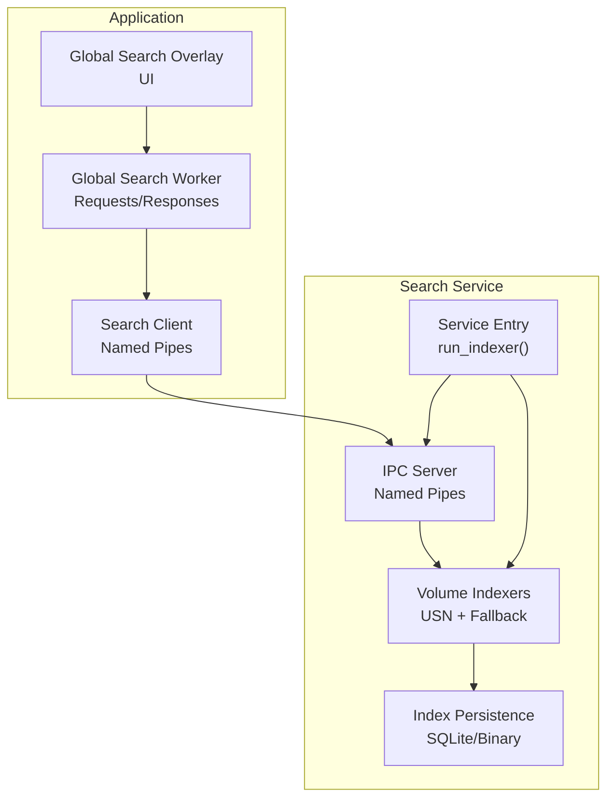
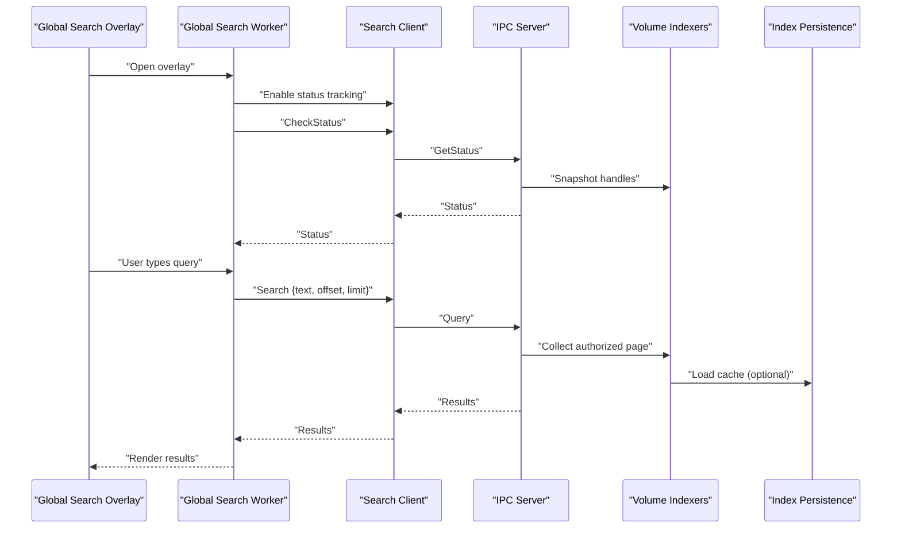
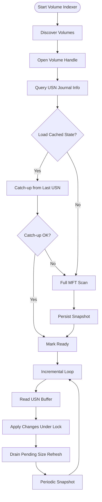
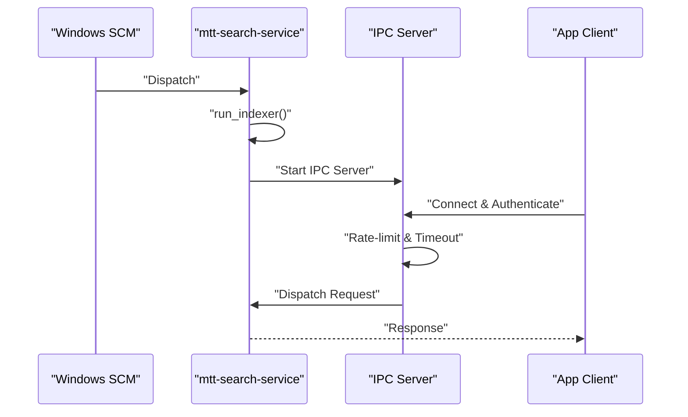
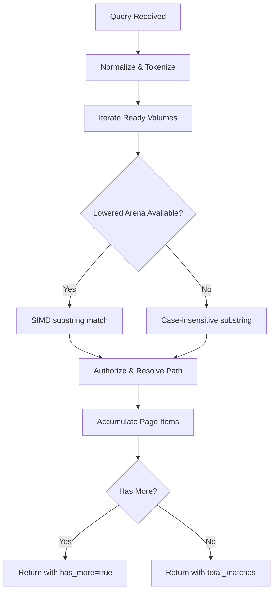
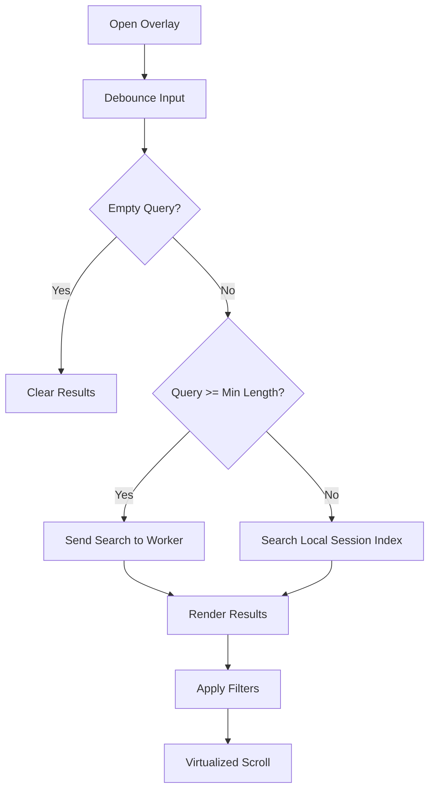
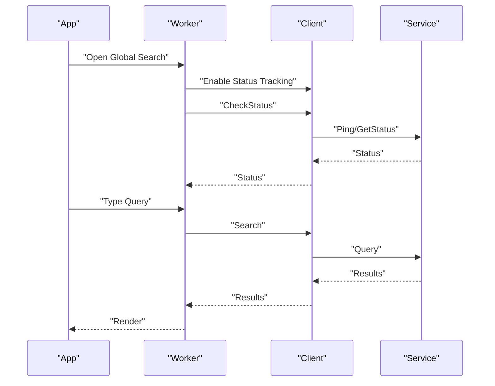
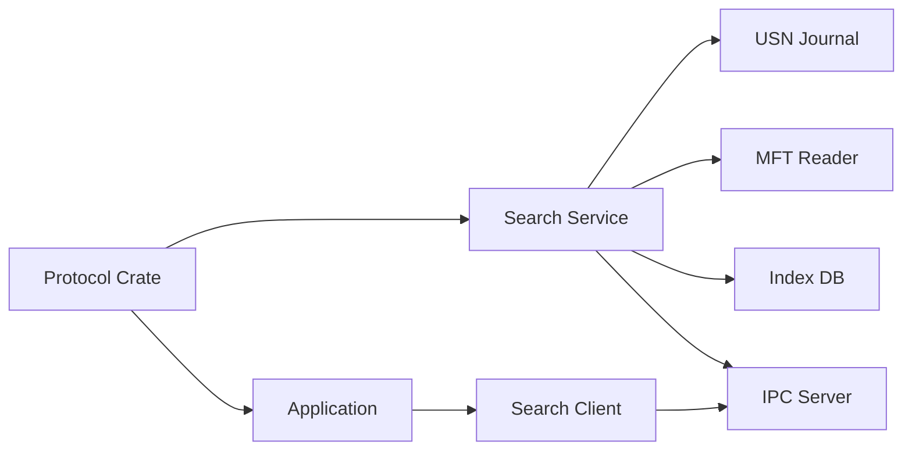

# Global Search

<cite>
**Referenced Files in This Document**
- [main.rs](file://crates/mtt-search-service/src/main.rs)
- [lib.rs](file://crates/mtt-search-protocol/src/lib.rs)
- [global_search.rs](file://src/infrastructure/global_search.rs)
- [global_search_worker.rs](file://src/workers/global_search_worker.rs)
- [global_search.rs](file://src/app/operations/global_search.rs)
- [global_search_overlay.rs](file://src/ui/global_search_overlay.rs)
- [usn_journal.rs](file://crates/mtt-search-service/src/usn_journal.rs)
- [index_db/mod.rs](file://crates/mtt-search-service/src/index_db/mod.rs)
- [file_index.rs](file://crates/mtt-search-service/src/file_index.rs)
- [mod.rs (volume_indexers)](file://crates/mtt-search-service/src/volume_indexers/mod.rs)
- [usn.rs](file://crates/mtt-search-service/src/volume_indexers/usn.rs)
- [non_usn.rs](file://crates/mtt-search-service/src/volume_indexers/non_usn.rs)
- [mod.rs (ipc_server)](file://crates/mtt-search-service/src/ipc_server/mod.rs)
- [handler.rs](file://crates/mtt-search-service/src/ipc_server/handler.rs)
- [pipe_io.rs](file://crates/mtt-search-service/src/ipc_server/pipe_io.rs)
</cite>

## Table of Contents
1. [Introduction](#introduction)
2. [Project Structure](#project-structure)
3. [Core Components](#core-components)
4. [Architecture Overview](#architecture-overview)
5. [Detailed Component Analysis](#detailed-component-analysis)
6. [Dependency Analysis](#dependency-analysis)
7. [Performance Considerations](#performance-considerations)
8. [Troubleshooting Guide](#troubleshooting-guide)
9. [Conclusion](#conclusion)

## Introduction
This document explains the MTT File Manager’s Global Search system. It covers the hybrid indexing approach that combines the NTFS USN journal for near-real-time updates with a fallback full-tree scan for completeness, the dedicated Windows service architecture, IPC communication via named pipes, and the search result ranking and presentation. It also documents indexing strategies, performance optimizations, memory management, offline search behavior, and configuration options.

## Project Structure
The global search spans three major areas:
- Search Service (Windows service): Implements indexing, IPC, and search execution.
- Protocol Crate: Defines IPC messages and limits.
- Application Layer: Provides the UI overlay, worker thread, and client IPC.

**Diagram sources**
- [main.rs:190-307](file://crates/mtt-search-service/src/main.rs#L190-L307)
- [mod.rs (ipc_server):35-214](file://crates/mtt-search-service/src/ipc_server/mod.rs#L35-L214)
- [handler.rs:111-440](file://crates/mtt-search-service/src/ipc_server/handler.rs#L111-L440)
- [usn.rs:39-714](file://crates/mtt-search-service/src/volume_indexers/usn.rs#L39-L714)
- [non_usn.rs:35-361](file://crates/mtt-search-service/src/volume_indexers/non_usn.rs#L35-L361)
- [index_db/mod.rs:282-385](file://crates/mtt-search-service/src/index_db/mod.rs#L282-L385)
- [global_search.rs:22-119](file://src/infrastructure/global_search.rs#L22-L119)
- [global_search_worker.rs:327-594](file://src/workers/global_search_worker.rs#L327-L594)
- [global_search_overlay.rs:25-378](file://src/ui/global_search_overlay.rs#L25-L378)

**Section sources**
- [main.rs:112-307](file://crates/mtt-search-service/src/main.rs#L112-L307)
- [lib.rs:1-290](file://crates/mtt-search-protocol/src/lib.rs#L1-L290)
- [global_search.rs:1-290](file://src/infrastructure/global_search.rs#L1-L290)
- [global_search_worker.rs:1-594](file://src/workers/global_search_worker.rs#L1-L594)
- [global_search_overlay.rs:1-623](file://src/ui/global_search_overlay.rs#L1-L623)

## Core Components
- Hybrid Indexing:
  - NTFS/ReFS: USN journal incremental updates plus MFT bulk enumeration for sizes.
  - Other filesystems: Periodic fallback scans with adaptive backoff and optional change monitoring.
- IPC Protocol:
  - Named pipes with strict limits and validation.
  - Requests: Query, GetStatus, Ping, WarmIndex, CheckPathsModified, FolderSize.
  - Responses: Results, Status, Pong, WarmStarted, PathsModified, FolderSize, Error.
- Search Execution:
  - In-memory SIMD-accelerated search over a lowered name arena.
  - Authorization-aware search and path checks.
- Offline Behavior:
  - Session-local index for offline fallback when service is unavailable.
- UI:
  - Spotlight-style overlay with debounced input, filters, and results panel.

**Section sources**
- [usn_journal.rs:81-138](file://crates/mtt-search-service/src/usn_journal.rs#L81-L138)
- [usn.rs:39-714](file://crates/mtt-search-service/src/volume_indexers/usn.rs#L39-L714)
- [non_usn.rs:35-361](file://crates/mtt-search-service/src/volume_indexers/non_usn.rs#L35-L361)
- [file_index.rs:664-770](file://crates/mtt-search-service/src/file_index.rs#L664-L770)
- [lib.rs:17-132](file://crates/mtt-search-protocol/src/lib.rs#L17-L132)
- [handler.rs:221-440](file://crates/mtt-search-service/src/ipc_server/handler.rs#L221-L440)
- [global_search_worker.rs:129-594](file://src/workers/global_search_worker.rs#L129-L594)
- [global_search.rs:22-224](file://src/infrastructure/global_search.rs#L22-L224)
- [global_search_overlay.rs:25-378](file://src/ui/global_search_overlay.rs#L25-L378)

## Architecture Overview
The system consists of:
- A Windows service that discovers volumes, builds indexes, and serves queries.
- A protocol crate defining IPC messages and limits.
- An application worker that sends requests and receives responses.
- A UI overlay that renders results and manages filters.

**Diagram sources**
- [global_search_overlay.rs:110-140](file://src/ui/global_search_overlay.rs#L110-L140)
- [global_search_worker.rs:250-594](file://src/workers/global_search_worker.rs#L250-L594)
- [global_search.rs:22-119](file://src/infrastructure/global_search.rs#L22-L119)
- [handler.rs:221-272](file://crates/mtt-search-service/src/ipc_server/handler.rs#L221-L272)
- [usn.rs:39-714](file://crates/mtt-search-service/src/volume_indexers/usn.rs#L39-L714)
- [non_usn.rs:35-361](file://crates/mtt-search-service/src/volume_indexers/non_usn.rs#L35-L361)
- [index_db/mod.rs:282-385](file://crates/mtt-search-service/src/index_db/mod.rs#L282-L385)

## Detailed Component Analysis

### Hybrid Indexing: USN Journal + Fallback Scan
- NTFS/ReFS:
  - Discover volumes and open USN journal.
  - Attempt to load cached state (binary or SQLite) and catch-up from last USN.
  - If catch-up fails or cache is incomplete, perform a full MFT bulk read.
  - Maintain a lowered name arena for fast case-insensitive SIMD search.
  - Background size loading via bulk MFT read; incremental size refresh on USN size-changed events.
  - Periodic snapshot persistence and FTS rebuild coordination.
- Other filesystems:
  - Periodic fallback scans with adaptive backoff.
  - Optional ReadDirectoryChangesW monitoring to wake on changes.
  - Persist snapshots and rebuild FTS in background.

**Diagram sources**
- [usn.rs:39-714](file://crates/mtt-search-service/src/volume_indexers/usn.rs#L39-L714)
- [non_usn.rs:35-361](file://crates/mtt-search-service/src/volume_indexers/non_usn.rs#L35-L361)
- [usn_journal.rs:81-314](file://crates/mtt-search-service/src/usn_journal.rs#L81-L314)
- [index_db/mod.rs:282-385](file://crates/mtt-search-service/src/index_db/mod.rs#L282-L385)

**Section sources**
- [usn.rs:39-714](file://crates/mtt-search-service/src/volume_indexers/usn.rs#L39-L714)
- [non_usn.rs:35-361](file://crates/mtt-search-service/src/volume_indexers/non_usn.rs#L35-L361)
- [usn_journal.rs:81-314](file://crates/mtt-search-service/src/usn_journal.rs#L81-L314)
- [index_db/mod.rs:282-385](file://crates/mtt-search-service/src/index_db/mod.rs#L282-L385)

### Windows Service and IPC
- Service entry initializes shared state, opens persistent database, spawns volume indexers, and starts the IPC server.
- IPC server enforces rate limiting, timeouts, and validates payloads.
- Handler routes requests to search, status, warming, path checks, and folder size computation.
- Pipe creation enforces DACL allowing “Authenticated Users” and LocalSystem.

**Diagram sources**
- [main.rs:112-307](file://crates/mtt-search-service/src/main.rs#L112-L307)
- [mod.rs (ipc_server):35-214](file://crates/mtt-search-service/src/ipc_server/mod.rs#L35-L214)
- [pipe_io.rs:115-187](file://crates/mtt-search-service/src/ipc_server/pipe_io.rs#L115-L187)
- [handler.rs:111-440](file://crates/mtt-search-service/src/ipc_server/handler.rs#L111-L440)

**Section sources**
- [main.rs:112-307](file://crates/mtt-search-service/src/main.rs#L112-L307)
- [mod.rs (ipc_server):35-214](file://crates/mtt-search-service/src/ipc_server/mod.rs#L35-L214)
- [pipe_io.rs:115-187](file://crates/mtt-search-service/src/ipc_server/pipe_io.rs#L115-L187)
- [handler.rs:111-440](file://crates/mtt-search-service/src/ipc_server/handler.rs#L111-L440)

### Search Execution and Ranking
- Query parsing: Lowercase, whitespace tokenization.
- Matching: SIMD-accelerated substring search over a lowered name arena; fallback to case-insensitive substring for non-ASCII.
- Authorization: Results are filtered to only those the client can access.
- Pagination: Offset/limit enforced; has_more indicates more pages.
- Ranking: The code implements a case-insensitive substring match over names; no explicit scoring function is present in the referenced files.

**Diagram sources**
- [file_index.rs:664-770](file://crates/mtt-search-service/src/file_index.rs#L664-L770)
- [handler.rs:248-272](file://crates/mtt-search-service/src/ipc_server/handler.rs#L248-L272)

**Section sources**
- [file_index.rs:664-770](file://crates/mtt-search-service/src/file_index.rs#L664-L770)
- [handler.rs:248-272](file://crates/mtt-search-service/src/ipc_server/handler.rs#L248-L272)

### Search Overlay, Query Parsing, and Result Presentation
- Overlay:
  - Debounced input with a 180 ms delay.
  - Filters: Category and drive filter.
  - Status indicators for indexing progress and service availability.
- Query parsing:
  - Minimum query length threshold before delegating to service.
  - Short queries fall back to a local session index.
- Result presentation:
  - Results panel with pagination and “has more” handling.
  - Metadata and tooltip caches to improve responsiveness.

**Diagram sources**
- [global_search_overlay.rs:110-140](file://src/ui/global_search_overlay.rs#L110-L140)
- [global_search_worker.rs:428-594](file://src/workers/global_search_worker.rs#L428-L594)
- [global_search.rs:6-82](file://src/app/operations/global_search.rs#L6-L82)

**Section sources**
- [global_search_overlay.rs:1-623](file://src/ui/global_search_overlay.rs#L1-L623)
- [global_search_worker.rs:1-594](file://src/workers/global_search_worker.rs#L1-L594)
- [global_search.rs:1-82](file://src/app/operations/global_search.rs#L1-L82)

### Integration Between App and Search Service
- Worker thread:
  - Sends requests and receives responses.
  - Handles transient errors by warming the index and retrying.
  - Coordinates status tracking and total count estimation.
- Client:
  - Validates and encodes/decodes messages.
  - Verifies the pipe server process and impersonation for secure access checks.
- Offline fallback:
  - When service is unavailable, worker falls back to local session index.

**Diagram sources**
- [global_search_worker.rs:327-594](file://src/workers/global_search_worker.rs#L327-L594)
- [global_search.rs:22-119](file://src/infrastructure/global_search.rs#L22-L119)
- [handler.rs:140-272](file://crates/mtt-search-service/src/ipc_server/handler.rs#L140-L272)

**Section sources**
- [global_search_worker.rs:1-594](file://src/workers/global_search_worker.rs#L1-L594)
- [global_search.rs:1-290](file://src/infrastructure/global_search.rs#L1-L290)
- [handler.rs:140-272](file://crates/mtt-search-service/src/ipc_server/handler.rs#L140-L272)

## Dependency Analysis
- IPC Protocol Crate:
  - Defines message enums, limits, and serialization helpers.
- Service:
  - Depends on protocol crate for message types.
  - Uses USN journal, MFT reader, index persistence, and volume indexers.
- Application:
  - Depends on protocol crate for IPC.
  - Uses worker and client to communicate with the service.

**Diagram sources**
- [lib.rs:1-290](file://crates/mtt-search-protocol/src/lib.rs#L1-L290)
- [main.rs:1-389](file://crates/mtt-search-service/src/main.rs#L1-L389)
- [mod.rs (ipc_server):1-275](file://crates/mtt-search-service/src/ipc_server/mod.rs#L1-L275)
- [handler.rs:1-619](file://crates/mtt-search-service/src/ipc_server/handler.rs#L1-L619)
- [global_search.rs:1-290](file://src/infrastructure/global_search.rs#L1-L290)

**Section sources**
- [lib.rs:1-290](file://crates/mtt-search-protocol/src/lib.rs#L1-L290)
- [main.rs:1-389](file://crates/mtt-search-service/src/main.rs#L1-L389)
- [mod.rs (ipc_server):1-275](file://crates/mtt-search-service/src/ipc_server/mod.rs#L1-L275)
- [handler.rs:1-619](file://crates/mtt-search-service/src/ipc_server/handler.rs#L1-L619)
- [global_search.rs:1-290](file://src/infrastructure/global_search.rs#L1-L290)

## Performance Considerations
- SIMD-accelerated search:
  - Uses a lowered name arena and memchr-based finders for zero-allocation per-record scanning.
- Locking and contention:
  - Incremental updates use bounded try_write retries and fallback timeouts to avoid starving readers.
- Memory management:
  - Compact arena after bulk loads to reclaim dead space.
  - Prune old modification timestamps to cap memory growth.
- Persistence:
  - Binary cache for fast restarts; SQLite WAL mode for concurrency.
- IPC:
  - Payload limits, timeouts, and rate limiting to prevent DoS and resource exhaustion.
- Offline fallback:
  - Local session index reduces latency when the service is unavailable.

[No sources needed since this section provides general guidance]

## Troubleshooting Guide
Common issues and remedies:
- Service not available:
  - The client detects “busy” or “no process” conditions and retries; ping attempts are logged.
- Transient pipe errors:
  - Errors like “pipe closed during read” or “peeknamedpipe failed” are treated as transient and retried.
- USN journal errors:
  - Journal entry deleted or EOF handled by falling back to full scan.
- Authorization failures:
  - CheckPathsModified requires impersonation; failures return authorization errors.
- Slowloris protection:
  - IPC watchdog disconnects slow clients to protect server capacity.

**Section sources**
- [global_search.rs:81-130](file://src/infrastructure/global_search.rs#L81-L130)
- [global_search_worker.rs:57-66](file://src/workers/global_search_worker.rs#L57-L66)
- [usn_journal.rs:29-31](file://crates/mtt-search-service/src/usn_journal.rs#L29-L31)
- [handler.rs:273-338](file://crates/mtt-search-service/src/ipc_server/handler.rs#L273-L338)
- [mod.rs (ipc_server):132-195](file://crates/mtt-search-service/src/ipc_server/mod.rs#L132-L195)

## Conclusion
MTT File Manager’s Global Search integrates a robust hybrid indexing engine with a dedicated Windows service, secure IPC, and a responsive UI. The USN journal enables near real-time updates for NTFS/ReFS, while fallback scans ensure completeness on other filesystems. The service emphasizes safety with strict IPC validation, impersonation-aware access checks, and controlled resource usage. The application layer provides a smooth user experience with offline fallback and efficient result rendering.