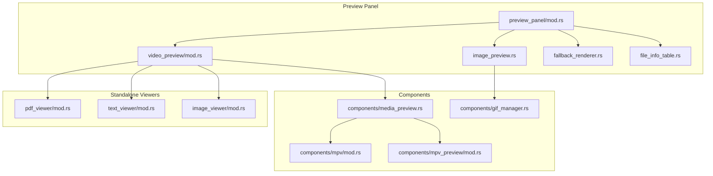
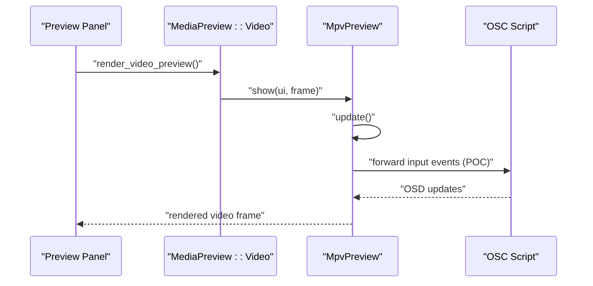
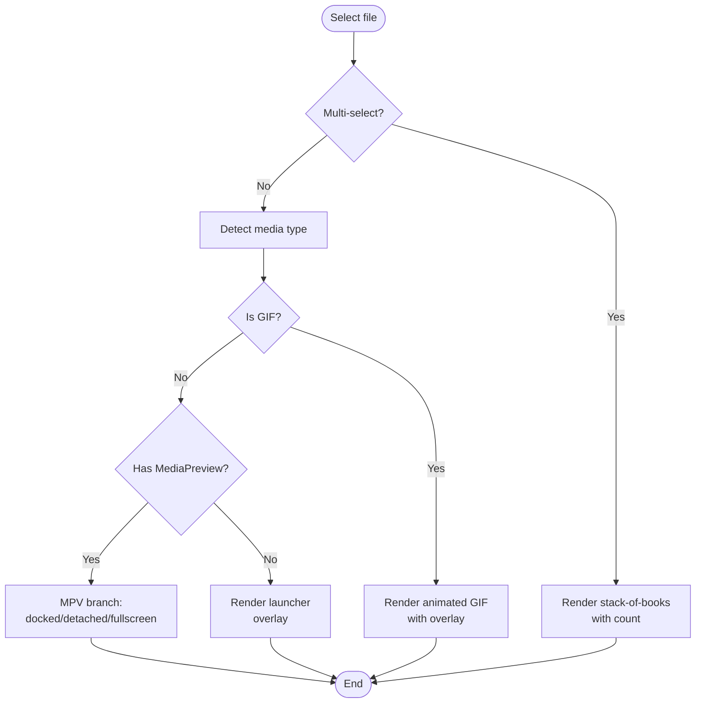
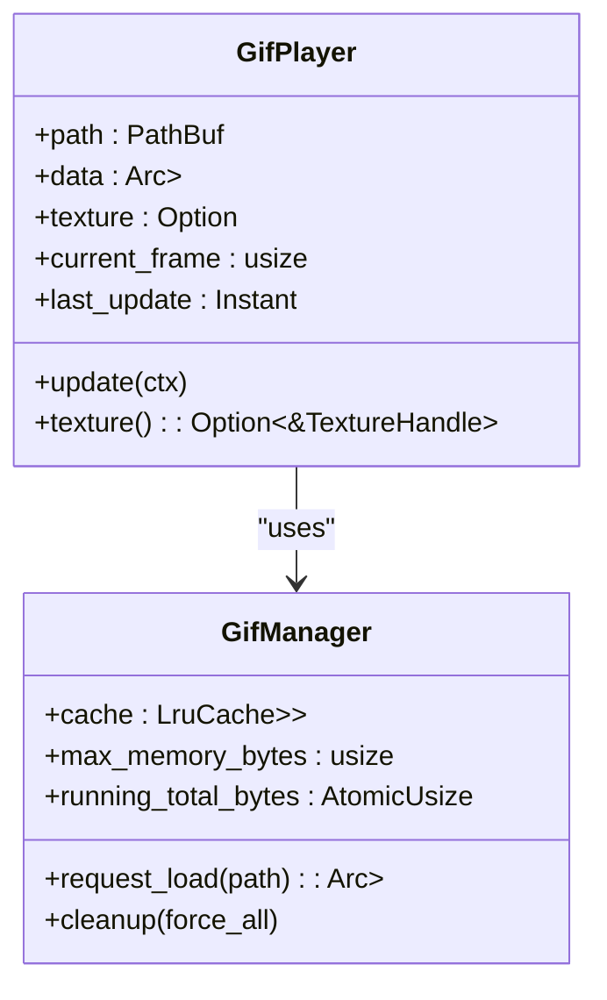
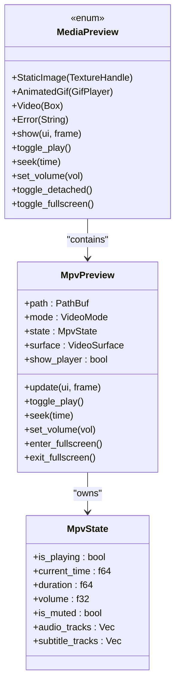
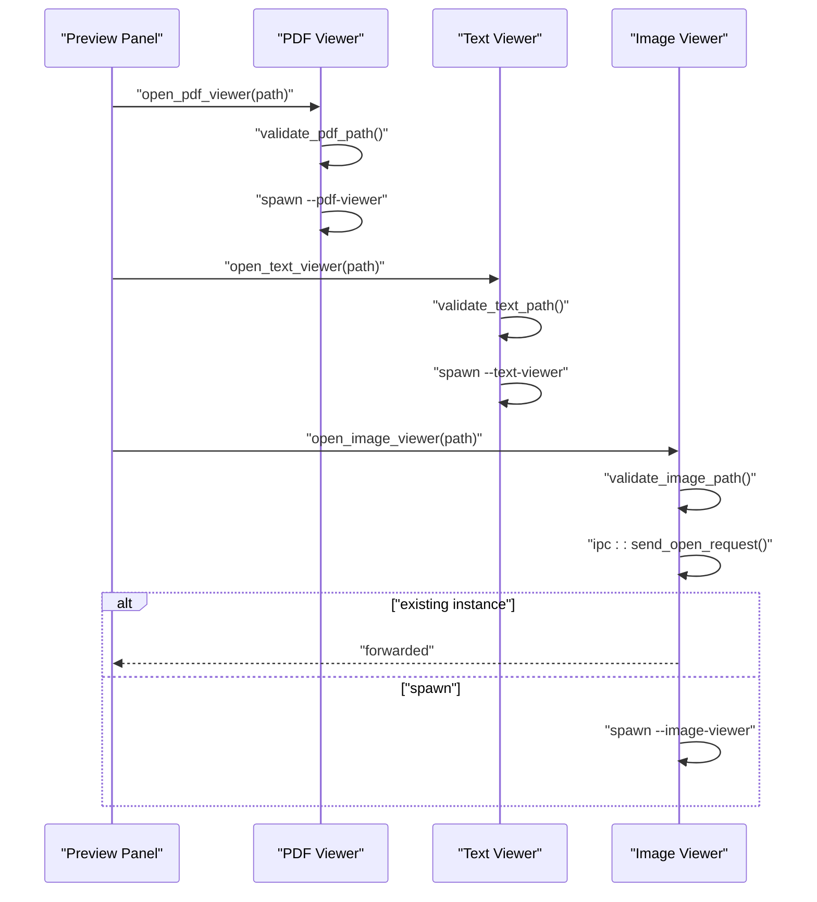
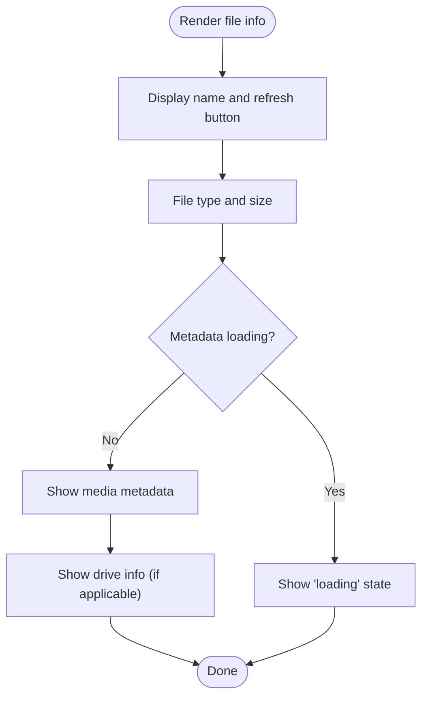
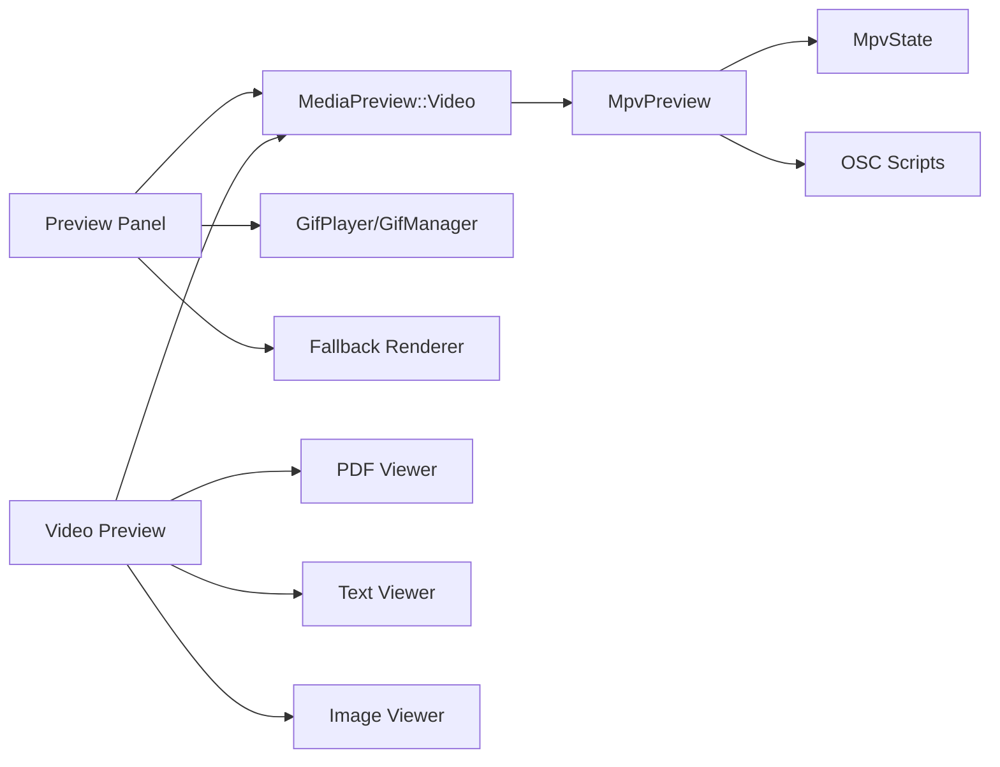

# Media Preview System

<cite>
**Referenced Files in This Document**
- [mod.rs](file://src/ui/preview_panel/mod.rs)
- [image_preview.rs](file://src/ui/preview_panel/image_preview.rs)
- [fallback_renderer.rs](file://src/ui/preview_panel/fallback_renderer.rs)
- [file_info_table.rs](file://src/ui/preview_panel/file_info_table.rs)
- [video_preview/mod.rs](file://src/ui/preview_panel/video_preview/mod.rs)
- [docked.rs](file://src/ui/preview_panel/video_preview/docked.rs)
- [fullscreen.rs](file://src/ui/preview_panel/video_preview/fullscreen.rs)
- [detached.rs](file://src/ui/preview_panel/video_preview/detached.rs)
- [controls.rs](file://src/ui/preview_panel/video_preview/controls.rs)
- [media_preview.rs](file://src/ui/components/media_preview.rs)
- [mpv/mod.rs](file://src/ui/components/mpv/mod.rs)
- [mpv_preview/mod.rs](file://src/ui/components/mpv_preview/mod.rs)
- [mpv/state.rs](file://src/ui/components/mpv/state.rs)
- [mpv/playback.rs](file://src/ui/components/mpv/playback.rs)
- [gif_manager.rs](file://src/ui/components/gif_manager.rs)
- [pdf_viewer/mod.rs](file://src/pdf_viewer/mod.rs)
- [text_viewer/mod.rs](file://src/text_viewer/mod.rs)
- [image_viewer/mod.rs](file://src/image_viewer/mod.rs)
</cite>

## Table of Contents
1. [Introduction](#introduction)
2. [Project Structure](#project-structure)
3. [Core Components](#core-components)
4. [Architecture Overview](#architecture-overview)
5. [Detailed Component Analysis](#detailed-component-analysis)
6. [Dependency Analysis](#dependency-analysis)
7. [Performance Considerations](#performance-considerations)
8. [Troubleshooting Guide](#troubleshooting-guide)
9. [Conclusion](#conclusion)

## Introduction
This document describes the MTT File Manager's media preview system, covering integrated preview panels for images, videos, PDFs, and text files, alongside standalone viewers for each format. It explains how the preview panel integrates with MPV for video playback, including docked and fullscreen modes, animated GIF playback, and metadata display. It also covers fallback rendering for unsupported formats, preview lifecycle, memory management for large media, performance optimizations, configuration options, customization, and troubleshooting.

## Project Structure
The media preview system spans several modules:
- Preview panel orchestration and rendering
- Image and GIF preview rendering
- Video preview with MPV integration
- Standalone viewers for PDF, text, and images
- GIF decoding and caching
- File information display and metadata extraction

**Diagram sources**
- [mod.rs:1-181](file://src/ui/preview_panel/mod.rs#L1-L181)
- [image_preview.rs:1-139](file://src/ui/preview_panel/image_preview.rs#L1-L139)
- [video_preview/mod.rs:1-193](file://src/ui/preview_panel/video_preview/mod.rs#L1-L193)
- [fallback_renderer.rs:1-227](file://src/ui/preview_panel/fallback_renderer.rs#L1-L227)
- [file_info_table.rs:1-427](file://src/ui/preview_panel/file_info_table.rs#L1-L427)
- [media_preview.rs:1-548](file://src/ui/components/media_preview.rs#L1-L548)
- [mpv/mod.rs:1-16](file://src/ui/components/mpv/mod.rs#L1-L16)
- [mpv_preview/mod.rs:1-409](file://src/ui/components/mpv_preview/mod.rs#L1-L409)
- [gif_manager.rs:1-286](file://src/ui/components/gif_manager.rs#L1-L286)
- [pdf_viewer/mod.rs:1-223](file://src/pdf_viewer/mod.rs#L1-L223)
- [text_viewer/mod.rs:1-228](file://src/text_viewer/mod.rs#L1-L228)
- [image_viewer/mod.rs:1-332](file://src/image_viewer/mod.rs#L1-L332)

**Section sources**
- [mod.rs:1-181](file://src/ui/preview_panel/mod.rs#L1-L181)
- [video_preview/mod.rs:1-193](file://src/ui/preview_panel/video_preview/mod.rs#L1-L193)

## Core Components
- Preview panel orchestrator: coordinates rendering for images, videos, PDFs, text, and fallbacks; displays file metadata and information.
- MPV-based video preview: embeds MPV playback in docked mode, supports detached floating windows, and fullscreen mode with native OSC integration.
- GIF player: decodes and animates GIFs with memory-limited caching and worker pools.
- Standalone viewers: separate processes for PDF, text, and images with security validations and resource limits.

Key responsibilities:
- Preview panel: decides which renderer to use based on selection and metadata availability.
- MPV preview: manages playback state, UI controls, window modes, and performance tuning.
- GIF manager: manages decode workers, memory budgets, and cache eviction.
- Standalone viewers: validate inputs, enforce size limits, and spawn independent processes.

**Section sources**
- [mod.rs:21-181](file://src/ui/preview_panel/mod.rs#L21-L181)
- [media_preview.rs:120-548](file://src/ui/components/media_preview.rs#L120-L548)
- [gif_manager.rs:59-286](file://src/ui/components/gif_manager.rs#L59-L286)
- [pdf_viewer/mod.rs:113-223](file://src/pdf_viewer/mod.rs#L113-L223)
- [text_viewer/mod.rs:125-228](file://src/text_viewer/mod.rs#L125-L228)
- [image_viewer/mod.rs:125-332](file://src/image_viewer/mod.rs#L125-L332)

## Architecture Overview
The preview system follows a layered architecture:
- UI layer: preview panel renders thumbnails, overlays, and controls.
- Component layer: MediaPreview encapsulates static images, animated GIFs, and MPV video playback.
- Playback layer: MPV preview handles video surfaces, window modes, and OSC integration.
- Viewer layer: standalone processes for PDF, text, and images with security checks.

**Diagram sources**
- [video_preview/mod.rs:121-193](file://src/ui/preview_panel/video_preview/mod.rs#L121-L193)
- [media_preview.rs:127-160](file://src/ui/components/media_preview.rs#L127-L160)
- [mpv_preview/mod.rs:52-131](file://src/ui/components/mpv_preview/mod.rs#L52-L131)
- [mpv/mod.rs:6-16](file://src/ui/components/mpv/mod.rs#L6-L16)

## Detailed Component Analysis

### Preview Panel Orchestration
The preview panel determines the appropriate renderer based on:
- Multi-selection state
- Media type (image, video/audio, PDF, text)
- Presence of thumbnails and metadata
- Ownership of the active preview

Rendering branches:
- Multi-selection: stack-of-books icon with selection count
- GIF: native animated playback with overlay
- MPV video: docked, detached, or fullscreen depending on state
- Non-video media: static thumbnail with optional overlay launch
- Fallback: folder icons, drive icons, or generic file icons with overlay

**Diagram sources**
- [mod.rs:22-181](file://src/ui/preview_panel/mod.rs#L22-L181)
- [image_preview.rs:39-139](file://src/ui/preview_panel/image_preview.rs#L39-L139)
- [video_preview/mod.rs:15-193](file://src/ui/preview_panel/video_preview/mod.rs#L15-L193)

**Section sources**
- [mod.rs:22-181](file://src/ui/preview_panel/mod.rs#L22-L181)

### Image and GIF Preview Rendering
- Static images: thumbnails with optional overlay launch for PDF/image.
- GIFs: animated playback with overlay; uses a dedicated GifPlayer and shared GifManager for decoding and caching.

**Diagram sources**
- [media_preview.rs:16-114](file://src/ui/components/media_preview.rs#L16-L114)
- [gif_manager.rs:59-286](file://src/ui/components/gif_manager.rs#L59-L286)

**Section sources**
- [image_preview.rs:39-139](file://src/ui/preview_panel/image_preview.rs#L39-L139)
- [media_preview.rs:16-114](file://src/ui/components/media_preview.rs#L16-L114)
- [gif_manager.rs:59-286](file://src/ui/components/gif_manager.rs#L59-L286)

### MPV Video Preview and Controls
The MPV preview supports three modes:
- Docked: embedded in the preview panel with a compact control bar.
- Detached: floating window with full controls, track pickers, and advanced features.
- Fullscreen: viewport-wide mode with auto-hiding controls and native OSC.

**Diagram sources**
- [media_preview.rs:120-548](file://src/ui/components/media_preview.rs#L120-L548)
- [mpv_preview/mod.rs:52-131](file://src/ui/components/mpv_preview/mod.rs#L52-L131)
- [mpv/state.rs:29-44](file://src/ui/components/mpv/state.rs#L29-L44)

**Section sources**
- [video_preview/mod.rs:121-193](file://src/ui/preview_panel/video_preview/mod.rs#L121-L193)
- [docked.rs:8-57](file://src/ui/preview_panel/video_preview/docked.rs#L8-L57)
- [fullscreen.rs:8-210](file://src/ui/preview_panel/video_preview/fullscreen.rs#L8-L210)
- [detached.rs:8-355](file://src/ui/preview_panel/video_preview/detached.rs#L8-L355)
- [controls.rs:84-326](file://src/ui/preview_panel/video_preview/controls.rs#L84-L326)
- [media_preview.rs:120-548](file://src/ui/components/media_preview.rs#L120-L548)
- [mpv_preview/mod.rs:52-131](file://src/ui/components/mpv_preview/mod.rs#L52-L131)
- [mpv/state.rs:29-44](file://src/ui/components/mpv/state.rs#L29-L44)

### Standalone Viewers
Standalone viewers are separate processes launched from the main application:
- PDF viewer: validates path, enforces size limits, spawns a dedicated process.
- Text viewer: validates extension and size, spawns a dedicated process.
- Image viewer: validates path, forwards to existing instance if available, otherwise spawns.

**Diagram sources**
- [pdf_viewer/mod.rs:113-223](file://src/pdf_viewer/mod.rs#L113-L223)
- [text_viewer/mod.rs:125-228](file://src/text_viewer/mod.rs#L125-L228)
- [image_viewer/mod.rs:125-332](file://src/image_viewer/mod.rs#L125-L332)

**Section sources**
- [pdf_viewer/mod.rs:113-223](file://src/pdf_viewer/mod.rs#L113-L223)
- [text_viewer/mod.rs:125-228](file://src/text_viewer/mod.rs#L125-L228)
- [image_viewer/mod.rs:125-332](file://src/image_viewer/mod.rs#L125-L332)

### File Information Display and Metadata Extraction
The file info table presents:
- General file/folder/drive details
- Media-specific metadata (resolution, codecs, duration, frame rate, bitrate, camera info)
- Live file size resolution with caching and periodic refresh
- Optional refresh button for media thumbnails

**Diagram sources**
- [file_info_table.rs:63-427](file://src/ui/preview_panel/file_info_table.rs#L63-L427)

**Section sources**
- [file_info_table.rs:63-427](file://src/ui/preview_panel/file_info_table.rs#L63-L427)

## Dependency Analysis
Key dependencies and relationships:
- Preview panel depends on file metadata and icon loaders to decide renderers.
- MPV preview depends on the MPV library and OSC scripts for UI integration.
- GIF playback depends on GifManager for decoding and caching.
- Standalone viewers depend on the main executable and enforce security policies.

**Diagram sources**
- [mod.rs:1-181](file://src/ui/preview_panel/mod.rs#L1-L181)
- [media_preview.rs:120-548](file://src/ui/components/media_preview.rs#L120-L548)
- [mpv_preview/mod.rs:52-131](file://src/ui/components/mpv_preview/mod.rs#L52-L131)
- [gif_manager.rs:59-286](file://src/ui/components/gif_manager.rs#L59-L286)
- [pdf_viewer/mod.rs:1-223](file://src/pdf_viewer/mod.rs#L1-L223)
- [text_viewer/mod.rs:1-228](file://src/text_viewer/mod.rs#L1-L228)
- [image_viewer/mod.rs:1-332](file://src/image_viewer/mod.rs#L1-L332)

**Section sources**
- [mod.rs:1-181](file://src/ui/preview_panel/mod.rs#L1-L181)
- [media_preview.rs:120-548](file://src/ui/components/media_preview.rs#L120-L548)
- [mpv_preview/mod.rs:1-409](file://src/ui/components/mpv_preview/mod.rs#L1-L409)
- [gif_manager.rs:1-286](file://src/ui/components/gif_manager.rs#L1-L286)

## Performance Considerations
- GIF decoding:
  - Worker pool with bounded concurrency to prevent unbounded threads.
  - Memory budget tracking with atomic totals for O(1) eviction decisions.
  - Frame resizing and capped frame count to avoid OOM.
- MPV playback:
  - Mode-specific cache and demuxer settings for docked vs detached.
  - Async event handling and polling removal for reduced overhead.
  - Native OSC integration for responsive UI without heavy polling.
- Preview panel:
  - Early-exit for non-media items and thumbnail reuse.
  - Overlay click areas sized to avoid unnecessary allocations.
- Live file size:
  - LRU caching with periodic refresh to balance accuracy and performance.

[No sources needed since this section provides general guidance]

## Troubleshooting Guide
Common issues and resolutions:
- White screen or stuck playback:
  - Force restore by toggling fullscreen or detaching/docking to reset the MPV window.
  - Use the overlay hide/restore mechanism when popups cover the video area.
- Volume/seek keys not working:
  - Ensure native OSC is enabled; otherwise, keyboard shortcuts are handled locally in fullscreen/detached modes.
- GIF not animating:
  - Verify decode worker is running and cache is not evicted; check memory budget and TTL cleanup.
- Standalone viewer fails to open:
  - Confirm path validation passes (no UNC, no null bytes, supported extension, file exists, size within limits).
- Controls not visible:
  - Mouse movement resets activity timers; ensure mouse is over the control area in auto-hide modes.

**Section sources**
- [media_preview.rs:520-531](file://src/ui/components/media_preview.rs#L520-L531)
- [fullscreen.rs:72-78](file://src/ui/preview_panel/video_preview/fullscreen.rs#L72-L78)
- [detached.rs:175-182](file://src/ui/preview_panel/video_preview/detached.rs#L175-L182)
- [gif_manager.rs:146-188](file://src/ui/components/gif_manager.rs#L146-L188)
- [pdf_viewer/mod.rs:39-111](file://src/pdf_viewer/mod.rs#L39-L111)
- [text_viewer/mod.rs:51-123](file://src/text_viewer/mod.rs#L51-L123)
- [image_viewer/mod.rs:77-123](file://src/image_viewer/mod.rs#L77-L123)

## Conclusion
The MTT File Manager’s media preview system combines an integrated preview panel with robust MPV-based video playback, animated GIF support, and secure standalone viewers for PDFs, text, and images. It emphasizes performance through caching, worker pools, and mode-aware optimizations, while providing flexible UI modes and comprehensive metadata display. The architecture cleanly separates concerns across UI, component, playback, and viewer layers, enabling maintainability and extensibility.