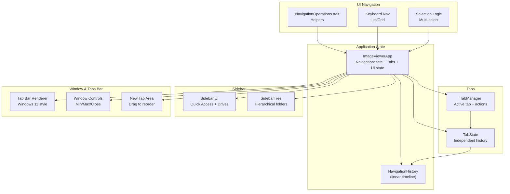
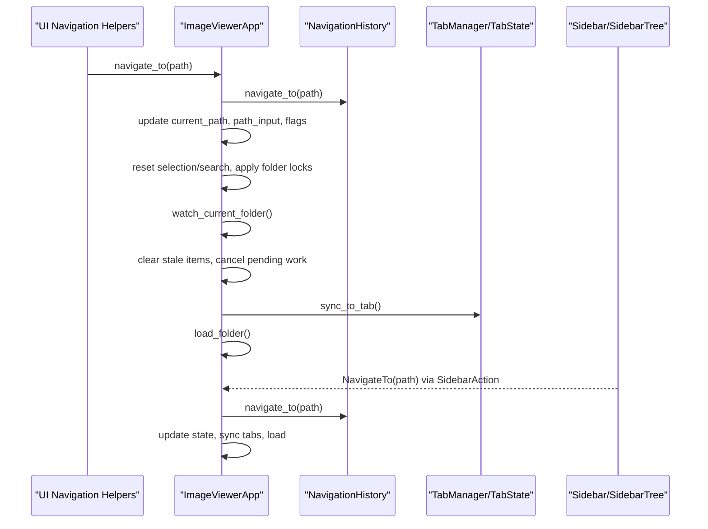
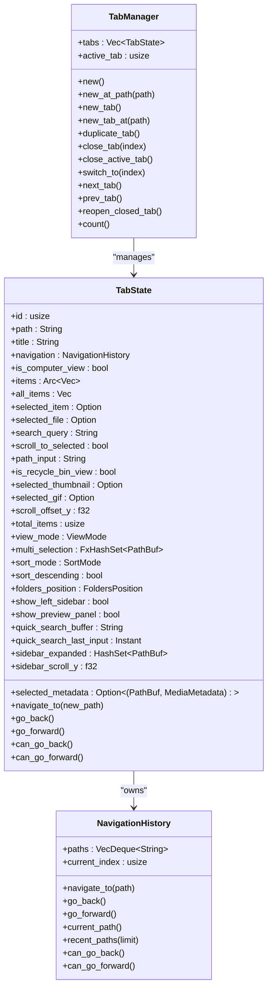
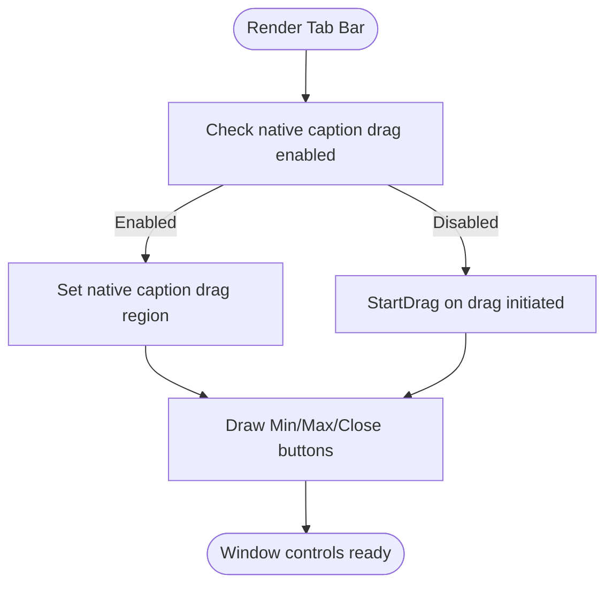
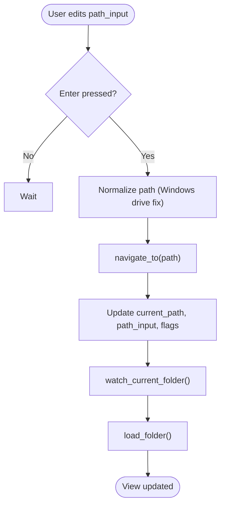
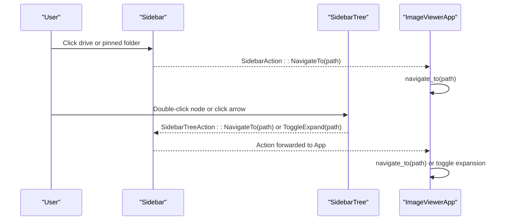
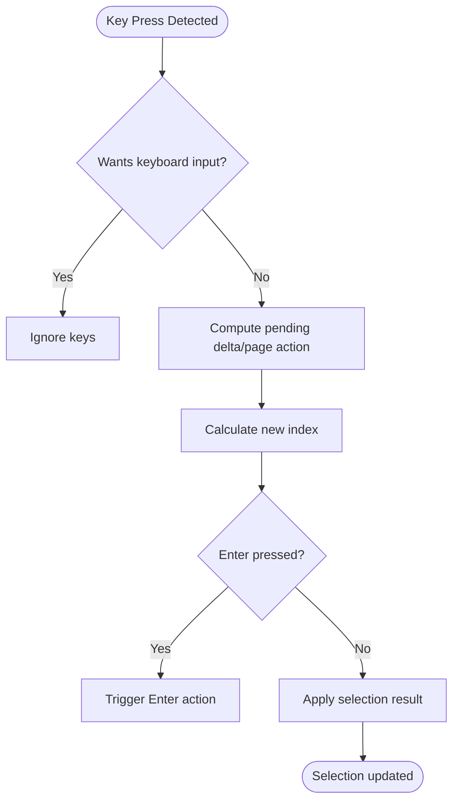
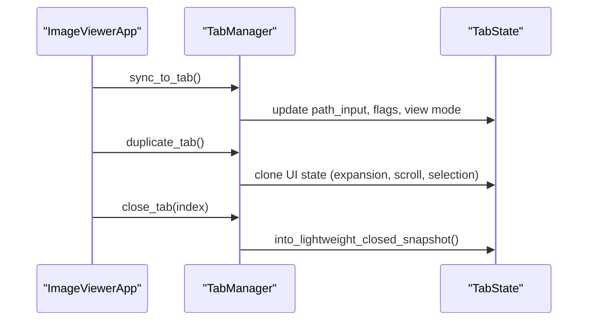
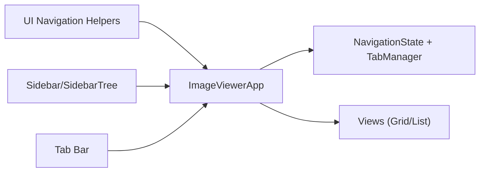
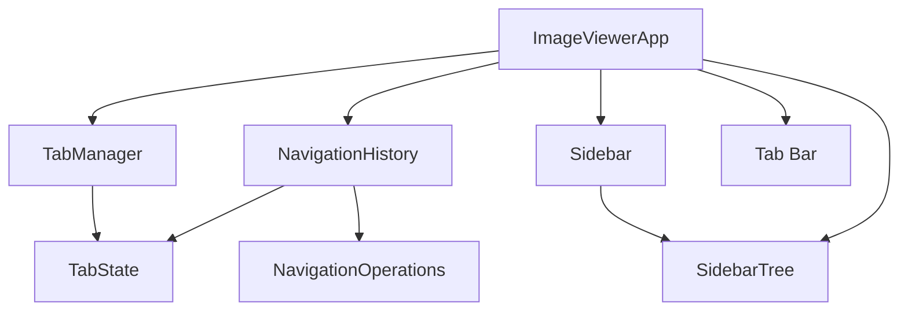

# Navigation & Interface

<cite>
**Referenced Files in This Document**
- [navigation_state.rs](file://src/app/navigation_state.rs)
- [navigation.rs](file://src/ui/navigation.rs)
- [mod.rs (navigation operations)](file://src/app/operations/navigation/mod.rs)
- [keyboard.rs](file://src/app/operations/navigation/keyboard.rs)
- [selection.rs](file://src/app/operations/navigation/selection.rs)
- [mod.rs (tabs)](file://src/tabs/mod.rs)
- [navigation.rs (application)](file://src/application/navigation.rs)
- [mod.rs (app state)](file://src/app/state/mod.rs)
- [sidebar.rs](file://src/ui/sidebar.rs)
- [sidebar_tree.rs](file://src/ui/sidebar_tree.rs)
- [mod.rs (tab bar)](file://src/ui/tab_bar/mod.rs)
- [tabs_renderer.rs](file://src/ui/tab_bar/tabs_renderer.rs)
- [new_tab_area.rs](file://src/ui/tab_bar/new_tab_area.rs)
- [window_controls.rs](file://src/ui/tab_bar/window_controls.rs)
- [main.rs](file://src/main.rs)
</cite>

## Table of Contents
1. [Introduction](#introduction)
2. [Project Structure](#project-structure)
3. [Core Components](#core-components)
4. [Architecture Overview](#architecture-overview)
5. [Detailed Component Analysis](#detailed-component-analysis)
6. [Dependency Analysis](#dependency-analysis)
7. [Performance Considerations](#performance-considerations)
8. [Troubleshooting Guide](#troubleshooting-guide)
9. [Conclusion](#conclusion)

## Introduction
This document explains the navigation and interface system of MTT File Manager with a focus on:
- Tabbed navigation architecture with independent history per tab
- Custom borderless window management with native resize/move capabilities
- Editable address bar with breadcrumb navigation
- Sidebar tree with quick access functionality
- Keyboard navigation patterns, selection management, and tab synchronization mechanisms
- Integration between UI components and application state
- Configuration options for navigation behavior and customization possibilities
- Performance considerations for smooth navigation experiences

## Project Structure
The navigation and interface system spans several modules:
- Application state and navigation history
- UI navigation helpers and operations
- Tab management with independent histories
- Sidebar and tree navigation
- Tab bar rendering and window controls
- Main application bootstrap for borderless window behavior

**Diagram sources**
- [mod.rs (app state):65-435](file://src/app/state/mod.rs#L65-L435)
- [navigation.rs (application):12-118](file://src/application/navigation.rs#L12-L118)
- [mod.rs (navigation operations):12-363](file://src/app/operations/navigation/mod.rs#L12-L363)
- [keyboard.rs:1-225](file://src/app/operations/navigation/keyboard.rs#L1-L225)
- [selection.rs:1-206](file://src/app/operations/navigation/selection.rs#L1-L206)
- [mod.rs (tabs):24-246](file://src/tabs/mod.rs#L24-L246)
- [sidebar.rs:75-327](file://src/ui/sidebar.rs#L75-L327)
- [sidebar_tree.rs:31-66](file://src/ui/sidebar_tree.rs#L31-L66)
- [mod.rs (tab bar):33-145](file://src/ui/tab_bar/mod.rs#L33-L145)
- [tabs_renderer.rs:47-322](file://src/ui/tab_bar/tabs_renderer.rs#L47-L322)
- [new_tab_area.rs:6-81](file://src/ui/tab_bar/new_tab_area.rs#L6-L81)
- [window_controls.rs:8-143](file://src/ui/tab_bar/window_controls.rs#L8-L143)

**Section sources**
- [mod.rs (app state):65-435](file://src/app/state/mod.rs#L65-L435)
- [navigation.rs (application):12-118](file://src/application/navigation.rs#L12-L118)
- [mod.rs (navigation operations):12-363](file://src/app/operations/navigation/mod.rs#L12-L363)
- [keyboard.rs:1-225](file://src/app/operations/navigation/keyboard.rs#L1-L225)
- [selection.rs:1-206](file://src/app/operations/navigation/selection.rs#L1-L206)
- [mod.rs (tabs):24-246](file://src/tabs/mod.rs#L24-L246)
- [sidebar.rs:75-327](file://src/ui/sidebar.rs#L75-L327)
- [sidebar_tree.rs:31-66](file://src/ui/sidebar_tree.rs#L31-L66)
- [mod.rs (tab bar):33-145](file://src/ui/tab_bar/mod.rs#L33-L145)
- [tabs_renderer.rs:47-322](file://src/ui/tab_bar/tabs_renderer.rs#L47-L322)
- [new_tab_area.rs:6-81](file://src/ui/tab_bar/new_tab_area.rs#L6-L81)
- [window_controls.rs:8-143](file://src/ui/tab_bar/window_controls.rs#L8-L143)

## Core Components
- NavigationHistory: Linear timeline with current index, forward/backward navigation, and recent visits tracking.
- NavigationOperations trait and helpers: Encapsulate navigation logic (navigate_to, go_back, go_forward, go_up_one_level, navigate_to_computer).
- ImageViewerApp: Central state container integrating navigation_state, tab_manager, sidebar_tree, and UI flags.
- TabState and TabManager: Independent histories per tab, duplication, closing, and switching.
- Sidebar and SidebarTree: Quick access, pinned folders, drives, and hierarchical folder navigation with drag-and-drop.
- Tab Bar: Windows 11-style tabs with icons, close buttons, new tab area, and window controls; supports borderless move/resize.
- Keyboard and Selection: Cross-view navigation helpers and multi-selection logic.

**Section sources**
- [navigation.rs (application):12-118](file://src/application/navigation.rs#L12-L118)
- [navigation.rs:13-171](file://src/ui/navigation.rs#L13-L171)
- [mod.rs (app state):65-435](file://src/app/state/mod.rs#L65-L435)
- [mod.rs (tabs):24-246](file://src/tabs/mod.rs#L24-L246)
- [sidebar.rs:75-327](file://src/ui/sidebar.rs#L75-L327)
- [sidebar_tree.rs:31-66](file://src/ui/sidebar_tree.rs#L31-L66)
- [mod.rs (tab bar):33-145](file://src/ui/tab_bar/mod.rs#L33-L145)
- [keyboard.rs:1-225](file://src/app/operations/navigation/keyboard.rs#L1-L225)
- [selection.rs:1-206](file://src/app/operations/navigation/selection.rs#L1-L206)

## Architecture Overview
The navigation system separates concerns:
- UI navigation helpers encapsulate history manipulation and side effects (watcher updates, folder reloads).
- Application state orchestrates navigation events, triggers view updates, and maintains per-tab state.
- Tabs maintain independent histories and UI state snapshots.
- Sidebar and tree provide alternative navigation paths synchronized with the active tab.
- Tab bar renders per-tab state and translates user actions into tab switches, new tabs, and window commands.

**Diagram sources**
- [navigation.rs:29-65](file://src/ui/navigation.rs#L29-L65)
- [mod.rs (navigation operations):48-132](file://src/app/operations/navigation/mod.rs#L48-L132)
- [navigation.rs (application):47-64](file://src/application/navigation.rs#L47-L64)
- [mod.rs (tabs):160-182](file://src/tabs/mod.rs#L160-L182)
- [sidebar.rs:55-73](file://src/ui/sidebar.rs#L55-L73)

**Section sources**
- [navigation.rs:29-65](file://src/ui/navigation.rs#L29-L65)
- [mod.rs (navigation operations):48-132](file://src/app/operations/navigation/mod.rs#L48-L132)
- [navigation.rs (application):47-64](file://src/application/navigation.rs#L47-L64)
- [mod.rs (tabs):160-182](file://src/tabs/mod.rs#L160-L182)
- [sidebar.rs:55-73](file://src/ui/sidebar.rs#L55-L73)

## Detailed Component Analysis

### Tabbed Navigation Architecture
- Each TabState carries its own NavigationHistory and UI flags (computer/recycle bin view, path_input, selected items, view mode, sidebar state).
- TabManager manages multiple tabs, supports duplication, closing, and switching, and preserves per-tab UI state.
- Navigation operations update the active tab’s history and synchronize other tabs to reflect the new state.

**Diagram sources**
- [navigation.rs (application):12-118](file://src/application/navigation.rs#L12-L118)
- [mod.rs (tabs):24-246](file://src/tabs/mod.rs#L24-L246)

**Section sources**
- [mod.rs (tabs):24-246](file://src/tabs/mod.rs#L24-L246)
- [navigation.rs (application):12-118](file://src/application/navigation.rs#L12-L118)

### Custom Borderless Window Management
- The application runs with decorations disabled and resizable, delegating move/resize to native window procedures.
- The tab bar’s “new tab area” exposes a native caption drag region and falls back to egui StartDrag when native drag is unavailable.
- Window controls (minimize, maximize, close) are rendered directly on the tab bar for a cohesive borderless experience.

**Diagram sources**
- [main.rs:231-238](file://src/main.rs#L231-L238)
- [new_tab_area.rs:25-50](file://src/ui/tab_bar/new_tab_area.rs#L25-L50)
- [window_controls.rs:8-143](file://src/ui/tab_bar/window_controls.rs#L8-L143)

**Section sources**
- [main.rs:231-238](file://src/main.rs#L231-L238)
- [new_tab_area.rs:6-81](file://src/ui/tab_bar/new_tab_area.rs#L6-L81)
- [window_controls.rs:8-143](file://src/ui/tab_bar/window_controls.rs#L8-L143)

### Editable Address Bar with Breadcrumb Navigation
- Address bar input mirrors the current path and can be edited; navigation commits on Enter and can suppress immediate open behavior to avoid double-triggering.
- NavigationHistory tracks recent visits for dropdown suggestions.
- Keyboard navigation helpers support Enter to open, with reserved binding checks to avoid conflicts.

**Diagram sources**
- [mod.rs (navigation operations):48-132](file://src/app/operations/navigation/mod.rs#L48-L132)
- [navigation.rs (application):47-64](file://src/application/navigation.rs#L47-L64)
- [keyboard.rs:112-125](file://src/app/operations/navigation/keyboard.rs#L112-L125)

**Section sources**
- [mod.rs (navigation operations):48-132](file://src/app/operations/navigation/mod.rs#L48-L132)
- [navigation.rs (application):47-64](file://src/application/navigation.rs#L47-L64)
- [keyboard.rs:112-125](file://src/app/operations/navigation/keyboard.rs#L112-L125)

### Sidebar Tree with Quick Access
- Fixed top section: “This PC”, “Quick Access” (OneDrive, Recycle Bin), and pinned folders.
- Drives section: local/network drives with inline rename, eject, and expand/collapse toggles.
- Hierarchical folder tree under each drive root with drag-and-drop support and per-tab expansion state.
- Actions propagate back to the main app to navigate, toggle tree nodes, or drop items.

**Diagram sources**
- [sidebar.rs:55-73](file://src/ui/sidebar.rs#L55-L73)
- [sidebar_tree.rs:5-13](file://src/ui/sidebar_tree.rs#L5-L13)
- [mod.rs (navigation operations):48-132](file://src/app/operations/navigation/mod.rs#L48-L132)

**Section sources**
- [sidebar.rs:75-327](file://src/ui/sidebar.rs#L75-L327)
- [sidebar_tree.rs:31-66](file://src/ui/sidebar_tree.rs#L31-L66)
- [sidebar_tree.rs:68-261](file://src/ui/sidebar_tree.rs#L68-L261)

### Keyboard Navigation Patterns and Selection Management
- Keyboard navigation supports arrow keys and page up/down for both list and grid views, with view-specific logic for row height and grid columns.
- Selection logic supports Ctrl+Click (toggle), Shift+Click (range), and simple click (select only).
- Shift navigation updates selection ranges without changing the anchor unless explicitly requested.

**Diagram sources**
- [keyboard.rs:51-126](file://src/app/operations/navigation/keyboard.rs#L51-L126)
- [keyboard.rs:128-210](file://src/app/operations/navigation/keyboard.rs#L128-L210)
- [selection.rs:108-132](file://src/app/operations/navigation/selection.rs#L108-L132)
- [selection.rs:134-177](file://src/app/operations/navigation/selection.rs#L134-L177)

**Section sources**
- [keyboard.rs:1-225](file://src/app/operations/navigation/keyboard.rs#L1-L225)
- [selection.rs:1-206](file://src/app/operations/navigation/selection.rs#L1-L206)

### Tab Synchronization Mechanisms
- Independent histories per tab enable independent browsing.
- When navigating, the app synchronizes tab state to reflect the new path and view flags.
- Closing or duplicating tabs preserves UI preferences (sidebars, view modes) and per-tab expansion state.

**Diagram sources**
- [mod.rs (navigation operations):128-129](file://src/app/operations/navigation/mod.rs#L128-L129)
- [mod.rs (tabs):321-352](file://src/tabs/mod.rs#L321-L352)
- [mod.rs (tabs):354-380](file://src/tabs/mod.rs#L354-L380)
- [mod.rs (tabs):229-245](file://src/tabs/mod.rs#L229-L245)

**Section sources**
- [mod.rs (navigation operations):128-129](file://src/app/operations/navigation/mod.rs#L128-L129)
- [mod.rs (tabs):321-352](file://src/tabs/mod.rs#L321-L352)
- [mod.rs (tabs):354-380](file://src/tabs/mod.rs#L354-L380)
- [mod.rs (tabs):229-245](file://src/tabs/mod.rs#L229-L245)

### Integration Between UI Components and Application State
- Navigation operations update NavigationState and trigger watchers and folder reloads.
- Sidebar actions translate to navigation commands and tree toggles.
- Tab bar actions switch tabs, close tabs, create new tabs, and control the window.

**Diagram sources**
- [navigation.rs:13-23](file://src/ui/navigation.rs#L13-L23)
- [mod.rs (app state):65-435](file://src/app/state/mod.rs#L65-L435)
- [sidebar.rs:55-73](file://src/ui/sidebar.rs#L55-L73)
- [mod.rs (tab bar):21-31](file://src/ui/tab_bar/mod.rs#L21-L31)

**Section sources**
- [navigation.rs:13-23](file://src/ui/navigation.rs#L13-L23)
- [mod.rs (app state):65-435](file://src/app/state/mod.rs#L65-L435)
- [sidebar.rs:55-73](file://src/ui/sidebar.rs#L55-L73)
- [mod.rs (tab bar):21-31](file://src/ui/tab_bar/mod.rs#L21-L31)

## Dependency Analysis
- NavigationHistory is used by both TabState and NavigationOperations to maintain linear timelines.
- ImageViewerApp aggregates NavigationState, TabManager, and UI flags to coordinate navigation and view updates.
- Sidebar and SidebarTree depend on SidebarTreeState for expansion/loading state and icon loader for visuals.
- Tab bar depends on TabManager and icon loaders for rendering and reacts to window state for controls.

**Diagram sources**
- [navigation.rs (application):12-118](file://src/application/navigation.rs#L12-L118)
- [mod.rs (tabs):24-246](file://src/tabs/mod.rs#L24-L246)
- [mod.rs (navigation operations):12-363](file://src/app/operations/navigation/mod.rs#L12-L363)
- [sidebar.rs:55-73](file://src/ui/sidebar.rs#L55-L73)
- [sidebar_tree.rs:5-13](file://src/ui/sidebar_tree.rs#L5-L13)
- [mod.rs (tab bar):21-31](file://src/ui/tab_bar/mod.rs#L21-L31)

**Section sources**
- [navigation.rs (application):12-118](file://src/application/navigation.rs#L12-L118)
- [mod.rs (tabs):24-246](file://src/tabs/mod.rs#L24-L246)
- [mod.rs (navigation operations):12-363](file://src/app/operations/navigation/mod.rs#L12-L363)
- [sidebar.rs:55-73](file://src/ui/sidebar.rs#L55-L73)
- [sidebar_tree.rs:5-13](file://src/ui/sidebar_tree.rs#L5-L13)
- [mod.rs (tab bar):21-31](file://src/ui/tab_bar/mod.rs#L21-L31)

## Performance Considerations
- History caps: NavigationHistory limits entries to prevent unbounded growth and recent visits list size to bound suggestions.
- Stale item mitigation: On path-change navigation, items are cleared immediately to avoid flashing of stale data; watcher-triggered reloads use stale-while-revalidate patterns.
- Thumbnail and metadata caching: LRU caches and queues avoid blocking UI thread and reduce redundant work.
- Rendering optimizations: Grid/list views use virtualization, predictive scrolling, and visible range tracking to upload textures efficiently.
- Startup and window behavior: Borderless window with native resize/move minimizes overhead and improves responsiveness.

[No sources needed since this section provides general guidance]

## Troubleshooting Guide
- Navigation does not update address bar: Ensure path_input is updated alongside current_path after navigation.
- Back/forward buttons disabled: Verify NavigationHistory can_go_back/can_go_forward conditions.
- Keyboard navigation conflicts: Check reserved Enter binding and that the view is not capturing text input.
- Sidebar actions not triggering navigation: Confirm SidebarAction propagation to ImageViewerApp and that renaming/dragging states are not blocking interactions.
- Tab synchronization issues: After navigation, confirm sync_to_tab is called to align tab state with the new path.

**Section sources**
- [navigation.rs (application):109-117](file://src/application/navigation.rs#L109-L117)
- [mod.rs (navigation operations):96-100](file://src/app/operations/navigation/mod.rs#L96-L100)
- [keyboard.rs:62-65](file://src/app/operations/navigation/keyboard.rs#L62-L65)
- [sidebar.rs:137-139](file://src/ui/sidebar.rs#L137-L139)
- [mod.rs (tabs):160-182](file://src/tabs/mod.rs#L160-L182)

## Conclusion
MTT File Manager’s navigation and interface system combines independent tab histories, robust UI navigation helpers, and a responsive sidebar/tree with a polished tab bar and borderless window controls. The design emphasizes separation of concerns, efficient state synchronization, and performance-conscious rendering, delivering a smooth and customizable file browsing experience.