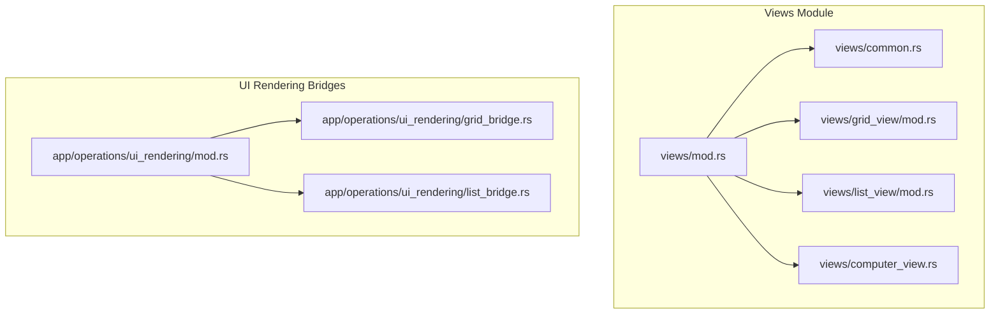
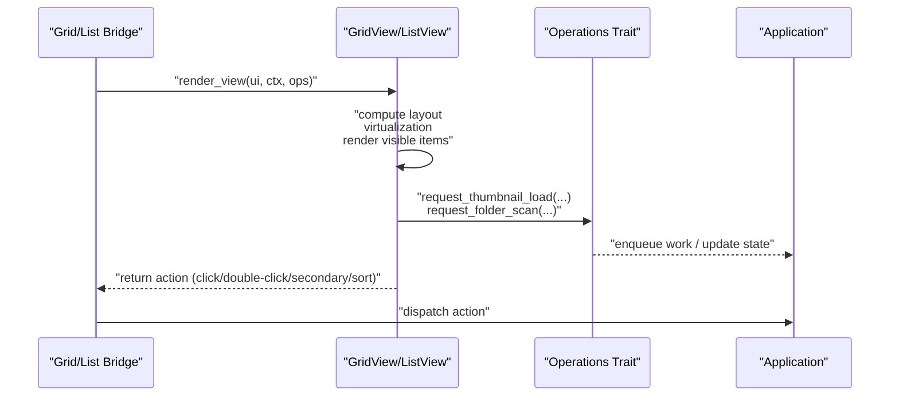
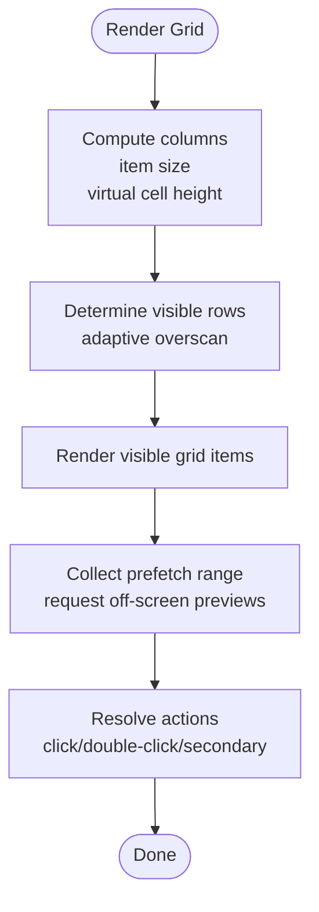
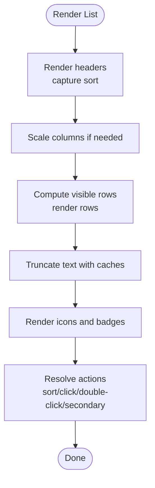
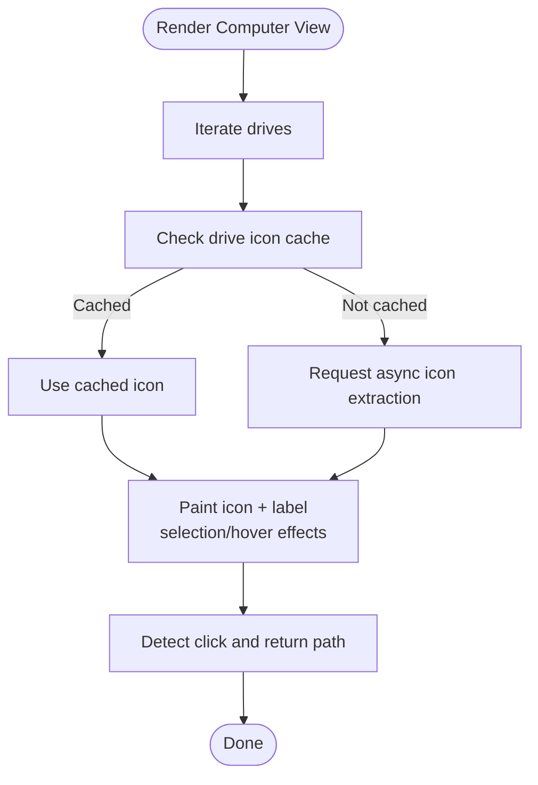
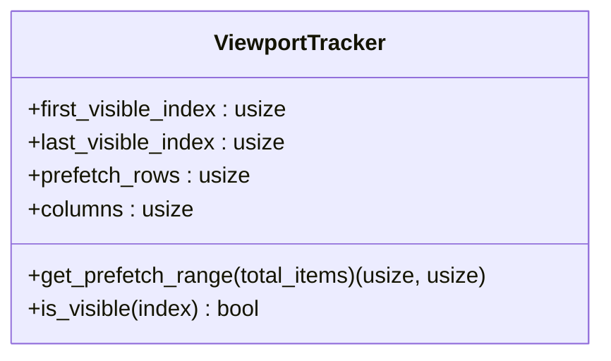
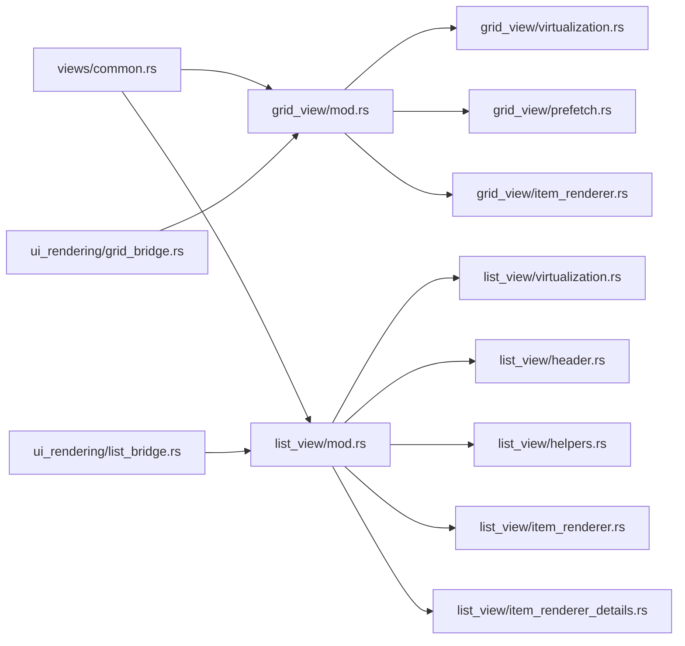

# View Systems

<cite>
**Referenced Files in This Document**
- [mod.rs](file://src/ui/views/mod.rs)
- [common.rs](file://src/ui/views/common.rs)
- [computer_view.rs](file://src/ui/views/computer_view.rs)
- [grid_view/mod.rs](file://src/ui/views/grid_view/mod.rs)
- [grid_view/virtualization.rs](file://src/ui/views/grid_view/virtualization.rs)
- [grid_view/item_renderer.rs](file://src/ui/views/grid_view/item_renderer.rs)
- [grid_view/prefetch.rs](file://src/ui/views/grid_view/prefetch.rs)
- [list_view/mod.rs](file://src/ui/views/list_view/mod.rs)
- [list_view/virtualization.rs](file://src/ui/views/list_view/virtualization.rs)
- [list_view/header.rs](file://src/ui/views/list_view/header.rs)
- [list_view/helpers.rs](file://src/ui/views/list_view/helpers.rs)
- [list_view/item_renderer.rs](file://src/ui/views/list_view/item_renderer.rs)
- [list_view/item_renderer_details.rs](file://src/ui/views/list_view/item_renderer_details.rs)
- [ui_rendering/mod.rs](file://src/app/operations/ui_rendering/mod.rs)
- [ui_rendering/grid_bridge.rs](file://src/app/operations/ui_rendering/grid_bridge.rs)
- [ui_rendering/list_bridge.rs](file://src/app/operations/ui_rendering/list_bridge.rs)
</cite>

## Table of Contents
1. [Introduction](#introduction)
2. [Project Structure](#project-structure)
3. [Core Components](#core-components)
4. [Architecture Overview](#architecture-overview)
5. [Detailed Component Analysis](#detailed-component-analysis)
6. [Dependency Analysis](#dependency-analysis)
7. [Performance Considerations](#performance-considerations)
8. [Troubleshooting Guide](#troubleshooting-guide)
9. [Conclusion](#conclusion)

## Introduction
This document explains the dual-view architecture of MTT File Manager’s UI: grid view and list view. It covers how view mode switching works conceptually, how each view renders items, and how common infrastructure supports both modes. It documents grid view features including adjustable thumbnail sizes, virtualization, and prefetch strategies; list view features including resizable columns, sorting, and details mode; and the computer view for system drives. It also describes the rendering pipeline, performance tuning, and how view state integrates with application navigation and preferences.

## Project Structure
The view system is organized under a dedicated module with separate submodules for grid, list, computer view, and shared helpers. Bridges connect application state to the views.

**Diagram sources**
- [mod.rs:1-14](file://src/ui/views/mod.rs#L1-L14)
- [common.rs:1-78](file://src/ui/views/common.rs#L1-L78)
- [grid_view/mod.rs:1-379](file://src/ui/views/grid_view/mod.rs#L1-L379)
- [list_view/mod.rs:1-411](file://src/ui/views/list_view/mod.rs#L1-L411)
- [computer_view.rs:1-126](file://src/ui/views/computer_view.rs#L1-L126)
- [ui_rendering/mod.rs:1-13](file://src/app/operations/ui_rendering/mod.rs#L1-L13)

**Section sources**
- [mod.rs:1-14](file://src/ui/views/mod.rs#L1-L14)
- [ui_rendering/mod.rs:1-13](file://src/app/operations/ui_rendering/mod.rs#L1-L13)

## Core Components
- Dual-view rendering: grid and list views each encapsulate their own rendering, virtualization, and interaction logic.
- Common infrastructure: shared helpers for tooltips, date/size formatting, and viewport tracking.
- Computer view: specialized rendering for system drives with manual layout and drive icon caching.
- Bridges: thin adapters that prepare contexts and dispatch actions from the views to application operations.

Key responsibilities:
- Grid view: dynamic thumbnail sizing, virtualized grid rendering, predictive prefetch, and drag-and-drop feedback.
- List view: resizable columns, sorting, truncation caches, and details rendering for folders and OneDrive.
- Common: viewport tracking, tooltip delays, and formatting utilities.

**Section sources**
- [grid_view/mod.rs:123-192](file://src/ui/views/grid_view/mod.rs#L123-L192)
- [list_view/mod.rs:192-262](file://src/ui/views/list_view/mod.rs#L192-L262)
- [common.rs:39-77](file://src/ui/views/common.rs#L39-L77)
- [computer_view.rs:8-24](file://src/ui/views/computer_view.rs#L8-L24)

## Architecture Overview
The rendering pipeline follows a consistent pattern:
- The bridge constructs a view-specific context and operations trait object.
- The view computes layout (columns, row heights, widths), applies virtualization, renders visible items, and handles interactions.
- Actions are returned to the bridge, which translates them into application-level operations.

**Diagram sources**
- [grid_view/mod.rs:229-379](file://src/ui/views/grid_view/mod.rs#L229-L379)
- [list_view/mod.rs:292-363](file://src/ui/views/list_view/mod.rs#L292-L363)
- [ui_rendering/grid_bridge.rs:298-331](file://src/app/operations/ui_rendering/grid_bridge.rs#L298-L331)
- [ui_rendering/list_bridge.rs:298-331](file://src/app/operations/ui_rendering/list_bridge.rs#L298-L331)

## Detailed Component Analysis

### Grid View
Grid view supports:
- Adjustable thumbnail size with a minimum enforced threshold.
- Dynamic column count based on available width.
- Manual virtualization with adaptive overscan and a custom scrollbar.
- Predictive prefetch based on scroll direction and visible range.
- Drag-and-drop feedback and hover tooltips with debouncing.

Rendering pipeline highlights:
- Layout: computes columns, item size, and virtual cell height.
- Virtualization: determines visible rows and renders only those items.
- Prefetch: identifies off-screen media items and requests previews.
- Interactions: resolves click, double-click, and secondary-click actions.

**Diagram sources**
- [grid_view/mod.rs:229-379](file://src/ui/views/grid_view/mod.rs#L229-L379)
- [grid_view/virtualization.rs:8-117](file://src/ui/views/grid_view/virtualization.rs#L8-L117)
- [grid_view/prefetch.rs:29-92](file://src/ui/views/grid_view/prefetch.rs#L29-L92)

Key implementation notes:
- Thumbnail size enforcement prevents rendering artifacts and performance issues.
- Virtualization tracks visible rows and adjusts overscan depending on scroll state.
- Prefetch targets off-screen media items to reduce perceived latency.
- Drag-and-drop uses geometric containment checks to avoid stale hover states.

**Section sources**
- [grid_view/mod.rs:18-379](file://src/ui/views/grid_view/mod.rs#L18-L379)
- [grid_view/virtualization.rs:8-117](file://src/ui/views/grid_view/virtualization.rs#L8-L117)
- [grid_view/prefetch.rs:1-93](file://src/ui/views/grid_view/prefetch.rs#L1-L93)
- [grid_view/item_renderer.rs:82-265](file://src/ui/views/grid_view/item_renderer.rs#L82-L265)

### List View
List view supports:
- Resizable columns with proportional scaling when the viewport shrinks.
- Sorting via header interactions.
- Truncation caches for precise text fitting within columns.
- Details rendering for regular folders and OneDrive status badges.
- Computer view grouping for local and network drives.

Rendering pipeline highlights:
- Header: renders column headers and captures sort requests.
- Virtualization: computes visible range with overscan and renders rows.
- Item rendering: icons, truncated text, and optional status badges.
- Prefetch: collects visible items for idle updates.

**Diagram sources**
- [list_view/mod.rs:292-411](file://src/ui/views/list_view/mod.rs#L292-L411)
- [list_view/virtualization.rs:20-167](file://src/ui/views/list_view/virtualization.rs#L20-L167)
- [list_view/header.rs](file://src/ui/views/list_view/header.rs)
- [list_view/helpers.rs](file://src/ui/views/list_view/helpers.rs)
- [list_view/item_renderer.rs:11-263](file://src/ui/views/list_view/item_renderer.rs#L11-L263)

Key implementation notes:
- Column widths are captured before scaling and applied consistently to header and items.
- Truncation uses thread-local caches keyed by text and width to avoid repeated layout computations.
- OneDrive status badges are rendered conditionally in the last column.
- Computer view groups items into local and network sections with distinct rendering.

**Section sources**
- [list_view/mod.rs:184-411](file://src/ui/views/list_view/mod.rs#L184-L411)
- [list_view/virtualization.rs:20-298](file://src/ui/views/list_view/virtualization.rs#L20-L298)
- [list_view/item_renderer.rs:11-389](file://src/ui/views/list_view/item_renderer.rs#L11-L389)

### Computer View
Computer view renders a vertical list of drives with icons and labels. It:
- Manages drive icon caching and preloads icons asynchronously.
- Uses manual painting for precise layout and selection/hover visuals.
- Supports selection highlighting and click-to-navigate.

**Diagram sources**
- [computer_view.rs:26-126](file://src/ui/views/computer_view.rs#L26-L126)

**Section sources**
- [computer_view.rs:8-126](file://src/ui/views/computer_view.rs#L8-L126)

### Common Infrastructure
Shared utilities include:
- Tooltip delay configuration.
- File type formatting, date formatting, and size formatting helpers.
- ViewportTracker for computing visible ranges and prefetch regions.

**Diagram sources**
- [common.rs:39-77](file://src/ui/views/common.rs#L39-L77)

**Section sources**
- [common.rs:7-77](file://src/ui/views/common.rs#L7-L77)

## Dependency Analysis
The views depend on shared helpers and are orchestrated by bridges that translate UI actions into application operations.

**Diagram sources**
- [common.rs:1-78](file://src/ui/views/common.rs#L1-L78)
- [grid_view/mod.rs:1-379](file://src/ui/views/grid_view/mod.rs#L1-L379)
- [grid_view/virtualization.rs:1-335](file://src/ui/views/grid_view/virtualization.rs#L1-L335)
- [grid_view/prefetch.rs:1-93](file://src/ui/views/grid_view/prefetch.rs#L1-L93)
- [grid_view/item_renderer.rs:1-392](file://src/ui/views/grid_view/item_renderer.rs#L1-L392)
- [list_view/mod.rs:1-411](file://src/ui/views/list_view/mod.rs#L1-L411)
- [list_view/virtualization.rs:1-298](file://src/ui/views/list_view/virtualization.rs#L1-L298)
- [list_view/header.rs](file://src/ui/views/list_view/header.rs)
- [list_view/helpers.rs](file://src/ui/views/list_view/helpers.rs)
- [list_view/item_renderer.rs:1-389](file://src/ui/views/list_view/item_renderer.rs#L1-L389)
- [list_view/item_renderer_details.rs](file://src/ui/views/list_view/item_renderer_details.rs)
- [ui_rendering/grid_bridge.rs:298-331](file://src/app/operations/ui_rendering/grid_bridge.rs#L298-L331)
- [ui_rendering/list_bridge.rs:298-331](file://src/app/operations/ui_rendering/list_bridge.rs#L298-L331)

**Section sources**
- [mod.rs:1-14](file://src/ui/views/mod.rs#L1-L14)
- [ui_rendering/mod.rs:1-13](file://src/app/operations/ui_rendering/mod.rs#L1-L13)

## Performance Considerations
- Virtualization and overscan:
  - Grid view dynamically adjusts overscan based on scroll state and frame-time heuristics.
  - List view uses adaptive overscan to reduce rendering work during fast scrolling.
- Prefetch strategies:
  - Grid view predicts future visible items and prefetches media thumbnails for off-screen items.
  - Both views defer expensive operations until after virtualization to minimize frame time spikes.
- Caching:
  - Thread-local caches for text widths and truncation results reduce repeated layout computations.
  - Drive icon caches and texture caches minimize redundant IO and GPU uploads.
- Rendering throughput:
  - Pre-allocated buffers and shared pending operation queues reduce per-item allocations.
  - Early exit conditions and visibility checks avoid rendering invisible items.

[No sources needed since this section provides general guidance]

## Troubleshooting Guide
Common issues and remedies:
- Thumbnails not appearing:
  - Verify that media items meet the criteria for thumbnail requests and that the loading sets are not saturated.
  - Ensure prefetch is enabled and that the visible index range is being reported to the bridge.
- Slow scrolling:
  - Reduce thumbnail size or enable overscan reduction during fast scroll.
  - Confirm that prefetch is not overwhelming the worker pool.
- Oversized columns:
  - Columns are scaled down proportionally when exceeding available width; adjust column widths or increase the viewport width.
- Tooltip spam during scroll:
  - Tooltips are suppressed while dragging and debounced; verify that the tooltip delay is configured appropriately.

**Section sources**
- [grid_view/prefetch.rs:29-92](file://src/ui/views/grid_view/prefetch.rs#L29-L92)
- [list_view/mod.rs:365-410](file://src/ui/views/list_view/mod.rs#L365-L410)
- [grid_view/item_renderer.rs:168-261](file://src/ui/views/grid_view/item_renderer.rs#L168-L261)
- [list_view/item_renderer.rs:148-152](file://src/ui/views/list_view/item_renderer.rs#L148-L152)

## Conclusion
MTT File Manager’s view systems combine modular rendering with robust virtualization and prefetching to deliver responsive experiences across large directories. The dual-view architecture cleanly separates grid and list concerns while sharing common infrastructure for tooltips, formatting, and viewport tracking. Bridges integrate view actions with application operations, enabling seamless navigation and state updates. Tuning parameters such as thumbnail size, prefetch rows, and column widths allows balancing responsiveness and visual fidelity for diverse use cases.