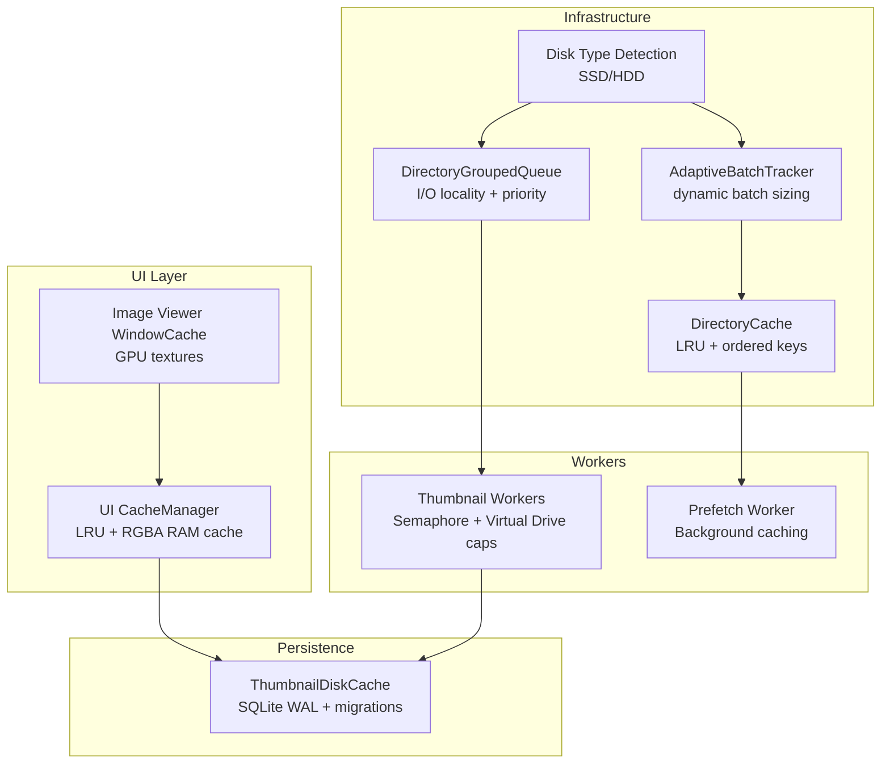
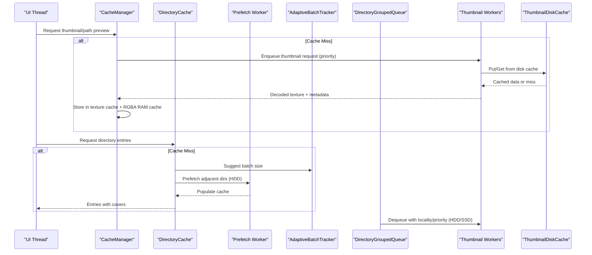
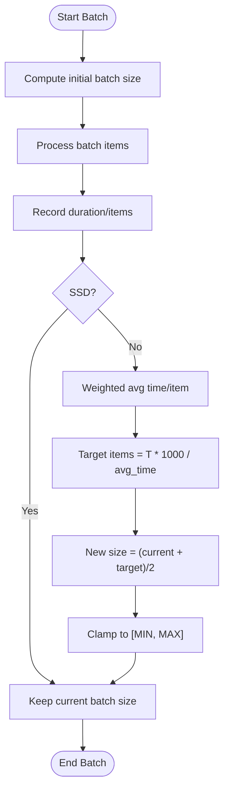
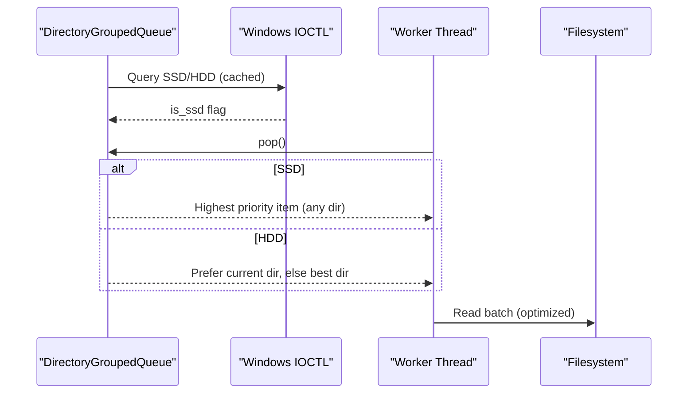
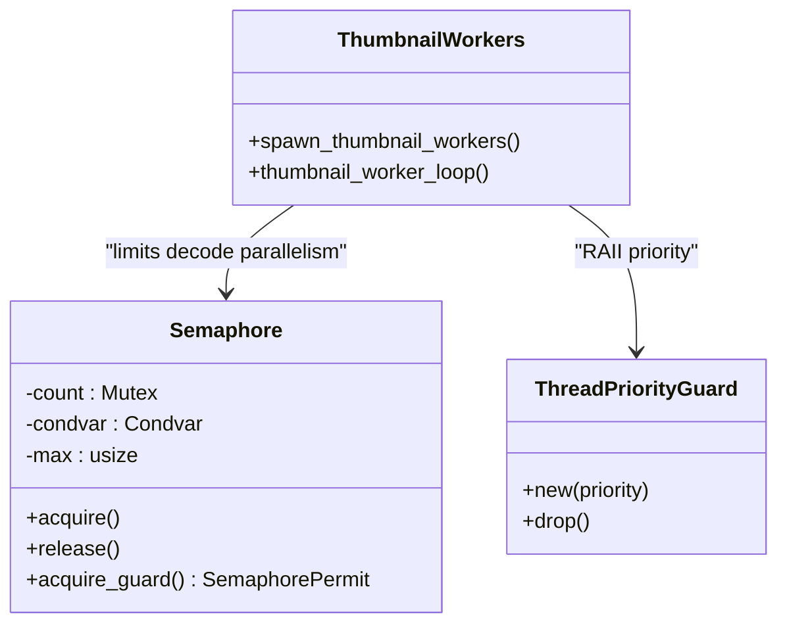
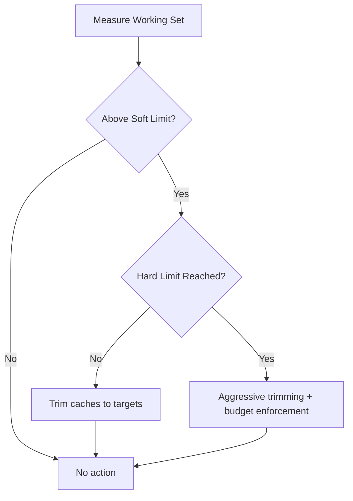
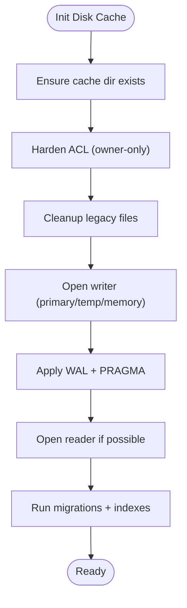
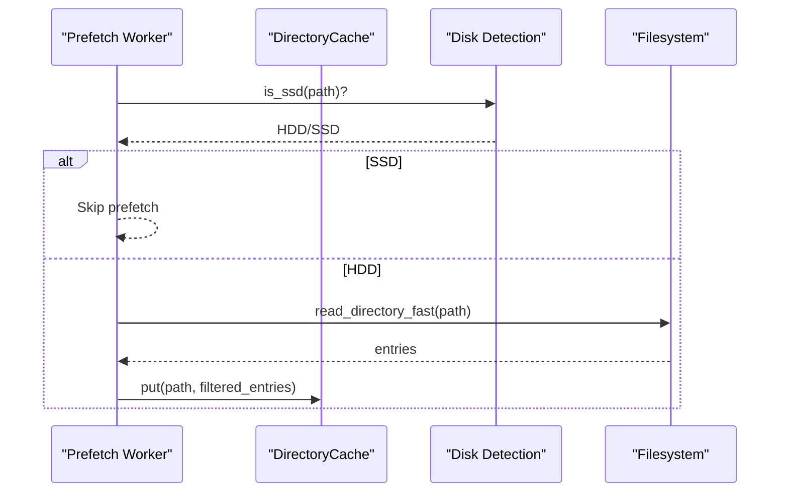
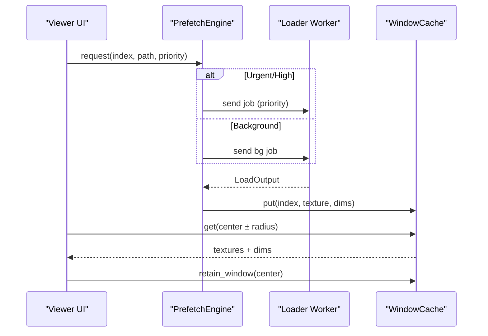
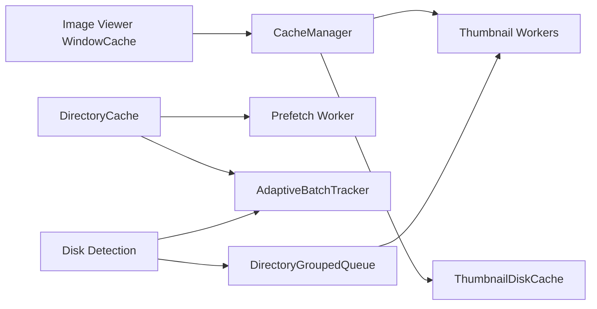

# Cache Optimization & Performance

<cite>
**Referenced Files in This Document**
- [adaptive_batch.rs](file://src/infrastructure/adaptive_batch.rs)
- [cache.rs](file://src/ui/cache.rs)
- [disk_cache.rs](file://src/infrastructure/disk_cache.rs)
- [directory_cache.rs](file://src/infrastructure/directory_cache.rs)
- [grouped_queue.rs](file://src/infrastructure/io_priority/grouped_queue.rs)
- [threading.rs](file://src/infrastructure/io_priority/threading.rs)
- [detection.rs](file://src/infrastructure/io_priority/detection.rs)
- [prefetch_worker.rs](file://src/workers/prefetch_worker.rs)
- [worker.rs](file://src/workers/thumbnail/worker.rs)
- [cache.rs](file://src/image_viewer/cache.rs)
- [09_performance_optimizations.md](file://docs/09_performance_optimizations.md)
- [helpers.rs](file://src/app/state/helpers.rs)
</cite>

## Table of Contents
1. [Introduction](#introduction)
2. [Project Structure](#project-structure)
3. [Core Components](#core-components)
4. [Architecture Overview](#architecture-overview)
5. [Detailed Component Analysis](#detailed-component-analysis)
6. [Dependency Analysis](#dependency-analysis)
7. [Performance Considerations](#performance-considerations)
8. [Troubleshooting Guide](#troubleshooting-guide)
9. [Conclusion](#conclusion)
10. [Appendices](#appendices)

## Introduction
This document explains cache optimization and performance tuning in MTT File Manager with a focus on:
- Adaptive batch processing to reduce I/O overhead and maintain UI responsiveness
- I/O priority management to balance cache operations with user interactions
- Threading patterns for concurrent access and thread safety
- Cache sizing algorithms, memory pressure handling, and dynamic resource allocation
- Performance monitoring, cache efficiency metrics, and bottleneck identification
- Configuration guidelines for different usage scenarios and hardware
- Troubleshooting common cache-related performance issues

## Project Structure
Key cache and performance-critical modules:
- UI texture and icon cache with LRU and RAM-backed layers
- Disk-backed thumbnail cache with SQLite and WAL mode
- Directory cache for fast folder navigation
- Adaptive batch loader for folder scanning
- I/O priority queues and thread priority management
- Thumbnail pipeline with concurrency limits and virtual drive handling
- Image viewer sliding-window GPU cache
- Memory maintenance and restore-from-idle optimizations

**Diagram sources**
- [cache.rs:50-136](file://src/ui/cache.rs#L50-L136)
- [disk_cache.rs:67-176](file://src/infrastructure/disk_cache.rs#L67-L176)
- [directory_cache.rs:39-142](file://src/infrastructure/directory_cache.rs#L39-L142)
- [adaptive_batch.rs:34-81](file://src/infrastructure/adaptive_batch.rs#L34-L81)
- [grouped_queue.rs:8-56](file://src/infrastructure/io_priority/grouped_queue.rs#L8-L56)
- [detection.rs:52-70](file://src/infrastructure/io_priority/detection.rs#L52-L70)
- [worker.rs:103-169](file://src/workers/thumbnail/worker.rs#L103-L169)
- [prefetch_worker.rs:17-71](file://src/workers/prefetch_worker.rs#L17-L71)
- [cache.rs:46-106](file://src/image_viewer/cache.rs#L46-L106)

**Section sources**
- [09_performance_optimizations.md:1-181](file://docs/09_performance_optimizations.md#L1-L181)

## Core Components
- UI CacheManager: LRU caches for textures/icons, folder previews, and an RGBA RAM cache to accelerate re-uploads and reduce disk I/O on HDDs. It exposes dynamic resizing and trimming APIs.
- Disk Cache: SQLite-backed thumbnail and folder preview cache with WAL mode, PRAGMA tuning, and migrations. Supports fallback connections and ACL hardening.
- Directory Cache: Bounded LRU cache of directory entries with ordered keys for subtree invalidation and fast back/forward navigation.
- Adaptive Batch Loader: Computes initial and dynamic batch sizes based on SSD/HDD and observed per-item latency.
- I/O Priority Queue: Groups requests by directory for HDD locality and selects by priority for SSDs.
- Disk Type Detection: Drive-letter cache with Windows IOCTL queries and virtual drive overrides.
- Thumbnail Workers: Concurrency-limited pipeline with background thread priority and virtual drive caps.
- Prefetch Worker: Background caching of adjacent directories on HDDs, skipped on SSDs.
- Image Viewer WindowCache: Sliding-window GPU texture cache with bounded channels and center-aware skipping.

**Section sources**
- [cache.rs:50-136](file://src/ui/cache.rs#L50-L136)
- [disk_cache.rs:67-176](file://src/infrastructure/disk_cache.rs#L67-L176)
- [directory_cache.rs:39-142](file://src/infrastructure/directory_cache.rs#L39-L142)
- [adaptive_batch.rs:13-81](file://src/infrastructure/adaptive_batch.rs#L13-L81)
- [grouped_queue.rs:8-56](file://src/infrastructure/io_priority/grouped_queue.rs#L8-L56)
- [detection.rs:52-70](file://src/infrastructure/io_priority/detection.rs#L52-L70)
- [worker.rs:103-169](file://src/workers/thumbnail/worker.rs#L103-L169)
- [prefetch_worker.rs:17-71](file://src/workers/prefetch_worker.rs#L17-L71)
- [cache.rs:46-106](file://src/image_viewer/cache.rs#L46-L106)

## Architecture Overview
The cache system integrates UI, worker, and persistence layers:
- UI CacheManager coordinates texture/icon/folder-preview caches and an RGBA RAM layer.
- DirectoryCache reduces repeated filesystem reads; PrefetchWorker proactively warms it on HDDs.
- AdaptiveBatchTracker balances batch sizes to keep UI responsive.
- I/O Priority Queue optimizes HDD seek behavior and prioritizes work.
- Thumbnail Workers feed UI textures and persist results to Disk Cache.
- Image Viewer WindowCache minimizes CPU residency and VRAM churn.

**Diagram sources**
- [cache.rs:138-224](file://src/ui/cache.rs#L138-L224)
- [directory_cache.rs:50-95](file://src/infrastructure/directory_cache.rs#L50-L95)
- [adaptive_batch.rs:40-81](file://src/infrastructure/adaptive_batch.rs#L40-L81)
- [grouped_queue.rs:45-56](file://src/infrastructure/io_priority/grouped_queue.rs#L45-L56)
- [worker.rs:232-287](file://src/workers/thumbnail/worker.rs#L232-L287)
- [disk_cache.rs:67-176](file://src/infrastructure/disk_cache.rs#L67-L176)
- [prefetch_worker.rs:26-64](file://src/workers/prefetch_worker.rs#L26-L64)

## Detailed Component Analysis

### Adaptive Batch Processing
- Initial batch sizing considers SSD vs HDD and total item count to improve time-to-first items on SSDs and throughput on HDDs.
- Dynamic adjustment maintains a target latency window by weighting recent samples and converging toward a stable batch size.

**Diagram sources**
- [adaptive_batch.rs:13-81](file://src/infrastructure/adaptive_batch.rs#L13-L81)

**Section sources**
- [adaptive_batch.rs:13-81](file://src/infrastructure/adaptive_batch.rs#L13-L81)
- [09_performance_optimizations.md:140-145](file://docs/09_performance_optimizations.md#L140-L145)

### I/O Priority Management and HDD Locality
- Disk type detection caches drive-letter classifications and defaults to SSD for unknown devices to avoid stalls.
- DirectoryGroupedQueue groups by parent directory for HDD locality and selects highest priority within a directory or globally for SSDs.
- ThreadPriorityGuard sets worker threads to background mode to reduce HDD contention.

**Diagram sources**
- [detection.rs:52-70](file://src/infrastructure/io_priority/detection.rs#L52-L70)
- [grouped_queue.rs:45-101](file://src/infrastructure/io_priority/grouped_queue.rs#L45-L101)
- [threading.rs:10-38](file://src/infrastructure/io_priority/threading.rs#L10-L38)

**Section sources**
- [detection.rs:52-70](file://src/infrastructure/io_priority/detection.rs#L52-L70)
- [grouped_queue.rs:45-101](file://src/infrastructure/io_priority/grouped_queue.rs#L45-L101)
- [threading.rs:10-38](file://src/infrastructure/io_priority/threading.rs#L10-L38)
- [09_performance_optimizations.md:100-110](file://docs/09_performance_optimizations.md#L100-L110)

### Threading Patterns and Concurrency Control
- Thumbnail workers spawn a CPU-adaptive count with decode parallelism tightly capped to control peak RAM.
- A custom Semaphore limits concurrent decode operations; a second semaphore limits virtual drive bulk scans to prevent driver overload.
- ThreadPriorityGuard ensures background priority for worker threads.

**Diagram sources**
- [worker.rs:29-77](file://src/workers/thumbnail/worker.rs#L29-L77)
- [worker.rs:103-169](file://src/workers/thumbnail/worker.rs#L103-L169)
- [worker.rs:192-289](file://src/workers/thumbnail/worker.rs#L192-L289)

**Section sources**
- [worker.rs:85-100](file://src/workers/thumbnail/worker.rs#L85-L100)
- [worker.rs:117-122](file://src/workers/thumbnail/worker.rs#L117-L122)
- [worker.rs:227-230](file://src/workers/thumbnail/worker.rs#L227-L230)

### UI Cache and Memory Pressure Handling
- CacheManager uses LRU caches for textures, icons, and folder previews, plus an RGBA RAM cache keyed by PathBuf to accelerate re-uploads.
- Dynamic capacity tuning and trimming APIs enable runtime adjustments to meet performance goals.
- Memory maintenance routines monitor working set and trim caches aggressively when exceeding hard limits, with burst-mode allowances after restore.

**Diagram sources**
- [cache.rs:261-312](file://src/ui/cache.rs#L261-L312)
- [helpers.rs:77-107](file://src/app/state/helpers.rs#L77-L107)

**Section sources**
- [cache.rs:50-136](file://src/ui/cache.rs#L50-L136)
- [cache.rs:261-312](file://src/ui/cache.rs#L261-L312)
- [helpers.rs:77-107](file://src/app/state/helpers.rs#L77-L107)

### Disk Cache and Persistence
- ThumbnailDiskCache initializes two connections (writer and reader), applies WAL and PRAGMA tuning, and supports migrations and index creation.
- ACL hardening secures the cache directory; fallback connections are used when primary paths fail.
- Efficient directory clearing relies on a path index.

**Diagram sources**
- [disk_cache.rs:75-176](file://src/infrastructure/disk_cache.rs#L75-L176)

**Section sources**
- [disk_cache.rs:67-176](file://src/infrastructure/disk_cache.rs#L67-L176)

### Directory Cache and Prefetch
- DirectoryCache stores entries with timestamps and maintains ordered keys for subtree invalidation.
- PrefetchWorker warms adjacent directories on HDDs, skipping SSDs, and filters out hidden/system entries.

**Diagram sources**
- [directory_cache.rs:74-95](file://src/infrastructure/directory_cache.rs#L74-L95)
- [prefetch_worker.rs:26-64](file://src/workers/prefetch_worker.rs#L26-L64)
- [detection.rs:52-70](file://src/infrastructure/io_priority/detection.rs#L52-L70)

**Section sources**
- [directory_cache.rs:39-142](file://src/infrastructure/directory_cache.rs#L39-L142)
- [prefetch_worker.rs:17-71](file://src/workers/prefetch_worker.rs#L17-L71)

### Image Viewer Sliding-Window Cache
- WindowCache stores GPU TextureHandles with original resolution metadata and retains only a sliding window around the current index.
- PrefetchEngine uses bounded channels, urgent/high/background queues, and center-aware skipping to avoid decoding irrelevant frames.

**Diagram sources**
- [cache.rs:108-307](file://src/image_viewer/cache.rs#L108-L307)

**Section sources**
- [cache.rs:46-106](file://src/image_viewer/cache.rs#L46-L106)
- [cache.rs:108-307](file://src/image_viewer/cache.rs#L108-L307)

## Dependency Analysis
- UI CacheManager depends on disk cache for persistence and on the thumbnail pipeline for uploads.
- DirectoryCache integrates with AdaptiveBatchTracker and PrefetchWorker to reduce repeated reads.
- I/O Priority Queue depends on Disk Type Detection and influences worker scheduling.
- Thumbnail Workers depend on Disk Cache and respect I/O priority and virtual drive constraints.
- Image Viewer WindowCache depends on UI CacheManager for texture availability.

**Diagram sources**
- [cache.rs:50-136](file://src/ui/cache.rs#L50-L136)
- [disk_cache.rs:67-176](file://src/infrastructure/disk_cache.rs#L67-L176)
- [directory_cache.rs:39-142](file://src/infrastructure/directory_cache.rs#L39-L142)
- [adaptive_batch.rs:34-81](file://src/infrastructure/adaptive_batch.rs#L34-L81)
- [grouped_queue.rs:8-56](file://src/infrastructure/io_priority/grouped_queue.rs#L8-L56)
- [detection.rs:52-70](file://src/infrastructure/io_priority/detection.rs#L52-L70)
- [worker.rs:103-169](file://src/workers/thumbnail/worker.rs#L103-L169)
- [prefetch_worker.rs:17-71](file://src/workers/prefetch_worker.rs#L17-L71)
- [cache.rs:46-106](file://src/image_viewer/cache.rs#L46-L106)

**Section sources**
- [09_performance_optimizations.md:1-181](file://docs/09_performance_optimizations.md#L1-L181)

## Performance Considerations
- UI responsiveness: Adaptive batching and I/O locality prevent UI stalls on HDDs; background priority for workers reduces interference.
- Memory efficiency: UI cache trimming and aggressive memory maintenance keep working set bounded; RGBA RAM cache reduces repeated disk I/O.
- Throughput: Disk cache with WAL and PRAGMA tuning improves concurrency; prefetching on HDDs reduces latency.
- GPU/VRAM: Sliding-window viewer cache avoids holding large CPU buffers; VRAM estimation helps bound GPU memory.
- Restore-from-idle: Burst mode and delayed texture flushes optimize recovery after OS paging.

[No sources needed since this section provides general guidance]

## Troubleshooting Guide
Common cache-related performance issues and solutions:
- Thumbnails appear late or stutter:
  - Verify I/O priority is applied to worker threads and that SSD detection is accurate.
  - Confirm AdaptiveBatchTracker is adjusting batch sizes and that prefetch worker is active on HDDs.
  - Check that decode semaphore limits are appropriate for your CPU count.
- High memory usage:
  - Trigger memory maintenance to trim caches and enforce RGBA budget.
  - Reduce UI cache sizes or increase trimming targets during bursts.
- Slow directory browsing:
  - Ensure DirectoryCache is populated; verify PrefetchWorker is running and not blocked by virtual drive caps.
  - Confirm AdaptiveBatchTracker is increasing batch size gradually for large folders.
- Disk cache errors or corruption:
  - Review ACL hardening and fallback connection logs; ensure migrations ran successfully.
  - Validate path index presence for efficient directory clearing.

**Section sources**
- [helpers.rs:77-107](file://src/app/state/helpers.rs#L77-L107)
- [worker.rs:117-122](file://src/workers/thumbnail/worker.rs#L117-L122)
- [prefetch_worker.rs:26-64](file://src/workers/prefetch_worker.rs#L26-L64)
- [adaptive_batch.rs:49-76](file://src/infrastructure/adaptive_batch.rs#L49-L76)
- [disk_cache.rs:104-176](file://src/infrastructure/disk_cache.rs#L104-L176)

## Conclusion
MTT File Manager’s cache system combines adaptive batching, I/O priority management, and layered caching (UI, RAM, disk) to achieve responsive UI, efficient I/O, and robust memory control. Workers are constrained to avoid resource saturation, while caches are trimmed under memory pressure. These techniques deliver strong performance across SSDs and HDDs and scale with varying workloads.

[No sources needed since this section summarizes without analyzing specific files]

## Appendices

### Configuration Guidelines
- SSD vs HDD:
  - SSD: Larger initial batches and background prefetch disabled; prioritize interactive and prefetch priorities.
  - HDD: Smaller initial batches, directory grouping, and prefetch enabled; lower worker priority.
- UI cache sizing:
  - Adjust TextureCacheConfig.max_size to balance UI responsiveness and memory usage; use dynamic retuning during bursts.
  - Tune RGBA RAM budget to reduce repeated disk reads on HDDs.
- Worker concurrency:
  - Accept computed worker counts; adjust decode limits if encountering memory spikes on high-core systems.
  - Keep virtual drive semaphore at 1 for stability under bulk scans.
- Disk cache:
  - Ensure ACL hardening succeeds; monitor fallback connections and migration logs.
- Restore-from-idle:
  - Allow burst mode to recover quickly; avoid throttling watcher batches post-restore.

**Section sources**
- [adaptive_batch.rs:13-25](file://src/infrastructure/adaptive_batch.rs#L13-L25)
- [grouped_queue.rs:45-56](file://src/infrastructure/io_priority/grouped_queue.rs#L45-L56)
- [worker.rs:85-100](file://src/workers/thumbnail/worker.rs#L85-L100)
- [disk_cache.rs:104-176](file://src/infrastructure/disk_cache.rs#L104-L176)
- [09_performance_optimizations.md:172-181](file://docs/09_performance_optimizations.md#L172-L181)