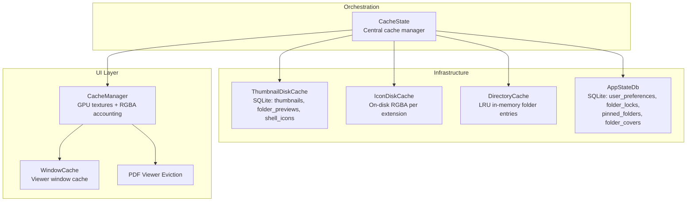
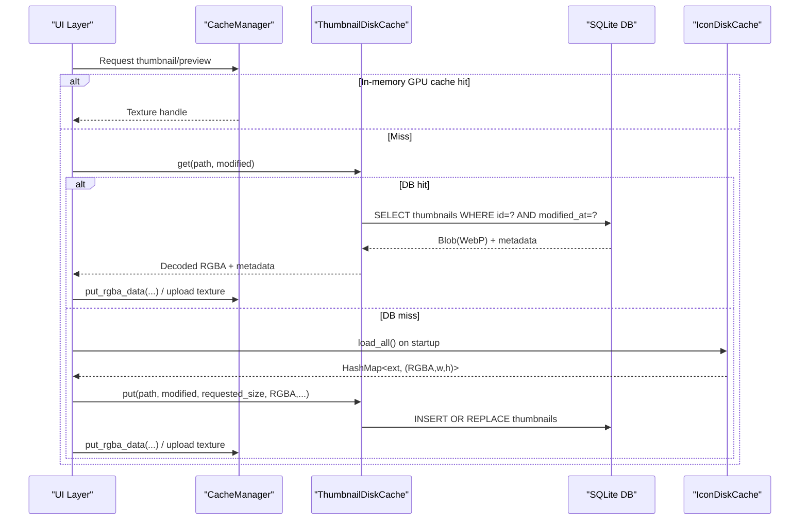
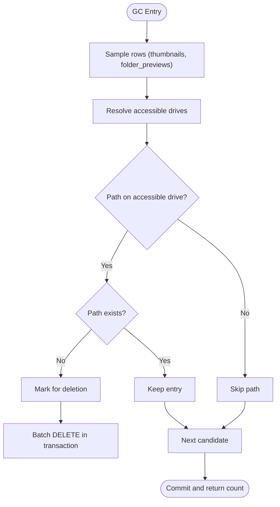
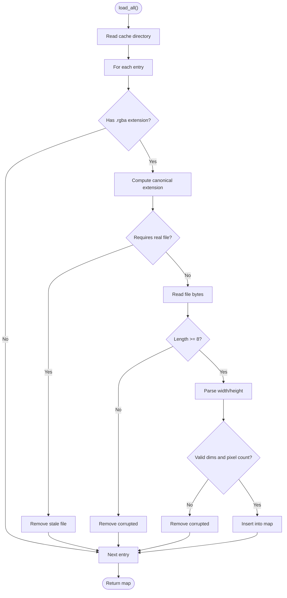
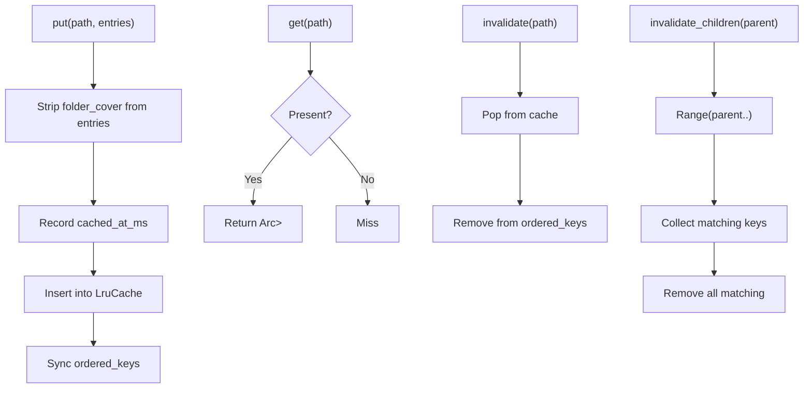
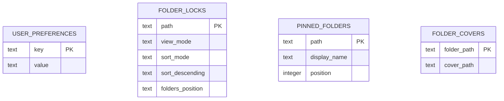
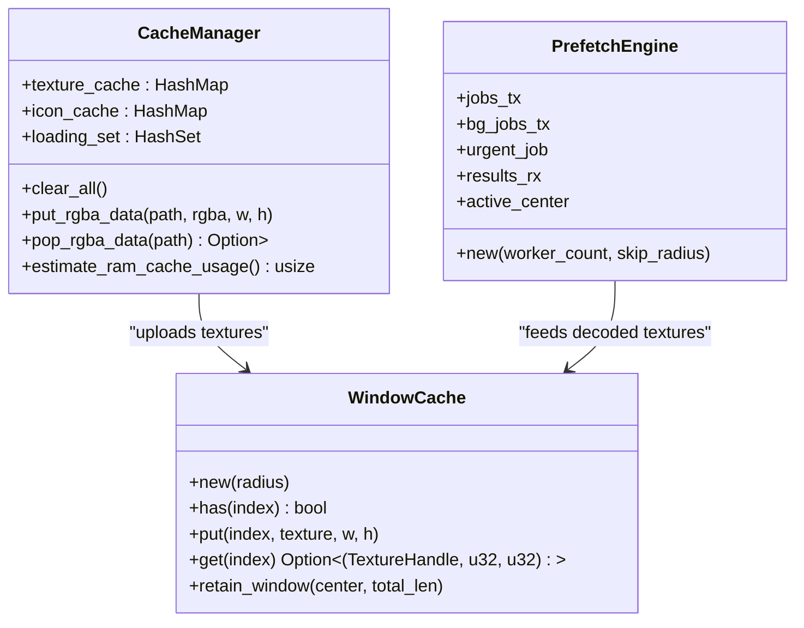
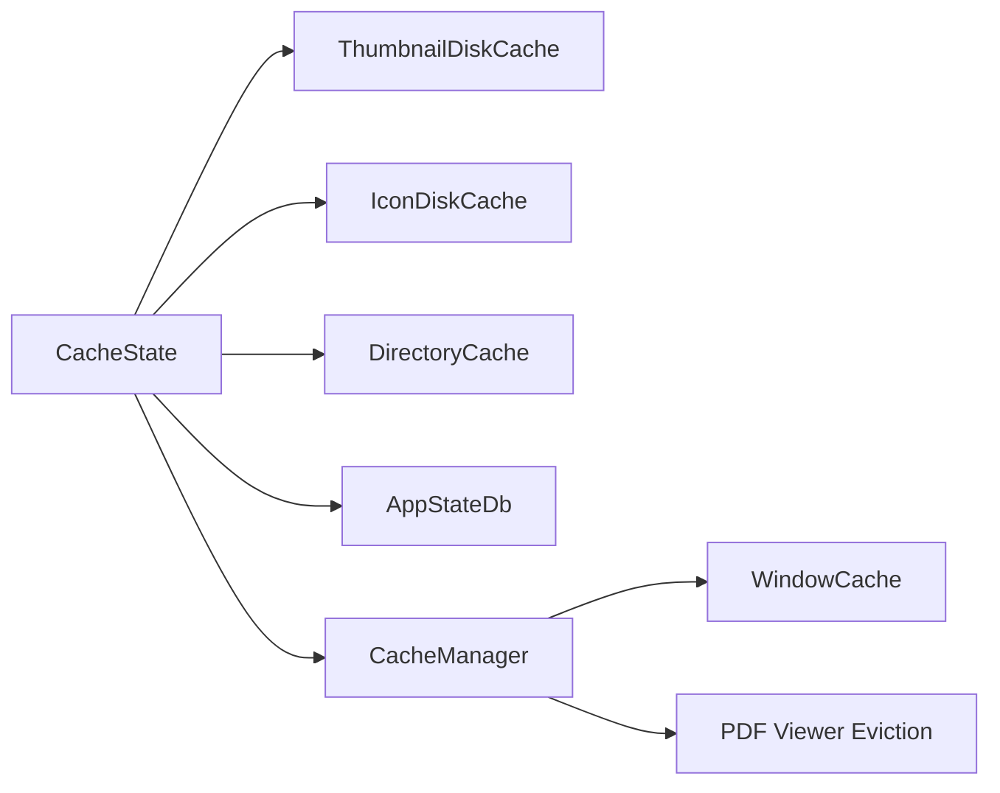

# Data Storage & Caching

<cite>
**Referenced Files in This Document**
- [disk_cache.rs](file://src/infrastructure/disk_cache.rs)
- [thumbnails_repo.rs](file://src/infrastructure/disk_cache/thumbnails_repo.rs)
- [folder_previews.rs](file://src/infrastructure/disk_cache/folder_previews.rs)
- [shell_icons.rs](file://src/infrastructure/disk_cache/shell_icons.rs)
- [cleanup.rs](file://src/infrastructure/disk_cache/cleanup.rs)
- [gc.rs](file://src/infrastructure/disk_cache/gc.rs)
- [icon_disk_cache.rs](file://src/infrastructure/icon_disk_cache.rs)
- [directory_cache.rs](file://src/infrastructure/directory_cache.rs)
- [app_state_db/mod.rs](file://src/infrastructure/app_state_db/mod.rs)
- [preferences.rs](file://src/infrastructure/app_state_db/preferences.rs)
- [pinned_folders.rs](file://src/infrastructure/app_state_db/pinned_folders.rs)
- [folder_locks.rs](file://src/infrastructure/app_state_db/folder_locks.rs)
- [folder_covers.rs](file://src/infrastructure/app_state_db/folder_covers.rs)
- [cache_state.rs](file://src/app/cache_state.rs)
- [cache.rs](file://src/ui/cache.rs)
- [image_viewer/cache.rs](file://src/image_viewer/cache.rs)
- [viewer_app.rs](file://src/pdf_viewer/viewer_app.rs)
</cite>

## Table of Contents
1. [Introduction](#introduction)
2. [Project Structure](#project-structure)
3. [Core Components](#core-components)
4. [Architecture Overview](#architecture-overview)
5. [Detailed Component Analysis](#detailed-component-analysis)
6. [Dependency Analysis](#dependency-analysis)
7. [Performance Considerations](#performance-considerations)
8. [Troubleshooting Guide](#troubleshooting-guide)
9. [Conclusion](#conclusion)

## Introduction
This document explains MTT File Manager’s multi-level caching strategy and persistent storage systems. It covers:
- Memory caches (in-process LRU and GPU texture caches)
- Disk caches (SQLite-backed thumbnails and folder previews, and a separate on-disk RGBA cache for file icons)
- Application state persistence (preferences, pinned folders, folder locks, and folder covers)
- Garbage collection and cleanup strategies
- Cache invalidation, performance optimizations, and storage management
- Configuration hooks for cache sizing, cleanup policies, and storage locations

## Project Structure
The caching and storage subsystems are organized by responsibility:
- Infrastructure-level disk caches and app state DBs
- UI-level GPU texture and RGBA memory caches
- Directory metadata cache for efficient file system access
- Central cache state orchestrator

**Diagram sources**
- [cache_state.rs:24-66](file://src/app/cache_state.rs#L24-L66)
- [disk_cache.rs:67-176](file://src/infrastructure/disk_cache.rs#L67-L176)
- [icon_disk_cache.rs:17-122](file://src/infrastructure/icon_disk_cache.rs#L17-L122)
- [directory_cache.rs:39-136](file://src/infrastructure/directory_cache.rs#L39-L136)
- [app_state_db/mod.rs:25-115](file://src/infrastructure/app_state_db/mod.rs#L25-L115)
- [cache.rs:562-582](file://src/ui/cache.rs#L562-L582)
- [image_viewer/cache.rs:46-125](file://src/image_viewer/cache.rs#L46-L125)
- [viewer_app.rs:245-260](file://src/pdf_viewer/viewer_app.rs#L245-L260)

**Section sources**
- [cache_state.rs:24-66](file://src/app/cache_state.rs#L24-L66)

## Core Components
- ThumbnailDiskCache: SQLite-backed cache for thumbnails and folder previews; supports safe fallback connections, migrations, and robust cleanup.
- IconDiskCache: On-disk RGBA cache keyed by canonical file extension for instant icon population.
- DirectoryCache: LRU cache of parsed folder entries to avoid repeated filesystem reads.
- AppStateDb: SQLite-backed store for user preferences, pinned folders, folder locks, and folder covers.
- CacheManager (UI): Tracks GPU textures and RGBA memory footprint for eviction and budgeting.
- WindowCache (image viewer): Per-viewer windowed cache of decoded textures with prefetch and eviction.
- PDF Viewer Eviction: Budget-aware eviction around the current page index.

**Section sources**
- [disk_cache.rs:67-176](file://src/infrastructure/disk_cache.rs#L67-L176)
- [icon_disk_cache.rs:17-122](file://src/infrastructure/icon_disk_cache.rs#L17-L122)
- [directory_cache.rs:39-136](file://src/infrastructure/directory_cache.rs#L39-L136)
- [app_state_db/mod.rs:25-115](file://src/infrastructure/app_state_db/mod.rs#L25-L115)
- [cache.rs:562-582](file://src/ui/cache.rs#L562-L582)
- [image_viewer/cache.rs:46-125](file://src/image_viewer/cache.rs#L46-L125)
- [viewer_app.rs:245-260](file://src/pdf_viewer/viewer_app.rs#L245-L260)

## Architecture Overview
The system uses a layered approach:
- UI layer maintains GPU and RGBA memory caches with budgeting and windowed eviction.
- Infrastructure layer persists thumbnails, folder previews, shell icons, and app state in SQLite with WAL and PRAGMA tuning.
- A separate on-disk cache stores extension-based icons as RGBA blobs for quick startup.
- DirectoryCache reduces filesystem overhead by caching parsed entries with invalidation via watchers and mtime checks.

**Diagram sources**
- [thumbnails_repo.rs:16-85](file://src/infrastructure/disk_cache/thumbnails_repo.rs#L16-L85)
- [thumbnails_repo.rs:87-175](file://src/infrastructure/disk_cache/thumbnails_repo.rs#L87-L175)
- [shell_icons.rs:15-67](file://src/infrastructure/disk_cache/shell_icons.rs#L15-L67)
- [icon_disk_cache.rs:27-96](file://src/infrastructure/icon_disk_cache.rs#L27-L96)
- [cache.rs:562-582](file://src/ui/cache.rs#L562-L582)

## Detailed Component Analysis

### Disk Cache: Thumbnails, Folder Previews, Shell Icons (SQLite)
- Dual connection model: writer and reader connections, with WAL mode and PRAGMA tuning for concurrency and performance.
- Tables:
  - thumbnails: id, path, data (WebP), modified_at, created_at, width, height, requested_size
  - folder_previews: folder_path, data (WebP), width, height, created_at
  - shell_icons: key, data (raw RGBA), width, height, created_at
- Operations:
  - get/get_latest: fetch thumbnails with optional mtime matching
  - put: resize, compress to WebP (lossy), insert OR REPLACE
  - get_folder_preview_cache/put_folder_preview_cache: WebP roundtrip with header validation
  - get_shell_icon/put_shell_icon: raw RGBA storage for special shell icons
  - remove_cache_for_path: batch delete for a path and subtree
  - garbage_collect_incremental/full: orphan detection with accessibility checks and batch deletes
  - run_vacuum: explicit VACUUM for defragmentation

**Diagram sources**
- [gc.rs:84-192](file://src/infrastructure/disk_cache/gc.rs#L84-L192)
- [gc.rs:203-296](file://src/infrastructure/disk_cache/gc.rs#L203-L296)

**Section sources**
- [disk_cache.rs:67-176](file://src/infrastructure/disk_cache.rs#L67-L176)
- [thumbnails_repo.rs:16-85](file://src/infrastructure/disk_cache/thumbnails_repo.rs#L16-L85)
- [thumbnails_repo.rs:87-175](file://src/infrastructure/disk_cache/thumbnails_repo.rs#L87-L175)
- [folder_previews.rs:6-118](file://src/infrastructure/disk_cache/folder_previews.rs#L6-L118)
- [shell_icons.rs:12-99](file://src/infrastructure/disk_cache/shell_icons.rs#L12-L99)
- [cleanup.rs:4-44](file://src/infrastructure/disk_cache/cleanup.rs#L4-L44)
- [gc.rs:5-298](file://src/infrastructure/disk_cache/gc.rs#L5-L298)

### Disk Cache: Extension-Based File Icons (On-Disk RGBA)
- Purpose: Persist extracted RGBA icons keyed by canonical extension to avoid repeated SHGetFileInfoW calls.
- Format: {ext}.rgba with little-endian u32 width/height followed by pixel data.
- Behavior:
  - load_all: reads all .rgba files, validates header/format, discards stale or invalid entries
  - save: writes canonical-keyed files, avoids overwrites if already present

**Diagram sources**
- [icon_disk_cache.rs:27-96](file://src/infrastructure/icon_disk_cache.rs#L27-L96)

**Section sources**
- [icon_disk_cache.rs:17-122](file://src/infrastructure/icon_disk_cache.rs#L17-L122)

### Directory Cache (LRU Metadata)
- Stores parsed FileEntry vectors for folders with timestamps.
- Invalidation:
  - invalidate(path): drop exact path
  - invalidate_children(parent): drop all descendants efficiently using ordered keys
  - DriveWatcher and mtime validation trigger invalidation in fast paths
- Stats: total items and combined entry count for monitoring.

**Diagram sources**
- [directory_cache.rs:74-136](file://src/infrastructure/directory_cache.rs#L74-L136)

**Section sources**
- [directory_cache.rs:39-136](file://src/infrastructure/directory_cache.rs#L39-L136)

### Application State DB (Preferences, Pinned Folders, Folder Locks, Folder Covers)
- Tables:
  - user_preferences: key, value
  - folder_locks: path (PK), view_mode, sort_mode, sort_descending, folders_position
  - pinned_folders: path (PK), display_name, position
  - folder_covers: folder_path (PK), cover_path
- Features:
  - Dual connections with WAL and PRAGMA tuning
  - Batch writes for preferences with immediate transaction attempts
  - Lazy existence checks for folder covers on virtual drives
  - Robust migrations and schema updates

**Diagram sources**
- [app_state_db/mod.rs:117-167](file://src/infrastructure/app_state_db/mod.rs#L117-L167)

**Section sources**
- [app_state_db/mod.rs:25-115](file://src/infrastructure/app_state_db/mod.rs#L25-L115)
- [preferences.rs:4-91](file://src/infrastructure/app_state_db/preferences.rs#L4-L91)
- [pinned_folders.rs:5-75](file://src/infrastructure/app_state_db/pinned_folders.rs#L5-L75)
- [folder_locks.rs:7-125](file://src/infrastructure/app_state_db/folder_locks.rs#L7-L125)
- [folder_covers.rs:4-98](file://src/infrastructure/app_state_db/folder_covers.rs#L4-L98)

### UI GPU and RGBA Caches
- CacheManager:
  - Maintains GPU texture cache and an RGBA memory accounting mechanism
  - Supports clear_all, put_rgba_data, pop_rgba_data, estimate_ram_cache_usage
- WindowCache (image viewer):
  - Stores decoded textures with original dimensions
  - Retains a sliding window around the current index and evicts out-of-window entries
- PDF Viewer eviction:
  - Maintains a radius around the current page and drops textures outside budget

**Diagram sources**
- [cache.rs:562-582](file://src/ui/cache.rs#L562-L582)
- [image_viewer/cache.rs:46-125](file://src/image_viewer/cache.rs#L46-L125)

**Section sources**
- [cache.rs:562-582](file://src/ui/cache.rs#L562-L582)
- [image_viewer/cache.rs:46-125](file://src/image_viewer/cache.rs#L46-L125)
- [viewer_app.rs:245-260](file://src/pdf_viewer/viewer_app.rs#L245-L260)

## Dependency Analysis
- CacheState orchestrates all caches and databases, constructing them with environment-derived paths and handling fatal initialization failures.
- ThumbnailDiskCache and AppStateDb both use dual connections and PRAGMA tuning for concurrency and durability.
- DirectoryCache depends on FileEntry and integrates with watchers and fast-path mtime validation.
- UI caches depend on the presence of decoded data and upload to GPU; eviction is budget-driven.

**Diagram sources**
- [cache_state.rs:24-66](file://src/app/cache_state.rs#L24-L66)

**Section sources**
- [cache_state.rs:24-66](file://src/app/cache_state.rs#L24-L66)

## Performance Considerations
- SQLite concurrency:
  - WAL mode with PRAGMA tuning enables readers to coexist with writers.
  - Separate reader/writer connections reduce contention; shared reader falls back to writer when necessary.
- Compression:
  - Thumbnails and folder previews are stored as WebP (lossy) to minimize disk usage and I/O.
  - Shell icons are stored as raw RGBA since they are small and encoding/decoding overhead is not justified.
- Indexing:
  - Index on thumbnails.path accelerates directory-wide cache removals.
- Batch operations:
  - Batched DELETEs and transactions reduce fsync frequency and improve throughput.
- Budgeting and eviction:
  - UI-level budgeting and windowed eviction prevent excessive GPU and RAM usage.
  - Incremental garbage collection samples a bounded number of rows to keep overhead low.
- Virtual drive handling:
  - Lazy existence checks for folder covers on virtual/encrypted drives avoid costly per-item validations.

[No sources needed since this section provides general guidance]

## Troubleshooting Guide
- Cache initialization failures:
  - Fatal exits occur if ThumbnailDiskCache or AppStateDb fail to initialize; check directory permissions and fallback paths.
- ACL hardening warnings:
  - Directory permission hardening failures are logged; ensure the cache directories are writable and secure.
- Reader/writer sharing warnings:
  - When reader cannot be opened, the system logs a warning about shared writer connection and potential deadlocks.
- Disk cache corruption:
  - Header validation and pixel count checks prevent invalid WebP or RGBA data from being served; corrupted entries are discarded.
- GC not reclaiming space:
  - Orphan detection requires paths to be accessible; inaccessible drives (e.g., unmounted vaults) are skipped to avoid false positives.
- Frequent UI stalls:
  - Use try_set_preferences_batch and try_set_folder_cover to avoid blocking the UI thread when the writer is busy.

**Section sources**
- [cache_state.rs:24-66](file://src/app/cache_state.rs#L24-L66)
- [disk_cache.rs:104-176](file://src/infrastructure/disk_cache.rs#L104-L176)
- [folder_previews.rs:37-65](file://src/infrastructure/disk_cache/folder_previews.rs#L37-L65)
- [gc.rs:137-192](file://src/infrastructure/disk_cache/gc.rs#L137-L192)
- [preferences.rs:16-35](file://src/infrastructure/app_state_db/preferences.rs#L16-L35)
- [folder_covers.rs:70-85](file://src/infrastructure/app_state_db/folder_covers.rs#L70-L85)

## Conclusion
MTT File Manager employs a robust, layered caching strategy:
- Memory caches (LRU and GPU) keep frequently accessed metadata and visuals responsive.
- Disk caches (SQLite and on-disk RGBA) persist thumbnails, previews, and icons with careful compression and validation.
- Application state is reliably persisted with migrations and dual connections.
- Garbage collection and cleanup are designed to be safe, incremental, and respectful of virtual and encrypted drives.
- Configuration hooks exist for cache locations and batch operations, enabling tuning for diverse environments.

[No sources needed since this section summarizes without analyzing specific files]