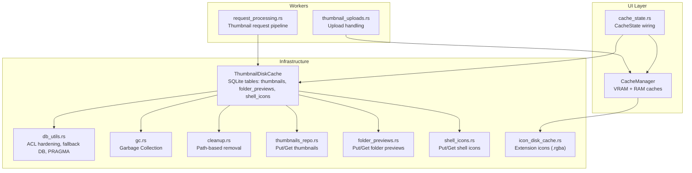
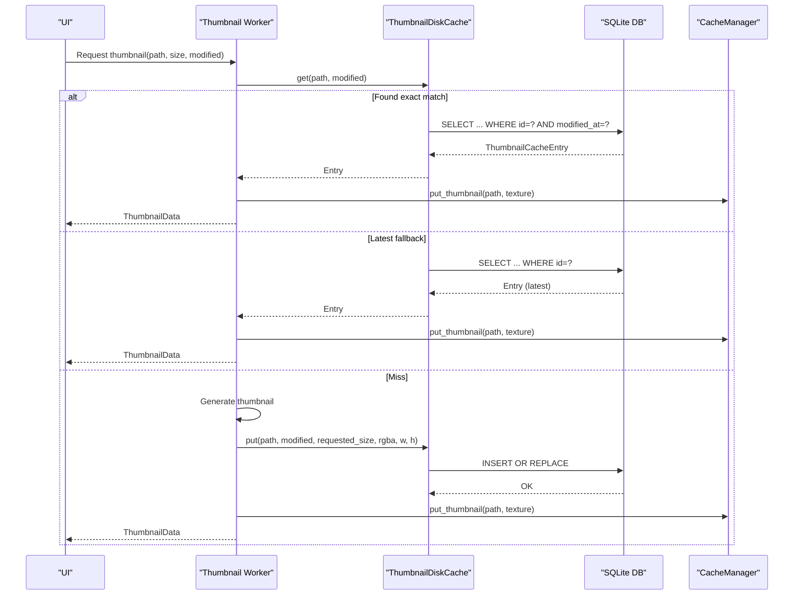
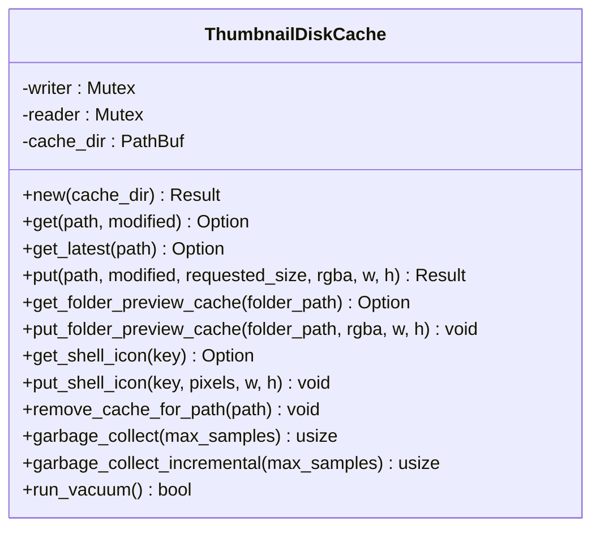
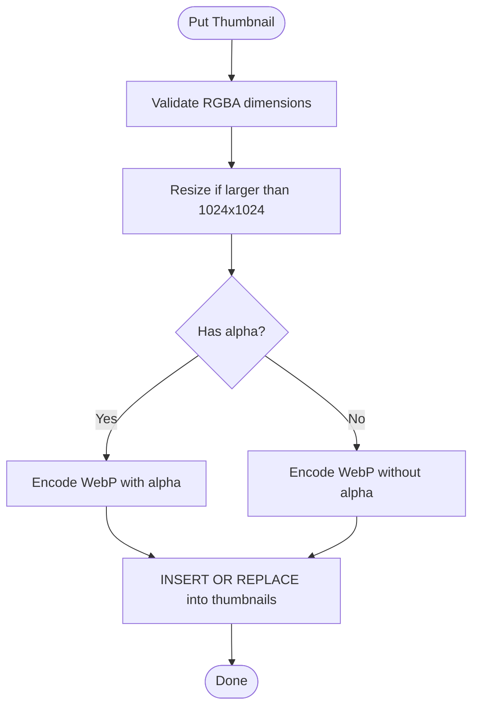
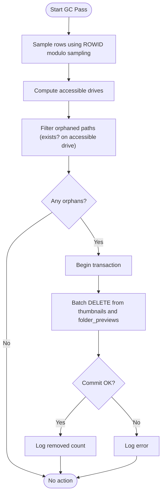
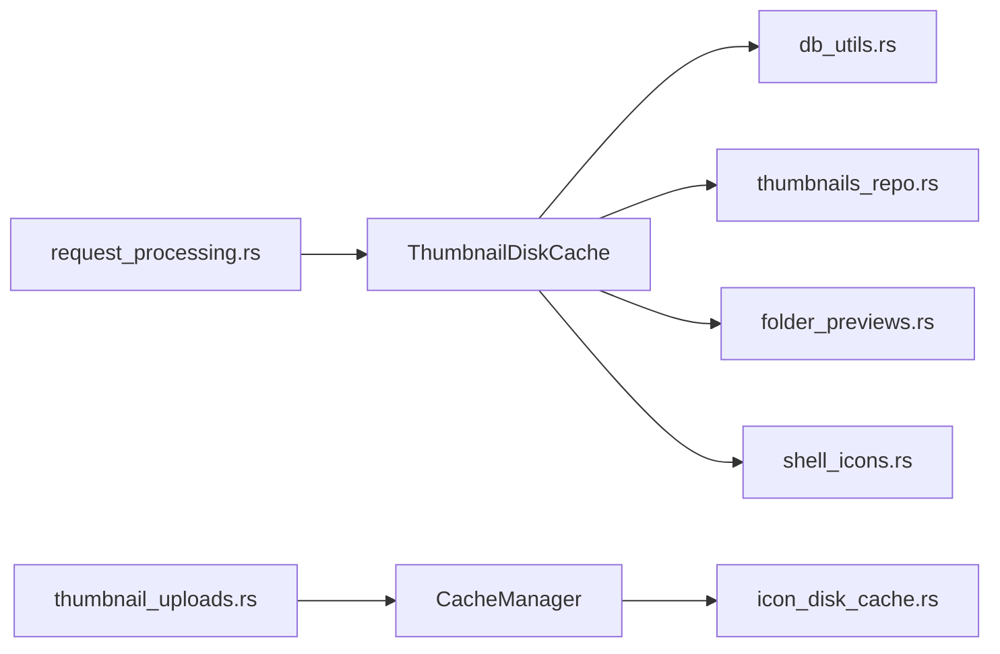

# Disk Cache Management

<cite>
**Referenced Files in This Document**
- [disk_cache.rs](file://src/infrastructure/disk_cache.rs)
- [thumbnails_repo.rs](file://src/infrastructure/disk_cache/thumbnails_repo.rs)
- [folder_previews.rs](file://src/infrastructure/disk_cache/folder_previews.rs)
- [shell_icons.rs](file://src/infrastructure/disk_cache/shell_icons.rs)
- [cleanup.rs](file://src/infrastructure/disk_cache/cleanup.rs)
- [gc.rs](file://src/infrastructure/disk_cache/gc.rs)
- [db_utils.rs](file://src/infrastructure/db_utils.rs)
- [cache.rs](file://src/ui/cache.rs)
- [cache_state.rs](file://src/app/cache_state.rs)
- [icon_disk_cache.rs](file://src/infrastructure/icon_disk_cache.rs)
- [request_processing.rs](file://src/workers/thumbnail/worker/request_processing.rs)
- [thumbnail_uploads.rs](file://src/app/operations/message_handler/thumbnail_uploads.rs)
</cite>

## Table of Contents
1. [Introduction](#introduction)
2. [Project Structure](#project-structure)
3. [Core Components](#core-components)
4. [Architecture Overview](#architecture-overview)
5. [Detailed Component Analysis](#detailed-component-analysis)
6. [Dependency Analysis](#dependency-analysis)
7. [Performance Considerations](#performance-considerations)
8. [Troubleshooting Guide](#troubleshooting-guide)
9. [Conclusion](#conclusion)
10. [Appendices](#appendices)

## Introduction
This document explains the multi-tier disk cache system for thumbnails, folder previews, and shell icons in MTT File Manager. It covers the persistent SQLite-based disk cache, the in-memory UI cache, and the integration between them. The disk cache employs LRU-like eviction via SQLite row IDs and a robust garbage collection (GC) system that detects orphaned entries and trims storage. Integrity and recovery mechanisms protect against corruption and partial failures. The document also outlines configuration options, storage organization, and performance optimizations including I/O batching and WAL mode.

## Project Structure
The disk cache is implemented as a cohesive module under the infrastructure layer with supporting utilities and UI cache integration:
- Disk cache core and tables: thumbnails, folder_previews, shell_icons
- Utilities for ACL hardening, fallback connections, and PRAGMA tuning
- UI cache manager with LRU-based memory tiers
- Worker integration for thumbnail requests and uploads
- Icon disk cache for extension-based file icons



**Diagram sources**
- [disk_cache.rs:1-264](file://src/infrastructure/disk_cache.rs#L1-L264)
- [db_utils.rs:1-198](file://src/infrastructure/db_utils.rs#L1-L198)
- [gc.rs:1-298](file://src/infrastructure/disk_cache/gc.rs#L1-L298)
- [cleanup.rs:1-45](file://src/infrastructure/disk_cache/cleanup.rs#L1-L45)
- [thumbnails_repo.rs:1-176](file://src/infrastructure/disk_cache/thumbnails_repo.rs#L1-L176)
- [folder_previews.rs:1-118](file://src/infrastructure/disk_cache/folder_previews.rs#L1-L118)
- [shell_icons.rs:1-99](file://src/infrastructure/disk_cache/shell_icons.rs#L1-L99)
- [icon_disk_cache.rs:1-124](file://src/infrastructure/icon_disk_cache.rs#L1-L124)
- [cache.rs:1-584](file://src/ui/cache.rs#L1-L584)
- [cache_state.rs:1-83](file://src/app/cache_state.rs#L1-L83)
- [request_processing.rs:34-285](file://src/workers/thumbnail/worker/request_processing.rs#L34-L285)
- [thumbnail_uploads.rs:148-176](file://src/app/operations/message_handler/thumbnail_uploads.rs#L148-L176)

**Section sources**
- [disk_cache.rs:1-264](file://src/infrastructure/disk_cache.rs#L1-L264)
- [db_utils.rs:1-198](file://src/infrastructure/db_utils.rs#L1-L198)
- [cache.rs:1-584](file://src/ui/cache.rs#L1-L584)
- [cache_state.rs:1-83](file://src/app/cache_state.rs#L1-L83)

## Core Components
- ThumbnailDiskCache: central SQLite-backed cache for thumbnails, folder previews, and shell icons. Provides reader/writer separation, migrations, and fallback connections.
- ThumbnailDiskCache methods:
  - Put/Get thumbnails with WebP encoding and dimension metadata
  - Put/Get folder previews with WebP and created_at timestamps
  - Put/Get shell icons as raw RGBA
  - Path-based cleanup and incremental/full garbage collection
- db_utils: ACL hardening, fallback DB creation, and PRAGMA setup (WAL + NORMAL synchronous)
- UI CacheManager: LRU caches for textures, folder previews, and RGBA data buffers; integrates with disk cache via worker pipeline
- IconDiskCache: on-disk extension icon cache using .rgba files

Key responsibilities:
- Disk cache: persistence, integrity, and GC
- UI cache: fast access for rendering, LRU eviction, and memory budgeting
- Integration: worker pipeline fetches from disk cache when needed and uploads results back

**Section sources**
- [disk_cache.rs:66-264](file://src/infrastructure/disk_cache.rs#L66-L264)
- [thumbnails_repo.rs:1-176](file://src/infrastructure/disk_cache/thumbnails_repo.rs#L1-L176)
- [folder_previews.rs:1-118](file://src/infrastructure/disk_cache/folder_previews.rs#L1-L118)
- [shell_icons.rs:1-99](file://src/infrastructure/disk_cache/shell_icons.rs#L1-L99)
- [db_utils.rs:147-198](file://src/infrastructure/db_utils.rs#L147-L198)
- [cache.rs:50-520](file://src/ui/cache.rs#L50-L520)
- [icon_disk_cache.rs:1-124](file://src/infrastructure/icon_disk_cache.rs#L1-L124)

## Architecture Overview
The system follows a layered design:
- Disk cache (SQLite) stores thumbnails, folder previews, and shell icons
- UI cache (memory) stores textures and RGBA data buffers for fast rendering
- Workers coordinate thumbnail requests, cache lookups, and uploads
- GC maintains disk health by removing orphaned entries and optionally vacuuming



**Diagram sources**
- [request_processing.rs:52-285](file://src/workers/thumbnail/worker/request_processing.rs#L52-L285)
- [thumbnails_repo.rs:16-175](file://src/infrastructure/disk_cache/thumbnails_repo.rs#L16-L175)
- [cache.rs:138-224](file://src/ui/cache.rs#L138-L224)

## Detailed Component Analysis

### Disk Cache Core: ThumbnailDiskCache
- Responsibilities:
  - Manage two SQLite connections: reader and writer
  - Apply PRAGMAs for concurrency and durability
  - Run schema migrations and maintain indexes
  - Provide fallback connections and ACL hardening
- Concurrency model:
  - Reader/writer split to avoid reader-writer contention
  - Fallback to shared connection when secondary reader cannot be opened
- Storage:
  - thumbnails: id, path, data (WebP), modified_at, created_at, width, height, requested_size
  - folder_previews: folder_path, data (WebP), width, height, created_at
  - shell_icons: key, data (RGBA), width, height, created_at



**Diagram sources**
- [disk_cache.rs:66-264](file://src/infrastructure/disk_cache.rs#L66-L264)
- [thumbnails_repo.rs:1-176](file://src/infrastructure/disk_cache/thumbnails_repo.rs#L1-L176)
- [folder_previews.rs:1-118](file://src/infrastructure/disk_cache/folder_previews.rs#L1-L118)
- [shell_icons.rs:1-99](file://src/infrastructure/disk_cache/shell_icons.rs#L1-L99)

**Section sources**
- [disk_cache.rs:66-264](file://src/infrastructure/disk_cache.rs#L66-L264)

### Thumbnail Persistence and Retrieval
- Hashing: stable, collision-resistant path hashing using a cryptographic hash
- Encoding: WebP lossy for thumbnails and folder previews; RGBA for shell icons
- Metadata: stores requested_size and modified_at to support satisfiability checks and fallback safety
- Retrieval:
  - Exact match by id and modified_at
  - Latest fallback by id for virtual filesystems with unstable mtimes
- Put path:
  - Validates RGBA buffer dimensions
  - Resizes large images before encoding
  - Inserts or replaces rows with timestamps



**Diagram sources**
- [thumbnails_repo.rs:87-175](file://src/infrastructure/disk_cache/thumbnails_repo.rs#L87-L175)

**Section sources**
- [thumbnails_repo.rs:1-176](file://src/infrastructure/disk_cache/thumbnails_repo.rs#L1-L176)

### Folder Previews Cache
- Storage: WebP-encoded RGBA data with width/height and created_at timestamp
- Validation: checks WebP container header before decoding
- Retrieval: decodes to RGBA for immediate GPU upload
- Put/remove: inserts or replaces and deletes by folder_path

**Section sources**
- [folder_previews.rs:1-118](file://src/infrastructure/disk_cache/folder_previews.rs#L1-L118)

### Shell Icons Cache
- Storage: raw RGBA pixel data (no compression)
- Bulk retrieval: loads all cached icons efficiently
- Put: supports updates after theme changes

**Section sources**
- [shell_icons.rs:1-99](file://src/infrastructure/disk_cache/shell_icons.rs#L1-L99)

### Garbage Collection and Cleanup
- Orphan detection:
  - Accessible drives are determined once per pass to avoid repeated checks
  - Uses fast path existence checks to avoid expensive IO
  - Samples rows using ROWID modulo sampling to keep I/O bounded
- Batch deletion:
  - Executes deletions in chunks to reduce transaction overhead
  - Uses transactions to ensure atomicity
- Incremental vs full GC:
  - Incremental scans a limited number of rows for low overhead
  - Full GC scans all rows and can be used less frequently
- Vacuum:
  - Explicit VACUUM operation to reclaim space (not automatic)



**Diagram sources**
- [gc.rs:82-298](file://src/infrastructure/disk_cache/gc.rs#L82-L298)

**Section sources**
- [gc.rs:1-298](file://src/infrastructure/disk_cache/gc.rs#L1-L298)
- [cleanup.rs:1-45](file://src/infrastructure/disk_cache/cleanup.rs#L1-L45)

### Disk Cache Directory and File Organization
- SQLite database file: thumbnails.db (in the cache directory)
- Legacy directory cleanup: removes old 2-character hex-named subdirectories
- Fallback connections:
  - Primary: hardened directory permissions on the cache directory
  - Secondary: temporary fallback database path under the temp directory
- Extension icon cache:
  - On-disk directory: extension_icons
  - Files: {ext}.rgba with width, height, and RGBA pixel data

**Section sources**
- [disk_cache.rs:96-262](file://src/infrastructure/disk_cache.rs#L96-L262)
- [db_utils.rs:54-198](file://src/infrastructure/db_utils.rs#L54-L198)
- [icon_disk_cache.rs:1-124](file://src/infrastructure/icon_disk_cache.rs#L1-L124)

### Relationship Between Disk Cache and Memory Cache
- UI CacheManager:
  - VRAM cache: LRU of texture handles for rendering
  - RAM cache: LRU of RGBA buffers for fast re-upload
  - Controls concurrent loads and pending uploads
- Promotion/Demotion:
  - Disk cache hit promotes RGBA to RAM cache and texture to VRAM cache
  - Evictions from VRAM may retain RGBA in RAM for quick re-upload
- Integration points:
  - Worker pipeline queries disk cache first, then uploads results
  - Upload handler manages eviction skips and failure tracking

```mermaid
classDiagram
class CacheManager {
+texture_cache : LruCache<PathBuf, TextureHandle>
+folder_preview_cache : LruCache<PathBuf, TextureHandle>
+rgba_data_cache : LruCache<PathBuf, (Vec<u8>, u32, u32)>
+loading_set : FxHashSet<PathBuf>
+pending_upload_set : FxHashSet<PathBuf>
+put_thumbnail(path, texture)
+put_rgba_data(path, data, w, h)
+trim_thumbnail_caches(...)
}
class ThumbnailDiskCache {
+get(path, modified)
+get_latest(path)
+put(path, modified, requested_size, rgba, w, h)
}
CacheManager --> ThumbnailDiskCache : "uploads hits"
```

**Diagram sources**
- [cache.rs:50-520](file://src/ui/cache.rs#L50-L520)
- [thumbnails_repo.rs:16-175](file://src/infrastructure/disk_cache/thumbnails_repo.rs#L16-L175)

**Section sources**
- [cache.rs:50-520](file://src/ui/cache.rs#L50-L520)
- [request_processing.rs:52-285](file://src/workers/thumbnail/worker/request_processing.rs#L52-L285)
- [thumbnail_uploads.rs:148-176](file://src/app/operations/message_handler/thumbnail_uploads.rs#L148-L176)

### Configuration Options
- Disk cache location:
  - ThumbnailDiskCache constructed with a cache directory path
  - Fallback to temporary directory when primary ACL hardening fails
- UI cache sizing:
  - Configurable max texture items, max concurrent loads, and RGBA budget
  - Dynamic retuning of texture cache capacity
- GC behavior:
  - Incremental GC samples a bounded number of rows
  - Full GC scans all rows (use sparingly)
- Integrity and recovery:
  - PRAGMA journal_mode=WAL and synchronous=NORMAL for performance
  - Fallback to in-memory DB when disk fallback fails
  - Header checks for WebP before decoding

Note: The cache directory defaults are initialized in CacheState; specific configurable parameters are exposed via CacheManager configuration.

**Section sources**
- [cache_state.rs:24-76](file://src/app/cache_state.rs#L24-L76)
- [cache.rs:107-136](file://src/ui/cache.rs#L107-L136)
- [db_utils.rs:147-198](file://src/infrastructure/db_utils.rs#L147-L198)
- [folder_previews.rs:37-65](file://src/infrastructure/disk_cache/folder_previews.rs#L37-L65)

## Dependency Analysis
- ThumbnailDiskCache depends on:
  - rusqlite for DB operations
  - image/webp for encoding/decoding
  - blake3 for stable path hashing
  - db_utils for ACL hardening and fallback connections
- UI CacheManager depends on:
  - lru::LruCache for eviction
  - egui for texture handles
- Workers depend on:
  - ThumbnailDiskCache for persistence
  - CacheManager for in-memory caching



**Diagram sources**
- [request_processing.rs:52-285](file://src/workers/thumbnail/worker/request_processing.rs#L52-L285)
- [thumbnail_uploads.rs:148-176](file://src/app/operations/message_handler/thumbnail_uploads.rs#L148-L176)
- [disk_cache.rs:1-264](file://src/infrastructure/disk_cache.rs#L1-L264)
- [db_utils.rs:1-198](file://src/infrastructure/db_utils.rs#L1-L198)
- [cache.rs:1-584](file://src/ui/cache.rs#L1-L584)
- [icon_disk_cache.rs:1-124](file://src/infrastructure/icon_disk_cache.rs#L1-L124)

**Section sources**
- [disk_cache.rs:1-264](file://src/infrastructure/disk_cache.rs#L1-L264)
- [cache.rs:1-584](file://src/ui/cache.rs#L1-L584)

## Performance Considerations
- SQLite optimizations:
  - WAL mode for concurrent readers and writers
  - NORMAL synchronous for balanced durability/performance
  - Index on thumbnails.path for directory-scoped deletions
- I/O batching:
  - Batched DELETEs in GC with configurable chunk size
  - Single transaction per batch to minimize fsync overhead
- Sampling-based GC:
  - ROWID modulo sampling reduces scan cost in incremental GC
- Memory cache:
  - Running totals for O(1) memory budget checks
  - Separate RAM cache for RGBA data to accelerate uploads on HDDs
- Worker coordination:
  - Re-check disk cache under semaphore to avoid redundant work
  - Pending upload tracking to prevent stale uploads

**Section sources**
- [db_utils.rs:193-198](file://src/infrastructure/db_utils.rs#L193-L198)
- [gc.rs:53-80](file://src/infrastructure/disk_cache/gc.rs#L53-L80)
- [cache.rs:261-312](file://src/ui/cache.rs#L261-L312)
- [request_processing.rs:264-285](file://src/workers/thumbnail/worker/request_processing.rs#L264-L285)

## Troubleshooting Guide
- Cache initialization failures:
  - Primary directory ACL hardening failure triggers fallback to temporary directory or in-memory DB
- Stale fallback results:
  - get_latest ignores modified_at; use satisfies_request to validate cached dimensions
- Corruption and integrity:
  - Folder previews validate WebP header before decoding
  - Shell icons include basic dimension checks
- GC not reclaiming space:
  - run_vacuum must be invoked explicitly to compact the database
- Orphan detection false positives:
  - Accessible drives are computed once per pass; ensure network/cloud drives are reachable
- Upload rejection:
  - Stale in-flight results are rejected when eviction occurs; uploader tracks skip counters

**Section sources**
- [db_utils.rs:147-198](file://src/infrastructure/db_utils.rs#L147-L198)
- [thumbnails_repo.rs:54-85](file://src/infrastructure/disk_cache/thumbnails_repo.rs#L54-L85)
- [folder_previews.rs:37-65](file://src/infrastructure/disk_cache/folder_previews.rs#L37-L65)
- [gc.rs:194-200](file://src/infrastructure/disk_cache/gc.rs#L194-L200)
- [thumbnail_uploads.rs:148-176](file://src/app/operations/message_handler/thumbnail_uploads.rs#L148-L176)

## Conclusion
MTT File Manager’s disk cache system combines a robust SQLite layer with an efficient in-memory UI cache to deliver responsive thumbnail and icon rendering. The disk cache emphasizes reliability with ACL hardening, fallback connections, and integrity checks, while GC ensures long-term storage hygiene. The UI cache complements disk caching with LRU-based memory tiers and memory budgeting. Together, these layers provide a scalable, maintainable, and high-performance caching strategy suitable for diverse storage environments.

## Appendices

### Storage Schema Summary
- thumbnails: id, path, data (WebP), modified_at, created_at, width, height, requested_size
- folder_previews: folder_path, data (WebP), width, height, created_at
- shell_icons: key, data (RGBA), width, height, created_at

**Section sources**
- [disk_cache.rs:178-246](file://src/infrastructure/disk_cache.rs#L178-L246)