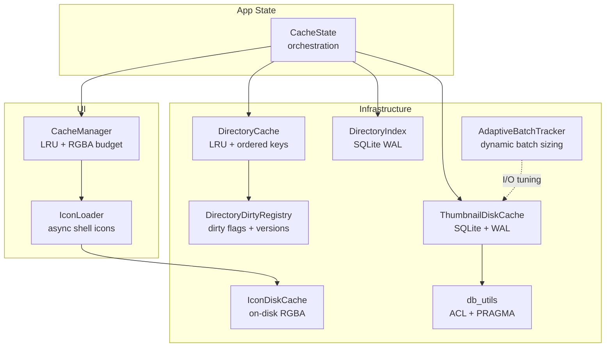
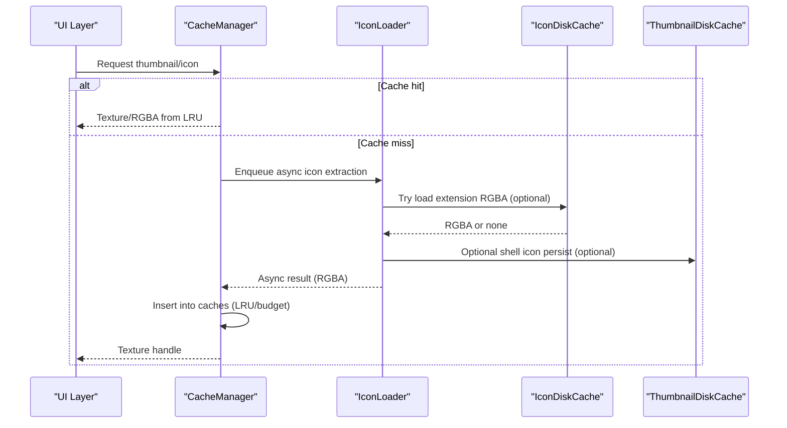
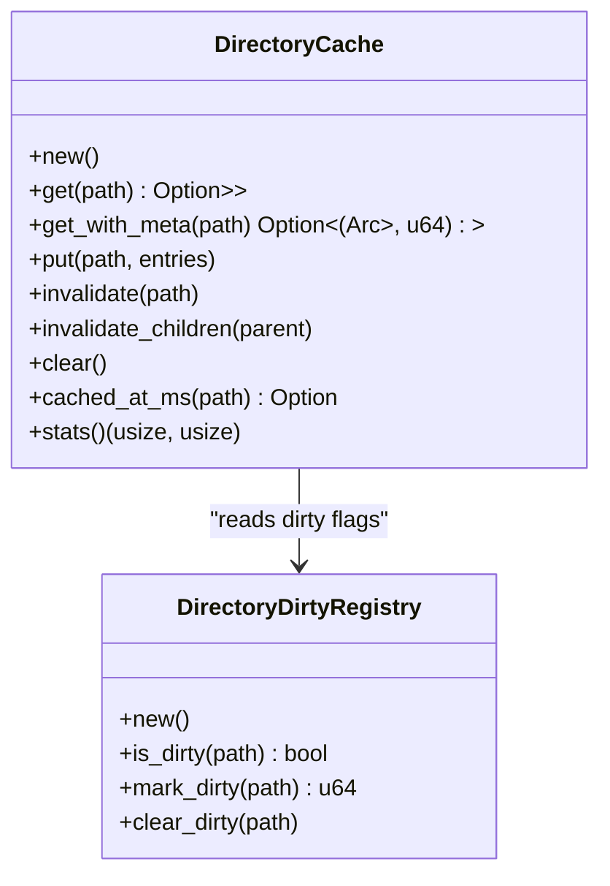
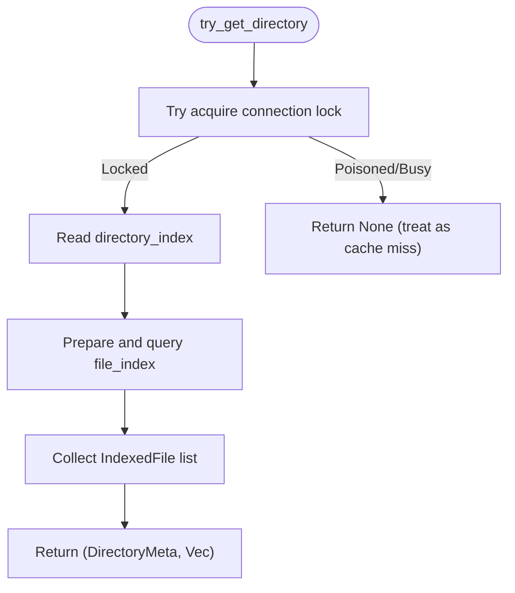
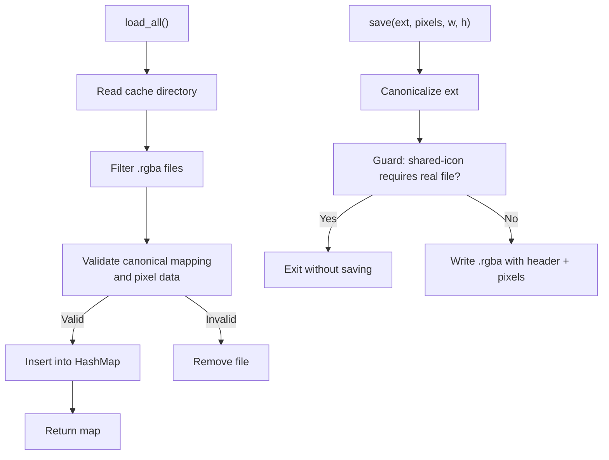
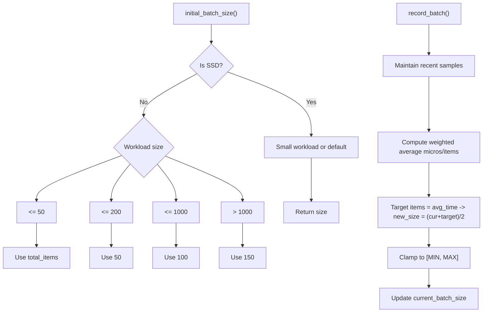
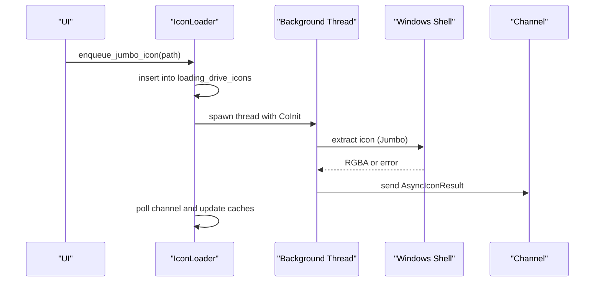
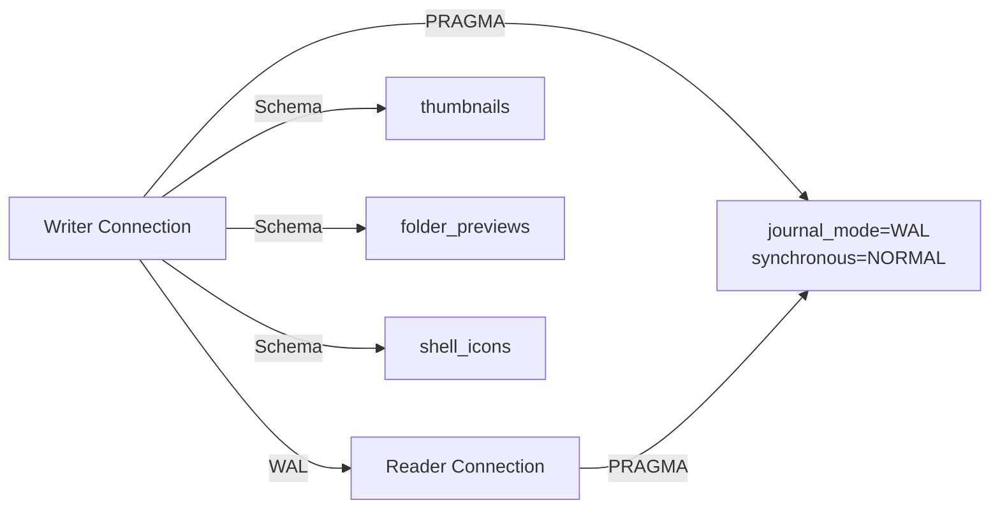
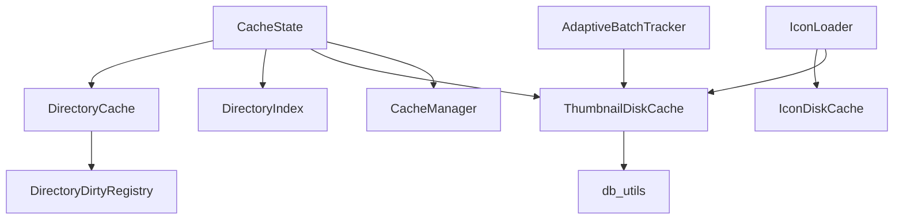

# Memory Caching Strategies

<cite>
**Referenced Files in This Document**
- [directory_cache.rs](file://src/infrastructure/directory_cache.rs)
- [directory_dirty_registry.rs](file://src/infrastructure/directory_dirty_registry.rs)
- [directory_index.rs](file://src/infrastructure/directory_index.rs)
- [icon_disk_cache.rs](file://src/infrastructure/icon_disk_cache.rs)
- [adaptive_batch.rs](file://src/infrastructure/adaptive_batch.rs)
- [disk_cache.rs](file://src/infrastructure/disk_cache.rs)
- [cache_state.rs](file://src/app/cache_state.rs)
- [cache.rs](file://src/ui/cache.rs)
- [icon_loader.rs](file://src/ui/icon_loader.rs)
- [icons.rs](file://src/infrastructure/windows/icons.rs)
- [db_utils.rs](file://src/infrastructure/db_utils.rs)
- [background_jobs.rs](file://src/app/init_workers/background_jobs.rs)
- [threading.rs](file://src/infrastructure/threading.rs)
</cite>

## Table of Contents
1. [Introduction](#introduction)
2. [Project Structure](#project-structure)
3. [Core Components](#core-components)
4. [Architecture Overview](#architecture-overview)
5. [Detailed Component Analysis](#detailed-component-analysis)
6. [Dependency Analysis](#dependency-analysis)
7. [Performance Considerations](#performance-considerations)
8. [Troubleshooting Guide](#troubleshooting-guide)
9. [Conclusion](#conclusion)

## Introduction
This document explains MTT File Manager’s memory caching strategies and in-memory data structures. It focuses on:
- Directory cache with LRU eviction and dirty tracking for efficient file system metadata access
- Directory index for fast path resolution and file lookup
- Icon disk cache for shell icon persistence with thread-safe access patterns
- Adaptive batch system for optimizing I/O operations and reducing memory pressure
- Cache hit/miss statistics, memory usage monitoring, and performance tuning guidelines
- Thread safety mechanisms and memory leak prevention strategies

## Project Structure
The caching subsystem spans infrastructure and UI layers:
- Infrastructure caches: directory cache, directory index, disk cache, icon disk cache, adaptive batching
- UI caches: texture and icon caches, RGBA data cache, and concurrent load gating
- Global cache state orchestrating initialization and lifecycle



**Diagram sources**
- [directory_cache.rs:1-175](file://src/infrastructure/directory_cache.rs#L1-L175)
- [directory_dirty_registry.rs:1-37](file://src/infrastructure/directory_dirty_registry.rs#L1-L37)
- [directory_index.rs:1-269](file://src/infrastructure/directory_index.rs#L1-L269)
- [icon_disk_cache.rs:1-124](file://src/infrastructure/icon_disk_cache.rs#L1-L124)
- [adaptive_batch.rs:1-105](file://src/infrastructure/adaptive_batch.rs#L1-L105)
- [disk_cache.rs:1-264](file://src/infrastructure/disk_cache.rs#L1-L264)
- [cache_state.rs:1-83](file://src/app/cache_state.rs#L1-L83)
- [cache.rs:1-584](file://src/ui/cache.rs#L1-L584)
- [icon_loader.rs:1-197](file://src/ui/icon_loader.rs#L1-L197)
- [db_utils.rs:1-198](file://src/infrastructure/db_utils.rs#L1-L198)

**Section sources**
- [cache_state.rs:1-83](file://src/app/cache_state.rs#L1-L83)

## Core Components
- DirectoryCache: bounded LRU cache keyed by directory path, storing FileEntry vectors with timestamp and ordered-keys tracking for subtree invalidation
- DirectoryDirtyRegistry: per-directory dirty flag with monotonically increasing version to detect staleness
- DirectoryIndex: SQLite-backed directory metadata and file listings with WAL and non-blocking reads
- IconDiskCache: on-disk RGBA cache keyed by canonical extension, enabling instant shell icon population
- AdaptiveBatchTracker: dynamic batch sizing for I/O workloads, adapting to SSD/HDD characteristics
- ThumbnailDiskCache: SQLite-backed persistent cache for thumbnails and folder previews with WAL and ACL hardening
- CacheManager: UI-side LRU caches for textures, icons, and RGBA data with memory budgets and concurrent load limits
- IconLoader: orchestrates async shell icon extraction and integrates optional disk cache persistence

**Section sources**
- [directory_cache.rs:1-175](file://src/infrastructure/directory_cache.rs#L1-L175)
- [directory_dirty_registry.rs:1-37](file://src/infrastructure/directory_dirty_registry.rs#L1-L37)
- [directory_index.rs:1-269](file://src/infrastructure/directory_index.rs#L1-L269)
- [icon_disk_cache.rs:1-124](file://src/infrastructure/icon_disk_cache.rs#L1-L124)
- [adaptive_batch.rs:1-105](file://src/infrastructure/adaptive_batch.rs#L1-L105)
- [disk_cache.rs:1-264](file://src/infrastructure/disk_cache.rs#L1-L264)
- [cache.rs:1-584](file://src/ui/cache.rs#L1-L584)
- [icon_loader.rs:1-197](file://src/ui/icon_loader.rs#L1-L197)

## Architecture Overview
The caching architecture balances memory-bound UI caches with persistent disk caches and adaptive I/O batching:
- UI caches (CacheManager) manage VRAM and CPU RAM efficiently with LRU and budgets
- Infrastructure caches (DirectoryCache, DirectoryIndex, ThumbnailDiskCache) provide fast metadata and persistent storage
- IconDiskCache bridges shell icon extraction with persistent storage for quick restarts
- AdaptiveBatchTracker tunes batch sizes to reduce memory pressure and improve throughput



**Diagram sources**
- [cache.rs:138-209](file://src/ui/cache.rs#L138-L209)
- [icon_loader.rs:122-157](file://src/ui/icon_loader.rs#L122-L157)
- [icon_disk_cache.rs:30-96](file://src/infrastructure/icon_disk_cache.rs#L30-L96)
- [disk_cache.rs:67-72](file://src/infrastructure/disk_cache.rs#L67-L72)

## Detailed Component Analysis

### Directory Cache (LRU + Dirty Tracking)
- Purpose: Cache directory entries (FileEntry) with LRU eviction and fast subtree invalidation
- Data structures:
  - LruCache<PathBuf, CachedFolder> for entries
  - BTreeSet<PathBuf> for ordered keys to support range-based invalidation
- Dirty tracking:
  - DirectoryDirtyRegistry maintains per-path dirty flags and monotonic versions
- Operations:
  - get/get_with_meta: read-through with timestamp
  - put: strips folder_cover, stamps cached_at_ms, inserts into LRU
  - invalidate/invalidate_children/clear: maintain LRU and ordered keys
  - cached_at_ms: lightweight staleness check
  - stats: item counts for diagnostics



**Diagram sources**
- [directory_cache.rs:39-136](file://src/infrastructure/directory_cache.rs#L39-L136)
- [directory_dirty_registry.rs:7-37](file://src/infrastructure/directory_dirty_registry.rs#L7-L37)

**Section sources**
- [directory_cache.rs:12-136](file://src/infrastructure/directory_cache.rs#L12-L136)
- [directory_dirty_registry.rs:7-37](file://src/infrastructure/directory_dirty_registry.rs#L7-L37)

### Directory Index (Fast Path Resolution)
- Purpose: Persist directory metadata and file listings for fast path resolution and file lookup
- Implementation:
  - SQLite with WAL and NORMAL synchronous for concurrency and performance
  - Two tables: directory_index (per-directory stats) and file_index (per-file records)
  - Index on dir_path for efficient scans
- Access patterns:
  - get_directory: blocking read with metadata and file list
  - try_get_directory: non-blocking read for UI thread (returns None if locked)
  - put_directory: transactional insert with replace and delete-then-insert semantics
  - invalidate/invalidate_recursive: targeted purges



**Diagram sources**
- [directory_index.rs:111-155](file://src/infrastructure/directory_index.rs#L111-L155)

**Section sources**
- [directory_index.rs:22-269](file://src/infrastructure/directory_index.rs#L22-L269)

### Icon Disk Cache (Shell Icons Persistence)
- Purpose: Persist extension-based RGBA icon data to disk for instant icon population across app launches
- Design:
  - On-disk format: width(u32)+height(u32)+pixels
  - Keys: canonical lowercase extension (e.g., dll for sys/drv/ocx)
  - Validation: rejects stale or invalid files; deletes when canonical mapping changes or requires real file seeding
- Access:
  - load_all: bulk load into memory map
  - save: write RGBA under canonical key if not present



**Diagram sources**
- [icon_disk_cache.rs:30-96](file://src/infrastructure/icon_disk_cache.rs#L30-L96)
- [icon_disk_cache.rs:100-122](file://src/infrastructure/icon_disk_cache.rs#L100-L122)
- [icons.rs:8-32](file://src/infrastructure/windows/icons.rs#L8-L32)

**Section sources**
- [icon_disk_cache.rs:1-124](file://src/infrastructure/icon_disk_cache.rs#L1-L124)
- [icons.rs:8-32](file://src/infrastructure/windows/icons.rs#L8-L32)

### Adaptive Batch System (I/O Optimization)
- Purpose: Dynamically size batches to balance responsiveness (SSD) and throughput (HDD) while controlling memory pressure
- Config:
  - MIN_BATCH_SIZE/MAX_BATCH_SIZE define bounds
  - TARGET_BATCH_MS targets ~50ms per batch window
- Behavior:
  - initial_batch_size adapts to SSD/NVMe and total workload size
  - record_batch computes moving average time-per-item and adjusts batch size
  - batch_size returns current target



**Diagram sources**
- [adaptive_batch.rs:8-26](file://src/infrastructure/adaptive_batch.rs#L8-L26)
- [adaptive_batch.rs:49-81](file://src/infrastructure/adaptive_batch.rs#L49-L81)

**Section sources**
- [adaptive_batch.rs:1-105](file://src/infrastructure/adaptive_batch.rs#L1-L105)

### UI Texture and RGBA Caches (Memory Management)
- CacheManager:
  - LRU caches for thumbnails, icons, drive icons, and folder previews
  - Concurrent load gating with max_concurrent_loads
  - Dedicated RGBA data cache with byte budget and eviction
  - Dynamic capacity tuning for texture cache
- Memory accounting:
  - estimate_vram_usage: sum of pixel data across textures
  - estimate_ram_cache_usage: tracked bytes in RGBA cache
- Operations:
  - put_rgba_data/pop_rgba_data with budget enforcement
  - trim_thumbnail_caches to enforce targets
  - invalidate_folder_preview to trigger reloads

```mermaid
classDiagram
class CacheManager {
+texture_cache : LruCache<PathBuf, TextureHandle>
+icon_cache : LruCache<String, TextureHandle>
+drive_icon_cache : LruCache<String, TextureHandle>
+folder_preview_cache : LruCache<PathBuf, TextureHandle>
+rgba_data_cache : LruCache<PathBuf, (Vec<u8>, u32, u32)>
+loading_set : FxHashSet<PathBuf>
+pending_upload_set : FxHashSet<PathBuf>
+failed_thumbnails : LruCache<PathBuf, ()>
+max_rgba_data_bytes : usize
+retune_texture_cache_capacity(items) usize
+put_rgba_data(path, data, w, h)
+trim_thumbnail_caches(t_tex, t_rgba, t_fp)
+estimate_vram_usage() usize
+estimate_ram_cache_usage() usize
}
```

**Diagram sources**
- [cache.rs:50-520](file://src/ui/cache.rs#L50-L520)

**Section sources**
- [cache.rs:1-584](file://src/ui/cache.rs#L1-L584)

### Icon Loader (Thread-Safe Access Patterns)
- Responsibilities:
  - Async extraction of shell icons with background threads
  - Prevent duplicate requests via loading sets
  - Optional disk cache integration for shell icons
  - Budgeted non-blocking sync lookups for UI friendliness
- Thread safety:
  - Uses channels (mpsc) for cross-thread results
  - Guards internal state with interior mutability and HashSet/LruCache
  - Uses dedicated disk cache (optional) to avoid repeated shell calls



**Diagram sources**
- [icon_loader.rs:122-157](file://src/ui/icon_loader.rs#L122-L157)
- [icon_loader.rs:159-196](file://src/ui/icon_loader.rs#L159-L196)

**Section sources**
- [icon_loader.rs:1-197](file://src/ui/icon_loader.rs#L1-L197)

### Disk Cache (SQLite + WAL + ACL Hardening)
- ThumbnailDiskCache:
  - Separate writer and reader connections (when possible) for concurrency
  - WAL mode and NORMAL synchronous for performance
  - ACL hardening via db_utils to protect cache directories
  - Tables: thumbnails, folder_previews, shell_icons
- db_utils:
  - ACL hardening using Windows APIs
  - Temporary fallback connection (in-memory if needed)
  - PRAGMA setup for SQLite



**Diagram sources**
- [disk_cache.rs:104-176](file://src/infrastructure/disk_cache.rs#L104-L176)
- [db_utils.rs:58-145](file://src/infrastructure/db_utils.rs#L58-L145)
- [db_utils.rs:193-197](file://src/infrastructure/db_utils.rs#L193-L197)

**Section sources**
- [disk_cache.rs:1-264](file://src/infrastructure/disk_cache.rs#L1-L264)
- [db_utils.rs:1-198](file://src/infrastructure/db_utils.rs#L1-L198)

## Dependency Analysis
- CacheState orchestrates initialization of DirectoryCache, DirectoryIndex, ThumbnailDiskCache, and CacheManager
- DirectoryCache depends on DirectoryDirtyRegistry for dirty tracking
- IconLoader optionally depends on IconDiskCache and ThumbnailDiskCache
- AdaptiveBatchTracker informs I/O-heavy workers to tune batch sizes
- Disk cache relies on db_utils for ACL hardening and PRAGMA setup



**Diagram sources**
- [cache_state.rs:12-66](file://src/app/cache_state.rs#L12-L66)
- [directory_cache.rs:39-41](file://src/infrastructure/directory_cache.rs#L39-L41)
- [directory_dirty_registry.rs:7-10](file://src/infrastructure/directory_dirty_registry.rs#L7-L10)
- [icon_loader.rs:54-88](file://src/ui/icon_loader.rs#L54-L88)
- [adaptive_batch.rs:34-47](file://src/infrastructure/adaptive_batch.rs#L34-L47)
- [disk_cache.rs:67-72](file://src/infrastructure/disk_cache.rs#L67-L72)
- [db_utils.rs:193-197](file://src/infrastructure/db_utils.rs#L193-L197)

**Section sources**
- [cache_state.rs:12-66](file://src/app/cache_state.rs#L12-L66)

## Performance Considerations
- Cache hit/miss statistics:
  - DirectoryCache.stats: returns (entry_count, total_items) for diagnostics
  - DirectoryIndex.try_get_directory: returns None when busy (non-blocking miss)
  - CacheManager.trim_thumbnail_caches: enables controlled eviction to meet targets
- Memory usage monitoring:
  - CacheManager.estimate_vram_usage: sum of pixel data across cached textures
  - CacheManager.estimate_ram_cache_usage: current RGBA bytes budgeted
  - DirectoryCache.stats: total items across cached directories
- Tuning guidelines:
  - Adjust AdaptiveBatchTracker initial_batch_size for SSD vs HDD and workload size
  - Tune CacheManager texture cache capacity and RGBA budget based on available VRAM and system RAM
  - Use DirectoryCache.invalidate_children for precise subtree invalidation to minimize redundant scans
  - Enable DirectoryIndex try_get_directory for UI thread to avoid blocking stalls

[No sources needed since this section provides general guidance]

## Troubleshooting Guide
- Deadlocks:
  - Disk cache reader/writer sharing same Arc<Mutex<Connection>> is guarded by comments warning against nested lock calls; ensure no code path holds both locks concurrently
- Stale icon cache:
  - IconDiskCache automatically removes stale or invalid entries; ensure canonical mapping and real-file requirements are met
- Disk cache ACL failures:
  - db_utils.harden_directory_permissions logs warnings and falls back to in-memory database; verify permissions and directory creation
- Garbage collection:
  - Background jobs trigger incremental GC and vacuum on thresholds; monitor logs for completion messages

**Section sources**
- [disk_cache.rs:162-169](file://src/infrastructure/disk_cache.rs#L162-L169)
- [icon_disk_cache.rs:50-87](file://src/infrastructure/icon_disk_cache.rs#L50-L87)
- [db_utils.rs:58-145](file://src/infrastructure/db_utils.rs#L58-L145)
- [background_jobs.rs:70-103](file://src/app/init_workers/background_jobs.rs#L70-L103)

## Conclusion
MTT File Manager employs a layered caching strategy:
- Memory caches (DirectoryCache, CacheManager) provide fast access with LRU and budgets
- Persistent caches (DirectoryIndex, ThumbnailDiskCache, IconDiskCache) ensure durability and fast restarts
- Adaptive batching optimizes I/O throughput and reduces memory pressure
- Robust thread-safety and leak prevention are achieved via channels, interior mutability, and strict ACL hardening