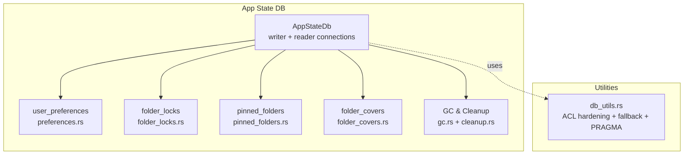
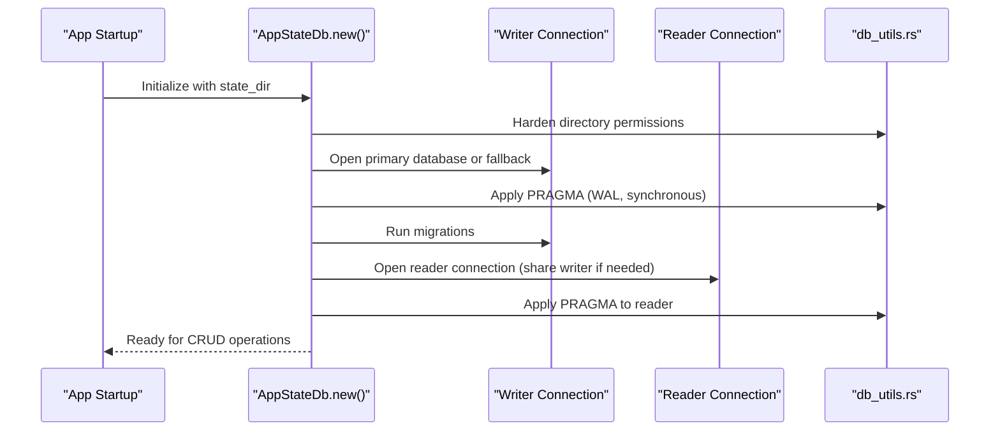
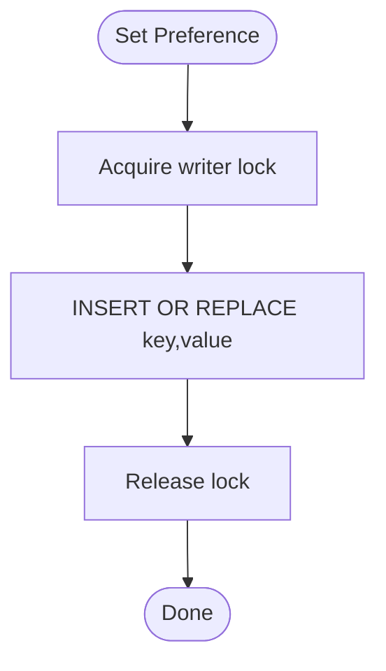
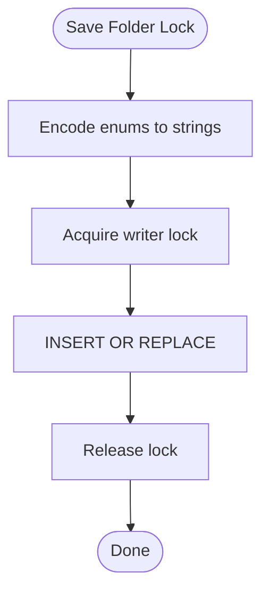
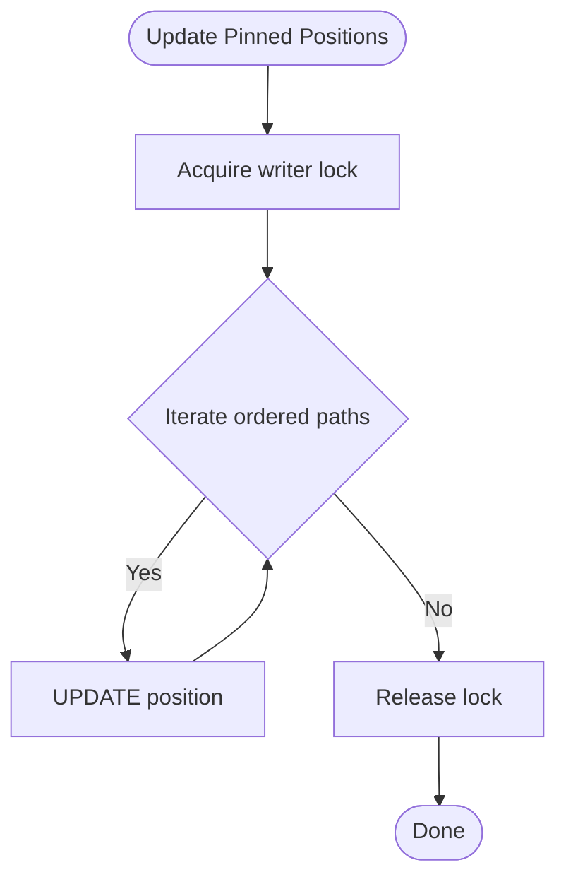
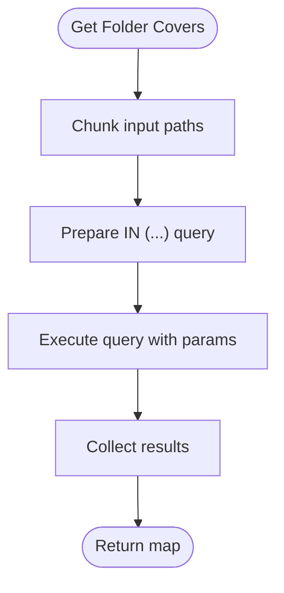
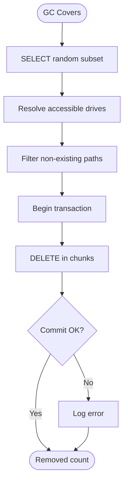
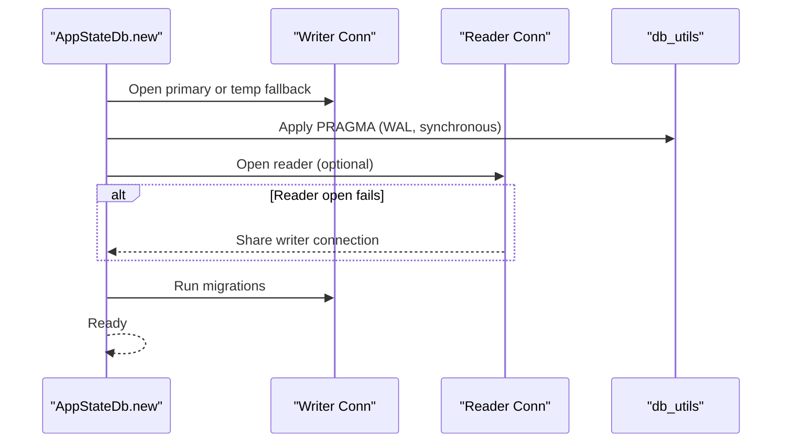
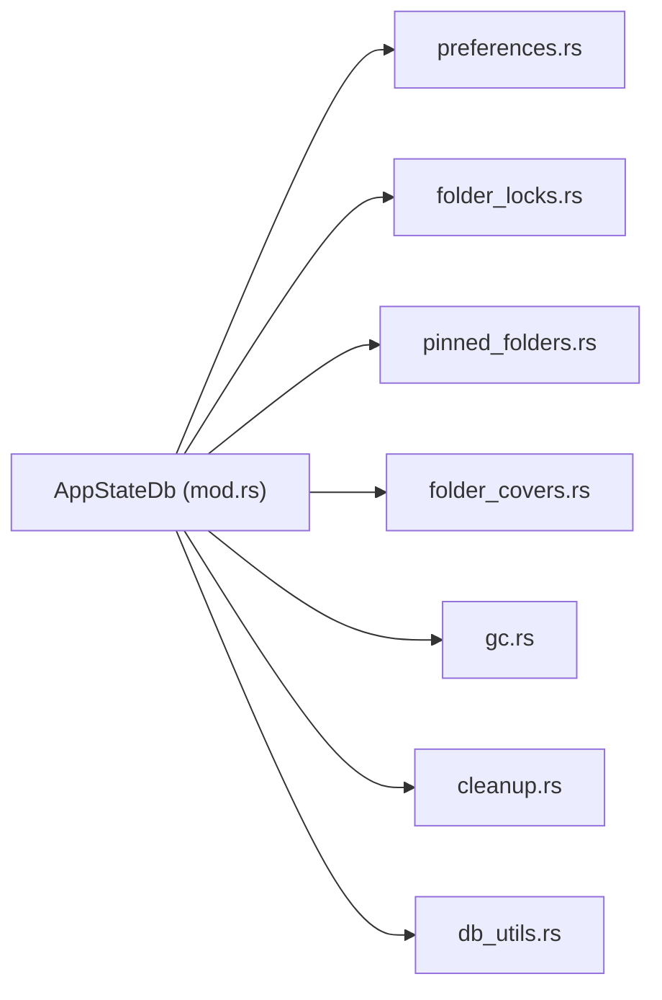

# SQLite Database Schemas

<cite>
**Referenced Files in This Document**
- [mod.rs](file://src/infrastructure/app_state_db/mod.rs)
- [preferences.rs](file://src/infrastructure/app_state_db/preferences.rs)
- [folder_locks.rs](file://src/infrastructure/app_state_db/folder_locks.rs)
- [pinned_folders.rs](file://src/infrastructure/app_state_db/pinned_folders.rs)
- [folder_covers.rs](file://src/infrastructure/app_state_db/folder_covers.rs)
- [gc.rs](file://src/infrastructure/app_state_db/gc.rs)
- [cleanup.rs](file://src/infrastructure/app_state_db/cleanup.rs)
- [db_utils.rs](file://src/infrastructure/db_utils.rs)
- [Cargo.toml](file://Cargo.toml)
- [README.md](file://README.md)
</cite>

## Table of Contents
1. [Introduction](#introduction)
2. [Project Structure](#project-structure)
3. [Core Components](#core-components)
4. [Architecture Overview](#architecture-overview)
5. [Detailed Component Analysis](#detailed-component-analysis)
6. [Dependency Analysis](#dependency-analysis)
7. [Performance Considerations](#performance-considerations)
8. [Troubleshooting Guide](#troubleshooting-guide)
9. [Conclusion](#conclusion)

## Introduction
This document describes the SQLite database schemas and persistence layer used by the MTT File Manager’s application state store. It focuses on four main tables:
- user_preferences: application settings storage
- folder_locks: per-folder view configurations
- pinned_folders: Quick Access management
- folder_covers: album art/collection covers

It explains the dual-writer/reader connection pattern with Write-Ahead Logging (WAL) mode for concurrent access, database initialization and schema migrations, version management, CRUD operations, transaction handling, error recovery strategies, and security hardening via ACL permissions. It also documents the fallback mechanism to temporary directories and memory databases.

## Project Structure
The persistence layer resides under the infrastructure module, with a dedicated app_state_db sub-module that encapsulates:
- A central AppStateDb struct managing two connections (writer and reader)
- Individual modules for each table’s operations
- Utilities for ACL hardening, fallback connections, and PRAGMA setup
- Garbage collection and cleanup routines

**Diagram sources**
- [mod.rs:21-115](file://src/infrastructure/app_state_db/mod.rs#L21-L115)
- [preferences.rs:1-91](file://src/infrastructure/app_state_db/preferences.rs#L1-L91)
- [folder_locks.rs:1-125](file://src/infrastructure/app_state_db/folder_locks.rs#L1-L125)
- [pinned_folders.rs:1-75](file://src/infrastructure/app_state_db/pinned_folders.rs#L1-L75)
- [folder_covers.rs:1-98](file://src/infrastructure/app_state_db/folder_covers.rs#L1-L98)
- [gc.rs:1-134](file://src/infrastructure/app_state_db/gc.rs#L1-L134)
- [cleanup.rs:1-45](file://src/infrastructure/app_state_db/cleanup.rs#L1-L45)
- [db_utils.rs:147-197](file://src/infrastructure/db_utils.rs#L147-L197)

**Section sources**
- [mod.rs:1-169](file://src/infrastructure/app_state_db/mod.rs#L1-L169)
- [db_utils.rs:1-198](file://src/infrastructure/db_utils.rs#L1-L198)

## Core Components
- AppStateDb: Holds two SQLite connections (writer and reader), manages database initialization, migrations, and PRAGMA setup. It supports a fallback path to a temporary directory and an in-memory database when necessary.
- Table modules: Provide CRUD operations for each table, with explicit reader/writer annotations and transaction handling where appropriate.
- Utilities: Provide ACL hardening for directories, fallback connection opening, and PRAGMA configuration (journal_mode=WAL, synchronous=NORMAL).

Key capabilities:
- Dual-writer/reader + WAL pattern for concurrent reads and writes
- Schema migrations with backward compatibility handling
- Batch operations with transaction hints
- Incremental garbage collection for stale folder covers
- Cleanup routines for removing orphaned cover entries after file operations

**Section sources**
- [mod.rs:21-169](file://src/infrastructure/app_state_db/mod.rs#L21-L169)
- [db_utils.rs:147-197](file://src/infrastructure/db_utils.rs#L147-L197)

## Architecture Overview
The database architecture follows a dual-connection model:
- Writer connection: exclusive access for writes and migrations
- Reader connection: shared access for reads
- WAL mode enabled for concurrency and durability
- Security hardening via ACL permissions on the state directory
- Fallback to a temporary directory or in-memory database when primary storage is unavailable

**Diagram sources**
- [mod.rs:34-115](file://src/infrastructure/app_state_db/mod.rs#L34-L115)
- [db_utils.rs:147-197](file://src/infrastructure/db_utils.rs#L147-L197)

## Detailed Component Analysis

### Table: user_preferences
Purpose: Store application settings as key/value pairs.

Schema
- key: TEXT, PRIMARY KEY
- value: TEXT

Notes
- Uses INSERT OR REPLACE semantics for updates
- Supports single-row and batch writes
- Batch write attempts BEGIN IMMEDIATE TRANSACTION and falls back to per-statement writes if contention is detected

Common operations
- Set a preference: writer
- Get a preference: reader
- Get all preferences: reader
- Batch set preferences: writer (non-blocking try variant and blocking variant)

**Diagram sources**
- [preferences.rs:7-14](file://src/infrastructure/app_state_db/preferences.rs#L7-L14)

**Section sources**
- [mod.rs:118-125](file://src/infrastructure/app_state_db/mod.rs#L118-L125)
- [preferences.rs:1-91](file://src/infrastructure/app_state_db/preferences.rs#L1-L91)

### Table: folder_locks
Purpose: Persist per-folder view preferences (view mode, sort mode, sort direction, folders position).

Schema
- path: TEXT, PRIMARY KEY
- view_mode: TEXT NOT NULL
- sort_mode: TEXT NOT NULL
- sort_descending: TEXT NOT NULL
- folders_position: TEXT NOT NULL

Migration note
- Legacy table with a NOT NULL constraint on search_query was dropped and recreated to avoid constraint violations

Common operations
- Save a folder lock: writer
- Remove a folder lock: writer
- Load all folder locks: reader

**Diagram sources**
- [folder_locks.rs:9-51](file://src/infrastructure/app_state_db/folder_locks.rs#L9-L51)

**Section sources**
- [mod.rs:136-155](file://src/infrastructure/app_state_db/mod.rs#L136-L155)
- [folder_locks.rs:1-125](file://src/infrastructure/app_state_db/folder_locks.rs#L1-L125)

### Table: pinned_folders
Purpose: Manage Quick Access entries with display name and position ordering.

Schema
- path: TEXT, PRIMARY KEY
- display_name: TEXT NOT NULL
- position: INTEGER NOT NULL DEFAULT 0

Common operations
- Load all pinned folders ordered by position: reader
- Save or update a pinned folder: writer
- Remove a pinned folder: writer
- Reassign sequential positions: writer

**Diagram sources**
- [pinned_folders.rs:64-73](file://src/infrastructure/app_state_db/pinned_folders.rs#L64-L73)

**Section sources**
- [mod.rs:157-166](file://src/infrastructure/app_state_db/mod.rs#L157-L166)
- [pinned_folders.rs:1-75](file://src/infrastructure/app_state_db/pinned_folders.rs#L1-L75)

### Table: folder_covers
Purpose: Store discovered cover/thumbnail paths for folders.

Schema
- folder_path: TEXT, PRIMARY KEY
- cover_path: TEXT

Common operations
- Get covers for multiple folders (batched): reader
- Save a folder cover: writer
- Non-blocking save: writer (try variant)
- Remove a folder cover: writer

Batching and performance
- Uses chunking to stay within SQLite’s parameter limits
- Skips expensive existence checks to avoid stalls on virtual/encrypted drives

**Diagram sources**
- [folder_covers.rs:8-57](file://src/infrastructure/app_state_db/folder_covers.rs#L8-L57)

**Section sources**
- [mod.rs:127-134](file://src/infrastructure/app_state_db/mod.rs#L127-L134)
- [folder_covers.rs:1-98](file://src/infrastructure/app_state_db/folder_covers.rs#L1-L98)

### Garbage Collection and Cleanup
Incremental GC for folder_covers
- Random sampling of rows up to a bounded limit
- Determines accessible drives and checks path existence
- Deletes orphans in batches within a transaction

Cleanup routine
- Removes folder cover entries for a specific path or its descendants
- Also handles cases where the cover file itself was deleted

**Diagram sources**
- [gc.rs:56-132](file://src/infrastructure/app_state_db/gc.rs#L56-L132)
- [cleanup.rs:8-43](file://src/infrastructure/app_state_db/cleanup.rs#L8-L43)

**Section sources**
- [gc.rs:1-134](file://src/infrastructure/app_state_db/gc.rs#L1-L134)
- [cleanup.rs:1-45](file://src/infrastructure/app_state_db/cleanup.rs#L1-L45)

### Dual-Writer/Reader Connection Pattern and WAL Mode
- Two rusqlite::Connection instances: writer and reader
- WAL mode enabled via PRAGMA to allow concurrent readers and writers
- Reader connection may share the writer connection if opening a separate reader fails
- Fallback mechanism: primary path -> temp directory -> in-memory database

**Diagram sources**
- [mod.rs:56-115](file://src/infrastructure/app_state_db/mod.rs#L56-L115)
- [db_utils.rs:193-197](file://src/infrastructure/db_utils.rs#L193-L197)

**Section sources**
- [mod.rs:24-115](file://src/infrastructure/app_state_db/mod.rs#L24-L115)
- [db_utils.rs:193-197](file://src/infrastructure/db_utils.rs#L193-L197)

### Database Initialization, Schema Migrations, and Version Management
- Initialization ensures the state directory exists and applies ACL hardening
- Opens primary database; if that fails, opens a temp fallback database; if that fails, uses in-memory
- Applies PRAGMA settings immediately after opening
- Runs migrations on the writer connection:
  - Creates user_preferences if not exists
  - Creates folder_covers if not exists
  - Migrates folder_locks by dropping legacy table with problematic constraints and recreating with current schema
  - Creates pinned_folders if not exists

Version management
- The migration logic detects presence of legacy columns and drops/recreates tables to maintain compatibility
- No explicit version table is present; migrations are idempotent and guard against repeated runs

**Section sources**
- [mod.rs:34-167](file://src/infrastructure/app_state_db/mod.rs#L34-L167)
- [db_utils.rs:147-197](file://src/infrastructure/db_utils.rs#L147-L197)

### CRUD Operations, Transactions, and Error Recovery
- Writer operations are guarded by mutex locks; non-blocking variants use try_lock to avoid UI stalls
- Reader operations use prepared statements and are generally non-blocking
- Batch operations:
  - Try to begin an IMMEDIATE transaction; if contention occurs, fall back to per-statement writes
  - For folder_covers batch retrieval, use chunking to avoid parameter limits
- Transaction handling:
  - GC uses explicit transactions for batch deletions
  - Cleanup uses transactions to ensure atomic removal of related entries
- Error recovery:
  - Log warnings and continue with fallbacks (temp directory or in-memory)
  - Reader sharing avoids crashes if a separate reader connection cannot be opened
  - Non-blocking writes prevent UI thread starvation

**Section sources**
- [preferences.rs:16-58](file://src/infrastructure/app_state_db/preferences.rs#L16-L58)
- [folder_covers.rs:7-98](file://src/infrastructure/app_state_db/folder_covers.rs#L7-L98)
- [gc.rs:99-122](file://src/infrastructure/app_state_db/gc.rs#L99-L122)
- [cleanup.rs:15-42](file://src/infrastructure/app_state_db/cleanup.rs#L15-L42)

### Security Hardening Through ACL Permissions
- The state directory and its parent temp directory are hardened using explicit DACLs
- Grants the current user full control and removes inherited permissions
- Eliminates TOCTOU race conditions during directory creation and ACL application
- If ACL hardening fails, the system logs a warning and proceeds with fallbacks

**Section sources**
- [db_utils.rs:58-145](file://src/infrastructure/db_utils.rs#L58-L145)
- [mod.rs:34-79](file://src/infrastructure/app_state_db/mod.rs#L34-L79)

## Dependency Analysis
- AppStateDb depends on rusqlite for database connectivity and on db_utils for security and fallback logic
- Each table module is an extension of AppStateDb and uses the shared connections
- GC and cleanup modules rely on fast path existence checks and transaction primitives

**Diagram sources**
- [mod.rs:14-19](file://src/infrastructure/app_state_db/mod.rs#L14-L19)
- [preferences.rs](file://src/infrastructure/app_state_db/preferences.rs#L1)
- [folder_locks.rs](file://src/infrastructure/app_state_db/folder_locks.rs#L1)
- [pinned_folders.rs](file://src/infrastructure/app_state_db/pinned_folders.rs#L1)
- [folder_covers.rs](file://src/infrastructure/app_state_db/folder_covers.rs#L1)
- [gc.rs](file://src/infrastructure/app_state_db/gc.rs#L1)
- [cleanup.rs](file://src/infrastructure/app_state_db/cleanup.rs#L1)
- [db_utils.rs:1-10](file://src/infrastructure/db_utils.rs#L1-L10)

**Section sources**
- [Cargo.toml](file://Cargo.toml#L29)
- [README.md](file://README.md#L61)

## Performance Considerations
- WAL mode improves concurrency and reduces writer contention
- Batch operations reduce round-trips and improve throughput
- Chunked queries for folder_covers avoid SQLite parameter limits
- Non-blocking writer operations prevent UI thread stalls
- Incremental GC samples a bounded number of rows to keep overhead predictable

## Troubleshooting Guide
Common issues and resolutions
- Primary database cannot be opened:
  - Check state directory permissions and ACL hardening logs
  - Confirm fallback to temp directory or in-memory database occurred
- Reader connection fails:
  - The system logs a warning and shares the writer connection
  - Verify that the writer connection remains healthy
- Constraint violations in folder_locks:
  - The migration drops legacy tables and recreates with current schema
  - Ensure the app restarts after migration to avoid stale constraints
- Slow cover retrieval on virtual/encrypted drives:
  - Existence checks are intentionally skipped to avoid stalls
  - Stale entries are cleaned up incrementally by GC
- Batch write contention:
  - Try variant returns false when writer is busy; caller can retry later
  - Blocking variant ensures atomicity but may block the UI thread

**Section sources**
- [mod.rs:56-97](file://src/infrastructure/app_state_db/mod.rs#L56-L97)
- [folder_locks.rs:136-144](file://src/infrastructure/app_state_db/folder_locks.rs#L136-L144)
- [folder_covers.rs:46-50](file://src/infrastructure/app_state_db/folder_covers.rs#L46-L50)
- [preferences.rs:19-27](file://src/infrastructure/app_state_db/preferences.rs#L19-L27)

## Conclusion
The MTT File Manager’s SQLite persistence layer is designed for reliability, concurrency, and resilience. The dual-writer/reader pattern with WAL mode enables smooth concurrent access, while ACL hardening and fallback mechanisms ensure robust operation across diverse environments. The four main tables—user_preferences, folder_locks, pinned_folders, and folder_covers—are carefully modeled to support the application’s UI and state needs, with thoughtful batching, transaction handling, and incremental cleanup strategies.