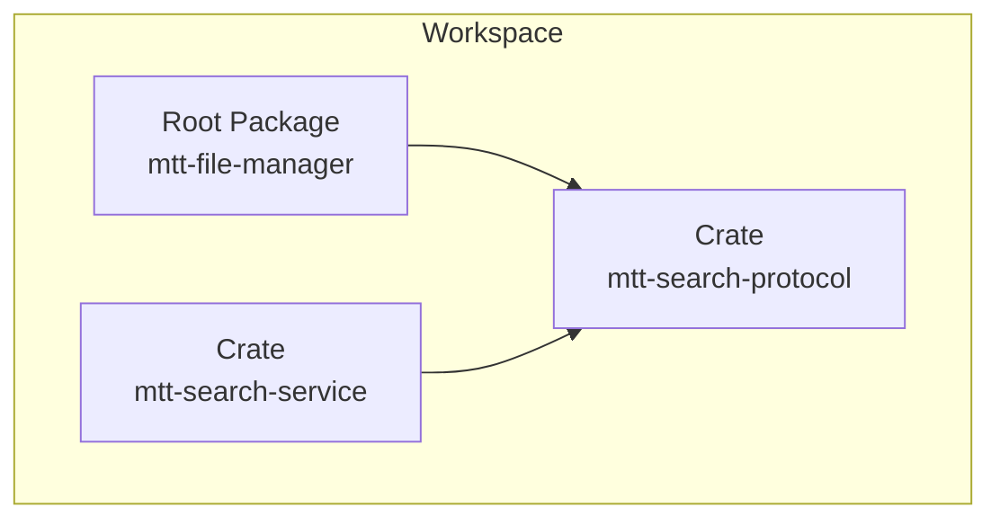
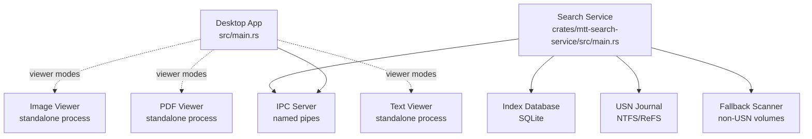
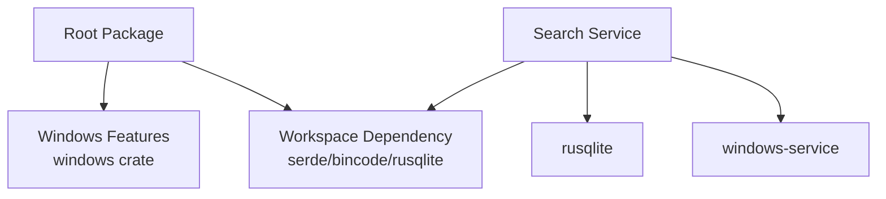

# Development Guide

<cite>
**Referenced Files in This Document**
- [Cargo.toml](file://Cargo.toml)
- [.cargo/config.toml](file://.cargo/config.toml)
- [README.md](file://README.md)
- [build.rs](file://build.rs)
- [src/main.rs](file://src/main.rs)
- [src/lib.rs](file://src/lib.rs)
- [src/domain/errors.rs](file://src/domain/errors.rs)
- [crates/mtt-search-service/Cargo.toml](file://crates/mtt-search-service/Cargo.toml)
- [crates/mtt-search-service/src/main.rs](file://crates/mtt-search-service/src/main.rs)
- [crates/mtt-search-service/src/ipc_server/mod.rs](file://crates/mtt-search-service/src/ipc_server/mod.rs)
- [benches/image_viewer_decode.rs](file://benches/image_viewer_decode.rs)
- [benches/shell_ops_blocking.rs](file://benches/shell_ops_blocking.rs)
- [docs/02_build_run_debug.md](file://docs/02_build_run_debug.md)
- [docs/08_logging_errors_telemetry.md](file://docs/08_logging_errors_telemetry.md)
</cite>

## Table of Contents
1. [Introduction](#introduction)
2. [Project Structure](#project-structure)
3. [Core Components](#core-components)
4. [Architecture Overview](#architecture-overview)
5. [Detailed Component Analysis](#detailed-component-analysis)
6. [Dependency Analysis](#dependency-analysis)
7. [Performance Considerations](#performance-considerations)
8. [Troubleshooting Guide](#troubleshooting-guide)
9. [Conclusion](#conclusion)
10. [Appendices](#appendices)

## Introduction
This guide provides comprehensive development documentation for contributing to MTT File Manager. It covers environment setup, build and run procedures, debugging and logging, testing strategies, code organization, and release packaging. It is designed for both new and experienced contributors to quickly become productive.

## Project Structure
The repository is a Cargo workspace with a root application and a companion Windows search service. The main application integrates a modern GUI, media previewers, and a background indexing service for global search.

Key workspace members:
- Root application: mtt-file-manager
- Search protocol crate: mtt-search-protocol
- Search service crate: mtt-search-service

Build and packaging:
- Cargo workspace configuration defines members and resolver.
- Build script handles Windows icon embedding, manifest embedding, and pdfium runtime staging.
- Installer build script packages the app, service, and required runtimes.

**Diagram sources**
- [Cargo.toml:1-3](file://Cargo.toml#L1-L3)
- [crates/mtt-search-service/Cargo.toml:1-10](file://crates/mtt-search-service/Cargo.toml#L1-L10)

**Section sources**
- [Cargo.toml:1-137](file://Cargo.toml#L1-L137)
- [README.md:73-98](file://README.md#L73-L98)
- [build.rs:1-45](file://build.rs#L1-L45)

## Core Components
- Main application entrypoint initializes logging, GPU backend selection, and supports standalone viewer modes.
- Domain error types centralize error modeling and helper macros for safe unwrapping and conversions.
- Search service runs as a Windows service, exposing IPC over named pipes and managing per-volume indexing.

Key responsibilities:
- src/main.rs: Windows subsystem gating, logging initialization, GPU backend preference, viewer modes, and eframe integration.
- src/domain/errors.rs: AppError enum, helpers, and extension traits for robust error handling.
- crates/mtt-search-service/src/main.rs: Service lifecycle, console mode, and indexer orchestration.
- crates/mtt-search-service/src/ipc_server/mod.rs: Named pipe server with concurrency limits, timeouts, and security policy.

**Section sources**
- [src/main.rs:106-305](file://src/main.rs#L106-L305)
- [src/domain/errors.rs:6-72](file://src/domain/errors.rs#L6-L72)
- [crates/mtt-search-service/src/main.rs:112-307](file://crates/mtt-search-service/src/main.rs#L112-L307)
- [crates/mtt-search-service/src/ipc_server/mod.rs:34-214](file://crates/mtt-search-service/src/ipc_server/mod.rs#L34-L214)

## Architecture Overview
The system comprises:
- Desktop application with eframe/egui UI and wgpu/glow renderers.
- Dedicated image/pdf/text viewers as standalone processes.
- Windows search service with hybrid indexing (USN journal for NTFS/ReFS, fallback scanners for others).
- IPC over named pipes using bincode serialization.
- Robust logging and telemetry categories for diagnostics.

**Diagram sources**
- [src/main.rs:143-215](file://src/main.rs#L143-L215)
- [crates/mtt-search-service/src/main.rs:190-307](file://crates/mtt-search-service/src/main.rs#L190-L307)
- [crates/mtt-search-service/src/ipc_server/mod.rs:34-214](file://crates/mtt-search-service/src/ipc_server/mod.rs#L34-L214)

## Detailed Component Analysis

### Build System and Workspace
- Workspace members include the root app and search service crates.
- Resolver set to “2” for deterministic dependency resolution.
- Platform-specific dependencies: wgpu with dx12 backend on Windows.
- Feature flags: notify-watcher enabled by default; optional notify crate for UNC/network fallback.
- Profiles: dev default; release configured with aggressive optimization and LTO.

Build targets and commands:
- Entire workspace: cargo build --workspace
- App only: cargo build -p mtt-file-manager
- Service only: cargo build -p mtt-search-service
- Release: cargo build --release --workspace
- Run with logs: cargo run 2>&1 | Tee-Object "debug.log"

**Section sources**
- [Cargo.toml:1-137](file://Cargo.toml#L1-L137)
- [docs/02_build_run_debug.md:56-98](file://docs/02_build_run_debug.md#L56-L98)

### Development Environment Setup
- Rust toolchain: stable-msvc recommended; verify with rustc --version and cargo --version.
- Windows SDK and MSVC build tools required.
- Optional: VS Code with rust-analyzer; enable cargo features and clippy on save.
- Environment variables for diagnostics: RUST_BACKTRACE, RUST_LOG, CARGO_INCREMENTAL.

IDE and tooling recommendations:
- rust-analyzer for diagnostics and completions.
- VS Code launch configuration for LLDB debugging of the binary target.
- Clippy and formatting via cargo clippy and cargo fmt.

**Section sources**
- [docs/02_build_run_debug.md:3-412](file://docs/02_build_run_debug.md#L3-L412)
- [README.md:132-165](file://README.md#L132-L165)

### Logging and Diagnostics
- Main app uses log crate with env_logger backend; categorized prefixes for filtering.
- Search service uses eprintln for console output.
- Environment variables for backtraces and log levels.
- Diagnostic scripts and helper commands for capturing logs and filtering categories.

Common categories:
- INIT, NAV, PERF, WATCHER, THUMB, FILE-OP, GLOBAL-SEARCH, METADATA, RECYCLE, MPV, etc.

**Section sources**
- [docs/08_logging_errors_telemetry.md:1-224](file://docs/08_logging_errors_telemetry.md#L1-L224)
- [src/main.rs:138-141](file://src/main.rs#L138-L141)

### Testing Strategies
Unit and integration testing:
- Unit tests for error handling helpers and extension traits in src/domain/errors.rs.
- Benchmarks for image decode and shell operations; Criterion harness used.

Benchmark coverage:
- image_viewer_decode: collects images from a configured directory and benchmarks full and preview decodes.
- shell_ops_blocking: measures blocking shell copy performance on Windows.

Running tests and benchmarks:
- cargo test
- cargo bench
- cargo bench --bench <name>

**Section sources**
- [src/domain/errors.rs:144-179](file://src/domain/errors.rs#L144-L179)
- [benches/image_viewer_decode.rs:1-89](file://benches/image_viewer_decode.rs#L1-L89)
- [benches/shell_ops_blocking.rs:1-39](file://benches/shell_ops_blocking.rs#L1-L39)

### Debugging Techniques
- VS Code LLDB launch configuration targeting the mtt-file-manager binary.
- Flamegraph profiling via cargo flamegraph.
- Dependency auditing with cargo tree, cargo audit, and cargo outdated.
- Environment variables for verbose logging and backtraces.

Diagnostic tips:
- Force OpenGL backend via WGPU_BACKEND for renderer initialization issues.
- Capture logs using run_with_logs.ps1 or manual redirection.
- Filter logs by category for targeted troubleshooting.

**Section sources**
- [docs/02_build_run_debug.md:268-412](file://docs/02_build_run_debug.md#L268-L412)

### Code Organization Principles
- Feature-based module layout under src/, with clear separation of concerns:
  - app, application, domain, infrastructure, ui, workers, viewers.
- Re-exports in src/lib.rs for convenient access.
- Centralized error modeling in src/domain/errors.rs.
- Viewer modes supported from the main binary for image, PDF, text, and video playback.

Naming conventions:
- Modules reflect functionality (e.g., image_viewer, pdf_viewer, workers).
- Error enums and helpers consistently prefixed with AppError and helper functions.

**Section sources**
- [src/lib.rs:1-20](file://src/lib.rs#L1-L20)
- [src/domain/errors.rs:6-72](file://src/domain/errors.rs#L6-L72)
- [src/main.rs:143-215](file://src/main.rs#L143-L215)

### Architectural Guidelines
- Prefer structured error handling with AppError and helper macros.
- Use logging categories to segment diagnostics and enable filtering.
- Keep UI responsive with background workers and async I/O.
- Security-conscious defaults: DLL search path hardening, IPC rate limiting, and optional status redaction.

**Section sources**
- [src/main.rs:106-119](file://src/main.rs#L106-L119)
- [crates/mtt-search-service/src/ipc_server/mod.rs:34-48](file://crates/mtt-search-service/src/ipc_server/mod.rs#L34-L48)

### Release Process and Packaging
- Release builds use aggressive optimization and LTO.
- Installer built with Inno Setup 6; bundles app, service, runtimes, and configuration.
- Pre-validation ensures required artifacts are present.
- Service installation and startup handled by installer.

Release and packaging commands:
- cargo build --release --workspace
- .\installer\build_installer.ps1
- ISCC.exe .\installer\setup.iss

**Section sources**
- [Cargo.toml:133-137](file://Cargo.toml#L133-L137)
- [README.md:199-237](file://README.md#L199-L237)
- [docs/02_build_run_debug.md:183-224](file://docs/02_build_run_debug.md#L183-L224)

### Contribution Workflow and Code Quality
- Formatting: cargo fmt
- Linting: cargo clippy
- Quality gates: clippy on save via rust-analyzer settings
- Commit hygiene: keep changes focused, add tests where applicable, and update docs as needed

**Section sources**
- [docs/02_build_run_debug.md:370-412](file://docs/02_build_run_debug.md#L370-L412)

## Dependency Analysis
The workspace defines shared dependencies and platform-specific features. The search service depends on Windows service bindings and SQLite for persistence.

**Diagram sources**
- [Cargo.toml:5-51](file://Cargo.toml#L5-L51)
- [Cargo.toml:67-109](file://Cargo.toml#L67-L109)
- [crates/mtt-search-service/Cargo.toml:9-32](file://crates/mtt-search-service/Cargo.toml#L9-L32)

**Section sources**
- [Cargo.toml:1-137](file://Cargo.toml#L1-L137)
- [crates/mtt-search-service/Cargo.toml:1-33](file://crates/mtt-search-service/Cargo.toml#L1-L33)

## Performance Considerations
- Release profile enables high optimization, LTO, and single codegen unit for best performance.
- GPU backend preference and low-latency presentation settings improve responsiveness.
- Benchmarks provide reproducible measurements for image decoding and blocking shell operations.
- Consider parallel compilation with cargo build --release -j <N>.

**Section sources**
- [Cargo.toml:133-137](file://Cargo.toml#L133-L137)
- [src/main.rs:254-277](file://src/main.rs#L254-L277)
- [benches/image_viewer_decode.rs:40-84](file://benches/image_viewer_decode.rs#L40-L84)
- [benches/shell_ops_blocking.rs:11-35](file://benches/shell_ops_blocking.rs#L11-L35)

## Troubleshooting Guide
Common issues and remedies:
- Missing libmpv-2.dll: place next to executable or add to PATH.
- Missing pdfium.dll: set PDFIUM_DYNAMIC_LIB_PATH or copy to target directory.
- Renderer initialization failures: set WGPU_BACKEND=opengl for diagnostics.
- Slow builds: increase parallelism with -j flag.
- Windows API compilation errors: ensure MSVC v143 and Windows SDK are installed.

Diagnostic commands:
- Service status: sc.exe query MTTFileManagerSearch
- Console mode: mtt-search-service.exe run-console
- Logs capture: run_with_logs.ps1 or manual redirection

**Section sources**
- [docs/02_build_run_debug.md:321-370](file://docs/02_build_run_debug.md#L321-L370)
- [docs/08_logging_errors_telemetry.md:179-224](file://docs/08_logging_errors_telemetry.md#L179-L224)

## Conclusion
This guide consolidates environment setup, build/run/debug/logging/testing, and packaging procedures for MTT File Manager. By following the documented practices, contributors can efficiently develop, test, and ship reliable enhancements to the application and its search service.

## Appendices

### Appendix A: Build and Run Commands
- Build workspace: cargo build --workspace
- Run app: cargo run
- Release build: cargo build --release --workspace
- Run with logs: cargo run 2>&1 | Tee-Object "debug.log"
- Benchmarks: cargo bench

**Section sources**
- [README.md:143-165](file://README.md#L143-L165)

### Appendix B: Search Service Management
- Install service: mtt-search-service.exe install
- Start service: sc.exe start MTTFileManagerSearch
- Check status: sc.exe query MTTFileManagerSearch
- Stop service: sc.exe stop MTTFileManagerSearch
- Uninstall service: mtt-search-service.exe uninstall
- Console mode: mtt-search-service.exe run-console

**Section sources**
- [README.md:178-193](file://README.md#L178-L193)

### Appendix C: Installer Build
- Build installer: .\installer\build_installer.ps1
- Skip build: -SkipBuild switch
- Manual compilation: ISCC.exe .\installer\setup.iss

**Section sources**
- [README.md:199-214](file://README.md#L199-L214)

### Appendix D: Viewer Modes
- Image viewer: cargo run -- --image-viewer "<path>"
- PDF viewer: cargo run -- --pdf-viewer "<path>"
- Text viewer: cargo run -- --text-viewer "<path>"
- Video player: cargo run -- --video-player "<path>" [--position <seconds>] [--volume <0.0–1.0>]

**Section sources**
- [src/main.rs:143-215](file://src/main.rs#L143-L215)