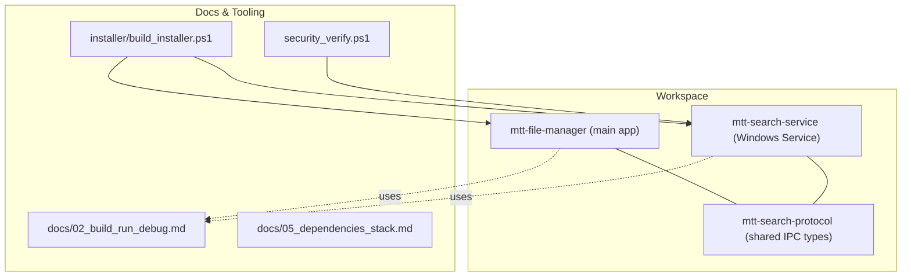
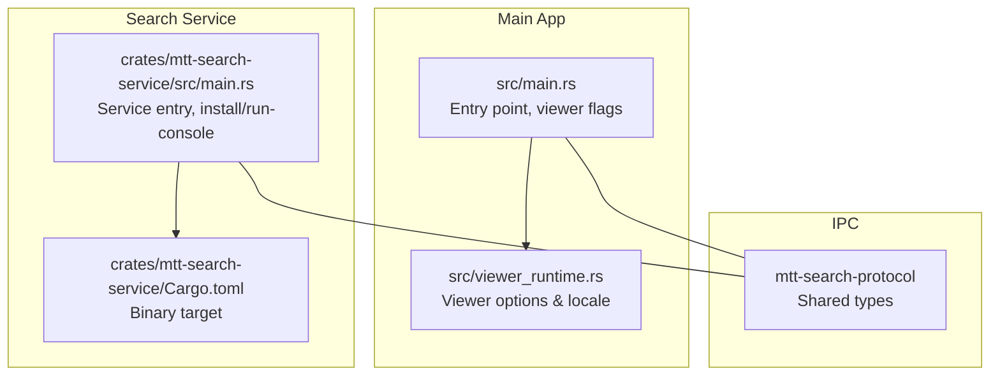
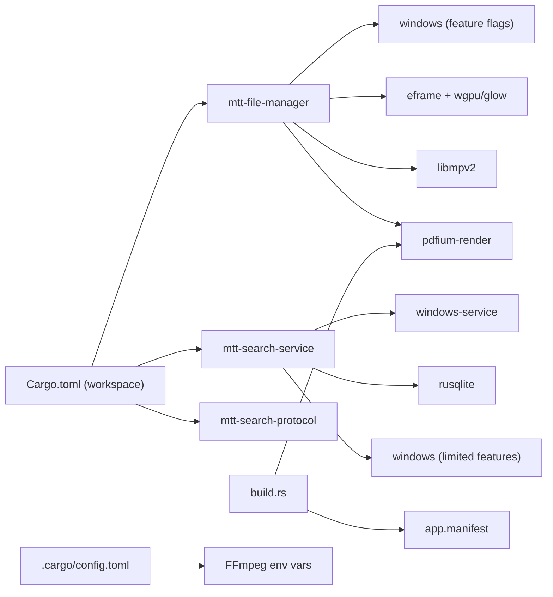

# Getting Started

<cite>
**Referenced Files in This Document**
- [README.md](file://README.md)
- [docs/02_build_run_debug.md](file://docs/02_build_run_debug.md)
- [docs/05_dependencies_stack.md](file://docs/05_dependencies_stack.md)
- [Cargo.toml](file://Cargo.toml)
- [build.rs](file://build.rs)
- [src/main.rs](file://src/main.rs)
- [src/viewer_runtime.rs](file://src/viewer_runtime.rs)
- [crates/mtt-search-service/src/main.rs](file://crates/mtt-search-service/src/main.rs)
- [crates/mtt-search-service/Cargo.toml](file://crates/mtt-search-service/Cargo.toml)
- [installer/build_installer.ps1](file://installer/build_installer.ps1)
- [run_with_logs.ps1](file://run_with_logs.ps1)
- [open_diagnostic_console.cmd](file://open_diagnostic_console.cmd)
- [.cargo/config.toml](file://.cargo/config.toml)
- [app.manifest](file://app.manifest)
- [security_verify.ps1](file://security_verify.ps1)
- [virtual_drive_config.json](file://virtual_drive_config.json)
</cite>

## Table of Contents
1. [Introduction](#introduction)
2. [Project Structure](#project-structure)
3. [Core Components](#core-components)
4. [Architecture Overview](#architecture-overview)
5. [Detailed Component Analysis](#detailed-component-analysis)
6. [Dependency Analysis](#dependency-analysis)
7. [Performance Considerations](#performance-considerations)
8. [Troubleshooting Guide](#troubleshooting-guide)
9. [Conclusion](#conclusion)
10. [Appendices](#appendices)

## Introduction
This guide helps you install, build, and run MTT File Manager from source or with pre-built releases. It covers:
- Installing prerequisites and setting up the development environment
- Building the full workspace, individual components, and release configurations
- Runtime dependencies and how they are staged
- Execution modes: main app, standalone viewers, and development logging
- Troubleshooting common setup issues and verification steps

## Project Structure
MTT File Manager is a Rust workspace with:
- A main application crate
- A companion search service crate
- A shared protocol crate used for IPC
- Documentation, installer, and auxiliary scripts

**Diagram sources**
- [Cargo.toml:1-3](file://Cargo.toml#L1-L3)
- [docs/02_build_run_debug.md:1-413](file://docs/02_build_run_debug.md#L1-L413)
- [docs/05_dependencies_stack.md:1-219](file://docs/05_dependencies_stack.md#L1-L219)
- [installer/build_installer.ps1:1-143](file://installer/build_installer.ps1#L1-L143)
- [security_verify.ps1:1-24](file://security_verify.ps1#L1-L24)

**Section sources**
- [Cargo.toml:1-3](file://Cargo.toml#L1-L3)
- [docs/02_build_run_debug.md:1-413](file://docs/02_build_run_debug.md#L1-L413)
- [docs/05_dependencies_stack.md:1-219](file://docs/05_dependencies_stack.md#L1-L219)

## Core Components
- Main application: a native Windows file manager with modern UI, media preview, and global search integration.
- Search service: a Windows Service that indexes volumes and exposes an IPC interface for search queries.
- Standalone viewers: image, PDF, text, and video players that reuse the same executable with mode flags.

Key runtime dependencies:
- libmpv-2.dll for video playback
- pdfium.dll for PDF rendering

**Section sources**
- [README.md:68-104](file://README.md#L68-L104)
- [docs/05_dependencies_stack.md:171-177](file://docs/05_dependencies_stack.md#L171-L177)
- [src/main.rs:143-215](file://src/main.rs#L143-L215)

## Architecture Overview
The main application and search service communicate via named pipes and shared IPC types. The viewer runtime is a lightweight path used by standalone viewers.

**Diagram sources**
- [src/main.rs:143-215](file://src/main.rs#L143-L215)
- [src/viewer_runtime.rs:1-86](file://src/viewer_runtime.rs#L1-L86)
- [crates/mtt-search-service/src/main.rs:112-156](file://crates/mtt-search-service/src/main.rs#L112-L156)
- [crates/mtt-search-service/Cargo.toml:6-8](file://crates/mtt-search-service/Cargo.toml#L6-L8)

**Section sources**
- [src/main.rs:143-215](file://src/main.rs#L143-L215)
- [crates/mtt-search-service/src/main.rs:112-156](file://crates/mtt-search-service/src/main.rs#L112-L156)

## Detailed Component Analysis

### Installation Options
- Pre-built releases: The installer bundles the main app, search service, libmpv-2.dll, pdfium.dll, portable mpv configuration, and notices. It also installs and starts the Windows service.
- Build from source: Use the workspace build to produce both executables and optionally the installer.

Verification artifacts validated by the installer:
- Executables and DLLs
- License and notice files
- Portable mpv configuration

**Section sources**
- [README.md:73-104](file://README.md#L73-L104)
- [README.md:199-237](file://README.md#L199-L237)
- [installer/build_installer.ps1:48-81](file://installer/build_installer.ps1#L48-L81)
- [installer/build_installer.ps1:82-109](file://installer/build_installer.ps1#L82-L109)

### Development Environment Setup
- Install Rust toolchain via rustup and set the default toolchain to the MSVC ABI.
- Install Visual Studio Build Tools or Visual Studio Community with:
  - MSVC v143 — VS 2022 C++ x64/x86 build tools
  - Windows 10/11 SDK
- Confirm installation with rustc and cargo versions.

**Section sources**
- [docs/02_build_run_debug.md:5-16](file://docs/02_build_run_debug.md#L5-L16)
- [docs/02_build_run_debug.md:365-369](file://docs/02_build_run_debug.md#L365-L369)

### Build Instructions
- Full workspace build (recommended for local testing):
  - cargo build --release --workspace
- Individual components:
  - cargo build -p mtt-file-manager
  - cargo build -p mtt-search-service
- Run modes:
  - cargo run (debug)
  - cargo run -- --image-viewer "<path>"
  - cargo run -- --pdf-viewer "<path>"
  - cargo run -- --text-viewer "<path>"
  - cargo run -- --video-player "<path>" [--position <seconds>] [--volume <0.0..1.0>]
- Release builds:
  - cargo build --release --workspace
  - .\target\release\mtt-file-manager.exe
  - .\target\release\mtt-search-service.exe run-console

Feature flags:
- Default: notify-watcher (fallback watcher for UNC/network paths)
- Disable with --no-default-features

Profiles:
- Dev profile: default dev settings
- Release profile: aggressive optimization and LTO

**Section sources**
- [docs/02_build_run_debug.md:58-98](file://docs/02_build_run_debug.md#L58-L98)
- [docs/02_build_run_debug.md:99-112](file://docs/02_build_run_debug.md#L99-L112)
- [docs/02_build_run_debug.md:113-131](file://docs/02_build_run_debug.md#L113-L131)
- [README.md:143-165](file://README.md#L143-L165)
- [README.md:167-197](file://README.md#L167-L197)

### Runtime Dependencies and Staging
- libmpv-2.dll: Required for video playback. Place it next to the executable or in PATH.
- pdfium.dll: Required for PDF viewer. The build process attempts to stage it automatically from known vendor locations or via an environment variable. Integrity checks are enforced in release builds.

Staging behavior:
- Automatic staging from vendor/ or PDFIUM_DYNAMIC_LIB_PATH
- Hash verification for security
- Manual placement if automatic staging fails

**Section sources**
- [README.md:68-104](file://README.md#L68-L104)
- [docs/02_build_run_debug.md:17-21](file://docs/02_build_run_debug.md#L17-L21)
- [docs/02_build_run_debug.md:37-47](file://docs/02_build_run_debug.md#L37-L47)
- [build.rs:77-138](file://build.rs#L77-L138)
- [build.rs:140-174](file://build.rs#L140-L174)

### Execution Modes
- Main application: normal operation with borderless window and integrated preview.
- Standalone viewers: separate processes from the same executable:
  - --image-viewer "<path>"
  - --pdf-viewer "<path>"
  - --text-viewer "<path>"
  - --video-player "<path>" [--position <seconds>] [--volume <0.0..1.0>]
- Viewer runtime: uses a lightweight Glow renderer and reads theme/language preferences from a read-only SQLite query.

**Section sources**
- [src/main.rs:143-215](file://src/main.rs#L143-L215)
- [src/viewer_runtime.rs:1-86](file://src/viewer_runtime.rs#L1-L86)

### Search Service (Windows Service)
- Build the service binary separately or via workspace.
- Install/uninstall as a Windows Service (requires Administrator).
- Run in console mode for debugging without installing.
- Status checks via service control manager.

**Section sources**
- [docs/02_build_run_debug.md:132-182](file://docs/02_build_run_debug.md#L132-L182)
- [crates/mtt-search-service/src/main.rs:129-156](file://crates/mtt-search-service/src/main.rs#L129-L156)
- [crates/mtt-search-service/Cargo.toml:6-8](file://crates/mtt-search-service/Cargo.toml#L6-L8)

### Installer Build
- The installer script builds release artifacts, validates required files and hashes, and compiles the Inno Setup installer.
- Requires Inno Setup 6 (ISCC.exe) in PATH or default install locations.
- Automatically installs and starts the Windows service.

**Section sources**
- [installer/build_installer.ps1:1-143](file://installer/build_installer.ps1#L1-L143)
- [docs/02_build_run_debug.md:183-224](file://docs/02_build_run_debug.md#L183-L224)

### Logging and Diagnostics
- Release builds run without a console window; launch from PowerShell to capture logs.
- Provided scripts:
  - run_with_logs.ps1: captures logs to a file
  - open_diagnostic_console.cmd: opens a persistent diagnostic console
- Environment variables for logging and diagnostics:
  - RUST_BACKTRACE, RUST_LOG, CARGO_INCREMENTAL

**Section sources**
- [docs/02_build_run_debug.md:225-267](file://docs/02_build_run_debug.md#L225-L267)
- [run_with_logs.ps1:1-12](file://run_with_logs.ps1#L1-L12)
- [open_diagnostic_console.cmd:1-6](file://open_diagnostic_console.cmd#L1-L6)
- [docs/02_build_run_debug.md:393-401](file://docs/02_build_run_debug.md#L393-L401)

### Security and Verification
- Security verification suite runs targeted tests for the search service and protocol.
- Installer validates third-party DLL integrity before packaging.

**Section sources**
- [security_verify.ps1:1-24](file://security_verify.ps1#L1-L24)
- [installer/build_installer.ps1:82-109](file://installer/build_installer.ps1#L82-L109)

## Dependency Analysis
Runtime and build-time dependencies are declared in the workspace and per-crate manifests. The build script handles embedding resources and staging pdfium.dll.

**Diagram sources**
- [Cargo.toml:1-137](file://Cargo.toml#L1-L137)
- [docs/05_dependencies_stack.md:1-219](file://docs/05_dependencies_stack.md#L1-L219)
- [build.rs:1-45](file://build.rs#L1-L45)
- [.cargo/config.toml:1-7](file://.cargo/config.toml#L1-L7)
- [app.manifest:1-44](file://app.manifest#L1-L44)

**Section sources**
- [Cargo.toml:1-137](file://Cargo.toml#L1-L137)
- [docs/05_dependencies_stack.md:1-219](file://docs/05_dependencies_stack.md#L1-L219)
- [build.rs:1-45](file://build.rs#L1-L45)
- [.cargo/config.toml:1-7](file://.cargo/config.toml#L1-L7)
- [app.manifest:1-44](file://app.manifest#L1-L44)

## Performance Considerations
- Release builds enable aggressive optimization and LTO for best performance.
- GPU backend selection prefers HighPerformance; viewer runtime uses a lightweight renderer to minimize memory footprint.
- DPI awareness and modern compatibility settings improve rendering performance and reliability.

**Section sources**
- [docs/02_build_run_debug.md:113-131](file://docs/02_build_run_debug.md#L113-L131)
- [docs/05_dependencies_stack.md:179-184](file://docs/05_dependencies_stack.md#L179-L184)
- [app.manifest:10-17](file://app.manifest#L10-L17)

## Troubleshooting Guide
Common issues and resolutions:
- libmpv-2.dll not found:
  - Place libmpv-2.dll next to the executable or add its directory to PATH.
- pdfium.dll not found:
  - Set PDFIUM_DYNAMIC_LIB_PATH before building, or copy pdfium.dll next to the executable.
- Renderer initialization failures:
  - Force OpenGL/ANGLE backend via WGPU_BACKEND for diagnostics.
- Slow builds:
  - Increase parallelism with cargo build --release -j N.
- Windows SDK errors:
  - Ensure MSVC v143 and Windows 10/11 SDK are installed.

Verification steps:
- Use installer validation to confirm required files and hashes.
- Run security verification suite for targeted tests.
- Use diagnostic console scripts to capture logs.

**Section sources**
- [docs/02_build_run_debug.md:321-369](file://docs/02_build_run_debug.md#L321-L369)
- [installer/build_installer.ps1:82-109](file://installer/build_installer.ps1#L82-L109)
- [security_verify.ps1:1-24](file://security_verify.ps1#L1-L24)

## Conclusion
You can install MTT File Manager via the provided installer or build from source using the documented commands. Ensure runtime dependencies are present, configure logging for diagnostics, and use the provided scripts and environment variables for reliable development and troubleshooting.

## Appendices

### Appendix A: Build and Run Commands
- Workspace build: cargo build --release --workspace
- App-only: cargo build -p mtt-file-manager
- Service-only: cargo build -p mtt-search-service
- Run main app: cargo run
- Run viewers: cargo run -- --image-viewer "<path>", --pdf-viewer "<path>", --text-viewer "<path>", --video-player "<path>"
- Release run: .\target\release\mtt-file-manager.exe
- Service console: .\target\release\mtt-search-service.exe run-console

**Section sources**
- [docs/02_build_run_debug.md:58-98](file://docs/02_build_run_debug.md#L58-L98)
- [README.md:143-165](file://README.md#L143-L165)

### Appendix B: Runtime Dependency Locations
- libmpv-2.dll: next to executable or in PATH
- pdfium.dll: vendor/ or PDFIUM_DYNAMIC_LIB_PATH; staged automatically by build.rs

**Section sources**
- [README.md:68-104](file://README.md#L68-L104)
- [docs/02_build_run_debug.md:17-21](file://docs/02_build_run_debug.md#L17-L21)
- [build.rs:77-138](file://build.rs#L77-L138)

### Appendix C: Installer Artifacts and Behavior
- Bundled artifacts include executables, DLLs, license/notice files, and portable mpv configuration.
- Installer validates hashes and warns about missing Microsoft Visual C++ Redistributable 2015-2022 (x64).

**Section sources**
- [README.md:199-237](file://README.md#L199-L237)
- [installer/build_installer.ps1:183-224](file://installer/build_installer.ps1#L183-L224)