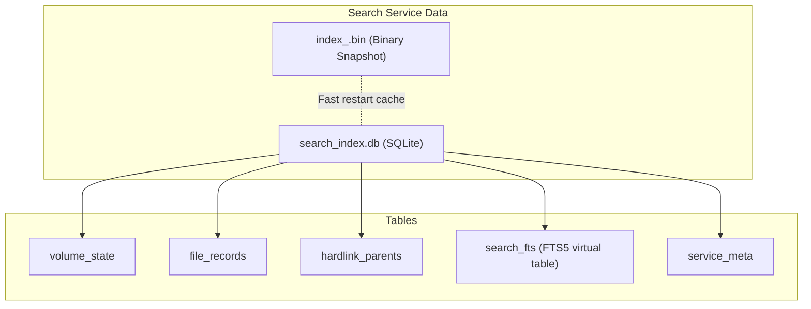
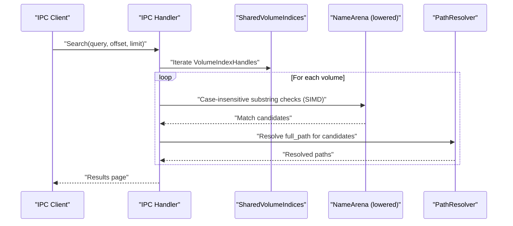
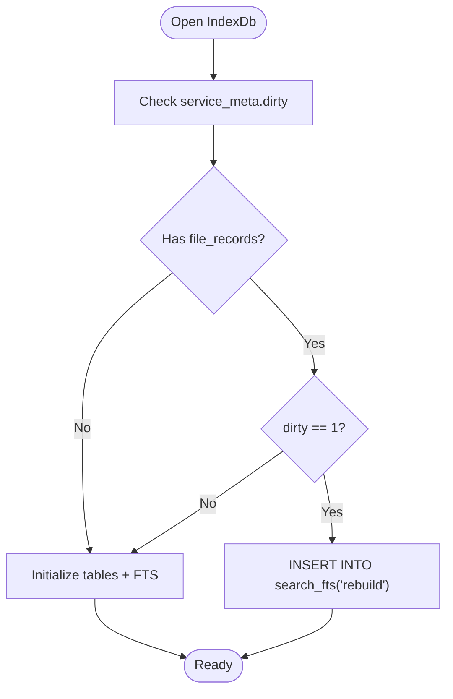
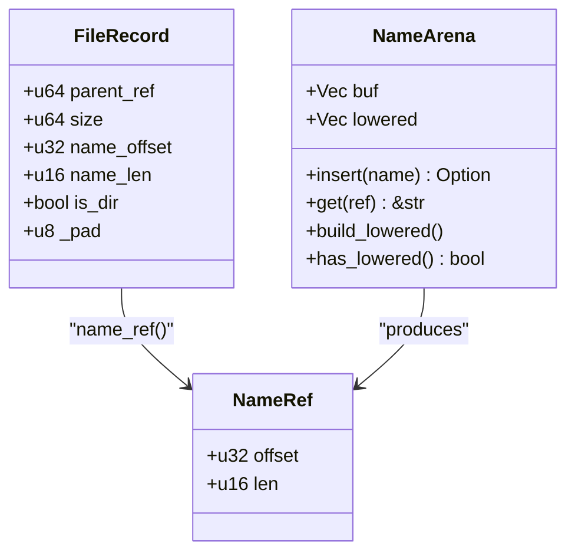
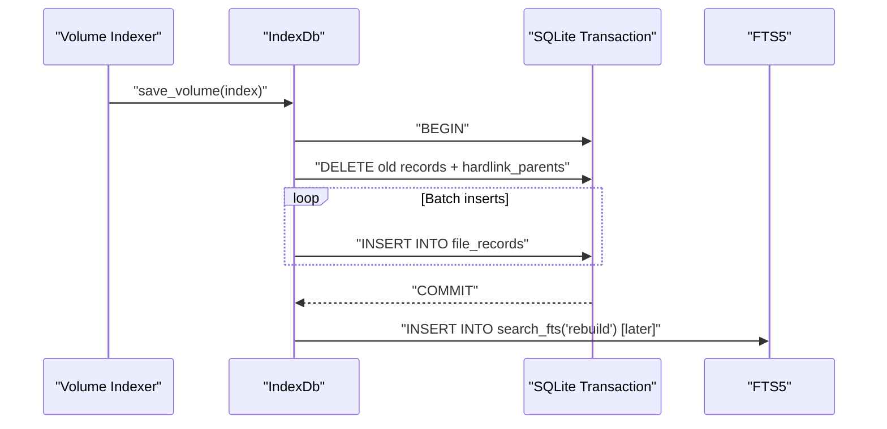
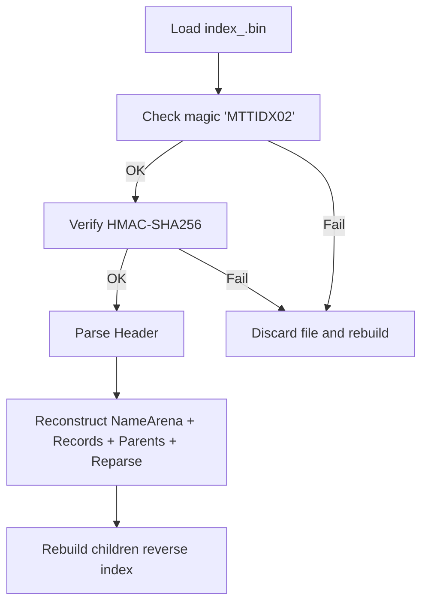
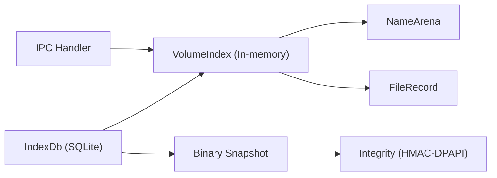

# Database Schema & Storage

<cite>
**Referenced Files in This Document**
- [index_db/mod.rs](file://crates/mtt-search-service/src/index_db/mod.rs)
- [index_db/sync.rs](file://crates/mtt-search-service/src/index_db/sync.rs)
- [index_db/binary.rs](file://crates/mtt-search-service/src/index_db/binary.rs)
- [index_db/integrity.rs](file://crates/mtt-search-service/src/index_db/integrity.rs)
- [name_arena.rs](file://crates/mtt-search-service/src/name_arena.rs)
- [file_index.rs](file://crates/mtt-search-service/src/file_index.rs)
- [main.rs](file://crates/mtt-search-service/src/main.rs)
- [07_storage_config.md](file://docs/07_storage_config.md)
- [ipc_server/handler.rs](file://crates/mtt-search-service/src/ipc_server/handler.rs)
</cite>

## Table of Contents
1. [Introduction](#introduction)
2. [Project Structure](#project-structure)
3. [Core Components](#core-components)
4. [Architecture Overview](#architecture-overview)
5. [Detailed Component Analysis](#detailed-component-analysis)
6. [Dependency Analysis](#dependency-analysis)
7. [Performance Considerations](#performance-considerations)
8. [Troubleshooting Guide](#troubleshooting-guide)
9. [Conclusion](#conclusion)

## Introduction
This document describes the SQLite-based storage system used by the search service. It explains the database schema, the in-memory index design, the name arena optimization, the FTS5 integration, and the database lifecycle including creation, migration, and cleanup. It also covers transaction management, concurrent access patterns, data integrity, performance tuning, backup strategies, and troubleshooting database corruption.

## Project Structure
The search service maintains a dedicated SQLite database under a protected system-wide directory. The database schema consists of:
- A persistent SQLite database for indexing state and records
- A virtual FTS5 table for legacy compatibility
- A per-volume binary snapshot for fast restart and integrity protection

**Diagram sources**
- [index_db/mod.rs:299-327](file://crates/mtt-search-service/src/index_db/mod.rs#L299-L327)
- [index_db/binary.rs:3-16](file://crates/mtt-search-service/src/index_db/binary.rs#L3-L16)
- [07_storage_config.md:144-221](file://docs/07_storage_config.md#L144-L221)

**Section sources**
- [index_db/mod.rs:55-77](file://crates/mtt-search-service/src/index_db/mod.rs#L55-L77)
- [07_storage_config.md:17-21](file://docs/07_storage_config.md#L17-L21)

## Core Components
- IndexDb: Wraps a SQLite connection, manages schema, FTS5, and service metadata. Provides save/load operations and FTS rebuilds.
- VolumeIndex: In-memory index for a single NTFS volume with compact records and a name arena.
- NameArena: Contiguous byte arena for file names with compact references and optional lowered-case buffer for fast search.
- Binary snapshot: A compact, authenticated, and machine-bound cache of the in-memory index for fast restart.

Key schema tables:
- volume_state: Per-drive indexing metadata and flags
- file_records: Core file/folder records with FRN, parent FRN, name, directory flag, and reparse flag
- hardlink_parents: Additional parent FRNs for hardlinked files
- search_fts: Legacy FTS5 virtual table (still present for compatibility)
- service_meta: Service-wide flags (e.g., dirty flag)

**Section sources**
- [index_db/mod.rs:26-33](file://crates/mtt-search-service/src/index_db/mod.rs#L26-L33)
- [index_db/mod.rs:299-327](file://crates/mtt-search-service/src/index_db/mod.rs#L299-L327)
- [file_index.rs:18-36](file://crates/mtt-search-service/src/file_index.rs#L18-L36)
- [name_arena.rs:17-23](file://crates/mtt-search-service/src/name_arena.rs#L17-L23)
- [index_db/binary.rs:3-16](file://crates/mtt-search-service/src/index_db/binary.rs#L3-L16)

## Architecture Overview
The system balances fast in-memory search with durable persistence:
- Live search queries use the in-memory lowered NameArena and a linear scan over records
- SQLite persists records and metadata for durability and fast restart
- FTS5 is maintained as a legacy artifact; live queries do not rely on it
- A binary snapshot provides authenticated, machine-bound fast restart

**Diagram sources**
- [ipc_server/handler.rs:248-265](file://crates/mtt-search-service/src/ipc_server/handler.rs#L248-L265)
- [file_index.rs:664-770](file://crates/mtt-search-service/src/file_index.rs#L664-L770)

**Section sources**
- [ipc_server/handler.rs:229-265](file://crates/mtt-search-service/src/ipc_server/handler.rs#L229-L265)
- [file_index.rs:664-770](file://crates/mtt-search-service/src/file_index.rs#L664-L770)

## Detailed Component Analysis

### Database Schema and Lifecycle
- Creation and location: The database file resides under a protected system directory. The path is derived at startup and validated to avoid junction-planting attacks.
- Pragmas: WAL mode and NORMAL synchronous are applied for concurrency and performance.
- Tables:
  - volume_state: Tracks journal ID, last USN, file counts, timestamps, and completeness flags for hardlink and reparse data.
  - file_records: Stores FRN, drive letter, name, parent FRN, directory flag, and reparse flag. Primary key is (drive_letter, frn).
  - hardlink_parents: Stores additional parent FRNs for hardlinked files. Primary key is (drive_letter, frn, parent_frn).
  - search_fts: Legacy FTS5 virtual table over file_records.name; used for compatibility.
  - service_meta: Stores a dirty flag to detect crash-induced shutdowns and trigger FTS rebuilds.
- Migration: The schema migrates automatically when the database is opened, adding missing columns and tables as needed.
- Dirty-shutdown detection: On startup, if records exist and the dirty flag is set, the system rebuilds the legacy FTS table to ensure consistency.

**Diagram sources**
- [index_db/mod.rs:342-380](file://crates/mtt-search-service/src/index_db/mod.rs#L342-L380)

**Section sources**
- [index_db/mod.rs:282-385](file://crates/mtt-search-service/src/index_db/mod.rs#L282-L385)
- [index_db/mod.rs:412-504](file://crates/mtt-search-service/src/index_db/mod.rs#L412-L504)
- [index_db/mod.rs:334-380](file://crates/mtt-search-service/src/index_db/mod.rs#L334-L380)

### FileRecord Structure and Name Storage
- FileRecord: A compact, 24-byte structure stored in-memory with fields for parent FRN, size, name offset/length in the NameArena, directory flag, and padding. This minimizes memory footprint and improves cache locality.
- NameArena: A contiguous byte buffer storing all file names. Each name is referenced by a compact NameRef (offset, length). The arena supports a lazily-built lowered-case buffer for efficient case-insensitive substring search.
- Compact references: NameRef fits in 6 bytes when packed with FileRecord, avoiding heap allocations per name.

**Diagram sources**
- [file_index.rs:18-36](file://crates/mtt-search-service/src/file_index.rs#L18-L36)
- [name_arena.rs:17-23](file://crates/mtt-search-service/src/name_arena.rs#L17-L23)
- [name_arena.rs:26-31](file://crates/mtt-search-service/src/name_arena.rs#L26-L31)

**Section sources**
- [file_index.rs:18-36](file://crates/mtt-search-service/src/file_index.rs#L18-L36)
- [name_arena.rs:17-23](file://crates/mtt-search-service/src/name_arena.rs#L17-L23)
- [name_arena.rs:25-31](file://crates/mtt-search-service/src/name_arena.rs#L25-L31)

### Transaction Management and Concurrent Access
- Concurrency model:
  - SQLite uses WAL mode for improved concurrency; readers do not block writers.
  - The database connection is wrapped in a mutex to satisfy Sync requirements for rusqlite.
  - The in-memory index is protected by read/write locks per volume; search queries scan volumes independently and briefly.
- Transactions:
  - Saves are performed in batches with unchecked transactions to keep WAL bounded.
  - Incremental FTS sync uses a single transaction to minimize overhead.
- FTS maintenance:
  - Full rebuilds are deferred after volume saves and executed in a background thread to avoid blocking queries.
  - An FTS state guard prevents stale rebuilds from marking the index ready.

**Diagram sources**
- [index_db/sync.rs:16-173](file://crates/mtt-search-service/src/index_db/sync.rs#L16-L173)
- [index_db/sync.rs:180-191](file://crates/mtt-search-service/src/index_db/sync.rs#L180-L191)
- [main.rs:31-62](file://crates/mtt-search-service/src/main.rs#L31-L62)

**Section sources**
- [index_db/sync.rs:16-173](file://crates/mtt-search-service/src/index_db/sync.rs#L16-L173)
- [index_db/sync.rs:180-191](file://crates/mtt-search-service/src/index_db/sync.rs#L180-L191)
- [main.rs:31-62](file://crates/mtt-search-service/src/main.rs#L31-L62)

### FTS5 Integration
- Legacy FTS5 virtual table: Created with trigram tokenization and configured to index the name column from file_records.
- Current runtime: Live search queries do not use FTS5; they rely on the in-memory lowered NameArena and a linear scan for correctness and performance.
- Compatibility: The table remains for backward compatibility and is rebuilt when dirty-shutdown is detected.

**Section sources**
- [index_db/mod.rs:319-327](file://crates/mtt-search-service/src/index_db/mod.rs#L319-L327)
- [index_db/mod.rs:366-379](file://crates/mtt-search-service/src/index_db/mod.rs#L366-L379)
- [07_storage_config.md:199-203](file://docs/07_storage_config.md#L199-L203)

### Binary Snapshot Format and Integrity
- Purpose: Provide fast restart and authenticated persistence of the in-memory index.
- Format: MTTIDX02 with a 72-byte header, NameArena bytes, packed records, hardlink pairs, reparse-point FRNs, and a 32-byte HMAC-SHA256 trailer.
- Integrity: HMAC-SHA256 over the entire payload, keyed by a per-machine DPAPI-sealed key. Legacy CRC32 format is discarded and rebuilt.
- Loading: Validates magic, checks HMAC, parses header, reconstructs in-memory structures, and rebuilds reverse indices.

**Diagram sources**
- [index_db/binary.rs:208-397](file://crates/mtt-search-service/src/index_db/binary.rs#L208-L397)
- [index_db/integrity.rs:47-72](file://crates/mtt-search-service/src/index_db/integrity.rs#L47-L72)

**Section sources**
- [index_db/binary.rs:3-16](file://crates/mtt-search-service/src/index_db/binary.rs#L3-L16)
- [index_db/binary.rs:208-397](file://crates/mtt-search-service/src/index_db/binary.rs#L208-L397)
- [index_db/integrity.rs:1-22](file://crates/mtt-search-service/src/index_db/integrity.rs#L1-L22)

### Database Security and Hardening
- Directory hardening: The data directory is created/opened with ACLs applied to the kernel handle, preventing junction-planting attacks. Reparse points are validated before applying ACLs.
- Service metadata: The dirty flag is set on startup and cleared on clean shutdown to detect and recover from crashes.
- Binary integrity: HMAC-SHA256 with a machine-bound key ensures tamper detection and prevents replay attacks.

**Section sources**
- [index_db/mod.rs:87-280](file://crates/mtt-search-service/src/index_db/mod.rs#L87-L280)
- [index_db/mod.rs:342-356](file://crates/mtt-search-service/src/index_db/mod.rs#L342-L356)
- [index_db/integrity.rs:47-72](file://crates/mtt-search-service/src/index_db/integrity.rs#L47-L72)

## Dependency Analysis
- IndexDb depends on rusqlite and SQLite pragmas for concurrency and durability.
- VolumeIndex depends on NameArena and FileRecord for compact storage.
- IPC handler depends on SharedVolumeIndices and path resolver to produce results.
- Binary snapshot depends on integrity module for HMAC computation and DPAPI key management.

**Diagram sources**
- [index_db/mod.rs:282-385](file://crates/mtt-search-service/src/index_db/mod.rs#L282-L385)
- [file_index.rs:58-104](file://crates/mtt-search-service/src/file_index.rs#L58-L104)
- [ipc_server/handler.rs:248-265](file://crates/mtt-search-service/src/ipc_server/handler.rs#L248-L265)
- [index_db/binary.rs:208-397](file://crates/mtt-search-service/src/index_db/binary.rs#L208-L397)
- [index_db/integrity.rs:47-72](file://crates/mtt-search-service/src/index_db/integrity.rs#L47-L72)

**Section sources**
- [index_db/mod.rs:282-385](file://crates/mtt-search-service/src/index_db/mod.rs#L282-L385)
- [file_index.rs:58-104](file://crates/mtt-search-service/src/file_index.rs#L58-L104)
- [ipc_server/handler.rs:248-265](file://crates/mtt-search-service/src/ipc_server/handler.rs#L248-L265)
- [index_db/binary.rs:208-397](file://crates/mtt-search-service/src/index_db/binary.rs#L208-L397)
- [index_db/integrity.rs:47-72](file://crates/mtt-search-service/src/index_db/integrity.rs#L47-L72)

## Performance Considerations
- In-memory search: Uses a lowered NameArena and SIMD-accelerated substring matching for fast, allocation-free queries.
- SQLite concurrency: WAL mode and NORMAL synchronous improve throughput and reduce writer blocking.
- Batched writes: Volume saves use large batched commits to keep WAL bounded and reduce checkpoint overhead.
- FTS maintenance: Full rebuilds are offloaded to background threads to avoid impacting live queries.
- Memory layout: FileRecord is tightly packed to minimize memory usage and improve cache locality.

[No sources needed since this section provides general guidance]

## Troubleshooting Guide
- Database path issues:
  - The service derives the database path from a protected system directory and validates it to prevent junction-planting. If ACL hardening fails, the service logs warnings and may fall back to an in-memory database.
- Dirty shutdown and FTS rebuild:
  - If the dirty flag is set at startup, the service rebuilds the legacy FTS table to ensure consistency.
- Binary snapshot corruption:
  - If the binary snapshot has a bad magic or HMAC mismatch, the file is deleted and the service rebuilds it from SQLite.
- Backup and restore:
  - The search service database and binary snapshots reside under the system data directory. Backups should preserve both the SQLite database and the binary snapshot files for a complete restart cache.

**Section sources**
- [index_db/mod.rs:55-77](file://crates/mtt-search-service/src/index_db/mod.rs#L55-L77)
- [index_db/mod.rs:342-380](file://crates/mtt-search-service/src/index_db/mod.rs#L342-L380)
- [index_db/binary.rs:225-251](file://crates/mtt-search-service/src/index_db/binary.rs#L225-L251)
- [07_storage_config.md:17-21](file://docs/07_storage_config.md#L17-L21)

## Conclusion
The search service employs a hybrid design: fast in-memory search powered by a compact, SIMD-friendly name arena and a linear scan, with durable persistence via SQLite and an authenticated binary snapshot. The SQLite schema is minimal and robust, with automatic migrations and a legacy FTS5 table retained for compatibility. Concurrency is handled through WAL mode and careful transaction batching, while integrity is ensured by machine-bound HMAC and directory hardening. This combination delivers responsive search performance, reliable durability, and strong security.