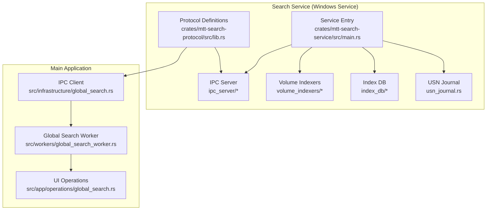
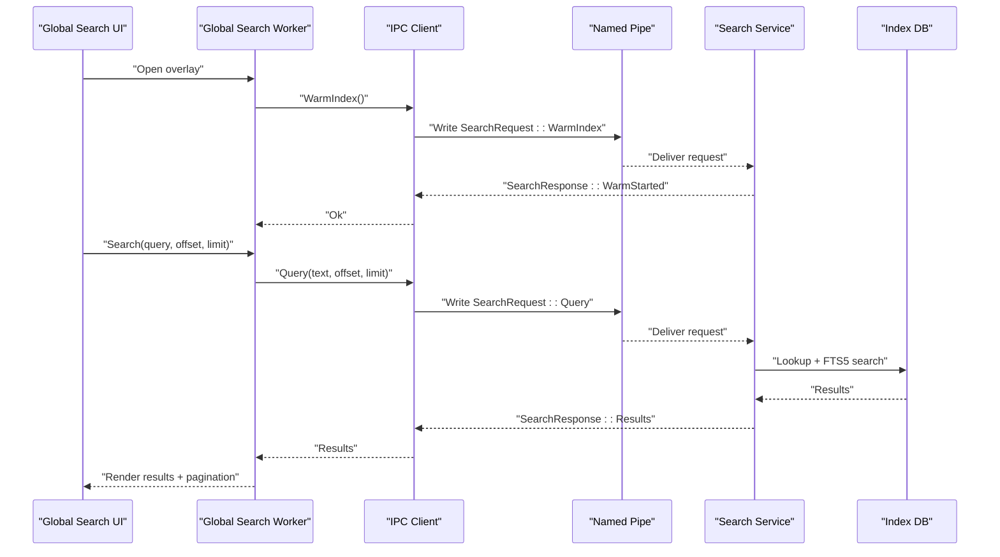
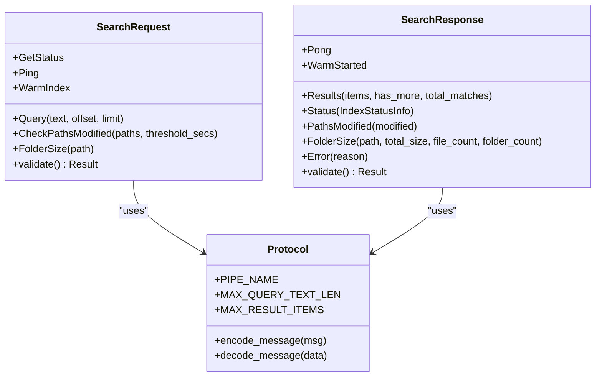
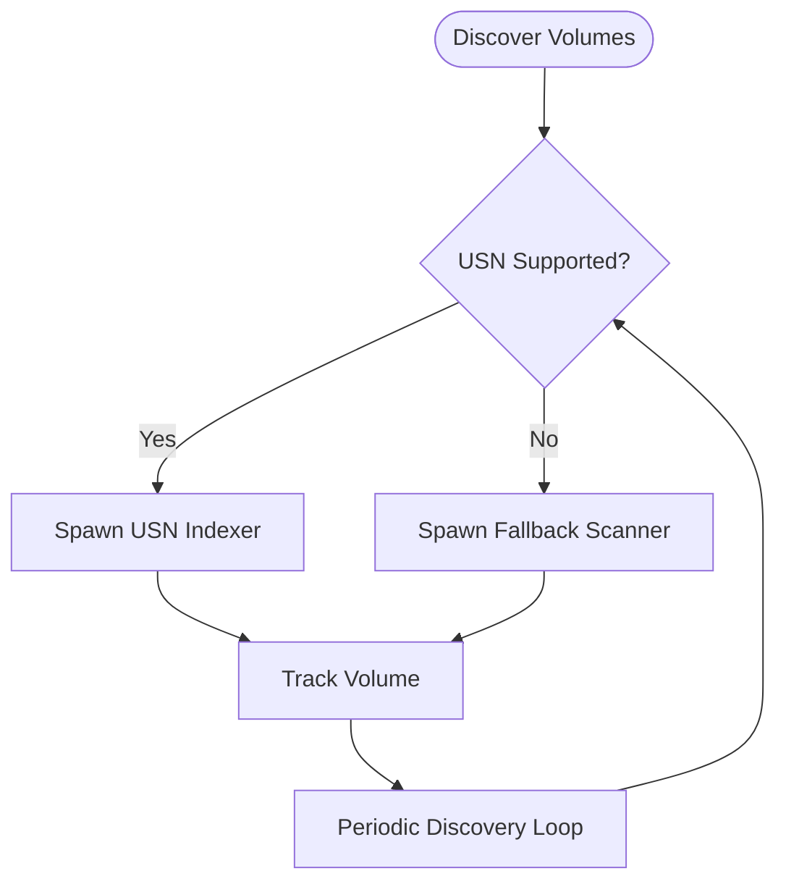
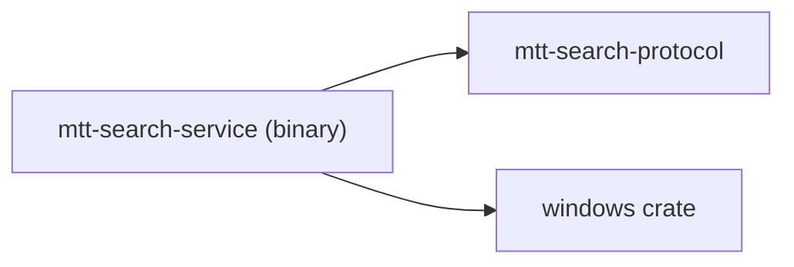

# Global Search Service

<cite>
**Referenced Files in This Document**
- [main.rs](file://crates/mtt-search-service/src/main.rs)
- [Cargo.toml](file://crates/mtt-search-service/Cargo.toml)
- [lib.rs](file://crates/mtt-search-protocol/src/lib.rs)
- [global_search.rs](file://src/infrastructure/global_search.rs)
- [global_search_worker.rs](file://src/workers/global_search_worker.rs)
- [global_search.rs](file://src/app/operations/global_search.rs)
</cite>

## Table of Contents
1. [Introduction](#introduction)
2. [Project Structure](#project-structure)
3. [Core Components](#core-components)
4. [Architecture Overview](#architecture-overview)
5. [Detailed Component Analysis](#detailed-component-analysis)
6. [Dependency Analysis](#dependency-analysis)
7. [Performance Considerations](#performance-considerations)
8. [Troubleshooting Guide](#troubleshooting-guide)
9. [Conclusion](#conclusion)
10. [Appendices](#appendices)

## Introduction
This document explains the MTT File Manager’s Global Search Service: a dedicated Windows service that provides near-instant search across millions of files. It covers the hybrid indexing strategy (USN journal for NTFS/ReFS with fallback full-tree scanning for other file systems), the SQLite-backed metadata storage, the IPC protocol over named pipes with bincode serialization, the search algorithm and ranking, pagination, service lifecycle, and operational guidance for installation, configuration, tuning, and troubleshooting.

## Project Structure
The global search capability spans two primary areas:
- The search service binary and its subsystems (indexing, IPC server, volume indexers, database, USN handling)
- The client-side integration in the main application (IPC client, worker, UI orchestration)

**Diagram sources**
- [main.rs:112-307](file://crates/mtt-search-service/src/main.rs#L112-L307)
- [lib.rs:1-290](file://crates/mtt-search-protocol/src/lib.rs#L1-L290)
- [global_search.rs:1-580](file://src/infrastructure/global_search.rs#L1-L580)
- [global_search_worker.rs:1-594](file://src/workers/global_search_worker.rs#L1-L594)
- [global_search.rs:1-82](file://src/app/operations/global_search.rs#L1-L82)

**Section sources**
- [main.rs:112-307](file://crates/mtt-search-service/src/main.rs#L112-L307)
- [Cargo.toml:1-33](file://crates/mtt-search-service/Cargo.toml#L1-L33)
- [lib.rs:1-290](file://crates/mtt-search-protocol/src/lib.rs#L1-L290)
- [global_search.rs:1-580](file://src/infrastructure/global_search.rs#L1-L580)
- [global_search_worker.rs:1-594](file://src/workers/global_search_worker.rs#L1-L594)
- [global_search.rs:1-82](file://src/app/operations/global_search.rs#L1-L82)

## Core Components
- Service entry and lifecycle: initializes shared state, starts the IPC server, discovers volumes, spawns per-volume indexers, and manages shutdown.
- Protocol: defines the named pipe endpoint, message types, limits, and bincode encoding/decoding helpers.
- IPC client: connects to the service, sends requests, validates responses, and performs server identity verification.
- Worker: orchestrates search requests, merges service results with a local session index, handles retries, and updates UI status.
- UI: opens/closes the global search overlay and configures paging.

Key responsibilities:
- Hybrid indexing: USN journal for NTFS/ReFS; fallback scanning for other file systems.
- SQLite index: stores file metadata and supports FTS5-based search.
- IPC: robust named pipe transport with length-prefixed bincode messages and strict validation.
- Search: paginated results with optional total count computation and local fallback.

**Section sources**
- [main.rs:112-307](file://crates/mtt-search-service/src/main.rs#L112-L307)
- [lib.rs:1-290](file://crates/mtt-search-protocol/src/lib.rs#L1-L290)
- [global_search.rs:1-580](file://src/infrastructure/global_search.rs#L1-L580)
- [global_search_worker.rs:1-594](file://src/workers/global_search_worker.rs#L1-L594)
- [global_search.rs:1-82](file://src/app/operations/global_search.rs#L1-L82)

## Architecture Overview
The service runs as a Windows Service and exposes a named pipe interface. The main application communicates over this pipe to query the index, warm the in-memory index, check for modified paths, and compute folder sizes from the MFT-derived index.

**Diagram sources**
- [global_search.rs:22-55](file://src/infrastructure/global_search.rs#L22-L55)
- [global_search_worker.rs:428-577](file://src/workers/global_search_worker.rs#L428-L577)
- [lib.rs:165-192](file://crates/mtt-search-protocol/src/lib.rs#L165-L192)
- [main.rs:298-303](file://crates/mtt-search-service/src/main.rs#L298-L303)

## Detailed Component Analysis

### Service Entry and Lifecycle
- Initializes shared state (indices, progress, FTS readiness), opens the SQLite index database, and starts the IPC server immediately.
- Discovers volumes and spawns per-volume indexers; continuously re-discovers volumes to catch newly mounted drives.
- Supports install/uninstall/run-console commands and integrates with Windows SCM.

Operational highlights:
- FTS state tracks readiness and generation to avoid serving stale FTS results during rebuilds.
- Console mode supports Ctrl+C shutdown with a shared atomic flag.
- Security hardening removes current working directory from DLL search order when running as LocalSystem.

**Section sources**
- [main.rs:112-307](file://crates/mtt-search-service/src/main.rs#L112-L307)

### IPC Protocol and Serialization
- Named pipe endpoint constant defines the pipe name.
- Message types include queries, status, ping, warm index, modified path checks, and folder size requests.
- Responses mirror requests with results, status info, pong, warm-started, modified paths, folder size, or error.
- Bincode serialization with a 4-byte little-endian length prefix; decoding uses an explicit payload size limit to prevent OOM.
- Requests and responses include strict validation to reject oversized payloads or malformed fields.

**Diagram sources**
- [lib.rs:17-132](file://crates/mtt-search-protocol/src/lib.rs#L17-L132)
- [lib.rs:165-192](file://crates/mtt-search-protocol/src/lib.rs#L165-L192)

**Section sources**
- [lib.rs:1-290](file://crates/mtt-search-protocol/src/lib.rs#L1-L290)

### IPC Client (Application Side)
- Opens the named pipe with impersonation flags to allow the service to access client-restricted resources.
- Verifies the pipe server process identity: accepts higher-privilege peers by default, or validates executable name and SID for equal-privilege peers.
- Implements robust read/write helpers with timeouts, length-prefix framing, and payload validation.
- Provides convenience functions: search, warm index, ping, get status, check paths modified, and folder size.

Security and reliability:
- Treats “all pipe instances are busy” as a transient condition indicating the service is alive.
- Validates response payloads against configured limits.

**Section sources**
- [global_search.rs:22-580](file://src/infrastructure/global_search.rs#L22-L580)

### Global Search Worker
- Receives UI requests, coalesces rapid inputs, and coordinates with the IPC client.
- Merges service results with a local session index to improve completeness and responsiveness.
- Implements retry logic for transient IPC errors, with proactive index warming.
- Computes total matches by paging through the service index when needed, and falls back to local counts when the service is unavailable.

Behavioral details:
- Skips service queries for very short terms and falls back to local search.
- Normalizes result paths to reduce duplicates across normalization variants.
- Controls status polling frequency based on indexing activity and UI tracking state.

**Section sources**
- [global_search_worker.rs:1-594](file://src/workers/global_search_worker.rs#L1-L594)

### UI Integration
- Opens the global search overlay, resets state, and toggles status tracking.
- Configures default page size and clears caches on close.

**Section sources**
- [global_search.rs:1-82](file://src/app/operations/global_search.rs#L1-L82)

### Hybrid Indexing Strategy
- NTFS/ReFS volumes: USN journal-based incremental indexing to capture file system events efficiently.
- Other file systems: fallback full-tree scanning to ensure coverage.
- Per-volume indexers are spawned and tracked independently; newly discovered volumes are continuously monitored.

**Diagram sources**
- [main.rs:243-289](file://crates/mtt-search-service/src/main.rs#L243-L289)
- [main.rs:341-387](file://crates/mtt-search-service/src/main.rs#L341-L387)

**Section sources**
- [main.rs:243-289](file://crates/mtt-search-service/src/main.rs#L243-L289)
- [main.rs:341-387](file://crates/mtt-search-service/src/main.rs#L341-L387)

### SQLite Database Schema and Indexing
- The service maintains an index database for file metadata and search indexes.
- FTS5 is used for full-text search; a generation-based readiness mechanism ensures consistent reads during rebuilds.
- The service exposes a FolderSize operation that computes subtree totals from an in-memory MFT-derived index for NTFS volumes.

Note: The schema and table definitions are encapsulated within the index database module and are not reproduced here. Refer to the index database module for precise schema details.

**Section sources**
- [main.rs:226-227](file://crates/mtt-search-service/src/main.rs#L226-L227)
- [lib.rs:39-44](file://crates/mtt-search-protocol/src/lib.rs#L39-L44)

### Search Algorithm, Ranking, and Pagination
- Pagination: clients specify offset and limit; the service returns has_more to indicate additional pages.
- Ranking: the protocol does not define explicit ranking fields; results are returned as-is from the index.
- Total count: when requested at offset 0, the worker may page through results to compute an exact total, merging with local counts.
- Local fallback: when the service is unavailable, the worker falls back to a local session index for results and counts.

**Section sources**
- [lib.rs:18-45](file://crates/mtt-search-protocol/src/lib.rs#L18-L45)
- [global_search_worker.rs:428-577](file://src/workers/global_search_worker.rs#L428-L577)

### IPC Communication Protocol Details
- Transport: Windows named pipe with impersonation flags to support client-side resource access.
- Framing: 4-byte little-endian length prefix followed by bincode payload.
- Validation: strict limits on query length, result count, and payload size; requests/responses are validated before processing.
- Server verification: verifies the pipe server process identity to prevent spoofing.

**Section sources**
- [lib.rs:165-192](file://crates/mtt-search-protocol/src/lib.rs#L165-L192)
- [global_search.rs:226-472](file://src/infrastructure/global_search.rs#L226-L472)

## Dependency Analysis
The search service binary depends on the protocol crate and Windows APIs for pipes, IO, and security. The main application depends on the protocol crate and the Windows named pipe client implementation.

**Diagram sources**
- [Cargo.toml:9-32](file://crates/mtt-search-service/Cargo.toml#L9-L32)

**Section sources**
- [Cargo.toml:1-33](file://crates/mtt-search-service/Cargo.toml#L1-L33)

## Performance Considerations
- Warm index: proactively brings paged-out index pages into RAM to reduce latency on first queries.
- Paging: use reasonable offsets/lots to balance latency and throughput.
- Retry and backoff: transient IPC errors trigger retries and index warming to mitigate temporary saturation.
- Status tracking: adjust polling intervals based on indexing activity to reduce overhead.
- FTS readiness: avoid serving stale results during rebuilds; the service marks FTS as invalid during saves and increments a generation to gate rebuild completion.

[No sources needed since this section provides general guidance]

## Troubleshooting Guide
Common symptoms and remedies:
- Service not available: verify the Windows service is installed and running; use install/uninstall/run-console commands.
- Pipe busy or transient failures: the client treats “all pipe instances are busy” as healthy; retry after a brief delay.
- Server verification failures: indicates a potential pipe squatting attempt; ensure the server process is the legitimate service binary and runs with appropriate privileges.
- Slow or unresponsive queries: trigger warm index; monitor status to confirm indexing progress.
- Excessive results or timeouts: reduce query scope or increase limits cautiously; the service enforces maximums to protect stability.

**Section sources**
- [main.rs:129-156](file://crates/mtt-search-service/src/main.rs#L129-L156)
- [global_search.rs:80-130](file://src/infrastructure/global_search.rs#L80-L130)
- [global_search.rs:226-472](file://src/infrastructure/global_search.rs#L226-L472)

## Conclusion
The Global Search Service delivers scalable, near-instant search across heterogeneous file systems by combining USN journal-based indexing on NTFS/ReFS with fallback scanning elsewhere, persisting metadata in SQLite, and exposing a robust IPC protocol over named pipes with bincode serialization. The main application integrates seamlessly via a worker that merges service results with a local session index, implements retries, and provides responsive pagination and status tracking.

[No sources needed since this section summarizes without analyzing specific files]

## Appendices

### Installation and Lifecycle Management
- Build the workspace to produce both the main application and the search service binaries.
- Install the service to run under LocalSystem; uninstall to remove.
- Run in console mode for development and debugging.

**Section sources**
- [main.rs:129-156](file://crates/mtt-search-service/src/main.rs#L129-L156)

### Operational Notes
- The service logs discovery of volumes and indexer startup.
- The IPC client verifies the server process identity to prevent impersonation attacks.
- The worker primes the service index on startup and periodically refreshes status.

**Section sources**
- [main.rs:243-260](file://crates/mtt-search-service/src/main.rs#L243-L260)
- [global_search.rs:285-415](file://src/infrastructure/global_search.rs#L285-L415)
- [global_search_worker.rs:345-359](file://src/workers/global_search_worker.rs#L345-L359)