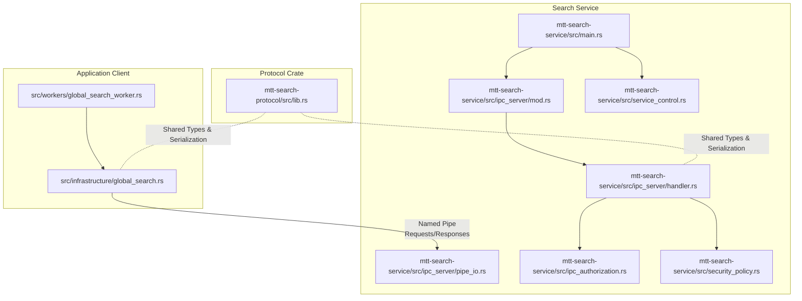
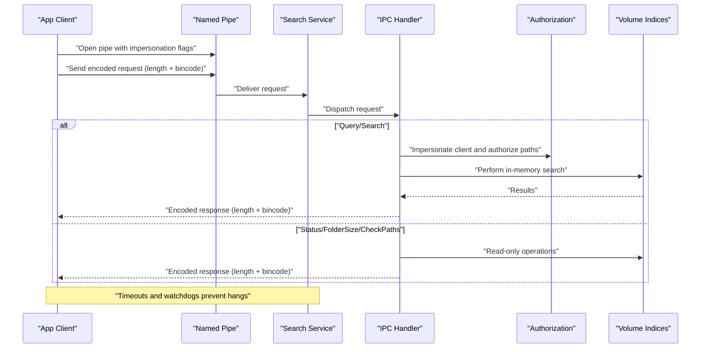
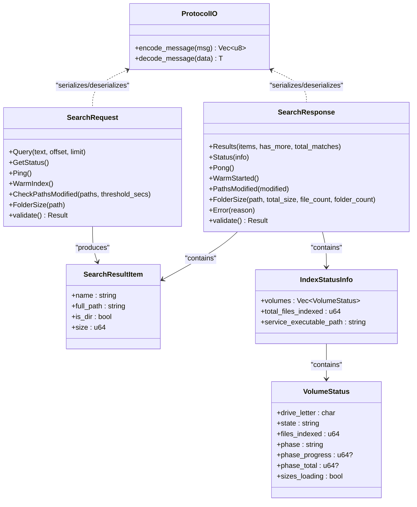
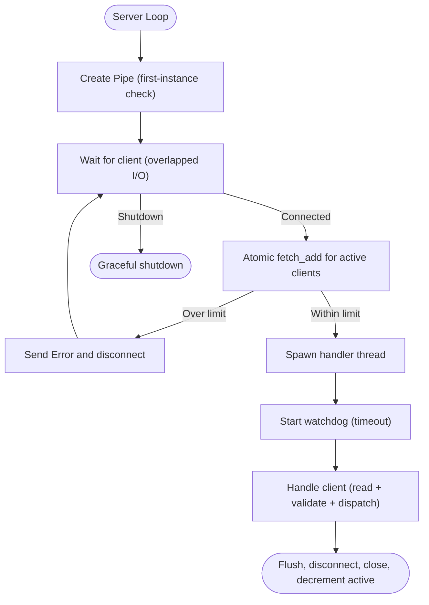
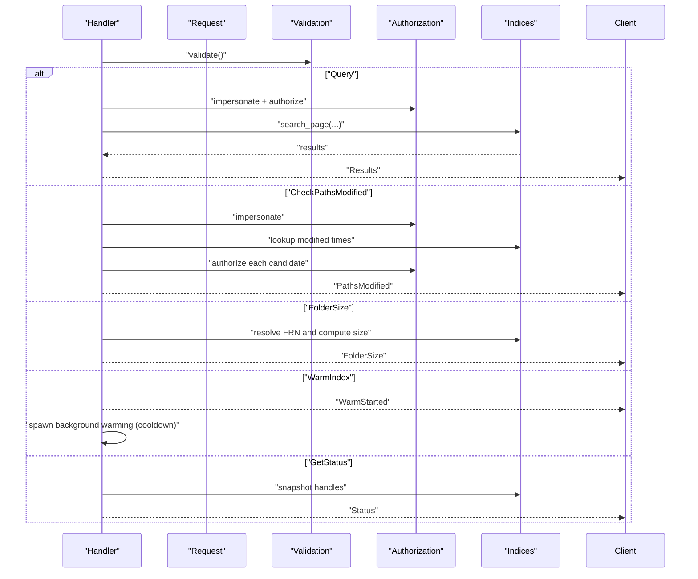
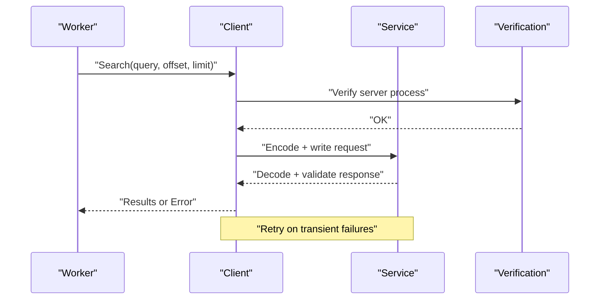
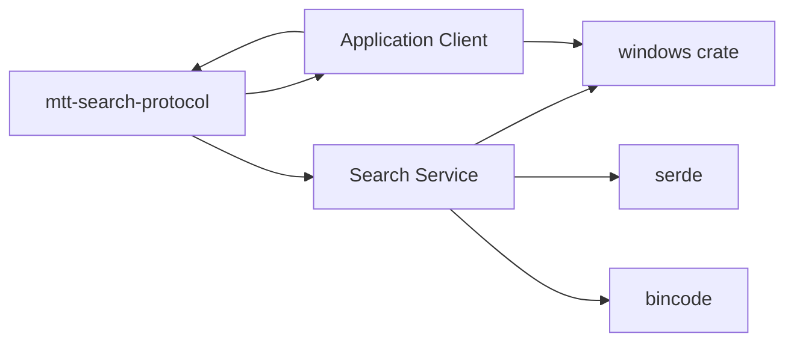

# IPC Communication Protocol

<cite>
**Referenced Files in This Document**
- [lib.rs](file://crates/mtt-search-protocol/src/lib.rs)
- [Cargo.toml](file://crates/mtt-search-protocol/Cargo.toml)
- [mod.rs](file://crates/mtt-search-service/src/ipc_server/mod.rs)
- [handler.rs](file://crates/mtt-search-service/src/ipc_server/handler.rs)
- [pipe_io.rs](file://crates/mtt-search-service/src/ipc_server/pipe_io.rs)
- [ipc_authorization.rs](file://crates/mtt-search-service/src/ipc_authorization.rs)
- [security_policy.rs](file://crates/mtt-search-service/src/security_policy.rs)
- [main.rs](file://crates/mtt-search-service/src/main.rs)
- [Cargo.toml](file://crates/mtt-search-service/Cargo.toml)
- [global_search.rs](file://src/infrastructure/global_search.rs)
- [global_search_worker.rs](file://src/workers/global_search_worker.rs)
- [service_control.rs](file://crates/mtt-search-service/src/service_control.rs)
</cite>

## Table of Contents
1. [Introduction](#introduction)
2. [Project Structure](#project-structure)
3. [Core Components](#core-components)
4. [Architecture Overview](#architecture-overview)
5. [Detailed Component Analysis](#detailed-component-analysis)
6. [Dependency Analysis](#dependency-analysis)
7. [Performance Considerations](#performance-considerations)
8. [Troubleshooting Guide](#troubleshooting-guide)
9. [Conclusion](#conclusion)
10. [Appendices](#appendices)

## Introduction
This document explains the inter-process communication (IPC) system between the main MTT application and the search service. It covers the named pipe architecture, the type-safe message protocol defined in the mtt-search-protocol crate, bincode-based serialization, the IPC server’s handler implementation, authorization and security mechanisms, request/response patterns, timeouts, asynchronous processing, and operational best practices.

## Project Structure
The IPC system spans three main areas:
- Protocol definition crate (mtt-search-protocol): defines the message types, constants, and serialization helpers.
- Search service (mtt-search-service): implements the named pipe server, handler, authorization, and security policy.
- Application client (src/infrastructure/global_search.rs): connects to the service, sends requests, validates responses, and manages timeouts.

**Diagram sources**
- [lib.rs:1-290](file://crates/mtt-search-protocol/src/lib.rs#L1-L290)
- [main.rs:190-307](file://crates/mtt-search-service/src/main.rs#L190-L307)
- [mod.rs:34-214](file://crates/mtt-search-service/src/ipc_server/mod.rs#L34-L214)
- [handler.rs:111-440](file://crates/mtt-search-service/src/ipc_server/handler.rs#L111-L440)
- [pipe_io.rs:115-187](file://crates/mtt-search-service/src/ipc_server/pipe_io.rs#L115-L187)
- [ipc_authorization.rs:143-269](file://crates/mtt-search-service/src/ipc_authorization.rs#L143-L269)
- [security_policy.rs:1-52](file://crates/mtt-search-service/src/security_policy.rs#L1-L52)
- [global_search.rs:22-580](file://src/infrastructure/global_search.rs#L22-L580)
- [global_search_worker.rs:327-594](file://src/workers/global_search_worker.rs#L327-L594)

**Section sources**
- [lib.rs:1-290](file://crates/mtt-search-protocol/src/lib.rs#L1-L290)
- [main.rs:190-307](file://crates/mtt-search-service/src/main.rs#L190-L307)
- [mod.rs:34-214](file://crates/mtt-search-service/src/ipc_server/mod.rs#L34-L214)
- [handler.rs:111-440](file://crates/mtt-search-service/src/ipc_server/handler.rs#L111-L440)
- [pipe_io.rs:115-187](file://crates/mtt-search-service/src/ipc_server/pipe_io.rs#L115-L187)
- [ipc_authorization.rs:143-269](file://crates/mtt-search-service/src/ipc_authorization.rs#L143-L269)
- [security_policy.rs:1-52](file://crates/mtt-search-service/src/security_policy.rs#L1-L52)
- [global_search.rs:22-580](file://src/infrastructure/global_search.rs#L22-L580)
- [global_search_worker.rs:327-594](file://src/workers/global_search_worker.rs#L327-L594)

## Core Components
- Message Protocol and Serialization
  - Defines the named pipe path, request/response enums, and validation limits.
  - Provides encode/decode helpers using bincode with fixint encoding and payload limits.
- IPC Server
  - Creates and secures the named pipe, accepts clients with overlapped I/O, enforces rate limits, and spawns per-client handler threads.
  - Implements watchdog timeouts to prevent slowloris-style DoS.
- Handler
  - Validates requests, performs authorization for sensitive operations, executes queries, and builds responses.
  - Supports warm index, status reporting, path modification checks, and folder size computation.
- Authorization
  - Impersonates the client to authorize access to paths and directories, minimizing time under locks.
- Client Library
  - Opens the pipe with appropriate flags, verifies the server identity, writes/reads messages with timeouts, and retries transient failures.

**Section sources**
- [lib.rs:3-192](file://crates/mtt-search-protocol/src/lib.rs#L3-L192)
- [mod.rs:34-214](file://crates/mtt-search-service/src/ipc_server/mod.rs#L34-L214)
- [handler.rs:111-440](file://crates/mtt-search-service/src/ipc_server/handler.rs#L111-L440)
- [pipe_io.rs:115-187](file://crates/mtt-search-service/src/ipc_server/pipe_io.rs#L115-L187)
- [ipc_authorization.rs:143-269](file://crates/mtt-search-service/src/ipc_authorization.rs#L143-L269)
- [global_search.rs:22-580](file://src/infrastructure/global_search.rs#L22-L580)

## Architecture Overview
The system uses a Windows named pipe with a simple framed protocol:
- Each message is prefixed by a 4-byte little-endian length, followed by a bincode-encoded payload.
- The service exposes a single pipe endpoint and accepts multiple concurrent connections with rate limiting.
- Clients authenticate and authorize themselves against the service using impersonation-aware checks.

**Diagram sources**
- [global_search.rs:226-283](file://src/infrastructure/global_search.rs#L226-L283)
- [pipe_io.rs:189-226](file://crates/mtt-search-service/src/ipc_server/pipe_io.rs#L189-L226)
- [handler.rs:111-440](file://crates/mtt-search-service/src/ipc_server/handler.rs#L111-L440)
- [ipc_authorization.rs:143-269](file://crates/mtt-search-service/src/ipc_authorization.rs#L143-L269)

## Detailed Component Analysis

### Protocol Crate (mtt-search-protocol)
- Constants
  - PIPE_NAME: fixed named pipe path.
  - MAX_* limits for safety (query length, result count, path count).
- Message Types
  - SearchRequest: Query, GetStatus, Ping, WarmIndex, CheckPathsModified, FolderSize.
  - SearchResponse: Results, Status, Pong, WarmStarted, PathsModified, FolderSize, Error.
- Validation
  - SearchRequest.validate and SearchResponse.validate enforce upper bounds.
- Serialization
  - encode_message/decode_message use bincode with fixint encoding and payload limits.

**Diagram sources**
- [lib.rs:17-192](file://crates/mtt-search-protocol/src/lib.rs#L17-L192)

**Section sources**
- [lib.rs:3-192](file://crates/mtt-search-protocol/src/lib.rs#L3-L192)
- [Cargo.toml:1-9](file://crates/mtt-search-protocol/Cargo.toml#L1-L9)

### IPC Server (mtt-search-service)
- Pipe Creation and Security
  - Creates the named pipe with DACL allowing “Authenticated Users” and LocalSystem.
  - Uses FILE_FLAG_FIRST_PIPE_INSTANCE to prevent pre-emptive pipe squatting.
- Client Acceptance and Concurrency
  - Accepts clients with overlapped I/O and periodic shutdown checks.
  - Enforces MAX_ACTIVE_CLIENTS rate limiting with atomic counters.
  - Spawns handler threads with watchdogs to disconnect slow clients.
- I/O and Timeouts
  - Per-connection I/O timeout prevents stalls.
  - Read/Write helpers ensure complete transfers and detect closure.

**Diagram sources**
- [mod.rs:34-214](file://crates/mtt-search-service/src/ipc_server/mod.rs#L34-L214)
- [pipe_io.rs:115-187](file://crates/mtt-search-service/src/ipc_server/pipe_io.rs#L115-L187)

**Section sources**
- [mod.rs:34-214](file://crates/mtt-search-service/src/ipc_server/mod.rs#L34-L214)
- [pipe_io.rs:115-187](file://crates/mtt-search-service/src/ipc_server/pipe_io.rs#L115-L187)

### IPC Handler Implementation
- Request Validation
  - Validates request fields (lengths, limits, counts) before processing.
- Supported Operations
  - Ping/Pong: liveness check.
  - WarmIndex: triggers background warming with cooldown.
  - GetStatus: builds status info with optional redaction.
  - Query: performs in-memory search with authorization and pagination.
  - CheckPathsModified: checks recent modifications under client impersonation.
  - FolderSize: computes folder size from in-memory MFT index.
- Authorization and Security
  - Impersonation guard ensures access checks run under the client’s token.
  - Directory authorization cache minimizes syscalls.
  - Security policy supports redacting status metrics.

**Diagram sources**
- [handler.rs:111-440](file://crates/mtt-search-service/src/ipc_server/handler.rs#L111-L440)
- [ipc_authorization.rs:143-269](file://crates/mtt-search-service/src/ipc_authorization.rs#L143-L269)
- [security_policy.rs:1-52](file://crates/mtt-search-service/src/security_policy.rs#L1-L52)

**Section sources**
- [handler.rs:111-440](file://crates/mtt-search-service/src/ipc_server/handler.rs#L111-L440)
- [ipc_authorization.rs:143-269](file://crates/mtt-search-service/src/ipc_authorization.rs#L143-L269)
- [security_policy.rs:1-52](file://crates/mtt-search-service/src/security_policy.rs#L1-L52)

### Client Library (Application)
- Pipe Opening and Verification
  - Opens pipe with impersonation flags to enable client-side authorization.
  - Verifies server process identity to prevent pipe squatting.
- Request/Response Pattern
  - Encodes requests and decodes responses with validation.
  - Applies per-operation timeouts and retries for transient errors.
- Worker Integration
  - Global search worker coordinates retries, status polling, and merging service and local results.

**Diagram sources**
- [global_search.rs:22-580](file://src/infrastructure/global_search.rs#L22-L580)
- [global_search_worker.rs:129-154](file://src/workers/global_search_worker.rs#L129-L154)

**Section sources**
- [global_search.rs:22-580](file://src/infrastructure/global_search.rs#L22-L580)
- [global_search_worker.rs:129-154](file://src/workers/global_search_worker.rs#L129-L154)

## Dependency Analysis
- Protocol Crate Dependencies
  - serde and bincode for type-safe serialization.
- Search Service Dependencies
  - windows crate for Win32 APIs (pipes, security, threading).
  - parking_lot for synchronization primitives.
  - rusqlite for persistence.
- Client Dependencies
  - windows crate for Win32 APIs.
  - mtt-search-protocol for shared types.

**Diagram sources**
- [Cargo.toml:6-9](file://crates/mtt-search-protocol/Cargo.toml#L6-L9)
- [Cargo.toml:9-33](file://crates/mtt-search-service/Cargo.toml#L9-L33)

**Section sources**
- [Cargo.toml:1-9](file://crates/mtt-search-protocol/Cargo.toml#L1-L9)
- [Cargo.toml:1-33](file://crates/mtt-search-service/Cargo.toml#L1-L33)

## Performance Considerations
- Binary Serialization
  - Bincode with fixint encoding yields compact frames; payload limits prevent OOM.
- Asynchronous Processing
  - Overlapped I/O and watchdog threads prevent stalls; per-client timeouts bound resource usage.
- Authorization Efficiency
  - Directory-level authorization cache reduces CreateFileW calls.
- Pagination and Limits
  - Strict caps on query offsets and result counts prevent pathological scans.
- Background Warming
  - WarmIndex operation is fire-and-forget with cooldown to avoid DoS.

[No sources needed since this section provides general guidance]

## Troubleshooting Guide
- Pipe Squatting and Identity Verification
  - Client verifies server process identity and rejects non-compliant servers.
- Transient Errors
  - Recognized transient conditions (busy pipes, peek failures, timeouts) trigger retries.
- Slow Client Detection
  - Watchdog disconnects clients exceeding I/O timeout.
- Authorization Failures
  - Impersonation failures or access denials lead to authorization errors; verify client permissions.
- Status Metrics Redaction
  - Environment-controlled redaction hides per-volume metrics for privacy/security.

**Section sources**
- [global_search.rs:285-415](file://src/infrastructure/global_search.rs#L285-L415)
- [global_search.rs:121-130](file://src/infrastructure/global_search.rs#L121-L130)
- [mod.rs:132-166](file://crates/mtt-search-service/src/ipc_server/mod.rs#L132-L166)
- [ipc_authorization.rs:41-62](file://crates/mtt-search-service/src/ipc_authorization.rs#L41-L62)
- [security_policy.rs:11-16](file://crates/mtt-search-service/src/security_policy.rs#L11-L16)

## Conclusion
The IPC system combines a type-safe protocol, secure named pipe transport, robust authorization, and careful resource management to deliver fast, reliable search capabilities. The design emphasizes safety (limits, validation, redaction), responsiveness (overlapped I/O, watchdogs), and resilience (verification, retries, timeouts).

[No sources needed since this section summarizes without analyzing specific files]

## Appendices

### Message Protocol Reference
- Requests
  - Query(text, offset, limit)
  - GetStatus
  - Ping
  - WarmIndex
  - CheckPathsModified(paths, threshold_secs)
  - FolderSize(path)
- Responses
  - Results(items, has_more, total_matches?)
  - Status(info)
  - Pong
  - WarmStarted
  - PathsModified(modified)
  - FolderSize(path, total_size, file_count, folder_count)
  - Error(reason)

**Section sources**
- [lib.rs:17-192](file://crates/mtt-search-protocol/src/lib.rs#L17-L192)

### Service Lifecycle and Controls
- Service installation/uninstallation and SCM integration.
- Console mode for development and debugging.

**Section sources**
- [service_control.rs:17-155](file://crates/mtt-search-service/src/service_control.rs#L17-L155)
- [main.rs:112-187](file://crates/mtt-search-service/src/main.rs#L112-L187)