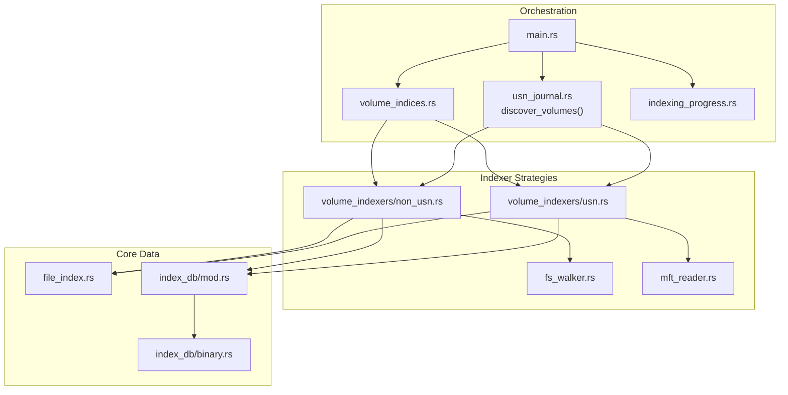
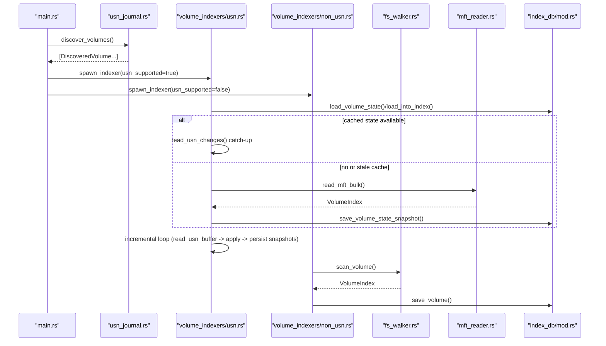
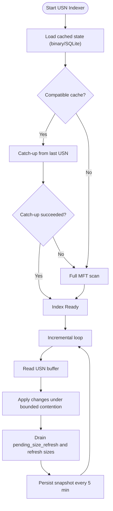
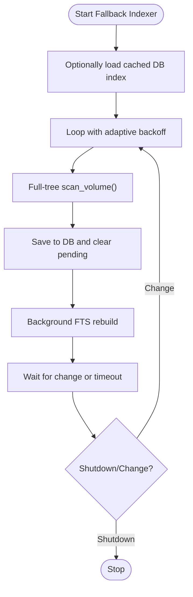
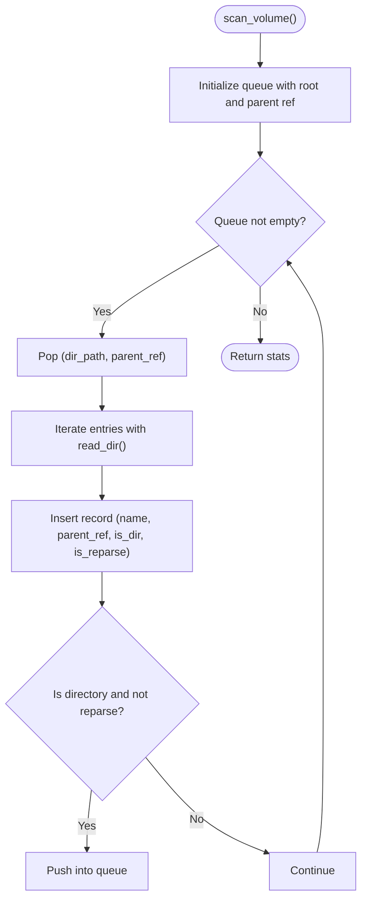
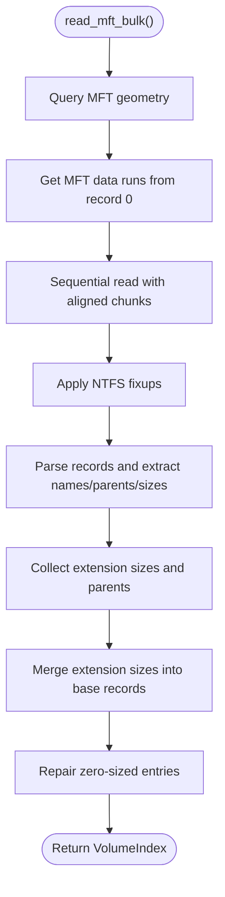
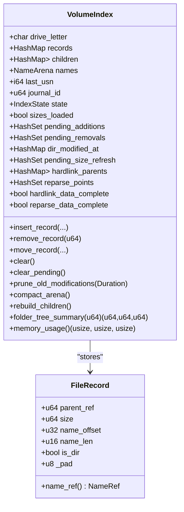
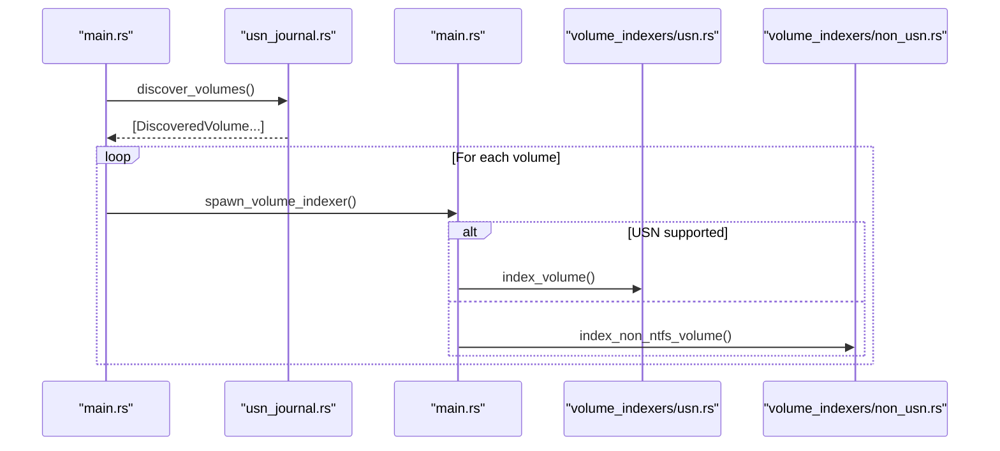
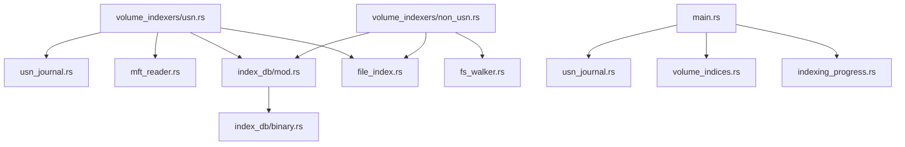

# Indexing Strategies

<cite>
**Referenced Files in This Document**
- [main.rs](file://crates/mtt-search-service/src/main.rs)
- [usn_journal.rs](file://crates/mtt-search-service/src/usn_journal.rs)
- [volume_indexers/mod.rs](file://crates/mtt-search-service/src/volume_indexers/mod.rs)
- [volume_indexers/usn.rs](file://crates/mtt-search-service/src/volume_indexers/usn.rs)
- [volume_indexers/non_usn.rs](file://crates/mtt-search-service/src/volume_indexers/non_usn.rs)
- [fs_walker.rs](file://crates/mtt-search-service/src/fs_walker.rs)
- [mft_reader.rs](file://crates/mtt-search-service/src/mft_reader.rs)
- [file_index.rs](file://crates/mtt-search-service/src/file_index.rs)
- [indexing_progress.rs](file://crates/mtt-search-service/src/indexing_progress.rs)
- [volume_indices.rs](file://crates/mtt-search-service/src/volume_indices.rs)
- [index_db/mod.rs](file://crates/mtt-search-service/src/index_db/mod.rs)
- [index_db/binary.rs](file://crates/mtt-search-service/src/index_db/binary.rs)
</cite>

## Table of Contents
1. [Introduction](#introduction)
2. [Project Structure](#project-structure)
3. [Core Components](#core-components)
4. [Architecture Overview](#architecture-overview)
5. [Detailed Component Analysis](#detailed-component-analysis)
6. [Dependency Analysis](#dependency-analysis)
7. [Performance Considerations](#performance-considerations)
8. [Troubleshooting Guide](#troubleshooting-guide)
9. [Conclusion](#conclusion)

## Introduction
This document explains the hybrid indexing strategies used by the search service to efficiently index local file systems across multiple drive types. It covers:
- USN (Update Sequence Number) journal-based indexing for NTFS and ReFS volumes, including real-time change tracking and incremental updates.
- Fallback full-tree scanning for FAT32, exFAT, and network drives that lack USN support.
- The file system walker that traverses directory structures and extracts metadata.
- The MFT (Master File Table) reader for NTFS volumes to gather comprehensive file information.
- Indexing progress tracking, volume discovery mechanisms, and concurrent indexing across multiple drives.
- Performance characteristics, memory usage patterns, and optimization strategies for large-scale indexing operations.

## Project Structure
The search service is organized into cohesive modules:
- Discovery and orchestration: main entrypoint spawns indexers for discovered volumes.
- Indexer strategies: USN-based and fallback non-USN indexers.
- Core indexing primitives: file system walker, MFT reader, in-memory index model, and persistence.
- Concurrency and progress: per-volume handles, shared progress tracker, and FTS state.

**Diagram sources**
- [main.rs:190-307](file://crates/mtt-search-service/src/main.rs#L190-L307)
- [usn_journal.rs:80-138](file://crates/mtt-search-service/src/usn_journal.rs#L80-L138)
- [volume_indexers/mod.rs:10-27](file://crates/mtt-search-service/src/volume_indexers/mod.rs#L10-L27)
- [volume_indexers/usn.rs:39-714](file://crates/mtt-search-service/src/volume_indexers/usn.rs#L39-L714)
- [volume_indexers/non_usn.rs:35-237](file://crates/mtt-search-service/src/volume_indexers/non_usn.rs#L35-L237)
- [fs_walker.rs:24-136](file://crates/mtt-search-service/src/fs_walker.rs#L24-L136)
- [mft_reader.rs:1214-1491](file://crates/mtt-search-service/src/mft_reader.rs#L1214-L1491)
- [file_index.rs:58-104](file://crates/mtt-search-service/src/file_index.rs#L58-L104)
- [index_db/mod.rs:282-385](file://crates/mtt-search-service/src/index_db/mod.rs#L282-L385)
- [index_db/binary.rs:1-32](file://crates/mtt-search-service/src/index_db/binary.rs#L1-L32)

**Section sources**
- [main.rs:190-307](file://crates/mtt-search-service/src/main.rs#L190-L307)
- [usn_journal.rs:80-138](file://crates/mtt-search-service/src/usn_journal.rs#L80-L138)
- [volume_indexers/mod.rs:10-27](file://crates/mtt-search-service/src/volume_indexers/mod.rs#L10-L27)

## Core Components
- Volume discovery and spawning: discovers volumes, determines USN capability, and spawns per-drive indexers concurrently.
- USN-based indexer: loads cached state, opens journal, enumerates incrementally, falls back to full MFT scan when needed, persists snapshots, and runs continuous incremental updates.
- Fallback indexer: performs periodic full scans with adaptive backoff, optionally using change monitoring for responsiveness, persists to DB, and rebuilds FTS.
- File system walker: iterative directory traversal for non-USN volumes, skipping reparse points to avoid cycles.
- MFT reader: bulk sequential read of NTFS $MFT to extract names, parents, sizes, hardlinks, and reparse flags in one pass.
- In-memory index model: compact records, reverse children index, name arena, and helpers for folder size computation.
- Persistence: SQLite-backed storage plus a fast binary format for cached volumes; FTS5 integration and integrity protection.
- Concurrency and progress: per-volume handles with independent locks, shared progress tracker, and FTS readiness state.

**Section sources**
- [main.rs:240-387](file://crates/mtt-search-service/src/main.rs#L240-L387)
- [volume_indexers/usn.rs:39-714](file://crates/mtt-search-service/src/volume_indexers/usn.rs#L39-L714)
- [volume_indexers/non_usn.rs:35-237](file://crates/mtt-search-service/src/volume_indexers/non_usn.rs#L35-L237)
- [fs_walker.rs:24-136](file://crates/mtt-search-service/src/fs_walker.rs#L24-L136)
- [mft_reader.rs:1214-1491](file://crates/mtt-search-service/src/mft_reader.rs#L1214-L1491)
- [file_index.rs:58-104](file://crates/mtt-search-service/src/file_index.rs#L58-L104)
- [index_db/mod.rs:282-385](file://crates/mtt-search-service/src/index_db/mod.rs#L282-L385)

## Architecture Overview
The indexing architecture combines real-time change tracking with robust fallbacks and concurrency.

**Diagram sources**
- [main.rs:240-387](file://crates/mtt-search-service/src/main.rs#L240-L387)
- [usn_journal.rs:80-138](file://crates/mtt-search-service/src/usn_journal.rs#L80-L138)
- [volume_indexers/usn.rs:39-714](file://crates/mtt-search-service/src/volume_indexers/usn.rs#L39-L714)
- [volume_indexers/non_usn.rs:35-237](file://crates/mtt-search-service/src/volume_indexers/non_usn.rs#L35-L237)
- [fs_walker.rs:24-136](file://crates/mtt-search-service/src/fs_walker.rs#L24-L136)
- [mft_reader.rs:1214-1491](file://crates/mtt-search-service/src/mft_reader.rs#L1214-L1491)
- [index_db/mod.rs:506-598](file://crates/mtt-search-service/src/index_db/mod.rs#L506-L598)

## Detailed Component Analysis

### USN-Based Indexing for NTFS and ReFS
The USN indexer provides near real-time change tracking and efficient incremental updates:
- State loading: attempts to load a cached binary index; if absent or incomplete, loads from SQLite and injects into the in-memory index.
- Journal operations: opens the volume, queries journal info, and reads USN buffers to apply incremental changes.
- Catch-up logic: if cached state is compatible, it catches up from the last USN; on failure, it falls back to a full MFT scan.
- Full scan path: bulk MFT read to enumerate all files, compact arena, and mark sizes as loaded.
- Incremental loop: periodically reads the USN buffer, applies changes under bounded contention, refreshes sizes for changed files, persists snapshots every five minutes, and prunes stale metadata.
- Background size extraction: if sizes were not loaded from cache, a background thread performs a bulk MFT read to fill sizes.

**Diagram sources**
- [volume_indexers/usn.rs:39-714](file://crates/mtt-search-service/src/volume_indexers/usn.rs#L39-L714)
- [mft_reader.rs:1214-1491](file://crates/mtt-search-service/src/mft_reader.rs#L1214-L1491)
- [index_db/mod.rs:506-598](file://crates/mtt-search-service/src/index_db/mod.rs#L506-L598)

**Section sources**
- [volume_indexers/usn.rs:39-714](file://crates/mtt-search-service/src/volume_indexers/usn.rs#L39-L714)
- [usn_journal.rs:170-314](file://crates/mtt-search-service/src/usn_journal.rs#L170-L314)
- [mft_reader.rs:1214-1491](file://crates/mtt-search-service/src/mft_reader.rs#L1214-L1491)
- [index_db/binary.rs:1-32](file://crates/mtt-search-service/src/index_db/binary.rs#L1-L32)

### Fallback Full-Tree Scanning for FAT/exFAT/Network Drives
For file systems without USN support, the fallback indexer performs periodic full scans:
- Adaptive backoff: increases wait intervals when no changes are detected; resets on detected changes or external triggers.
- Change monitoring: optional ReadDirectoryChangesW-based monitoring for responsive wake-ups on supported file systems.
- Scan and persist: iteratively walks directories, inserts records into the in-memory index, persists to DB, and rebuilds FTS in the background.
- Periodic scheduling: loops with calculated intervals to balance responsiveness and I/O.

**Diagram sources**
- [volume_indexers/non_usn.rs:35-237](file://crates/mtt-search-service/src/volume_indexers/non_usn.rs#L35-L237)
- [fs_walker.rs:24-136](file://crates/mtt-search-service/src/fs_walker.rs#L24-L136)
- [index_db/mod.rs:506-598](file://crates/mtt-search-service/src/index_db/mod.rs#L506-L598)

**Section sources**
- [volume_indexers/non_usn.rs:35-237](file://crates/mtt-search-service/src/volume_indexers/non_usn.rs#L35-L237)
- [fs_walker.rs:24-136](file://crates/mtt-search-service/src/fs_walker.rs#L24-L136)

### File System Walker Implementation
The walker performs an iterative directory traversal:
- Uses a queue to avoid recursion.
- Skips reparse points to prevent cycles.
- Inserts records into the in-memory index and reports progress.
- Respects shutdown signals.

**Diagram sources**
- [fs_walker.rs:24-136](file://crates/mtt-search-service/src/fs_walker.rs#L24-L136)

**Section sources**
- [fs_walker.rs:24-136](file://crates/mtt-search-service/src/fs_walker.rs#L24-L136)

### MFT Reader for NTFS Volumes
The MFT reader performs a single sequential pass over the NTFS $MFT:
- Queries MFT geometry and data runs from record 0.
- Reads aligned chunks, applies fixups, parses records, and populates the index.
- Extracts sizes from $DATA attributes, resolves external sizes via $ATTRIBUTE_LIST, and repairs zero-sized entries.
- Applies extension record sizes to base records and reconstructs hardlink parent edges.

**Diagram sources**
- [mft_reader.rs:1214-1491](file://crates/mtt-search-service/src/mft_reader.rs#L1214-L1491)

**Section sources**
- [mft_reader.rs:1214-1491](file://crates/mtt-search-service/src/mft_reader.rs#L1214-L1491)

### Index Model and Reverse Children Index
The in-memory index model supports efficient traversal and folder size computation:
- Compact records with name references into a contiguous arena.
- Reverse children index enabling O(subtree) traversal for folder size calculations.
- Helpers for hardlink parent edges, reparse point tracking, and arena compaction.

**Diagram sources**
- [file_index.rs:58-104](file://crates/mtt-search-service/src/file_index.rs#L58-L104)
- [file_index.rs:18-47](file://crates/mtt-search-service/src/file_index.rs#L18-L47)

**Section sources**
- [file_index.rs:58-104](file://crates/mtt-search-service/src/file_index.rs#L58-L104)
- [file_index.rs:38-47](file://crates/mtt-search-service/src/file_index.rs#L38-L47)

### Volume Discovery and Concurrent Indexing
The orchestrator discovers volumes, spawns indexers, and maintains shared state:
- Discovers volumes and categorizes by USN support.
- Spawns per-volume indexers concurrently with independent lifecycle.
- Maintains shared progress tracker and FTS readiness state.

**Diagram sources**
- [main.rs:240-387](file://crates/mtt-search-service/src/main.rs#L240-L387)
- [usn_journal.rs:80-138](file://crates/mtt-search-service/src/usn_journal.rs#L80-L138)
- [volume_indexers/mod.rs:39-7](file://crates/mtt-search-service/src/volume_indexers/mod.rs#L39-L7)

**Section sources**
- [main.rs:240-387](file://crates/mtt-search-service/src/main.rs#L240-L387)
- [usn_journal.rs:80-138](file://crates/mtt-search-service/src/usn_journal.rs#L80-L138)

## Dependency Analysis
Key dependencies and coupling:
- Indexers depend on the in-memory index model and persistence layer.
- USN indexer depends on the USN journal module for journal operations and change parsing.
- Fallback indexer depends on the file system walker and DB persistence.
- Concurrency is achieved via per-volume handles; the outer lock manages membership while inner locks guard individual indices.
- Progress tracking and FTS state are shared across indexers and the IPC server.

**Diagram sources**
- [volume_indexers/usn.rs:39-714](file://crates/mtt-search-service/src/volume_indexers/usn.rs#L39-L714)
- [volume_indexers/non_usn.rs:35-237](file://crates/mtt-search-service/src/volume_indexers/non_usn.rs#L35-L237)
- [usn_journal.rs:170-314](file://crates/mtt-search-service/src/usn_journal.rs#L170-L314)
- [mft_reader.rs:1214-1491](file://crates/mtt-search-service/src/mft_reader.rs#L1214-L1491)
- [index_db/mod.rs:282-385](file://crates/mtt-search-service/src/index_db/mod.rs#L282-L385)
- [index_db/binary.rs:1-32](file://crates/mtt-search-service/src/index_db/binary.rs#L1-L32)
- [main.rs:240-387](file://crates/mtt-search-service/src/main.rs#L240-L387)

**Section sources**
- [volume_indices.rs:43-58](file://crates/mtt-search-service/src/volume_indices.rs#L43-L58)
- [indexing_progress.rs:16-49](file://crates/mtt-search-service/src/indexing_progress.rs#L16-L49)

## Performance Considerations
- Memory usage:
  - Compact records (24 bytes) and a contiguous name arena minimize overhead.
  - Estimated memory usage reported via memory_usage() includes arena usage and hashmap capacity estimates.
  - Arena compaction reduces dead space after bulk operations and incremental overwrites.
- I/O efficiency:
  - USN-based catch-up avoids full scans when cache is valid.
  - Bulk MFT read performs a single sequential pass over the $MFT, reducing per-file IO overhead.
  - Fallback indexer uses adaptive backoff to reduce idle I/O.
- Concurrency:
  - Independent per-volume locks enable concurrent indexing across multiple drives without cross-volume contention.
  - Incremental writes use bounded retry and fallback timeouts to avoid read starvation.
- Persistence:
  - Binary cache provides fast restart for USN volumes.
  - SQLite persists records and hardlink parents; FTS5 is rebuilt only when necessary.
- Search performance:
  - Lowercased name arena and SIMD-based substring search improve lookup speed.
  - Reverse children index enables O(subtree) folder size computations.

[No sources needed since this section provides general guidance]

## Troubleshooting Guide
Common issues and diagnostics:
- USN journal disabled or inaccessible:
  - Symptoms: failures when opening or querying the journal.
  - Resolution: ensure the USN journal is enabled and the process has appropriate privileges.
- Journal wraparound or expired USN:
  - Symptoms: catch-up fails with “journal entries expired”.
  - Resolution: trigger a full MFT scan to rebuild the index.
- Name arena full:
  - Symptoms: scans stop early with arena full messages.
  - Resolution: adjust indexing limits or reduce scope; consider re-running with larger capacity.
- Lock contention during incremental updates:
  - Symptoms: periodic skipped cycles or retries.
  - Resolution: verify bounded contention logs and ensure adequate CPU resources; consider reducing concurrent writes.
- Fallback scan thrashing:
  - Symptoms: frequent scans despite no changes.
  - Resolution: verify change monitoring availability and adjust cadence; confirm adaptive backoff is functioning.

**Section sources**
- [usn_journal.rs:170-314](file://crates/mtt-search-service/src/usn_journal.rs#L170-L314)
- [volume_indexers/usn.rs:476-620](file://crates/mtt-search-service/src/volume_indexers/usn.rs#L476-L620)
- [volume_indexers/non_usn.rs:214-234](file://crates/mtt-search-service/src/volume_indexers/non_usn.rs#L214-L234)

## Conclusion
The search service employs a hybrid indexing strategy tailored to each file system:
- NTFS and ReFS volumes benefit from USN-based real-time change tracking with robust fallbacks and efficient bulk MFT enumeration.
- FAT32, exFAT, and network drives rely on adaptive full-tree scanning with change monitoring and periodic persistence.
- The in-memory index model, reverse children index, and SIMD search deliver strong performance characteristics.
- Concurrency and persistence mechanisms ensure scalable, resilient indexing across heterogeneous environments.

[No sources needed since this section summarizes without analyzing specific files]