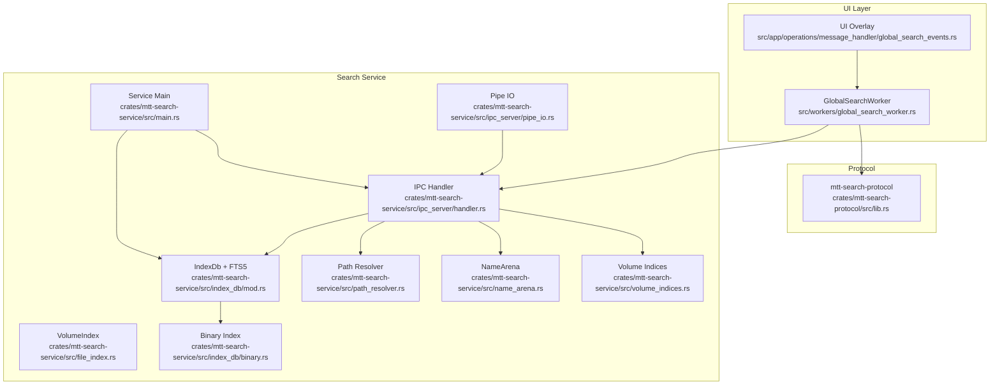
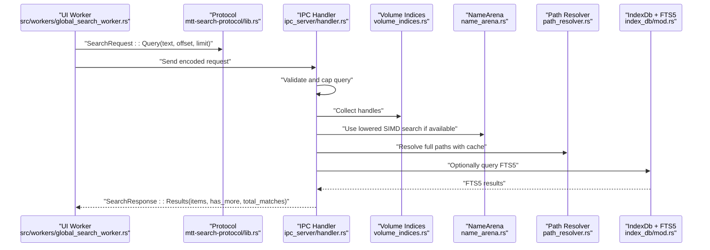
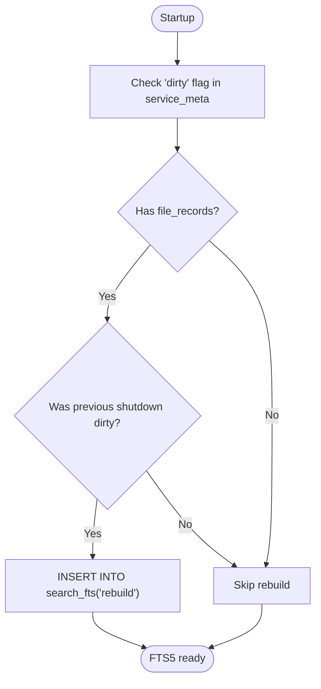
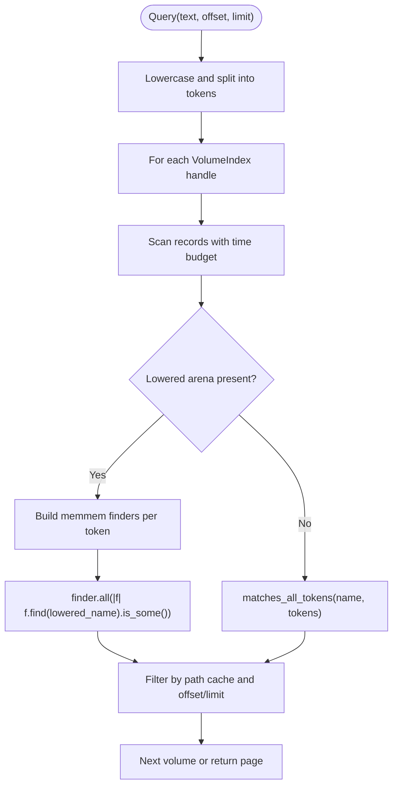
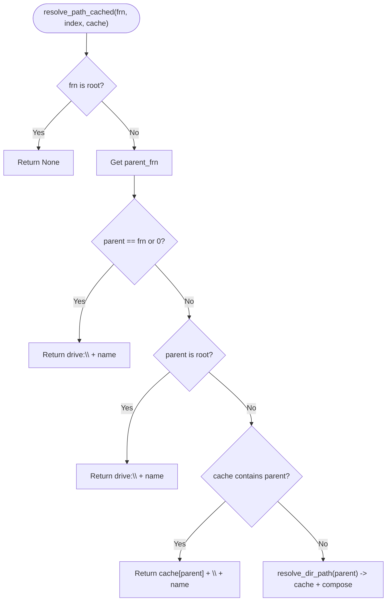
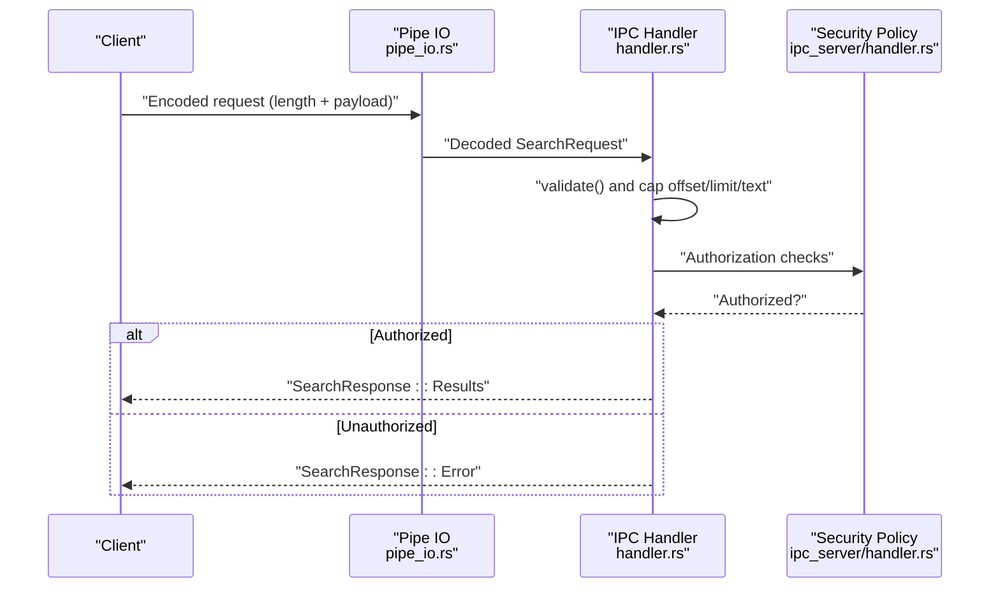
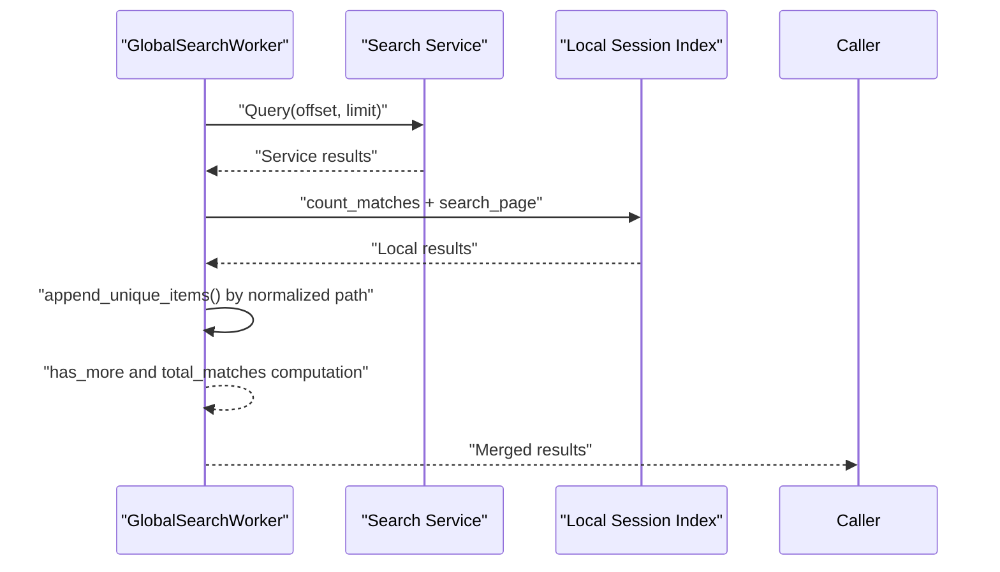
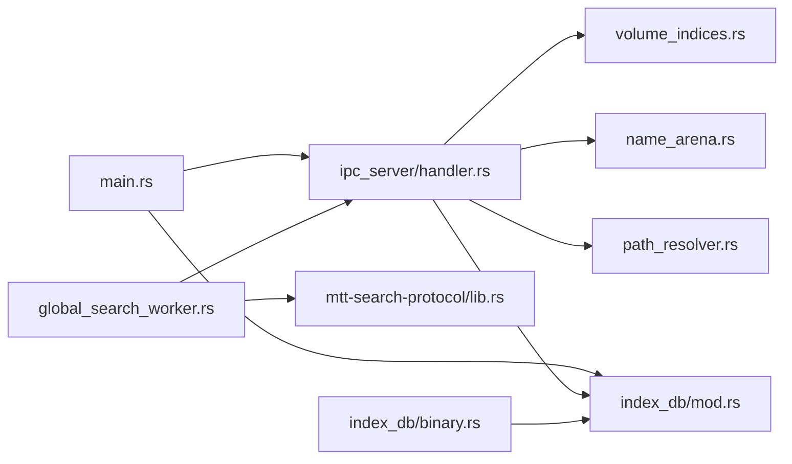

# Search Algorithms & Ranking

<cite>
**Referenced Files in This Document**
- [main.rs](file://crates/mtt-search-service/src/main.rs)
- [file_index.rs](file://crates/mtt-search-service/src/file_index.rs)
- [name_arena.rs](file://crates/mtt-search-service/src/name_arena.rs)
- [index_db/mod.rs](file://crates/mtt-search-service/src/index_db/mod.rs)
- [index_db/binary.rs](file://crates/mtt-search-service/src/index_db/binary.rs)
- [ipc_server/handler.rs](file://crates/mtt-search-service/src/ipc_server/handler.rs)
- [ipc_server/pipe_io.rs](file://crates/mtt-search-service/src/ipc_server/pipe_io.rs)
- [volume_indices.rs](file://crates/mtt-search-service/src/volume_indices.rs)
- [path_resolver.rs](file://crates/mtt-search-service/src/path_resolver.rs)
- [mtt-search-protocol/lib.rs](file://crates/mtt-search-protocol/src/lib.rs)
- [global_search_worker.rs](file://src/workers/global_search_worker.rs)
- [global_search.rs](file://src/infrastructure/global_search.rs)
- [global_search_events.rs](file://src/app/operations/message_handler/global_search_events.rs)
</cite>

## Table of Contents
1. [Introduction](#introduction)
2. [Project Structure](#project-structure)
3. [Core Components](#core-components)
4. [Architecture Overview](#architecture-overview)
5. [Detailed Component Analysis](#detailed-component-analysis)
6. [Dependency Analysis](#dependency-analysis)
7. [Performance Considerations](#performance-considerations)
8. [Troubleshooting Guide](#troubleshooting-guide)
9. [Conclusion](#conclusion)

## Introduction
This document explains the search algorithms and ranking mechanisms implemented in the search service. It covers:
- Full-text search integration with SQLite FTS5 and the in-memory index
- Query parsing, tokenization, and matching strategies
- Hybrid search combining file name matching with content-based indexing
- Result ranking and presentation, including pagination and result limiting
- Concurrent search across multiple indexed volumes and result aggregation
- Performance tuning, query optimization, and troubleshooting slow searches

## Project Structure
The search service is implemented as a Windows named pipe server backed by an in-memory index and an SQLite/FTS5 database. The UI worker coordinates with the service and aggregates results from both the service and a user-session local index.

**Diagram sources**
- [main.rs:190-307](file://crates/mtt-search-service/src/main.rs#L190-L307)
- [ipc_server/handler.rs:111-440](file://crates/mtt-search-service/src/ipc_server/handler.rs#L111-L440)
- [ipc_server/pipe_io.rs:115-187](file://crates/mtt-search-service/src/ipc_server/pipe_io.rs#L115-L187)
- [volume_indices.rs:25-75](file://crates/mtt-search-service/src/volume_indices.rs#L25-L75)
- [name_arena.rs:25-150](file://crates/mtt-search-service/src/name_arena.rs#L25-L150)
- [file_index.rs:58-104](file://crates/mtt-search-service/src/file_index.rs#L58-L104)
- [path_resolver.rs:16-104](file://crates/mtt-search-service/src/path_resolver.rs#L16-L104)
- [index_db/mod.rs:282-385](file://crates/mtt-search-service/src/index_db/mod.rs#L282-L385)
- [index_db/binary.rs:82-204](file://crates/mtt-search-service/src/index_db/binary.rs#L82-L204)
- [mtt-search-protocol/lib.rs:18-88](file://crates/mtt-search-protocol/src/lib.rs#L18-L88)

**Section sources**
- [main.rs:190-307](file://crates/mtt-search-service/src/main.rs#L190-L307)
- [ipc_server/handler.rs:111-440](file://crates/mtt-search-service/src/ipc_server/handler.rs#L111-L440)
- [ipc_server/pipe_io.rs:115-187](file://crates/mtt-search-service/src/ipc_server/pipe_io.rs#L115-L187)
- [volume_indices.rs:25-75](file://crates/mtt-search-service/src/volume_indices.rs#L25-L75)
- [name_arena.rs:25-150](file://crates/mtt-search-service/src/name_arena.rs#L25-L150)
- [file_index.rs:58-104](file://crates/mtt-search-service/src/file_index.rs#L58-L104)
- [path_resolver.rs:16-104](file://crates/mtt-search-service/src/path_resolver.rs#L16-L104)
- [index_db/mod.rs:282-385](file://crates/mtt-search-service/src/index_db/mod.rs#L282-L385)
- [index_db/binary.rs:82-204](file://crates/mtt-search-service/src/index_db/binary.rs#L82-L204)
- [mtt-search-protocol/lib.rs:18-88](file://crates/mtt-search-protocol/src/lib.rs#L18-L88)

## Core Components
- In-memory index per volume with compact records and a contiguous name arena
- NameArena with optional lowered buffer enabling SIMD substring search
- Path resolver with directory path caching for efficient full path construction
- SQLite/FTS5-backed persistence and virtual table for content-based search
- IPC server handling queries, authorization, and status reporting
- UI worker coordinating hybrid search and result aggregation

Key implementation references:
- VolumeIndex and FileRecord layout and operations
- NameArena with lowered buffer for SIMD search
- Path resolution with caching
- SQLite/FTS5 schema and rebuild logic
- IPC request/response handling and limits
- UI worker hybrid search and result deduplication

**Section sources**
- [file_index.rs:18-47](file://crates/mtt-search-service/src/file_index.rs#L18-L47)
- [file_index.rs:653-770](file://crates/mtt-search-service/src/file_index.rs#L653-L770)
- [name_arena.rs:25-150](file://crates/mtt-search-service/src/name_arena.rs#L25-L150)
- [path_resolver.rs:16-104](file://crates/mtt-search-service/src/path_resolver.rs#L16-L104)
- [index_db/mod.rs:319-385](file://crates/mtt-search-service/src/index_db/mod.rs#L319-L385)
- [ipc_server/handler.rs:221-272](file://crates/mtt-search-service/src/ipc_server/handler.rs#L221-L272)
- [mtt-search-protocol/lib.rs:18-88](file://crates/mtt-search-protocol/src/lib.rs#L18-L88)
- [global_search_worker.rs:428-534](file://src/workers/global_search_worker.rs#L428-L534)

## Architecture Overview
The search service exposes a named pipe interface. Queries are parsed and validated, then executed against:
- An in-memory SIMD-based name search (fastest for short queries)
- An SQLite/FTS5 index (for content-based search and rebuilds)

Results are paginated and limited, and the UI worker can optionally augment results with a local session index and deduplicate items.

**Diagram sources**
- [global_search_worker.rs:129-154](file://src/workers/global_search_worker.rs#L129-L154)
- [mtt-search-protocol/lib.rs:18-88](file://crates/mtt-search-protocol/src/lib.rs#L18-L88)
- [ipc_server/handler.rs:221-272](file://crates/mtt-search-service/src/ipc_server/handler.rs#L221-L272)
- [volume_indices.rs:71-75](file://crates/mtt-search-service/src/volume_indices.rs#L71-L75)
- [name_arena.rs:101-132](file://crates/mtt-search-service/src/name_arena.rs#L101-L132)
- [path_resolver.rs:16-104](file://crates/mtt-search-service/src/path_resolver.rs#L16-L104)
- [index_db/mod.rs:319-385](file://crates/mtt-search-service/src/index_db/mod.rs#L319-L385)

## Detailed Component Analysis

### Full-Text Search with SQLite/FTS5
- Virtual table definition with trigram tokenizer
- Dirty-shutdown detection and automatic FTS5 rebuild
- Background rebuild support and readiness gating

**Diagram sources**
- [index_db/mod.rs:334-385](file://crates/mtt-search-service/src/index_db/mod.rs#L334-L385)

**Section sources**
- [index_db/mod.rs:319-385](file://crates/mtt-search-service/src/index_db/mod.rs#L319-L385)
- [index_db/sync.rs:185-191](file://crates/mtt-search-service/src/index_db/sync.rs#L185-L191)

### In-Memory SIMD Name Search
- Case-insensitive substring matching using lowered NameArena
- memchr::memmem-based SIMD search for multi-token queries
- Time budget enforcement to avoid long lock holds

**Diagram sources**
- [file_index.rs:653-770](file://crates/mtt-search-service/src/file_index.rs#L653-L770)
- [name_arena.rs:101-132](file://crates/mtt-search-service/src/name_arena.rs#L101-L132)

**Section sources**
- [file_index.rs:653-770](file://crates/mtt-search-service/src/file_index.rs#L653-L770)
- [name_arena.rs:101-132](file://crates/mtt-search-service/src/name_arena.rs#L101-L132)

### Path Resolution and Caching
- Efficient parent chain traversal with directory path caching
- Safe depth limit and root handling

**Diagram sources**
- [path_resolver.rs:16-104](file://crates/mtt-search-service/src/path_resolver.rs#L16-L104)

**Section sources**
- [path_resolver.rs:16-104](file://crates/mtt-search-service/src/path_resolver.rs#L16-L104)

### IPC Protocol, Limits, and Security
- Request/response encoding with length prefixes
- Query text length and result limits enforced
- Pipe ACLs granting access to Authenticated Users and LocalSystem
- Validation and sanitization of error messages

**Diagram sources**
- [mtt-search-protocol/lib.rs:165-192](file://crates/mtt-search-protocol/src/lib.rs#L165-L192)
- [ipc_server/pipe_io.rs:115-187](file://crates/mtt-search-service/src/ipc_server/pipe_io.rs#L115-L187)
- [ipc_server/handler.rs:134-138](file://crates/mtt-search-service/src/ipc_server/handler.rs#L134-L138)
- [ipc_server/handler.rs:221-272](file://crates/mtt-search-service/src/ipc_server/handler.rs#L221-L272)

**Section sources**
- [mtt-search-protocol/lib.rs:18-88](file://crates/mtt-search-protocol/src/lib.rs#L18-L88)
- [ipc_server/pipe_io.rs:115-187](file://crates/mtt-search-service/src/ipc_server/pipe_io.rs#L115-L187)
- [ipc_server/handler.rs:134-138](file://crates/mtt-search-service/src/ipc_server/handler.rs#L134-L138)
- [ipc_server/handler.rs:221-272](file://crates/mtt-search-service/src/ipc_server/handler.rs#L221-L272)

### Hybrid Search and Result Aggregation
- UI worker performs hybrid search:
  - Short queries (< threshold) use local session index only
  - Longer queries query the service, then merge with local results
  - Deduplicates by normalized path and enforces result limit
- Optional background warm-up of in-memory index

**Diagram sources**
- [global_search_worker.rs:428-534](file://src/workers/global_search_worker.rs#L428-L534)
- [global_search_worker.rs:103-127](file://src/workers/global_search_worker.rs#L103-L127)

**Section sources**
- [global_search_worker.rs:428-534](file://src/workers/global_search_worker.rs#L428-L534)
- [global_search_worker.rs:103-127](file://src/workers/global_search_worker.rs#L103-L127)
- [global_search_events.rs:202-221](file://src/app/operations/message_handler/global_search_events.rs#L202-L221)

### Ranking and Relevance
- Name-only matching: case-insensitive substring within file names
- Token semantics: multi-token queries require all tokens to be present
- No explicit scoring or ranking beyond presence and pagination
- Path proximity and file type relevance are not implemented in the current code

Note: The current implementation focuses on fast, accurate presence matching rather than numeric scoring. If relevance ranking is desired, it can be layered on top of the existing matching by:
- Computing a relevance score per result (e.g., edit distance to query, position in name, path depth)
- Sorting results by score before applying pagination
- Ensuring the score computation remains efficient and bounded

[No sources needed since this section provides conceptual guidance]

## Dependency Analysis
- Service entrypoint initializes shared indices, DB, and IPC server
- IPC handler depends on volume indices, NameArena, path resolver, and DB
- UI worker depends on protocol definitions and orchestrates hybrid search
- Binary index module persists and loads the in-memory index

**Diagram sources**
- [main.rs:190-307](file://crates/mtt-search-service/src/main.rs#L190-L307)
- [ipc_server/handler.rs:111-440](file://crates/mtt-search-service/src/ipc_server/handler.rs#L111-L440)
- [index_db/mod.rs:282-385](file://crates/mtt-search-service/src/index_db/mod.rs#L282-L385)
- [index_db/binary.rs:82-204](file://crates/mtt-search-service/src/index_db/binary.rs#L82-L204)
- [volume_indices.rs:25-75](file://crates/mtt-search-service/src/volume_indices.rs#L25-L75)
- [name_arena.rs:25-150](file://crates/mtt-search-service/src/name_arena.rs#L25-L150)
- [path_resolver.rs:16-104](file://crates/mtt-search-service/src/path_resolver.rs#L16-L104)
- [global_search_worker.rs:327-594](file://src/workers/global_search_worker.rs#L327-L594)
- [mtt-search-protocol/lib.rs:18-88](file://crates/mtt-search-protocol/src/lib.rs#L18-L88)

**Section sources**
- [main.rs:190-307](file://crates/mtt-search-service/src/main.rs#L190-L307)
- [ipc_server/handler.rs:111-440](file://crates/mtt-search-service/src/ipc_server/handler.rs#L111-L440)
- [index_db/mod.rs:282-385](file://crates/mtt-search-service/src/index_db/mod.rs#L282-L385)
- [index_db/binary.rs:82-204](file://crates/mtt-search-service/src/index_db/binary.rs#L82-L204)
- [volume_indices.rs:25-75](file://crates/mtt-search-service/src/volume_indices.rs#L25-L75)
- [name_arena.rs:25-150](file://crates/mtt-search-service/src/name_arena.rs#L25-L150)
- [path_resolver.rs:16-104](file://crates/mtt-search-service/src/path_resolver.rs#L16-L104)
- [global_search_worker.rs:327-594](file://src/workers/global_search_worker.rs#L327-L594)
- [mtt-search-protocol/lib.rs:18-88](file://crates/mtt-search-protocol/src/lib.rs#L18-L88)

## Performance Considerations
- SIMD name search: leverages lowered NameArena and memmem for sublinear substring search
- Per-volume concurrency: independent RwLock per volume enables concurrent readers across volumes
- Time-bounded scans: early termination when time budget is exceeded
- Warm index: page-warming to reduce latency for subsequent queries
- Result limiting: strict caps on query text length and result items
- FTS5 rebuild: background rebuild to keep content index fresh without startup cost

Recommendations:
- Keep queries short for fastest response (the service prefers in-memory SIMD for shorter queries)
- Use the warm index operation proactively when expecting frequent searches
- Monitor service status to avoid querying during heavy indexing phases
- Consider increasing limit judiciously; the worker merges results and enforces de-duplication

**Section sources**
- [file_index.rs:653-770](file://crates/mtt-search-service/src/file_index.rs#L653-L770)
- [ipc_server/handler.rs:144-211](file://crates/mtt-search-service/src/ipc_server/handler.rs#L144-L211)
- [mtt-search-protocol/lib.rs:6-12](file://crates/mtt-search-protocol/src/lib.rs#L6-L12)
- [global_search_worker.rs:327-594](file://src/workers/global_search_worker.rs#L327-L594)

## Troubleshooting Guide
Common issues and remedies:
- Slow or unresponsive search:
  - Warm the index to bring pages back into RAM
  - Reduce query length for faster SIMD matching
  - Avoid concurrent heavy indexing operations
- Frequent timeouts or partial results:
  - The service enforces a time budget per scan; try shorter queries or wait for idle periods
- Service unavailable:
  - The UI worker retries transient errors and can fall back to local results
  - Check service status and availability
- Incorrect or missing results:
  - Ensure the FTS5 index is rebuilt after a dirty shutdown
  - Confirm the volume is Ready and sizes are loaded for folder size queries

Operational tips:
- Use the ping/status endpoints to verify service health
- Inspect logs for rebuild timing and warm index activity
- For path-sensitive errors, the service redacts sensitive details

**Section sources**
- [ipc_server/handler.rs:144-211](file://crates/mtt-search-service/src/ipc_server/handler.rs#L144-L211)
- [ipc_server/handler.rs:212-220](file://crates/mtt-search-service/src/ipc_server/handler.rs#L212-L220)
- [index_db/mod.rs:366-385](file://crates/mtt-search-service/src/index_db/mod.rs#L366-L385)
- [global_search_worker.rs:57-66](file://src/workers/global_search_worker.rs#L57-L66)
- [global_search_worker.rs:535-575](file://src/workers/global_search_worker.rs#L535-L575)

## Conclusion
The search service implements a fast, secure, and scalable search solution:
- In-memory SIMD name search for low-latency queries
- SQLite/FTS5 for content-based search with robust rebuild and persistence
- Per-volume concurrency and strict resource limits for stability
- UI worker hybrid search with result deduplication and intelligent fallback

Future enhancements could introduce explicit relevance scoring and ranking heuristics layered atop the existing matching foundation.