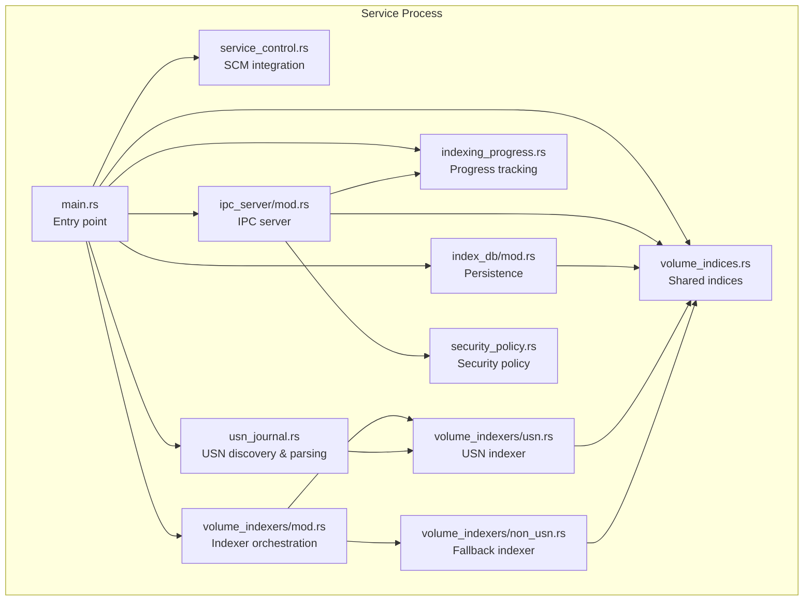
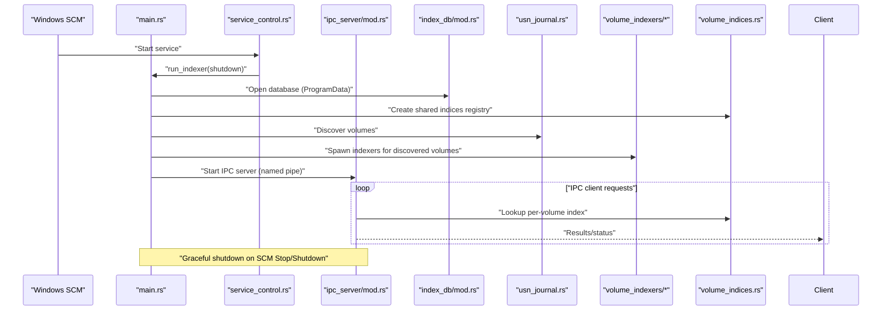
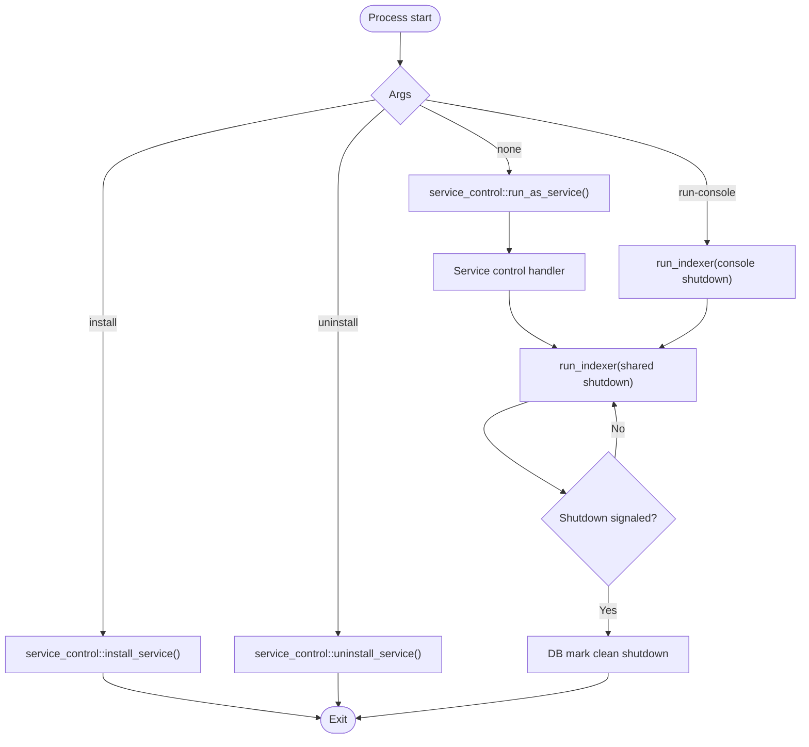
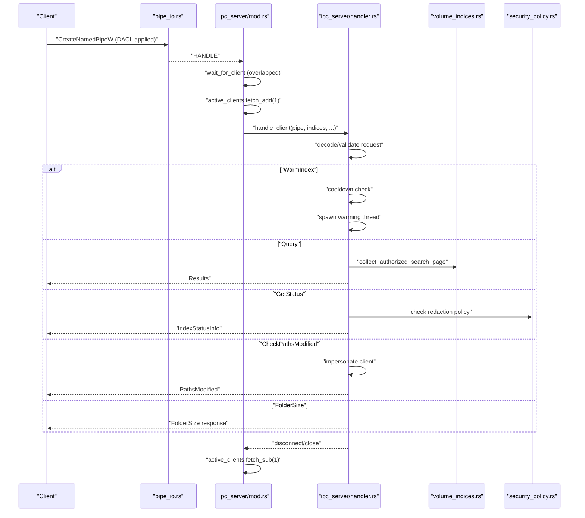
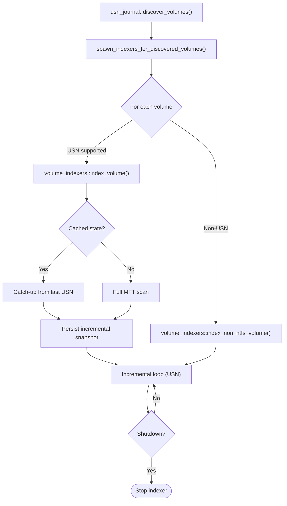
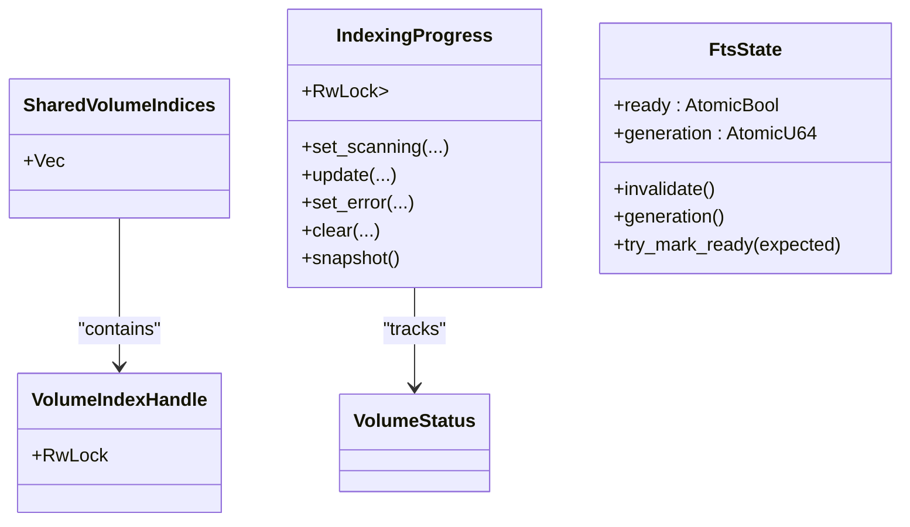
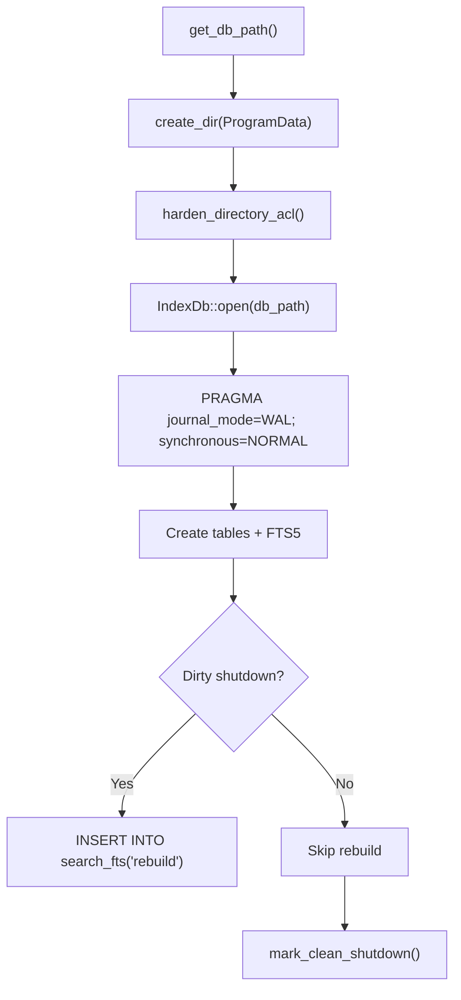
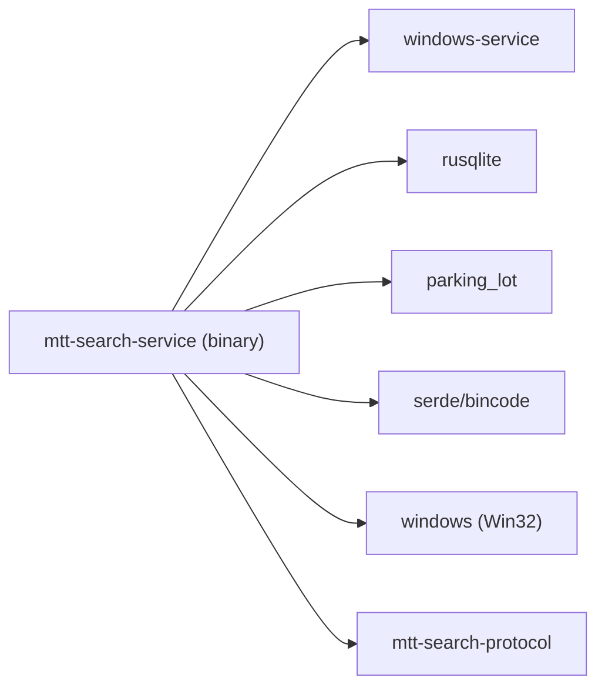

# Service Architecture

<cite>
**Referenced Files in This Document**
- [main.rs](file://crates/mtt-search-service/src/main.rs)
- [service_control.rs](file://crates/mtt-search-service/src/service_control.rs)
- [ipc_server/mod.rs](file://crates/mtt-search-service/src/ipc_server/mod.rs)
- [ipc_server/handler.rs](file://crates/mtt-search-service/src/ipc_server/handler.rs)
- [ipc_server/pipe_io.rs](file://crates/mtt-search-service/src/ipc_server/pipe_io.rs)
- [index_db/mod.rs](file://crates/mtt-search-service/src/index_db/mod.rs)
- [volume_indices.rs](file://crates/mtt-search-service/src/volume_indices.rs)
- [indexing_progress.rs](file://crates/mtt-search-service/src/indexing_progress.rs)
- [usn_journal.rs](file://crates/mtt-search-service/src/usn_journal.rs)
- [volume_indexers/mod.rs](file://crates/mtt-search-service/src/volume_indexers/mod.rs)
- [volume_indexers/usn.rs](file://crates/mtt-search-service/src/volume_indexers/usn.rs)
- [volume_indexers/non_usn.rs](file://crates/mtt-search-service/src/volume_indexers/non_usn.rs)
- [security_policy.rs](file://crates/mtt-search-service/src/security_policy.rs)
- [Cargo.toml](file://crates/mtt-search-service/Cargo.toml)
</cite>

## Table of Contents
1. [Introduction](#introduction)
2. [Project Structure](#project-structure)
3. [Core Components](#core-components)
4. [Architecture Overview](#architecture-overview)
5. [Detailed Component Analysis](#detailed-component-analysis)
6. [Dependency Analysis](#dependency-analysis)
7. [Performance Considerations](#performance-considerations)
8. [Troubleshooting Guide](#troubleshooting-guide)
9. [Conclusion](#conclusion)

## Introduction
This document describes the MTT Search Service architecture, a Windows-native standalone service designed to index and serve file search results across local volumes. It runs under the LocalSystem account to gain elevated privileges required for NTFS USN journal access and low-level filesystem operations. The service supports installation/uninstallation via Windows Service Control Manager, console-mode execution for development and diagnostics, and a robust IPC server for client communication. The design emphasizes thread safety, security hardening, graceful shutdown, and efficient indexing strategies for both NTFS (USN) and non-NTFS filesystems.

## Project Structure
The service is implemented as a Rust binary within the crates/mtt-search-service package. Key areas:
- Service lifecycle and entrypoint: main.rs, service_control.rs
- IPC server: ipc_server/mod.rs, ipc_server/handler.rs, ipc_server/pipe_io.rs
- Indexing subsystem: usn_journal.rs, volume_indexers/mod.rs, volume_indexers/usn.rs, volume_indexers/non_usn.rs
- Persistence and state: index_db/mod.rs, volume_indices.rs, indexing_progress.rs
- Security and configuration: security_policy.rs, Cargo.toml

**Diagram sources**
- [main.rs:112-307](file://crates/mtt-search-service/src/main.rs#L112-L307)
- [service_control.rs:100-154](file://crates/mtt-search-service/src/service_control.rs#L100-L154)
- [ipc_server/mod.rs:35-214](file://crates/mtt-search-service/src/ipc_server/mod.rs#L35-L214)
- [index_db/mod.rs:282-397](file://crates/mtt-search-service/src/index_db/mod.rs#L282-L397)
- [volume_indices.rs:26-75](file://crates/mtt-search-service/src/volume_indices.rs#L26-L75)
- [indexing_progress.rs:11-53](file://crates/mtt-search-service/src/indexing_progress.rs#L11-L53)
- [usn_journal.rs:81-138](file://crates/mtt-search-service/src/usn_journal.rs#L81-L138)
- [volume_indexers/mod.rs:10-27](file://crates/mtt-search-service/src/volume_indexers/mod.rs#L10-L27)
- [volume_indexers/usn.rs:39-713](file://crates/mtt-search-service/src/volume_indexers/usn.rs#L39-L713)
- [volume_indexers/non_usn.rs:35-237](file://crates/mtt-search-service/src/volume_indexers/non_usn.rs#L35-L237)
- [security_policy.rs:6-16](file://crates/mtt-search-service/src/security_policy.rs#L6-L16)

**Section sources**
- [Cargo.toml:1-33](file://crates/mtt-search-service/Cargo.toml#L1-L33)

## Core Components
- Service entrypoint and lifecycle: main.rs orchestrates installation, console mode, and the main service loop; service_control.rs integrates with SCM.
- IPC server: ipc_server/mod.rs manages named pipes, concurrency limits, timeouts, and delegates requests to handler.rs.
- Indexing engine: usn_journal.rs discovers volumes and parses USN records; volume_indexers/usn.rs implements NTFS incremental indexing; volume_indexers/non_usn.rs implements fallback scanning for non-NTFS.
- Persistence and state: index_db/mod.rs manages SQLite/WAL, FTS5, and volume state; volume_indices.rs provides per-volume locking; indexing_progress.rs tracks per-drive status.
- Security and configuration: security_policy.rs exposes runtime flags; pipe_io.rs hardens pipe ACLs; main.rs applies DLL search order hardening.

**Section sources**
- [main.rs:112-307](file://crates/mtt-search-service/src/main.rs#L112-L307)
- [service_control.rs:17-98](file://crates/mtt-search-service/src/service_control.rs#L17-L98)
- [ipc_server/mod.rs:35-214](file://crates/mtt-search-service/src/ipc_server/mod.rs#L35-L214)
- [index_db/mod.rs:282-397](file://crates/mtt-search-service/src/index_db/mod.rs#L282-L397)
- [volume_indices.rs:26-75](file://crates/mtt-search-service/src/volume_indices.rs#L26-L75)
- [indexing_progress.rs:11-53](file://crates/mtt-search-service/src/indexing_progress.rs#L11-L53)
- [usn_journal.rs:81-138](file://crates/mtt-search-service/src/usn_journal.rs#L81-L138)
- [volume_indexers/usn.rs:39-713](file://crates/mtt-search-service/src/volume_indexers/usn.rs#L39-L713)
- [volume_indexers/non_usn.rs:35-237](file://crates/mtt-search-service/src/volume_indexers/non_usn.rs#L35-L237)
- [security_policy.rs:6-16](file://crates/mtt-search-service/src/security_policy.rs#L6-L16)
- [ipc_server/pipe_io.rs:115-187](file://crates/mtt-search-service/src/ipc_server/pipe_io.rs#L115-L187)

## Architecture Overview
The service follows a producer-consumer model:
- Discovery and indexing: background threads enumerate volumes, spawn per-volume indexers, and maintain shared state.
- IPC server: accepts client requests, authorizes access, and serves results from in-memory indices.
- Persistence: maintains SQLite/WAL database and binary caches for fast restarts.

**Diagram sources**
- [service_control.rs:100-154](file://crates/mtt-search-service/src/service_control.rs#L100-L154)
- [main.rs:190-307](file://crates/mtt-search-service/src/main.rs#L190-L307)
- [ipc_server/mod.rs:35-214](file://crates/mtt-search-service/src/ipc_server/mod.rs#L35-L214)
- [index_db/mod.rs:282-397](file://crates/mtt-search-service/src/index_db/mod.rs#L282-L397)
- [usn_journal.rs:81-138](file://crates/mtt-search-service/src/usn_journal.rs#L81-L138)
- [volume_indexers/usn.rs:39-713](file://crates/mtt-search-service/src/volume_indexers/usn.rs#L39-L713)
- [volume_indexers/non_usn.rs:35-237](file://crates/mtt-search-service/src/volume_indexers/non_usn.rs#L35-L237)
- [volume_indices.rs:26-75](file://crates/mtt-search-service/src/volume_indices.rs#L26-L75)

## Detailed Component Analysis

### Service Lifecycle and Entry Point
- Command-line modes:
  - install: registers the service under LocalSystem.
  - uninstall: stops and deletes the service.
  - run-console: runs the indexer loop with console Ctrl+C handling.
  - default: dispatches to SCM for service mode.
- SCM integration:
  - Registers a service control handler for Stop/Shutdown events.
  - Reports Running/Stopped states to SCM.
- Console mode:
  - Sets up a console control handler and propagates shutdown to the indexer loop.

**Diagram sources**
- [main.rs:112-156](file://crates/mtt-search-service/src/main.rs#L112-L156)
- [service_control.rs:17-98](file://crates/mtt-search-service/src/service_control.rs#L17-L98)
- [service_control.rs:100-154](file://crates/mtt-search-service/src/service_control.rs#L100-L154)
- [main.rs:168-187](file://crates/mtt-search-service/src/main.rs#L168-L187)
- [main.rs:190-307](file://crates/mtt-search-service/src/main.rs#L190-L307)

**Section sources**
- [main.rs:112-156](file://crates/mtt-search-service/src/main.rs#L112-L156)
- [service_control.rs:17-98](file://crates/mtt-search-service/src/service_control.rs#L17-L98)
- [service_control.rs:100-154](file://crates/mtt-search-service/src/service_control.rs#L100-L154)
- [main.rs:168-187](file://crates/mtt-search-service/src/main.rs#L168-L187)

### IPC Server and Client Handling
- Named pipe creation:
  - Enforces FILE_FLAG_FIRST_PIPE_INSTANCE on first instance to prevent pipe squatting.
  - Applies DACL granting access to Authenticated Users and Local System.
- Concurrency and rate limiting:
  - Active client counter with Acquire/Release semantics.
  - Max concurrent clients enforced; excess clients receive an error response.
- Timeouts:
  - Overlapped ConnectNamedPipe with periodic shutdown checks.
  - Per-connection watchdog thread terminates slow clients to prevent DoS.
- Request handling:
  - Decodes/SearchRequest, validates, and routes to handler.
  - Supports Ping, WarmIndex, GetStatus, Query, CheckPathsModified, FolderSize.
- Security policy:
  - Optional redaction of status metrics via environment flag.

**Diagram sources**
- [ipc_server/pipe_io.rs:115-187](file://crates/mtt-search-service/src/ipc_server/pipe_io.rs#L115-L187)
- [ipc_server/mod.rs:35-214](file://crates/mtt-search-service/src/ipc_server/mod.rs#L35-L214)
- [ipc_server/handler.rs:111-440](file://crates/mtt-search-service/src/ipc_server/handler.rs#L111-L440)
- [security_policy.rs:6-16](file://crates/mtt-search-service/src/security_policy.rs#L6-L16)
- [volume_indices.rs:26-75](file://crates/mtt-search-service/src/volume_indices.rs#L26-L75)

**Section sources**
- [ipc_server/mod.rs:35-214](file://crates/mtt-search-service/src/ipc_server/mod.rs#L35-L214)
- [ipc_server/handler.rs:111-440](file://crates/mtt-search-service/src/ipc_server/handler.rs#L111-L440)
- [ipc_server/pipe_io.rs:115-187](file://crates/mtt-search-service/src/ipc_server/pipe_io.rs#L115-L187)
- [security_policy.rs:6-16](file://crates/mtt-search-service/src/security_policy.rs#L6-L16)

### Indexing Engine: USN Journal and Fallback Scanners
- Volume discovery:
  - Enumerates logical drives, filters remote/optical, queries filesystem type, and determines USN support.
- USN indexer:
  - Loads cached state (binary or SQLite), opens volume handle, queries journal, and either catches up from last USN or performs a full MFT scan.
  - Incrementally applies USN records under bounded try_write attempts to avoid reader starvation.
  - Periodically persists incremental snapshots and prunes stale metadata.
  - Background size extraction for cached indices.
- Fallback indexer (non-USN):
  - Uses ReadDirectoryChangesW when available; otherwise periodic scans with adaptive backoff.
  - Saves full index to DB and triggers background FTS rebuild.

**Diagram sources**
- [usn_journal.rs:81-138](file://crates/mtt-search-service/src/usn_journal.rs#L81-L138)
- [main.rs:309-387](file://crates/mtt-search-service/src/main.rs#L309-L387)
- [volume_indexers/mod.rs:10-27](file://crates/mtt-search-service/src/volume_indexers/mod.rs#L10-L27)
- [volume_indexers/usn.rs:39-713](file://crates/mtt-search-service/src/volume_indexers/usn.rs#L39-L713)
- [volume_indexers/non_usn.rs:35-237](file://crates/mtt-search-service/src/volume_indexers/non_usn.rs#L35-L237)

**Section sources**
- [usn_journal.rs:81-138](file://crates/mtt-search-service/src/usn_journal.rs#L81-L138)
- [main.rs:309-387](file://crates/mtt-search-service/src/main.rs#L309-L387)
- [volume_indexers/usn.rs:39-713](file://crates/mtt-search-service/src/volume_indexers/usn.rs#L39-L713)
- [volume_indexers/non_usn.rs:35-237](file://crates/mtt-search-service/src/volume_indexers/non_usn.rs#L35-L237)

### Shared State and Thread Safety
- SharedVolumeIndices:
  - Outer RwLock<Vec<Arc<RwLock<VolumeIndex>>>>: protects membership and allows independent inner locks per volume.
- IndexingProgress:
  - BTreeMap<char, VolumeStatus> behind RwLock for safe snapshotting and updates.
- FtsState:
  - AtomicBool ready and AtomicU64 generation to coordinate FTS rebuilds safely across threads.
- Concurrency primitives:
  - AtomicBool for shutdown signaling.
  - AtomicU32 for active client counting.
  - Mutex for protecting SQLite connection (rusqlite::Connection is not Sync).

**Diagram sources**
- [volume_indices.rs:26-75](file://crates/mtt-search-service/src/volume_indices.rs#L26-L75)
- [indexing_progress.rs:6-53](file://crates/mtt-search-service/src/indexing_progress.rs#L6-L53)
- [main.rs:31-62](file://crates/mtt-search-service/src/main.rs#L31-L62)

**Section sources**
- [volume_indices.rs:26-75](file://crates/mtt-search-service/src/volume_indices.rs#L26-L75)
- [indexing_progress.rs:6-53](file://crates/mtt-search-service/src/indexing_progress.rs#L6-L53)
- [main.rs:31-62](file://crates/mtt-search-service/src/main.rs#L31-L62)

### Persistence and Database Management
- Data directory:
  - Fixed under C:\ProgramData\MTT-File-Manager to prevent environment-variable redirection attacks.
  - Validates target is not a reparse point and applies DACL to the kernel handle.
- SQLite/WAL and FTS5:
  - WAL mode and tuned pragmas for concurrency and durability.
  - FTS5 virtual table with trigram tokenizer; rebuild triggered on dirty shutdown.
- Schema migrations:
  - Adds missing columns and rebuilds index when upgrading.
- Volume state:
  - Persists journal_id, last_usn, files_indexed, and completeness flags for hardlinks/reparse points.

**Diagram sources**
- [index_db/mod.rs:55-77](file://crates/mtt-search-service/src/index_db/mod.rs#L55-L77)
- [index_db/mod.rs:87-280](file://crates/mtt-search-service/src/index_db/mod.rs#L87-L280)
- [index_db/mod.rs:282-397](file://crates/mtt-search-service/src/index_db/mod.rs#L282-L397)
- [index_db/mod.rs:412-504](file://crates/mtt-search-service/src/index_db/mod.rs#L412-L504)

**Section sources**
- [index_db/mod.rs:55-77](file://crates/mtt-search-service/src/index_db/mod.rs#L55-L77)
- [index_db/mod.rs:87-280](file://crates/mtt-search-service/src/index_db/mod.rs#L87-L280)
- [index_db/mod.rs:282-397](file://crates/mtt-search-service/src/index_db/mod.rs#L282-L397)
- [index_db/mod.rs:412-504](file://crates/mtt-search-service/src/index_db/mod.rs#L412-L504)

### Security Hardening Measures
- DLL search order:
  - SetDefaultDllDirectories with default dirs to mitigate DLL planting when running as LocalSystem.
- Pipe squatting prevention:
  - FILE_FLAG_FIRST_PIPE_INSTANCE on first pipe instance.
- Pipe access control:
  - DACL grants to Authenticated Users and Local System; rejects remote clients.
- Path redaction:
  - redact_paths() detects and redacts filesystem paths in logs and error surfaces.
- Status metrics redaction:
  - Environment flag to redact per-volume counts/states in status responses.
- Authorization:
  - Impersonation for sensitive operations like CheckPathsModified to prevent information disclosure.

**Section sources**
- [main.rs:112-125](file://crates/mtt-search-service/src/main.rs#L112-L125)
- [ipc_server/pipe_io.rs:160-186](file://crates/mtt-search-service/src/ipc_server/pipe_io.rs#L160-L186)
- [main.rs:73-110](file://crates/mtt-search-service/src/main.rs#L73-L110)
- [security_policy.rs:6-16](file://crates/mtt-search-service/src/security_policy.rs#L6-L16)
- [ipc_server/handler.rs:276-338](file://crates/mtt-search-service/src/ipc_server/handler.rs#L276-L338)

### Shutdown Handling and Graceful Termination
- SCM-driven:
  - Service control handler sets shutdown flag on Stop/Shutdown; reports Stopped state.
- Console mode:
  - Ctrl+C handler sets a static flag; a background thread copies it to Arc<AtomicBool>.
- IPC server:
  - Waits up to 5 seconds for active client threads to finish; forces exit if needed.
- Database:
  - mark_clean_shutdown() clears the dirty flag on clean exit.

**Section sources**
- [service_control.rs:112-153](file://crates/mtt-search-service/src/service_control.rs#L112-L153)
- [main.rs:161-187](file://crates/mtt-search-service/src/main.rs#L161-L187)
- [ipc_server/mod.rs:197-214](file://crates/mtt-search-service/src/ipc_server/mod.rs#L197-L214)
- [index_db/mod.rs:387-397](file://crates/mtt-search-service/src/index_db/mod.rs#L387-L397)

### Service Configuration Options and Logging
- Configuration:
  - MTT_SEARCH_REDACT_STATUS_METRICS: enable/disable status metrics redaction.
- Logging:
  - Structured console logs for discovery, indexing phases, IPC events, and errors.
  - Path redaction applied to error messages and status responses.
- Monitoring:
  - IndexingProgress snapshots for UI and health checks.
  - Volume-specific states and file counts exposed via GetStatus.

**Section sources**
- [security_policy.rs:11-16](file://crates/mtt-search-service/src/security_policy.rs#L11-L16)
- [ipc_server/handler.rs:442-542](file://crates/mtt-search-service/src/ipc_server/handler.rs#L442-L542)
- [indexing_progress.rs:16-53](file://crates/mtt-search-service/src/indexing_progress.rs#L16-L53)

## Dependency Analysis
- External crates:
  - windows-service: SCM integration.
  - rusqlite: SQLite storage.
  - parking_lot: efficient Mutex/RwLock.
  - serde/bincode: serialization for IPC and binary cache.
  - windows: Win32 APIs for filesystem, pipes, security, threading.
- Internal modules:
  - mtt-search-protocol: IPC message types and protocol constants.

**Diagram sources**
- [Cargo.toml:9-32](file://crates/mtt-search-service/Cargo.toml#L9-L32)

**Section sources**
- [Cargo.toml:9-32](file://crates/mtt-search-service/Cargo.toml#L9-L32)

## Performance Considerations
- USN incremental updates:
  - Bounded try_write attempts and fallback timeouts prevent writer starvation.
  - Pending size refresh batching reduces per-file MFT reads.
- IPC throughput:
  - Overlapped I/O with periodic shutdown checks; active client rate limiting.
  - Per-connection watchdog prevents slowloris-style DoS.
- Indexing efficiency:
  - In-memory SIMD search (Phase 3) replaces FTS for query performance.
  - Background FTS rebuilds and warm-index to preload arenas.
- Persistence:
  - WAL mode and tuned busy_timeout improve concurrency.
  - Binary cache for fast restarts.

[No sources needed since this section provides general guidance]

## Troubleshooting Guide
- Service fails to start:
  - Verify LocalSystem privileges and that USN journal is enabled.
  - Check SCM logs and console output for dispatcher errors.
- IPC connection failures:
  - Confirm pipe name and ACLs; ensure no pipe squatting occurred.
  - Review rate-limiting and timeout logs.
- Indexing stalls:
  - Monitor incremental contention stats and backoff behavior.
  - Check for persistent errors in USN journal queries or MFT reads.
- Dirty shutdown:
  - FTS5 rebuild is triggered automatically; verify database integrity and logs.

**Section sources**
- [service_control.rs:100-154](file://crates/mtt-search-service/src/service_control.rs#L100-L154)
- [ipc_server/mod.rs:197-214](file://crates/mtt-search-service/src/ipc_server/mod.rs#L197-L214)
- [volume_indexers/usn.rs:469-713](file://crates/mtt-search-service/src/volume_indexers/usn.rs#L469-L713)
- [index_db/mod.rs:366-379](file://crates/mtt-search-service/src/index_db/mod.rs#L366-L379)

## Conclusion
The MTT Search Service is a robust, secure, and performant Windows service that indexes local volumes efficiently. Its architecture balances concurrency, safety, and resilience: a central IPC server coordinates with per-volume indices protected by fine-grained locks, while USN-based incremental updates minimize I/O overhead. Security hardening and careful path handling protect the system from common attack vectors. The design supports reliable installation, graceful shutdown, and flexible operational modes for production and development.