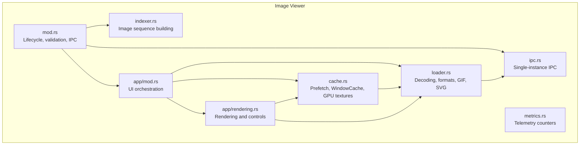
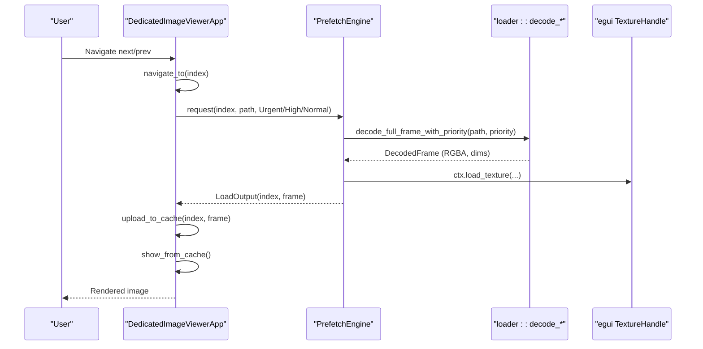
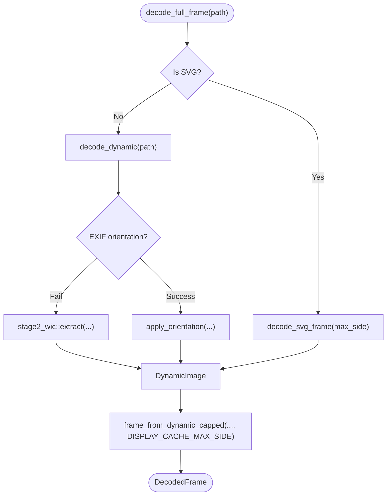
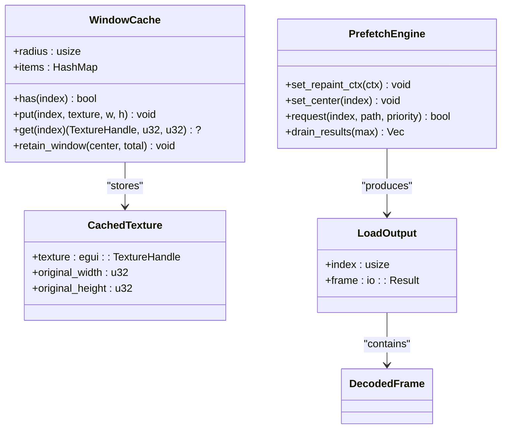
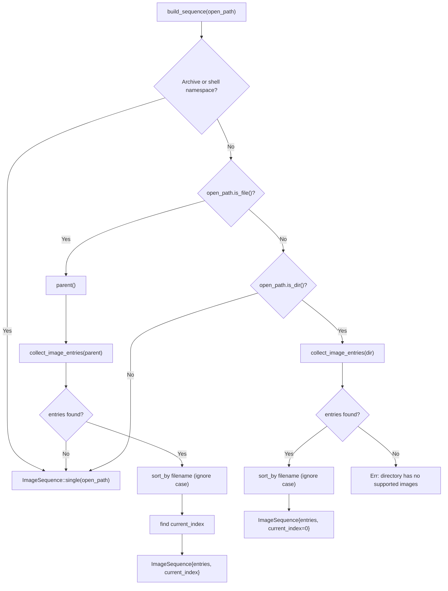
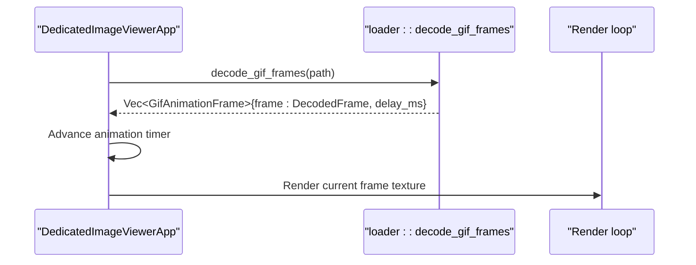
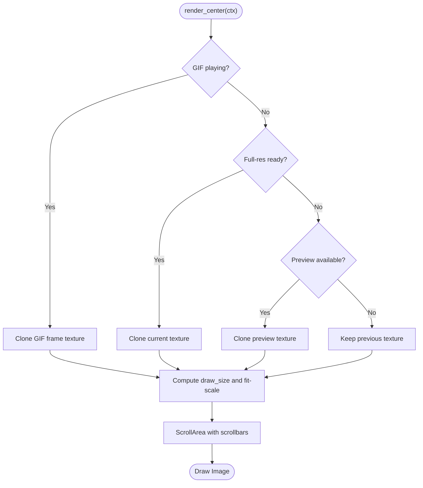
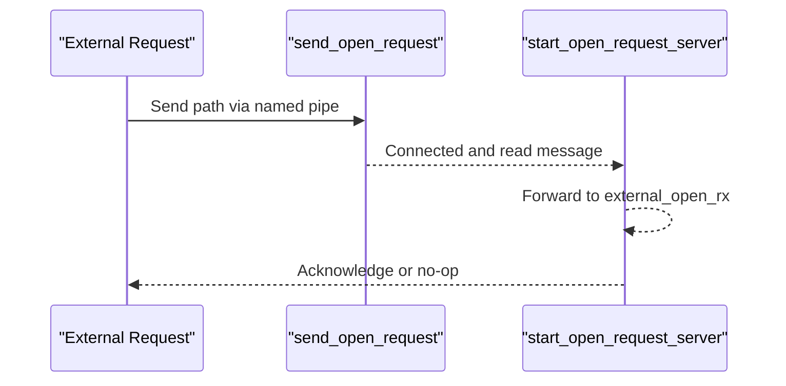
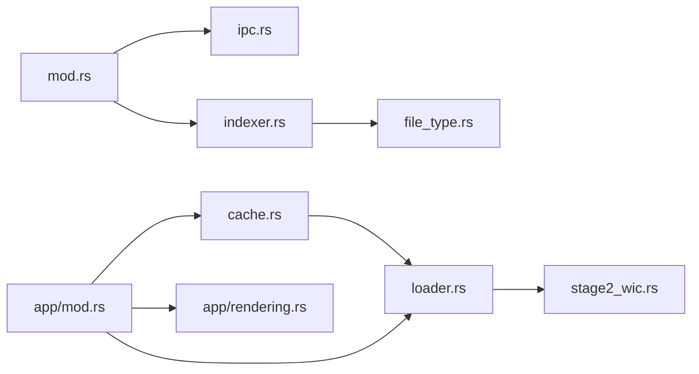

# Image Viewer

<cite>
**Referenced Files in This Document**
- [mod.rs](file://src/image_viewer/mod.rs)
- [loader.rs](file://src/image_viewer/loader.rs)
- [cache.rs](file://src/image_viewer/cache.rs)
- [indexer.rs](file://src/image_viewer/indexer.rs)
- [ipc.rs](file://src/image_viewer/ipc.rs)
- [metrics.rs](file://src/image_viewer/metrics.rs)
- [app/mod.rs](file://src/image_viewer/app/mod.rs)
- [app/rendering.rs](file://src/image_viewer/app/rendering.rs)
- [file_type.rs](file://src/infrastructure/windows/file_type.rs)
- [stage2_wic.rs](file://src/workers/thumbnail/extraction/stage2_wic.rs)
</cite>

## Table of Contents
1. [Introduction](#introduction)
2. [Project Structure](#project-structure)
3. [Core Components](#core-components)
4. [Architecture Overview](#architecture-overview)
5. [Detailed Component Analysis](#detailed-component-analysis)
6. [Dependency Analysis](#dependency-analysis)
7. [Performance Considerations](#performance-considerations)
8. [Troubleshooting Guide](#troubleshooting-guide)
9. [Conclusion](#conclusion)

## Introduction
This document describes the MTT File Manager’s Image Viewer subsystem. It explains the multi-stage image loading pipeline, GPU texture caching, progressive loading, format support and fallbacks, the image indexer for pre-processing and metadata extraction, animated GIF playback, image manipulation controls, integration with the preview panel, and performance metrics/caching strategies.

## Project Structure
The Image Viewer is implemented as a standalone eframe application with a focused set of modules:
- Application lifecycle and UI orchestration
- Image loader and format decoding
- GPU texture cache and prefetch engine
- Image sequence indexer
- Inter-process communication for single-instance forwarding
- Metrics for performance telemetry

**Diagram sources**
- [mod.rs:125-318](file://src/image_viewer/mod.rs#L125-L318)
- [app/mod.rs:78-143](file://src/image_viewer/app/mod.rs#L78-L143)
- [app/rendering.rs:8-242](file://src/image_viewer/app/rendering.rs#L8-L242)
- [loader.rs:194-524](file://src/image_viewer/loader.rs#L194-L524)
- [cache.rs:46-306](file://src/image_viewer/cache.rs#L46-L306)
- [indexer.rs:19-66](file://src/image_viewer/indexer.rs#L19-L66)
- [ipc.rs:30-147](file://src/image_viewer/ipc.rs#L30-L147)
- [metrics.rs:3-42](file://src/image_viewer/metrics.rs#L3-L42)

**Section sources**
- [mod.rs:125-318](file://src/image_viewer/mod.rs#L125-L318)
- [app/mod.rs:78-143](file://src/image_viewer/app/mod.rs#L78-L143)
- [app/rendering.rs:8-242](file://src/image_viewer/app/rendering.rs#L8-L242)
- [loader.rs:194-524](file://src/image_viewer/loader.rs#L194-L524)
- [cache.rs:46-306](file://src/image_viewer/cache.rs#L46-L306)
- [indexer.rs:19-66](file://src/image_viewer/indexer.rs#L19-L66)
- [ipc.rs:30-147](file://src/image_viewer/ipc.rs#L30-L147)
- [metrics.rs:3-42](file://src/image_viewer/metrics.rs#L3-L42)

## Core Components
- Lifecycle and validation: single-instance enforcement, path validation, and IPC forwarding to an existing viewer instance.
- Image loader: supports JPEG, PNG, BMP, TIFF, GIF, WebP, ICO, and SVG; includes EXIF orientation handling and Windows Imaging Component (WIC) fallback.
- Prefetch engine and GPU cache: sliding-window prefetch with prioritized loads, storing decoded frames as GPU textures to reduce CPU memory pressure.
- Image indexer: builds a sorted sequence of supported images around an open path, with safeguards for archives and shell namespaces.
- Rendering and controls: zoom, fit-to-window, mousewheel/keyboard controls, animated GIF playback, and integration with the preview panel.
- Metrics: atomic counters for decode and upload latency.

**Section sources**
- [mod.rs:18-123](file://src/image_viewer/mod.rs#L18-L123)
- [loader.rs:64-105](file://src/image_viewer/loader.rs#L64-L105)
- [cache.rs:46-106](file://src/image_viewer/cache.rs#L46-L106)
- [indexer.rs:19-66](file://src/image_viewer/indexer.rs#L19-L66)
- [app/mod.rs:28-76](file://src/image_viewer/app/mod.rs#L28-L76)
- [metrics.rs:3-42](file://src/image_viewer/metrics.rs#L3-L42)

## Architecture Overview
The viewer separates concerns across modules:
- UI orchestrator schedules navigation, prefetches, and renders the current image.
- Loader decodes images and optionally converts to RGBA with EXIF orientation.
- Prefetch engine coordinates worker threads and channels to decode images in the sliding window.
- GPU cache stores lightweight TextureHandles and evicts based on the current window.
- IPC enables single-instance behavior and external open requests.
- Metrics capture decode/upload timings for telemetry.

**Diagram sources**
- [app/mod.rs:517-602](file://src/image_viewer/app/mod.rs#L517-L602)
- [cache.rs:118-306](file://src/image_viewer/cache.rs#L118-L306)
- [loader.rs:194-208](file://src/image_viewer/loader.rs#L194-L208)

## Detailed Component Analysis

### Image Loader Pipeline
The loader supports multiple formats and employs a robust fallback path:
- Primary path: image crate with EXIF orientation detection and application.
- Fallback path: Windows Imaging Component (WIC) for problematic inputs (e.g., CMYK JPEGs).
- Preview decoding: uses Triangle filter for photographic content and Nearest for indexed formats (GIF/ICO/BMP).
- SVG decoding: uses usvg/resvg with a 10s timeout and a hard cap on render size.
- Export formats: PNG, JPEG, WebP, BMP, TIFF.

**Diagram sources**
- [loader.rs:194-471](file://src/image_viewer/loader.rs#L194-L471)
- [stage2_wic.rs:16-69](file://src/workers/thumbnail/extraction/stage2_wic.rs#L16-L69)

**Section sources**
- [loader.rs:194-471](file://src/image_viewer/loader.rs#L194-L471)
- [stage2_wic.rs:16-69](file://src/workers/thumbnail/extraction/stage2_wic.rs#L16-L69)

### GPU Texture Management and Caching
The cache stores decoded frames as GPU textures to minimize CPU memory usage:
- WindowCache: sliding window keyed by image index, storing TextureHandle and original dimensions.
- PrefetchEngine: worker threads decode images and upload to GPU; results are delivered via channels.
- Memory optimization: frames exceeding a max side are downscaled with Lanczos3; original dimensions are preserved for UI reporting.
- Safety caps: GIF decoding limits total RGBA bytes and frame count to prevent OOM.

**Diagram sources**
- [cache.rs:46-106](file://src/image_viewer/cache.rs#L46-L106)
- [cache.rs:118-306](file://src/image_viewer/cache.rs#L118-L306)

**Section sources**
- [cache.rs:46-106](file://src/image_viewer/cache.rs#L46-L106)
- [cache.rs:118-306](file://src/image_viewer/cache.rs#L118-L306)
- [loader.rs:57-62](file://src/image_viewer/loader.rs#L57-L62)
- [loader.rs:115-119](file://src/image_viewer/loader.rs#L115-L119)

### Image Indexer and Preprocessing
The indexer builds a sorted sequence of supported images around the target path:
- Archives and shell namespaces: fallback to single-file mode.
- Directory scanning: enumerates files, filters by supported extensions, sorts case-insensitively.
- Extension detection: leverages Windows perceived-type API with a fast-path for common extensions.

**Diagram sources**
- [indexer.rs:19-66](file://src/image_viewer/indexer.rs#L19-L66)
- [file_type.rs:297-303](file://src/infrastructure/windows/file_type.rs#L297-L303)

**Section sources**
- [indexer.rs:19-118](file://src/image_viewer/indexer.rs#L19-L118)
- [file_type.rs:297-303](file://src/infrastructure/windows/file_type.rs#L297-L303)

### Animated GIF Playback Engine
The GIF engine decodes frames with safety caps and plays them with per-frame delays:
- Decoding: iterates frames, computes delay_ms, aggregates RGBA bytes, and caps frames and total bytes.
- Playback: maintains a GifAnimation state with per-frame textures and advances based on elapsed time.

**Diagram sources**
- [loader.rs:121-192](file://src/image_viewer/loader.rs#L121-L192)
- [app/mod.rs:773-777](file://src/image_viewer/app/mod.rs#L773-L777)

**Section sources**
- [loader.rs:121-192](file://src/image_viewer/loader.rs#L121-L192)
- [app/mod.rs:773-777](file://src/image_viewer/app/mod.rs#L773-L777)

### Rendering, Zoom Controls, and Integration with Preview Panel
The rendering layer provides:
- Zoom controls: slider, mousewheel, and click-to-zoom with bounds.
- Fit-to-window behavior: scales down to fit but preserves native size for accurate percentage reporting.
- Preview textures: displays low-res previews while full-res decodes are in progress.
- Integration: updates window title, bottom bar info, and filmstrip scrolling.

**Diagram sources**
- [app/rendering.rs:113-242](file://src/image_viewer/app/rendering.rs#L113-L242)
- [app/mod.rs:113-137](file://src/image_viewer/app/mod.rs#L113-L137)

**Section sources**
- [app/rendering.rs:8-242](file://src/image_viewer/app/rendering.rs#L8-L242)
- [app/mod.rs:113-137](file://src/image_viewer/app/mod.rs#L113-L137)

### IPC and Single Instance
The viewer enforces single-instance semantics and forwards open requests:
- Mutex guard for single-instance enforcement.
- Named pipe IPC to accept external open requests and forward them to the running instance.
- Security: DACL restricted to current user and SYSTEM; rejects NUL bytes and oversized messages.

**Diagram sources**
- [ipc.rs:30-147](file://src/image_viewer/ipc.rs#L30-L147)
- [mod.rs:125-199](file://src/image_viewer/mod.rs#L125-L199)

**Section sources**
- [ipc.rs:30-147](file://src/image_viewer/ipc.rs#L30-L147)
- [mod.rs:18-75](file://src/image_viewer/mod.rs#L18-L75)

### Performance Metrics and Telemetry
Metrics capture decode and upload latencies:
- Atomic counters track total elapsed microseconds and counts.
- Average decode/upload durations computed from totals.

**Section sources**
- [metrics.rs:3-42](file://src/image_viewer/metrics.rs#L3-L42)

## Dependency Analysis
The viewer’s modules depend on each other as follows:
- mod.rs depends on IPC and indexer for lifecycle and sequence building.
- app/mod.rs orchestrates cache, rendering, loader, and IPC.
- cache.rs depends on loader for decoding and on egui for GPU textures.
- loader.rs depends on image crate, usvg/resvg for SVG, and WIC fallback.
- indexer.rs depends on Windows perceived-type utilities for extension checks.

**Diagram sources**
- [mod.rs:16-18](file://src/image_viewer/mod.rs#L16-L18)
- [indexer.rs:106-111](file://src/image_viewer/indexer.rs#L106-L111)
- [file_type.rs:297-303](file://src/infrastructure/windows/file_type.rs#L297-L303)
- [stage2_wic.rs:16-24](file://src/workers/thumbnail/extraction/stage2_wic.rs#L16-L24)

**Section sources**
- [mod.rs:16-18](file://src/image_viewer/mod.rs#L16-L18)
- [indexer.rs:106-111](file://src/image_viewer/indexer.rs#L106-L111)
- [file_type.rs:297-303](file://src/infrastructure/windows/file_type.rs#L297-L303)
- [stage2_wic.rs:16-24](file://src/workers/thumbnail/extraction/stage2_wic.rs#L16-L24)

## Performance Considerations
- Decode-time caps: GIF frame count and total RGBA bytes prevent OOM; SVG render size capped to a safe maximum.
- Memory caps: DISPLAY_CACHE_MAX_SIDE reduces per-frame RAM for large images; GPU textures are evicted outside the sliding window.
- I/O optimization: memory-map threshold and sequential file flags on Windows; preview decoding uses smaller max_side for near-instant feedback.
- Worker coordination: bounded channels sized to the cache window; urgent jobs preempt normal/high queues; workers wake on signals to avoid busy-wait.
- Rendering: fit-to-window downscales only; zoom is compositional to preserve crispness at native size.

[No sources needed since this section provides general guidance]

## Troubleshooting Guide
Common issues and mitigations:
- Duplicate open requests: debounced within a short interval to avoid spawning multiple instances.
- Unsupported or invalid paths: validation rejects UNC paths, null bytes, and non-images; logs errors and aborts early.
- Large files: enforced maximum file size to prevent excessive memory usage.
- GIF anomalies: truncated to caps; errors logged and viewer continues with static image if needed.
- SVG problems: 10s timeout and size caps; pathological files are rejected to keep the UI responsive.
- WIC fallback: used for formats that image crate struggles with (e.g., CMYK JPEGs).

**Section sources**
- [mod.rs:59-123](file://src/image_viewer/mod.rs#L59-L123)
- [loader.rs:115-119](file://src/image_viewer/loader.rs#L115-L119)
- [loader.rs:319-342](file://src/image_viewer/loader.rs#L319-L342)
- [stage2_wic.rs:16-24](file://src/workers/thumbnail/extraction/stage2_wic.rs#L16-L24)

## Conclusion
The Image Viewer implements a robust, GPU-accelerated image viewing experience with a multi-stage pipeline, progressive loading, and strong safety caps. Its modular design cleanly separates UI orchestration, decoding, prefetching, and caching, enabling smooth navigation, responsive zoom controls, and reliable animated GIF playback. The integration with the broader application’s preview panel and IPC ensures seamless user workflows and optimal performance.