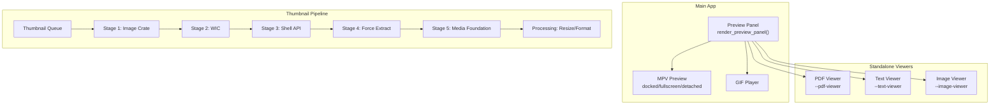
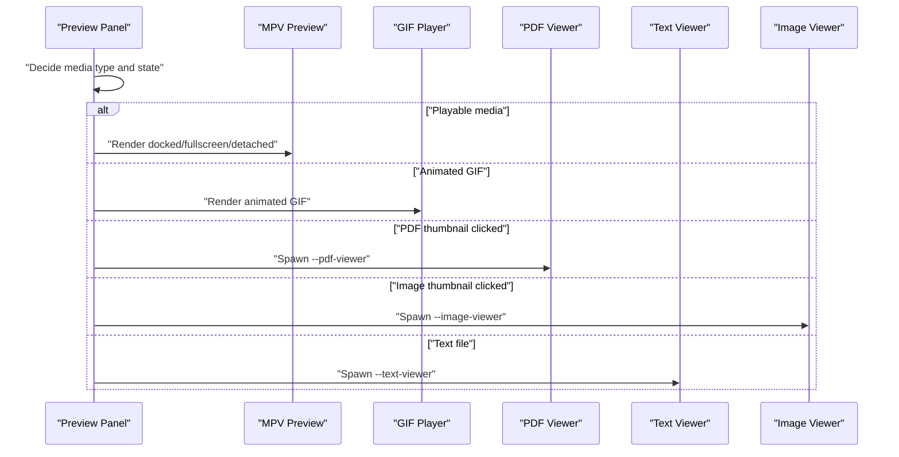
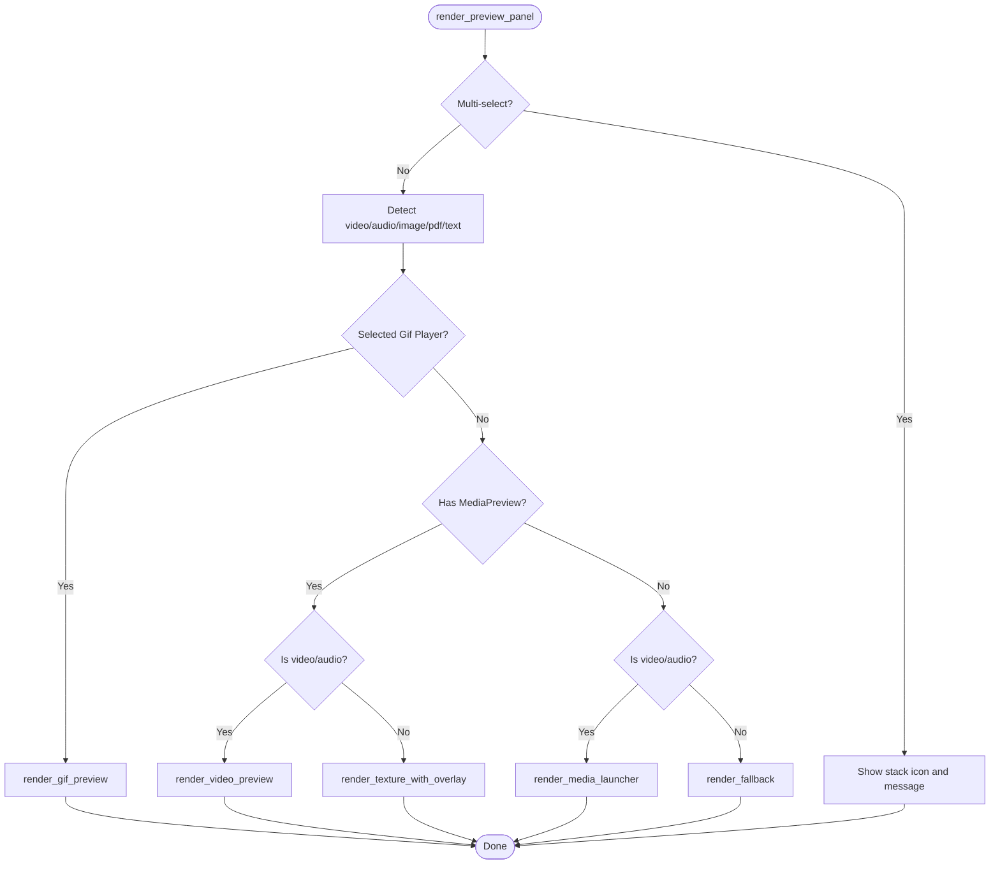
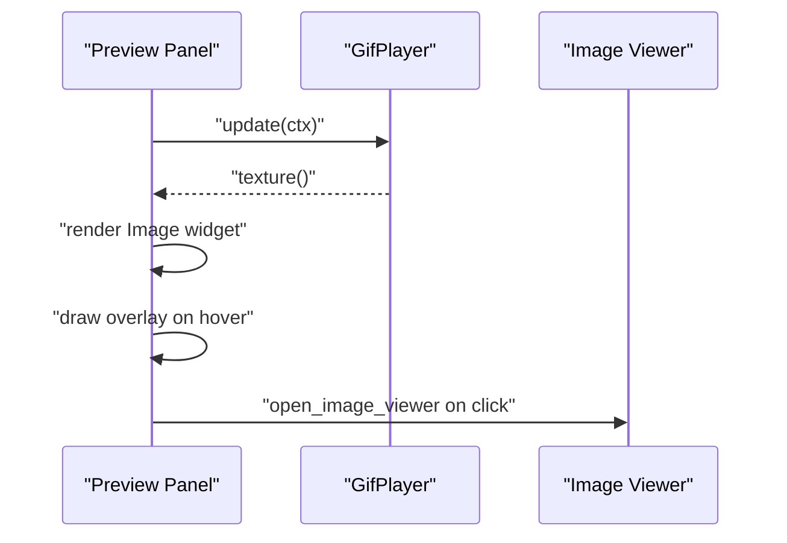
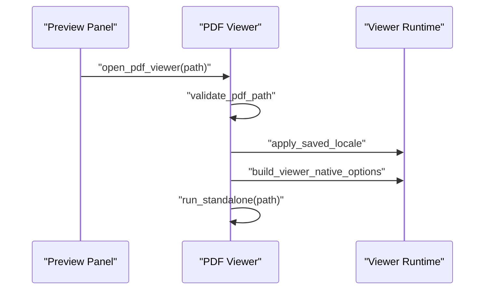
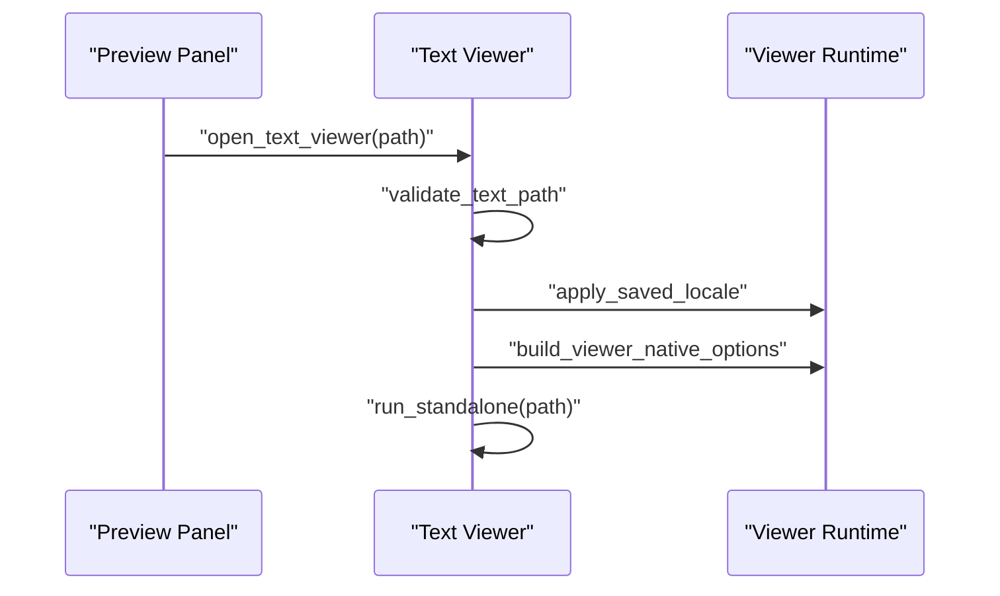
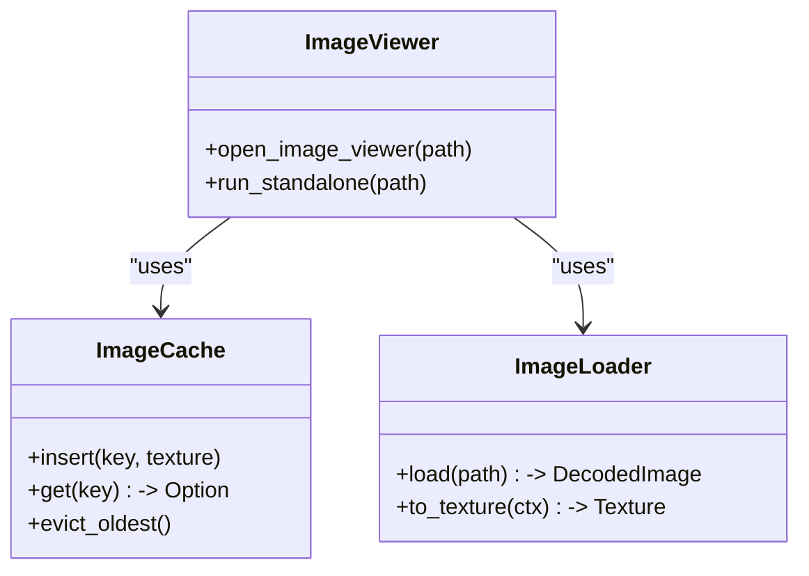
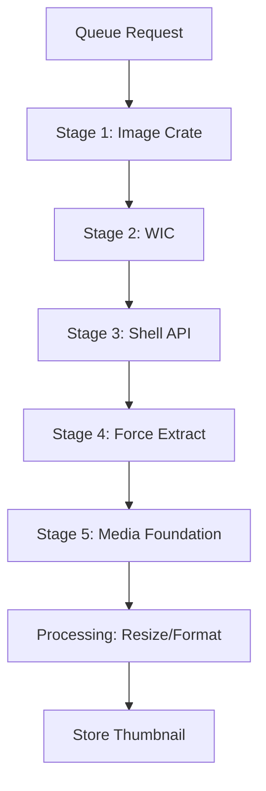
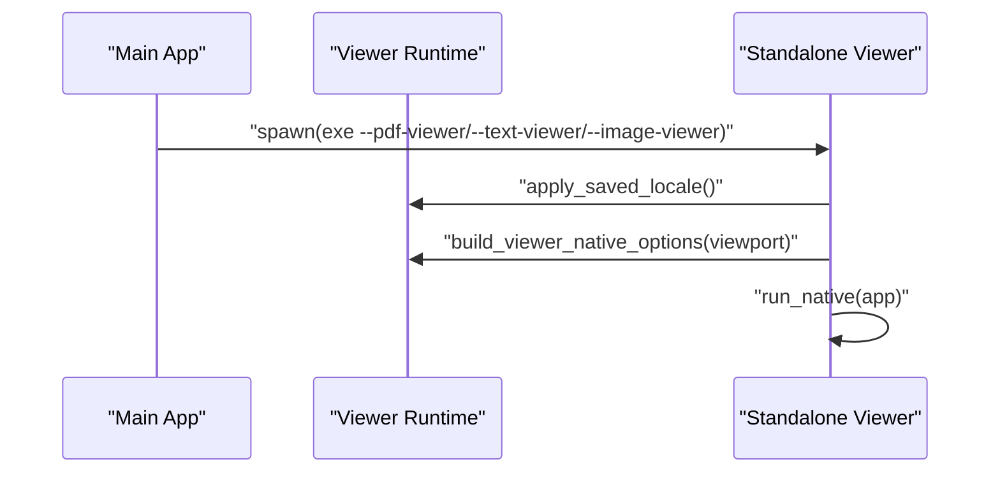
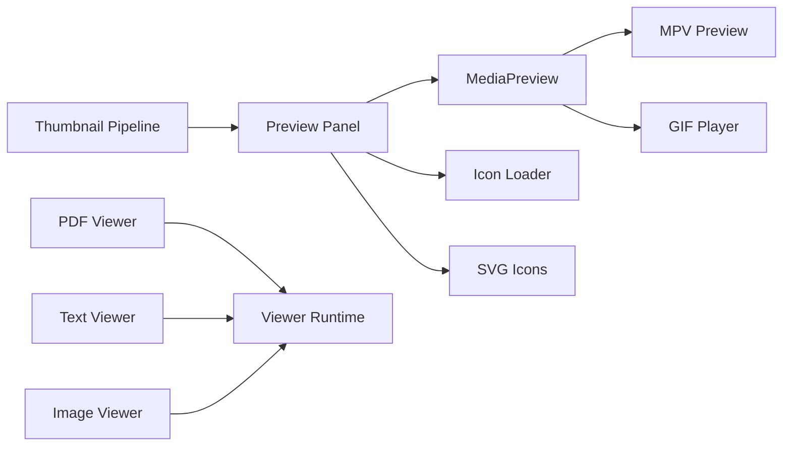

# Media Preview System

<cite>
**Referenced Files in This Document**
- [src/lib.rs](file://src/lib.rs)
- [src/viewer_runtime.rs](file://src/viewer_runtime.rs)
- [src/ui/preview_panel/mod.rs](file://src/ui/preview_panel/mod.rs)
- [src/ui/preview_panel/image_preview.rs](file://src/ui/preview_panel/image_preview.rs)
- [src/ui/preview_panel/video_preview/mod.rs](file://src/ui/preview_panel/video_preview/mod.rs)
- [src/ui/preview_panel/fallback_renderer.rs](file://src/ui/preview_panel/fallback_renderer.rs)
- [src/pdf_viewer/mod.rs](file://src/pdf_viewer/mod.rs)
- [src/text_viewer/mod.rs](file://src/text_viewer/mod.rs)
- [src/ui/components/media_preview.rs](file://src/ui/components/media_preview.rs)
- [src/ui/components/mpv_preview/mod.rs](file://src/ui/components/mpv_preview/mod.rs)
- [src/ui/components/gif_manager.rs](file://src/ui/components/gif_manager.rs)
- [src/workers/thumbnail/mod.rs](file://src/workers/thumbnail/mod.rs)
- [src/workers/thumbnail/extraction/stage1_image_crate.rs](file://src/workers/thumbnail/extraction/stage1_image_crate.rs)
- [src/workers/thumbnail/extraction/stage2_wic.rs](file://src/workers/thumbnail/extraction/stage2_wic.rs)
- [src/workers/thumbnail/extraction/stage3_shell_api.rs](file://src/workers/thumbnail/extraction/stage3_shell_api.rs)
- [src/workers/thumbnail/extraction/stage4_force_extract.rs](file://src/workers/thumbnail/extraction/stage4_force_extract.rs)
- [src/workers/thumbnail/extraction/stage5_media_foundation.rs](file://src/workers/thumbnail/extraction/stage5_media_foundation.rs)
- [src/workers/thumbnail/processing/format_conversion.rs](file://src/workers/thumbnail/processing/format_conversion.rs)
- [src/workers/thumbnail/processing/resize.rs](file://src/workers/thumbnail/processing/resize.rs)
- [src/infrastructure/windows/media_foundation.rs](file://src/infrastructure/windows/media_foundation.rs)
- [src/infrastructure/media/mod.rs](file://src/infrastructure/media/mod.rs)
- [src/infrastructure/media/hardware_acceleration.rs](file://src/infrastructure/media/hardware_acceleration.rs)
- [src/image_viewer/mod.rs](file://src/image_viewer/mod.rs)
- [src/image_viewer/cache.rs](file://src/image_viewer/cache.rs)
- [src/image_viewer/loader.rs](file://src/image_viewer/loader.rs)
- [src/image_viewer/app/mod.rs](file://src/image_viewer/app/mod.rs)
- [src/image_viewer/app/rendering.rs](file://src/image_viewer/app/rendering.rs)
- [src/pdf_viewer/viewer_app.rs](file://src/pdf_viewer/viewer_app.rs)
- [src/pdf_viewer/renderer.rs](file://src/pdf_viewer/renderer.rs)
- [src/pdf_viewer/render_worker.rs](file://src/pdf_viewer/render_worker.rs)
- [src/pdf_viewer/selection.rs](file://src/pdf_viewer/selection.rs)
- [src/text_viewer/viewer_app.rs](file://src/text_viewer/viewer_app.rs)
- [src/video_player/mod.rs](file://src/video_player/mod.rs)
- [src/ui/components/mpv/event_loop.rs](file://src/ui/components/mpv/event_loop.rs)
- [src/ui/components/mpv/playback.rs](file://src/ui/components/mpv/playback.rs)
- [src/ui/components/mpv/state.rs](file://src/ui/components/mpv/state.rs)
- [src/ui/components/mpv/utils.rs](file://src/ui/components/mpv/utils.rs)
</cite>

## Table of Contents
1. [Introduction](#introduction)
2. [Project Structure](#project-structure)
3. [Core Components](#core-components)
4. [Architecture Overview](#architecture-overview)
5. [Detailed Component Analysis](#detailed-component-analysis)
6. [Dependency Analysis](#dependency-analysis)
7. [Performance Considerations](#performance-considerations)
8. [Troubleshooting Guide](#troubleshooting-guide)
9. [Conclusion](#conclusion)

## Introduction
This document describes the MTT File Manager’s media preview system. It covers the integrated preview panel architecture that provides a unified, responsive interface for viewing images, PDFs, text files, and playable media. It also documents the standalone viewer processes for each media type, the multi-stage thumbnail generation pipeline, and the viewer runtime architecture that ensures process isolation and efficient resource usage. Media-specific features such as animated GIF playback, PDF text selection, video controls, and image manipulation capabilities are explained, along with performance optimizations and memory management strategies.

## Project Structure
The media preview system spans several modules:
- Preview panel rendering and orchestration
- Standalone viewers for PDF, text, and image
- Thumbnail generation pipeline
- Video playback integration via mpv
- Viewer runtime helpers for lightweight subprocesses



**Diagram sources**
- [src/ui/preview_panel/mod.rs:22-180](file://src/ui/preview_panel/mod.rs#L22-L180)
- [src/ui/preview_panel/video_preview/mod.rs:121-192](file://src/ui/preview_panel/video_preview/mod.rs#L121-L192)
- [src/pdf_viewer/mod.rs:114-139](file://src/pdf_viewer/mod.rs#L114-L139)
- [src/text_viewer/mod.rs:126-149](file://src/text_viewer/mod.rs#L126-L149)
- [src/workers/thumbnail/mod.rs](file://src/workers/thumbnail/mod.rs)
- [src/workers/thumbnail/extraction/stage1_image_crate.rs](file://src/workers/thumbnail/extraction/stage1_image_crate.rs)
- [src/workers/thumbnail/extraction/stage2_wic.rs](file://src/workers/thumbnail/extraction/stage2_wic.rs)
- [src/workers/thumbnail/extraction/stage3_shell_api.rs](file://src/workers/thumbnail/extraction/stage3_shell_api.rs)
- [src/workers/thumbnail/extraction/stage4_force_extract.rs](file://src/workers/thumbnail/extraction/stage4_force_extract.rs)
- [src/workers/thumbnail/extraction/stage5_media_foundation.rs](file://src/workers/thumbnail/extraction/stage5_media_foundation.rs)
- [src/workers/thumbnail/processing/resize.rs](file://src/workers/thumbnail/processing/resize.rs)

**Section sources**
- [src/lib.rs:1-20](file://src/lib.rs#L1-L20)
- [src/ui/preview_panel/mod.rs:1-181](file://src/ui/preview_panel/mod.rs#L1-L181)

## Core Components
- Preview Panel orchestrator: Decides which preview to render based on selection state, media type, and availability of thumbnails or active media playback.
- Video Preview: Docked, detached, and fullscreen modes powered by MPV integration.
- GIF Preview: Native animated GIF playback with overlay controls.
- Fallback Renderer: Renders icons and placeholders when previews are unavailable.
- Standalone Viewers: PDF, Text, and Image viewers launched as separate processes for isolation and performance.
- Thumbnail Pipeline: Multi-stage extraction and processing pipeline feeding the preview system.

**Section sources**
- [src/ui/preview_panel/mod.rs:22-180](file://src/ui/preview_panel/mod.rs#L22-L180)
- [src/ui/preview_panel/video_preview/mod.rs:15-192](file://src/ui/preview_panel/video_preview/mod.rs#L15-L192)
- [src/ui/preview_panel/image_preview.rs:39-139](file://src/ui/preview_panel/image_preview.rs#L39-L139)
- [src/ui/preview_panel/fallback_renderer.rs:36-227](file://src/ui/preview_panel/fallback_renderer.rs#L36-L227)
- [src/pdf_viewer/mod.rs:114-139](file://src/pdf_viewer/mod.rs#L114-L139)
- [src/text_viewer/mod.rs:126-149](file://src/text_viewer/mod.rs#L126-L149)

## Architecture Overview
The preview system integrates UI rendering with media playback and external viewers. The main application renders a preview panel that either launches a standalone viewer or embeds playback controls. Thumbnails are generated off-main-thread and cached for quick display.



**Diagram sources**
- [src/ui/preview_panel/mod.rs:103-143](file://src/ui/preview_panel/mod.rs#L103-L143)
- [src/ui/preview_panel/video_preview/mod.rs:121-192](file://src/ui/preview_panel/video_preview/mod.rs#L121-L192)
- [src/ui/preview_panel/image_preview.rs:96-139](file://src/ui/preview_panel/image_preview.rs#L96-L139)
- [src/pdf_viewer/mod.rs:114-139](file://src/pdf_viewer/mod.rs#L114-L139)
- [src/text_viewer/mod.rs:126-149](file://src/text_viewer/mod.rs#L126-L149)

## Detailed Component Analysis

### Preview Panel Orchestration
The preview panel coordinates rendering across multiple media types and states:
- Determines if the selected item is media and whether a thumbnail is available.
- Chooses between GIF playback, video preview, image/PDF launch overlays, or fallback rendering.
- Delegates to docked, detached, or fullscreen video rendering depending on ownership and maximization state.



**Diagram sources**
- [src/ui/preview_panel/mod.rs:22-180](file://src/ui/preview_panel/mod.rs#L22-L180)

**Section sources**
- [src/ui/preview_panel/mod.rs:22-180](file://src/ui/preview_panel/mod.rs#L22-L180)

### Video Preview and MPV Integration
Video playback is handled by the MPV preview subsystem with three presentation modes:
- Docked: Integrated into the preview panel with compact controls.
- Detached: Floating window bound to a tab.
- Fullscreen: Dedicated fullscreen mode with on-screen controls.

```mermaid
classDiagram
class MediaPreview {
+bool is_detached()
+bool is_maximized()
+Option<Path> path()
+get_video_state() PlaybackState
}
class MPV_Docked {
+render(ctx, state, time, duration, volume, muted, playing)
}
class MPV_Detached {
+render(ctx, state, time, duration, volume, muted, playing)
}
class MPV_Fullscreen {
+render(ctx, state, time, duration, volume, muted, playing)
}
MediaPreview --> MPV_Docked : "docked mode"
MediaPreview --> MPV_Detached : "detached mode"
MediaPreview --> MPV_Fullscreen : "fullscreen mode"
```

**Diagram sources**
- [src/ui/preview_panel/video_preview/mod.rs:121-192](file://src/ui/preview_panel/video_preview/mod.rs#L121-L192)
- [src/ui/components/media_preview.rs](file://src/ui/components/media_preview.rs)
- [src/ui/components/mpv_preview/mod.rs](file://src/ui/components/mpv_preview/mod.rs)

**Section sources**
- [src/ui/preview_panel/video_preview/mod.rs:121-192](file://src/ui/preview_panel/video_preview/mod.rs#L121-L192)
- [src/ui/components/mpv_preview/mod.rs](file://src/ui/components/mpv_preview/mod.rs)

### Animated GIF Playback
Animated GIFs are rendered directly in the preview panel with an overlay that allows launching the image viewer for advanced features.



**Diagram sources**
- [src/ui/preview_panel/image_preview.rs:96-139](file://src/ui/preview_panel/image_preview.rs#L96-L139)
- [src/ui/components/gif_manager.rs](file://src/ui/components/gif_manager.rs)

**Section sources**
- [src/ui/preview_panel/image_preview.rs:96-139](file://src/ui/preview_panel/image_preview.rs#L96-L139)

### PDF Viewer
The PDF viewer is a standalone process launched with a validated path. It uses a lightweight runtime configuration and a bounded texture cache for page rendering.



**Diagram sources**
- [src/pdf_viewer/mod.rs:114-139](file://src/pdf_viewer/mod.rs#L114-L139)
- [src/pdf_viewer/mod.rs:142-202](file://src/pdf_viewer/mod.rs#L142-L202)
- [src/viewer_runtime.rs:58-85](file://src/viewer_runtime.rs#L58-L85)

**Section sources**
- [src/pdf_viewer/mod.rs:1-223](file://src/pdf_viewer/mod.rs#L1-L223)
- [src/viewer_runtime.rs:1-86](file://src/viewer_runtime.rs#L1-L86)

### Text Viewer
The text viewer supports a wide range of text-based formats and is launched as a separate process after path validation.



**Diagram sources**
- [src/text_viewer/mod.rs:126-149](file://src/text_viewer/mod.rs#L126-L149)
- [src/text_viewer/mod.rs:153-210](file://src/text_viewer/mod.rs#L153-L210)
- [src/viewer_runtime.rs:58-85](file://src/viewer_runtime.rs#L58-L85)

**Section sources**
- [src/text_viewer/mod.rs:1-228](file://src/text_viewer/mod.rs#L1-L228)
- [src/viewer_runtime.rs:1-86](file://src/viewer_runtime.rs#L1-L86)

### Image Viewer
The image viewer is launched for still images and GIFs. It includes GPU texture caching and rendering utilities.



**Diagram sources**
- [src/image_viewer/mod.rs](file://src/image_viewer/mod.rs)
- [src/image_viewer/cache.rs](file://src/image_viewer/cache.rs)
- [src/image_viewer/loader.rs](file://src/image_viewer/loader.rs)

**Section sources**
- [src/image_viewer/mod.rs](file://src/image_viewer/mod.rs)
- [src/image_viewer/cache.rs](file://src/image_viewer/cache.rs)
- [src/image_viewer/loader.rs](file://src/image_viewer/loader.rs)

### Thumbnail Generation Pipeline
The thumbnail pipeline extracts and processes thumbnails through multiple stages, ensuring robust coverage across formats and systems.



**Diagram sources**
- [src/workers/thumbnail/mod.rs](file://src/workers/thumbnail/mod.rs)
- [src/workers/thumbnail/extraction/stage1_image_crate.rs](file://src/workers/thumbnail/extraction/stage1_image_crate.rs)
- [src/workers/thumbnail/extraction/stage2_wic.rs](file://src/workers/thumbnail/extraction/stage2_wic.rs)
- [src/workers/thumbnail/extraction/stage3_shell_api.rs](file://src/workers/thumbnail/extraction/stage3_shell_api.rs)
- [src/workers/thumbnail/extraction/stage4_force_extract.rs](file://src/workers/thumbnail/extraction/stage4_force_extract.rs)
- [src/workers/thumbnail/extraction/stage5_media_foundation.rs](file://src/workers/thumbnail/extraction/stage5_media_foundation.rs)
- [src/workers/thumbnail/processing/resize.rs](file://src/workers/thumbnail/processing/resize.rs)
- [src/workers/thumbnail/processing/format_conversion.rs](file://src/workers/thumbnail/processing/format_conversion.rs)

**Section sources**
- [src/workers/thumbnail/mod.rs](file://src/workers/thumbnail/mod.rs)
- [src/workers/thumbnail/extraction/stage1_image_crate.rs](file://src/workers/thumbnail/extraction/stage1_image_crate.rs)
- [src/workers/thumbnail/extraction/stage2_wic.rs](file://src/workers/thumbnail/extraction/stage2_wic.rs)
- [src/workers/thumbnail/extraction/stage3_shell_api.rs](file://src/workers/thumbnail/extraction/stage3_shell_api.rs)
- [src/workers/thumbnail/extraction/stage4_force_extract.rs](file://src/workers/thumbnail/extraction/stage4_force_extract.rs)
- [src/workers/thumbnail/extraction/stage5_media_foundation.rs](file://src/workers/thumbnail/extraction/stage5_media_foundation.rs)
- [src/workers/thumbnail/processing/resize.rs](file://src/workers/thumbnail/processing/resize.rs)
- [src/workers/thumbnail/processing/format_conversion.rs](file://src/workers/thumbnail/processing/format_conversion.rs)

### Viewer Runtime Architecture and IPC
Standalone viewers are separate processes spawned from the main executable. They use a shared runtime module to minimize startup costs and configure eframe with a lightweight renderer and reduced buffers.



**Diagram sources**
- [src/pdf_viewer/mod.rs:114-139](file://src/pdf_viewer/mod.rs#L114-L139)
- [src/text_viewer/mod.rs:126-149](file://src/text_viewer/mod.rs#L126-L149)
- [src/viewer_runtime.rs:58-85](file://src/viewer_runtime.rs#L58-L85)

**Section sources**
- [src/viewer_runtime.rs:1-86](file://src/viewer_runtime.rs#L1-L86)
- [src/pdf_viewer/mod.rs:114-139](file://src/pdf_viewer/mod.rs#L114-L139)
- [src/text_viewer/mod.rs:126-149](file://src/text_viewer/mod.rs#L126-L149)

### Media-Specific Features
- Animated GIF playback: Native animation with overlay to open the image viewer.
- PDF text selection: Implemented in the PDF viewer with a selection model and rendering worker.
- Video controls: Docked, detached, and fullscreen modes expose playback state and controls.
- Image manipulation: Image viewer supports decoding, caching, and rendering with GPU textures.

**Section sources**
- [src/ui/preview_panel/image_preview.rs:96-139](file://src/ui/preview_panel/image_preview.rs#L96-L139)
- [src/pdf_viewer/selection.rs](file://src/pdf_viewer/selection.rs)
- [src/pdf_viewer/render_worker.rs](file://src/pdf_viewer/render_worker.rs)
- [src/ui/components/mpv_preview/mod.rs](file://src/ui/components/mpv_preview/mod.rs)
- [src/image_viewer/cache.rs](file://src/image_viewer/cache.rs)

## Dependency Analysis
The preview system exhibits clear separation of concerns:
- Preview panel depends on media metadata, icon loaders, and SVG managers.
- Video preview depends on MPV components and playback state.
- Standalone viewers depend on the viewer runtime and platform-specific media support.
- Thumbnail pipeline is decoupled and feeds the UI asynchronously.



**Diagram sources**
- [src/ui/preview_panel/mod.rs:1-181](file://src/ui/preview_panel/mod.rs#L1-L181)
- [src/ui/components/media_preview.rs](file://src/ui/components/media_preview.rs)
- [src/ui/components/mpv_preview/mod.rs](file://src/ui/components/mpv_preview/mod.rs)
- [src/pdf_viewer/mod.rs:1-223](file://src/pdf_viewer/mod.rs#L1-L223)
- [src/text_viewer/mod.rs:1-228](file://src/text_viewer/mod.rs#L1-L228)
- [src/viewer_runtime.rs:1-86](file://src/viewer_runtime.rs#L1-L86)
- [src/workers/thumbnail/mod.rs](file://src/workers/thumbnail/mod.rs)

**Section sources**
- [src/ui/preview_panel/mod.rs:1-181](file://src/ui/preview_panel/mod.rs#L1-L181)
- [src/pdf_viewer/mod.rs:1-223](file://src/pdf_viewer/mod.rs#L1-L223)
- [src/text_viewer/mod.rs:1-228](file://src/text_viewer/mod.rs#L1-L228)
- [src/viewer_runtime.rs:1-86](file://src/viewer_runtime.rs#L1-L86)
- [src/workers/thumbnail/mod.rs](file://src/workers/thumbnail/mod.rs)

## Performance Considerations
- Lightweight runtime for standalone viewers: Uses a minimal eframe configuration with the Glow renderer and disables unused buffers to reduce memory footprint.
- Thumbnail pipeline stages: Progressive fallback increases success rate across diverse file types and systems.
- Bounded texture caches: PDF viewer maintains a bounded texture cache with eviction policies to control memory usage.
- Non-blocking icon loading: Fallback renderer uses non-blocking icon loading with immediate fallbacks to keep UI responsive.
- Hardware acceleration: Media foundation and hardware acceleration modules enable GPU-accelerated decoding where supported.

[No sources needed since this section provides general guidance]

## Troubleshooting Guide
Common issues and remedies:
- PDF viewer fails to open: Verify path validation passes and file size is within limits. Check logs for validation errors.
- Text viewer rejects file: Confirm extension is recognized and file size is below the maximum threshold.
- Thumbnail not appearing: Ensure the thumbnail worker is running and the pipeline stages are completing. Check for errors in stage-specific modules.
- Video controls not responding: Verify MPV preview state and that the correct mode (docked/detached/fullscreen) is active.
- GIF not animating: Confirm the GIF player is initialized and the overlay click handler is enabled.

**Section sources**
- [src/pdf_viewer/mod.rs:39-111](file://src/pdf_viewer/mod.rs#L39-L111)
- [src/text_viewer/mod.rs:51-123](file://src/text_viewer/mod.rs#L51-L123)
- [src/ui/preview_panel/fallback_renderer.rs:127-146](file://src/ui/preview_panel/fallback_renderer.rs#L127-L146)
- [src/ui/preview_panel/video_preview/mod.rs:143-190](file://src/ui/preview_panel/video_preview/mod.rs#L143-L190)
- [src/ui/preview_panel/image_preview.rs:96-139](file://src/ui/preview_panel/image_preview.rs#L96-L139)

## Conclusion
The MTT File Manager’s media preview system combines an integrated preview panel with robust standalone viewers and a multi-stage thumbnail pipeline. Process isolation ensures stability and performance, while targeted optimizations and bounded caches manage memory efficiently. The modular architecture supports future enhancements and maintains a consistent user experience across different media types.