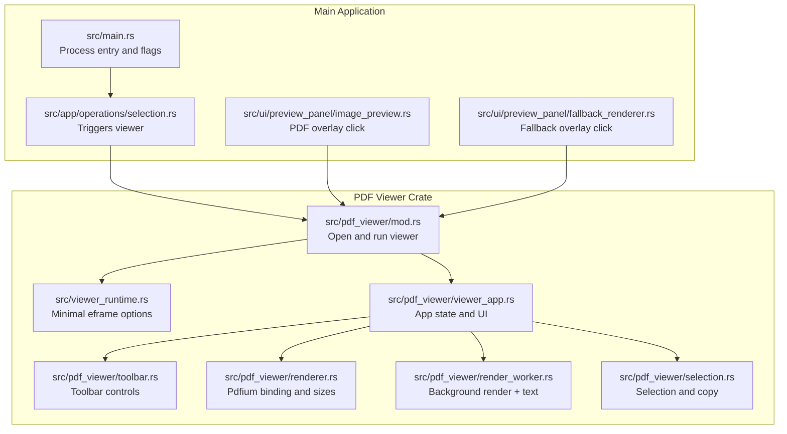
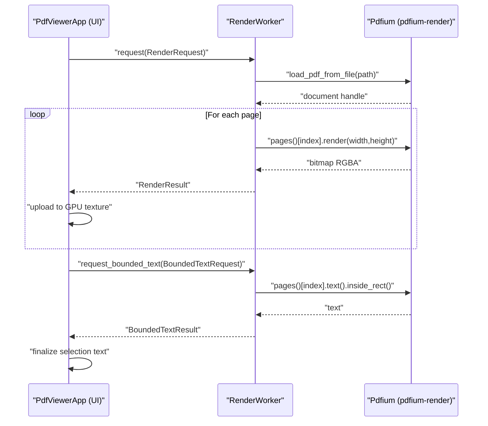
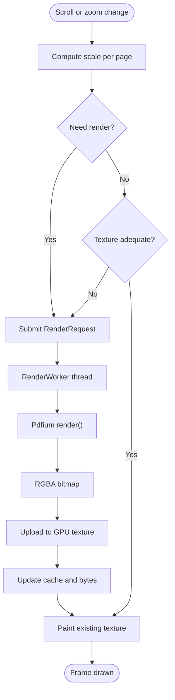
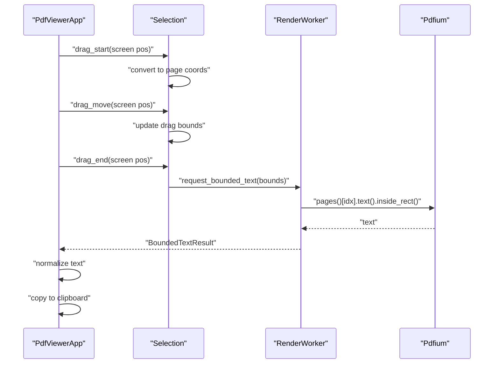
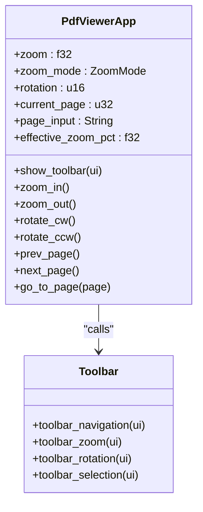
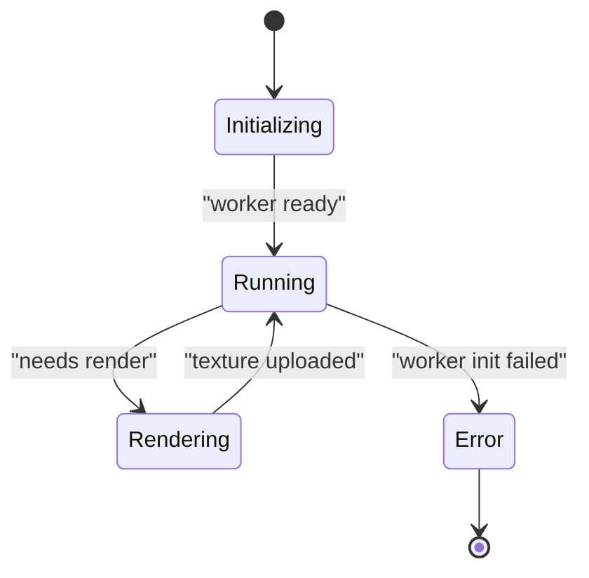
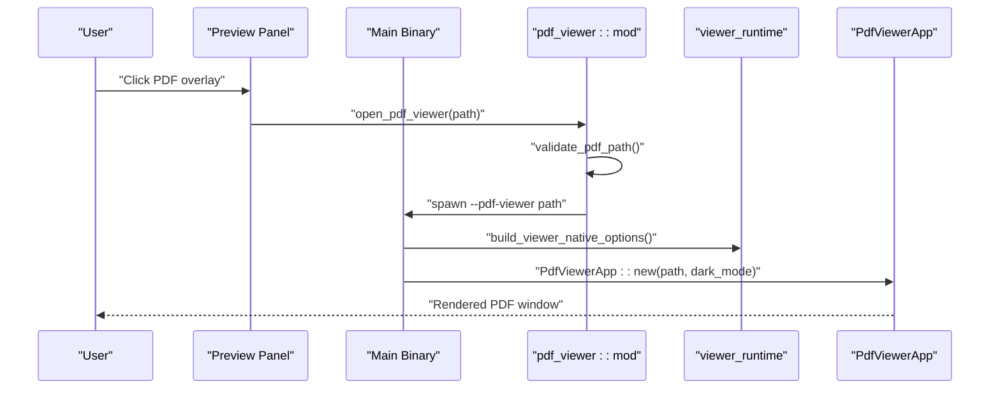
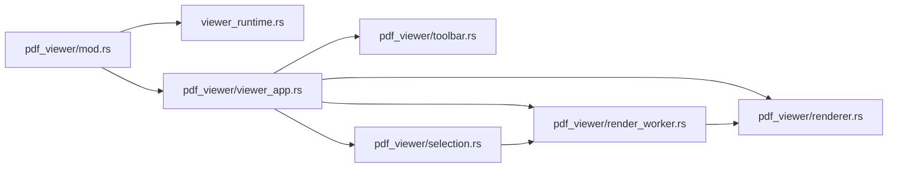

# PDF Viewer

<cite>
**Referenced Files in This Document**
- [Cargo.toml](file://Cargo.toml)
- [main.rs](file://src/main.rs)
- [viewer_runtime.rs](file://src/viewer_runtime.rs)
- [pdf_viewer/mod.rs](file://src/pdf_viewer/mod.rs)
- [pdf_viewer/render_worker.rs](file://src/pdf_viewer/render_worker.rs)
- [pdf_viewer/renderer.rs](file://src/pdf_viewer/renderer.rs)
- [pdf_viewer/toolbar.rs](file://src/pdf_viewer/toolbar.rs)
- [pdf_viewer/selection.rs](file://src/pdf_viewer/selection.rs)
- [pdf_viewer/viewer_app.rs](file://src/pdf_viewer/viewer_app.rs)
- [app/operations/selection.rs](file://src/app/operations/selection.rs)
- [ui/preview_panel/image_preview.rs](file://src/ui/preview_panel/image_preview.rs)
- [ui/preview_panel/fallback_renderer.rs](file://src/ui/preview_panel/fallback_renderer.rs)
</cite>

## Table of Contents
1. [Introduction](#introduction)
2. [Project Structure](#project-structure)
3. [Core Components](#core-components)
4. [Architecture Overview](#architecture-overview)
5. [Detailed Component Analysis](#detailed-component-analysis)
6. [Dependency Analysis](#dependency-analysis)
7. [Performance Considerations](#performance-considerations)
8. [Troubleshooting Guide](#troubleshooting-guide)
9. [Conclusion](#conclusion)

## Introduction
This document explains the MTT File Manager’s native PDF viewer implementation. It covers the rendering architecture using the pdfium-render crate, the asynchronous render worker and main-thread coordination, the toolbar and UI controls (zoom, rotation, navigation), text selection and clipboard integration, the rendering pipeline from PDF parsing to GPU textures, and the viewer process model. It also documents state management, document loading progress, error handling for corrupted PDFs, and integration with the preview panel and the standalone viewer process architecture.

## Project Structure
The PDF viewer is implemented as a separate crate under src/pdf_viewer and is invoked as a standalone process from the main application. The viewer process is spawned with the --pdf-viewer flag and uses a minimal eframe configuration to reduce resource usage.

**Diagram sources**
- [main.rs:144-215](file://src/main.rs#L144-L215)
- [pdf_viewer/mod.rs:113-202](file://src/pdf_viewer/mod.rs#L113-L202)
- [viewer_runtime.rs:75-85](file://src/viewer_runtime.rs#L75-L85)
- [pdf_viewer/viewer_app.rs:521-589](file://src/pdf_viewer/viewer_app.rs#L521-L589)
- [pdf_viewer/toolbar.rs:11-35](file://src/pdf_viewer/toolbar.rs#L11-L35)
- [pdf_viewer/renderer.rs:61-88](file://src/pdf_viewer/renderer.rs#L61-L88)
- [pdf_viewer/render_worker.rs:57-135](file://src/pdf_viewer/render_worker.rs#L57-L135)
- [pdf_viewer/selection.rs:52-269](file://src/pdf_viewer/selection.rs#L52-L269)

**Section sources**
- [main.rs:144-215](file://src/main.rs#L144-L215)
- [pdf_viewer/mod.rs:113-202](file://src/pdf_viewer/mod.rs#L113-L202)
- [viewer_runtime.rs:75-85](file://src/viewer_runtime.rs#L75-L85)

## Core Components
- Viewer entry and process model
  - The viewer is launched as a separate process with the --pdf-viewer flag. It validates the path, applies locale/theme, builds minimal eframe options, and starts the PdfViewerApp.
  - Security checks include null-byte rejection, path traversal prevention, UNC path blocking, extension validation, file existence, and file-size limits.
- PdfRenderer
  - Loads the PDF and extracts page sizes without rendering. Uses pdfium-render with thread-safe bindings and safe library discovery.
- RenderWorker
  - Dedicated thread that owns a persistent Pdfium document handle. Processes render requests and text extraction, prioritizing high-priority bounded-text requests for clipboard copy.
- PdfViewerApp
  - eframe App that manages view state (zoom, rotation, current page), texture cache, pending renders, and UI layout. Handles keyboard shortcuts, prefetching, and GPU-rotated painting via UV mapping.
- Toolbar
  - Provides page navigation, zoom controls, rotation, and selection copy actions.
- Selection
  - Implements drag-to-select text regions, computes page-space bounds, requests bounded text from the worker, and copies to the system clipboard.

**Section sources**
- [pdf_viewer/mod.rs:25-139](file://src/pdf_viewer/mod.rs#L25-L139)
- [pdf_viewer/renderer.rs:61-88](file://src/pdf_viewer/renderer.rs#L61-L88)
- [pdf_viewer/render_worker.rs:57-135](file://src/pdf_viewer/render_worker.rs#L57-L135)
- [pdf_viewer/viewer_app.rs:60-124](file://src/pdf_viewer/viewer_app.rs#L60-L124)
- [pdf_viewer/toolbar.rs:11-171](file://src/pdf_viewer/toolbar.rs#L11-L171)
- [pdf_viewer/selection.rs:52-269](file://src/pdf_viewer/selection.rs#L52-L269)

## Architecture Overview
The viewer uses a strict separation of concerns:
- Main thread (UI): Computes scales, decides when to render, paints textures, handles user input, and manages state.
- Render worker thread: Performs Pdfium operations, extracts text segments, and returns RGBA bitmaps and bounded text.
- Pdfium: Bound once per worker and used for page rendering and text extraction.

**Diagram sources**
- [pdf_viewer/viewer_app.rs:134-180](file://src/pdf_viewer/viewer_app.rs#L134-L180)
- [pdf_viewer/render_worker.rs:137-264](file://src/pdf_viewer/render_worker.rs#L137-L264)
- [pdf_viewer/render_worker.rs:279-297](file://src/pdf_viewer/render_worker.rs#L279-L297)

## Detailed Component Analysis

### Rendering Pipeline and Texture Management
- Page geometry and scale
  - The app computes scale based on zoom mode (fit-width, fit-page, custom) and page rotation. Display size and needed render size are derived from natural page sizes and DPI scaling.
- Texture cache and eviction
  - PageTexture stores GPU textures with render dimensions. A bounded cache tracks total bytes and evicts distant or oldest pages when exceeding the memory budget. A radius window ensures nearby pages remain cached.
- Stale texture display
  - While a render is pending, the app may paint placeholders or rely on the existing texture if it is “adequate” (within 90%–200% of needed size) to avoid wasted re-renders.
- Anti-aliasing and resolution scaling
  - Pdfium performs rasterization at requested width/height. The app caps the longest side to prevent excessive memory usage. Linear sampling is used when uploading textures to eframe.

**Diagram sources**
- [pdf_viewer/viewer_app.rs:198-241](file://src/pdf_viewer/viewer_app.rs#L198-L241)
- [pdf_viewer/viewer_app.rs:245-284](file://src/pdf_viewer/viewer_app.rs#L245-L284)
- [pdf_viewer/viewer_app.rs:433-516](file://src/pdf_viewer/viewer_app.rs#L433-L516)
- [pdf_viewer/render_worker.rs:193-234](file://src/pdf_viewer/render_worker.rs#L193-L234)

**Section sources**
- [pdf_viewer/viewer_app.rs:198-241](file://src/pdf_viewer/viewer_app.rs#L198-L241)
- [pdf_viewer/viewer_app.rs:245-284](file://src/pdf_viewer/viewer_app.rs#L245-L284)
- [pdf_viewer/viewer_app.rs:433-516](file://src/pdf_viewer/viewer_app.rs#L433-L516)
- [pdf_viewer/render_worker.rs:193-234](file://src/pdf_viewer/render_worker.rs#L193-L234)

### Text Selection and Clipboard Integration
- Selection model
  - DragSelection captures anchor and current pointer positions in page coordinates. On release, the bounding box is normalized and used to request bounded text.
- Bounded text extraction
  - The worker extracts text within the selection rectangle and returns it to the UI. The UI normalizes whitespace and updates the selection text.
- Clipboard copy
  - On Ctrl+C or clicking the toolbar “copy selection” button, the app writes the selected text to the Windows clipboard using clipboard_win.

**Diagram sources**
- [pdf_viewer/selection.rs:76-126](file://src/pdf_viewer/selection.rs#L76-L126)
- [pdf_viewer/selection.rs:162-204](file://src/pdf_viewer/selection.rs#L162-L204)
- [pdf_viewer/selection.rs:279-297](file://src/pdf_viewer/selection.rs#L279-L297)
- [pdf_viewer/render_worker.rs:279-297](file://src/pdf_viewer/render_worker.rs#L279-L297)

**Section sources**
- [pdf_viewer/selection.rs:76-126](file://src/pdf_viewer/selection.rs#L76-L126)
- [pdf_viewer/selection.rs:162-204](file://src/pdf_viewer/selection.rs#L162-L204)
- [pdf_viewer/selection.rs:279-297](file://src/pdf_viewer/selection.rs#L279-L297)

### Toolbar Functionality and Controls
- Navigation
  - First/previous/next/last page buttons and editable page field with Enter submission.
- Zoom
  - Zoom-in/out buttons and Fit Width/Fit Page modes. Current zoom percentage is displayed.
- Rotation
  - Clockwise/counterclockwise rotation toggles and degree indicator.
- Selection copy
  - Copy selection enabled only when text is available; shows selection summary.

**Diagram sources**
- [pdf_viewer/viewer_app.rs:337-382](file://src/pdf_viewer/viewer_app.rs#L337-L382)
- [pdf_viewer/toolbar.rs:11-171](file://src/pdf_viewer/toolbar.rs#L11-L171)

**Section sources**
- [pdf_viewer/toolbar.rs:11-171](file://src/pdf_viewer/toolbar.rs#L11-L171)
- [pdf_viewer/viewer_app.rs:337-382](file://src/pdf_viewer/viewer_app.rs#L337-L382)

### Viewer App State and Lifecycle
- State fields
  - Worker path, optional worker handle, total pages, page sizes, zoom/rotation/current page, effective zoom percentage, texture cache, pending set, cache byte counter, page text segments, drag and final selection, worker error, and theme flag.
- Initialization
  - PdfRenderer opens the PDF and collects page sizes. Worker is lazily spawned on first update.
- Update loop
  - Applies theme, ensures worker, polls results, handles keyboard and selection shortcuts, draws toolbar and central panel, and evicts distant textures.

**Diagram sources**
- [pdf_viewer/viewer_app.rs:98-124](file://src/pdf_viewer/viewer_app.rs#L98-L124)
- [pdf_viewer/viewer_app.rs:521-589](file://src/pdf_viewer/viewer_app.rs#L521-L589)

**Section sources**
- [pdf_viewer/viewer_app.rs:60-124](file://src/pdf_viewer/viewer_app.rs#L60-L124)
- [pdf_viewer/viewer_app.rs:521-589](file://src/pdf_viewer/viewer_app.rs#L521-L589)

### Process Model and Integration
- Standalone viewer process
  - The main binary checks for --pdf-viewer and delegates to pdf_viewer::run_standalone, which applies locale/theme, builds minimal eframe options, removes stale storage, and starts PdfViewerApp.
- Preview panel integration
  - When a PDF thumbnail or fallback overlay is clicked, the app spawns the viewer process via pdf_viewer::open_pdf_viewer, which validates the path and spawns the viewer with the same executable and flag.
- Security and robustness
  - Path validation prevents UNC, traversal, null bytes, wrong extension, missing files, and oversized files. On failure, an error window is shown.

**Diagram sources**
- [pdf_viewer/mod.rs:113-139](file://src/pdf_viewer/mod.rs#L113-L139)
- [pdf_viewer/mod.rs:142-202](file://src/pdf_viewer/mod.rs#L142-L202)
- [viewer_runtime.rs:75-85](file://src/viewer_runtime.rs#L75-L85)
- [main.rs:172-175](file://src/main.rs#L172-L175)

**Section sources**
- [pdf_viewer/mod.rs:113-139](file://src/pdf_viewer/mod.rs#L113-L139)
- [pdf_viewer/mod.rs:142-202](file://src/pdf_viewer/mod.rs#L142-L202)
- [viewer_runtime.rs:75-85](file://src/viewer_runtime.rs#L75-L85)
- [main.rs:172-175](file://src/main.rs#L172-L175)

## Dependency Analysis
- External dependencies
  - pdfium-render: PDF parsing and rendering, bound once per worker.
  - crossbeam-channel: Inter-thread communication for render and text requests.
  - clipboard-win: Windows clipboard integration for selection copy.
  - eframe/egui: UI framework and GPU texture upload.
- Internal dependencies
  - viewer_runtime provides minimal eframe options for low-memory viewers.
  - pdf_viewer modules depend on each other: mod.rs orchestrates, viewer_app.rs owns state and UI, toolbar.rs and selection.rs implement controls and selection, renderer.rs binds Pdfium and exposes page sizes, render_worker.rs owns the Pdfium document and performs work.

**Diagram sources**
- [Cargo.toml:48](file://Cargo.toml#L48)
- [pdf_viewer/mod.rs:17-23](file://src/pdf_viewer/mod.rs#L17-L23)
- [pdf_viewer/viewer_app.rs:13-15](file://src/pdf_viewer/viewer_app.rs#L13-L15)

**Section sources**
- [Cargo.toml:48](file://Cargo.toml#L48)
- [pdf_viewer/mod.rs:17-23](file://src/pdf_viewer/mod.rs#L17-L23)

## Performance Considerations
- Worker thread isolation
  - Pdfium operations are performed on a dedicated thread to keep the UI responsive and avoid contention with the thread-safe mutex.
- Efficient caching
  - A bounded texture cache with eviction by distance and memory budget prevents unbounded growth. Adequacy threshold avoids unnecessary re-renders.
- Prefetching
  - Adjacent pages are prefetched around the visible range to reduce perceived latency during scrolling.
- Minimal viewer baseline
  - The standalone viewer uses Glow renderer and disables unused buffers to minimize memory footprint.

[No sources needed since this section provides general guidance]

## Troubleshooting Guide
- Path validation failures
  - Causes include null bytes, path traversal, UNC paths, wrong extension, missing file, or oversized file. The viewer logs the error and may show an error window.
- Pdfium initialization failures
  - The worker attempts to bind Pdfium and load the document. Failures are captured and surfaced to the UI; the app falls back to an error window if initialization fails.
- Render errors
  - Individual page render failures are logged; the UI continues with placeholders or stale textures until a successful render arrives.
- Clipboard copy failures
  - Copy attempts retry a few times; if clipboard access fails, the app logs a warning and informs the user.

**Section sources**
- [pdf_viewer/mod.rs:39-111](file://src/pdf_viewer/mod.rs#L39-L111)
- [pdf_viewer/render_worker.rs:147-170](file://src/pdf_viewer/render_worker.rs#L147-L170)
- [pdf_viewer/render_worker.rs:231-234](file://src/pdf_viewer/render_worker.rs#L231-L234)
- [pdf_viewer/selection.rs:135-151](file://src/pdf_viewer/selection.rs#L135-L151)

## Conclusion
The MTT File Manager’s PDF viewer is a robust, efficient, and secure standalone viewer process that leverages a dedicated render worker and a tight UI loop. It supports intuitive navigation and zoom controls, GPU-accelerated rendering with careful caching, precise text selection with clipboard integration, and resilient error handling. Its modular architecture and process isolation ensure responsiveness and reliability across large documents.