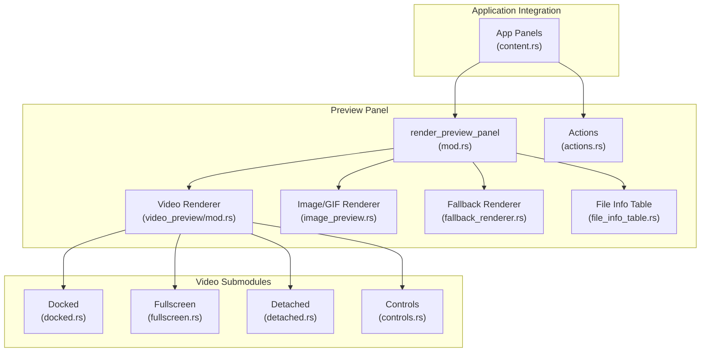
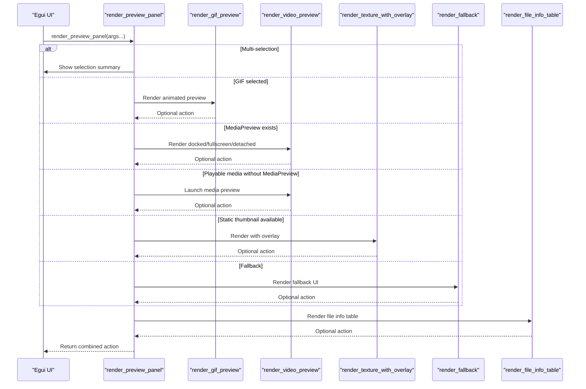
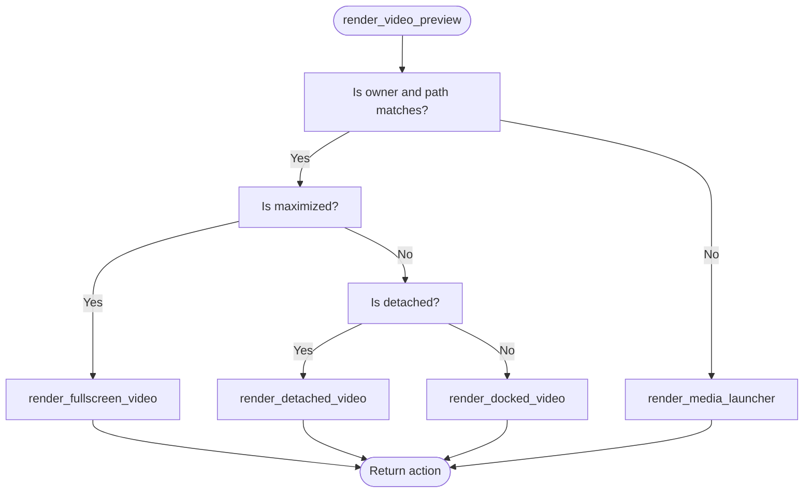
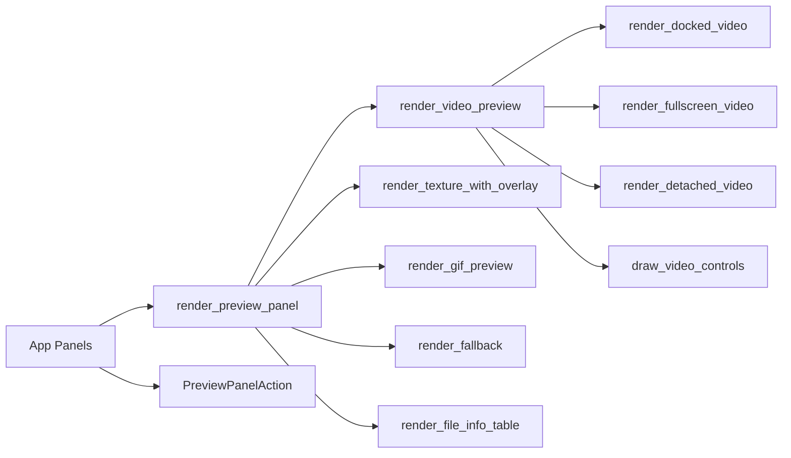

# Preview Panel Architecture

<cite>
**Referenced Files in This Document**
- [mod.rs](file://src/ui/preview_panel/mod.rs)
- [actions.rs](file://src/ui/preview_panel/actions.rs)
- [fallback_renderer.rs](file://src/ui/preview_panel/fallback_renderer.rs)
- [file_info_table.rs](file://src/ui/preview_panel/file_info_table.rs)
- [utils.rs](file://src/ui/preview_panel/utils.rs)
- [video_preview/mod.rs](file://src/ui/preview_panel/video_preview/mod.rs)
- [video_preview/docked.rs](file://src/ui/preview_panel/video_preview/docked.rs)
- [video_preview/fullscreen.rs](file://src/ui/preview_panel/video_preview/fullscreen.rs)
- [video_preview/detached.rs](file://src/ui/preview_panel/video_preview/detached.rs)
- [video_preview/controls.rs](file://src/ui/preview_panel/video_preview/controls.rs)
- [image_preview.rs](file://src/ui/preview_panel/image_preview.rs)
- [content.rs](file://src/ui/app/panels/content.rs)
</cite>

## Table of Contents
1. [Introduction](#introduction)
2. [Project Structure](#project-structure)
3. [Core Components](#core-components)
4. [Architecture Overview](#architecture-overview)
5. [Detailed Component Analysis](#detailed-component-analysis)
6. [Dependency Analysis](#dependency-analysis)
7. [Performance Considerations](#performance-considerations)
8. [Troubleshooting Guide](#troubleshooting-guide)
9. [Conclusion](#conclusion)

## Introduction
This document explains the MTT File Manager’s preview panel architecture. It focuses on the central render_preview_panel orchestrator, the decision logic for choosing between GIF autoplay, video player, static thumbnails, and fallback renderers, and the panel’s integration with thumbnail cache, metadata loading states, live file size tracking, and the main application state. It also covers the action system for user interactions, the file info table display, multi-selection handling, responsive design patterns, height management, and performance optimizations including texture caching and lazy loading strategies.

## Project Structure
The preview panel is implemented under src/ui/preview_panel with modular subcomponents for video, image, fallback rendering, and file info display. The central orchestrator lives in the module’s main file and delegates to specialized renderers. The application integrates the preview panel into the right-side layout and translates user actions into application-wide effects.

**Diagram sources**
- [mod.rs:22-180](file://src/ui/preview_panel/mod.rs#L22-L180)
- [video_preview/mod.rs:15-192](file://src/ui/preview_panel/video_preview/mod.rs#L15-L192)
- [image_preview.rs:39-138](file://src/ui/preview_panel/image_preview.rs#L39-L138)
- [fallback_renderer.rs:36-225](file://src/ui/preview_panel/fallback_renderer.rs#L36-L225)
- [file_info_table.rs:63-426](file://src/ui/preview_panel/file_info_table.rs#L63-L426)
- [actions.rs:3-18](file://src/ui/preview_panel/actions.rs#L3-L18)
- [content.rs:15-229](file://src/ui/app/panels/content.rs#L15-L229)

**Section sources**
- [mod.rs:1-181](file://src/ui/preview_panel/mod.rs#L1-L181)
- [content.rs:15-229](file://src/ui/app/panels/content.rs#L15-L229)

## Core Components
- Central orchestrator: render_preview_panel coordinates rendering based on selection state, media type, and preview availability.
- Video subsystem: render_video_preview routes to docked, detached, or fullscreen modes depending on ownership and maximization state.
- Image/GIF subsystem: render_gif_preview and render_texture_with_overlay handle animated and static previews with overlay interactions.
- Fallback renderer: render_fallback handles folders, drives, and files without thumbnails, including folder preview loading and icon overlays.
- File info table: render_file_info_table displays metadata, sizes, and media details with live file size tracking and folder aggregation.
- Actions: PreviewPanelAction encapsulates user-triggered operations (play, detach, refresh, volume change).
- Utilities: truncate_text_to_fit helps responsive text display.

**Section sources**
- [mod.rs:22-180](file://src/ui/preview_panel/mod.rs#L22-L180)
- [video_preview/mod.rs:121-192](file://src/ui/preview_panel/video_preview/mod.rs#L121-L192)
- [image_preview.rs:39-138](file://src/ui/preview_panel/image_preview.rs#L39-L138)
- [fallback_renderer.rs:36-225](file://src/ui/preview_panel/fallback_renderer.rs#L36-L225)
- [file_info_table.rs:63-426](file://src/ui/preview_panel/file_info_table.rs#L63-L426)
- [actions.rs:3-18](file://src/ui/preview_panel/actions.rs#L3-L18)
- [utils.rs:4-45](file://src/ui/preview_panel/utils.rs#L4-L45)

## Architecture Overview
The preview panel is a single vertical stack composed of:
- A media preview region (GIF, video, or static thumbnail)
- A file info table with metadata and computed sizes
- Action handling that propagates user intents to the application

The orchestrator decides which renderer to call based on:
- Multi-selection count
- Presence of a GIF player or MediaPreview
- Whether the file is playable media
- Availability of textures and metadata
- Ownership of the MediaPreview in the current tab

**Diagram sources**
- [mod.rs:22-180](file://src/ui/preview_panel/mod.rs#L22-L180)
- [video_preview/mod.rs:121-192](file://src/ui/preview_panel/video_preview/mod.rs#L121-L192)
- [image_preview.rs:39-138](file://src/ui/preview_panel/image_preview.rs#L39-L138)
- [fallback_renderer.rs:36-225](file://src/ui/preview_panel/fallback_renderer.rs#L36-L225)
- [file_info_table.rs:63-426](file://src/ui/preview_panel/file_info_table.rs#L63-L426)

## Detailed Component Analysis

### Central Orchestrator: render_preview_panel
Responsibilities:
- Determine multi-selection vs single-item preview
- Choose between GIF autoplay, video player, static thumbnail, or fallback renderer
- Integrate file info table rendering
- Propagate actions upward to the application

Decision logic highlights:
- Multi-selection: show a centered “books stacked” icon and selection count
- GIF: prioritize native GIF autoplay when available
- MediaPreview present and playable: delegate to video preview
- No MediaPreview but playable: show media launcher overlay
- Static thumbnail available: show image with optional overlay
- Fallback: handle folders/drives/files without thumbnails

Integration points:
- Receives texture cache peek, folder preview cache, metadata loading flags, live file size caches and sender
- Returns PreviewPanelAction for refresh, play, detach, volume change, and folder preview load requests

**Section sources**
- [mod.rs:22-180](file://src/ui/preview_panel/mod.rs#L22-L180)

### Video Preview Subsystem
Submodules:
- render_media_launcher: shows a static preview with a large play button overlay
- render_video_preview: dispatches to docked, detached, or fullscreen based on ownership and state
- docked.rs: embeds the player in the preview panel with compact controls
- fullscreen.rs: manages fullscreen viewport commands, autohide controls, and keyboard shortcuts
- detached.rs: floating window with aspect-ratio correction, minimize/restore, and window geometry persistence
- controls.rs: shared control drawing and action translation (play/pause, detach, mute, volume, seek)

Key behaviors:
- Ownership gating: only the owner tab renders the active player
- Maximize flag toggles between docked and fullscreen
- Detach action carries current position and volume to standalone player
- Native OSC support disables custom control overlays in fullscreen

**Diagram sources**
- [video_preview/mod.rs:121-192](file://src/ui/preview_panel/video_preview/mod.rs#L121-L192)
- [video_preview/docked.rs:8-56](file://src/ui/preview_panel/video_preview/docked.rs#L8-L56)
- [video_preview/fullscreen.rs:8-209](file://src/ui/preview_panel/video_preview/fullscreen.rs#L8-L209)
- [video_preview/detached.rs:8-354](file://src/ui/preview_panel/video_preview/detached.rs#L8-L354)

**Section sources**
- [video_preview/mod.rs:15-192](file://src/ui/preview_panel/video_preview/mod.rs#L15-L192)
- [video_preview/docked.rs:8-56](file://src/ui/preview_panel/video_preview/docked.rs#L8-L56)
- [video_preview/fullscreen.rs:8-209](file://src/ui/preview_panel/video_preview/fullscreen.rs#L8-L209)
- [video_preview/detached.rs:8-354](file://src/ui/preview_panel/video_preview/detached.rs#L8-L354)
- [video_preview/controls.rs:84-325](file://src/ui/preview_panel/video_preview/controls.rs#L84-L325)

### Image and GIF Preview
- render_gif_preview: updates the GifPlayer and draws the current frame with optional overlay
- render_texture_with_overlay: renders a static thumbnail with hover overlay for PDF/image/text launch

Overlay behavior:
- Hovering images/PDFs shows a magnifier icon overlay
- Clicking the overlay opens the appropriate viewer

**Section sources**
- [image_preview.rs:39-138](file://src/ui/preview_panel/image_preview.rs#L39-L138)

### Fallback Renderer
Handles:
- Computer view, drive icons, recycle bin view
- Folder previews with lazy loading and spinner avoidance
- File icons with non-blocking jumbo/Large fallbacks
- PDF/image/text overlay launch for supported extensions

Folder preview logic:
- If a folder preview texture is available, paint it centered
- Otherwise, schedule a LoadFolderPreview action if not already loading
- Show a folder icon while preview is loading

**Section sources**
- [fallback_renderer.rs:36-225](file://src/ui/preview_panel/fallback_renderer.rs#L36-L225)

### File Info Table
Displays:
- Filename with refresh button for media thumbnails
- Type, date modified/deleted, size (with live file size for files)
- Media metadata (resolution, format, codecs, duration, FPS, bitrate, camera details, etc.)
- Drive details (used/free/total space, filesystem)
- Folder aggregation counts and totals when available

Live file size tracking:
- Uses a per-frame cached LiveFileStat keyed by preview widget to throttle updates
- Resolves cached sizes or enqueues live queries via a channel
- Respects metadata-loading states to avoid conflicting refreshes

Folder size requests:
- Triggers CalculateFolderSize when folder counts are incomplete and not loading

**Section sources**
- [file_info_table.rs:63-426](file://src/ui/preview_panel/file_info_table.rs#L63-L426)

### Action System and Application Integration
PreviewPanelAction enumerates user-driven operations:
- RefreshThumbnail: clears caches and requests thumbnail regeneration
- LoadFolderPreview: requests folder preview generation
- CalculateFolderSize: starts folder size computation
- RequestPlay: launches video playback
- VolumeChanged: updates session volume
- DetachVideo: spawns a standalone video player with current state

Application integration:
- The preview panel is rendered inside a ScrollArea in the right-side panel
- Actions are matched and executed by the application (e.g., launching video playback, detaching to standalone player, refreshing thumbnails, requesting folder previews, calculating folder sizes, updating volume)
- Ownership and visibility of the in-process MediaPreview are managed by the application

**Section sources**
- [actions.rs:3-18](file://src/ui/preview_panel/actions.rs#L3-L18)
- [content.rs:120-218](file://src/ui/app/panels/content.rs#L120-L218)

## Dependency Analysis
The preview panel is a cohesive unit with clear boundaries:
- render_preview_panel depends on:
  - Video subsystem for playable media
  - Image/GIF subsystem for static and animated previews
  - Fallback renderer for non-media items
  - File info table for metadata display
  - Actions for user intent propagation
- Video subsystem depends on:
  - Docked, detached, and fullscreen renderers
  - Shared controls module
- Application integration depends on:
  - Cache managers for texture and folder preview caches
  - Metadata loaders and live file size services
  - Media preview state and ownership tracking

**Diagram sources**
- [mod.rs:22-180](file://src/ui/preview_panel/mod.rs#L22-L180)
- [video_preview/mod.rs:121-192](file://src/ui/preview_panel/video_preview/mod.rs#L121-L192)
- [image_preview.rs:39-138](file://src/ui/preview_panel/image_preview.rs#L39-L138)
- [fallback_renderer.rs:36-225](file://src/ui/preview_panel/fallback_renderer.rs#L36-L225)
- [file_info_table.rs:63-426](file://src/ui/preview_panel/file_info_table.rs#L63-L426)
- [content.rs:15-229](file://src/ui/app/panels/content.rs#L15-L229)

**Section sources**
- [mod.rs:1-181](file://src/ui/preview_panel/mod.rs#L1-L181)
- [video_preview/mod.rs:1-193](file://src/ui/preview_panel/video_preview/mod.rs#L1-L193)
- [content.rs:15-229](file://src/ui/app/panels/content.rs#L15-L229)

## Performance Considerations
- Texture caching and lazy loading:
  - render_preview_panel receives a texture_cache_peek and folder_preview_peek to avoid blocking loads
  - fallback renderer triggers LoadFolderPreview only when not already loading
- Non-blocking icon loading:
  - Fallback renderer attempts jumbo icons first; if missing, enqueues jumbo extraction and falls back to large icons immediately
- Live file size throttling:
  - File info table caches LiveFileStat per frame and updates at most once per second to reduce I/O and computation
- Ownership gating:
  - Only the owner tab renders the active player, preventing unnecessary MPV/HWND creation and updates
- Responsive sizing:
  - Uses PREVIEW_MAX_HEIGHT constant and shrink-to-fit to maintain aspect ratios and avoid oversized layouts
- Repaint optimizations:
  - Fullscreen and detached renderers request repaint only when playing or controls are active

[No sources needed since this section provides general guidance]

## Troubleshooting Guide
Common issues and remedies:
- Video does not start:
  - Verify RequestPlay action is handled by the application and that the file is not inside an archive
  - Ensure MediaPreview is initialized and the tab is the owner
- Thumbnails not appearing:
  - Confirm texture_cache_peek is Some; otherwise, fallback renderer will show placeholders
  - Trigger RefreshThumbnail action to clear caches and force regeneration
- Folder preview not loading:
  - Check is_folder_preview_loading flag; if false, fallback renderer will request LoadFolderPreview
  - Verify folder preview worker is running and not blocked
- Live file size not updating:
  - Ensure metadata is not loading; live size resolution is skipped during metadata load
  - Confirm live file size channel is operational and not saturated
- Detach fails:
  - Ensure DetachVideo action is handled by the application and that a standalone player process can spawn
  - Verify current position and volume are passed correctly

**Section sources**
- [mod.rs:22-180](file://src/ui/preview_panel/mod.rs#L22-L180)
- [fallback_renderer.rs:110-119](file://src/ui/preview_panel/fallback_renderer.rs#L110-L119)
- [file_info_table.rs:235-243](file://src/ui/preview_panel/file_info_table.rs#L235-L243)
- [content.rs:120-218](file://src/ui/app/panels/content.rs#L120-L218)

## Conclusion
The preview panel architecture centers around a robust orchestrator that intelligently selects among GIF autoplay, video player, static thumbnails, and fallback renderers. It integrates tightly with thumbnail and metadata caches, supports live file size tracking, and exposes a clean action system for user interactions. The video subsystem provides seamless transitions between docked, detached, and fullscreen modes with careful performance optimizations. Together, these components deliver a unified, responsive, and efficient preview experience.