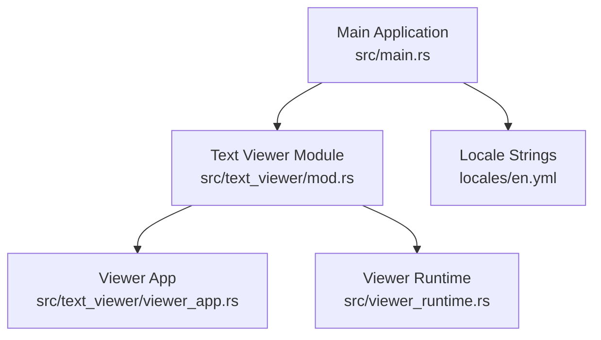
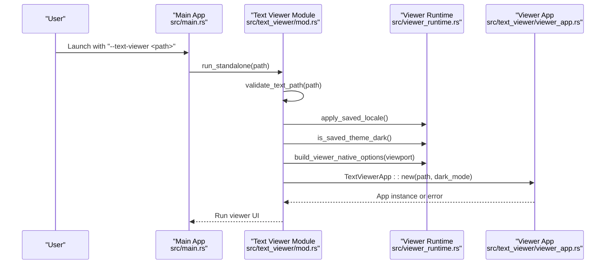
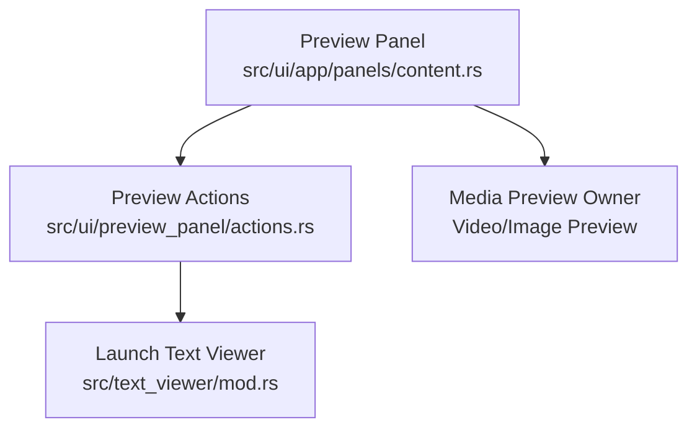
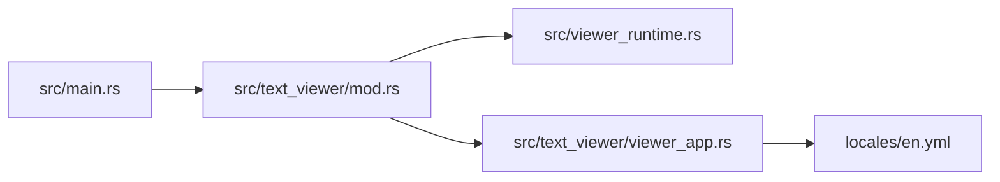

# Text Viewer

<cite>
**Referenced Files in This Document**
- [mod.rs](file://src/text_viewer/mod.rs)
- [viewer_app.rs](file://src/text_viewer/viewer_app.rs)
- [viewer_runtime.rs](file://src/viewer_runtime.rs)
- [main.rs](file://src/main.rs)
- [en.yml](file://locales/en.yml)
</cite>

## Table of Contents
1. [Introduction](#introduction)
2. [Project Structure](#project-structure)
3. [Core Components](#core-components)
4. [Architecture Overview](#architecture-overview)
5. [Detailed Component Analysis](#detailed-component-analysis)
6. [Dependency Analysis](#dependency-analysis)
7. [Performance Considerations](#performance-considerations)
8. [Troubleshooting Guide](#troubleshooting-guide)
9. [Conclusion](#conclusion)

## Introduction
This document describes the MTT File Manager’s Text Viewer component. It focuses on the text rendering system for code files, log files, and plain text documents, including encoding detection, theme support, font configuration, state management, search and navigation features, and integration with the preview panel. It also covers performance characteristics for large files, memory management, and responsive behavior.

## Project Structure
The Text Viewer is implemented as a standalone viewer process spawned from the main application. It uses a dedicated module and a lightweight runtime to minimize resource usage.

**Diagram sources**
- [main.rs:180-187](file://src/main.rs#L180-L187)
- [mod.rs:1-228](file://src/text_viewer/mod.rs#L1-L228)
- [viewer_app.rs:1-716](file://src/text_viewer/viewer_app.rs#L1-L716)
- [viewer_runtime.rs:1-86](file://src/viewer_runtime.rs#L1-L86)
- [en.yml:436-464](file://locales/en.yml#L436-L464)

**Section sources**
- [main.rs:180-187](file://src/main.rs#L180-L187)
- [mod.rs:1-228](file://src/text_viewer/mod.rs#L1-L228)
- [viewer_app.rs:1-716](file://src/text_viewer/viewer_app.rs#L1-L716)
- [viewer_runtime.rs:1-86](file://src/viewer_runtime.rs#L1-L86)
- [en.yml:436-464](file://locales/en.yml#L436-L464)

## Core Components
- Text Viewer Module: Validates paths, spawns the viewer process, and sets up the viewer window and theme.
- Viewer App: Implements the UI, rendering, search, go-to-line, and keyboard shortcuts.
- Viewer Runtime: Provides lightweight configuration for viewer subprocesses (renderer, persistence, theme).
- Locale: Provides localized UI strings for the viewer.

Key responsibilities:
- Security and validation: Rejects UNC paths, null bytes, path traversal, unsupported extensions, and files exceeding the maximum size.
- Encoding detection: Detects UTF-8 with BOM, UTF-8 without BOM, and falls back to Windows-1252.
- Rendering: Monospace font with line numbers, optional word wrap, and highlighted search results.
- Navigation: Find (Ctrl+F), Go-to-line (Ctrl+G), and keyboard shortcuts for font size and scrolling.
- Theme: Applies saved theme (dark/light) on first frame.

**Section sources**
- [mod.rs:1-228](file://src/text_viewer/mod.rs#L1-L228)
- [viewer_app.rs:1-716](file://src/text_viewer/viewer_app.rs#L1-L716)
- [viewer_runtime.rs:65-71](file://src/viewer_runtime.rs#L65-L71)
- [en.yml:436-464](file://locales/en.yml#L436-L464)

## Architecture Overview
The Text Viewer runs as a separate process from the main application. The main app detects the --text-viewer flag and delegates to the viewer module, which validates the path, applies locale and theme, and launches the viewer UI.

**Diagram sources**
- [main.rs:180-187](file://src/main.rs#L180-L187)
- [mod.rs:152-210](file://src/text_viewer/mod.rs#L152-L210)
- [viewer_runtime.rs:58-85](file://src/viewer_runtime.rs#L58-L85)
- [viewer_app.rs:84-129](file://src/text_viewer/viewer_app.rs#L84-L129)

## Detailed Component Analysis

### Text Viewer Module
Responsibilities:
- Path validation: null bytes, traversal, UNC/network paths, extension whitelist, file existence, and size limits.
- Process spawning: Launches a new viewer process with the same executable and passes the path argument.
- Viewer bootstrap: Sets window title, icon, size, visibility policy, and theme.

Security and validation highlights:
- Blocks UNC paths and network paths.
- Rejects non-text extensions using a curated list.
- Enforces a maximum file size.
- Performs binary detection by sampling the beginning of the file for null bytes.

Standalone entry point:
- Builds viewport options, removes stale eframe storage to prevent flicker, reads saved theme, and runs the viewer app.

**Section sources**
- [mod.rs:51-123](file://src/text_viewer/mod.rs#L51-L123)
- [mod.rs:125-150](file://src/text_viewer/mod.rs#L125-L150)
- [mod.rs:152-210](file://src/text_viewer/mod.rs#L152-L210)

### Viewer App
State and rendering:
- Stores the original file path, full decoded content, precomputed line offsets, encoding label, font size, word wrap flag, search state, go-to-line state, scroll target, theme flag, and file statistics.
- Renders a monospace text area with line numbers and optional word wrap.
- Highlights search hits with distinct colors for current and other matches.

Encoding detection:
- Checks for UTF-8 BOM; if present, strips it and decodes as UTF-8.
- If decoding as UTF-8 succeeds, uses UTF-8.
- Otherwise, decodes as Windows-1252 (lossless mapping for 0x00–0xFF) with explicit mapping for 0x80–0x9F.

Search and navigation:
- Toggle search bar with Ctrl+F; supports incremental search and navigation among matches.
- Toggle go-to-line bar with Ctrl+G; validates numeric input against total lines.
- Keyboard shortcuts: Ctrl+Plus/Ctrl+Minus/Ctrl+0/Ctrl+scroll to adjust font size; Ctrl+Home/Ctrl+End to jump to top/bottom.

Toolbar and UI:
- Displays file name, line count, file size, encoding, font size controls, word wrap toggle, search, and go-to-line buttons.
- Uses localized strings from the locale file.

Rendering pipeline:
- Calculates line number column width based on total lines and font size.
- Uses a vertical scroll area to render visible rows efficiently.
- Applies row height derived from font size and paints highlight backgrounds behind matched lines.

State management:
- Maintains search hits as indices into the line array.
- Scrolls to a target line when requested (e.g., after search navigation).
- Applies theme visuals on the first frame and reveals the window after initial layout.

**Section sources**
- [viewer_app.rs:31-82](file://src/text_viewer/viewer_app.rs#L31-L82)
- [viewer_app.rs:84-129](file://src/text_viewer/viewer_app.rs#L84-L129)
- [viewer_app.rs:133-235](file://src/text_viewer/viewer_app.rs#L133-L235)
- [viewer_app.rs:239-301](file://src/text_viewer/viewer_app.rs#L239-L301)
- [viewer_app.rs:305-338](file://src/text_viewer/viewer_app.rs#L305-L338)
- [viewer_app.rs:342-430](file://src/text_viewer/viewer_app.rs#L342-L430)
- [viewer_app.rs:434-479](file://src/text_viewer/viewer_app.rs#L434-L479)
- [viewer_app.rs:502-521](file://src/text_viewer/viewer_app.rs#L502-L521)
- [viewer_app.rs:525-540](file://src/text_viewer/viewer_app.rs#L525-L540)
- [viewer_app.rs:547-562](file://src/text_viewer/viewer_app.rs#L547-L562)
- [viewer_app.rs:566-617](file://src/text_viewer/viewer_app.rs#L566-L617)
- [viewer_app.rs:644-704](file://src/text_viewer/viewer_app.rs#L644-L704)
- [viewer_app.rs:707-715](file://src/text_viewer/viewer_app.rs#L707-L715)
- [en.yml:436-464](file://locales/en.yml#L436-L464)

### Viewer Runtime
Purpose:
- Provides a minimal configuration for viewer subprocesses to avoid heavy initialization costs.
- Reads saved locale and theme preferences from a lightweight database query.
- Builds eframe NativeOptions with a simpler renderer and disabled optional buffers.

Theme application:
- Determines whether the saved theme is dark and applies it on the first frame.

Renderer tuning:
- Uses the Glow renderer instead of WGPU for viewers.
- Disables depth/stencil/multisampling buffers to reduce memory footprint.

**Section sources**
- [viewer_runtime.rs:32-56](file://src/viewer_runtime.rs#L32-L56)
- [viewer_runtime.rs:65-71](file://src/viewer_runtime.rs#L65-L71)
- [viewer_runtime.rs:75-85](file://src/viewer_runtime.rs#L75-L85)

### Integration with the Preview Panel
The preview panel displays metadata and thumbnails for the selected item. While the Text Viewer itself is a separate process, the main application integrates it into the UI flow by launching the viewer process when appropriate. The preview panel coordinates with the main app’s rendering and media preview subsystems.

**Diagram sources**
- [main.rs:180-187](file://src/main.rs#L180-L187)
- [mod.rs:125-150](file://src/text_viewer/mod.rs#L125-L150)
- [viewer_app.rs:566-617](file://src/text_viewer/viewer_app.rs#L566-L617)

## Dependency Analysis
- The main application delegates to the Text Viewer module when the --text-viewer flag is present.
- The Text Viewer module depends on the Viewer Runtime for locale/theme and eframe options.
- The Viewer App depends on egui for UI and rendering, and on locale strings for labels.

**Diagram sources**
- [main.rs:180-187](file://src/main.rs#L180-L187)
- [mod.rs:1-228](file://src/text_viewer/mod.rs#L1-L228)
- [viewer_runtime.rs:1-86](file://src/viewer_runtime.rs#L1-L86)
- [viewer_app.rs:1-716](file://src/text_viewer/viewer_app.rs#L1-L716)
- [en.yml:436-464](file://locales/en.yml#L436-L464)

**Section sources**
- [main.rs:180-187](file://src/main.rs#L180-L187)
- [mod.rs:1-228](file://src/text_viewer/mod.rs#L1-L228)
- [viewer_runtime.rs:1-86](file://src/viewer_runtime.rs#L1-L86)
- [viewer_app.rs:1-716](file://src/text_viewer/viewer_app.rs#L1-L716)
- [en.yml:436-464](file://locales/en.yml#L436-L464)

## Performance Considerations
- Memory model: The entire file content is loaded into a single contiguous String buffer and indexed by line offsets. This avoids per-line allocations and reduces heap fragmentation, trading memory for faster random access.
- Binary detection: Samples the first 8 KB for null bytes to quickly reject binary files.
- Renderer choice: Viewers use the Glow renderer and disable depth/stencil/multisampling to minimize baseline memory usage.
- Startup flicker mitigation: The viewer window starts invisible and is revealed after the first frame to avoid eframe restoring persisted state prematurely.
- Large file handling: A maximum file size is enforced to cap memory usage.

Recommendations:
- For very large files, consider streaming or paging strategies if memory usage becomes a concern.
- Keep the maximum file size aligned with user expectations and available system RAM.

**Section sources**
- [viewer_app.rs:35-45](file://src/text_viewer/viewer_app.rs#L35-L45)
- [viewer_app.rs:93-98](file://src/text_viewer/viewer_app.rs#L93-L98)
- [viewer_runtime.rs:75-85](file://src/viewer_runtime.rs#L75-L85)
- [mod.rs:20-21](file://src/text_viewer/mod.rs#L20-L21)
- [mod.rs:100-120](file://src/text_viewer/mod.rs#L100-L120)

## Troubleshooting Guide
Common issues and resolutions:
- Invalid path: Contains null bytes, path traversal components, or UNC/network path. The viewer rejects such paths before any I/O.
- Unsupported extension: Only a curated set of text extensions is accepted.
- File too large: Exceeds the maximum allowed size; the viewer refuses to open it.
- Cannot read file: I/O errors during read or metadata queries are reported with localized messages.
- Binary file: Too many null bytes in the sampled region cause rejection.
- Encoding issues: Falls back to Windows-1252 when UTF-8 detection fails; some characters may differ from the original encoding.

Localization:
- All user-facing messages are localized via the locale file.

**Section sources**
- [mod.rs:51-123](file://src/text_viewer/mod.rs#L51-L123)
- [viewer_app.rs:87-98](file://src/text_viewer/viewer_app.rs#L87-L98)
- [viewer_app.rs:644-704](file://src/text_viewer/viewer_app.rs#L644-L704)
- [en.yml:455-464](file://locales/en.yml#L455-L464)

## Conclusion
The MTT File Manager’s Text Viewer provides a secure, responsive, and memory-efficient way to view text files. It enforces strong validation, detects encodings, and offers essential editing and navigation features through a compact UI. Its design as a separate process ensures minimal overhead and predictable performance, while the runtime configuration keeps resource usage low.