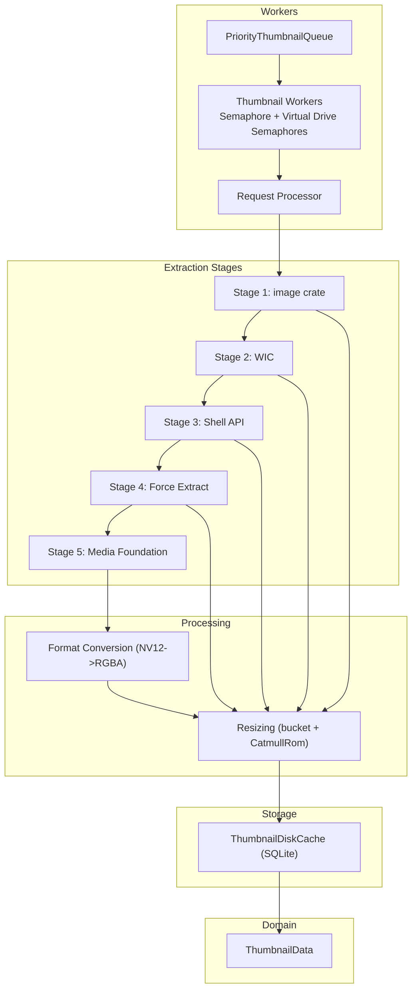
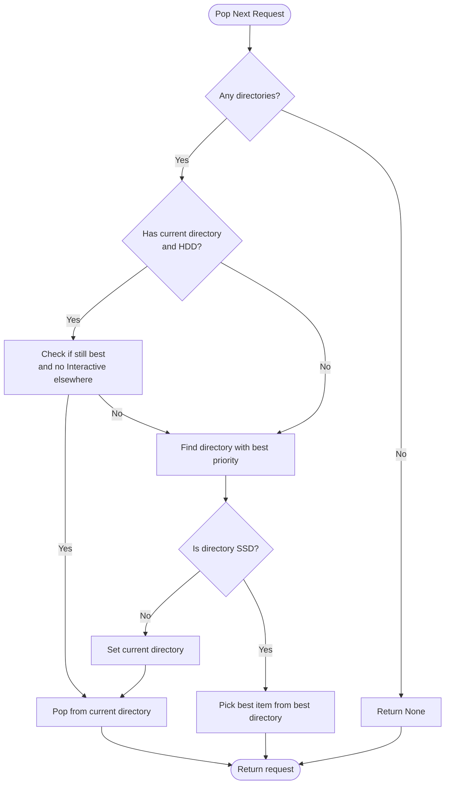
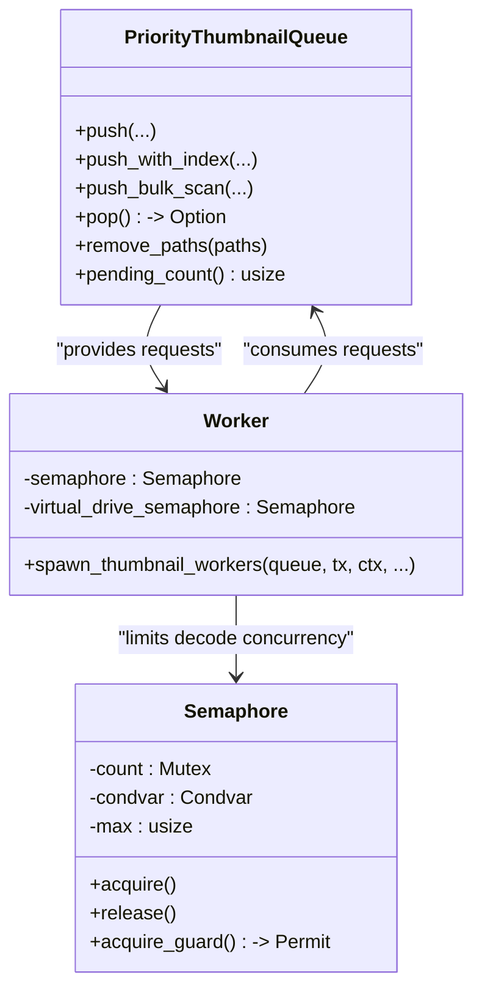
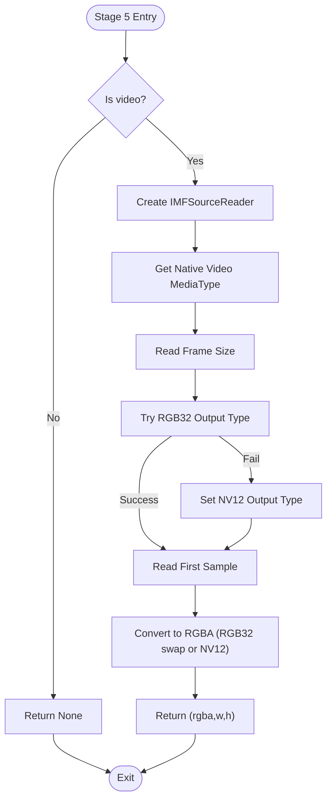
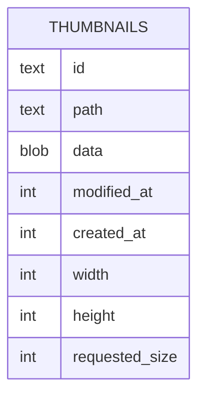
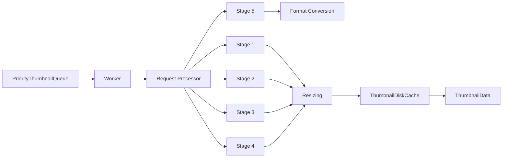

# Thumbnail Pipeline

<cite>
**Referenced Files in This Document**
- [mod.rs](file://src/workers/thumbnail/mod.rs)
- [queue.rs](file://src/workers/thumbnail/queue.rs)
- [types.rs](file://src/workers/thumbnail/types.rs)
- [worker.rs](file://src/workers/thumbnail/worker.rs)
- [progress.rs](file://src/workers/thumbnail/progress.rs)
- [stage1_image_crate.rs](file://src/workers/thumbnail/extraction/stage1_image_crate.rs)
- [stage2_wic.rs](file://src/workers/thumbnail/extraction/stage2_wic.rs)
- [stage3_shell_api.rs](file://src/workers/thumbnail/extraction/stage3_shell_api.rs)
- [stage4_force_extract.rs](file://src/workers/thumbnail/extraction/stage4_force_extract.rs)
- [stage5_media_foundation.rs](file://src/workers/thumbnail/extraction/stage5_media_foundation.rs)
- [format_conversion.rs](file://src/workers/thumbnail/processing/format_conversion.rs)
- [resize.rs](file://src/workers/thumbnail/processing/resize.rs)
- [thumbnails_repo.rs](file://src/infrastructure/disk_cache/thumbnails_repo.rs)
- [thumbnail.rs](file://src/domain/thumbnail.rs)
</cite>

## Table of Contents
1. [Introduction](#introduction)
2. [Project Structure](#project-structure)
3. [Core Components](#core-components)
4. [Architecture Overview](#architecture-overview)
5. [Detailed Component Analysis](#detailed-component-analysis)
6. [Dependency Analysis](#dependency-analysis)
7. [Performance Considerations](#performance-considerations)
8. [Troubleshooting Guide](#troubleshooting-guide)
9. [Conclusion](#conclusion)
10. [Appendices](#appendices)

## Introduction
This document explains the MTT File Manager’s multi-stage thumbnail extraction pipeline. It covers the five-stage extraction process, queue management and priority scheduling, worker thread coordination, format conversion and resizing, disk caching and invalidation, and integration with the preview panel’s texture cache system. The goal is to provide a clear understanding of how thumbnails are produced efficiently and reliably across diverse file types and storage devices.

## Project Structure
The thumbnail pipeline spans several modules:
- Worker orchestration and concurrency control
- Priority queue with drive-class-aware batching
- Five extraction stages (image crate, WIC, Shell API, force extraction, Media Foundation)
- Processing utilities (format conversion, resizing)
- Disk cache persistence and retrieval
- Domain model for thumbnail data



**Diagram sources**
- [queue.rs:1-559](file://src/workers/thumbnail/queue.rs#L1-L559)
- [worker.rs:1-338](file://src/workers/thumbnail/worker.rs#L1-L338)
- [stage1_image_crate.rs:1-42](file://src/workers/thumbnail/extraction/stage1_image_crate.rs#L1-L42)
- [stage2_wic.rs:1-71](file://src/workers/thumbnail/extraction/stage2_wic.rs#L1-L71)
- [stage3_shell_api.rs:1-117](file://src/workers/thumbnail/extraction/stage3_shell_api.rs#L1-L117)
- [stage4_force_extract.rs:1-15](file://src/workers/thumbnail/extraction/stage4_force_extract.rs#L1-L15)
- [stage5_media_foundation.rs:1-227](file://src/workers/thumbnail/extraction/stage5_media_foundation.rs#L1-L227)
- [format_conversion.rs:1-132](file://src/workers/thumbnail/processing/format_conversion.rs#L1-L132)
- [resize.rs:1-96](file://src/workers/thumbnail/processing/resize.rs#L1-L96)
- [thumbnails_repo.rs:1-176](file://src/infrastructure/disk_cache/thumbnails_repo.rs#L1-L176)
- [thumbnail.rs:1-13](file://src/domain/thumbnail.rs#L1-L13)

**Section sources**
- [mod.rs:1-148](file://src/workers/thumbnail/mod.rs#L1-L148)
- [queue.rs:1-559](file://src/workers/thumbnail/queue.rs#L1-L559)
- [worker.rs:1-338](file://src/workers/thumbnail/worker.rs#L1-L338)

## Core Components
- PriorityThumbnailQueue: Groups requests by directory for HDD locality, merges duplicates, and selects the next request based on priority and optional on-screen ordering.
- Worker system: Spawns a bounded number of worker threads, limits concurrent decode operations via semaphores, and coordinates COM/Media Foundation initialization per thread.
- Extraction stages: Five fallback stages covering standard images, robust WIC decoding, Shell-provided thumbnails, forced extraction bypass, and Media Foundation frame capture for video.
- Processing utilities: Format conversion for NV12 frames and resizing to bucket sizes for efficient GPU uploads.
- Disk cache: Persistent storage of thumbnails keyed by a stable hash of the path and modified time, with WebP encoding and dimension metadata.
- Domain model: ThumbnailData carries decoded RGBA buffer, dimensions, and generation for UI invalidation.

**Section sources**
- [types.rs:1-33](file://src/workers/thumbnail/types.rs#L1-L33)
- [progress.rs:1-44](file://src/workers/thumbnail/progress.rs#L1-L44)
- [mod.rs:32-148](file://src/workers/thumbnail/mod.rs#L32-L148)

## Architecture Overview
The pipeline is designed around:
- Drive-aware batching: HDDs group requests by directory to reduce head movement; SSDs fetch the highest-priority item immediately.
- Priority scheduling: Interactive > Prefetch > Background; directory-locality respects on-screen ordering for HDDs.
- Concurrency control: Worker count and decode parallelism are tuned to cap RAM usage while keeping I/O saturated.
- Robust fallback: Five extraction stages ensure reliable thumbnails for all file types.
- Persistent caching: Thumbnails are stored in SQLite with WebP compression and metadata for fast retrieval.

```mermaid
sequenceDiagram
participant UI as "UI Thread"
participant Q as "PriorityThumbnailQueue"
participant W as "Thumbnail Worker"
participant RP as "Request Processor"
participant ST1 as "Stage 1"
participant ST2 as "Stage 2"
participant ST3 as "Stage 3"
participant ST4 as "Stage 4"
participant ST5 as "Stage 5"
participant PROC as "Processing (Resize/Convert)"
participant DC as "ThumbnailDiskCache"
UI->>Q : push(path, gen, size, priority, modified)
Q-->>UI : ack/pending_count
loop Worker Loop
W->>Q : pop()
Q-->>W : (path, gen, size, priority, modified, source, track_bulk)
W->>RP : process_thumbnail_request(...)
alt Stage 1 success
RP->>ST1 : extract(path, priority)
ST1-->>RP : (rgba,w,h) or None
else Stage 1 fail
RP->>ST2 : extract(path)
ST2-->>RP : (rgba,w,h) or None
else Stage 2 fail
RP->>ST3 : extract(path)
ST3-->>RP : (rgba,w,h) or Err
else Stage 3 fail
RP->>ST4 : extract(path)
ST4-->>RP : (rgba,w,h) or Err
else Stage 4 fail
RP->>ST5 : extract(path)
ST5-->>RP : (rgba,w,h) or None
end
end
end
end
RP->>PROC : resize_to_bucket + convert_nv12_to_rgba
PROC-->>RP : (rgba,w,h)
RP->>DC : put(path, modified, requested_size, rgba, w, h)
DC-->>RP : ok
RP-->>W : ThumbnailData
W-->>UI : send(ThumbnailData)
end
```

**Diagram sources**
- [queue.rs:310-481](file://src/workers/thumbnail/queue.rs#L310-L481)
- [worker.rs:192-289](file://src/workers/thumbnail/worker.rs#L192-L289)
- [stage1_image_crate.rs:14-41](file://src/workers/thumbnail/extraction/stage1_image_crate.rs#L14-L41)
- [stage2_wic.rs:12-70](file://src/workers/thumbnail/extraction/stage2_wic.rs#L12-L70)
- [stage3_shell_api.rs:18-63](file://src/workers/thumbnail/extraction/stage3_shell_api.rs#L18-L63)
- [stage4_force_extract.rs:8-14](file://src/workers/thumbnail/extraction/stage4_force_extract.rs#L8-L14)
- [stage5_media_foundation.rs:13-226](file://src/workers/thumbnail/extraction/stage5_media_foundation.rs#L13-L226)
- [format_conversion.rs:5-58](file://src/workers/thumbnail/processing/format_conversion.rs#L5-L58)
- [resize.rs:7-61](file://src/workers/thumbnail/processing/resize.rs#L7-L61)
- [thumbnails_repo.rs:87-174](file://src/infrastructure/disk_cache/thumbnails_repo.rs#L87-L174)

## Detailed Component Analysis

### PriorityThumbnailQueue
- Purpose: Efficiently schedule thumbnail requests with drive-class awareness and deduplication.
- Key behaviors:
  - Groups by parent directory for HDDs to improve locality.
  - Sorts within a directory by priority and optional directory index for on-screen items.
  - Merges pending requests to promote priority, larger size, newer generation, and fresher timestamps.
  - Removes stale requests by generation and supports bulk progress tracking.
- HDD vs SSD:
  - HDD: Maintains current directory and prefers staying local unless an Interactive request elsewhere demands switching.
  - SSD: Pops the highest-priority item from the directory with the best priority.



**Diagram sources**
- [queue.rs:342-481](file://src/workers/thumbnail/queue.rs#L342-L481)

**Section sources**
- [queue.rs:11-559](file://src/workers/thumbnail/queue.rs#L11-L559)

### Worker Thread Coordination
- Worker spawning:
  - Computes worker count from CPU parallelism with a cap.
  - Uses a decode semaphore to bound concurrent decode operations and RAM usage.
  - Uses a separate virtual drive semaphore for virtual filesystem bulk scans to avoid overwhelming FUSE drivers.
- Initialization:
  - Initializes COM and Media Foundation per worker thread with RAII guards to ensure cleanup.
  - Sets background thread priority to minimize HDD contention.
- Request processing:
  - Enforces generation-based staleness checks except for bulk scans.
  - Tracks bulk progress and requests repaints during bulk operations.



**Diagram sources**
- [worker.rs:102-169](file://src/workers/thumbnail/worker.rs#L102-L169)
- [worker.rs:29-77](file://src/workers/thumbnail/worker.rs#L29-L77)
- [queue.rs:67-178](file://src/workers/thumbnail/queue.rs#L67-L178)

**Section sources**
- [worker.rs:1-338](file://src/workers/thumbnail/worker.rs#L1-L338)

### Extraction Stages

#### Stage 1: image crate (Standard image formats)
- Fast path for common formats using buffered sequential reads aligned with request priority.
- Converts to RGBA and returns width/height.

**Section sources**
- [stage1_image_crate.rs:1-42](file://src/workers/thumbnail/extraction/stage1_image_crate.rs#L1-L42)

#### Stage 2: WIC (Windows Imaging Component)
- Robust fallback for formats and conditions where the image crate may fail (e.g., CMYK JPEGs).
- Decodes via WIC and converts to 32bpp RGBA.

**Section sources**
- [stage2_wic.rs:1-71](file://src/workers/thumbnail/extraction/stage2_wic.rs#L1-L71)

#### Stage 3: Shell API (IShellItemImageFactory)
- Universal fallback for most file types, including videos.
- Uses flags to prefer thumbnails for videos and accept icons for others.
- Converts HBITMAP to RGBA.

**Section sources**
- [stage3_shell_api.rs:1-117](file://src/workers/thumbnail/extraction/stage3_shell_api.rs#L1-L117)

#### Stage 4: Force Extract (IThumbnailCache with WTS_FORCEEXTRACTION)
- Forces extraction to bypass Windows thumbnail cache when the cache returns an icon instead of a thumbnail.
- Single-attempt stage; if it fails, Media Foundation stage proceeds.

**Section sources**
- [stage4_force_extract.rs:1-15](file://src/workers/thumbnail/extraction/stage4_force_extract.rs#L1-L15)

#### Stage 5: Media Foundation (Direct frame extraction)
- Nuclear option for video: creates a source reader, selects output format (RGB32 or NV12), reads the first frame, and converts to RGBA.
- Handles both RGB32 and NV12 paths with proper buffer validation and conversion.



**Diagram sources**
- [stage5_media_foundation.rs:13-226](file://src/workers/thumbnail/extraction/stage5_media_foundation.rs#L13-L226)
- [format_conversion.rs:5-58](file://src/workers/thumbnail/processing/format_conversion.rs#L5-L58)

**Section sources**
- [stage5_media_foundation.rs:1-227](file://src/workers/thumbnail/extraction/stage5_media_foundation.rs#L1-L227)

### Processing Utilities

#### Format Conversion (NV12 to RGBA)
- Performs YUV to RGB conversion using BT.601 coefficients with integer arithmetic and clamping.
- Rounds width/height to even values for safe UV plane handling.

**Section sources**
- [format_conversion.rs:1-132](file://src/workers/thumbnail/processing/format_conversion.rs#L1-L132)

#### Resizing (Bucket-based)
- Buckets sizes: 128, 256, 512, 1024.
- Preserves aspect ratio and uses CatmullRom filter for quality/performance balance.
- Validates buffer size before resize to avoid failures.

**Section sources**
- [resize.rs:1-96](file://src/workers/thumbnail/processing/resize.rs#L1-L96)

### Disk Caching Strategy and Invalidation
- Persistence: Thumbnails are stored in SQLite with:
  - Stable path hash (blake3) as primary key segment.
  - Modified time to tie cache entries to file versions.
  - WebP-encoded data with width, height, and requested size metadata.
- Retrieval:
  - Exact modified-time match for correctness.
  - Latest entry fallback for virtual filesystems with unstable mtimes.
- Invalidation:
  - Failure tracking prevents repeated attempts on problematic files.
  - Manual refresh clears failure caches; bulk refresh clears all.



**Diagram sources**
- [thumbnails_repo.rs:16-85](file://src/infrastructure/disk_cache/thumbnails_repo.rs#L16-L85)

**Section sources**
- [thumbnails_repo.rs:1-176](file://src/infrastructure/disk_cache/thumbnails_repo.rs#L1-L176)
- [mod.rs:70-148](file://src/workers/thumbnail/mod.rs#L70-L148)

### Integration with Preview Panel Texture Cache
- ThumbnailData carries decoded RGBA, dimensions, and generation.
- Generation tracking ensures UI updates only when the current generation matches the request.
- Bulk progress reporting enables the UI to reflect ongoing thumbnail builds.

**Section sources**
- [thumbnail.rs:1-13](file://src/domain/thumbnail.rs#L1-L13)
- [progress.rs:12-44](file://src/workers/thumbnail/progress.rs#L12-L44)
- [worker.rs:232-289](file://src/workers/thumbnail/worker.rs#L232-L289)

## Dependency Analysis
- Coupling:
  - Worker depends on queue, disk cache, and processing utilities.
  - Extraction stages are independent and chained by the request processor.
  - Disk cache depends on SQLite and image codecs.
- Cohesion:
  - Each stage encapsulates a single responsibility (decoding, conversion, resizing).
- External dependencies:
  - Windows APIs (COM, Media Foundation, Shell) for native extraction.
  - Image libraries for decoding and resizing.
  - SQLite for persistence.



**Diagram sources**
- [queue.rs:1-559](file://src/workers/thumbnail/queue.rs#L1-L559)
- [worker.rs:1-338](file://src/workers/thumbnail/worker.rs#L1-L338)
- [stage1_image_crate.rs:1-42](file://src/workers/thumbnail/extraction/stage1_image_crate.rs#L1-L42)
- [stage2_wic.rs:1-71](file://src/workers/thumbnail/extraction/stage2_wic.rs#L1-L71)
- [stage3_shell_api.rs:1-117](file://src/workers/thumbnail/extraction/stage3_shell_api.rs#L1-L117)
- [stage4_force_extract.rs:1-15](file://src/workers/thumbnail/extraction/stage4_force_extract.rs#L1-L15)
- [stage5_media_foundation.rs:1-227](file://src/workers/thumbnail/extraction/stage5_media_foundation.rs#L1-L227)
- [format_conversion.rs:1-132](file://src/workers/thumbnail/processing/format_conversion.rs#L1-L132)
- [resize.rs:1-96](file://src/workers/thumbnail/processing/resize.rs#L1-L96)
- [thumbnails_repo.rs:1-176](file://src/infrastructure/disk_cache/thumbnails_repo.rs#L1-L176)
- [thumbnail.rs:1-13](file://src/domain/thumbnail.rs#L1-L13)

**Section sources**
- [mod.rs:1-148](file://src/workers/thumbnail/mod.rs#L1-L148)

## Performance Considerations
- Concurrency tuning:
  - Worker count capped to balance I/O saturation and CPU overhead.
  - Decode semaphore caps peak RAM usage during heavy decode loads.
  - Virtual drive semaphore limits parallel I/O for virtual filesystems to prevent driver crashes.
- I/O optimization:
  - HDD locality reduces seek times by grouping directory requests.
  - Sequential/low-priority file opens align with request priority.
- Memory and CPU:
  - Bucket-based resizing minimizes GPU upload sizes and maintains aspect ratios.
  - NV12 conversion uses integer arithmetic and clamps to avoid overflow.
- Persistence:
  - WebP encoding with configurable quality balances fidelity and storage.
  - Stable hashing avoids collisions and supports long-term cache viability.

[No sources needed since this section provides general guidance]

## Troubleshooting Guide
- Repeated failures on specific files:
  - Transient failures are tracked with exponential backoff; permanent failures are recorded.
  - Use failure cache clearing to retry after manual refresh or after file changes.
- Bulk scan stalls:
  - Bulk progress tracking updates the UI; ensure generation matches to avoid stale requests.
  - Virtual drive bulk scans are throttled by a dedicated semaphore.
- Video thumbnails not appearing:
  - Stage 3 with THUMBNAILONLY may fall back to Stage 4/5; ensure Media Foundation is available.
  - NV12 fallback is automatic; verify buffer sizes and format support.
- Disk cache issues:
  - Use exact modified-time retrieval for correctness; fallback to latest for virtual filesystems.
  - Verify WebP encoding and dimension metadata are present.

**Section sources**
- [mod.rs:70-148](file://src/workers/thumbnail/mod.rs#L70-L148)
- [worker.rs:240-289](file://src/workers/thumbnail/worker.rs#L240-L289)
- [stage5_media_foundation.rs:78-114](file://src/workers/thumbnail/extraction/stage5_media_foundation.rs#L78-L114)
- [thumbnails_repo.rs:16-85](file://src/infrastructure/disk_cache/thumbnails_repo.rs#L16-L85)

## Conclusion
The MTT File Manager’s thumbnail pipeline combines a priority-aware queue, robust multi-stage extraction, careful concurrency control, and efficient disk caching to deliver responsive and accurate thumbnails across a wide variety of file types and storage environments. The design emphasizes reliability, performance, and maintainability, with clear separation of concerns and strong integration points for UI feedback and persistence.

[No sources needed since this section summarizes without analyzing specific files]

## Appendices

### Five-Stage Extraction Summary
- Stage 1: image crate for standard formats.
- Stage 2: WIC for robust decoding.
- Stage 3: Shell API for universal thumbnails.
- Stage 4: Force extract to bypass cache when needed.
- Stage 5: Media Foundation for reliable video frame capture.

**Section sources**
- [stage1_image_crate.rs:1-42](file://src/workers/thumbnail/extraction/stage1_image_crate.rs#L1-L42)
- [stage2_wic.rs:1-71](file://src/workers/thumbnail/extraction/stage2_wic.rs#L1-L71)
- [stage3_shell_api.rs:1-117](file://src/workers/thumbnail/extraction/stage3_shell_api.rs#L1-L117)
- [stage4_force_extract.rs:1-15](file://src/workers/thumbnail/extraction/stage4_force_extract.rs#L1-L15)
- [stage5_media_foundation.rs:1-227](file://src/workers/thumbnail/extraction/stage5_media_foundation.rs#L1-L227)