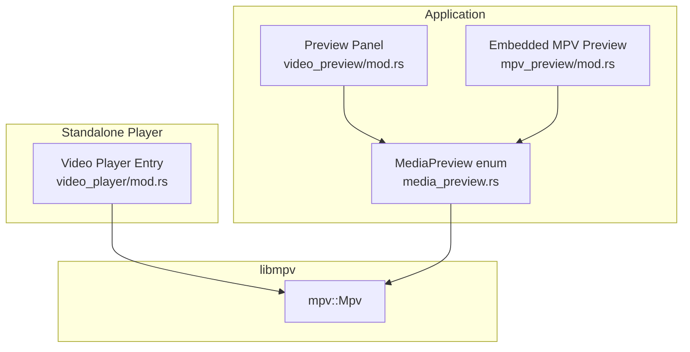
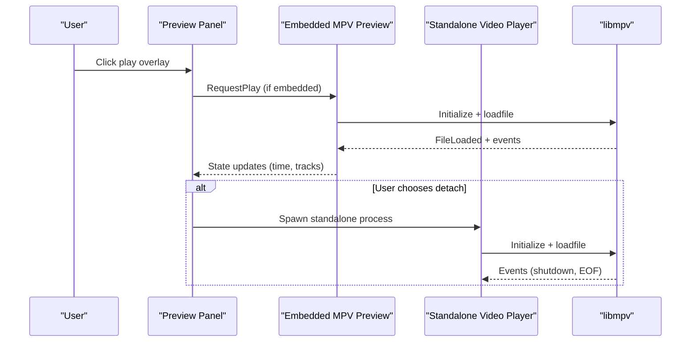
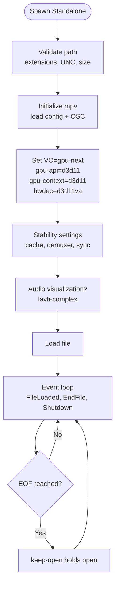
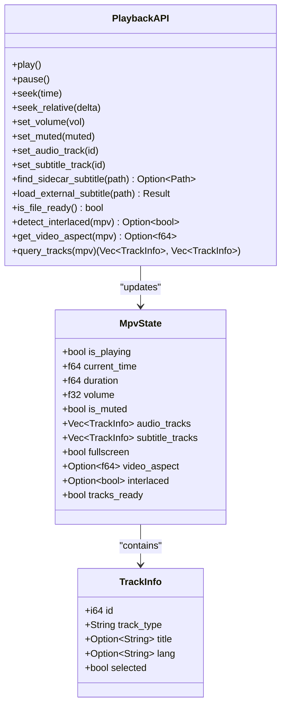
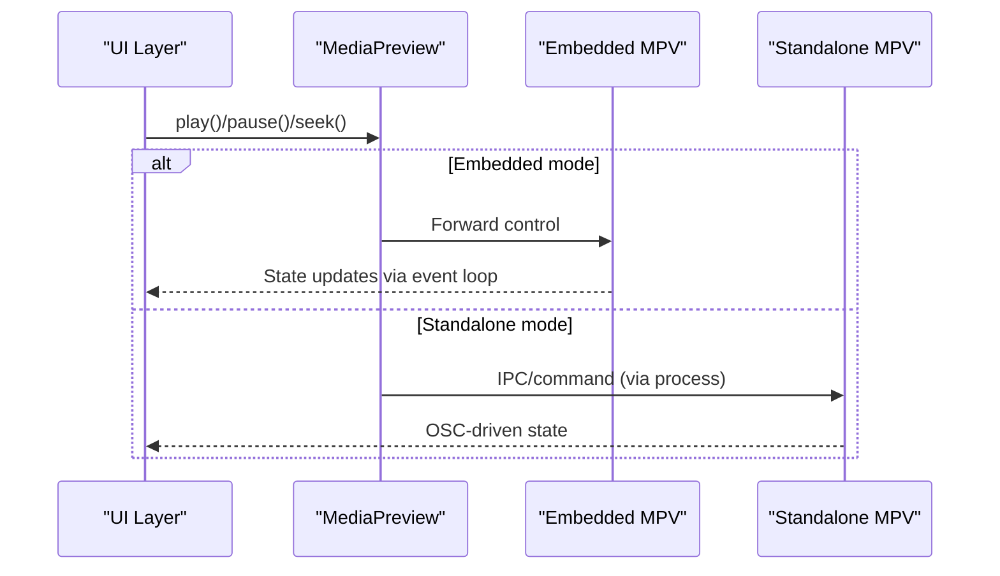
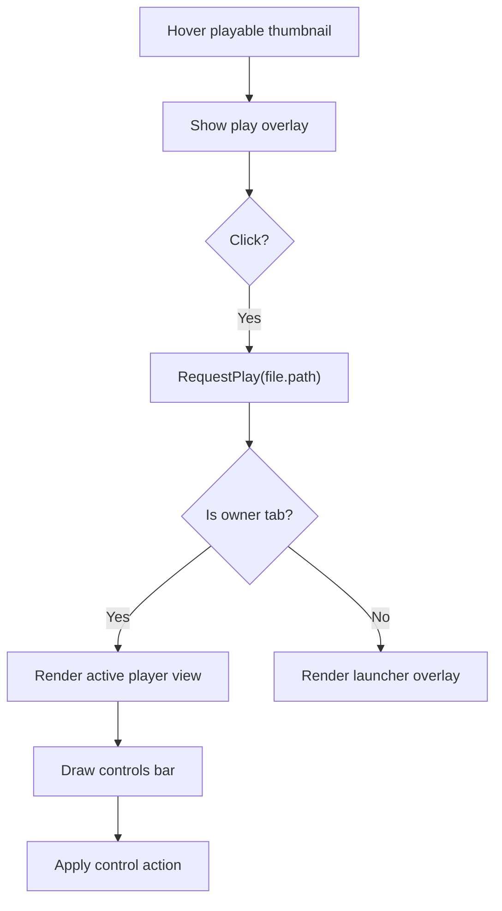

# Video Player

<cite>
**Referenced Files in This Document**
- [mod.rs](file://src/video_player/mod.rs)
- [media_preview.rs](file://src/ui/components/media_preview.rs)
- [mod.rs](file://src/ui/components/mpv/mod.rs)
- [state.rs](file://src/ui/components/mpv/state.rs)
- [playback.rs](file://src/ui/components/mpv/playback.rs)
- [event_loop.rs](file://src/ui/components/mpv/event_loop.rs)
- [utils.rs](file://src/ui/components/mpv/utils.rs)
- [mod.rs](file://src/ui/preview_panel/video_preview/mod.rs)
- [docked.rs](file://src/ui/preview_panel/video_preview/docked.rs)
- [controls.rs](file://src/ui/preview_panel/video_preview/controls.rs)
- [mod.rs](file://src/ui/components/mpv_preview/mod.rs)
- [lifecycle.rs](file://src/ui/components/mpv_preview/lifecycle.rs)
- [update_loop.rs](file://src/ui/components/mpv_preview/update_loop.rs)
- [mod.rs](file://src/ui/preview_panel/mod.rs)
</cite>

## Table of Contents
1. [Introduction](#introduction)
2. [Project Structure](#project-structure)
3. [Core Components](#core-components)
4. [Architecture Overview](#architecture-overview)
5. [Detailed Component Analysis](#detailed-component-analysis)
6. [Dependency Analysis](#dependency-analysis)
7. [Performance Considerations](#performance-considerations)
8. [Troubleshooting Guide](#troubleshooting-guide)
9. [Conclusion](#conclusion)

## Introduction
This document explains the MTT File Manager’s video player integration built on libmpv. It covers:
- Native video playback via a dedicated standalone process and an embedded preview panel
- Codec support, subtitle handling, and hardware acceleration
- Playback controls, state management, and integration with the preview panel’s media launcher
- Aspect ratio handling, fullscreen mode, and playback speed controls
- Windows Media Foundation integration for codec queries and fallbacks
- Performance optimizations, memory management for video frames, and container/codecs coverage

## Project Structure
The video player spans two primary integration points:
- A standalone process that launches a native mpv window with OSC controls
- An embedded preview panel that hosts mpv inside the application window



**Diagram sources**
- [mod.rs:121-193](file://src/ui/preview_panel/video_preview/mod.rs#L121-L193)
- [mod.rs:1-16](file://src/ui/components/mpv_preview/mod.rs#L1-L16)
- [media_preview.rs:120-160](file://src/ui/components/media_preview.rs#L120-L160)
- [mod.rs:424-676](file://src/video_player/mod.rs#L424-L676)

**Section sources**
- [mod.rs:1-193](file://src/ui/preview_panel/video_preview/mod.rs#L1-L193)
- [mod.rs:1-16](file://src/ui/components/mpv_preview/mod.rs#L1-L16)
- [media_preview.rs:1-548](file://src/ui/components/media_preview.rs#L1-L548)
- [mod.rs:1-676](file://src/video_player/mod.rs#L1-L676)

## Core Components
- Standalone Video Player: Spawns a separate process with a native mpv window and OSC controls. Handles path validation, locale-aware OSC language, external subtitle selection, and window icon injection on Windows.
- Embedded MPV Preview: Runs mpv inside the app window, with a background event loop polling playback state, tracks, and UI updates.
- Media Preview Abstraction: A unified enum that delegates playback controls to either the standalone or embedded player depending on state.
- Preview Panel Integration: Renders a media launcher overlay for non-active selections and routes control actions to the active player.

Key responsibilities:
- Playback control: play/pause, seek, volume/mute, track selection, external subtitles
- State management: current time, duration, fullscreen, aspect ratio, interlaced detection
- Hardware acceleration: D3D11 VO/gpu-api/context with D3D11VA hwdec for NVIDIA RTX VSR
- Windows integration: Media Foundation codec queries, fallbacks, and icon handling

**Section sources**
- [mod.rs:104-145](file://src/video_player/mod.rs#L104-L145)
- [state.rs:29-44](file://src/ui/components/mpv/state.rs#L29-L44)
- [playback.rs:36-311](file://src/ui/components/mpv/playback.rs#L36-L311)
- [event_loop.rs:15-241](file://src/ui/components/mpv/event_loop.rs#L15-L241)
- [media_preview.rs:162-543](file://src/ui/components/media_preview.rs#L162-L543)

## Architecture Overview
The system supports two modes:
- Docked: Embedded mpv inside the preview panel
- Detached: Standalone native mpv window with OSC



**Diagram sources**
- [mod.rs:121-193](file://src/ui/preview_panel/video_preview/mod.rs#L121-L193)
- [mod.rs:1-16](file://src/ui/components/mpv_preview/mod.rs#L1-L16)
- [mod.rs:424-676](file://src/video_player/mod.rs#L424-L676)

## Detailed Component Analysis

### Standalone Video Player
- Process model: Separate process with native mpv window and OSC controls; borderless with configurable window controls.
- Initialization: Loads mpv.conf and scripts from a portable config directory; sets border, input bindings, cursor autohide, and OSC language.
- Hardware acceleration: Uses gpu-next VO with D3D11 backend and D3D11VA hardware decoding; enforced after initialization to avoid premature VO initialization.
- Stability settings: force-window, video-sync=audio, interpolation=false, tscale=linear, framedrop=vo, keep-open=always.
- Cache and demuxer: cache=yes, cache-secs, demuxer-readahead-secs, demuxer-max-bytes, demuxer-max-back-bytes.
- Audio visualization: for audio files, a lavfi-complex filter renders a real-time waveform.
- External subtitles: native file picker for SRT/ASS/SSA/VTT/SUB/SUP/IDX/MKS; loads and selects the chosen file.
- Window icon: retrieves app icons and applies them to the mpv window handle.



**Diagram sources**
- [mod.rs:424-676](file://src/video_player/mod.rs#L424-L676)

**Section sources**
- [mod.rs:104-145](file://src/video_player/mod.rs#L104-L145)
- [mod.rs:424-676](file://src/video_player/mod.rs#L424-L676)

### Embedded MPV Preview
- Lifecycle: Creates mpv instance, sets hardware acceleration, enables keep-open, and starts an asynchronous event loop thread.
- Event loop: Polls playback state at tiered intervals (fast: time-pos/pause/fullscreen; medium: volume/mute/duration; slow: aspect).
- State synchronization: Updates a shared RwLock<MpvState> with is_playing, current_time, duration, volume, is_muted, fullscreen, video_aspect, interlaced, and tracks_ready.
- Track queries: Queries audio/subtitle tracks when signaled and file is ready; invalidates cache after external subtitle addition.
- Interlaced detection: Reads video-params/interlaced and field properties to infer interlaced status.
- Aspect ratio: Prefers video-out-params/aspect or video-out-params/dw/dh; falls back to video-params/w/h.



**Diagram sources**
- [state.rs:29-44](file://src/ui/components/mpv/state.rs#L29-L44)
- [playback.rs:116-311](file://src/ui/components/mpv/playback.rs#L116-L311)

**Section sources**
- [mod.rs:1-16](file://src/ui/components/mpv_preview/mod.rs#L1-L16)
- [lifecycle.rs:1-35](file://src/ui/components/mpv_preview/lifecycle.rs#L1-L35)
- [update_loop.rs:34-62](file://src/ui/components/mpv_preview/update_loop.rs#L34-L62)
- [state.rs:1-44](file://src/ui/components/mpv/state.rs#L1-L44)
- [playback.rs:1-311](file://src/ui/components/mpv/playback.rs#L1-L311)
- [event_loop.rs:1-241](file://src/ui/components/mpv/event_loop.rs#L1-L241)

### Media Preview Abstraction
- Delegates control methods to the underlying player (embedded or standalone) based on visibility and ownership.
- Provides unified APIs for toggling play/pause, seeking, setting volume/mute, selecting audio/subtitle tracks, external subtitle loading, fullscreen/maximize, and VSR toggles.
- Exposes playback state and geometry helpers (aspect ratio, native OSC activity).



**Diagram sources**
- [media_preview.rs:162-543](file://src/ui/components/media_preview.rs#L162-L543)

**Section sources**
- [media_preview.rs:120-543](file://src/ui/components/media_preview.rs#L120-L543)

### Preview Panel Integration
- Media launcher overlay appears when hovering playable media thumbnails; clicking requests playback.
- Active owner renders the appropriate player view (docked, detached, or fullscreen) and displays controls.
- Control actions propagate to the preview panel (e.g., volume changes) and trigger player actions.



**Diagram sources**
- [mod.rs:15-119](file://src/ui/preview_panel/video_preview/mod.rs#L15-L119)
- [mod.rs:104-144](file://src/ui/preview_panel/mod.rs#L104-L144)

**Section sources**
- [mod.rs:121-193](file://src/ui/preview_panel/video_preview/mod.rs#L121-L193)
- [docked.rs:1-42](file://src/ui/preview_panel/video_preview/docked.rs#L1-L42)
- [controls.rs:90-126](file://src/ui/preview_panel/video_preview/controls.rs#L90-L126)
- [mod.rs:104-144](file://src/ui/preview_panel/mod.rs#L104-L144)

## Dependency Analysis
- Embedded preview depends on libmpv via mpv::Mpv and an async event loop thread for polling.
- Standalone player also depends on libmpv and spawns a separate process with its own mpv instance.
- MediaPreview abstracts both implementations behind a single interface.
- Preview panel orchestrates rendering and control routing.

```mermaid
graph LR
MPV_LIB["libmpv (mpv::Mpv)"] <- --> EMB["Embedded Preview"]
MPV_LIB <- --> STAND["Standalone Player"]
EMB --> MP_ENUM["MediaPreview"]
STAND --> MP_ENUM
PANEL["Preview Panel"] --> MP_ENUM
```

**Diagram sources**
- [mod.rs:1-16](file://src/ui/components/mpv_preview/mod.rs#L1-L16)
- [mod.rs:424-676](file://src/video_player/mod.rs#L424-L676)
- [media_preview.rs:120-160](file://src/ui/components/media_preview.rs#L120-L160)

**Section sources**
- [mod.rs:1-16](file://src/ui/components/mpv_preview/mod.rs#L1-L16)
- [mod.rs:424-676](file://src/video_player/mod.rs#L424-L676)
- [media_preview.rs:120-160](file://src/ui/components/media_preview.rs#L120-L160)

## Performance Considerations
- Background polling: The event loop runs at 4 FPS in a dedicated thread, reducing UI thread pressure.
- Tiered polling: Fast (time-pos/pause/fullscreen), medium (volume/mute/duration), slow (aspect) to balance accuracy and overhead.
- Seek settling: Tracks pending seeks and tolerates small drift to avoid oscillation.
- File readiness gating: Suppresses time-pos polling while a new file is loading to prevent stale reads.
- Memory management: Embedded preview tears down mpv explicitly to release decode buffers and caches promptly.
- HiDPI and window sizing: Uses percentage-based autofit and hidpi-window-scale to respect display scaling.

[No sources needed since this section provides general guidance]

## Troubleshooting Guide
- Standalone player does not start:
  - Verify path validation passes (no UNC, allowed extensions, file size limit).
  - Confirm portable config directory presence and required scripts.
- No hardware acceleration:
  - Ensure VO=gpu-next and gpu-api/gpu-context=d3d11 are set after initialization.
  - Check hwdec-current reflects d3d11va.
- External subtitles not loading:
  - Use the native picker or load_external_subtitle API; ensure file exists and mpv is initialized.
- White screen or stuck playback:
  - Use restore helpers to force refresh after UI overlays or minimize/restore cycles.
- Controls lag:
  - Confirm event loop is running and significant changes trigger immediate repaints.

**Section sources**
- [mod.rs:48-102](file://src/video_player/mod.rs#L48-L102)
- [mod.rs:450-542](file://src/video_player/mod.rs#L450-L542)
- [playback.rs:184-213](file://src/ui/components/mpv/playback.rs#L184-L213)
- [lifecycle.rs:26-35](file://src/ui/components/mpv_preview/lifecycle.rs#L26-L35)

## Conclusion
The MTT File Manager integrates libmpv across both embedded and standalone modes, delivering robust playback with hardware acceleration, accurate state synchronization, and a polished user experience. The preview panel’s media launcher and unified MediaPreview abstraction provide seamless switching between docked, detached, and fullscreen modes, while the background event loop ensures smooth UI responsiveness and precise control over playback and tracks.