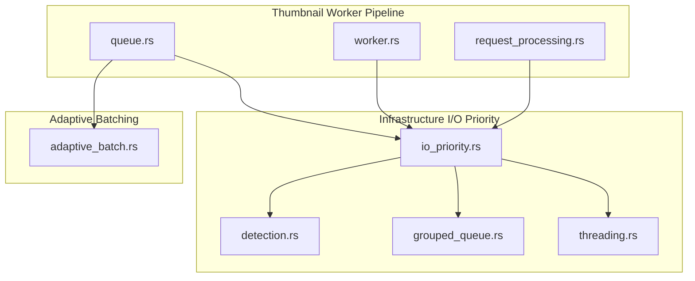
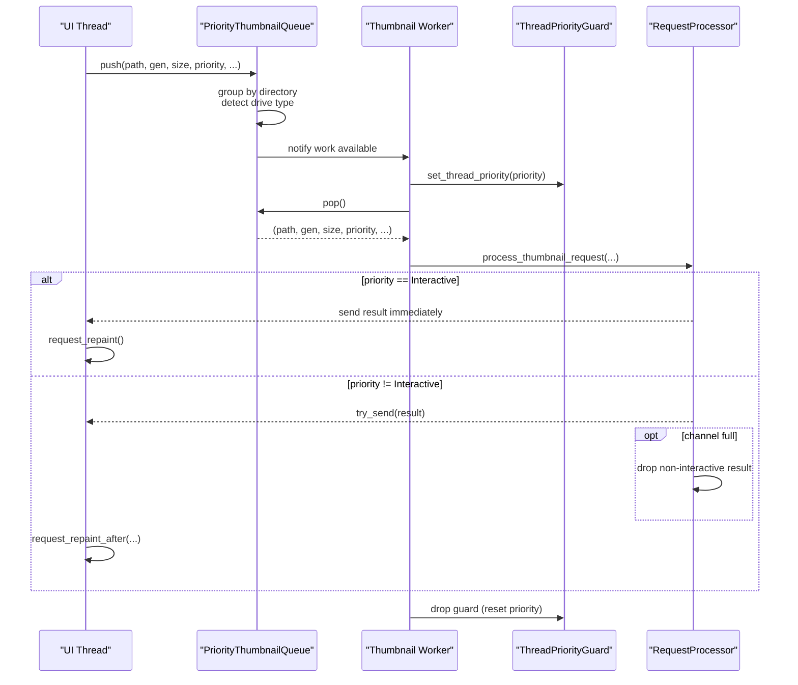
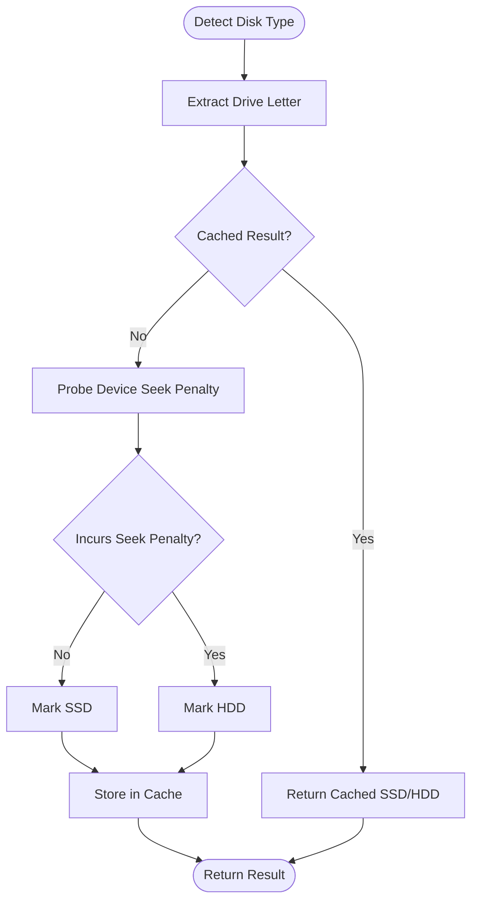
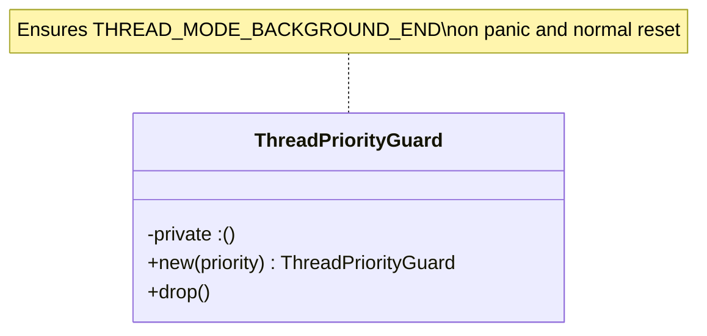
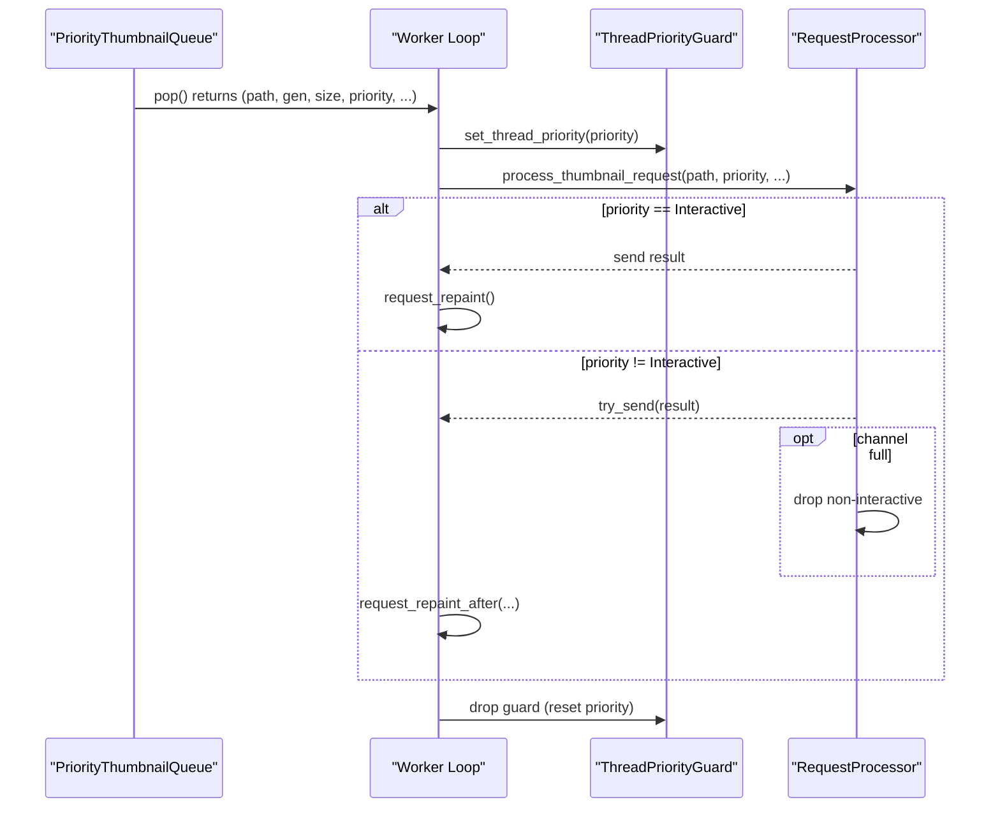
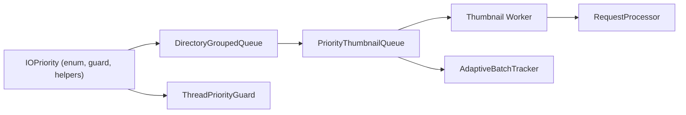

# I/O Priority Management

<cite>
**Referenced Files in This Document**
- [io_priority.rs](file://src/infrastructure/io_priority.rs)
- [detection.rs](file://src/infrastructure/io_priority/detection.rs)
- [grouped_queue.rs](file://src/infrastructure/io_priority/grouped_queue.rs)
- [threading.rs](file://src/infrastructure/io_priority/threading.rs)
- [worker.rs](file://src/workers/thumbnail/worker.rs)
- [queue.rs](file://src/workers/thumbnail/queue.rs)
- [request_processing.rs](file://src/workers/thumbnail/worker/request_processing.rs)
- [adaptive_batch.rs](file://src/infrastructure/adaptive_batch.rs)
</cite>

## Table of Contents
1. [Introduction](#introduction)
2. [Project Structure](#project-structure)
3. [Core Components](#core-components)
4. [Architecture Overview](#architecture-overview)
5. [Detailed Component Analysis](#detailed-component-analysis)
6. [Dependency Analysis](#dependency-analysis)
7. [Performance Considerations](#performance-considerations)
8. [Troubleshooting Guide](#troubleshooting-guide)
9. [Conclusion](#conclusion)

## Introduction
This document explains the I/O priority management system used to optimize disk access and maintain UI responsiveness during heavy background operations. It covers:
- The three-tier priority system (Interactive, Prefetch, Background)
- Dynamic worker thread priority adjustment based on workload type and user interaction
- SSD/HDD detection and read strategy optimization
- The ThreadPriorityGuard RAII pattern for automatic priority restoration
- The grouped queue system that distributes work across priority levels
- Practical examples of how priority adjustments affect UI responsiveness
- The balance between system responsiveness and throughput

## Project Structure
The I/O priority system is implemented in a dedicated module with supporting components in the thumbnail worker pipeline and adaptive batching utilities.



**Diagram sources**
- [io_priority.rs:1-184](file://src/infrastructure/io_priority.rs#L1-L184)
- [detection.rs:1-198](file://src/infrastructure/io_priority/detection.rs#L1-L198)
- [grouped_queue.rs:1-140](file://src/infrastructure/io_priority/grouped_queue.rs#L1-L140)
- [threading.rs:1-56](file://src/infrastructure/io_priority/threading.rs#L1-L56)
- [queue.rs:1-559](file://src/workers/thumbnail/queue.rs#L1-L559)
- [worker.rs:1-338](file://src/workers/thumbnail/worker.rs#L1-L338)
- [request_processing.rs:1-418](file://src/workers/thumbnail/worker/request_processing.rs#L1-L418)
- [adaptive_batch.rs:1-88](file://src/infrastructure/adaptive_batch.rs#L1-L88)

**Section sources**
- [io_priority.rs:1-184](file://src/infrastructure/io_priority.rs#L1-L184)
- [queue.rs:1-559](file://src/workers/thumbnail/queue.rs#L1-L559)
- [worker.rs:1-338](file://src/workers/thumbnail/worker.rs#L1-L338)
- [adaptive_batch.rs:1-88](file://src/infrastructure/adaptive_batch.rs#L1-L88)

## Core Components
- IOPriority enum defines three levels: Interactive (highest), Prefetch, Background (lowest). Ordering ensures priority-driven scheduling.
- SSD/HDD detection determines whether a path resides on a drive with seek penalties; caches results for performance.
- DirectoryGroupedQueue groups requests by parent directory to reduce disk seeks on HDDs while preserving priority ordering on SSDs.
- ThreadPriorityGuard sets and automatically restores thread priority using Windows thread APIs, ensuring background mode cleanup even on panic.
- PriorityThumbnailQueue integrates IOPriority with directory grouping, per-drive SSD detection, and dynamic thread priority adjustment.

**Section sources**
- [io_priority.rs:16-28](file://src/infrastructure/io_priority.rs#L16-L28)
- [detection.rs:52-106](file://src/infrastructure/io_priority/detection.rs#L52-L106)
- [grouped_queue.rs:7-140](file://src/infrastructure/io_priority/grouped_queue.rs#L7-L140)
- [threading.rs:5-56](file://src/infrastructure/io_priority/threading.rs#L5-L56)
- [queue.rs:11-559](file://src/workers/thumbnail/queue.rs#L11-L559)

## Architecture Overview
The system orchestrates priority-aware I/O across worker threads and queues. The thumbnail worker pipeline demonstrates how priorities influence thread priority, request processing, and UI repaint throttling.



**Diagram sources**
- [queue.rs:310-340](file://src/workers/thumbnail/queue.rs#L310-L340)
- [worker.rs:227-230](file://src/workers/thumbnail/worker.rs#L227-L230)
- [request_processing.rs:335-388](file://src/workers/thumbnail/worker/request_processing.rs#L335-L388)
- [io_priority.rs:100-116](file://src/infrastructure/io_priority.rs#L100-L116)

## Detailed Component Analysis

### Three-Tier Priority System
- Interactive: Highest priority for items currently visible and needing immediate response (e.g., user-triggered loads).
- Prefetch: Medium priority for items likely to become visible soon (e.g., adjacent thumbnails).
- Background: Lowest priority for non-urgent tasks (e.g., background metadata discovery).

These priorities are ordered so that higher-priority items preempt lower-priority ones, ensuring UI responsiveness during heavy background operations.

**Section sources**
- [io_priority.rs:16-28](file://src/infrastructure/io_priority.rs#L16-L28)

### SSD/HDD Detection and Read Strategy
- Drive classification is cached per drive letter to avoid repeated expensive probes.
- Virtual drives (e.g., Cryptomator) are treated conservatively as SSD by default unless overridden.
- On SSDs, requests are served by highest-priority directory first, skipping locality grouping.
- On HDDs, the system continues processing within the current directory to minimize head movement, switching only when higher-priority items elsewhere require attention.



**Diagram sources**
- [detection.rs:52-106](file://src/infrastructure/io_priority/detection.rs#L52-L106)
- [detection.rs:108-197](file://src/infrastructure/io_priority/detection.rs#L108-L197)

**Section sources**
- [detection.rs:52-106](file://src/infrastructure/io_priority/detection.rs#L52-L106)
- [detection.rs:108-197](file://src/infrastructure/io_priority/detection.rs#L108-L197)
- [queue.rs:191-206](file://src/workers/thumbnail/queue.rs#L191-L206)

### DirectoryGroupedQueue: Work Distribution Across Priority Levels
- Groups requests by parent directory to reduce disk seeks on HDDs.
- On SSDs, selects the directory with the highest-priority pending item.
- On HDDs, prefers continuing the current directory to exploit locality, switching only when higher-priority items elsewhere require immediate attention.

```mermaid
classDiagram
class DirectoryGroupedQueue {
-by_directory : HashMap<PathBuf, Vec<(IOPriority, T)>>
-is_ssd : bool
-current_directory : Option<PathBuf>
+new(sample_path)
+with_disk_type(is_ssd)
+push(path, priority, item)
+pop() Option<T>
-pop_highest_priority() Option<T>
-pop_with_locality() Option<T>
-pop_from_directory(dir) Option<T>
+is_empty() bool
+len() usize
}
```

**Diagram sources**
- [grouped_queue.rs:7-140](file://src/infrastructure/io_priority/grouped_queue.rs#L7-L140)

**Section sources**
- [grouped_queue.rs:17-139](file://src/infrastructure/io_priority/grouped_queue.rs#L17-L139)

### ThreadPriorityGuard: RAII Pattern for Automatic Priority Restoration
- Sets thread priority based on IOPriority and ensures background mode is properly exited even if the thread panics.
- Resets to normal priority on drop, preventing kernel I/O scheduler from permanently deprioritizing threads.



**Diagram sources**
- [io_priority.rs:100-116](file://src/infrastructure/io_priority.rs#L100-L116)
- [threading.rs:9-55](file://src/infrastructure/io_priority/threading.rs#L9-L55)

**Section sources**
- [io_priority.rs:95-116](file://src/infrastructure/io_priority.rs#L95-L116)
- [threading.rs:9-55](file://src/infrastructure/io_priority/threading.rs#L9-L55)

### Priority-Driven Worker Pipeline
- Workers are spawned with ThreadPriorityGuard set to Background to minimize interference with foreground tasks.
- The queue adjusts thread priority per request, raising priority for Interactive/Prefetch and lowering for Background.
- Request processing sends results immediately for Interactive and drops non-Interactive results under saturation to protect UI latency.



**Diagram sources**
- [queue.rs:310-340](file://src/workers/thumbnail/queue.rs#L310-L340)
- [worker.rs:227-230](file://src/workers/thumbnail/worker.rs#L227-L230)
- [request_processing.rs:335-388](file://src/workers/thumbnail/worker/request_processing.rs#L335-L388)

**Section sources**
- [worker.rs:227-230](file://src/workers/thumbnail/worker.rs#L227-L230)
- [queue.rs:310-340](file://src/workers/thumbnail/queue.rs#L310-L340)
- [request_processing.rs:335-388](file://src/workers/thumbnail/worker/request_processing.rs#L335-L388)

### Examples: How Priority Adjustments Affect UI Responsiveness
- Interactive requests trigger immediate UI repaints, maintaining perceived responsiveness even during heavy background workloads.
- Non-Interactive results may be dropped under saturation to preserve UI latency; the system schedules repaints after a short delay to smooth updates.
- Workers operate at Background priority by default, minimizing contention with foreground tasks.

**Section sources**
- [request_processing.rs:364-388](file://src/workers/thumbnail/worker/request_processing.rs#L364-L388)
- [worker.rs:227-230](file://src/workers/thumbnail/worker.rs#L227-L230)

### Balance Between System Responsiveness and Throughput
- SSD mode prioritizes throughput by selecting the highest-priority item across directories.
- HDD mode prioritizes responsiveness by exploiting locality to reduce seek times, switching only when higher-priority items elsewhere demand attention.
- Adaptive batching further tailors batch sizes to drive characteristics, improving responsiveness on SSDs and throughput on HDDs.

**Section sources**
- [grouped_queue.rs:45-101](file://src/infrastructure/io_priority/grouped_queue.rs#L45-L101)
- [adaptive_batch.rs:13-26](file://src/infrastructure/adaptive_batch.rs#L13-L26)

## Dependency Analysis
The I/O priority module is consumed by the thumbnail worker pipeline and integrated with per-drive SSD detection and adaptive batching.



**Diagram sources**
- [io_priority.rs:16-116](file://src/infrastructure/io_priority.rs#L16-L116)
- [grouped_queue.rs:1-140](file://src/infrastructure/io_priority/grouped_queue.rs#L1-L140)
- [queue.rs:1-559](file://src/workers/thumbnail/queue.rs#L1-L559)
- [worker.rs:1-338](file://src/workers/thumbnail/worker.rs#L1-L338)
- [request_processing.rs:1-418](file://src/workers/thumbnail/worker/request_processing.rs#L1-L418)
- [adaptive_batch.rs:1-88](file://src/infrastructure/adaptive_batch.rs#L1-L88)

**Section sources**
- [io_priority.rs:1-184](file://src/infrastructure/io_priority.rs#L1-L184)
- [queue.rs:1-559](file://src/workers/thumbnail/queue.rs#L1-L559)
- [worker.rs:1-338](file://src/workers/thumbnail/worker.rs#L1-L338)
- [adaptive_batch.rs:1-88](file://src/infrastructure/adaptive_batch.rs#L1-L88)

## Performance Considerations
- SSD/HDD detection is cached to avoid repeated device queries; invalidate cache when drive configuration changes.
- Directory grouping reduces seek overhead on HDDs by continuing work within the current directory.
- ThreadPriorityGuard ensures background mode cleanup, preventing long-term I/O scheduler deprioritization.
- Adaptive batching tunes batch sizes to drive characteristics, improving responsiveness on SSDs and throughput on HDDs.

[No sources needed since this section provides general guidance]

## Troubleshooting Guide
- If UI becomes sluggish during background operations, verify that workers are using Background priority via ThreadPriorityGuard and that Interactive requests are prioritized in the queue.
- If HDD performance seems poor, confirm that directory grouping is enabled and that the system switches directories only when higher-priority items elsewhere require attention.
- If drive classification appears incorrect, invalidate the drive cache and re-run classification.

**Section sources**
- [threading.rs:40-55](file://src/infrastructure/io_priority/threading.rs#L40-L55)
- [detection.rs:101-106](file://src/infrastructure/io_priority/detection.rs#L101-L106)
- [queue.rs:384-431](file://src/workers/thumbnail/queue.rs#L384-L431)

## Conclusion
The I/O priority management system balances UI responsiveness and throughput by:
- Using three-tier priorities to guide scheduling and thread priority
- Detecting SSD/HDD and adapting read strategies accordingly
- Employing RAII-based thread priority management to prevent leaks
- Grouping work by directory to exploit locality on HDDs
- Integrating adaptive batching and request processing to optimize performance across drive types

This design ensures that user-visible work remains responsive while maximizing throughput for background tasks.