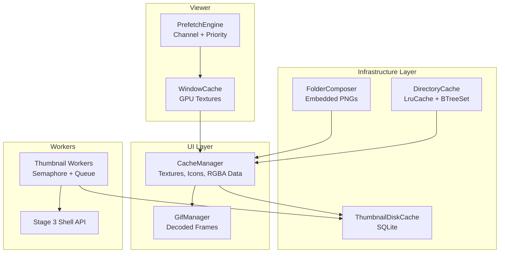
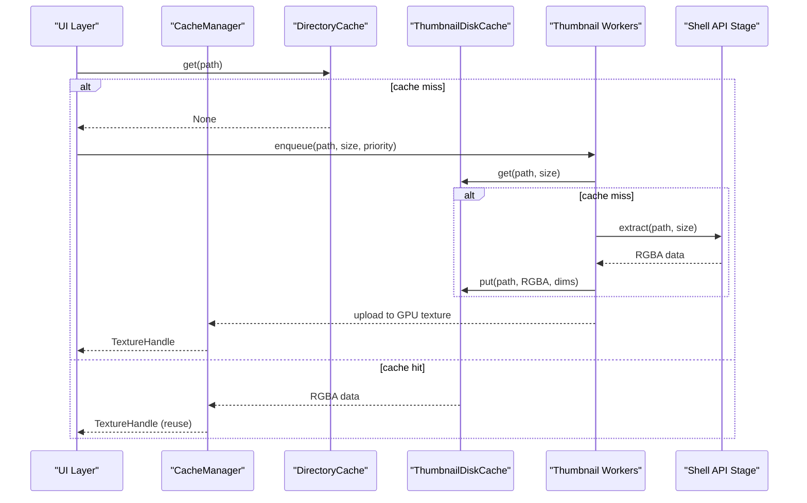
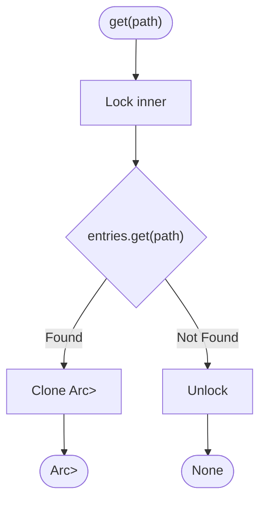
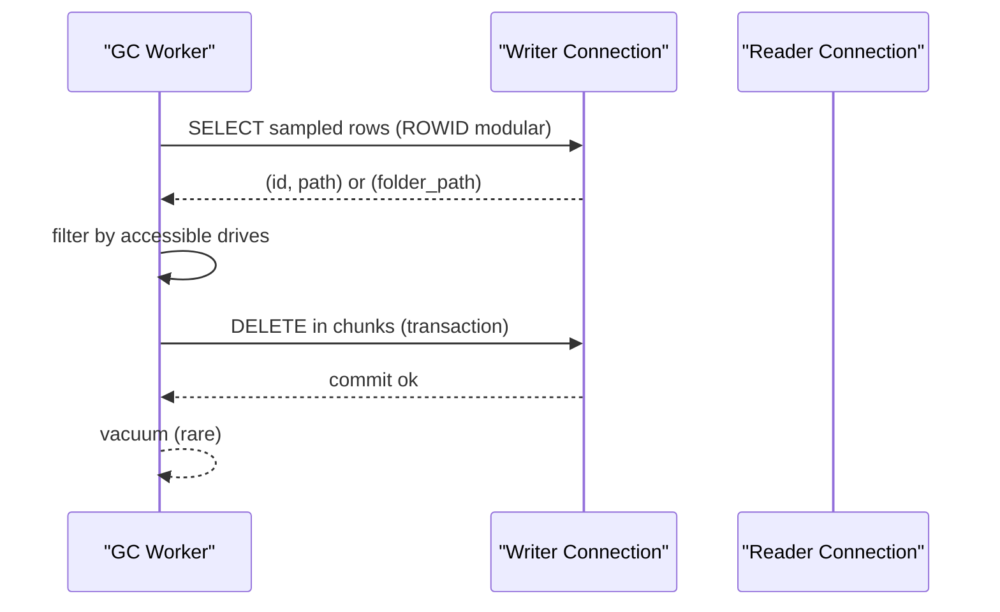
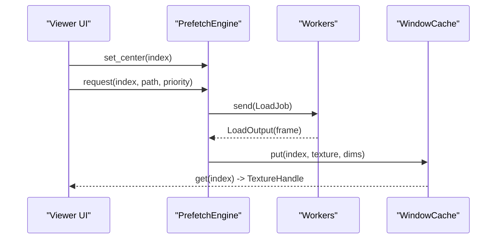
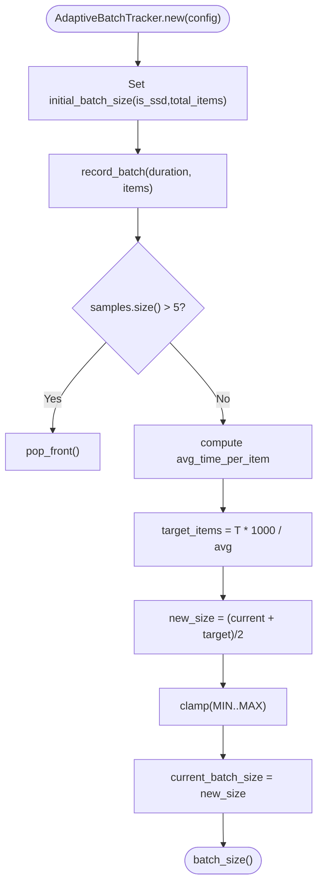
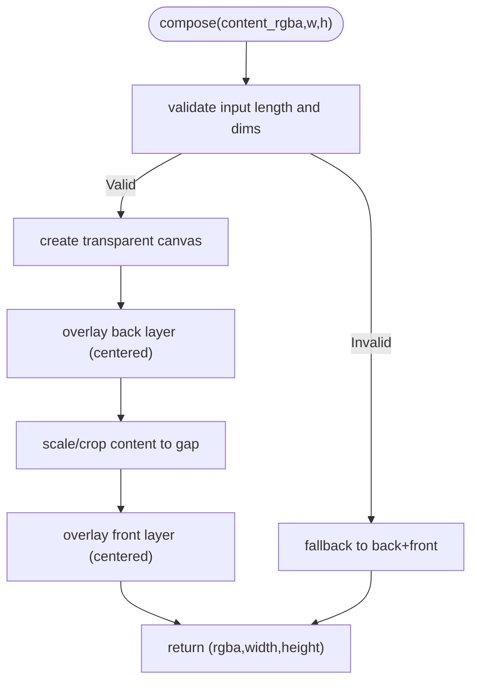
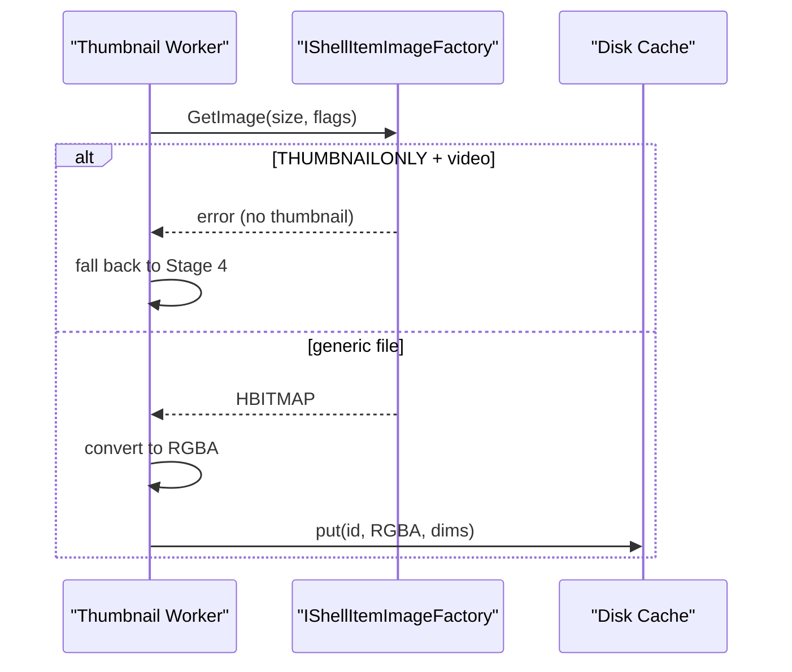
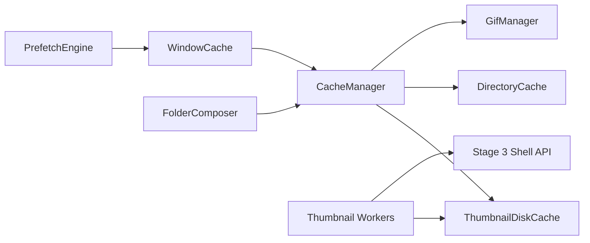

# Memory Management & Caching

<cite>
**Referenced Files in This Document**
- [cache_state.rs](file://src/app/cache_state.rs)
- [ui/cache.rs](file://src/ui/cache.rs)
- [image_viewer/cache.rs](file://src/image_viewer/cache.rs)
- [image_viewer/app/mod.rs](file://src/image_viewer/app/mod.rs)
- [infrastructure/directory_cache.rs](file://src/infrastructure/directory_cache.rs)
- [infrastructure/disk_cache.rs](file://src/infrastructure/disk_cache.rs)
- [infrastructure/disk_cache/gc.rs](file://src/infrastructure/disk_cache/gc.rs)
- [infrastructure/app_state_db/gc.rs](file://src/infrastructure/app_state_db/gc.rs)
- [infrastructure/folder_compose.rs](file://src/infrastructure/folder_compose.rs)
- [infrastructure/adaptive_batch.rs](file://src/infrastructure/adaptive_batch.rs)
- [app/state/helpers.rs](file://src/app/state/helpers.rs)
- [workers/thumbnail/worker.rs](file://src/workers/thumbnail/worker.rs)
- [workers/thumbnail/extraction/stage3_shell_api.rs](file://src/workers/thumbnail/extraction/stage3_shell_api.rs)
- [infrastructure/icon_disk_cache.rs](file://src/infrastructure/icon_disk_cache.rs)
- [ui/components/gif_manager.rs](file://src/ui/components/gif_manager.rs)
</cite>

## Table of Contents
1. [Introduction](#introduction)
2. [Project Structure](#project-structure)
3. [Core Components](#core-components)
4. [Architecture Overview](#architecture-overview)
5. [Detailed Component Analysis](#detailed-component-analysis)
6. [Dependency Analysis](#dependency-analysis)
7. [Performance Considerations](#performance-considerations)
8. [Troubleshooting Guide](#troubleshooting-guide)
9. [Conclusion](#conclusion)

## Introduction
This document explains MTT File Manager’s memory management and caching strategies across three layers:
- Multi-level cache hierarchy: directory cache for instant navigation, disk cache for thumbnails and icons, and a sliding-window image cache for viewer performance.
- Adaptive batch loading that dynamically adjusts cache sizes and throughput based on system memory and storage characteristics.
- Object pooling and memory reuse patterns for textures, icons, and decoded frames.
- Cache invalidation policies, garbage collection optimization, and memory pressure handling.
- Folder cover composition replacing expensive Shell API calls with embedded PNG layers.
- Cache coherency, concurrent access patterns, and leak prevention mechanisms.

## Project Structure
The memory and caching system spans UI, infrastructure, and worker modules:
- UI-level caches for textures, icons, and RGBA data.
- Infrastructure-level directory cache and disk-backed caches for thumbnails, folder previews, and shell icons.
- Image viewer window cache for GPU textures and prefetch engine.
- Thumbnail pipeline with adaptive concurrency and IO prioritization.
- Folder cover composition using embedded assets.
- Periodic garbage collection for disk caches and state DB.



**Diagram sources**
- [ui/cache.rs:50-136](file://src/ui/cache.rs#L50-L136)
- [image_viewer/cache.rs:46-106](file://src/image_viewer/cache.rs#L46-L106)
- [infrastructure/directory_cache.rs:39-142](file://src/infrastructure/directory_cache.rs#L39-L142)
- [infrastructure/disk_cache.rs:67-176](file://src/infrastructure/disk_cache.rs#L67-L176)
- [infrastructure/folder_compose.rs:43-116](file://src/infrastructure/folder_compose.rs#L43-L116)
- [workers/thumbnail/worker.rs:103-169](file://src/workers/thumbnail/worker.rs#L103-L169)
- [workers/thumbnail/extraction/stage3_shell_api.rs:22-63](file://src/workers/thumbnail/extraction/stage3_shell_api.rs#L22-L63)

**Section sources**
- [ui/cache.rs:1-584](file://src/ui/cache.rs#L1-L584)
- [image_viewer/cache.rs:1-307](file://src/image_viewer/cache.rs#L1-L307)
- [infrastructure/directory_cache.rs:1-175](file://src/infrastructure/directory_cache.rs#L1-L175)
- [infrastructure/disk_cache.rs:1-264](file://src/infrastructure/disk_cache.rs#L1-L264)
- [infrastructure/folder_compose.rs:1-207](file://src/infrastructure/folder_compose.rs#L1-L207)
- [workers/thumbnail/worker.rs:1-338](file://src/workers/thumbnail/worker.rs#L1-L338)
- [workers/thumbnail/extraction/stage3_shell_api.rs:1-117](file://src/workers/thumbnail/extraction/stage3_shell_api.rs#L1-L117)

## Core Components
- UI Texture and Icon Cache: LRU caches for thumbnails, icons, and folder previews; a separate RGBA data cache for fast re-upload without disk I/O; dynamic tuning of capacities and memory budgets.
- Directory Cache: Bounded LRU cache of parsed directory entries with invalidation by watchers and mtime checks.
- Disk Cache: SQLite-backed persistence for thumbnails, folder previews, and shell icons; incremental and full garbage collection.
- Image Viewer Window Cache: Sliding-window cache of GPU textures with priority-aware prefetching and channel-based worker coordination.
- Thumbnail Pipeline: Adaptive worker count, decode limits, and IO priority; fallback to Shell API with staged extraction.
- Folder Cover Composition: Embedded PNG layers pre-decoded and reused to avoid Shell API overhead.
- GIF Manager: Fixed-size decode workers, TTL and memory-based eviction, and atomic memory accounting.

**Section sources**
- [ui/cache.rs:50-136](file://src/ui/cache.rs#L50-L136)
- [infrastructure/directory_cache.rs:19-41](file://src/infrastructure/directory_cache.rs#L19-L41)
- [infrastructure/disk_cache.rs:67-176](file://src/infrastructure/disk_cache.rs#L67-L176)
- [image_viewer/cache.rs:46-106](file://src/image_viewer/cache.rs#L46-L106)
- [workers/thumbnail/worker.rs:103-169](file://src/workers/thumbnail/worker.rs#L103-L169)
- [infrastructure/folder_compose.rs:43-116](file://src/infrastructure/folder_compose.rs#L43-L116)
- [ui/components/gif_manager.rs:59-106](file://src/ui/components/gif_manager.rs#L59-L106)

## Architecture Overview
The system balances CPU, VRAM, and disk usage:
- Directory cache enables instant navigation by avoiding repeated filesystem scans.
- Disk cache persists thumbnails and icons to reduce repeated extraction work.
- UI cache holds textures and RGBA data with strict budgets and LRU trimming.
- Image viewer window cache stores GPU textures and evicts outside the current window.
- Thumbnail workers adapt to storage type and memory pressure, with background priority and soft caps on concurrency.
- Folder cover composition avoids Shell API latency by composing layered PNGs at startup and reusing them.



**Diagram sources**
- [infrastructure/directory_cache.rs:57-78](file://src/infrastructure/directory_cache.rs#L57-L78)
- [infrastructure/disk_cache.rs:67-176](file://src/infrastructure/disk_cache.rs#L67-L176)
- [workers/thumbnail/worker.rs:103-169](file://src/workers/thumbnail/worker.rs#L103-L169)
- [workers/thumbnail/extraction/stage3_shell_api.rs:22-63](file://src/workers/thumbnail/extraction/stage3_shell_api.rs#L22-L63)
- [ui/cache.rs:138-224](file://src/ui/cache.rs#L138-L224)

## Detailed Component Analysis

### UI Texture and Icon Cache (CacheManager)
- Purpose: Centralized cache for thumbnails, icons, folder previews, and a RAM layer for decoded RGBA data.
- Key features:
  - LRU caches for textures, icons, and folder previews with bounded capacities.
  - Separate RGBA data cache with byte budget and dynamic trimming.
  - Concurrent load gating via a pending upload set and a configurable concurrency cap.
  - Dynamic capacity tuning for texture cache with hard caps and O(evicted) resize.
  - Memory estimation APIs for VRAM and RAM usage.
- Memory reuse: TextureHandles are cheap to clone; RGBA data is retained to avoid re-decoding on eviction.

```mermaid
classDiagram
class CacheManager {
+texture_cache : LruCache<PathBuf, TextureHandle>
+icon_cache : LruCache<String, TextureHandle>
+folder_preview_cache : LruCache<PathBuf, TextureHandle>
+rgba_data_cache : LruCache<PathBuf, (Vec<u8>, u32, u32)>
+loading_set : FxHashSet<PathBuf>
+pending_upload_set : FxHashSet<PathBuf>
+failed_thumbnails : LruCache<PathBuf, ()>
+retune_texture_cache_capacity(target : usize) usize
+trim_thumbnail_caches(t1, b, t2) (usize, usize, usize)
+estimate_vram_usage() usize
+estimate_ram_cache_usage() usize
}
```

**Diagram sources**
- [ui/cache.rs:50-136](file://src/ui/cache.rs#L50-L136)

**Section sources**
- [ui/cache.rs:75-136](file://src/ui/cache.rs#L75-L136)
- [ui/cache.rs:153-174](file://src/ui/cache.rs#L153-L174)
- [ui/cache.rs:261-312](file://src/ui/cache.rs#L261-L312)
- [ui/cache.rs:373-408](file://src/ui/cache.rs#L373-L408)

### Directory Cache (Instant Navigation)
- Purpose: Bounded LRU cache of directory entries to avoid repeated filesystem scans.
- Features:
  - Stores entries without folder cover to avoid stale covers.
  - Invalidation by watchers, per-folder notify watcher, and mtime validation.
  - Maintains ordered keys for subtree invalidation.
- Access pattern: Fast reads on cache hits; writes strip cover to resolve separately.



**Diagram sources**
- [infrastructure/directory_cache.rs:57-72](file://src/infrastructure/directory_cache.rs#L57-L72)

**Section sources**
- [infrastructure/directory_cache.rs:43-95](file://src/infrastructure/directory_cache.rs#L43-L95)
- [infrastructure/directory_cache.rs:97-135](file://src/infrastructure/directory_cache.rs#L97-L135)

### Disk Cache (Thumbnails, Folder Previews, Shell Icons)
- Purpose: Persistent storage for thumbnails and icons to reduce repeated extraction.
- Features:
  - SQLite tables for thumbnails, folder_previews, and shell_icons.
  - WAL mode for concurrency; PRAGMAs applied for performance.
  - Incremental and full garbage collection scanning bounded samples.
  - Accessible drive detection to avoid deleting valid cached items on inaccessible mounts.
- Safety: Transactions with auto-rollback; fallback connections and ACL hardening.



**Diagram sources**
- [infrastructure/disk_cache/gc.rs:84-192](file://src/infrastructure/disk_cache/gc.rs#L84-L192)
- [infrastructure/disk_cache.rs:104-176](file://src/infrastructure/disk_cache.rs#L104-L176)

**Section sources**
- [infrastructure/disk_cache.rs:67-176](file://src/infrastructure/disk_cache.rs#L67-L176)
- [infrastructure/disk_cache/gc.rs:82-192](file://src/infrastructure/disk_cache/gc.rs#L82-L192)
- [infrastructure/app_state_db/gc.rs:53-132](file://src/infrastructure/app_state_db/gc.rs#L53-L132)

### Image Viewer Sliding-Window Cache and Prefetch Engine
- Purpose: Efficiently stream images around the current view with minimal VRAM footprint.
- Features:
  - WindowCache stores GPU textures keyed by index; evicts outside [center ± radius].
  - PrefetchEngine schedules jobs with Urgent/High/Normal priorities and bounded channels.
  - Workers decode frames with decode priority mapped to interactive/background; skip jobs outside skip radius.
  - Results drained and uploaded to TextureHandles; UI repainted on completion.



**Diagram sources**
- [image_viewer/cache.rs:108-116](file://src/image_viewer/cache.rs#L108-L116)
- [image_viewer/cache.rs:266-293](file://src/image_viewer/cache.rs#L266-L293)
- [image_viewer/cache.rs:384-406](file://src/image_viewer/cache.rs#L384-L406)

**Section sources**
- [image_viewer/cache.rs:46-106](file://src/image_viewer/cache.rs#L46-L106)
- [image_viewer/cache.rs:108-116](file://src/image_viewer/cache.rs#L108-L116)
- [image_viewer/cache.rs:266-293](file://src/image_viewer/cache.rs#L266-L293)
- [image_viewer/app/mod.rs:384-408](file://src/image_viewer/app/mod.rs#L384-L408)

### Adaptive Batch Loading and Concurrency Control
- Purpose: Adjust cache sizes and throughput based on system memory and storage type.
- Directory cache capacity tuning: bounded to avoid long-session RAM growth.
- UI cache dynamic tuning: resize LRU without full rebuild; clamp to hard caps.
- Thumbnail workers: adaptive worker count and decode limits; background IO priority; semaphores to cap RAM-heavy decodes.
- Storage-aware batching: initial batch size differs for SSD vs HDD; dynamic adjustment based on observed latency.



**Diagram sources**
- [infrastructure/adaptive_batch.rs:34-81](file://src/infrastructure/adaptive_batch.rs#L34-L81)

**Section sources**
- [infrastructure/directory_cache.rs:12-12](file://src/infrastructure/directory_cache.rs#L12-L12)
- [ui/cache.rs:153-174](file://src/ui/cache.rs#L153-L174)
- [workers/thumbnail/worker.rs:85-100](file://src/workers/thumbnail/worker.rs#L85-L100)
- [workers/thumbnail/worker.rs:117-122](file://src/workers/thumbnail/worker.rs#L117-L122)
- [infrastructure/adaptive_batch.rs:14-25](file://src/infrastructure/adaptive_batch.rs#L14-L25)

### Folder Cover Composition (Replaces Shell API)
- Purpose: Eliminate Shell API overhead by composing folder covers from embedded PNG layers.
- Implementation:
  - Pre-decoded PNGs (back, front, paper_sheet) scaled to output width and bottom-aligned.
  - Compose empty or with content thumbnail; fallback to back/front overlay if content invalid.
  - Single-threaded at startup; shared across worker threads via Arc.



**Diagram sources**
- [infrastructure/folder_compose.rs:145-205](file://src/infrastructure/folder_compose.rs#L145-L205)

**Section sources**
- [infrastructure/folder_compose.rs:43-116](file://src/infrastructure/folder_compose.rs#L43-L116)
- [infrastructure/folder_compose.rs:118-137](file://src/infrastructure/folder_compose.rs#L118-L137)
- [infrastructure/folder_compose.rs:139-205](file://src/infrastructure/folder_compose.rs#L139-L205)

### Thumbnail Extraction Pipeline and Shell API Fallback
- Stages:
  - Stage 3: Windows Shell API via IShellItemImageFactory for broad file type support.
  - Video handling: THUMBNAILONLY flag to fail when only an icon is available, enabling Stage 4 force extraction.
- Concurrency and IO:
  - Background thread priority to reduce HDD contention.
  - Decode parallelism capped by semaphores; virtual drive paths limited to 1 concurrent extraction.



**Diagram sources**
- [workers/thumbnail/extraction/stage3_shell_api.rs:22-63](file://src/workers/thumbnail/extraction/stage3_shell_api.rs#L22-L63)
- [workers/thumbnail/worker.rs:227-231](file://src/workers/thumbnail/worker.rs#L227-L231)

**Section sources**
- [workers/thumbnail/extraction/stage3_shell_api.rs:18-63](file://src/workers/thumbnail/extraction/stage3_shell_api.rs#L18-L63)
- [workers/thumbnail/worker.rs:192-289](file://src/workers/thumbnail/worker.rs#L192-L289)

### Extension Icon Disk Cache
- Purpose: Persist extension-based icons to accelerate cold-start icon loading.
- Behavior:
  - On-disk format stores width, height, and RGBA pixels per extension.
  - Canonical extension normalization to avoid stale mappings.
  - Load-all routine for quick warm-up; save on successful extraction.

**Section sources**
- [infrastructure/icon_disk_cache.rs:17-124](file://src/infrastructure/icon_disk_cache.rs#L17-L124)

### GIF Manager (Memory Leak Prevention and TTL)
- Purpose: Manage animated GIF decoding with bounded memory and TTL.
- Features:
  - Fixed pool of decode workers; bounded job channel.
  - Atomic running total for O(1) memory checks; LRU eviction when exceeding budget.
  - TTL-based cleanup for inactive GIFs; cancellation on drop or inactivity.

**Section sources**
- [ui/components/gif_manager.rs:59-106](file://src/ui/components/gif_manager.rs#L59-L106)
- [ui/components/gif_manager.rs:146-188](file://src/ui/components/gif_manager.rs#L146-L188)

## Dependency Analysis
- CacheManager depends on:
  - UI texture upload (egui::Context) for GPU textures.
  - Disk cache for RGBA data fallback and uploads.
  - Directory cache for navigation metadata.
- Image Viewer depends on:
  - PrefetchEngine and WindowCache for streaming textures.
  - Loader for decode priority mapping.
- Thumbnail workers depend on:
  - Disk cache for persistence.
  - Shell API stage for fallback extraction.
  - IO priority and semaphore modules for concurrency control.



**Diagram sources**
- [ui/cache.rs:50-136](file://src/ui/cache.rs#L50-L136)
- [image_viewer/cache.rs:46-106](file://src/image_viewer/cache.rs#L46-L106)
- [workers/thumbnail/worker.rs:103-169](file://src/workers/thumbnail/worker.rs#L103-L169)
- [workers/thumbnail/extraction/stage3_shell_api.rs:22-63](file://src/workers/thumbnail/extraction/stage3_shell_api.rs#L22-L63)
- [infrastructure/folder_compose.rs:43-116](file://src/infrastructure/folder_compose.rs#L43-L116)

**Section sources**
- [ui/cache.rs:50-136](file://src/ui/cache.rs#L50-L136)
- [image_viewer/cache.rs:46-106](file://src/image_viewer/cache.rs#L46-L106)
- [workers/thumbnail/worker.rs:103-169](file://src/workers/thumbnail/worker.rs#L103-L169)

## Performance Considerations
- GPU vs CPU memory separation: WindowCache stores GPU textures; eviction releases VRAM promptly.
- Adaptive sizing: UI cache capacity and RGBA budget scale with configuration; directory cache bounded to prevent long-session growth.
- Concurrency caps: Decode parallelism limited by semaphores; background IO priority reduces HDD contention.
- Batching: Adaptive batch tracker computes optimal batch sizes for SSD/HDD; initial batches tuned for responsiveness.
- Memory pressure handling: Periodic maintenance trims caches and clears visibility-dependent caches when working set exceeds thresholds.

[No sources needed since this section provides general guidance]

## Troubleshooting Guide
- Thumbnails not appearing:
  - Check failed_thumbnails cache and re-run extraction; verify disk cache connectivity and permissions.
  - Confirm Shell API stage is reachable and not blocked by virtual drive constraints.
- Excessive memory usage:
  - Verify memory maintenance triggers and pending upload limits; confirm aggressive trimming is active under hard pressure.
  - Inspect RGBA data budget and texture cache capacity tuning.
- Slow navigation:
  - Ensure directory cache is populated and not invalidated excessively; confirm mtime validation is not causing frequent misses.
- Stale folder covers:
  - Invalidate folder preview cache for affected paths; ensure cover pipeline is running and not blocked by inaccessible drives.
- GIF artifacts or leaks:
  - Confirm TTL and memory-based cleanup are functioning; verify decode workers are not starved by the bounded channel.

**Section sources**
- [app/state/helpers.rs:75-161](file://src/app/state/helpers.rs#L75-L161)
- [ui/cache.rs:314-327](file://src/ui/cache.rs#L314-L327)
- [infrastructure/disk_cache/gc.rs:82-192](file://src/infrastructure/disk_cache/gc.rs#L82-L192)
- [ui/components/gif_manager.rs:146-188](file://src/ui/components/gif_manager.rs#L146-L188)

## Conclusion
MTT File Manager employs a layered, adaptive caching strategy that minimizes CPU, VRAM, and disk contention:
- Directory cache accelerates navigation; disk cache persists extracted assets; UI cache balances throughput and memory.
- The image viewer uses a sliding-window GPU cache with priority-aware prefetching.
- Concurrency and IO prioritization protect system responsiveness; adaptive batching optimizes for storage type.
- Folder cover composition eliminates Shell API overhead; robust invalidation and GC maintain cache coherency.
- Memory pressure handling and leak prevention ensure stable long-running sessions.