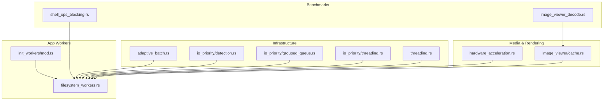
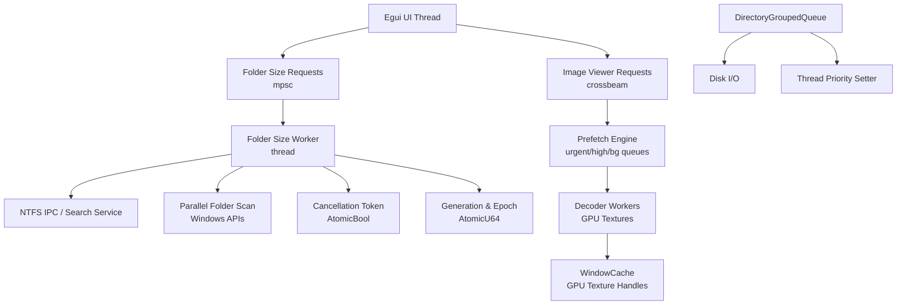
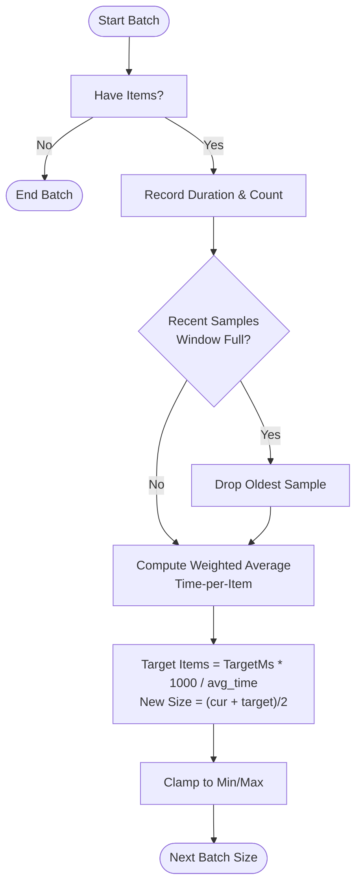
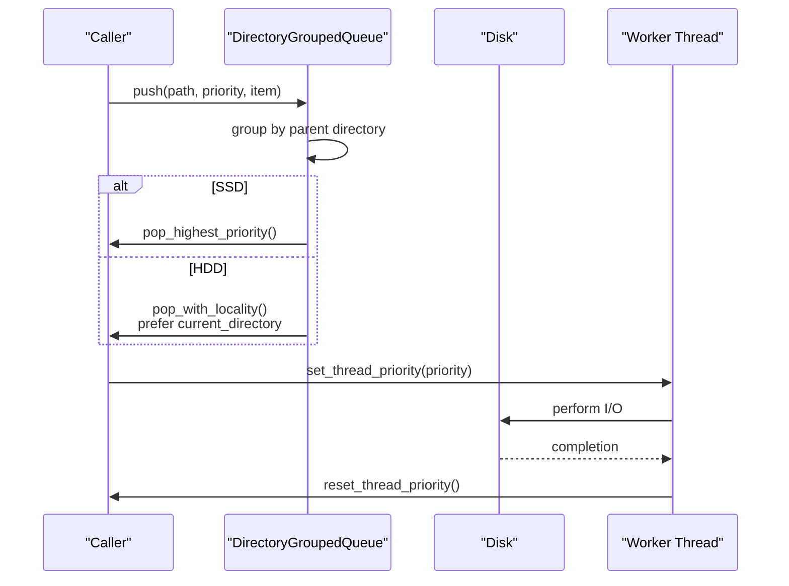
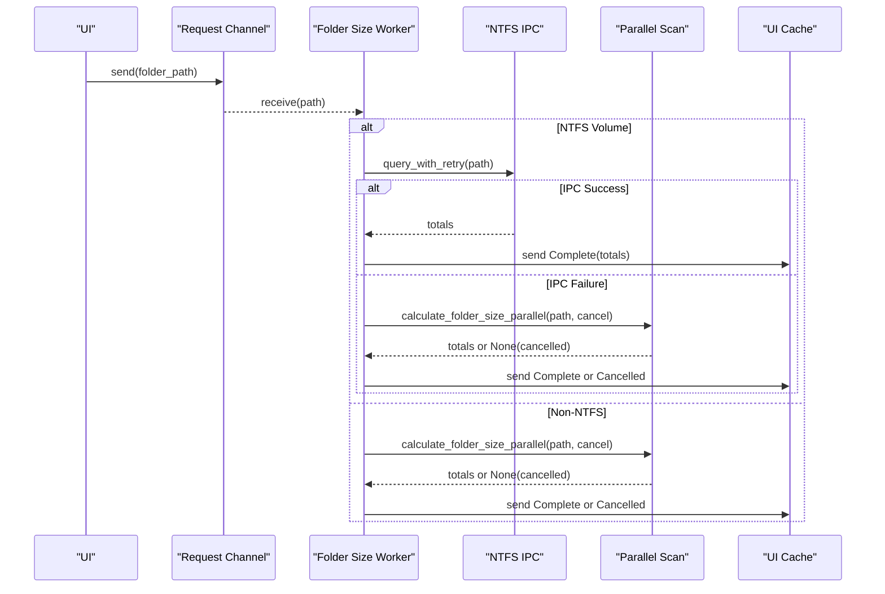
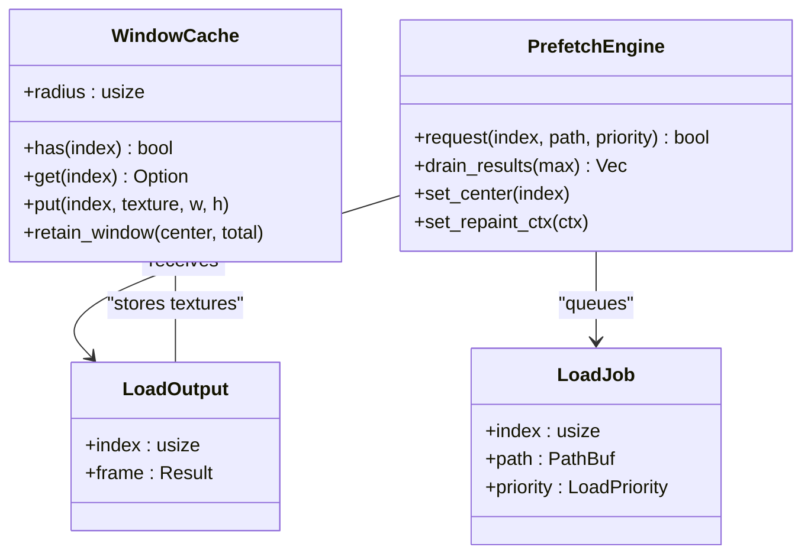
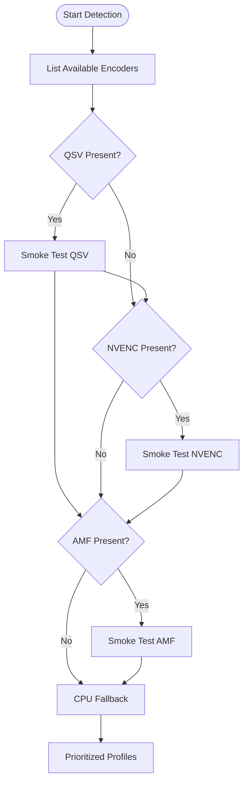
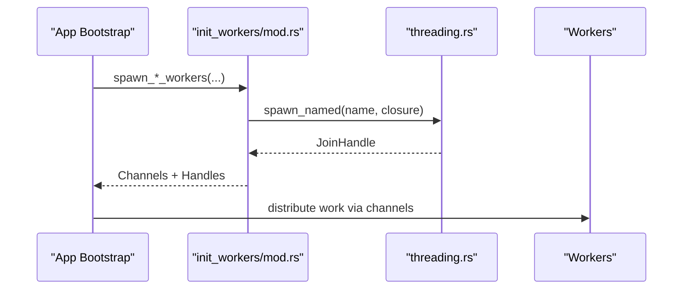
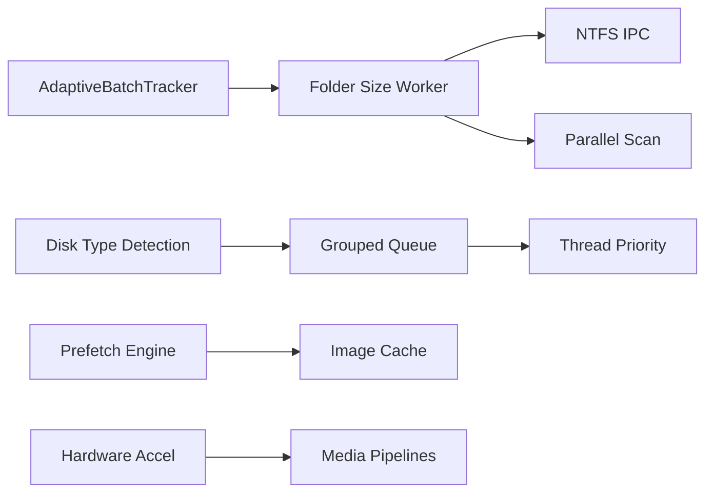

# Performance & Optimization

<cite>
**Referenced Files in This Document**
- [09_performance_optimizations.md](file://docs/09_performance_optimizations.md)
- [adaptive_batch.rs](file://src/infrastructure/adaptive_batch.rs)
- [threading.rs](file://src/infrastructure/threading.rs)
- [init_workers/mod.rs](file://src/app/init_workers/mod.rs)
- [io_priority/grouped_queue.rs](file://src/infrastructure/io_priority/grouped_queue.rs)
- [io_priority/threading.rs](file://src/infrastructure/io_priority/threading.rs)
- [io_priority/detection.rs](file://src/infrastructure/io_priority/detection.rs)
- [filesystem_workers.rs](file://src/app/init_workers/filesystem_workers.rs)
- [hardware_acceleration.rs](file://src/infrastructure/media/hardware_acceleration.rs)
- [cache.rs](file://src/image_viewer/cache.rs)
- [shell_ops_blocking.rs](file://benches/shell_ops_blocking.rs)
- [image_viewer_decode.rs](file://benches/image_viewer_decode.rs)
</cite>

## Table of Contents
1. [Introduction](#introduction)
2. [Project Structure](#project-structure)
3. [Core Components](#core-components)
4. [Architecture Overview](#architecture-overview)
5. [Detailed Component Analysis](#detailed-component-analysis)
6. [Dependency Analysis](#dependency-analysis)
7. [Performance Considerations](#performance-considerations)
8. [Troubleshooting Guide](#troubleshooting-guide)
9. [Conclusion](#conclusion)
10. [Appendices](#appendices)

## Introduction
This document explains MTT File Manager’s performance optimization strategies across multi-threading, I/O scheduling, adaptive batching, memory management, GPU acceleration, and benchmarking. It synthesizes the documented approaches and highlights the mechanisms that keep UI responsiveness, reduce disk contention, and accelerate heavy workloads like folder scanning and image decoding.

## Project Structure
The performance-critical parts of the codebase are organized around:
- Infrastructure modules for I/O priority, adaptive batching, and threading primitives
- Application worker initialization for background tasks
- Media and hardware acceleration for transcoding
- Image viewer cache and prefetch engine for GPU-centric decoding
- Benchmarks for measuring blocking shell operations and image decode performance

**Diagram sources**
- [adaptive_batch.rs:1-105](file://src/infrastructure/adaptive_batch.rs#L1-L105)
- [io_priority/detection.rs:1-198](file://src/infrastructure/io_priority/detection.rs#L1-L198)
- [io_priority/grouped_queue.rs:1-140](file://src/infrastructure/io_priority/grouped_queue.rs#L1-L140)
- [io_priority/threading.rs:1-56](file://src/infrastructure/io_priority/threading.rs#L1-L56)
- [threading.rs:1-33](file://src/infrastructure/threading.rs#L1-L33)
- [init_workers/mod.rs:1-23](file://src/app/init_workers/mod.rs#L1-L23)
- [filesystem_workers.rs:1-623](file://src/app/init_workers/filesystem_workers.rs#L1-L623)
- [hardware_acceleration.rs:1-430](file://src/infrastructure/media/hardware_acceleration.rs#L1-L430)
- [cache.rs:1-307](file://src/image_viewer/cache.rs#L1-L307)
- [shell_ops_blocking.rs:1-39](file://benches/shell_ops_blocking.rs#L1-L39)
- [image_viewer_decode.rs:1-89](file://benches/image_viewer_decode.rs#L1-L89)

**Section sources**
- [09_performance_optimizations.md:1-181](file://docs/09_performance_optimizations.md#L1-L181)
- [init_workers/mod.rs:1-23](file://src/app/init_workers/mod.rs#L1-L23)

## Core Components
- Adaptive batch sizing adjusts workload granularity based on SSD/HDD and recent timings to maintain target latency per batch.
- I/O priority management sets thread priority and groups requests by directory to reduce HDD head movement.
- Multi-threaded folder size computation uses a hybrid IPC + parallel fallback with cancellation and epoch-based invalidation.
- Image viewer employs a GPU-centric sliding-window cache and a prefetch engine with urgent/high/normal queues.
- Hardware acceleration validates and selects optimal transcode backends (QSV, NVENC, AMF) with a safe ffmpeg resolver.
- Benchmarks quantify blocking shell operations and image decode performance.

**Section sources**
- [adaptive_batch.rs:1-105](file://src/infrastructure/adaptive_batch.rs#L1-L105)
- [io_priority/grouped_queue.rs:1-140](file://src/infrastructure/io_priority/grouped_queue.rs#L1-L140)
- [io_priority/threading.rs:1-56](file://src/infrastructure/io_priority/threading.rs#L1-L56)
- [filesystem_workers.rs:259-435](file://src/app/init_workers/filesystem_workers.rs#L259-L435)
- [cache.rs:1-307](file://src/image_viewer/cache.rs#L1-L307)
- [hardware_acceleration.rs:1-430](file://src/infrastructure/media/hardware_acceleration.rs#L1-L430)
- [shell_ops_blocking.rs:1-39](file://benches/shell_ops_blocking.rs#L1-L39)
- [image_viewer_decode.rs:1-89](file://benches/image_viewer_decode.rs#L1-L89)

## Architecture Overview
The system separates interactive, prefetch, and background workloads, with I/O locality and priority guiding thread scheduling. Worker threads communicate via channels and crossbeam, while UI remains responsive through bounded queues and cancellation tokens.

**Diagram sources**
- [filesystem_workers.rs:259-435](file://src/app/init_workers/filesystem_workers.rs#L259-L435)
- [cache.rs:108-307](file://src/image_viewer/cache.rs#L108-L307)
- [io_priority/grouped_queue.rs:1-140](file://src/infrastructure/io_priority/grouped_queue.rs#L1-L140)
- [io_priority/threading.rs:1-56](file://src/infrastructure/io_priority/threading.rs#L1-L56)

## Detailed Component Analysis

### Adaptive Batch Processing
Adaptive batching balances responsiveness and throughput:
- Initial batch size adapts to SSD/HDD and total item count.
- Tracks recent batches to estimate time-per-item and dynamically adjust the next batch size.
- Maintains a fixed window of recent samples and clamps to configured bounds.

**Diagram sources**
- [adaptive_batch.rs:28-81](file://src/infrastructure/adaptive_batch.rs#L28-L81)

**Section sources**
- [adaptive_batch.rs:1-105](file://src/infrastructure/adaptive_batch.rs#L1-L105)

### I/O Priority Management and Request Grouping
I/O scheduling reduces disk contention and improves HDD locality:
- Disk type detection caches SSD/HDD decisions and respects manual overrides.
- A grouped queue orders requests by directory to minimize head movement on HDDs.
- Thread priority is raised for interactive workloads and lowered for background tasks.

**Diagram sources**
- [io_priority/grouped_queue.rs:46-101](file://src/infrastructure/io_priority/grouped_queue.rs#L46-L101)
- [io_priority/threading.rs:10-38](file://src/infrastructure/io_priority/threading.rs#L10-L38)
- [io_priority/detection.rs:52-70](file://src/infrastructure/io_priority/detection.rs#L52-L70)

**Section sources**
- [io_priority/detection.rs:1-198](file://src/infrastructure/io_priority/detection.rs#L1-L198)
- [io_priority/grouped_queue.rs:1-140](file://src/infrastructure/io_priority/grouped_queue.rs#L1-L140)
- [io_priority/threading.rs:1-56](file://src/infrastructure/io_priority/threading.rs#L1-L56)

### Multi-threaded Folder Size Workers
The folder size subsystem provides both single-folder and list-view batch processing:
- Single-folder worker supports cancellation and progress reporting, with NTFS IPC fallback and Windows API parallel scan.
- Batch worker uses generation counters and epochs to discard stale requests and integrates with adaptive batching.

**Diagram sources**
- [filesystem_workers.rs:259-435](file://src/app/init_workers/filesystem_workers.rs#L259-L435)
- [filesystem_workers.rs:444-581](file://src/app/init_workers/filesystem_workers.rs#L444-L581)

**Section sources**
- [filesystem_workers.rs:1-623](file://src/app/init_workers/filesystem_workers.rs#L1-L623)

### Image Viewer GPU-Centric Cache and Prefetch
The image viewer minimizes CPU memory pressure and VRAM churn:
- Sliding-window cache stores GPU TextureHandle objects with original resolution metadata.
- Prefetch engine routes urgent, high, and background jobs to separate channels, with a center index to skip irrelevant work.
- Workers wake on urgent notifications to avoid UI deadlocks and reduce latency.

**Diagram sources**
- [cache.rs:46-106](file://src/image_viewer/cache.rs#L46-L106)
- [cache.rs:108-307](file://src/image_viewer/cache.rs#L108-L307)

**Section sources**
- [cache.rs:1-307](file://src/image_viewer/cache.rs#L1-L307)

### Hardware Acceleration Backends
Hardware acceleration validates and selects the fastest available transcode backend:
- Detects encoders present in the bundled ffmpeg binary.
- Performs smoke tests per backend to ensure runtime viability.
- Builds consistent argument lists per backend and provides prioritized profiles.

**Diagram sources**
- [hardware_acceleration.rs:38-295](file://src/infrastructure/media/hardware_acceleration.rs#L38-L295)

**Section sources**
- [hardware_acceleration.rs:1-430](file://src/infrastructure/media/hardware_acceleration.rs#L1-L430)

### Threading Primitives and Worker Initialization
- Named thread spawning with panic catching ensures robust worker lifecycles.
- Worker modules expose spawn functions for disk cache invalidation, folder previews, folder size workers, and prefetching.

**Diagram sources**
- [init_workers/mod.rs:1-23](file://src/app/init_workers/mod.rs#L1-L23)
- [threading.rs:1-33](file://src/infrastructure/threading.rs#L1-L33)

**Section sources**
- [init_workers/mod.rs:1-23](file://src/app/init_workers/mod.rs#L1-L23)
- [threading.rs:1-33](file://src/infrastructure/threading.rs#L1-L33)

## Dependency Analysis
Key dependencies and interactions:
- Adaptive batching informs batch worker sizing and fallback scan pacing.
- I/O priority detection and grouping feed into worker thread scheduling and disk locality.
- Folder size workers depend on NTFS IPC availability and fall back to parallel scanning.
- Image viewer cache depends on GPU texture handles and prefetch engine coordination.
- Hardware acceleration is decoupled and used by media pipelines.

**Diagram sources**
- [adaptive_batch.rs:34-81](file://src/infrastructure/adaptive_batch.rs#L34-L81)
- [io_priority/detection.rs:52-70](file://src/infrastructure/io_priority/detection.rs#L52-L70)
- [io_priority/grouped_queue.rs:46-101](file://src/infrastructure/io_priority/grouped_queue.rs#L46-L101)
- [io_priority/threading.rs:10-38](file://src/infrastructure/io_priority/threading.rs#L10-L38)
- [filesystem_workers.rs:259-435](file://src/app/init_workers/filesystem_workers.rs#L259-L435)
- [cache.rs:108-307](file://src/image_viewer/cache.rs#L108-L307)
- [hardware_acceleration.rs:258-295](file://src/infrastructure/media/hardware_acceleration.rs#L258-L295)

**Section sources**
- [filesystem_workers.rs:1-623](file://src/app/init_workers/filesystem_workers.rs#L1-L623)
- [cache.rs:1-307](file://src/image_viewer/cache.rs#L1-L307)
- [hardware_acceleration.rs:1-430](file://src/infrastructure/media/hardware_acceleration.rs#L1-L430)

## Performance Considerations
- Keep UI responsive by bounding queues, using epochs/cancellations, and deferring non-essential work.
- Prefer SSD-aware defaults and HDD locality optimizations for I/O-bound tasks.
- Use GPU textures for image caching to reduce CPU memory pressure and leverage OS memory management.
- Validate hardware backends at startup and fall back gracefully to maintain throughput.
- Instrument and benchmark critical paths (folder size, image decode, shell operations) to guide further tuning.

[No sources needed since this section provides general guidance]

## Troubleshooting Guide
Common issues and remedies:
- Stale folder size values after navigation: ensure batch generation and epoch invalidation are applied to reject outdated results.
- Excessive UI stalls during batch operations: verify adaptive batch size and worker priority adjustments.
- GPU memory spikes: confirm WindowCache retention window and texture eviction on center changes.
- Transcoding failures: check ffmpeg resolver and smoke-test outcomes for selected backend.
- Blocking shell operations: use benchmarks to measure and avoid blocking calls in UI thread.

**Section sources**
- [filesystem_workers.rs:444-581](file://src/app/init_workers/filesystem_workers.rs#L444-L581)
- [cache.rs:95-105](file://src/image_viewer/cache.rs#L95-L105)
- [hardware_acceleration.rs:223-248](file://src/infrastructure/media/hardware_acceleration.rs#L223-L248)
- [shell_ops_blocking.rs:1-39](file://benches/shell_ops_blocking.rs#L1-L39)

## Conclusion
MTT File Manager achieves high performance through a combination of SSD-aware adaptive batching, I/O locality and priority management, GPU-centric caching, validated hardware acceleration, and targeted benchmarking. These strategies collectively reduce UI stalls, disk contention, and memory pressure while maintaining throughput across diverse storage and hardware configurations.

[No sources needed since this section summarizes without analyzing specific files]

## Appendices

### Benchmarking Suite and Measurement Tools
- Shell copy blocking benchmark demonstrates the cost of synchronous shell operations.
- Image viewer decode benchmark measures full and preview decodes across a curated set of images.

**Section sources**
- [shell_ops_blocking.rs:1-39](file://benches/shell_ops_blocking.rs#L1-L39)
- [image_viewer_decode.rs:1-89](file://benches/image_viewer_decode.rs#L1-L89)