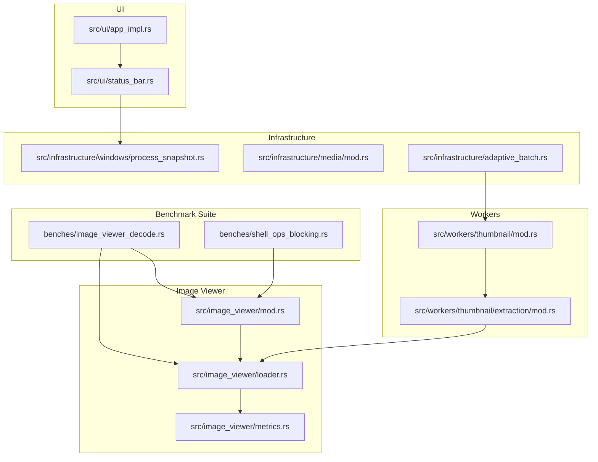
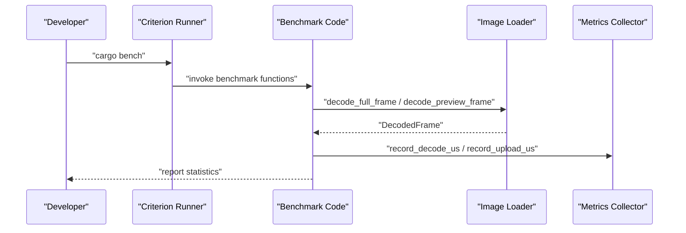
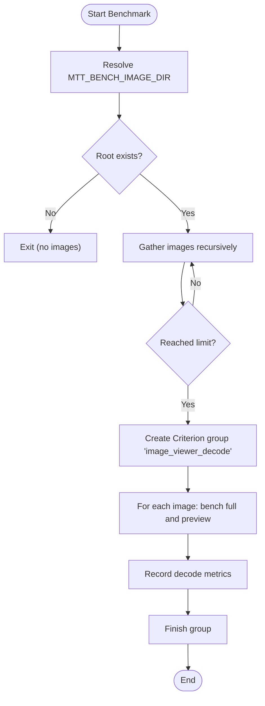
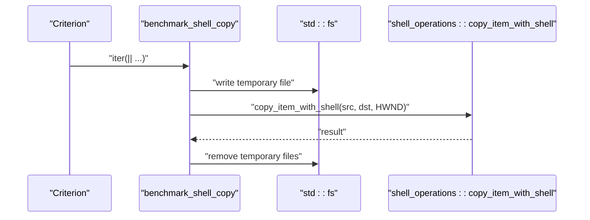
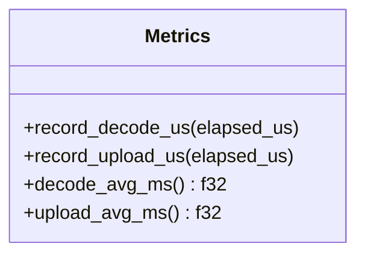
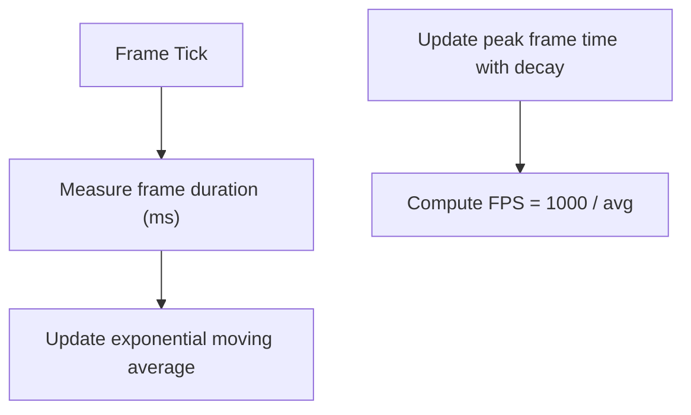
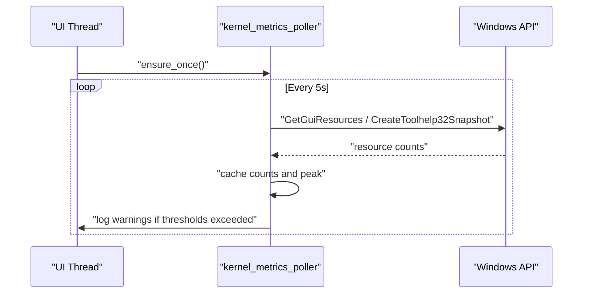
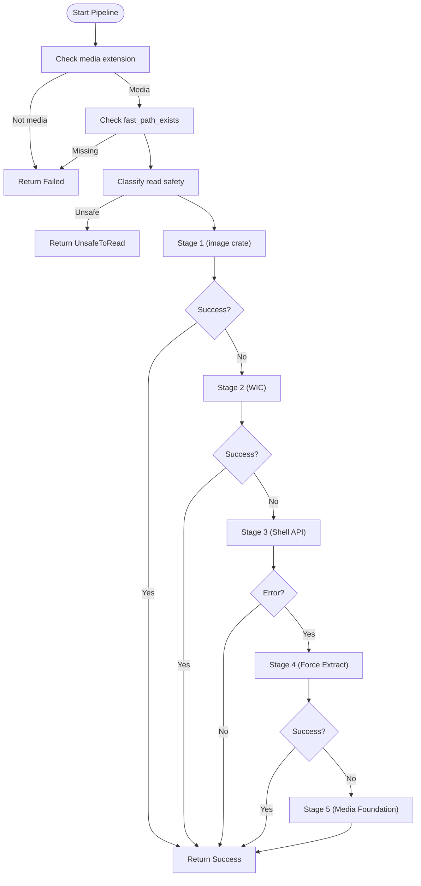
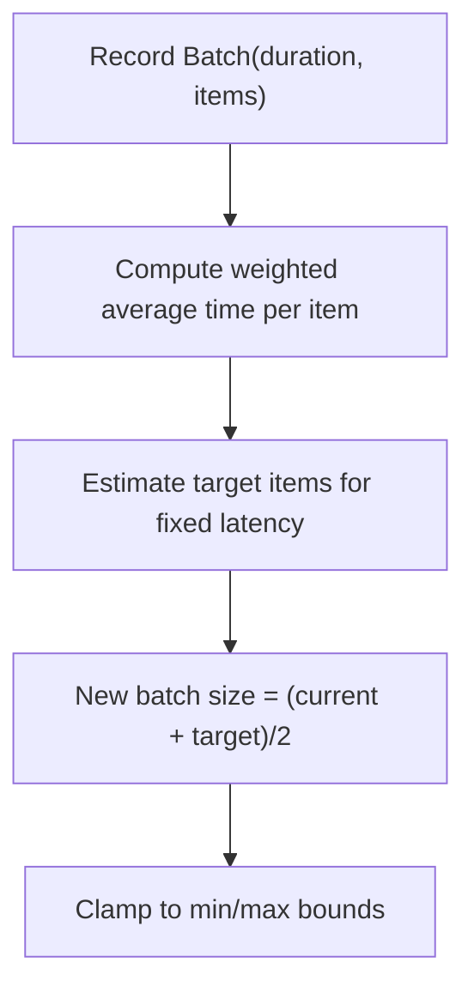
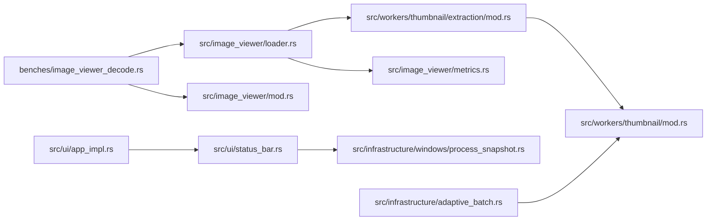

# Profiling & Benchmarking Tools

<cite>
**Referenced Files in This Document**
- [image_viewer_decode.rs](file://benches/image_viewer_decode.rs)
- [shell_ops_blocking.rs](file://benches/shell_ops_blocking.rs)
- [metrics.rs](file://src/image_viewer/metrics.rs)
- [mod.rs](file://src/image_viewer/mod.rs)
- [loader.rs](file://src/image_viewer/loader.rs)
- [app_impl.rs](file://src/ui/app_impl.rs)
- [status_bar.rs](file://src/ui/status_bar.rs)
- [process_snapshot.rs](file://src/infrastructure/windows/process_snapshot.rs)
- [mod.rs](file://src/infrastructure/media/mod.rs)
- [08_logging_errors_telemetry.md](file://docs/08_logging_errors_telemetry.md)
- [mod.rs](file://src/workers/thumbnail/mod.rs)
- [extraction_mod.rs](file://src/workers/thumbnail/extraction/mod.rs)
- [adaptive_batch.rs](file://src/infrastructure/adaptive_batch.rs)
</cite>

## Table of Contents
1. [Introduction](#introduction)
2. [Project Structure](#project-structure)
3. [Core Components](#core-components)
4. [Architecture Overview](#architecture-overview)
5. [Detailed Component Analysis](#detailed-component-analysis)
6. [Dependency Analysis](#dependency-analysis)
7. [Performance Considerations](#performance-considerations)
8. [Troubleshooting Guide](#troubleshooting-guide)
9. [Conclusion](#conclusion)
10. [Appendices](#appendices)

## Introduction
This document describes the performance profiling and benchmarking tools in MTT File Manager. It covers:
- The benchmark suite for image viewer decode performance and shell operations blocking measurements
- Metrics collection for thumbnail generation times, folder loading performance, and UI responsiveness
- Profiling techniques for identifying bottlenecks in the thumbnail pipeline, directory reading operations, and GPU rendering
- Performance monitoring integration with Windows kernel resource metrics and custom telemetry
- Guidance for developers on adding new benchmarks, interpreting performance data, and optimizing critical paths

## Project Structure
The performance-related components are organized across:
- Benchmarks: Criterion-based suites for image decoding and shell blocking behavior
- Image viewer: Decode pipelines, caching, and benchmark entry points
- Thumbnail worker: Multi-stage extraction pipeline and failure/backoff caches
- UI: Frame timing and FPS averaging for responsiveness
- Windows kernel metrics: Background polling of GDI/User/Handle/Thread counts
- Logging and telemetry: Tagged categories and diagnostic scripts

**Diagram sources**
- [image_viewer_decode.rs:1-89](file://benches/image_viewer_decode.rs#L1-L89)
- [shell_ops_blocking.rs:1-39](file://benches/shell_ops_blocking.rs#L1-L39)
- [mod.rs:1-332](file://src/image_viewer/mod.rs#L1-L332)
- [loader.rs:1-630](file://src/image_viewer/loader.rs#L1-L630)
- [metrics.rs:1-43](file://src/image_viewer/metrics.rs#L1-L43)
- [app_impl.rs:53-83](file://src/ui/app_impl.rs#L53-L83)
- [status_bar.rs:1-200](file://src/ui/status_bar.rs#L1-L200)
- [process_snapshot.rs:1-44](file://src/infrastructure/windows/process_snapshot.rs#L1-L44)
- [adaptive_batch.rs:44-88](file://src/infrastructure/adaptive_batch.rs#L44-L88)
- [mod.rs:1-148](file://src/workers/thumbnail/mod.rs#L1-L148)
- [extraction_mod.rs:1-168](file://src/workers/thumbnail/extraction/mod.rs#L1-L168)

**Section sources**
- [image_viewer_decode.rs:1-89](file://benches/image_viewer_decode.rs#L1-L89)
- [shell_ops_blocking.rs:1-39](file://benches/shell_ops_blocking.rs#L1-L39)
- [mod.rs:1-332](file://src/image_viewer/mod.rs#L1-L332)
- [loader.rs:1-630](file://src/image_viewer/loader.rs#L1-L630)
- [metrics.rs:1-43](file://src/image_viewer/metrics.rs#L1-L43)
- [app_impl.rs:53-83](file://src/ui/app_impl.rs#L53-L83)
- [status_bar.rs:1-200](file://src/ui/status_bar.rs#L1-L200)
- [process_snapshot.rs:1-44](file://src/infrastructure/windows/process_snapshot.rs#L1-L44)
- [adaptive_batch.rs:44-88](file://src/infrastructure/adaptive_batch.rs#L44-L88)
- [mod.rs:1-148](file://src/workers/thumbnail/mod.rs#L1-L148)
- [extraction_mod.rs:1-168](file://src/workers/thumbnail/extraction/mod.rs#L1-L168)

## Core Components
- Benchmark suite
  - Image viewer decode benchmark: discovers images under a configured directory and benchmarks full and preview decodes via dedicated entry points.
  - Shell operations blocking benchmark: measures Windows Shell copy latency to demonstrate blocking behavior.
- Metrics collection
  - Image viewer metrics: atomic counters for decode and upload durations.
  - UI frame timing: moving averages and peak frame time with FPS calculation.
  - Windows kernel metrics: background polling of GDI/User/Handle/Thread counts with thresholds and escalation logic.
- Thumbnail pipeline
  - Multi-stage hybrid extraction (image crate, WIC, Shell API, force extract, Media Foundation) with safety checks and failure/backoff caches.
- Adaptive batching
  - Dynamic batch sizing based on recent throughput to balance IO and responsiveness.

**Section sources**
- [image_viewer_decode.rs:40-84](file://benches/image_viewer_decode.rs#L40-L84)
- [shell_ops_blocking.rs:11-34](file://benches/shell_ops_blocking.rs#L11-L34)
- [metrics.rs:3-41](file://src/image_viewer/metrics.rs#L3-L41)
- [app_impl.rs:53-83](file://src/ui/app_impl.rs#L53-L83)
- [status_bar.rs:132-200](file://src/ui/status_bar.rs#L132-L200)
- [mod.rs:37-147](file://src/workers/thumbnail/mod.rs#L37-L147)
- [extraction_mod.rs:28-167](file://src/workers/thumbnail/extraction/mod.rs#L28-L167)
- [adaptive_batch.rs:49-80](file://src/infrastructure/adaptive_batch.rs#L49-L80)

## Architecture Overview
The performance architecture integrates Criterion benchmarks, internal metrics, and Windows kernel monitoring to provide end-to-end observability.

**Diagram sources**
- [image_viewer_decode.rs:63-81](file://benches/image_viewer_decode.rs#L63-L81)
- [mod.rs:320-331](file://src/image_viewer/mod.rs#L320-L331)
- [loader.rs:195-249](file://src/image_viewer/loader.rs#L195-L249)
- [metrics.rs:12-20](file://src/image_viewer/metrics.rs#L12-L20)

## Detailed Component Analysis

### Image Viewer Decode Benchmark
- Discovers images under a configurable directory and filters by supported extensions (excluding SVG).
- Benchmarks two decode modes:
  - Full decode: returns width, height, and RGBA byte length.
  - Preview decode: resizes to a maximum side and returns similar metrics.
- Environment-driven dataset selection and per-image labeling for detailed reporting.

**Diagram sources**
- [image_viewer_decode.rs:4-84](file://benches/image_viewer_decode.rs#L4-L84)

**Section sources**
- [image_viewer_decode.rs:40-84](file://benches/image_viewer_decode.rs#L40-L84)
- [mod.rs:320-331](file://src/image_viewer/mod.rs#L320-L331)

### Shell Operations Blocking Benchmark
- Demonstrates blocking behavior of Windows Shell copy operations.
- Creates a temporary file, measures the duration of the blocking call, and cleans up afterward.
- Requires Windows platform.

**Diagram sources**
- [shell_ops_blocking.rs:11-34](file://benches/shell_ops_blocking.rs#L11-L34)

**Section sources**
- [shell_ops_blocking.rs:11-34](file://benches/shell_ops_blocking.rs#L11-L34)

### Metrics Collection: Image Viewer
- Atomic counters track decode and upload counts and total microseconds.
- Provides average decode/upload durations in milliseconds for reporting.

**Diagram sources**
- [metrics.rs:3-41](file://src/image_viewer/metrics.rs#L3-L41)

**Section sources**
- [metrics.rs:3-41](file://src/image_viewer/metrics.rs#L3-L41)

### UI Responsiveness: Frame Timing and FPS
- Maintains exponentially weighted moving averages for frame time and FPS.
- Tracks a peak frame time with adaptive decay to reflect transient spikes and restore bursts.
- Integrates with UI rendering to inform throttling and upload budgets.

**Diagram sources**
- [app_impl.rs:53-83](file://src/ui/app_impl.rs#L53-L83)

**Section sources**
- [app_impl.rs:53-83](file://src/ui/app_impl.rs#L53-L83)

### Windows Kernel Resource Monitoring
- Background thread polls GDI/User/Handle/Thread counts periodically.
- Computes baseline thresholds from CPU count and emits warnings when counts exceed thresholds.
- Escalates warnings for sustained thread spikes and suppresses false positives during video preview.

**Diagram sources**
- [status_bar.rs:132-200](file://src/ui/status_bar.rs#L132-L200)
- [process_snapshot.rs:26-43](file://src/infrastructure/windows/process_snapshot.rs#L26-L43)

**Section sources**
- [status_bar.rs:1-200](file://src/ui/status_bar.rs#L1-L200)
- [process_snapshot.rs:1-44](file://src/infrastructure/windows/process_snapshot.rs#L1-L44)

### Thumbnail Pipeline Bottleneck Profiling
- Multi-stage hybrid extraction pipeline:
  - Stage 1: image crate (fast path)
  - Stage 2: WIC (robust fallback)
  - Stage 3: Shell API (universal)
  - Stage 4: Force extraction via IThumbnailCache
  - Stage 5: Media Foundation (video frame extraction)
- Safety checks: skips non-media files, pending deletions, and unsafe reads; logs outcomes per stage.
- Failure/backoff caches prevent repeated attempts on failing paths and temporarily blocked files.

**Diagram sources**
- [extraction_mod.rs:28-167](file://src/workers/thumbnail/extraction/mod.rs#L28-L167)
- [mod.rs:37-147](file://src/workers/thumbnail/mod.rs#L37-L147)

**Section sources**
- [extraction_mod.rs:28-167](file://src/workers/thumbnail/extraction/mod.rs#L28-L167)
- [mod.rs:37-147](file://src/workers/thumbnail/mod.rs#L37-L147)

### GPU Rendering and Hardware Acceleration
- The media module exposes hardware acceleration detection for GPU-backed operations.
- Combined with image viewer decode paths and UI frame timing, this enables profiling GPU-bound workloads.

**Section sources**
- [mod.rs:1-2](file://src/infrastructure/media/mod.rs#L1-L2)

### Folder Loading Performance and Adaptive Batching
- Adaptive batching adjusts batch size based on recent throughput samples to maintain target latency.
- Helps tune directory scanning and thumbnail generation throughput without overloading the system.

**Diagram sources**
- [adaptive_batch.rs:49-80](file://src/infrastructure/adaptive_batch.rs#L49-L80)

**Section sources**
- [adaptive_batch.rs:49-80](file://src/infrastructure/adaptive_batch.rs#L49-L80)

## Dependency Analysis
Key dependencies and relationships:
- Benchmark code depends on image viewer loader entry points for decode measurements.
- Image viewer loader optionally uses WIC and thumbnail extraction stages for robustness.
- UI frame timing depends on rendering cadence and interacts with adaptive throttling.
- Kernel metrics polling is decoupled from UI via background thread and atomic caches.
- Thumbnail worker failure/backoff caches coordinate across workers to avoid redundant work.

**Diagram sources**
- [image_viewer_decode.rs:63-81](file://benches/image_viewer_decode.rs#L63-L81)
- [loader.rs:408-464](file://src/image_viewer/loader.rs#L408-L464)
- [extraction_mod.rs:38-47](file://src/workers/thumbnail/extraction/mod.rs#L38-L47)
- [mod.rs:17-24](file://src/workers/thumbnail/mod.rs#L17-L24)
- [app_impl.rs:53-83](file://src/ui/app_impl.rs#L53-L83)
- [status_bar.rs:132-200](file://src/ui/status_bar.rs#L132-L200)
- [process_snapshot.rs:26-43](file://src/infrastructure/windows/process_snapshot.rs#L26-L43)
- [metrics.rs:12-20](file://src/image_viewer/metrics.rs#L12-L20)
- [adaptive_batch.rs:49-80](file://src/infrastructure/adaptive_batch.rs#L49-L80)

**Section sources**
- [image_viewer_decode.rs:63-81](file://benches/image_viewer_decode.rs#L63-L81)
- [loader.rs:408-464](file://src/image_viewer/loader.rs#L408-L464)
- [extraction_mod.rs:38-47](file://src/workers/thumbnail/extraction/mod.rs#L38-L47)
- [mod.rs:17-24](file://src/workers/thumbnail/mod.rs#L17-L24)
- [app_impl.rs:53-83](file://src/ui/app_impl.rs#L53-L83)
- [status_bar.rs:132-200](file://src/ui/status_bar.rs#L132-L200)
- [process_snapshot.rs:26-43](file://src/infrastructure/windows/process_snapshot.rs#L26-L43)
- [metrics.rs:12-20](file://src/image_viewer/metrics.rs#L12-L20)
- [adaptive_batch.rs:49-80](file://src/infrastructure/adaptive_batch.rs#L49-L80)

## Performance Considerations
- Prefer Criterion’s statistical reporting for decode benchmarks; ensure datasets are representative and environment variables are set for reproducible runs.
- Use Windows kernel metrics to detect thread pool growth and potential leaks; interpret warnings with context (e.g., video preview activity).
- Monitor UI frame timing to identify stalls; adjust adaptive throttling and batch sizes accordingly.
- For thumbnail generation, profile each stage to identify slow paths (e.g., Media Foundation) and leverage earlier stages or caches.
- Keep GPU-bound workloads within hardware acceleration capabilities; validate with hardware detection routines.

[No sources needed since this section provides general guidance]

## Troubleshooting Guide
- Capturing logs and telemetry
  - Use diagnostic scripts to capture categorized logs and filter by performance tags.
  - Enable stack traces for panics to aid root cause analysis.
- Interpreting kernel metrics warnings
  - Baseline thresholds are derived from CPU count; sustained thread counts above critical thresholds indicate potential leaks or excessive worker creation.
  - Warnings are suppressed during video preview to avoid false positives.
- Thumbnail extraction issues
  - Inspect stage-specific logs and failure/backoff caches to avoid repeated attempts on problematic files.
  - Verify media extension checks and read safety classifications.

**Section sources**
- [08_logging_errors_telemetry.md:80-114](file://docs/08_logging_errors_telemetry.md#L80-L114)
- [08_logging_errors_telemetry.md:164-172](file://docs/08_logging_errors_telemetry.md#L164-L172)
- [status_bar.rs:161-198](file://src/ui/status_bar.rs#L161-L198)
- [mod.rs:70-117](file://src/workers/thumbnail/mod.rs#L70-L117)

## Conclusion
MTT File Manager provides a comprehensive performance profiling and benchmarking framework:
- Criterion-based benchmarks for image decode and shell blocking behavior
- Internal metrics for decode and upload times
- UI frame timing and FPS tracking
- Windows kernel resource monitoring for thread and handle leak detection
- A multi-stage thumbnail pipeline with failure/backoff caches and adaptive batching

These tools enable developers to identify bottlenecks, validate optimizations, and maintain responsiveness across UI, IO, and GPU workloads.

[No sources needed since this section summarizes without analyzing specific files]

## Appendices

### Adding a New Benchmark
- Create a new Criterion benchmark module under benches/.
- Use environment variables to configure datasets and paths.
- Wrap the target function with Criterion’s bencher to measure wall-clock time.
- Record metrics via the existing metrics collector when applicable.

**Section sources**
- [image_viewer_decode.rs:40-84](file://benches/image_viewer_decode.rs#L40-L84)
- [shell_ops_blocking.rs:11-34](file://benches/shell_ops_blocking.rs#L11-L34)

### Interpreting Performance Data
- Decode benchmarks: compare full vs preview decode times; investigate outliers by file type and size.
- UI responsiveness: monitor FPS and peak frame time; adjust adaptive batching and rendering budgets.
- Kernel metrics: watch for sustained thread count increases; correlate with heavy worker activity.

**Section sources**
- [metrics.rs:22-40](file://src/image_viewer/metrics.rs#L22-L40)
- [app_impl.rs:53-83](file://src/ui/app_impl.rs#L53-L83)
- [status_bar.rs:161-198](file://src/ui/status_bar.rs#L161-L198)

### Optimizing Critical Paths
- Thumbnail pipeline: prioritize fast paths (image crate, WIC), leverage caches, and avoid unnecessary stages.
- Directory reading: tune adaptive batch sizes and IO priorities; minimize blocking calls.
- GPU rendering: validate hardware acceleration and reduce overdraw; profile decode and upload sequences.

**Section sources**
- [extraction_mod.rs:28-167](file://src/workers/thumbnail/extraction/mod.rs#L28-L167)
- [adaptive_batch.rs:49-80](file://src/infrastructure/adaptive_batch.rs#L49-L80)
- [loader.rs:408-464](file://src/image_viewer/loader.rs#L408-L464)