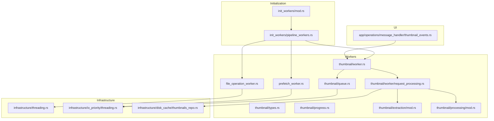
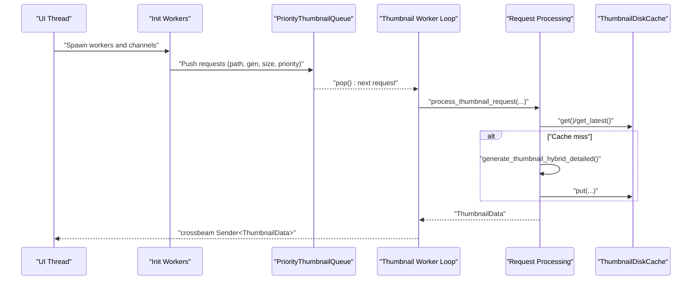
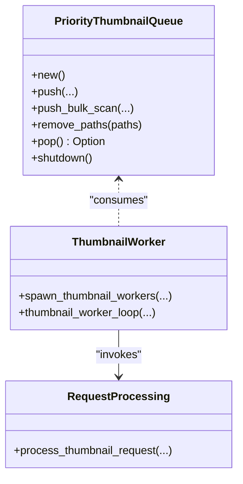
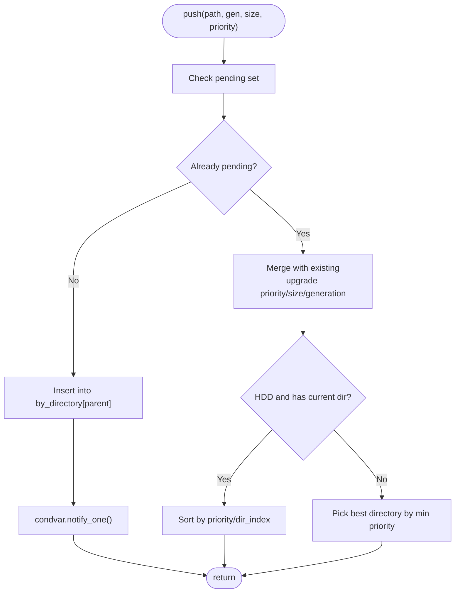
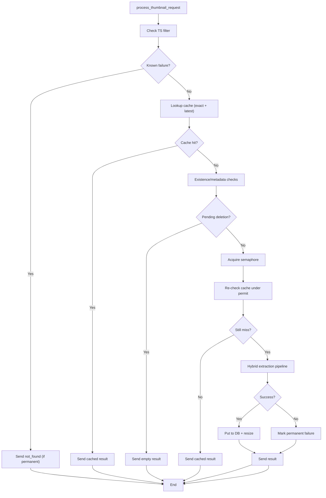
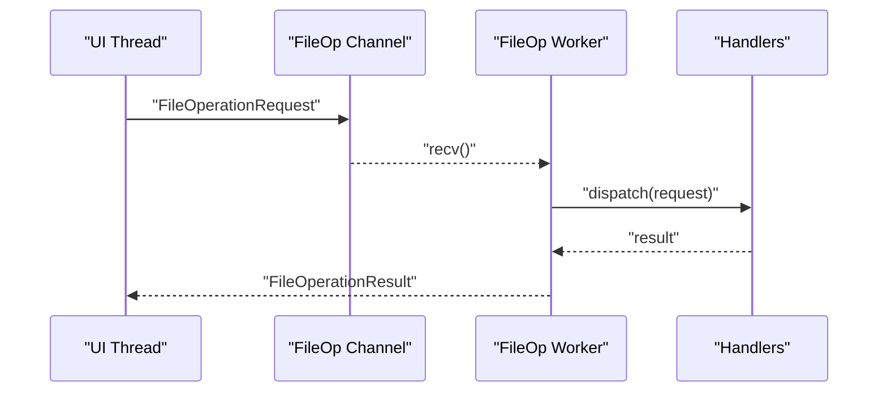
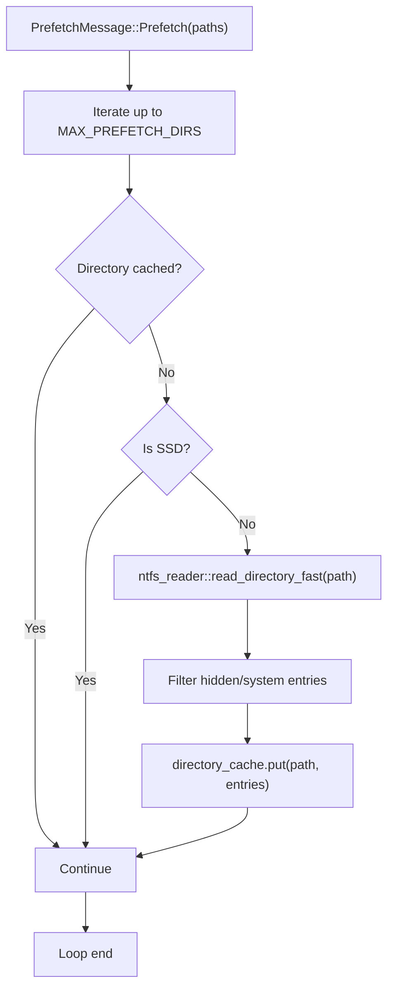
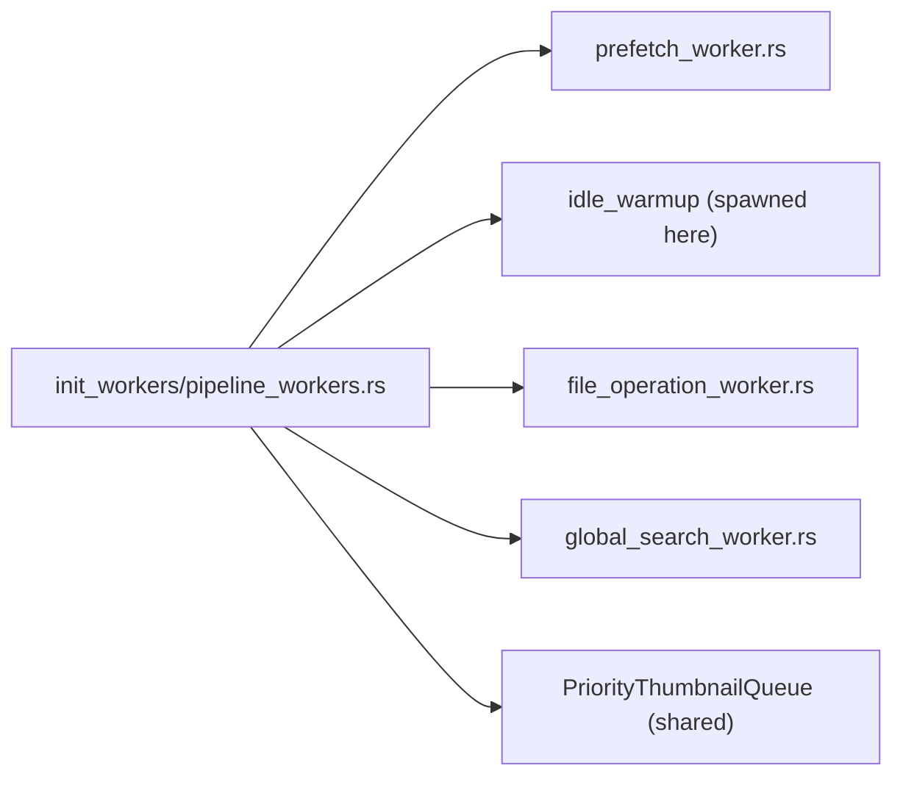
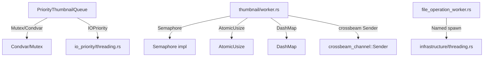

# Threading & Parallelism

<cite>
**Referenced Files in This Document**
- [src/workers/mod.rs](file://src/workers/mod.rs)
- [src/workers/thumbnail/worker.rs](file://src/workers/thumbnail/worker.rs)
- [src/workers/thumbnail/queue.rs](file://src/workers/thumbnail/queue.rs)
- [src/workers/thumbnail/types.rs](file://src/workers/thumbnail/types.rs)
- [src/workers/thumbnail/progress.rs](file://src/workers/thumbnail/progress.rs)
- [src/workers/thumbnail/extraction/mod.rs](file://src/workers/thumbnail/extraction/mod.rs)
- [src/workers/thumbnail/processing/mod.rs](file://src/workers/thumbnail/processing/mod.rs)
- [src/workers/thumbnail/worker/request_processing.rs](file://src/workers/thumbnail/worker/request_processing.rs)
- [src/workers/file_operation_worker.rs](file://src/workers/file_operation_worker.rs)
- [src/workers/prefetch_worker.rs](file://src/workers/prefetch_worker.rs)
- [src/app/init_workers/mod.rs](file://src/app/init_workers/mod.rs)
- [src/app/init_workers/pipeline_workers.rs](file://src/app/init_workers/pipeline_workers.rs)
- [src/app/operations/message_handler/thumbnail_events.rs](file://src/app/operations/message_handler/thumbnail_events.rs)
- [src/infrastructure/threading.rs](file://src/infrastructure/threading.rs)
- [src/infrastructure/io_priority/threading.rs](file://src/infrastructure/io_priority/threading.rs)
- [src/infrastructure/disk_cache/thumbnails_repo.rs](file://src/infrastructure/disk_cache/thumbnails_repo.rs)
</cite>

## Table of Contents
1. [Introduction](#introduction)
2. [Project Structure](#project-structure)
3. [Core Components](#core-components)
4. [Architecture Overview](#architecture-overview)
5. [Detailed Component Analysis](#detailed-component-analysis)
6. [Dependency Analysis](#dependency-analysis)
7. [Performance Considerations](#performance-considerations)
8. [Troubleshooting Guide](#troubleshooting-guide)
9. [Conclusion](#conclusion)

## Introduction
This document explains the threading and parallelism system in MTT File Manager. It focuses on the rayon-inspired worker pool pattern implemented with native threads, crossbeam channels for coordination, and lock-free or minimally contended synchronization primitives. The system orchestrates concurrent file operations, thumbnail generation, and metadata extraction while maintaining responsiveness, throughput, and safety across heterogeneous workloads and devices (HDD/SSD/virtual drives).

## Project Structure
The threading model is centered around:
- Worker modules under src/workers for specialized tasks
- Initialization routines under src/app/init_workers that spawn and wire workers
- Infrastructure modules for IO priority and thread spawning utilities
- UI integration that consumes results from workers

**Diagram sources**
- [src/app/init_workers/mod.rs:1-23](file://src/app/init_workers/mod.rs#L1-L23)
- [src/app/init_workers/pipeline_workers.rs:1-69](file://src/app/init_workers/pipeline_workers.rs#L1-L69)
- [src/workers/thumbnail/worker.rs:1-338](file://src/workers/thumbnail/worker.rs#L1-L338)
- [src/workers/thumbnail/queue.rs:1-559](file://src/workers/thumbnail/queue.rs#L1-L559)
- [src/workers/thumbnail/types.rs:1-33](file://src/workers/thumbnail/types.rs#L1-L33)
- [src/workers/thumbnail/progress.rs:1-44](file://src/workers/thumbnail/progress.rs#L1-L44)
- [src/workers/thumbnail/extraction/mod.rs:1-168](file://src/workers/thumbnail/extraction/mod.rs#L1-L168)
- [src/workers/thumbnail/processing/mod.rs:1-10](file://src/workers/thumbnail/processing/mod.rs#L1-L10)
- [src/workers/thumbnail/worker/request_processing.rs:1-418](file://src/workers/thumbnail/worker/request_processing.rs#L1-L418)
- [src/workers/file_operation_worker.rs:1-353](file://src/workers/file_operation_worker.rs#L1-L353)
- [src/workers/prefetch_worker.rs:1-72](file://src/workers/prefetch_worker.rs#L1-L72)
- [src/infrastructure/threading.rs:1-33](file://src/infrastructure/threading.rs#L1-L33)
- [src/infrastructure/io_priority/threading.rs:1-56](file://src/infrastructure/io_priority/threading.rs#L1-L56)
- [src/infrastructure/disk_cache/thumbnails_repo.rs:1-176](file://src/infrastructure/disk_cache/thumbnails_repo.rs#L1-L176)
- [src/app/operations/message_handler/thumbnail_events.rs:1-151](file://src/app/operations/message_handler/thumbnail_events.rs#L1-L151)

**Section sources**
- [src/workers/mod.rs:1-9](file://src/workers/mod.rs#L1-L9)
- [src/app/init_workers/mod.rs:1-23](file://src/app/init_workers/mod.rs#L1-L23)

## Core Components
- Thumbnail worker pool with bounded concurrency and per-device locality
- Priority-aware queue with directory grouping for HDD optimization
- Crossbeam channel-based result propagation to the UI
- Dedicated workers for file operations and prefetching
- IO priority control and thread lifecycle management

Key implementation anchors:
- Worker spawning and concurrency limits: [src/workers/thumbnail/worker.rs:103-169](file://src/workers/thumbnail/worker.rs#L103-L169)
- Work queue with deduplication and locality: [src/workers/thumbnail/queue.rs:40-482](file://src/workers/thumbnail/queue.rs#L40-L482)
- Request processing with cache-first strategy and staged extraction: [src/workers/thumbnail/worker/request_processing.rs:52-333](file://src/workers/thumbnail/worker/request_processing.rs#L52-L333)
- File operation worker with COM STA and panic isolation: [src/workers/file_operation_worker.rs:226-328](file://src/workers/file_operation_worker.rs#L226-L328)
- Prefetch worker with background priority and SSD gating: [src/workers/prefetch_worker.rs:17-71](file://src/workers/prefetch_worker.rs#L17-L71)
- Initialization wiring: [src/app/init_workers/pipeline_workers.rs:13-68](file://src/app/init_workers/pipeline_workers.rs#L13-L68)

**Section sources**
- [src/workers/thumbnail/worker.rs:103-169](file://src/workers/thumbnail/worker.rs#L103-L169)
- [src/workers/thumbnail/queue.rs:40-482](file://src/workers/thumbnail/queue.rs#L40-L482)
- [src/workers/thumbnail/worker/request_processing.rs:52-333](file://src/workers/thumbnail/worker/request_processing.rs#L52-L333)
- [src/workers/file_operation_worker.rs:226-328](file://src/workers/file_operation_worker.rs#L226-L328)
- [src/workers/prefetch_worker.rs:17-71](file://src/workers/prefetch_worker.rs#L17-L71)
- [src/app/init_workers/pipeline_workers.rs:13-68](file://src/app/init_workers/pipeline_workers.rs#L13-L68)

## Architecture Overview
The system uses a worker pool pattern with:
- A priority queue feeding specialized workers
- Lock-free or condition-variable-backed coordination
- Atomic counters and mutex-protected state for progress and cancellation
- Crossbeam channels for asynchronous result delivery

**Diagram sources**
- [src/app/init_workers/pipeline_workers.rs:13-33](file://src/app/init_workers/pipeline_workers.rs#L13-L33)
- [src/workers/thumbnail/queue.rs:311-340](file://src/workers/thumbnail/queue.rs#L311-L340)
- [src/workers/thumbnail/worker.rs:192-289](file://src/workers/thumbnail/worker.rs#L192-L289)
- [src/workers/thumbnail/worker/request_processing.rs:52-333](file://src/workers/thumbnail/worker/request_processing.rs#L52-L333)
- [src/infrastructure/disk_cache/thumbnails_repo.rs:18-85](file://src/infrastructure/disk_cache/thumbnails_repo.rs#L18-L85)

## Detailed Component Analysis

### Thumbnail Worker Pool
- Concurrency tuning:
  - Worker count clamped to a small range based on CPU parallelism
  - Decode semaphore limits concurrent decoding to cap memory spikes
  - Special semaphore for virtual drives to avoid overload
- Lifecycle:
  - Initializes COM and Media Foundation per-thread
  - Sets background thread priority for non-interactive work
  - Graceful shutdown via queue shutdown flag and Condvar notify
- Request handling:
  - Generation-aware skipping of stale requests
  - Bulk-scan tracking with shared progress and atomic counters
  - Panic isolation with structured error propagation

**Diagram sources**
- [src/workers/thumbnail/queue.rs:29-52](file://src/workers/thumbnail/queue.rs#L29-L52)
- [src/workers/thumbnail/worker.rs:103-169](file://src/workers/thumbnail/worker.rs#L103-L169)
- [src/workers/thumbnail/worker/request_processing.rs:52-64](file://src/workers/thumbnail/worker/request_processing.rs#L52-L64)

**Section sources**
- [src/workers/thumbnail/worker.rs:103-169](file://src/workers/thumbnail/worker.rs#L103-L169)
- [src/workers/thumbnail/worker.rs:192-289](file://src/workers/thumbnail/worker.rs#L192-L289)
- [src/workers/thumbnail/queue.rs:54-60](file://src/workers/thumbnail/queue.rs#L54-L60)

### Priority Queue and Locality Optimization
- Groups requests by parent directory to reduce HDD seeks
- Deduplicates and merges pending requests with priority upgrades
- Tracks per-drive SSD/HDD classification and adjusts ordering
- Supports bulk-scan mode and selective removal of stale paths

**Diagram sources**
- [src/workers/thumbnail/queue.rs:118-178](file://src/workers/thumbnail/queue.rs#L118-L178)
- [src/workers/thumbnail/queue.rs:343-481](file://src/workers/thumbnail/queue.rs#L343-L481)

**Section sources**
- [src/workers/thumbnail/queue.rs:118-178](file://src/workers/thumbnail/queue.rs#L118-L178)
- [src/workers/thumbnail/queue.rs:343-481](file://src/workers/thumbnail/queue.rs#L343-L481)

### Request Processing Pipeline
- Cache-first strategy:
  - Exact match by modified time, then latest entry fallback
  - Decoding under semaphore to avoid thundering herd on decode-heavy batches
- Safety checks:
  - OneDrive timeout-protected existence and metadata
  - Pending-deletion short-circuit
  - MPEG-TS filter to avoid misclassified files
- Staged extraction:
  - Image crate, WIC, Shell API, force extraction, Media Foundation
- Result throttling:
  - Interactive vs background repaint throttling
  - Non-interactive results may be dropped under saturation to protect UI latency

**Diagram sources**
- [src/workers/thumbnail/worker/request_processing.rs:52-333](file://src/workers/thumbnail/worker/request_processing.rs#L52-L333)
- [src/workers/thumbnail/extraction/mod.rs:38-167](file://src/workers/thumbnail/extraction/mod.rs#L38-L167)
- [src/infrastructure/disk_cache/thumbnails_repo.rs:87-174](file://src/infrastructure/disk_cache/thumbnails_repo.rs#L87-L174)

**Section sources**
- [src/workers/thumbnail/worker/request_processing.rs:52-333](file://src/workers/thumbnail/worker/request_processing.rs#L52-L333)
- [src/workers/thumbnail/extraction/mod.rs:38-167](file://src/workers/thumbnail/extraction/mod.rs#L38-L167)
- [src/infrastructure/disk_cache/thumbnails_repo.rs:18-85](file://src/infrastructure/disk_cache/thumbnails_repo.rs#L18-L85)

### File Operation Worker (COM STA)
- Dedicated worker thread with Single-Threaded Apartment initialization
- Receives typed requests and dispatches to handlers
- Panic isolation and structured result propagation
- Extraction progress and cancel flag coordination

**Diagram sources**
- [src/workers/file_operation_worker.rs:226-328](file://src/workers/file_operation_worker.rs#L226-L328)

**Section sources**
- [src/workers/file_operation_worker.rs:226-328](file://src/workers/file_operation_worker.rs#L226-L328)

### Prefetch Worker
- Background priority for non-interactive work
- Reads directory entries for HDDs, filters hidden/system entries
- Caches entries in DirectoryCache for later UI rendering
- Limits concurrent directories and respects SSD gating

**Diagram sources**
- [src/workers/prefetch_worker.rs:17-71](file://src/workers/prefetch_worker.rs#L17-L71)

**Section sources**
- [src/workers/prefetch_worker.rs:17-71](file://src/workers/prefetch_worker.rs#L17-L71)

### Initialization and Wiring
- Spawns prefetch and idle warmup workers
- Spawns file operation worker with paired channels
- Spawns global search worker
- Thumbnail queue is shared across workers

**Diagram sources**
- [src/app/init_workers/pipeline_workers.rs:13-68](file://src/app/init_workers/pipeline_workers.rs#L13-L68)

**Section sources**
- [src/app/init_workers/pipeline_workers.rs:13-68](file://src/app/init_workers/pipeline_workers.rs#L13-L68)

## Dependency Analysis
- Coordination primitives:
  - Mutex + Condvar in PriorityThumbnailQueue for blocking wait/notify
  - AtomicUsize for generation tracking and bulk-completion counting
  - DashMap for pending deletions
  - crossbeam channel for non-blocking result delivery
- IO priority:
  - Thread-local background mode toggle and priority adjustments
- Threading utilities:
  - Named thread spawning with panic isolation and logging

**Diagram sources**
- [src/workers/thumbnail/queue.rs:29-52](file://src/workers/thumbnail/queue.rs#L29-L52)
- [src/infrastructure/io_priority/threading.rs:10-55](file://src/infrastructure/io_priority/threading.rs#L10-L55)
- [src/workers/thumbnail/worker.rs:29-77](file://src/workers/thumbnail/worker.rs#L29-L77)
- [src/workers/thumbnail/worker.rs:107-112](file://src/workers/thumbnail/worker.rs#L107-L112)
- [src/workers/file_operation_worker.rs:232-328](file://src/workers/file_operation_worker.rs#L232-L328)
- [src/infrastructure/threading.rs:1-33](file://src/infrastructure/threading.rs#L1-L33)

**Section sources**
- [src/workers/thumbnail/queue.rs:29-52](file://src/workers/thumbnail/queue.rs#L29-L52)
- [src/workers/thumbnail/worker.rs:29-77](file://src/workers/thumbnail/worker.rs#L29-L77)
- [src/workers/thumbnail/worker.rs:107-112](file://src/workers/thumbnail/worker.rs#L107-L112)
- [src/workers/file_operation_worker.rs:232-328](file://src/workers/file_operation_worker.rs#L232-L328)
- [src/infrastructure/threading.rs:1-33](file://src/infrastructure/threading.rs#L1-L33)

## Performance Considerations
- Concurrency bounds:
  - Worker count capped to a small range based on CPU parallelism
  - Decode semaphore prevents RAM spikes from simultaneous heavy decodes
- Device-aware scheduling:
  - HDD locality and priority-aware directory selection
  - SSD gating for prefetch to avoid unnecessary reads
- Backpressure and UI responsiveness:
  - Non-interactive results may be dropped under saturation
  - Adaptive repaint throttling per priority tier
- Disk cache:
  - Exact-match and latest-entry lookups minimize I/O
  - On-disk WebP encoding with dimension constraints reduces storage and bandwidth

[No sources needed since this section provides general guidance]

## Troubleshooting Guide
- Worker panics:
  - Named spawn wraps closures with panic catching and logs messages
  - Thumbnail worker isolates panics per request and continues
- OneDrive timeouts:
  - Existence and metadata calls use timeout-protected APIs
  - Transient failures are recorded and retried later
- Stale requests:
  - Generation-aware skipping prevents outdated work from overriding newer views
- Shutdown:
  - Queue shutdown sets a flag and notifies waiting workers
  - UI-side streaming timeout clears stuck loading states

**Section sources**
- [src/infrastructure/threading.rs:1-33](file://src/infrastructure/threading.rs#L1-L33)
- [src/workers/thumbnail/worker.rs:161-168](file://src/workers/thumbnail/worker.rs#L161-L168)
- [src/workers/thumbnail/worker.rs:272-281](file://src/workers/thumbnail/worker.rs#L272-L281)
- [src/workers/thumbnail/queue.rs:54-60](file://src/workers/thumbnail/queue.rs#L54-L60)
- [src/app/operations/message_handler/thumbnail_events.rs:16-24](file://src/app/operations/message_handler/thumbnail_events.rs#L16-L24)

## Conclusion
MTT File Manager’s threading model combines a practical worker pool with robust queueing, IO priority control, and resilient error handling. The design balances throughput and responsiveness by bounding concurrency, leveraging caches, and adapting to device characteristics. Crossbeam channels and atomic counters enable efficient coordination, while named thread spawning and panic isolation improve reliability and observability.