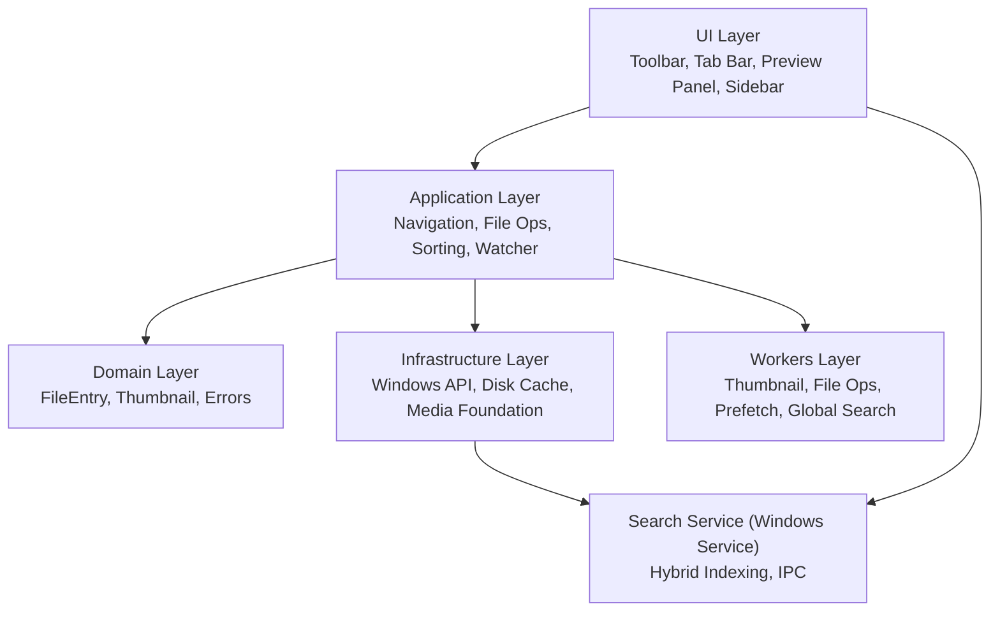
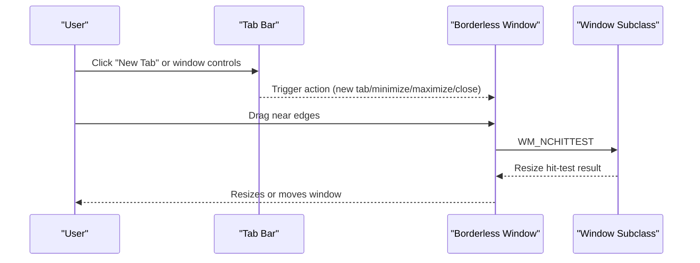
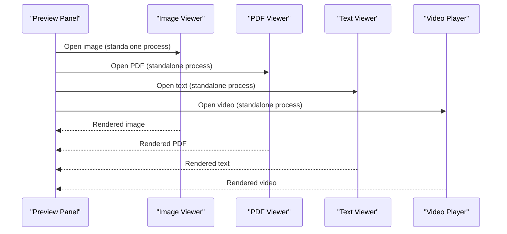
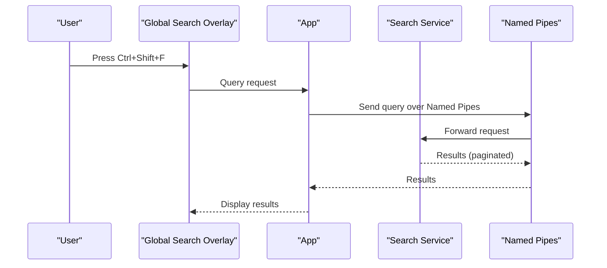

# Project Overview

<cite>
**Referenced Files in This Document**
- [README.md](file://README.md)
- [docs/01_overview.md](file://docs/01_overview.md)
- [docs/03_architecture.md](file://docs/03_architecture.md)
- [docs/05_dependencies_stack.md](file://docs/05_dependencies_stack.md)
- [docs/09_performance_optimizations.md](file://docs/09_performance_optimizations.md)
- [src/main.rs](file://src/main.rs)
- [src/infrastructure/windows/window_subclass.rs](file://src/infrastructure/windows/window_subclass.rs)
- [src/ui/tab_bar/mod.rs](file://src/ui/tab_bar/mod.rs)
- [src/ui/tab_bar/window_controls.rs](file://src/ui/tab_bar/window_controls.rs)
- [installer/setup.iss](file://installer/setup.iss)
- [installer/build_installer.ps1](file://installer/build_installer.ps1)
- [app.manifest](file://app.manifest)
- [Cargo.toml](file://Cargo.toml)
</cite>

## Table of Contents
1. [Introduction](#introduction)
2. [Project Structure](#project-structure)
3. [Core Components](#core-components)
4. [Architecture Overview](#architecture-overview)
5. [Detailed Component Analysis](#detailed-component-analysis)
6. [Dependency Analysis](#dependency-analysis)
7. [Performance Considerations](#performance-considerations)
8. [Troubleshooting Guide](#troubleshooting-guide)
9. [Conclusion](#conclusion)
10. [Appendices](#appendices)

## Introduction
MTT File Manager is a native Windows file manager built in Rust with a modern UI, advanced media preview, and deep Windows integration. It delivers fast tabbed navigation, rich media preview, and Spotlight-style global search powered by a dedicated background indexing service. The application targets users who want a performant, reliable, and visually modern file manager that feels at home on Windows while leveraging native APIs and modern rendering.

Key value propositions:
- Native Windows integration with deep Shell and COM usage
- Modern borderless UI with native resize/move support
- Instant global search backed by a hybrid indexing engine
- Integrated media preview with dedicated viewers for images, PDFs, text, and video
- High-performance rendering via WGPU with DPI-awareness and GPU selection
- Robust caching, async workers, and adaptive batching for responsiveness

## Project Structure
The project is a Cargo workspace with a main GUI crate, a shared IPC protocol crate, and a Windows service crate. The GUI uses eframe/egui for rendering and integrates with Windows APIs for file operations, metadata, and media.

```mermaid
graph TB
subgraph "Workspace"
A["mtt-file-manager (GUI)"]
B["mtt-search-protocol (IPC types)"]
C["mtt-search-service (Windows Service)"]
end
subgraph "GUI (Main App)"
D["UI Layer<br/>Toolbar, Tab Bar, Preview Panel, Sidebar"]
E["Application Layer<br/>Navigation, File Ops, Sorting, Watcher"]
F["Domain Layer<br/>FileEntry, Thumbnail, Errors"]
G["Infrastructure Layer<br/>Windows API, Disk Cache, Media Foundation"]
H["Workers Layer<br/>Thumbnail, File Ops, Prefetch, Global Search"]
end
subgraph "External Processes"
I["Image Viewer (Standalone)"]
J["PDF Viewer (Standalone)"]
K["Text Viewer (Standalone)"]
L["Search Service (Windows Service)"]
end
A --> D
A --> E
A --> F
A --> G
A --> H
A <- --> I
A <- --> J
A <- --> K
A <- --> L
A --> B
C --> B
```

**Diagram sources**
- [docs/03_architecture.md:3-21](file://docs/03_architecture.md#L3-L21)
- [docs/03_architecture.md:22-101](file://docs/03_architecture.md#L22-L101)

**Section sources**
- [docs/03_architecture.md:3-21](file://docs/03_architecture.md#L3-L21)
- [Cargo.toml:1-10](file://Cargo.toml#L1-L10)

## Core Components
- Custom borderless window with native resize/move support and window controls rendered in the tab bar
- Tabbed navigation with independent history per tab and integrated window controls
- Integrated media preview panel with image, PDF, text, and video support
- Global search overlay powered by a dedicated Windows Service with hybrid indexing
- File operations with native Shell integration, Recycle Bin, OneDrive status, and ISO mounting
- Multi-level caching (memory, disk, GPU) and async workers for responsiveness
- DPI-aware rendering and GPU backend selection for performance

**Section sources**
- [README.md:9-50](file://README.md#L9-L50)
- [docs/01_overview.md:11-60](file://docs/01_overview.md#L11-L60)
- [src/main.rs:230-277](file://src/main.rs#L230-L277)
- [src/infrastructure/windows/window_subclass.rs:217-268](file://src/infrastructure/windows/window_subclass.rs#L217-L268)
- [src/ui/tab_bar/mod.rs:48-145](file://src/ui/tab_bar/mod.rs#L48-L145)

## Architecture Overview
The application follows a layered architecture with clear separation between UI, application, domain, and infrastructure layers. The GUI is built with eframe/egui and communicates with Windows APIs for file operations and metadata. A dedicated Windows Service indexes files and serves search queries over Named Pipes.



**Diagram sources**
- [docs/03_architecture.md:22-101](file://docs/03_architecture.md#L22-L101)
- [docs/03_architecture.md:229-261](file://docs/03_architecture.md#L229-L261)

**Section sources**
- [docs/03_architecture.md:22-101](file://docs/03_architecture.md#L22-L101)

## Detailed Component Analysis

### Custom Borderless Window and Tabbed Navigation
- The main window is borderless with native resize/move support implemented via a window subclass that intercepts hit-testing to provide resize zones.
- Window controls (minimize, maximize, close) are rendered in the tab bar to match the borderless design.
- Tabs support independent history and integrated controls for a cohesive Explorer-like experience.



**Diagram sources**
- [src/infrastructure/windows/window_subclass.rs:217-268](file://src/infrastructure/windows/window_subclass.rs#L217-L268)
- [src/ui/tab_bar/window_controls.rs:1-48](file://src/ui/tab_bar/window_controls.rs#L1-L48)
- [src/ui/tab_bar/mod.rs:48-145](file://src/ui/tab_bar/mod.rs#L48-L145)

**Section sources**
- [src/infrastructure/windows/window_subclass.rs:217-268](file://src/infrastructure/windows/window_subclass.rs#L217-L268)
- [src/ui/tab_bar/mod.rs:48-145](file://src/ui/tab_bar/mod.rs#L48-L145)
- [src/ui/tab_bar/window_controls.rs:1-48](file://src/ui/tab_bar/window_controls.rs#L1-L48)

### Integrated Media Preview and Standalone Viewers
- The preview panel integrates image, PDF, text, and video previews without leaving the app.
- Standalone viewers (image, PDF, text) run as separate processes from the same executable, using a lightweight runtime and GPU texture caching for performance.



**Diagram sources**
- [docs/03_architecture.md:262-320](file://docs/03_architecture.md#L262-L320)
- [docs/03_architecture.md:286-296](file://docs/03_architecture.md#L286-L296)
- [docs/03_architecture.md:297-319](file://docs/03_architecture.md#L297-L319)
- [docs/03_architecture.md:310-320](file://docs/03_architecture.md#L310-L320)

**Section sources**
- [docs/03_architecture.md:262-320](file://docs/03_architecture.md#L262-L320)
- [docs/03_architecture.md:286-296](file://docs/03_architecture.md#L286-L296)
- [docs/03_architecture.md:297-319](file://docs/03_architecture.md#L297-L319)
- [docs/03_architecture.md:310-320](file://docs/03_architecture.md#L310-L320)

### Global Search and Hybrid Indexing
- The global search overlay is activated by a keyboard shortcut and queries a dedicated Windows Service.
- The service performs hybrid indexing: USN Journal for NTFS/ReFS and full-tree scans for non-USN volumes, with an in-memory SIMD matcher and paginated results.



**Diagram sources**
- [docs/01_overview.md:45-51](file://docs/01_overview.md#L45-L51)
- [docs/03_architecture.md:229-261](file://docs/03_architecture.md#L229-L261)

**Section sources**
- [docs/01_overview.md:45-51](file://docs/01_overview.md#L45-L51)
- [docs/03_architecture.md:229-261](file://docs/03_architecture.md#L229-L261)

### File Operations and Windows Integration
- Core operations include copy, cut, paste, rename, delete, with native Shell integration and Recycle Bin support.
- OneDrive status detection and ISO mounting are supported for cloud and virtual drive scenarios.

**Section sources**
- [README.md:37-43](file://README.md#L37-L43)
- [docs/01_overview.md:36-44](file://docs/01_overview.md#L36-L44)

## Dependency Analysis
Technology stack choices enable performance, reliability, and deep Windows integration:
- Rust (Edition 2021) for safety and performance
- eframe/egui for modern immediate-mode GUI with persistence and GPU backends
- wgpu/glow for high-performance rendering (WGPU in main window, Glow in viewers)
- windows-rs for safe Windows API bindings
- libmpv2 for video playback
- pdfium-render for native PDF rendering
- SQLite (rusqlite) for reliable persistence
- rayon for parallel processing
- crossbeam-channel for high-performance IPC
- windows-service for background indexing service
- rust-i18n for internationalization

Runtime dependencies:
- libmpv-2.dll for video playback
- pdfium.dll for PDF viewer
- Windows 10+ for native Windows API integration

**Section sources**
- [docs/05_dependencies_stack.md:1-219](file://docs/05_dependencies_stack.md#L1-L219)
- [README.md:51-67](file://README.md#L51-L67)
- [README.md:68-72](file://README.md#L68-L72)
- [Cargo.toml:67-109](file://Cargo.toml#L67-L109)

## Performance Considerations
Key optimizations for responsiveness and throughput:
- NtQueryDirectoryFile for fast directory enumeration with SSD/HDD detection
- Adaptive batch loading and UI virtualization for large directories
- Sliding-window GPU texture cache in standalone viewers
- I/O priority management for interactive vs background tasks
- DPI-aware rendering with Per-Monitor V2 awareness
- GPU backend selection and low-latency presentation
- Consistency probe for resilient filesystem monitoring

**Section sources**
- [docs/09_performance_optimizations.md:1-181](file://docs/09_performance_optimizations.md#L1-L181)
- [src/main.rs:156-170](file://src/main.rs#L156-L170)
- [app.manifest:10-17](file://app.manifest#L10-L17)

## Troubleshooting Guide
Common issues and resolutions:
- Missing runtime dependencies: Ensure libmpv-2.dll and pdfium.dll are present alongside the executable or in PATH.
- Video thumbnail failures: Install appropriate codecs (e.g., K-Lite Codec Pack) to enable Windows Shell and Media Foundation handlers.
- Installer warnings: The installer checks for Microsoft Visual C++ Redistributable (x64) and warns if missing.
- Service installation: The installer installs and starts the search service automatically; verify service status if search is unavailable.

**Section sources**
- [README.md:68-72](file://README.md#L68-L72)
- [README.md:238-262](file://README.md#L238-L262)
- [installer/setup.iss:91-116](file://installer/setup.iss#L91-L116)
- [installer/build_installer.ps1:114-134](file://installer/build_installer.ps1#L114-L134)

## Conclusion
MTT File Manager combines Rust’s performance and safety with a modern Windows-native UI and deep integration with Windows APIs. Its hybrid global search, integrated media preview, and robust performance optimizations deliver a fast, reliable, and visually pleasing file management experience on Windows.

## Appendices

### Target Audience
- Power users who need fast, reliable file management with advanced preview and search
- Users who prefer a modern, borderless UI with native Windows feel
- Professionals managing large collections of media and documents

### System Requirements
- Minimum: Windows 10 (Build 1903+) or Windows 11, x64, 2+ cores, 4 GB RAM, 100 MB disk space + cache, GPU/driver capable of initializing the main window’s WGPU backend
- Recommended: Windows 11 latest update, x64, 4+ cores, 8 GB+ RAM, SSD, dedicated GPU for video preview

**Section sources**
- [docs/01_overview.md:135-150](file://docs/01_overview.md#L135-L150)

### Installation Options and Supported Versions
- Build from source: cargo build --release --workspace
- Installer: Inno Setup 6-based installer that packages the app, search service, and required DLLs; installs and starts the search service automatically
- Supported Windows versions: Windows 10 and Windows 11 (as declared in the manifest and installer)

**Section sources**
- [README.md:73-86](file://README.md#L73-L86)
- [installer/setup.iss:39-42](file://installer/setup.iss#L39-L42)
- [app.manifest:35-42](file://app.manifest#L35-L42)

### High-Level Feature Comparison
- Traditional file managers: Basic UI, limited preview, simple search
- MTT File Manager: Modern borderless UI, integrated media preview, hybrid global search, DPI-aware rendering, GPU acceleration, robust caching, and Windows-native operations

**Section sources**
- [README.md:9-50](file://README.md#L9-L50)
- [docs/01_overview.md:11-60](file://docs/01_overview.md#L11-L60)