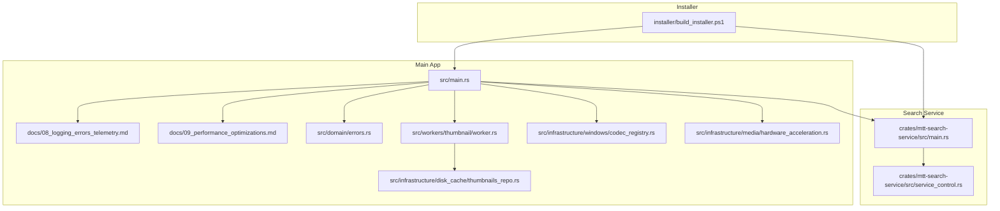
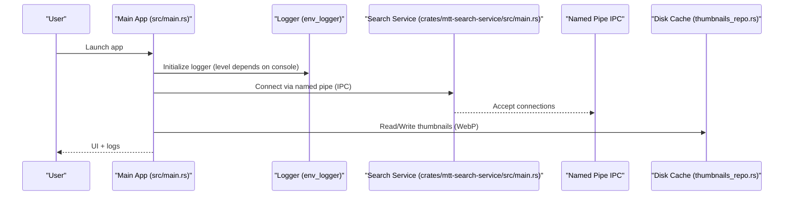
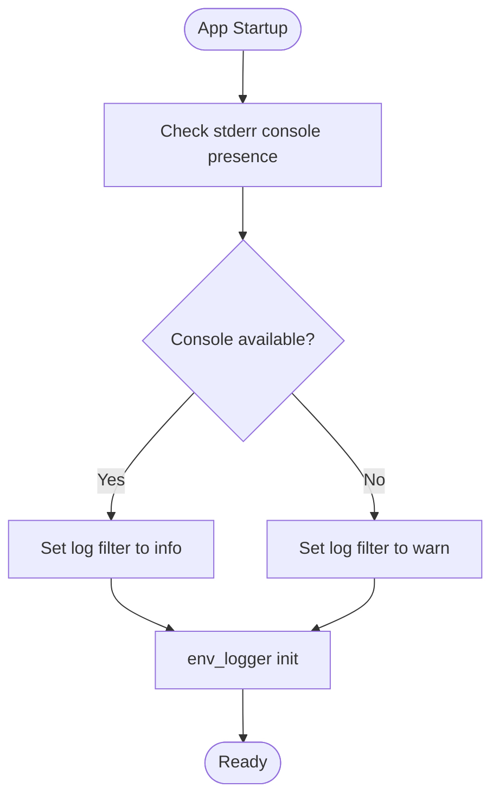
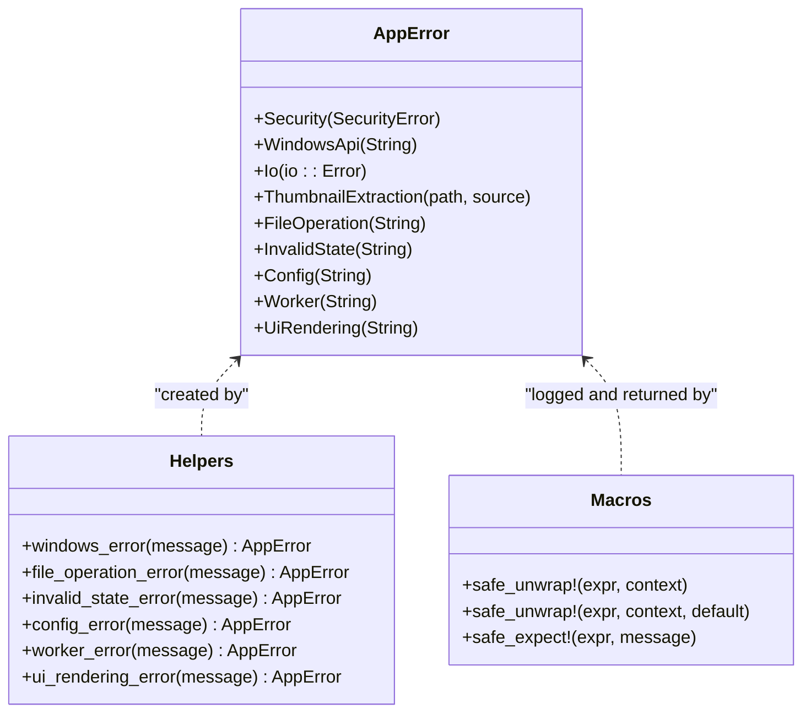
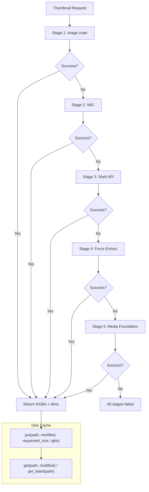
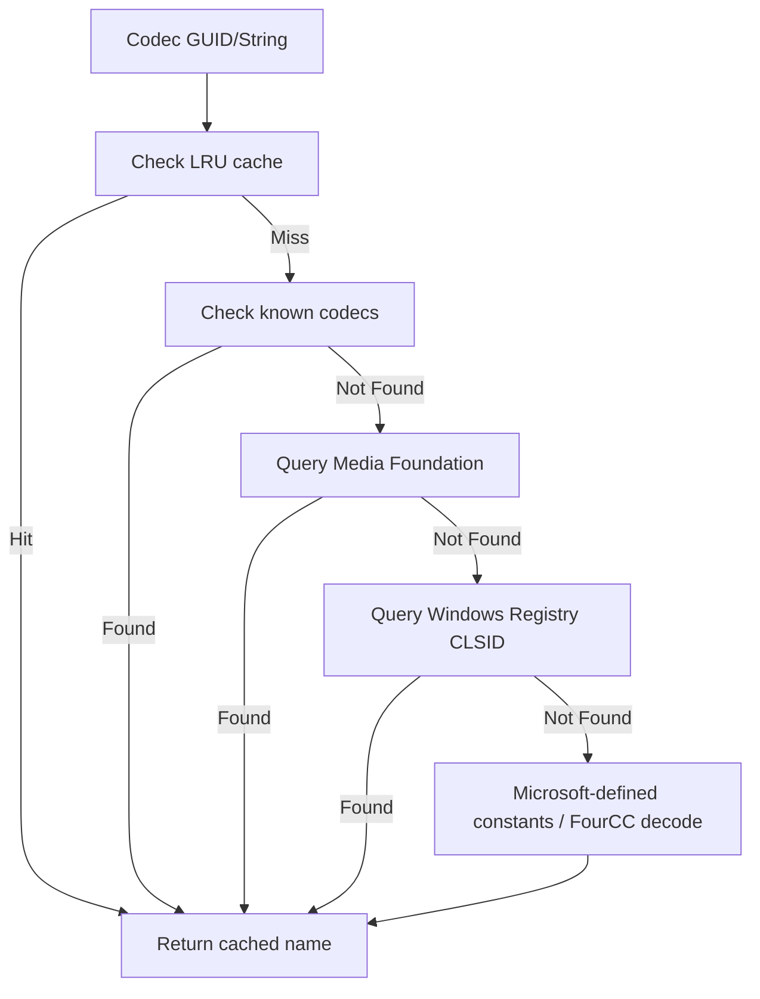
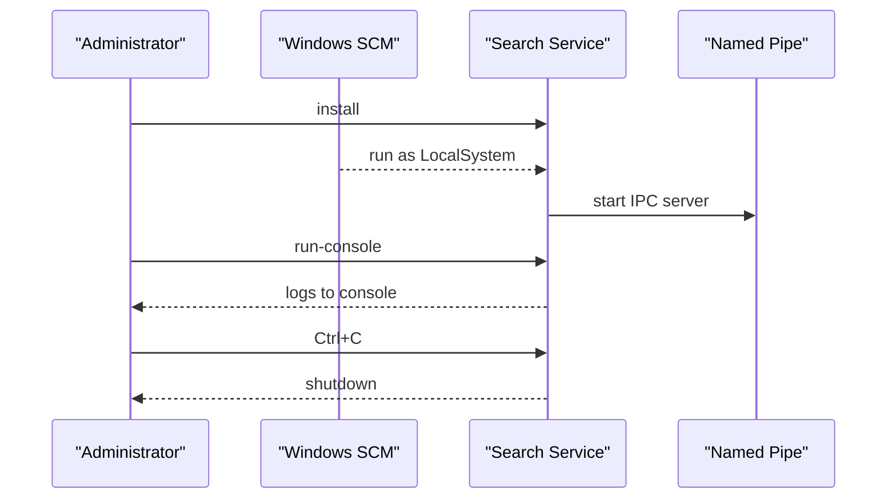
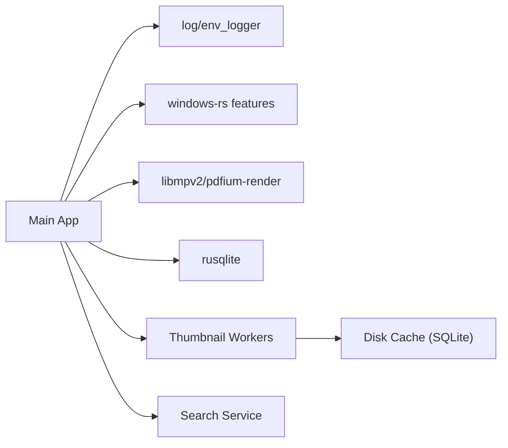

# Troubleshooting & Diagnostics

<cite>
**Referenced Files in This Document**
- [README.md](file://README.md)
- [Cargo.toml](file://Cargo.toml)
- [src/main.rs](file://src/main.rs)
- [docs/08_logging_errors_telemetry.md](file://docs/08_logging_errors_telemetry.md)
- [docs/09_performance_optimizations.md](file://docs/09_performance_optimizations.md)
- [open_diagnostic_console.cmd](file://open_diagnostic_console.cmd)
- [run_with_logs.ps1](file://run_with_logs.ps1)
- [installer/build_installer.ps1](file://installer/build_installer.ps1)
- [crates/mtt-search-service/src/main.rs](file://crates/mtt-search-service/src/main.rs)
- [crates/mtt-search-service/src/service_control.rs](file://crates/mtt-search-service/src/service_control.rs)
- [src/domain/errors.rs](file://src/domain/errors.rs)
- [src/infrastructure/windows/codec_registry.rs](file://src/infrastructure/windows/codec_registry.rs)
- [src/workers/thumbnail/worker.rs](file://src/workers/thumbnail/worker.rs)
- [src/infrastructure/disk_cache/thumbnails_repo.rs](file://src/infrastructure/disk_cache/thumbnails_repo.rs)
- [src/infrastructure/media/hardware_acceleration.rs](file://src/infrastructure/media/hardware_acceleration.rs)
</cite>

## Table of Contents
1. [Introduction](#introduction)
2. [Project Structure](#project-structure)
3. [Core Components](#core-components)
4. [Architecture Overview](#architecture-overview)
5. [Detailed Component Analysis](#detailed-component-analysis)
6. [Dependency Analysis](#dependency-analysis)
7. [Performance Considerations](#performance-considerations)
8. [Troubleshooting Guide](#troubleshooting-guide)
9. [Conclusion](#conclusion)
10. [Appendices](#appendices)

## Introduction
This document provides comprehensive troubleshooting and diagnostics guidance for MTT File Manager. It covers installation and runtime issues, logging and diagnostics, performance problems (slow search, thumbnail failures, memory usage), Windows-specific concerns (permissions, codec requirements, service installation), and practical step-by-step procedures to diagnose and resolve issues. It also includes escalation paths for complex problems.

## Project Structure
MTT File Manager consists of:
- Main application (Rust eframe app) with UI, workers, and infrastructure
- A dedicated background search service (Windows Service) for indexing and global search
- Installer and packaging scripts for Windows deployment
- Extensive documentation on logging, telemetry, and performance

**Diagram sources**
- [src/main.rs:106-305](file://src/main.rs#L106-L305)
- [docs/08_logging_errors_telemetry.md:1-224](file://docs/08_logging_errors_telemetry.md#L1-L224)
- [docs/09_performance_optimizations.md:1-181](file://docs/09_performance_optimizations.md#L1-L181)
- [src/domain/errors.rs:1-180](file://src/domain/errors.rs#L1-L180)
- [src/workers/thumbnail/worker.rs:103-169](file://src/workers/thumbnail/worker.rs#L103-L169)
- [src/infrastructure/disk_cache/thumbnails_repo.rs:7-175](file://src/infrastructure/disk_cache/thumbnails_repo.rs#L7-L175)
- [src/infrastructure/windows/codec_registry.rs:27-35](file://src/infrastructure/windows/codec_registry.rs#L27-L35)
- [src/infrastructure/media/hardware_acceleration.rs:31-84](file://src/infrastructure/media/hardware_acceleration.rs#L31-L84)
- [crates/mtt-search-service/src/main.rs:112-156](file://crates/mtt-search-service/src/main.rs#L112-L156)
- [crates/mtt-search-service/src/service_control.rs:33-107](file://crates/mtt-search-service/src/service_control.rs#L33-L107)
- [installer/build_installer.ps1:1-143](file://installer/build_installer.ps1#L1-L143)

**Section sources**
- [README.md:1-287](file://README.md#L1-L287)
- [Cargo.toml:1-137](file://Cargo.toml#L1-L137)

## Core Components
- Logging and diagnostics: structured log categories, filtering, and capture scripts
- Error model: centralized AppError with helpers and macros
- Thumbnail pipeline: multi-stage extraction with concurrency limits and safety
- Disk cache: SQLite-backed thumbnail storage with WebP compression
- Windows codec registry: dynamic codec name resolution for video thumbnails
- Search service: Windows Service with IPC, USN indexing, and console mode
- Installer: validation of required files, DLL integrity checks, and Inno Setup packaging

**Section sources**
- [docs/08_logging_errors_telemetry.md:1-224](file://docs/08_logging_errors_telemetry.md#L1-L224)
- [src/domain/errors.rs:1-180](file://src/domain/errors.rs#L1-L180)
- [src/workers/thumbnail/worker.rs:103-169](file://src/workers/thumbnail/worker.rs#L103-L169)
- [src/infrastructure/disk_cache/thumbnails_repo.rs:7-175](file://src/infrastructure/disk_cache/thumbnails_repo.rs#L7-L175)
- [src/infrastructure/windows/codec_registry.rs:27-35](file://src/infrastructure/windows/codec_registry.rs#L27-L35)
- [crates/mtt-search-service/src/main.rs:112-156](file://crates/mtt-search-service/src/main.rs#L112-L156)
- [installer/build_installer.ps1:82-109](file://installer/build_installer.ps1#L82-L109)

## Architecture Overview
The main app communicates with the search service over a named pipe. Logging is configured at startup with different verbosity depending on console availability. Windows-specific integrations include codec registry queries, Media Foundation initialization, and thumbnail pipeline stages.

**Diagram sources**
- [src/main.rs:138-141](file://src/main.rs#L138-L141)
- [crates/mtt-search-service/src/main.rs:293-303](file://crates/mtt-search-service/src/main.rs#L293-L303)
- [src/infrastructure/disk_cache/thumbnails_repo.rs:87-175](file://src/infrastructure/disk_cache/thumbnails_repo.rs#L87-L175)

**Section sources**
- [src/main.rs:106-305](file://src/main.rs#L106-L305)
- [crates/mtt-search-service/src/main.rs:112-156](file://crates/mtt-search-service/src/main.rs#L112-L156)
- [docs/08_logging_errors_telemetry.md:80-114](file://docs/08_logging_errors_telemetry.md#L80-L114)

## Detailed Component Analysis

### Logging System and Diagnostic Console
- The main app initializes env_logger with a filter that raises the default level when no console is attached to reduce allocator contention.
- Categories are prefixed with bracket tags for easy filtering (e.g., THUMB, PERF, WATCHER).
- Diagnostic console scripts capture logs to a file and provide colorized output.

**Diagram sources**
- [src/main.rs:129-141](file://src/main.rs#L129-L141)
- [docs/08_logging_errors_telemetry.md:80-114](file://docs/08_logging_errors_telemetry.md#L80-L114)

**Section sources**
- [src/main.rs:129-141](file://src/main.rs#L129-L141)
- [docs/08_logging_errors_telemetry.md:80-114](file://docs/08_logging_errors_telemetry.md#L80-L114)

### Error Model and Safe Helpers
- Centralized AppError enum with helpers and macros for safe unwrapping and conversion.
- Macros log context on failure and propagate structured errors.

**Diagram sources**
- [src/domain/errors.rs:6-72](file://src/domain/errors.rs#L6-L72)
- [src/domain/errors.rs:74-112](file://src/domain/errors.rs#L74-L112)
- [src/domain/errors.rs:114-142](file://src/domain/errors.rs#L114-L142)

**Section sources**
- [src/domain/errors.rs:1-180](file://src/domain/errors.rs#L1-L180)

### Thumbnail Pipeline and Disk Cache
- Multi-stage extraction pipeline: image crate → WIC → Shell API → forced extraction → Media Foundation.
- Worker concurrency is bounded by semaphores and IO priority.
- Disk cache stores WebP-compressed thumbnails keyed by a stable hash.

**Diagram sources**
- [src/workers/thumbnail/extraction/mod.rs:38-167](file://src/workers/thumbnail/extraction/mod.rs#L38-L167)
- [src/workers/thumbnail/worker.rs:103-169](file://src/workers/thumbnail/worker.rs#L103-L169)
- [src/infrastructure/disk_cache/thumbnails_repo.rs:87-175](file://src/infrastructure/disk_cache/thumbnails_repo.rs#L87-L175)

**Section sources**
- [src/workers/thumbnail/worker.rs:103-169](file://src/workers/thumbnail/worker.rs#L103-L169)
- [src/infrastructure/disk_cache/thumbnails_repo.rs:7-175](file://src/infrastructure/disk_cache/thumbnails_repo.rs#L7-L175)
- [docs/09_performance_optimizations.md:72-85](file://docs/09_performance_optimizations.md#L72-L85)

### Windows Codec Registry and Video Thumbnails
- Codec names are resolved via Media Foundation, registry, and known tables to avoid hardcoded assumptions.
- This affects thumbnail generation for video files requiring codecs.

**Diagram sources**
- [src/infrastructure/windows/codec_registry.rs:57-167](file://src/infrastructure/windows/codec_registry.rs#L57-L167)

**Section sources**
- [src/infrastructure/windows/codec_registry.rs:27-35](file://src/infrastructure/windows/codec_registry.rs#L27-L35)
- [src/infrastructure/windows/codec_registry.rs:57-167](file://src/infrastructure/windows/codec_registry.rs#L57-L167)

### Search Service Lifecycle and Diagnostics
- Service installs as LocalSystem, exposes IPC, and supports console mode for debugging.
- Console mode captures Ctrl+C and shuts down gracefully.

**Diagram sources**
- [crates/mtt-search-service/src/main.rs:112-156](file://crates/mtt-search-service/src/main.rs#L112-L156)
- [crates/mtt-search-service/src/main.rs:168-187](file://crates/mtt-search-service/src/main.rs#L168-L187)
- [crates/mtt-search-service/src/service_control.rs:33-107](file://crates/mtt-search-service/src/service_control.rs#L33-L107)

**Section sources**
- [crates/mtt-search-service/src/main.rs:112-156](file://crates/mtt-search-service/src/main.rs#L112-L156)
- [crates/mtt-search-service/src/service_control.rs:33-107](file://crates/mtt-search-service/src/service_control.rs#L33-L107)

## Dependency Analysis
- Logging: env_logger with log crate
- Windows integration: windows-rs features for Shell, Media Foundation, Graphics, Security, IO
- Media: libmpv2, pdfium-render, ffmpeg (hardware acceleration detection)
- SQLite: rusqlite for disk cache and app state
- Concurrency: rayon, crossbeam-channel, parking_lot, dashmap

**Diagram sources**
- [Cargo.toml:46-109](file://Cargo.toml#L46-L109)
- [src/main.rs:138-141](file://src/main.rs#L138-L141)

**Section sources**
- [Cargo.toml:1-137](file://Cargo.toml#L1-L137)

## Performance Considerations
- Directory reading uses NtQueryDirectoryFile in bulk for SSD/HDD differentiation.
- Watcher strategy with consistency probe and virtual drive handling.
- Thumbnail pipeline minimizes COM/Shell calls and uses WebP compression.
- I/O priority and adaptive batching to keep UI responsive.
- GPU selection and DPI awareness for smooth rendering.

**Section sources**
- [docs/09_performance_optimizations.md:7-21](file://docs/09_performance_optimizations.md#L7-L21)
- [docs/09_performance_optimizations.md:22-41](file://docs/09_performance_optimizations.md#L22-L41)
- [docs/09_performance_optimizations.md:72-85](file://docs/09_performance_optimizations.md#L72-L85)
- [docs/09_performance_optimizations.md:100-110](file://docs/09_performance_optimizations.md#L100-L110)
- [docs/09_performance_optimizations.md:140-151](file://docs/09_performance_optimizations.md#L140-L151)
- [docs/09_performance_optimizations.md:156-171](file://docs/09_performance_optimizations.md#L156-L171)

## Troubleshooting Guide

### Installation Problems
- Missing runtime dependencies:
  - Ensure libmpv-2.dll and pdfium.dll are present next to the executable or staged by build.
  - The installer validates these files and DLL integrity.
- Microsoft Visual C++ Redistributable warning during installation indicates missing prerequisites.
- Installer artifacts include the app, service, portable mpv config, and license files.

**Section sources**
- [README.md:68-104](file://README.md#L68-L104)
- [installer/build_installer.ps1:40-81](file://installer/build_installer.ps1#L40-L81)
- [installer/build_installer.ps1:82-109](file://installer/build_installer.ps1#L82-L109)
- [installer/build_installer.ps1:200-232](file://installer/build_installer.ps1#L200-L232)

### Missing Dependencies (Runtime)
- Video playback requires libmpv-2.dll.
- PDF viewer requires pdfium.dll.
- If automatic staging fails, place the DLLs next to the executable before running.

**Section sources**
- [README.md:88-104](file://README.md#L88-L104)

### Runtime Errors and Logging
- Use the diagnostic console to capture logs to a file and filter by category.
- For release builds, start from the diagnostic console or use the helper script.
- Enable stack traces via RUST_BACKTRACE for panics.

**Section sources**
- [docs/08_logging_errors_telemetry.md:80-114](file://docs/08_logging_errors_telemetry.md#L80-L114)
- [docs/08_logging_errors_telemetry.md:164-171](file://docs/08_logging_errors_telemetry.md#L164-L171)
- [open_diagnostic_console.cmd:1-6](file://open_diagnostic_console.cmd#L1-L6)
- [run_with_logs.ps1:1-12](file://run_with_logs.ps1#L1-L12)

### Slow Search
- Verify the search service is installed and running as LocalSystem.
- Check service status and run the service in console mode for logs.
- Review IPC server logs and indexing progress.

**Section sources**
- [crates/mtt-search-service/src/main.rs:112-156](file://crates/mtt-search-service/src/main.rs#L112-L156)
- [crates/mtt-search-service/src/main.rs:293-303](file://crates/mtt-search-service/src/main.rs#L293-L303)
- [docs/08_logging_errors_telemetry.md:196-203](file://docs/08_logging_errors_telemetry.md#L196-L203)

### Thumbnail Generation Failures
- Use category filtering to focus on thumbnail logs.
- Confirm codec registry is initialized and codec names resolve.
- Check disk cache insert/get operations and compression behavior.
- Limit concurrent decode operations and verify worker counts.

**Section sources**
- [docs/08_logging_errors_telemetry.md:181-184](file://docs/08_logging_errors_telemetry.md#L181-L184)
- [src/infrastructure/windows/codec_registry.rs:27-35](file://src/infrastructure/windows/codec_registry.rs#L27-L35)
- [src/infrastructure/disk_cache/thumbnails_repo.rs:87-175](file://src/infrastructure/disk_cache/thumbnails_repo.rs#L87-L175)
- [src/workers/thumbnail/worker.rs:103-169](file://src/workers/thumbnail/worker.rs#L103-L169)

### Memory Usage Problems
- Reduce default log level in GUI subsystem to minimize allocator contention.
- Use category filtering to isolate noisy subsystems.
- Monitor worker concurrency and decode limits.

**Section sources**
- [src/main.rs:121-134](file://src/main.rs#L121-L134)
- [docs/08_logging_errors_telemetry.md:102-114](file://docs/08_logging_errors_telemetry.md#L102-L114)
- [src/workers/thumbnail/worker.rs:25-77](file://src/workers/thumbnail/worker.rs#L25-L77)

### Windows-Specific Issues
- Permission problems:
  - Service installs as LocalSystem; ensure sufficient privileges for USN journal and indexing.
  - Use service_control helpers to install/uninstall and start/stop.
- Codec requirements for video thumbnails:
  - Install K-Lite Codec Pack or equivalent to enable Shell API and Media Foundation thumbnail handlers.
  - Verify codec registry queries return expected names.
- Service installation failures:
  - Check SCM connection and error hints; try manual sc create if automated install fails.
  - Validate DLL integrity and required files before packaging.

**Section sources**
- [crates/mtt-search-service/src/service_control.rs:33-107](file://crates/mtt-search-service/src/service_control.rs#L33-L107)
- [README.md:238-262](file://README.md#L238-L262)
- [src/infrastructure/windows/codec_registry.rs:27-35](file://src/infrastructure/windows/codec_registry.rs#L27-L35)
- [installer/build_installer.ps1:82-109](file://installer/build_installer.ps1#L82-L109)

### Diagnostic Tools and Techniques
- Collect system information: OS version, processor cores, running processes, cache directory size, and service status.
- Use filtered output to highlight categories like THUMB, PERF, WATCHER, NAV, and ERROR.
- Enable full backtraces for panics to aid debugging.

**Section sources**
- [docs/08_logging_errors_telemetry.md:205-223](file://docs/08_logging_errors_telemetry.md#L205-L223)
- [docs/08_logging_errors_telemetry.md:164-171](file://docs/08_logging_errors_telemetry.md#L164-L171)

### Step-by-Step Procedures

- Capture logs for any issue:
  - Open the diagnostic console and reproduce the problem.
  - Save logs to a file and share with support.

- Investigate thumbnail issues:
  - Filter logs by THUMB and ERROR.
  - Verify codec registry initialization and codec names.
  - Check disk cache insert/get operations.

- Investigate search service issues:
  - Check service status with sc query.
  - Run service in console mode to capture logs.
  - Validate IPC server startup and database readiness.

- Address slow search:
  - Confirm service is running and indexing progress is healthy.
  - Review USN journal discovery and volume indexing logs.

- Resolve installer issues:
  - Validate required files and directories.
  - Verify DLL integrity hashes.
  - Ensure Inno Setup 6 is installed.

**Section sources**
- [docs/08_logging_errors_telemetry.md:80-114](file://docs/08_logging_errors_telemetry.md#L80-L114)
- [docs/08_logging_errors_telemetry.md:181-184](file://docs/08_logging_errors_telemetry.md#L181-L184)
- [crates/mtt-search-service/src/main.rs:190-307](file://crates/mtt-search-service/src/main.rs#L190-L307)
- [docs/08_logging_errors_telemetry.md:196-203](file://docs/08_logging_errors_telemetry.md#L196-L203)
- [installer/build_installer.ps1:40-81](file://installer/build_installer.ps1#L40-L81)
- [installer/build_installer.ps1:82-109](file://installer/build_installer.ps1#L82-L109)

### Escalation Paths
- For persistent search service failures:
  - Run service in console mode and attach logs.
  - Verify USN journal availability and permissions.
- For codec-related thumbnail failures:
  - Validate codec registry and Media Foundation availability.
  - Install recommended codec pack and retry.
- For installer/package issues:
  - Re-run installer with validation logs.
  - Manually verify required files and hashes.

**Section sources**
- [crates/mtt-search-service/src/main.rs:136-156](file://crates/mtt-search-service/src/main.rs#L136-L156)
- [README.md:238-262](file://README.md#L238-L262)
- [installer/build_installer.ps1:82-109](file://installer/build_installer.ps1#L82-L109)

## Conclusion
This guide consolidates logging, diagnostics, performance tuning, and Windows-specific troubleshooting for MTT File Manager. Use the diagnostic console, category-filtered logs, and service/console modes to isolate issues quickly. Follow the step-by-step procedures and escalation paths for reliable resolution.

## Appendices

### Quick Reference: Diagnostic Commands
- Capture logs to file: [run_with_logs.ps1:1-12](file://run_with_logs.ps1#L1-L12)
- Open diagnostic console: [open_diagnostic_console.cmd:1-6](file://open_diagnostic_console.cmd#L1-L6)
- Filter logs by category: [docs/08_logging_errors_telemetry.md:102-114](file://docs/08_logging_errors_telemetry.md#L102-L114)
- Search service status: [docs/08_logging_errors_telemetry.md:196-203](file://docs/08_logging_errors_telemetry.md#L196-L203)