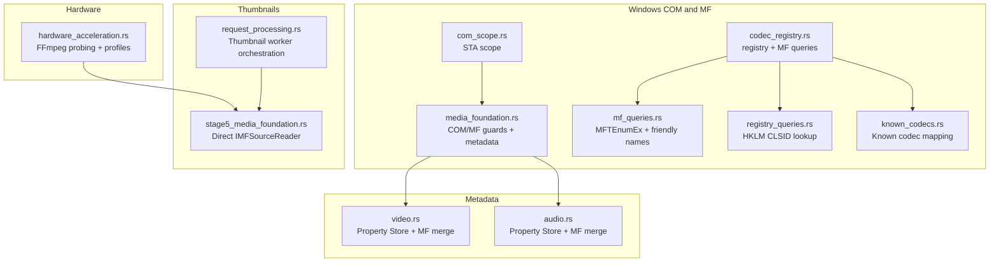
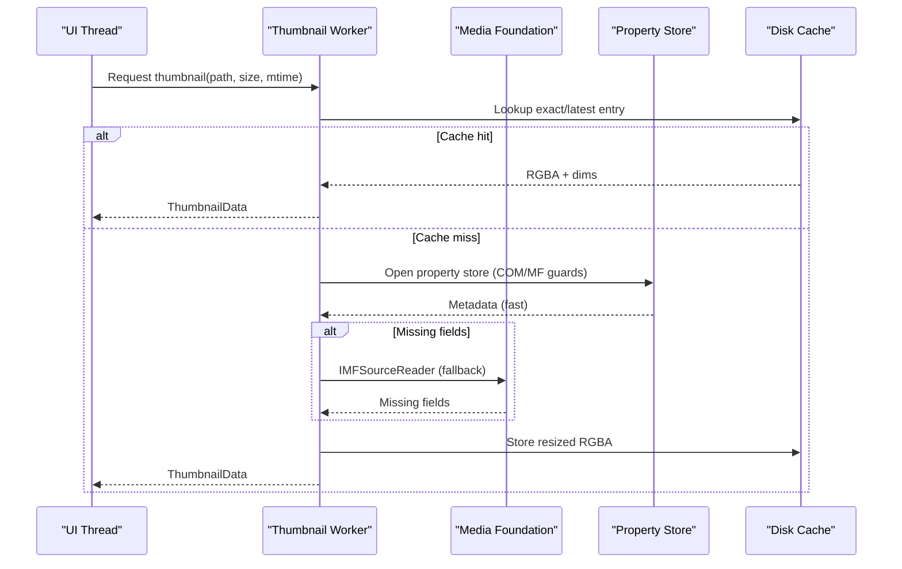
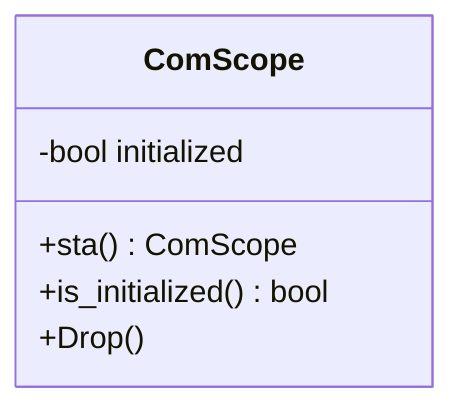
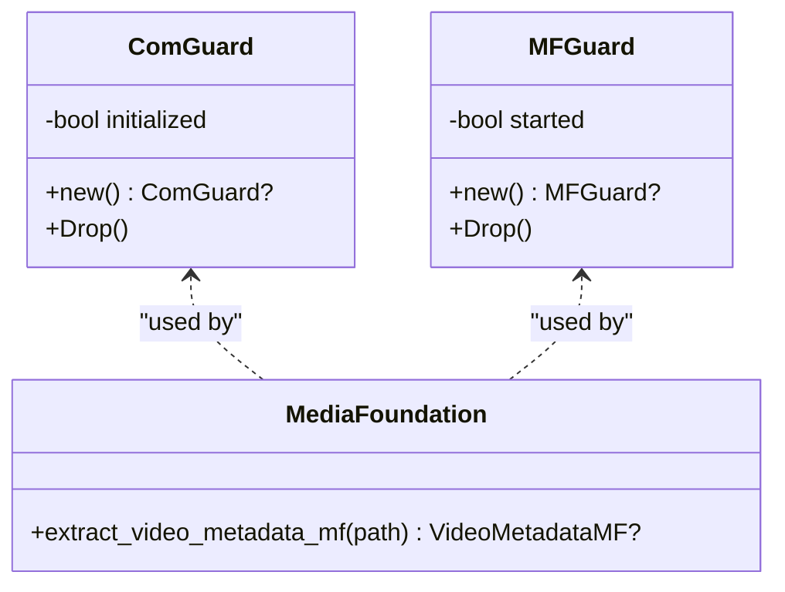
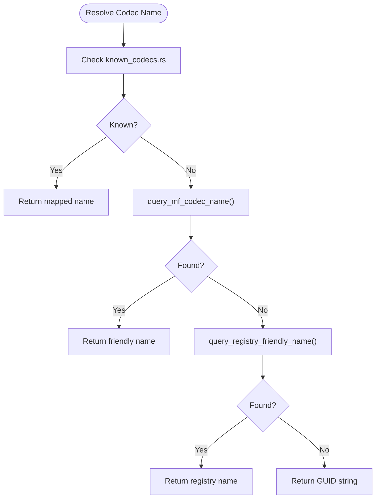
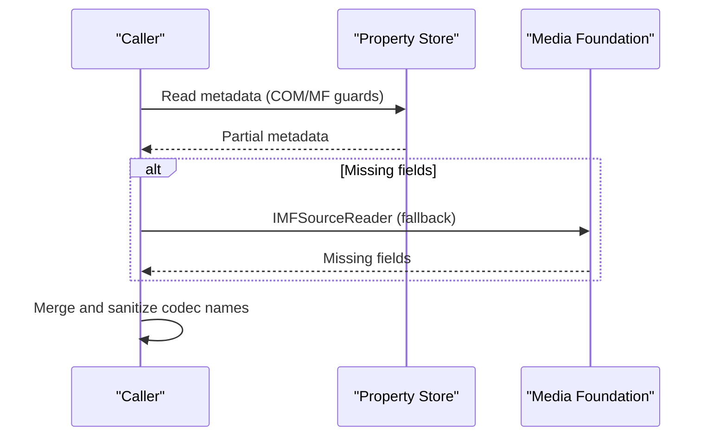
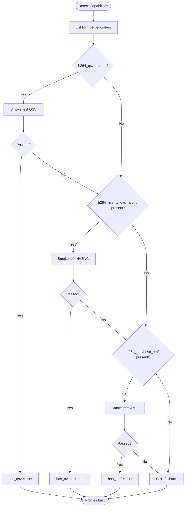
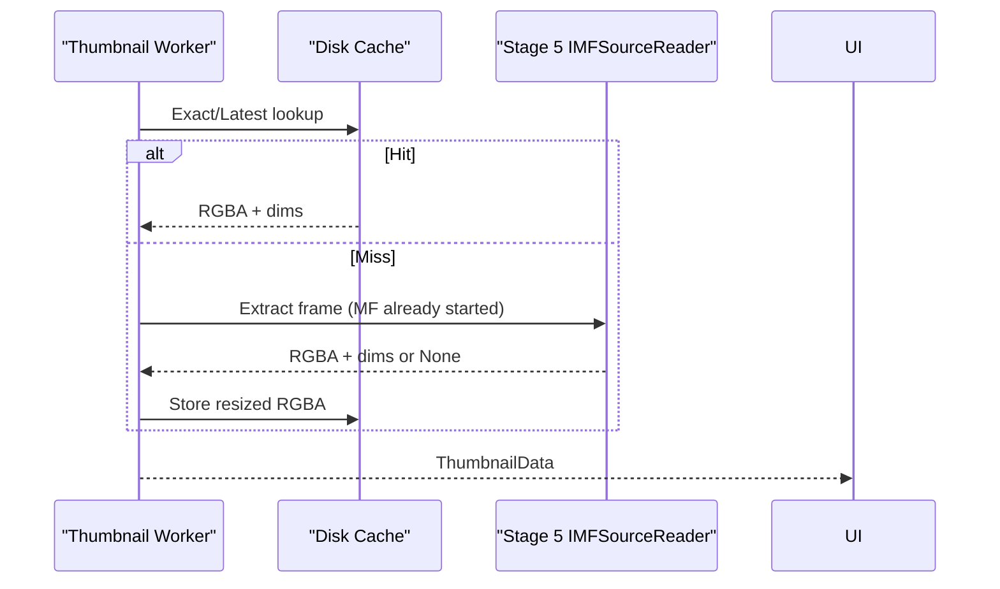
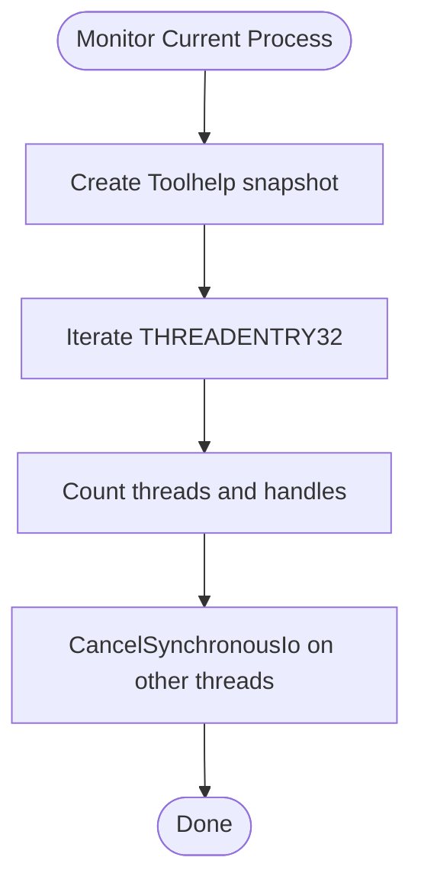
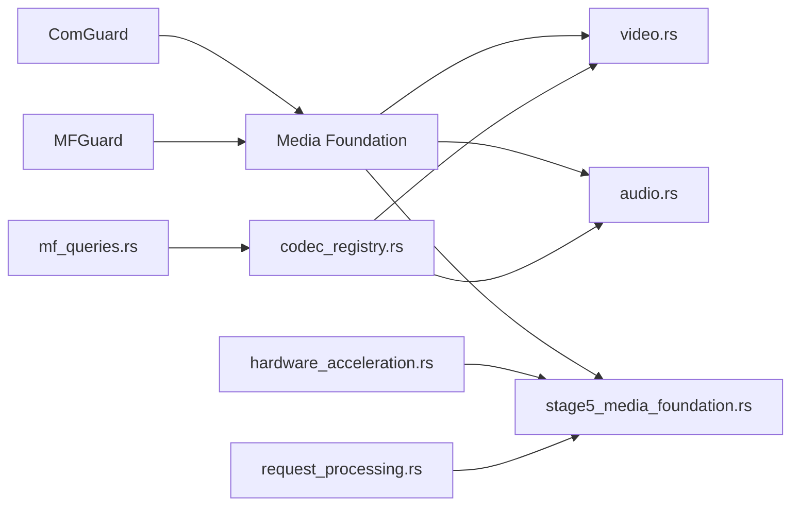

# COM Integration

<cite>
**Referenced Files in This Document**
- [com_scope.rs](file://src/infrastructure/windows/com_scope.rs)
- [media_foundation.rs](file://src/infrastructure/windows/media_foundation.rs)
- [codec_registry.rs](file://src/infrastructure/windows/codec_registry.rs)
- [mf_queries.rs](file://src/infrastructure/windows/codec_registry/mf_queries.rs)
- [registry_queries.rs](file://src/infrastructure/windows/codec_registry/registry_queries.rs)
- [known_codecs.rs](file://src/infrastructure/windows/codec_registry/known_codecs.rs)
- [process_snapshot.rs](file://src/infrastructure/windows/process_snapshot.rs)
- [owned_handle.rs](file://src/infrastructure/windows/owned_handle.rs)
- [hardware_acceleration.rs](file://src/infrastructure/media/hardware_acceleration.rs)
- [video.rs](file://src/infrastructure/windows/metadata/video.rs)
- [audio.rs](file://src/infrastructure/windows/metadata/audio.rs)
- [stage5_media_foundation.rs](file://src/workers/thumbnail/extraction/stage5_media_foundation.rs)
- [request_processing.rs](file://src/workers/thumbnail/worker/request_processing.rs)
</cite>

## Table of Contents
1. [Introduction](#introduction)
2. [Project Structure](#project-structure)
3. [Core Components](#core-components)
4. [Architecture Overview](#architecture-overview)
5. [Detailed Component Analysis](#detailed-component-analysis)
6. [Dependency Analysis](#dependency-analysis)
7. [Performance Considerations](#performance-considerations)
8. [Troubleshooting Guide](#troubleshooting-guide)
9. [Conclusion](#conclusion)

## Introduction
This document explains how MTT File Manager integrates with Windows Component Object Model (COM) and Media Foundation for robust multimedia operations. It covers COM initialization and lifecycle, handle lifetime management, Media Foundation metadata extraction and frame sampling, codec registry queries, hardware acceleration detection, and process snapshotting for resource monitoring. It also provides safe usage patterns, error handling strategies, and performance considerations tailored to thumbnail generation and media metadata workflows.

## Project Structure
The COM and Media Foundation integration spans several modules:
- Windows COM scope management and Media Foundation lifecycle
- Codec registry queries via Media Foundation and Windows Registry
- Metadata extraction for video and audio
- Hardware acceleration capability detection
- Thumbnail extraction pipeline with Media Foundation fallback
- Process snapshotting and handle ownership

**Diagram sources**
- [com_scope.rs:1-41](file://src/infrastructure/windows/com_scope.rs#L1-L41)
- [media_foundation.rs:1-439](file://src/infrastructure/windows/media_foundation.rs#L1-L439)
- [codec_registry.rs:1-385](file://src/infrastructure/windows/codec_registry.rs#L1-L385)
- [mf_queries.rs:1-255](file://src/infrastructure/windows/codec_registry/mf_queries.rs#L1-L255)
- [registry_queries.rs:1-178](file://src/infrastructure/windows/codec_registry/registry_queries.rs#L1-L178)
- [known_codecs.rs:1-100](file://src/infrastructure/windows/codec_registry/known_codecs.rs#L1-L100)
- [video.rs:1-463](file://src/infrastructure/windows/metadata/video.rs#L1-L463)
- [audio.rs:1-102](file://src/infrastructure/windows/metadata/audio.rs#L1-L102)
- [hardware_acceleration.rs:1-430](file://src/infrastructure/media/hardware_acceleration.rs#L1-L430)
- [stage5_media_foundation.rs:1-227](file://src/workers/thumbnail/extraction/stage5_media_foundation.rs#L1-L227)
- [request_processing.rs:1-418](file://src/workers/thumbnail/worker/request_processing.rs#L1-L418)

**Section sources**
- [com_scope.rs:1-41](file://src/infrastructure/windows/com_scope.rs#L1-L41)
- [media_foundation.rs:1-439](file://src/infrastructure/windows/media_foundation.rs#L1-L439)
- [codec_registry.rs:1-385](file://src/infrastructure/windows/codec_registry.rs#L1-L385)
- [mf_queries.rs:1-255](file://src/infrastructure/windows/codec_registry/mf_queries.rs#L1-L255)
- [registry_queries.rs:1-178](file://src/infrastructure/windows/codec_registry/registry_queries.rs#L1-L178)
- [known_codecs.rs:1-100](file://src/infrastructure/windows/codec_registry/known_codecs.rs#L1-L100)
- [video.rs:1-463](file://src/infrastructure/windows/metadata/video.rs#L1-L463)
- [audio.rs:1-102](file://src/infrastructure/windows/metadata/audio.rs#L1-L102)
- [hardware_acceleration.rs:1-430](file://src/infrastructure/media/hardware_acceleration.rs#L1-L430)
- [stage5_media_foundation.rs:1-227](file://src/workers/thumbnail/extraction/stage5_media_foundation.rs#L1-L227)
- [request_processing.rs:1-418](file://src/workers/thumbnail/worker/request_processing.rs#L1-L418)

## Core Components
- COM Scope Management
  - Apartment-threaded initialization and teardown for STA contexts.
  - Ensures matching thread for creation and destruction.
- Media Foundation Guards
  - RAII wrappers for COM multithreaded initialization and MF startup/shutdown.
  - Handles mode-change scenarios gracefully.
- Codec Registry
  - Media Foundation Transform enumeration for friendly names.
  - Windows Registry fallback for CLSID-friendly names.
  - Known codec mapping for common FourCC and format tags.
- Metadata Extraction
  - Property Store as primary source; MF fallback for missing fields.
  - Merge and sanitization logic for robust codec identification.
- Hardware Acceleration
  - FFmpeg-based capability detection with smoke tests.
  - Profile prioritization and argument building for transcode backends.
- Thumbnail Pipeline
  - Multi-stage extraction with Media Foundation direct frame sampling as a last resort.
  - Worker orchestration with caching, concurrency control, and adaptive repaint.
- Process Snapshotting
  - Thread enumeration, handle counting, and cancellation of pending I/O.

**Section sources**
- [com_scope.rs:1-41](file://src/infrastructure/windows/com_scope.rs#L1-L41)
- [media_foundation.rs:41-98](file://src/infrastructure/windows/media_foundation.rs#L41-L98)
- [codec_registry.rs:1-385](file://src/infrastructure/windows/codec_registry.rs#L1-L385)
- [mf_queries.rs:1-255](file://src/infrastructure/windows/codec_registry/mf_queries.rs#L1-L255)
- [registry_queries.rs:1-178](file://src/infrastructure/windows/codec_registry/registry_queries.rs#L1-L178)
- [known_codecs.rs:1-100](file://src/infrastructure/windows/codec_registry/known_codecs.rs#L1-L100)
- [video.rs:32-106](file://src/infrastructure/windows/metadata/video.rs#L32-L106)
- [audio.rs:7-55](file://src/infrastructure/windows/metadata/audio.rs#L7-L55)
- [hardware_acceleration.rs:1-430](file://src/infrastructure/media/hardware_acceleration.rs#L1-L430)
- [stage5_media_foundation.rs:1-227](file://src/workers/thumbnail/extraction/stage5_media_foundation.rs#L1-L227)
- [request_processing.rs:50-333](file://src/workers/thumbnail/worker/request_processing.rs#L50-L333)
- [process_snapshot.rs:1-121](file://src/infrastructure/windows/process_snapshot.rs#L1-L121)

## Architecture Overview
The system follows a layered approach:
- Layer 1: COM/MF lifecycle management
- Layer 2: Codec registry and metadata extraction
- Layer 3: Hardware acceleration detection and profile selection
- Layer 4: Thumbnail worker pipeline with caching and concurrency
- Layer 5: Process snapshotting and resource monitoring

**Diagram sources**
- [request_processing.rs:50-333](file://src/workers/thumbnail/worker/request_processing.rs#L50-L333)
- [media_foundation.rs:100-144](file://src/infrastructure/windows/media_foundation.rs#L100-L144)
- [video.rs:32-106](file://src/infrastructure/windows/metadata/video.rs#L32-L106)
- [audio.rs:7-55](file://src/infrastructure/windows/metadata/audio.rs#L7-L55)

## Detailed Component Analysis

### COM Scope Management
- Purpose: Provide a safe, scoped COM initialization for STA threads.
- Behavior:
  - Initializes with apartment-threaded mode.
  - Tracks initialization status and uninitializes in Drop.
  - Requires construction and Drop on the same thread.
- Safe usage pattern:
  - Wrap short-lived operations in a local scope.
  - Avoid sharing across threads; create a new scope per thread.

**Diagram sources**
- [com_scope.rs:1-41](file://src/infrastructure/windows/com_scope.rs#L1-L41)

**Section sources**
- [com_scope.rs:1-41](file://src/infrastructure/windows/com_scope.rs#L1-L41)

### Media Foundation Guards and Metadata Extraction
- Purpose: Manage COM multithreaded initialization and MF startup/shutdown.
- Behavior:
  - ComGuard handles RPC_E_CHANGED_MODE and errors.
  - MFGuard ensures MFStartup is idempotent and tracks state.
  - extract_video_metadata_mf uses IMFSourceReader for robust metadata extraction.
- Safe usage pattern:
  - Always construct ComGuard and MFGuard before MF calls.
  - Avoid repeated MFStartup inside hot loops; reuse thread-local state.

**Diagram sources**
- [media_foundation.rs:41-98](file://src/infrastructure/windows/media_foundation.rs#L41-L98)
- [media_foundation.rs:100-144](file://src/infrastructure/windows/media_foundation.rs#L100-L144)

**Section sources**
- [media_foundation.rs:41-98](file://src/infrastructure/windows/media_foundation.rs#L41-L98)
- [media_foundation.rs:100-144](file://src/infrastructure/windows/media_foundation.rs#L100-L144)

### Codec Registry Queries
- Purpose: Resolve codec GUIDs to human-readable names using Media Foundation and Windows Registry.
- Behavior:
  - query_mf_codec_name enumerates MFTs and reads friendly names.
  - query_mft_by_subtype converts FourCC tags to GUIDs and searches MFTs.
  - query_registry_friendly_name reads CLSID FriendlyName from HKLM.
  - known_codecs provides fallback mapping for common FourCC/format tags.
- Safe usage pattern:
  - Use LRU caching to avoid repeated registry lookups.
  - Prefer MF enumeration; fall back to registry only when needed.

**Diagram sources**
- [codec_registry.rs:1-385](file://src/infrastructure/windows/codec_registry.rs#L1-L385)
- [mf_queries.rs:1-255](file://src/infrastructure/windows/codec_registry/mf_queries.rs#L1-L255)
- [registry_queries.rs:1-178](file://src/infrastructure/windows/codec_registry/registry_queries.rs#L1-L178)
- [known_codecs.rs:1-100](file://src/infrastructure/windows/codec_registry/known_codecs.rs#L1-L100)

**Section sources**
- [codec_registry.rs:1-385](file://src/infrastructure/windows/codec_registry.rs#L1-L385)
- [mf_queries.rs:1-255](file://src/infrastructure/windows/codec_registry/mf_queries.rs#L1-L255)
- [registry_queries.rs:1-178](file://src/infrastructure/windows/codec_registry/registry_queries.rs#L1-L178)
- [known_codecs.rs:1-100](file://src/infrastructure/windows/codec_registry/known_codecs.rs#L1-L100)

### Metadata Extraction: Video and Audio
- Purpose: Extract and merge metadata from Property Store and Media Foundation.
- Behavior:
  - Property Store provides fast metadata; MF fallback fills gaps.
  - Sanitization and codec name resolution integrate with codec registry.
  - Fallback to bitstream sniffing for cryptic codec IDs.
- Safe usage pattern:
  - Always initialize COM/MF guards before accessing stores or readers.
  - Merge results carefully to preserve best available data.

**Diagram sources**
- [video.rs:32-106](file://src/infrastructure/windows/metadata/video.rs#L32-L106)
- [audio.rs:7-55](file://src/infrastructure/windows/metadata/audio.rs#L7-L55)
- [media_foundation.rs:100-144](file://src/infrastructure/windows/media_foundation.rs#L100-L144)

**Section sources**
- [video.rs:32-106](file://src/infrastructure/windows/metadata/video.rs#L32-L106)
- [audio.rs:7-55](file://src/infrastructure/windows/metadata/audio.rs#L7-L55)
- [media_foundation.rs:100-144](file://src/infrastructure/windows/media_foundation.rs#L100-L144)

### Hardware Acceleration Detection and Profiles
- Purpose: Detect available hardware encoders and build validated transcode profiles.
- Behavior:
  - Probe FFmpeg encoders and run smoke tests per backend.
  - Build arguments with hardware device initialization and filters.
  - Prioritize profiles: QSV > NVENC > AMF > CPU.
- Safe usage pattern:
  - Resolve FFmpeg path securely to prevent hijacking.
  - Cache capabilities per process lifecycle.

**Diagram sources**
- [hardware_acceleration.rs:38-85](file://src/infrastructure/media/hardware_acceleration.rs#L38-L85)
- [hardware_acceleration.rs:111-208](file://src/infrastructure/media/hardware_acceleration.rs#L111-L208)
- [hardware_acceleration.rs:259-295](file://src/infrastructure/media/hardware_acceleration.rs#L259-L295)

**Section sources**
- [hardware_acceleration.rs:1-430](file://src/infrastructure/media/hardware_acceleration.rs#L1-L430)

### Thumbnail Extraction Pipeline and Media Foundation Fallback
- Purpose: Produce thumbnails reliably, even when system caches fail.
- Behavior:
  - Multi-stage extraction with caching and resizing.
  - Stage 5 uses IMFSourceReader to read a frame directly from the file.
  - Worker orchestrates concurrency, cache checks, and adaptive repaint.
- Safe usage pattern:
  - Initialize MF once per worker thread; reuse for multiple requests.
  - Convert NV12 to RGBA safely and handle buffer size mismatches.
  - Respect OneDrive availability to avoid blocking downloads.

**Diagram sources**
- [request_processing.rs:50-333](file://src/workers/thumbnail/worker/request_processing.rs#L50-L333)
- [stage5_media_foundation.rs:1-227](file://src/workers/thumbnail/extraction/stage5_media_foundation.rs#L1-L227)

**Section sources**
- [request_processing.rs:50-333](file://src/workers/thumbnail/worker/request_processing.rs#L50-L333)
- [stage5_media_foundation.rs:1-227](file://src/workers/thumbnail/extraction/stage5_media_foundation.rs#L1-L227)

### Process Snapshotting and Handle Lifetime Control
- Purpose: Monitor and manage kernel resources and pending I/O for the current process.
- Behavior:
  - Enumerate threads for the current process.
  - Count GDI/user objects, handle count, and thread count.
  - Cancel synchronous I/O on other threads safely using OwnedHandle.
- Safe usage pattern:
  - Use OwnedHandle to guarantee CloseHandle on Drop.
  - Avoid canceling I/O on the current thread; iterate others only.

**Diagram sources**
- [process_snapshot.rs:86-121](file://src/infrastructure/windows/process_snapshot.rs#L86-L121)
- [owned_handle.rs:1-35](file://src/infrastructure/windows/owned_handle.rs#L1-L35)

**Section sources**
- [process_snapshot.rs:1-121](file://src/infrastructure/windows/process_snapshot.rs#L1-L121)
- [owned_handle.rs:1-35](file://src/infrastructure/windows/owned_handle.rs#L1-L35)

## Dependency Analysis
- COM/MF lifecycle dependencies:
  - ComGuard and MFGuard are used by metadata extraction and thumbnail stage 5.
  - ComScope is used for STA contexts; ComGuard for MT contexts.
- Codec registry depends on:
  - Media Foundation enumeration and Windows Registry access.
  - Known codec mapping for fallback.
- Hardware acceleration depends on:
  - FFmpeg presence and smoke tests; builds arguments for each backend.
- Thumbnail worker depends on:
  - Disk cache, concurrency control, and Media Foundation fallback.

**Diagram sources**
- [media_foundation.rs:41-98](file://src/infrastructure/windows/media_foundation.rs#L41-L98)
- [video.rs:32-106](file://src/infrastructure/windows/metadata/video.rs#L32-L106)
- [audio.rs:7-55](file://src/infrastructure/windows/metadata/audio.rs#L7-L55)
- [stage5_media_foundation.rs:1-227](file://src/workers/thumbnail/extraction/stage5_media_foundation.rs#L1-L227)
- [mf_queries.rs:1-255](file://src/infrastructure/windows/codec_registry/mf_queries.rs#L1-L255)
- [codec_registry.rs:1-385](file://src/infrastructure/windows/codec_registry.rs#L1-L385)
- [hardware_acceleration.rs:1-430](file://src/infrastructure/media/hardware_acceleration.rs#L1-L430)
- [request_processing.rs:50-333](file://src/workers/thumbnail/worker/request_processing.rs#L50-L333)

**Section sources**
- [media_foundation.rs:41-98](file://src/infrastructure/windows/media_foundation.rs#L41-L98)
- [video.rs:32-106](file://src/infrastructure/windows/metadata/video.rs#L32-L106)
- [audio.rs:7-55](file://src/infrastructure/windows/metadata/audio.rs#L7-L55)
- [stage5_media_foundation.rs:1-227](file://src/workers/thumbnail/extraction/stage5_media_foundation.rs#L1-L227)
- [mf_queries.rs:1-255](file://src/infrastructure/windows/codec_registry/mf_queries.rs#L1-L255)
- [codec_registry.rs:1-385](file://src/infrastructure/windows/codec_registry.rs#L1-L385)
- [hardware_acceleration.rs:1-430](file://src/infrastructure/media/hardware_acceleration.rs#L1-L430)
- [request_processing.rs:50-333](file://src/workers/thumbnail/worker/request_processing.rs#L50-L333)

## Performance Considerations
- COM Initialization
  - Minimize repeated CoInitializeEx calls; reuse thread-local guards.
  - Use ComScope for STA tasks; ComGuard for MT tasks.
- Media Foundation
  - MFStartup is idempotent; avoid calling per-file in tight loops.
  - Prefer Property Store for metadata; use IMFSourceReader only when needed.
- Codec Registry
  - Cache results to avoid repeated MF enumeration and registry queries.
- Thumbnails
  - Use disk cache aggressively; resize early to reduce memory footprint.
  - Limit concurrency with semaphores to control RAM spikes.
- Hardware Acceleration
  - Run smoke tests once per process; cache capabilities.
  - Choose appropriate presets and filters per backend to balance quality and speed.

[No sources needed since this section provides general guidance]

## Troubleshooting Guide
- COM Initialization Failures
  - RPC_E_CHANGED_MODE indicates the thread’s COM mode changed; handle gracefully with ComGuard.
  - Ensure ComScope is constructed and dropped on the same thread.
- Media Foundation Errors
  - IMFSourceReader creation failures often indicate unsupported containers or codec absence; fall back to Property Store or sniffing.
  - Buffer size mismatches in NV12 conversion should be logged and retried with RGB32 if available.
- Codec Names
  - If GUIDs appear cryptic, verify MF enumeration and registry fallback; confirm LRU cache initialization.
- Hardware Acceleration
  - If smoke tests fail, verify FFmpeg path resolution and backend availability; fall back to CPU.
- Process Monitoring
  - Handle invalid snapshots and thread iteration errors; ensure OwnedHandle closes handles.

**Section sources**
- [media_foundation.rs:46-69](file://src/infrastructure/windows/media_foundation.rs#L46-L69)
- [com_scope.rs:22-30](file://src/infrastructure/windows/com_scope.rs#L22-L30)
- [stage5_media_foundation.rs:172-204](file://src/workers/thumbnail/extraction/stage5_media_foundation.rs#L172-L204)
- [codec_registry.rs:27-35](file://src/infrastructure/windows/codec_registry.rs#L27-L35)
- [hardware_acceleration.rs:223-248](file://src/infrastructure/media/hardware_acceleration.rs#L223-L248)
- [process_snapshot.rs:86-121](file://src/infrastructure/windows/process_snapshot.rs#L86-L121)

## Conclusion
MTT File Manager’s COM and Media Foundation integration is designed for reliability and performance:
- COM scopes and guards ensure correct initialization and teardown.
- Media Foundation is used judiciously as a robust fallback for metadata and frame extraction.
- Codec registry queries combine MF enumeration and registry lookups with known mappings.
- Hardware acceleration detection validates backends and builds optimized profiles.
- The thumbnail pipeline leverages caching, concurrency control, and a direct MF fallback to produce thumbnails consistently.
These patterns provide a solid foundation for multimedia operations while maintaining safety and responsiveness.