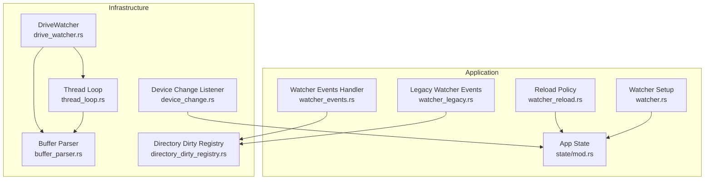
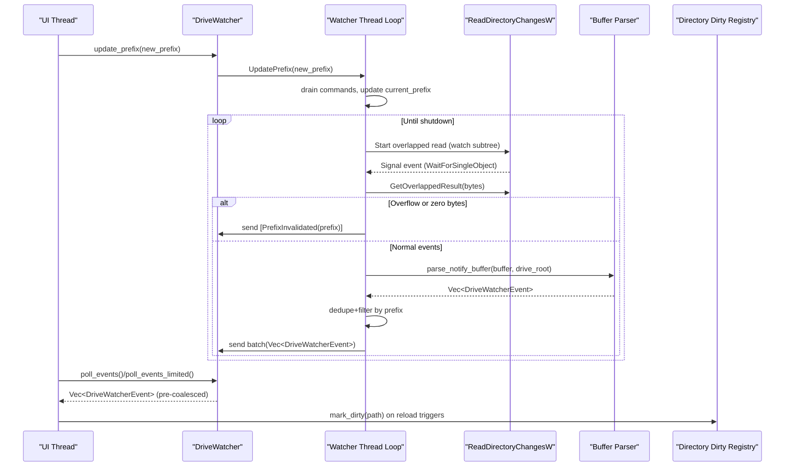
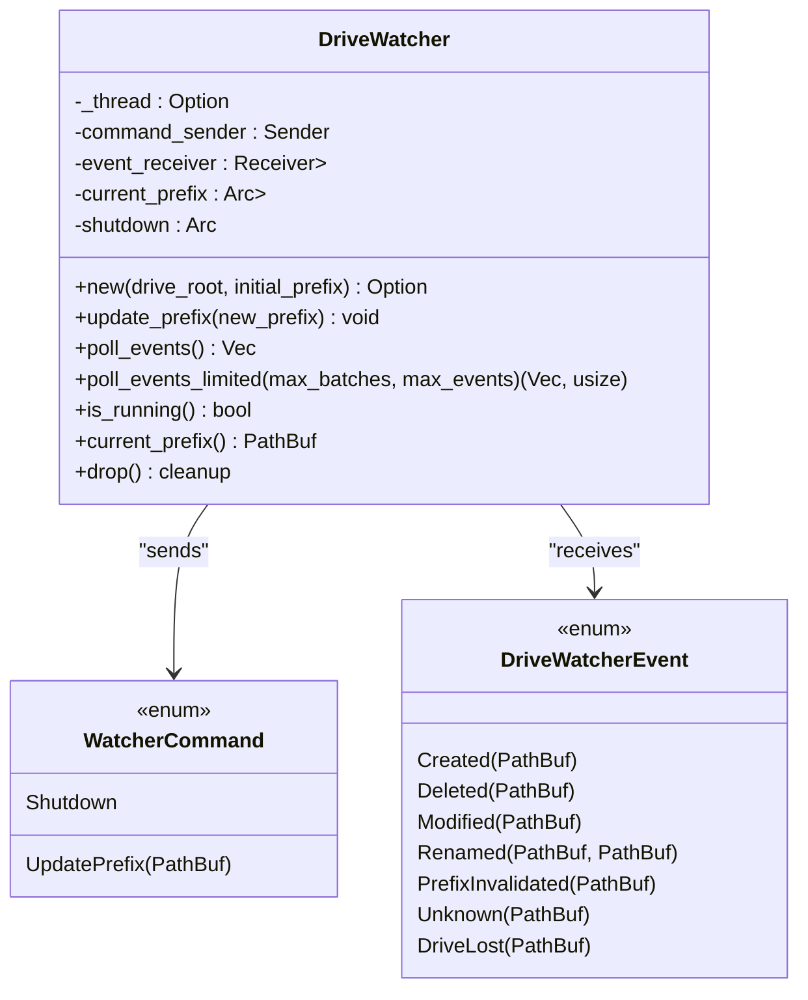
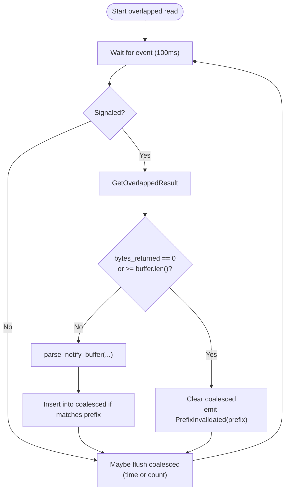
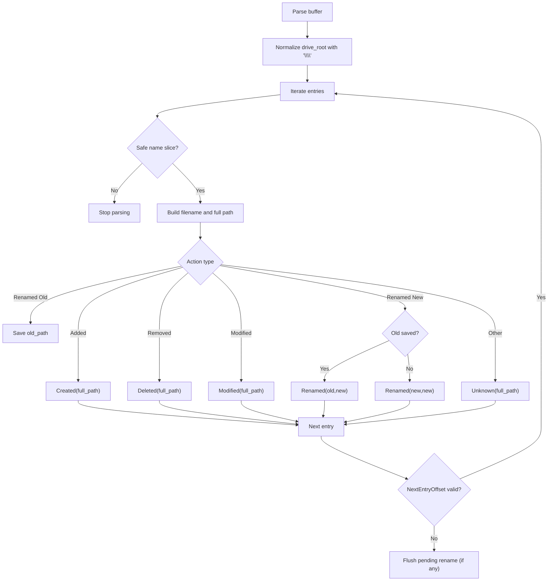
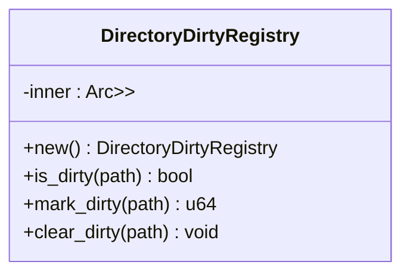
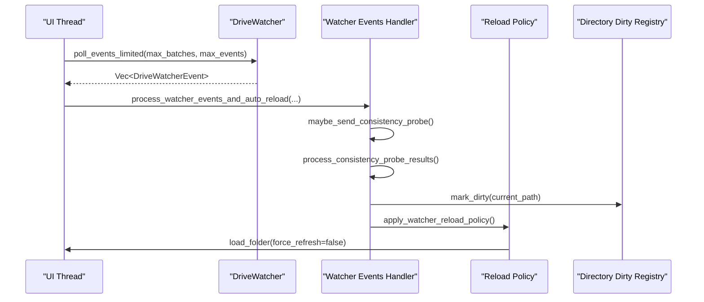
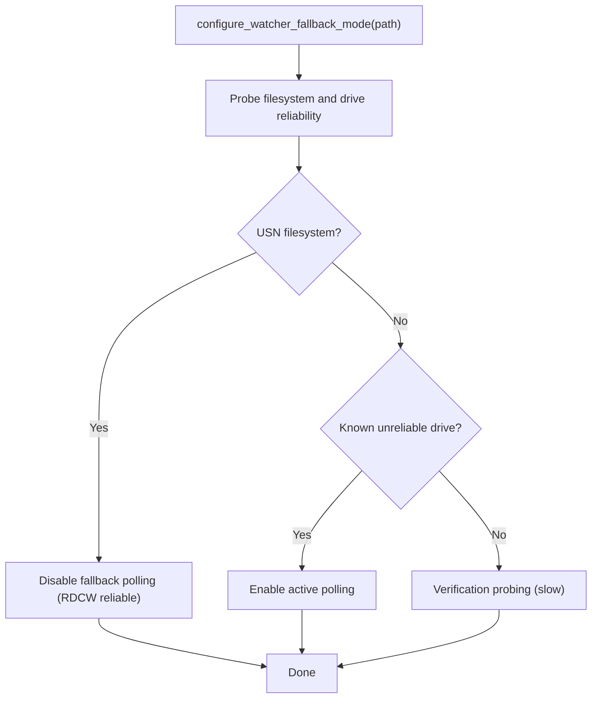
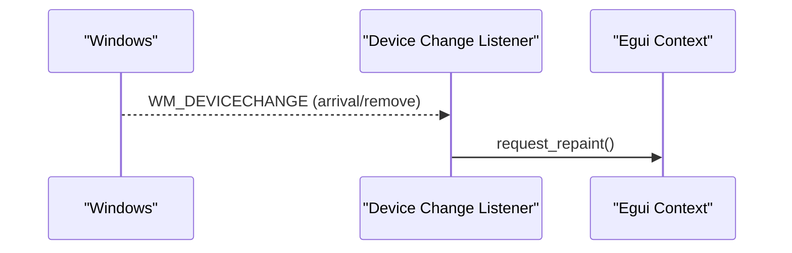
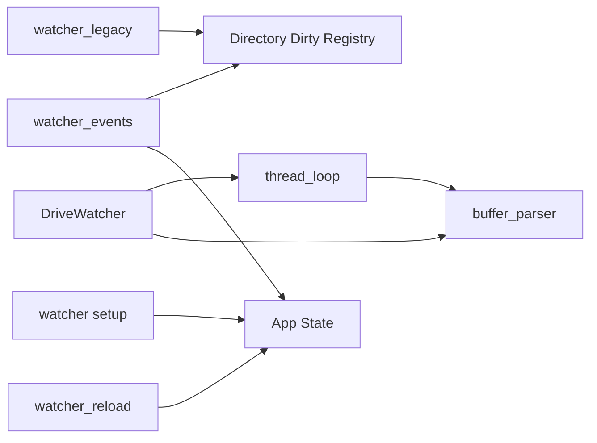

# File System Watchers

<cite>
**Referenced Files in This Document**
- [drive_watcher.rs](file://src/infrastructure/drive_watcher.rs)
- [buffer_parser.rs](file://src/infrastructure/drive_watcher/buffer_parser.rs)
- [thread_loop.rs](file://src/infrastructure/drive_watcher/thread_loop.rs)
- [directory_dirty_registry.rs](file://src/infrastructure/directory_dirty_registry.rs)
- [watcher_events.rs](file://src/app/operations/message_handler/watcher_events.rs)
- [watcher_legacy.rs](file://src/app/operations/message_handler/watcher_legacy.rs)
- [watcher_reload.rs](file://src/app/operations/message_handler/watcher_reload.rs)
- [watcher.rs](file://src/app/operations/watcher.rs)
- [device_change.rs](file://src/infrastructure/windows/device_change.rs)
- [mod.rs](file://src/app/state/mod.rs)
</cite>

## Table of Contents
1. [Introduction](#introduction)
2. [Project Structure](#project-structure)
3. [Core Components](#core-components)
4. [Architecture Overview](#architecture-overview)
5. [Detailed Component Analysis](#detailed-component-analysis)
6. [Dependency Analysis](#dependency-analysis)
7. [Performance Considerations](#performance-considerations)
8. [Troubleshooting Guide](#troubleshooting-guide)
9. [Conclusion](#conclusion)

## Introduction
This document explains MTT File Manager’s file system watching capabilities with a focus on the Windows-native ReadDirectoryChangesW (RDCW) implementation. It covers:
- Drive-wide monitoring architecture and recursive directory watching
- Change notification handling, event buffering, and coalescing
- Buffer parsing, event categorization, and overflow handling
- Propagation to UI components and integration with the directory dirty registry
- Thread loop implementation, device change notifications, and performance optimizations
- Examples for handling rapid file operations, memory management for large directories, and real-time UI updates

## Project Structure
The file watcher system spans three layers:
- Infrastructure: Windows-specific watchers and low-level I/O
- Application: UI-driven event processing and auto-reload policy
- State: Registry and caches for directory dirtiness and consistency

**Diagram sources**
- [drive_watcher.rs:1-299](file://src/infrastructure/drive_watcher.rs#L1-L299)
- [buffer_parser.rs:1-171](file://src/infrastructure/drive_watcher/buffer_parser.rs#L1-L171)
- [thread_loop.rs:1-234](file://src/infrastructure/drive_watcher/thread_loop.rs#L1-L234)
- [directory_dirty_registry.rs:1-37](file://src/infrastructure/directory_dirty_registry.rs#L1-L37)
- [watcher_events.rs:1-321](file://src/app/operations/message_handler/watcher_events.rs#L1-L321)
- [watcher_legacy.rs:1-309](file://src/app/operations/message_handler/watcher_legacy.rs#L1-L309)
- [watcher_reload.rs:1-86](file://src/app/operations/message_handler/watcher_reload.rs#L1-L86)
- [watcher.rs:1-207](file://src/app/operations/watcher.rs#L1-L207)
- [device_change.rs:1-180](file://src/infrastructure/windows/device_change.rs#L1-L180)
- [mod.rs:1-200](file://src/app/state/mod.rs#L1-L200)

**Section sources**
- [drive_watcher.rs:1-299](file://src/infrastructure/drive_watcher.rs#L1-L299)
- [buffer_parser.rs:1-171](file://src/infrastructure/drive_watcher/buffer_parser.rs#L1-L171)
- [thread_loop.rs:1-234](file://src/infrastructure/drive_watcher/thread_loop.rs#L1-L234)
- [directory_dirty_registry.rs:1-37](file://src/infrastructure/directory_dirty_registry.rs#L1-L37)
- [watcher_events.rs:1-321](file://src/app/operations/message_handler/watcher_events.rs#L1-L321)
- [watcher_legacy.rs:1-309](file://src/app/operations/message_handler/watcher_legacy.rs#L1-L309)
- [watcher_reload.rs:1-86](file://src/app/operations/message_handler/watcher_reload.rs#L1-L86)
- [watcher.rs:1-207](file://src/app/operations/watcher.rs#L1-L207)
- [device_change.rs:1-180](file://src/infrastructure/windows/device_change.rs#L1-L180)
- [mod.rs:1-200](file://src/app/state/mod.rs#L1-L200)

## Core Components
- DriveWatcher: High-level interface that manages a background thread, exposes event polling, and updates the monitored prefix.
- Thread loop: Implements overlapped I/O with ReadDirectoryChangesW, coalesces and deduplicates events, and handles overflow.
- Buffer parser: Safely parses FILE_NOTIFY_INFORMATION buffers, reconstructs full paths, and categorizes events.
- Directory Dirty Registry: Tracks which directories are “dirty” to coordinate cache invalidations and reload triggers.
- UI event handlers: Process watcher events, schedule auto-reloads, and maintain consistency with disk state.
- Legacy watcher (optional): An alternative notify-based watcher for environments where RDCW is unreliable.
- Device change listener: Listens for Windows volume arrival/removal to trigger UI refresh.

**Section sources**
- [drive_watcher.rs:56-255](file://src/infrastructure/drive_watcher.rs#L56-L255)
- [thread_loop.rs:45-234](file://src/infrastructure/drive_watcher/thread_loop.rs#L45-L234)
- [buffer_parser.rs:11-171](file://src/infrastructure/drive_watcher/buffer_parser.rs#L11-L171)
- [directory_dirty_registry.rs:7-37](file://src/infrastructure/directory_dirty_registry.rs#L7-L37)
- [watcher_events.rs:275-321](file://src/app/operations/message_handler/watcher_events.rs#L275-L321)
- [watcher_legacy.rs:20-309](file://src/app/operations/message_handler/watcher_legacy.rs#L20-L309)
- [device_change.rs:52-180](file://src/infrastructure/windows/device_change.rs#L52-L180)

## Architecture Overview
The system watches an entire drive root (e.g., C:\) and filters events to the current prefix. The watcher thread:
- Uses overlapped I/O with ReadDirectoryChangesW
- Parses raw buffers into typed events
- Deduplicates and coalesces events
- Emits batches to the UI thread via channels
- Handles overflow by signaling prefix invalidation
- Responds to command updates (prefix changes) and shutdown

**Diagram sources**
- [drive_watcher.rs:129-197](file://src/infrastructure/drive_watcher.rs#L129-L197)
- [thread_loop.rs:114-212](file://src/infrastructure/drive_watcher/thread_loop.rs#L114-L212)
- [buffer_parser.rs:12-96](file://src/infrastructure/drive_watcher/buffer_parser.rs#L12-L96)
- [directory_dirty_registry.rs:21-31](file://src/infrastructure/directory_dirty_registry.rs#L21-L31)

## Detailed Component Analysis

### DriveWatcher: High-level interface and event emission
- Manages a background thread and two channels: command sender and event receiver.
- Exposes update_prefix, poll_events, and poll_events_limited.
- Ensures thread-safe prefix updates and controlled event backpressure on the UI thread.
- Provides is_running and current_prefix helpers.

**Diagram sources**
- [drive_watcher.rs:47-255](file://src/infrastructure/drive_watcher.rs#L47-L255)

**Section sources**
- [drive_watcher.rs:73-255](file://src/infrastructure/drive_watcher.rs#L73-L255)

### Thread Loop: Overlapped I/O, coalescing, and overflow handling
- Uses a 256 KiB aligned buffer for FILE_NOTIFY_INFORMATION.
- Starts overlapped reads with FILE_NOTIFY_CHANGE_* flags for file/dir names, attributes, size, last write, and creation.
- Waits with a 100 ms timeout; on signalled completion, retrieves bytes returned and either emits PrefixInvalidated or parses events.
- Maintains a HashSet coalesced buffer with:
  - Max 500 events before forced flush
  - 200 ms minimum interval between flushes
- On shutdown, cancels pending I/O and synchronizes to avoid use-after-free.

**Diagram sources**
- [thread_loop.rs:45-234](file://src/infrastructure/drive_watcher/thread_loop.rs#L45-L234)

**Section sources**
- [thread_loop.rs:20-36](file://src/infrastructure/drive_watcher/thread_loop.rs#L20-L36)
- [thread_loop.rs:114-212](file://src/infrastructure/drive_watcher/thread_loop.rs#L114-L212)

### Buffer Parser: Safe parsing and event categorization
- Normalizes drive root to ensure trailing backslash for path construction.
- Iterates FILE_NOTIFY_INFORMATION entries with robust bounds checks to guard against corruption.
- Reconstructs full paths and maps actions to DriveWatcherEvent variants.
- Handles rename pairing defensively (OLD/NEW action pairs) and unmatched renames.
- Provides event_matches_prefix to filter events to the current prefix, including ancestor/descendant matching and drive-root special case.

**Diagram sources**
- [buffer_parser.rs:12-96](file://src/infrastructure/drive_watcher/buffer_parser.rs#L12-L96)
- [buffer_parser.rs:158-171](file://src/infrastructure/drive_watcher/buffer_parser.rs#L158-L171)

**Section sources**
- [buffer_parser.rs:12-96](file://src/infrastructure/drive_watcher/buffer_parser.rs#L12-L96)
- [buffer_parser.rs:98-156](file://src/infrastructure/drive_watcher/buffer_parser.rs#L98-L156)

### Directory Dirty Registry: Tracking and propagating dirtiness
- Stores path-to-version mapping to mark directories as dirty and clear them when synced.
- Used by UI handlers to invalidate caches and trigger reloads.

**Diagram sources**
- [directory_dirty_registry.rs:7-37](file://src/infrastructure/directory_dirty_registry.rs#L7-L37)

**Section sources**
- [directory_dirty_registry.rs:7-37](file://src/infrastructure/directory_dirty_registry.rs#L7-L37)

### UI Event Processing and Auto-Reload Policy
- The UI thread polls DriveWatcher events and applies policies:
  - Limits per-frame batches and events to prevent UI stalls.
  - Integrates a fallback consistency probe for non-USN or unreliable drives.
  - Applies reload policy with debouncing, suppressing reloads during file operations to avoid flicker.
  - Uses Directory Dirty Registry to mark current path dirty and schedule reloads.

**Diagram sources**
- [watcher_events.rs:275-321](file://src/app/operations/message_handler/watcher_events.rs#L275-L321)
- [watcher_reload.rs:6-86](file://src/app/operations/message_handler/watcher_reload.rs#L6-L86)
- [directory_dirty_registry.rs:21-31](file://src/infrastructure/directory_dirty_registry.rs#L21-L31)

**Section sources**
- [watcher_events.rs:15-59](file://src/app/operations/message_handler/watcher_events.rs#L15-L59)
- [watcher_events.rs:275-321](file://src/app/operations/message_handler/watcher_events.rs#L275-L321)
- [watcher_reload.rs:6-86](file://src/app/operations/message_handler/watcher_reload.rs#L6-L86)

### Legacy Watcher and Fallback Mode
- Optional notify-based watcher supports environments where RDCW is unreliable.
- Event processing defers expensive cache writes to background and applies UI-friendly thresholds to avoid stalls.
- Fallback mode dynamically decides between passive RDCW (USN) and active polling based on filesystem and drive reliability.

**Diagram sources**
- [watcher.rs:14-102](file://src/app/operations/watcher.rs#L14-L102)
- [watcher_legacy.rs:20-309](file://src/app/operations/message_handler/watcher_legacy.rs#L20-L309)

**Section sources**
- [watcher.rs:14-102](file://src/app/operations/watcher.rs#L14-L102)
- [watcher_legacy.rs:20-309](file://src/app/operations/message_handler/watcher_legacy.rs#L20-L309)

### Device Change Notifications
- A background thread registers for WM_DEVICECHANGE messages to detect volume mount/unmount events.
- On arrival/removal, it signals the UI to repaint, ensuring the UI reflects drive availability.

**Diagram sources**
- [device_change.rs:52-180](file://src/infrastructure/windows/device_change.rs#L52-L180)

**Section sources**
- [device_change.rs:52-180](file://src/infrastructure/windows/device_change.rs#L52-L180)

## Dependency Analysis
- DriveWatcher depends on:
  - thread_loop for overlapped I/O and coalescing
  - buffer_parser for safe buffer decoding
  - Windows APIs for file handles and overlapped I/O
- UI handlers depend on:
  - DriveWatcher for events
  - Directory Dirty Registry for cache invalidation coordination
  - Legacy watcher for fallback environments
- State module integrates watcher-related caches and registries.

**Diagram sources**
- [drive_watcher.rs:25-26](file://src/infrastructure/drive_watcher.rs#L25-L26)
- [thread_loop.rs:17-18](file://src/infrastructure/drive_watcher/thread_loop.rs#L17-L18)
- [buffer_parser.rs:9](file://src/infrastructure/drive_watcher/buffer_parser.rs#L9)
- [watcher_events.rs:1-13](file://src/app/operations/message_handler/watcher_events.rs#L1-L13)
- [watcher_legacy.rs:1-6](file://src/app/operations/message_handler/watcher_legacy.rs#L1-L6)
- [watcher_reload.rs:1-4](file://src/app/operations/message_handler/watcher_reload.rs#L1-L4)
- [mod.rs:134-136](file://src/app/state/mod.rs#L134-L136)

**Section sources**
- [drive_watcher.rs:25-26](file://src/infrastructure/drive_watcher.rs#L25-L26)
- [thread_loop.rs:17-18](file://src/infrastructure/drive_watcher/thread_loop.rs#L17-L18)
- [buffer_parser.rs:9](file://src/infrastructure/drive_watcher/buffer_parser.rs#L9)
- [watcher_events.rs:1-13](file://src/app/operations/message_handler/watcher_events.rs#L1-L13)
- [watcher_legacy.rs:1-6](file://src/app/operations/message_handler/watcher_legacy.rs#L1-L6)
- [watcher_reload.rs:1-4](file://src/app/operations/message_handler/watcher_reload.rs#L1-L4)
- [mod.rs:134-136](file://src/app/state/mod.rs#L134-L136)

## Performance Considerations
- Event coalescing and deduplication:
  - Max 500 events per batch; flush every 200 ms to bound UI thread work.
  - Prevents backlog bursts and UI stalls during rapid operations (e.g., OneDrive dehydration).
- Buffer sizing and alignment:
  - 256 KiB aligned buffer for FILE_NOTIFY_INFORMATION to reduce overflow risk on large drives.
- Backpressure on UI:
  - poll_events_limited caps batches and events per frame; excess events are dropped to protect responsiveness.
- Debouncing and suppression:
  - Auto-reload is debounced and suppressed during file operations to avoid flicker and redundant reloads.
- Non-USN fallback:
  - Dynamic probing and escalation to active polling for unreliable filesystems; passive mode for USN.
- Avoiding blocking filesystem calls:
  - Directory existence checks and is_dir are avoided on the UI thread to prevent hangs on network/cloud drives.

[No sources needed since this section provides general guidance]

## Troubleshooting Guide
- Frequent PrefixInvalidated events:
  - Indicates buffer overflow or very high churn. The watcher sends a bulk invalidation; the UI responds by marking the prefix dirty and reloading.
- Drive becomes inaccessible:
  - DriveWatcher emits DriveLost; the thread exits and logs an error. The UI should handle this by navigating to a valid location.
- UI stalls during rapid operations:
  - The watcher coalescing and UI backpressure should mitigate this. If still observed, consider increasing max_batches/max_events or reducing churn.
- Legacy watcher floods:
  - The legacy handler detects event floods and may trigger a full reload to resync the UI.
- Volume mount/unmount not reflected:
  - Ensure the device change listener is running and that WM_DEVICECHANGE messages are delivered.

**Section sources**
- [thread_loop.rs:167-178](file://src/infrastructure/drive_watcher/thread_loop.rs#L167-L178)
- [thread_loop.rs:137-144](file://src/infrastructure/drive_watcher/thread_loop.rs#L137-L144)
- [watcher_legacy.rs:277-290](file://src/app/operations/message_handler/watcher_legacy.rs#L277-L290)
- [device_change.rs:162-179](file://src/infrastructure/windows/device_change.rs#L162-L179)

## Conclusion
MTT File Manager’s watcher architecture combines a drive-wide RDCW implementation with robust event coalescing, safe buffer parsing, and UI-friendly backpressure. It integrates with a directory dirty registry and a fallback mechanism for non-USN or unreliable drives, ensuring responsive and accurate file system updates across diverse environments.