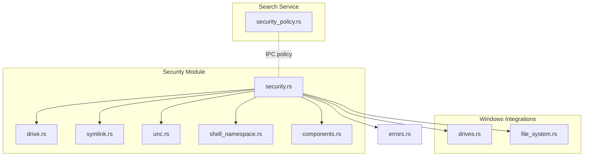
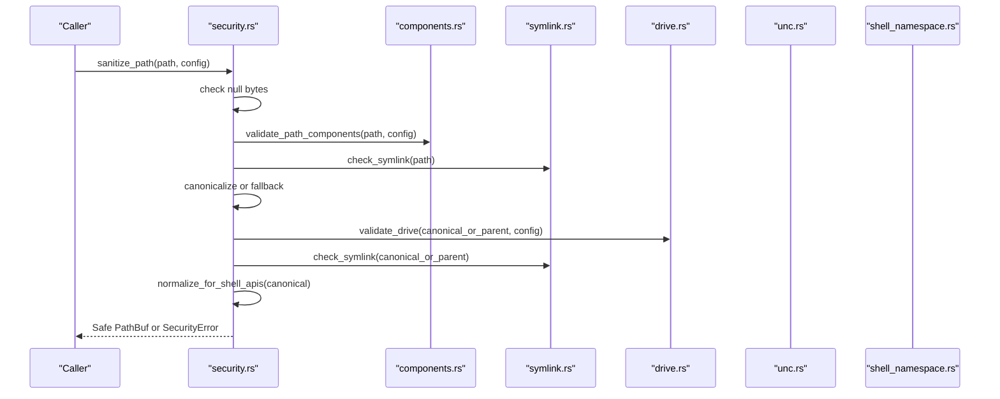
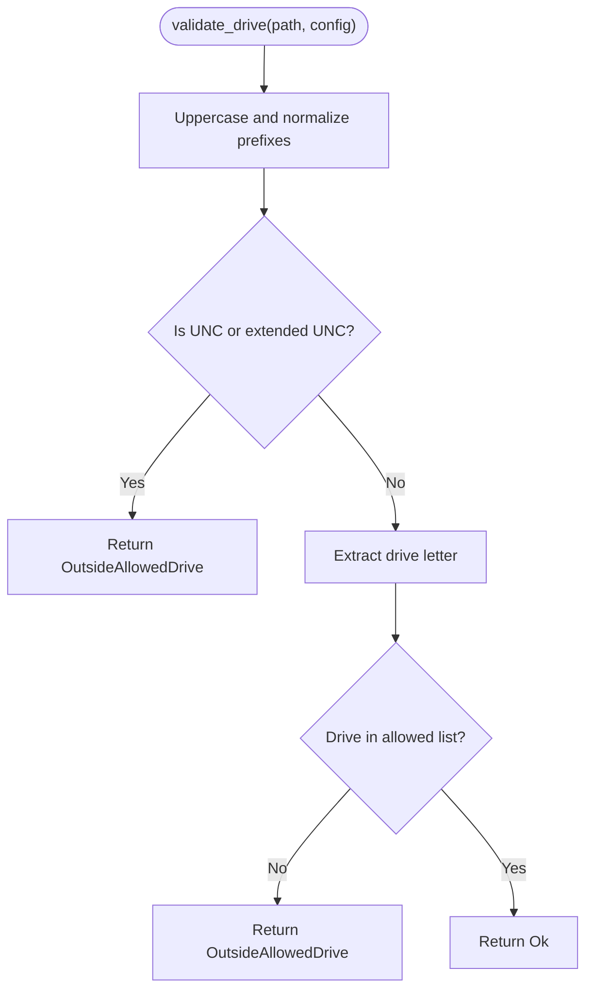
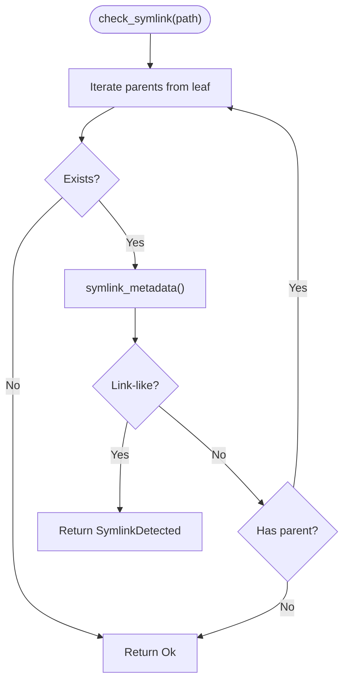
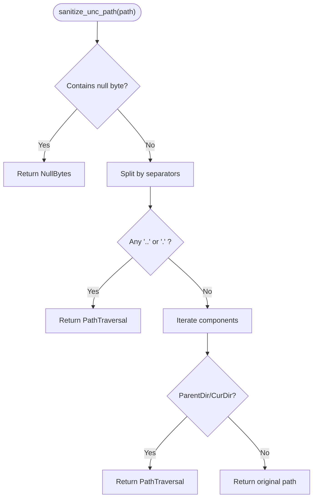
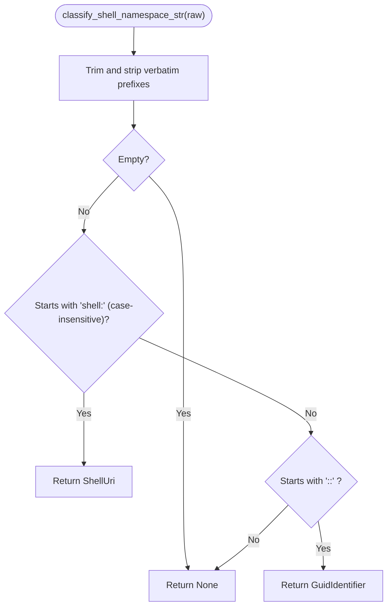
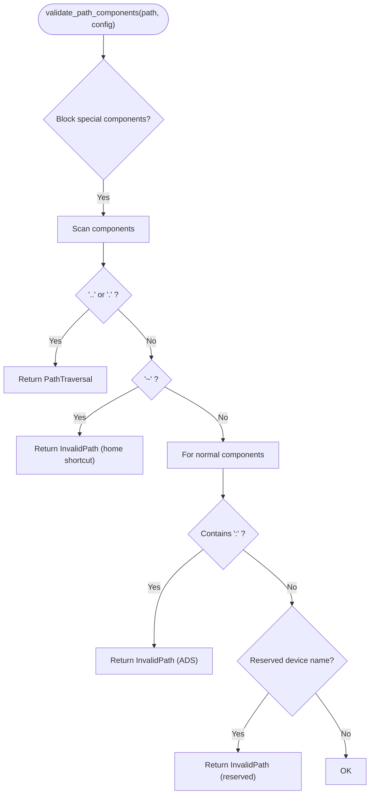
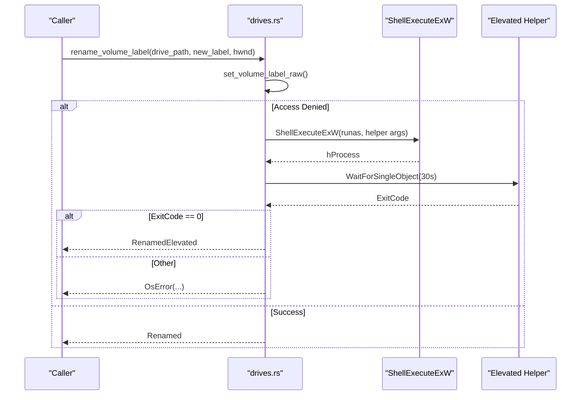
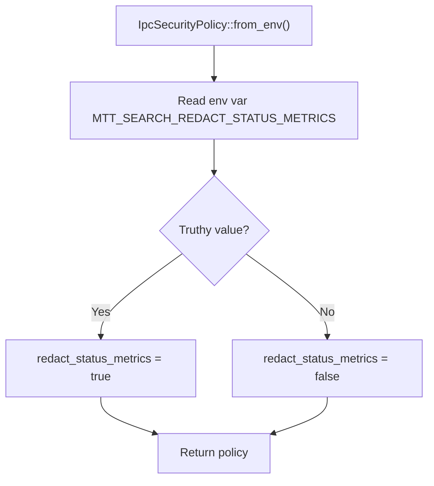
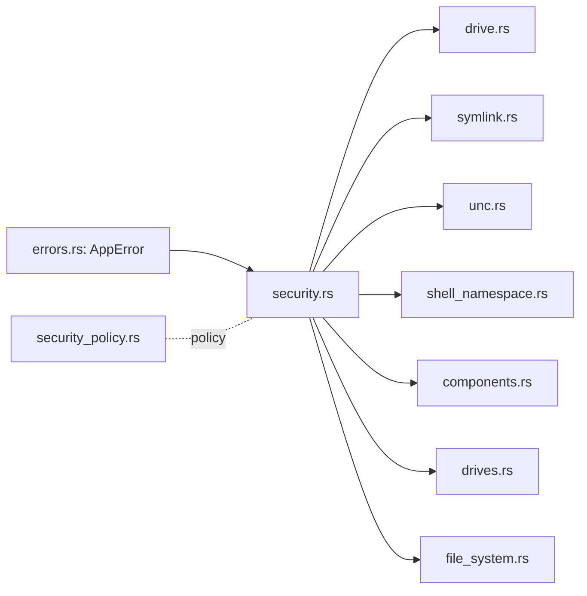

# Security & Permissions

<cite>
**Referenced Files in This Document**
- [security.rs](file://src/infrastructure/security.rs)
- [drive.rs](file://src/infrastructure/security/drive.rs)
- [symlink.rs](file://src/infrastructure/security/symlink.rs)
- [unc.rs](file://src/infrastructure/security/unc.rs)
- [shell_namespace.rs](file://src/infrastructure/security/shell_namespace.rs)
- [components.rs](file://src/infrastructure/security/components.rs)
- [drives.rs](file://src/infrastructure/windows/drives.rs)
- [file_system.rs](file://src/infrastructure/windows/file_system.rs)
- [security_policy.rs](file://crates/mtt-search-service/src/security_policy.rs)
- [errors.rs](file://src/domain/errors.rs)
- [security_verify.ps1](file://security_verify.ps1)
</cite>

## Table of Contents
1. [Introduction](#introduction)
2. [Project Structure](#project-structure)
3. [Core Components](#core-components)
4. [Architecture Overview](#architecture-overview)
5. [Detailed Component Analysis](#detailed-component-analysis)
6. [Dependency Analysis](#dependency-analysis)
7. [Performance Considerations](#performance-considerations)
8. [Troubleshooting Guide](#troubleshooting-guide)
9. [Conclusion](#conclusion)

## Introduction
This document explains how MTT File Manager enforces security and permissions across path validation, drive access control, symlink and reparse-point safety, UNC path handling, and Shell namespace boundaries. It also covers component isolation, privilege escalation handling for sensitive operations, and secure file operation patterns. The goal is to help developers and operators configure and operate the application securely, especially in environments with restricted directories, network shares, and varying user permissions.

## Project Structure
Security-related logic is primarily implemented in a dedicated module under infrastructure/security and integrated with Windows-specific utilities for drive and filesystem operations. Search service IPC policies are enforced separately to control telemetry exposure.

**Diagram sources**
- [security.rs:1-372](file://src/infrastructure/security.rs#L1-L372)
- [drive.rs:1-102](file://src/infrastructure/security/drive.rs#L1-L102)
- [symlink.rs:1-43](file://src/infrastructure/security/symlink.rs#L1-L43)
- [unc.rs:1-32](file://src/infrastructure/security/unc.rs#L1-L32)
- [shell_namespace.rs:1-84](file://src/infrastructure/security/shell_namespace.rs#L1-L84)
- [components.rs:1-117](file://src/infrastructure/security/components.rs#L1-L117)
- [drives.rs:1-550](file://src/infrastructure/windows/drives.rs#L1-L550)
- [file_system.rs:1-43](file://src/infrastructure/windows/file_system.rs#L1-L43)
- [security_policy.rs:1-52](file://crates/mtt-search-service/src/security_policy.rs#L1-L52)
- [errors.rs:1-180](file://src/domain/errors.rs#L1-L180)

**Section sources**
- [security.rs:1-372](file://src/infrastructure/security.rs#L1-L372)
- [drives.rs:1-550](file://src/infrastructure/windows/drives.rs#L1-L550)
- [security_policy.rs:1-52](file://crates/mtt-search-service/src/security_policy.rs#L1-L52)

## Core Components
- Path sanitizer and validator: central function that applies multiple security checks, canonicalizes paths when possible, and normalizes Windows prefixes for Shell compatibility.
- Drive access control: validates that paths belong to configured allowed drives and rejects UNC paths by default.
- Symlink and reparse-point detection: checks for links/junctions/mount points along the path before canonicalization to prevent bypassing restrictions.
- UNC path sanitizer: blocks null bytes and path traversal attempts in network paths.
- Shell namespace classifier: distinguishes explicit Shell URI/GUID identifiers from filesystem paths.
- Windows drive and filesystem utilities: provide privileged operations (e.g., volume label rename) with controlled elevation and robust argument quoting.
- IPC security policy: controls whether status metrics are exposed to clients via the search service IPC channel.

Key configuration and error types are defined centrally to ensure consistent enforcement across the application.

**Section sources**
- [security.rs:36-63](file://src/infrastructure/security.rs#L36-L63)
- [security.rs:17-34](file://src/infrastructure/security.rs#L17-L34)
- [drives.rs:26-55](file://src/infrastructure/windows/drives.rs#L26-L55)
- [security_policy.rs:1-16](file://crates/mtt-search-service/src/security_policy.rs#L1-L16)

## Architecture Overview
The security architecture separates concerns into:
- Input sanitization and validation (path, UNC, components, symlinks)
- Drive and filesystem boundary enforcement
- Shell namespace boundary enforcement
- Privilege escalation for sensitive operations
- IPC policy for telemetry exposure

**Diagram sources**
- [security.rs:66-121](file://src/infrastructure/security.rs#L66-L121)
- [components.rs:41-86](file://src/infrastructure/security/components.rs#L41-L86)
- [symlink.rs:6-26](file://src/infrastructure/security/symlink.rs#L6-L26)
- [drive.rs:72-101](file://src/infrastructure/security/drive.rs#L72-L101)
- [unc.rs:6-31](file://src/infrastructure/security/unc.rs#L6-L31)
- [shell_namespace.rs:19-47](file://src/infrastructure/security/shell_namespace.rs#L19-L47)

## Detailed Component Analysis

### Drive Access Control
- Allowed drives list: restricts local drive operations to configured letters.
- UNC rejection: extended UNC and server/share forms are rejected by default to prevent network path bypass.
- Prefix normalization: strips verbatim prefixes for Shell API compatibility.
- Local drive fallback: for virtual drives, the system can validate absolute X:\ paths without strict canonicalization.

**Diagram sources**
- [drive.rs:72-101](file://src/infrastructure/security/drive.rs#L72-L101)

**Section sources**
- [drive.rs:28-33](file://src/infrastructure/security/drive.rs#L28-L33)
- [drive.rs:54-69](file://src/infrastructure/security/drive.rs#L54-L69)
- [drive.rs:72-101](file://src/infrastructure/security/drive.rs#L72-L101)
- [security.rs:127-158](file://src/infrastructure/security.rs#L127-L158)

### Symlink Resolution and Safety Measures
- Pre-canonicalization checks: reparse points (symlinks, junctions, mount points) are detected on the original path before canonicalization to prevent attackers from hiding targets behind links.
- Cross-platform detection: Windows uses reparse point attributes; Unix uses symlink type detection.
- Configurable allowance: when symlinks are disallowed, any link-like path triggers a security error.

**Diagram sources**
- [symlink.rs:6-26](file://src/infrastructure/security/symlink.rs#L6-L26)
- [symlink.rs:28-42](file://src/infrastructure/security/symlink.rs#L28-L42)

**Section sources**
- [symlink.rs:6-26](file://src/infrastructure/security/symlink.rs#L6-L26)
- [security.rs:76-84](file://src/infrastructure/security.rs#L76-L84)

### UNC Path Handling and Network Security
- Null byte detection: immediately blocks paths containing null bytes.
- Traversal detection: rejects segments and components that indicate path traversal.
- Acceptance: valid UNC paths (including IP-based) are permitted after checks.

**Diagram sources**
- [unc.rs:6-31](file://src/infrastructure/security/unc.rs#L6-L31)

**Section sources**
- [unc.rs:6-31](file://src/infrastructure/security/unc.rs#L6-L31)
- [security.rs:175-178](file://src/infrastructure/security.rs#L175-L178)

### Shell Namespace Security Boundaries
- Explicit classification: only Shell URIs (shell:) and GUID identifiers (::...) are accepted; regular filesystem paths are rejected to avoid ambiguous heuristics.
- Prefix stripping: verbatim prefixes are removed during normalization to ensure consistent parsing.

**Diagram sources**
- [shell_namespace.rs:19-47](file://src/infrastructure/security/shell_namespace.rs#L19-L47)

**Section sources**
- [shell_namespace.rs:4-8](file://src/infrastructure/security/shell_namespace.rs#L4-L8)
- [shell_namespace.rs:19-47](file://src/infrastructure/security/shell_namespace.rs#L19-L47)

### Component Isolation Patterns and Secure File Operations
- Component-level validation: blocks special components, tilde shortcuts, NTFS alternate data streams, and reserved device names.
- NFC normalization on Windows: ensures consistent Unicode representation for path components.
- Safe canonicalization fallback: when a path does not exist, validation is performed against the canonical parent to prevent bypassing restrictions.
- Shell API compatibility: verbatim prefixes are normalized for Shell operations.

**Diagram sources**
- [components.rs:41-86](file://src/infrastructure/security/components.rs#L41-L86)
- [components.rs:88-117](file://src/infrastructure/security/components.rs#L88-L117)

**Section sources**
- [components.rs:41-86](file://src/infrastructure/security/components.rs#L41-L86)
- [components.rs:88-117](file://src/infrastructure/security/components.rs#L88-L117)
- [security.rs:66-121](file://src/infrastructure/security.rs#L66-L121)

### Privilege Escalation Handling
- Volume label rename: attempts direct rename; on access denied, launches an elevated helper with argument quoting and a timeout to avoid hangs.
- Argument quoting: handles spaces and quotes safely to prevent injection.
- Outcome reporting: distinguishes between direct success, elevated success, and various error conditions.

**Diagram sources**
- [drives.rs:278-300](file://src/infrastructure/windows/drives.rs#L278-L300)
- [drives.rs:193-276](file://src/infrastructure/windows/drives.rs#L193-L276)
- [drives.rs:112-152](file://src/infrastructure/windows/drives.rs#L112-L152)

**Section sources**
- [drives.rs:278-300](file://src/infrastructure/windows/drives.rs#L278-L300)
- [drives.rs:193-276](file://src/infrastructure/windows/drives.rs#L193-L276)
- [drives.rs:112-152](file://src/infrastructure/windows/drives.rs#L112-L152)

### Security Policy Enforcement and IPC Controls
- IPC policy: controls whether per-volume status metrics (counts and index states) are exposed to clients; defaults to exposing them unless explicitly redacted via environment variable.
- Environment-driven toggles: supports common truthy values for enabling redaction.

**Diagram sources**
- [security_policy.rs:11-16](file://crates/mtt-search-service/src/security_policy.rs#L11-L16)
- [security_policy.rs:18-26](file://crates/mtt-search-service/src/security_policy.rs#L18-L26)

**Section sources**
- [security_policy.rs:1-16](file://crates/mtt-search-service/src/security_policy.rs#L1-L16)
- [security_policy.rs:18-26](file://crates/mtt-search-service/src/security_policy.rs#L18-L26)

## Dependency Analysis
- The security module composes multiple specialized validators and normalizers, ensuring layered checks.
- Windows integrations provide privileged operations with explicit elevation and robust argument handling.
- Error propagation channels security errors into the centralized application error type.

**Diagram sources**
- [errors.rs:7-39](file://src/domain/errors.rs#L7-L39)
- [security.rs:1-12](file://src/infrastructure/security.rs#L1-L12)
- [drives.rs:1-24](file://src/infrastructure/windows/drives.rs#L1-L24)
- [file_system.rs:1-6](file://src/infrastructure/windows/file_system.rs#L1-L6)
- [security_policy.rs:1-4](file://crates/mtt-search-service/src/security_policy.rs#L1-L4)

**Section sources**
- [errors.rs:7-39](file://src/domain/errors.rs#L7-L39)
- [security.rs:1-12](file://src/infrastructure/security.rs#L1-L12)

## Performance Considerations
- Canonicalization cost: the sanitizer attempts canonicalization; when unavailable (e.g., virtual drives), a lexical fallback reduces overhead while preserving security checks.
- Fast-path checks: null-byte and component-level validations short-circuit expensive operations.
- Windows-specific optimizations: verbatim prefix stripping and Shell-compatible normalization reduce API failures and retries.

[No sources needed since this section provides general guidance]

## Troubleshooting Guide
Common scenarios and resolutions:
- Path traversal blocked: ensure paths do not contain parent/current directory segments or equivalent encodings.
- ADS not allowed: remove alternate data stream suffixes from filenames.
- Reserved device names: avoid names like CON, PRN, AUX, NUL, COM1–9, LPT1–9.
- Symlink detected: enable symlink allowance only if you trust the source and understand the risk.
- UNC path rejected: verify the path contains no null bytes or traversal segments.
- Drive outside allowed list: adjust configuration to include the intended drive.
- Privileged operation denied: confirm the process has sufficient rights; elevation is attempted automatically for supported operations.

Verification commands:
- Run the security verification suite to exercise unit tests for security paths and IPC policy.

**Section sources**
- [security.rs:180-372](file://src/infrastructure/security.rs#L180-L372)
- [security_verify.ps1:1-23](file://security_verify.ps1#L1-L23)

## Conclusion
MTT File Manager’s security model combines layered input validation, strict drive and UNC checks, symlink-aware canonicalization, and explicit Shell namespace boundaries. Windows integrations enforce privilege boundaries with controlled elevation and robust argument handling. The IPC policy provides operational control over telemetry exposure. Together, these mechanisms form a cohesive, configurable security posture suitable for diverse deployment environments.