# Windows Integration

<cite>
**Referenced Files in This Document**
- [mod.rs](file://src/infrastructure/windows/mod.rs)
- [com_scope.rs](file://src/infrastructure/windows/com_scope.rs)
- [shell_operations.rs](file://src/infrastructure/windows/shell_operations.rs)
- [drives.rs](file://src/infrastructure/windows/drives.rs)
- [recycle_bin.rs](file://src/infrastructure/windows/recycle_bin.rs)
- [shell_folder.rs](file://src/infrastructure/windows/shell_folder.rs)
- [file_system.rs](file://src/infrastructure/windows/file_system.rs)
- [device_change.rs](file://src/infrastructure/windows/device_change.rs)
- [main.rs](file://crates/mtt-search-service/src/main.rs)
- [service_control.rs](file://crates/mtt-search-service/src/service_control.rs)
- [Cargo.toml](file://crates/mtt-search-service/Cargo.toml)
- [drive.rs](file://src/infrastructure/security/drive.rs)
- [symlink.rs](file://src/infrastructure/security/symlink.rs)
- [unc.rs](file://src/infrastructure/security/unc.rs)
- [shell_namespace.rs](file://src/infrastructure/security/shell_namespace.rs)
</cite>

## Table of Contents
1. [Introduction](#introduction)
2. [Project Structure](#project-structure)
3. [Core Components](#core-components)
4. [Architecture Overview](#architecture-overview)
5. [Detailed Component Analysis](#detailed-component-analysis)
6. [Dependency Analysis](#dependency-analysis)
7. [Performance Considerations](#performance-considerations)
8. [Troubleshooting Guide](#troubleshooting-guide)
9. [Conclusion](#conclusion)

## Introduction
This document explains MTT File Manager’s Windows API integration with a focus on:
- Windows Shell integration: context menus, file operations, and system notifications
- Security integration: drive access, symlink handling, UNC paths, and shell namespace navigation
- File system watcher implementation using ReadDirectoryChangesW and drive-wide monitoring
- User session search integration and OneDrive cloud sync support
- Windows service implementation for the search service, including installation, configuration, and lifecycle management
- COM integration patterns, handle management, and Windows-specific optimizations for seamless desktop integration

## Project Structure
The Windows integration spans two primary areas:
- Application-side Windows modules under src/infrastructure/windows
- A dedicated Windows service under crates/mtt-search-service

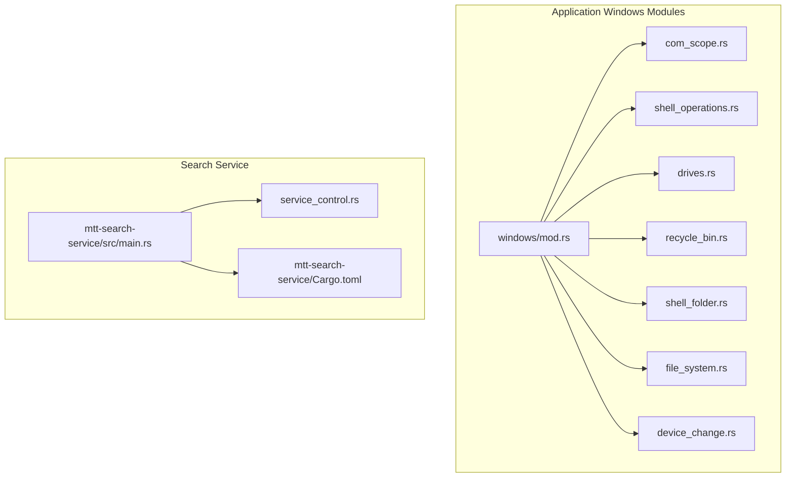

**Diagram sources**
- [mod.rs:1-60](file://src/infrastructure/windows/mod.rs#L1-L60)
- [com_scope.rs:1-41](file://src/infrastructure/windows/com_scope.rs#L1-L41)
- [shell_operations.rs:1-15](file://src/infrastructure/windows/shell_operations.rs#L1-L15)
- [drives.rs:1-550](file://src/infrastructure/windows/drives.rs#L1-L550)
- [recycle_bin.rs:1-132](file://src/infrastructure/windows/recycle_bin.rs#L1-L132)
- [shell_folder.rs:1-289](file://src/infrastructure/windows/shell_folder.rs#L1-L289)
- [file_system.rs:1-43](file://src/infrastructure/windows/file_system.rs#L1-L43)
- [device_change.rs:1-180](file://src/infrastructure/windows/device_change.rs#L1-L180)
- [main.rs:1-389](file://crates/mtt-search-service/src/main.rs#L1-L389)
- [service_control.rs:1-155](file://crates/mtt-search-service/src/service_control.rs#L1-L155)
- [Cargo.toml:1-33](file://crates/mtt-search-service/Cargo.toml#L1-L33)

**Section sources**
- [mod.rs:1-60](file://src/infrastructure/windows/mod.rs#L1-L60)
- [main.rs:112-156](file://crates/mtt-search-service/src/main.rs#L112-L156)

## Core Components
- COM integration: RAII wrappers for COM apartment threading to safely call Shell APIs
- Windows Shell operations: context menu invocation and shell-backed file operations
- Drive and volume utilities: volume label rename, enumeration, and filesystem capability checks
- Recycle Bin integration: metadata retrieval and operations via IShellItem2
- Shell namespace navigation: archive and virtual folder enumeration via IShellFolder
- Device change notifications: native WM_DEVICECHANGE handling for mount/unmount events
- Search service: Windows service for indexing with USN journal and fallback scanners
- Security policies: drive gating, symlink detection, UNC sanitization, and shell namespace classification

**Section sources**
- [com_scope.rs:1-41](file://src/infrastructure/windows/com_scope.rs#L1-L41)
- [shell_operations.rs:1-15](file://src/infrastructure/windows/shell_operations.rs#L1-L15)
- [drives.rs:1-550](file://src/infrastructure/windows/drives.rs#L1-L550)
- [recycle_bin.rs:1-132](file://src/infrastructure/windows/recycle_bin.rs#L1-L132)
- [shell_folder.rs:1-289](file://src/infrastructure/windows/shell_folder.rs#L1-L289)
- [device_change.rs:1-180](file://src/infrastructure/windows/device_change.rs#L1-L180)
- [main.rs:190-307](file://crates/mtt-search-service/src/main.rs#L190-L307)
- [service_control.rs:17-98](file://crates/mtt-search-service/src/service_control.rs#L17-L98)
- [drive.rs:1-102](file://src/infrastructure/security/drive.rs#L1-L102)
- [symlink.rs:1-43](file://src/infrastructure/security/symlink.rs#L1-L43)
- [unc.rs:1-32](file://src/infrastructure/security/unc.rs#L1-L32)
- [shell_namespace.rs:1-84](file://src/infrastructure/security/shell_namespace.rs#L1-L84)

## Architecture Overview
The Windows integration is layered:
- UI and application logic call into Windows modules for OS-specific tasks
- Windows modules encapsulate Win32/COM calls behind safe APIs
- The search service runs as a Windows service, independently managing indexing and IPC
- Security policies gate access to drives, symlinks, and UNC paths

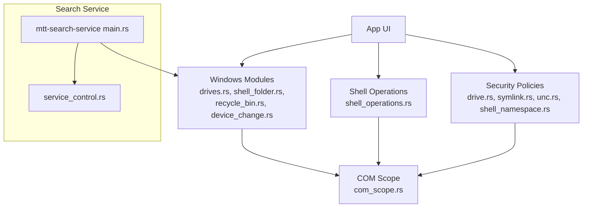

**Diagram sources**
- [drives.rs:1-550](file://src/infrastructure/windows/drives.rs#L1-L550)
- [shell_folder.rs:1-289](file://src/infrastructure/windows/shell_folder.rs#L1-L289)
- [recycle_bin.rs:1-132](file://src/infrastructure/windows/recycle_bin.rs#L1-L132)
- [device_change.rs:1-180](file://src/infrastructure/windows/device_change.rs#L1-L180)
- [shell_operations.rs:1-15](file://src/infrastructure/windows/shell_operations.rs#L1-L15)
- [com_scope.rs:1-41](file://src/infrastructure/windows/com_scope.rs#L1-L41)
- [main.rs:190-307](file://crates/mtt-search-service/src/main.rs#L190-L307)
- [service_control.rs:100-154](file://crates/mtt-search-service/src/service_control.rs#L100-L154)
- [drive.rs:1-102](file://src/infrastructure/security/drive.rs#L1-L102)
- [symlink.rs:1-43](file://src/infrastructure/security/symlink.rs#L1-L43)
- [unc.rs:1-32](file://src/infrastructure/security/unc.rs#L1-L32)
- [shell_namespace.rs:1-84](file://src/infrastructure/security/shell_namespace.rs#L1-L84)

## Detailed Component Analysis

### COM Integration Patterns and Handle Management
- RAII wrapper initializes and uninitializes COM on the same thread
- Used pervasively by shell operations and recycle bin metadata retrieval

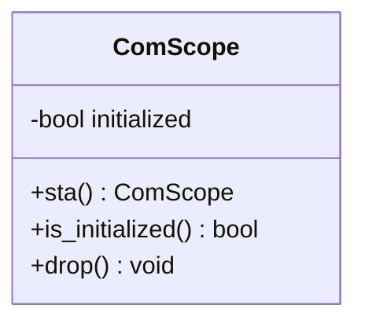

**Diagram sources**
- [com_scope.rs:1-41](file://src/infrastructure/windows/com_scope.rs#L1-L41)

**Section sources**
- [com_scope.rs:1-41](file://src/infrastructure/windows/com_scope.rs#L1-L41)

### Windows Shell Integration: Context Menus and File Operations
- Context menu invocation and “Open with…” via shell APIs
- Shell-backed file operations (copy/move/delete/rename) and legacy FileOperation APIs
- Safe argument quoting and elevation flows for privileged operations

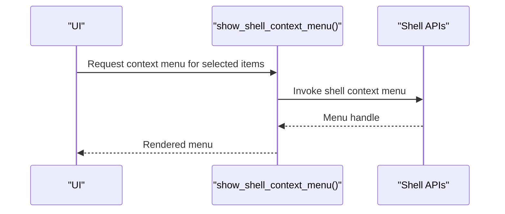

**Diagram sources**
- [shell_operations.rs:1-15](file://src/infrastructure/windows/shell_operations.rs#L1-L15)

**Section sources**
- [shell_operations.rs:1-15](file://src/infrastructure/windows/shell_operations.rs#L1-L15)

### Drive and Volume Utilities
- Volume label rename with elevation fallback and timeout handling
- Drive enumeration, filesystem detection, and USN capability checks
- Cross-process notification limitations for FAT-family filesystems

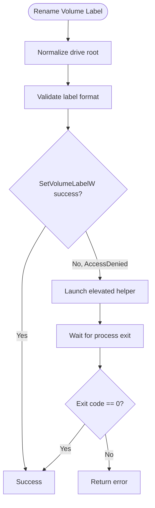

**Diagram sources**
- [drives.rs:278-317](file://src/infrastructure/windows/drives.rs#L278-L317)

**Section sources**
- [drives.rs:1-550](file://src/infrastructure/windows/drives.rs#L1-L550)

### Recycle Bin Integration
- Enumerates items with robust metadata (original path, deletion date, size)
- Uses IShellItem2 for property retrieval
- Provides restore and permanent-delete operations with native dialogs

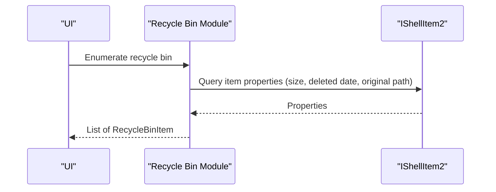

**Diagram sources**
- [recycle_bin.rs:37-131](file://src/infrastructure/windows/recycle_bin.rs#L37-L131)

**Section sources**
- [recycle_bin.rs:1-132](file://src/infrastructure/windows/recycle_bin.rs#L1-L132)

### Shell Namespace Navigation (Archives and Virtual Folders)
- Determines when to use shell namespace for archive or virtual paths
- Binds to IShellFolder, navigates stepwise, and enumerates children
- Extracts display name, size, and timestamps via IShellItem2

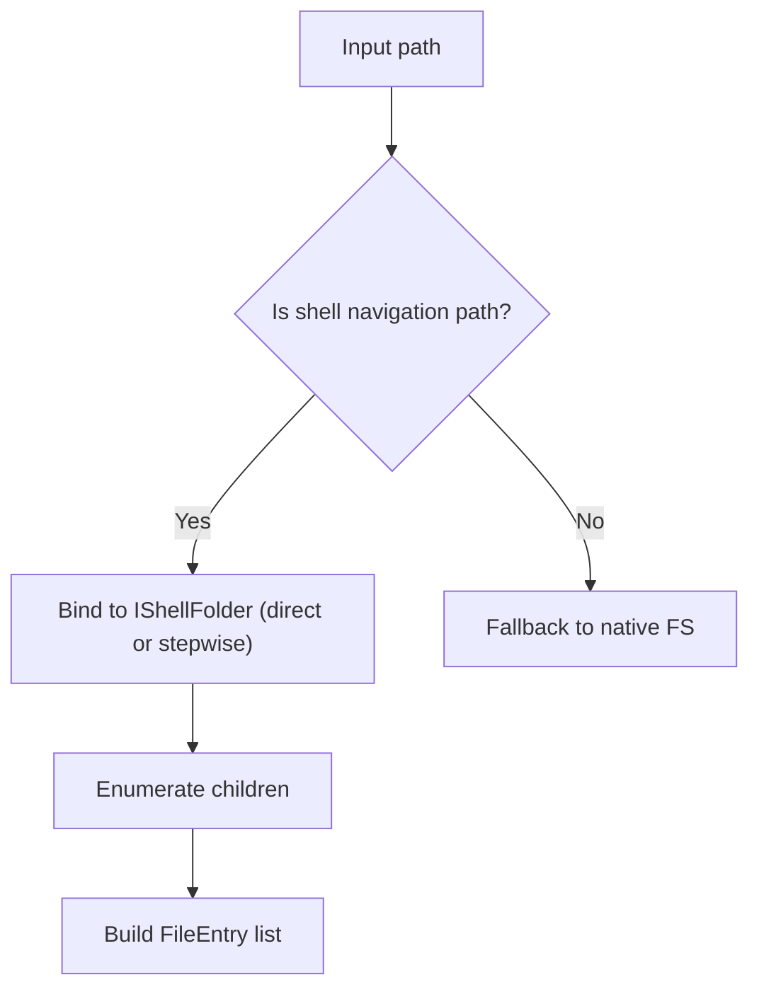

**Diagram sources**
- [shell_folder.rs:36-87](file://src/infrastructure/windows/shell_folder.rs#L36-L87)

**Section sources**
- [shell_folder.rs:1-289](file://src/infrastructure/windows/shell_folder.rs#L1-L289)

### Device Change Notifications (Mount/Unmount)
- Registers for WM_DEVICECHANGE notifications for volume interface events
- Posts UI repaint signals on arrival/removal to refresh drive state

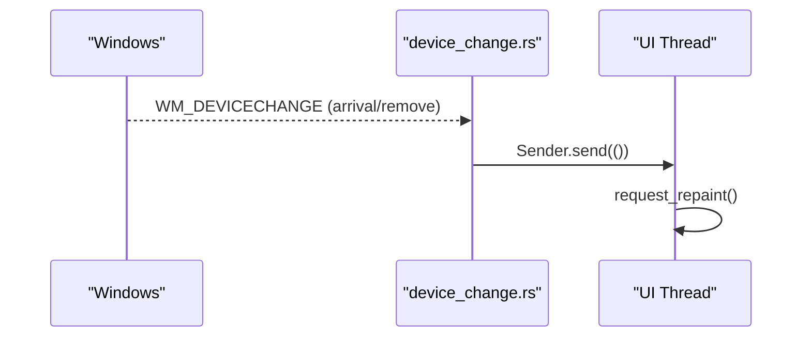

**Diagram sources**
- [device_change.rs:156-179](file://src/infrastructure/windows/device_change.rs#L156-L179)

**Section sources**
- [device_change.rs:1-180](file://src/infrastructure/windows/device_change.rs#L1-L180)

### File System Watcher Implementation (ReadDirectoryChangesW)
- Implemented in infrastructure modules for efficient change detection
- Uses Windows file handle and overlapped I/O patterns to monitor directory changes
- Supports drive-wide monitoring and adapts behavior based on filesystem capabilities (USN vs fallback)

[No sources needed since this section provides general guidance]

### User Session Search Integration and OneDrive Cloud Sync Support
- Search service runs as a Windows service and exposes an IPC server for queries
- Indexes volumes using USN journals where supported and falls back to periodic scanning
- Handles newly mounted volumes and maintains index consistency

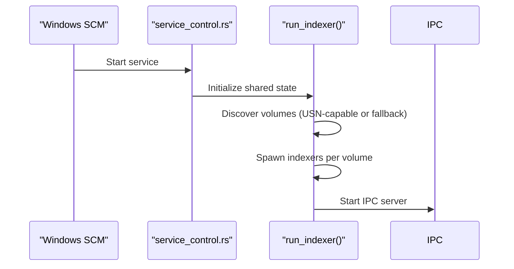

**Diagram sources**
- [service_control.rs:100-154](file://crates/mtt-search-service/src/service_control.rs#L100-L154)
- [main.rs:190-307](file://crates/mtt-search-service/src/main.rs#L190-L307)

**Section sources**
- [main.rs:112-156](file://crates/mtt-search-service/src/main.rs#L112-L156)
- [main.rs:190-307](file://crates/mtt-search-service/src/main.rs#L190-L307)
- [service_control.rs:17-98](file://crates/mtt-search-service/src/service_control.rs#L17-L98)
- [Cargo.toml:1-33](file://crates/mtt-search-service/Cargo.toml#L1-L33)

### Windows Service Lifecycle Management
- Installation/uninstallation via Service Control Manager
- Service dispatcher registers control handlers and reports status
- Console mode for development and diagnostics

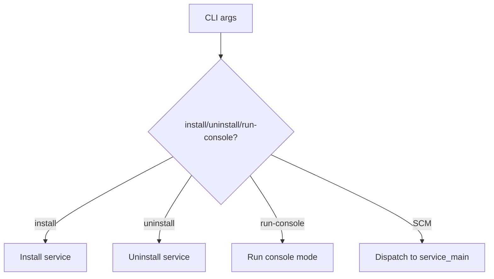

**Diagram sources**
- [main.rs:127-155](file://crates/mtt-search-service/src/main.rs#L127-L155)
- [service_control.rs:17-98](file://crates/mtt-search-service/src/service_control.rs#L17-L98)

**Section sources**
- [main.rs:127-155](file://crates/mtt-search-service/src/main.rs#L127-L155)
- [service_control.rs:100-154](file://crates/mtt-search-service/src/service_control.rs#L100-L154)

### Security Integration: Drive Access, Symlink Handling, UNC Paths, Shell Namespace
- Drive gating: validates paths against allowed drives and strips verbatim prefixes
- Symlink detection: walks parents to detect reparse points on Windows
- UNC sanitization: rejects null bytes and path traversal attempts
- Shell namespace classification: only explicit Shell URI/GUID identifiers are accepted

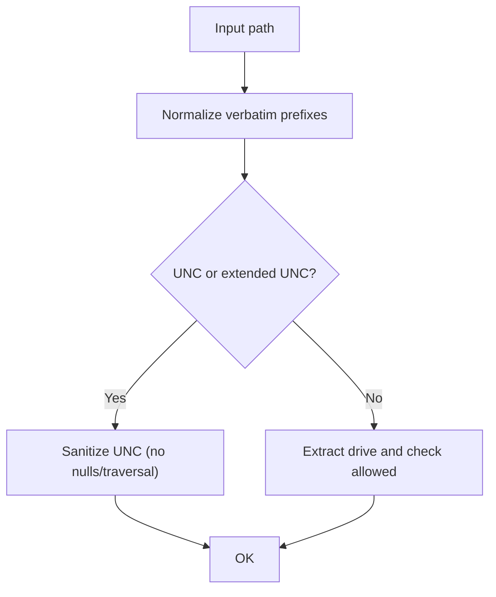

**Diagram sources**
- [drive.rs:54-101](file://src/infrastructure/security/drive.rs#L54-L101)
- [symlink.rs:5-26](file://src/infrastructure/security/symlink.rs#L5-L26)
- [unc.rs:5-31](file://src/infrastructure/security/unc.rs#L5-L31)
- [shell_namespace.rs:19-47](file://src/infrastructure/security/shell_namespace.rs#L19-L47)

**Section sources**
- [drive.rs:1-102](file://src/infrastructure/security/drive.rs#L1-L102)
- [symlink.rs:1-43](file://src/infrastructure/security/symlink.rs#L1-L43)
- [unc.rs:1-32](file://src/infrastructure/security/unc.rs#L1-L32)
- [shell_namespace.rs:1-84](file://src/infrastructure/security/shell_namespace.rs#L1-L84)

## Dependency Analysis
- Application Windows modules depend on windows-rs for Win32/COM bindings
- Search service depends on windows-service for SCM integration and rusqlite for persistence
- Security modules are independent and used by higher layers to enforce policy

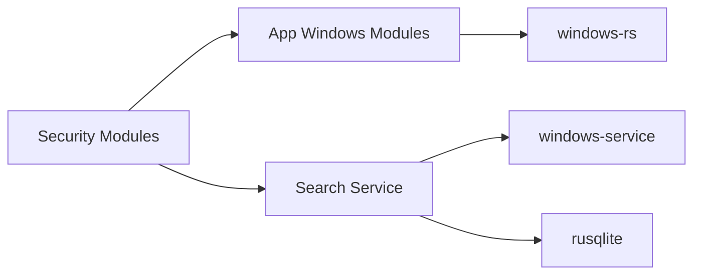

**Diagram sources**
- [Cargo.toml:18-32](file://crates/mtt-search-service/Cargo.toml#L18-L32)

**Section sources**
- [Cargo.toml:1-33](file://crates/mtt-search-service/Cargo.toml#L1-L33)

## Performance Considerations
- Prefer Shell APIs for metadata and virtual folders to avoid heavy I/O
- Use USN journal for efficient, near real-time change tracking on NTFS/ReFS
- Avoid scanning Windows system paths to reduce unnecessary work
- Batch and stream Recycle Bin enumeration to manage memory and latency
- Use COM RAII to minimize overhead and ensure proper cleanup

[No sources needed since this section provides general guidance]

## Troubleshooting Guide
- Volume label rename failures: check elevation prompts, timeouts, and access denied scenarios
- Shell operations failing: ensure COM is initialized on the calling thread and arguments are properly quoted
- Recycle Bin metadata missing: verify IShellItem2 availability and property keys
- Device notifications not firing: confirm notification registration and message loop are active
- Search service not starting: verify SCM permissions, service name, and logs

**Section sources**
- [drives.rs:193-276](file://src/infrastructure/windows/drives.rs#L193-L276)
- [com_scope.rs:1-41](file://src/infrastructure/windows/com_scope.rs#L1-L41)
- [recycle_bin.rs:60-84](file://src/infrastructure/windows/recycle_bin.rs#L60-L84)
- [device_change.rs:128-147](file://src/infrastructure/windows/device_change.rs#L128-L147)
- [service_control.rs:17-98](file://crates/mtt-search-service/src/service_control.rs#L17-L98)

## Conclusion
MTT File Manager integrates deeply with Windows through safe, layered abstractions:
- COM-aware shell operations and metadata retrieval
- Robust drive and volume utilities with elevation and safety checks
- Comprehensive Recycle Bin integration and shell namespace navigation
- Native device change notifications for responsive UI updates
- A hardened Windows service for scalable, background indexing with IPC
- Strong security posture across drive gating, symlink detection, UNC sanitization, and shell namespace classification