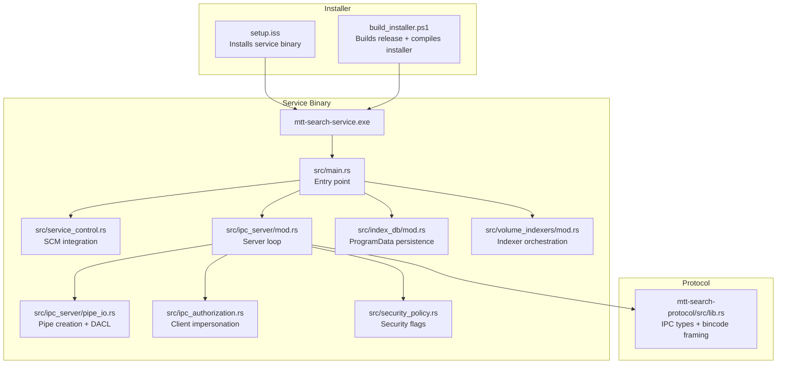
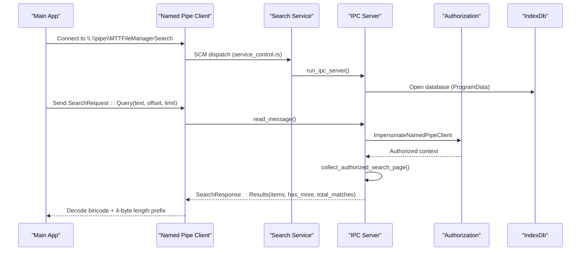
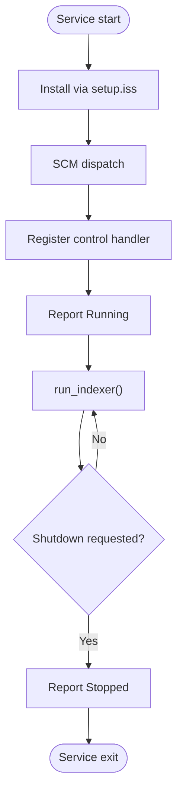
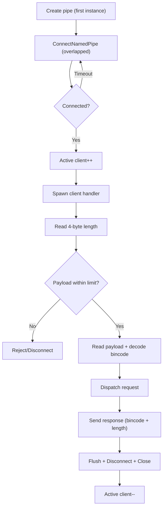
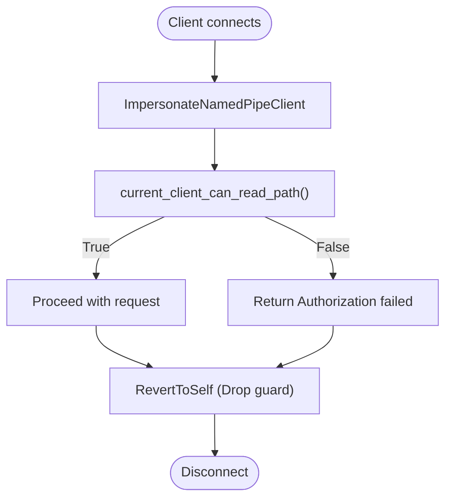
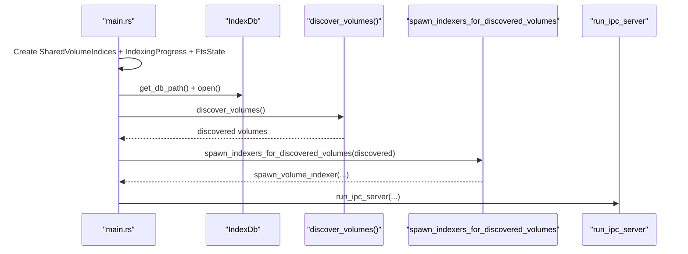
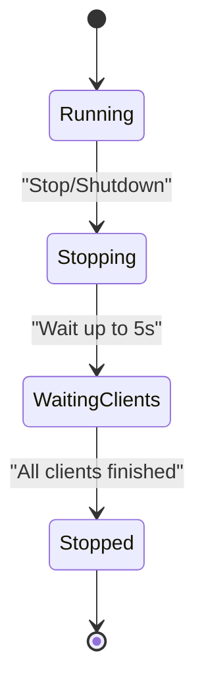
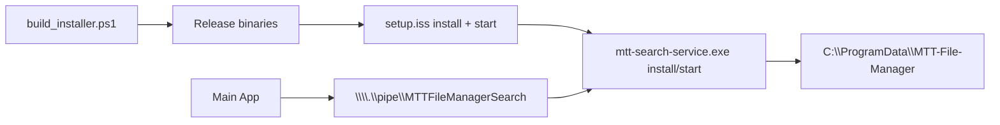
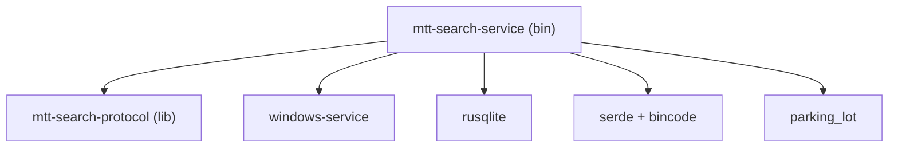

# Windows Service Implementation

<cite>
**Referenced Files in This Document**
- [main.rs](file://crates/mtt-search-service/src/main.rs)
- [service_control.rs](file://crates/mtt-search-service/src/service_control.rs)
- [ipc_server/mod.rs](file://crates/mtt-search-service/src/ipc_server/mod.rs)
- [ipc_server/handler.rs](file://crates/mtt-search-service/src/ipc_server/handler.rs)
- [ipc_server/pipe_io.rs](file://crates/mtt-search-service/src/ipc_server/pipe_io.rs)
- [ipc_authorization.rs](file://crates/mtt-search-service/src/ipc_authorization.rs)
- [security_policy.rs](file://crates/mtt-search-service/src/security_policy.rs)
- [index_db/mod.rs](file://crates/mtt-search-service/src/index_db/mod.rs)
- [volume_indexers/mod.rs](file://crates/mtt-search-service/src/volume_indexers/mod.rs)
- [Cargo.toml](file://crates/mtt-search-service/Cargo.toml)
- [lib.rs](file://crates/mtt-search-protocol/src/lib.rs)
- [setup.iss](file://installer/setup.iss)
- [build_installer.ps1](file://installer/build_installer.ps1)
- [03_architecture.md](file://docs/03_architecture.md)
- [06_key_flows.md](file://docs/06_key_flows.md)
- [07_storage_config.md](file://docs/07_storage_config.md)
</cite>

## Table of Contents
1. [Introduction](#introduction)
2. [Project Structure](#project-structure)
3. [Core Components](#core-components)
4. [Architecture Overview](#architecture-overview)
5. [Detailed Component Analysis](#detailed-component-analysis)
6. [Dependency Analysis](#dependency-analysis)
7. [Performance Considerations](#performance-considerations)
8. [Troubleshooting Guide](#troubleshooting-guide)
9. [Conclusion](#conclusion)
10. [Appendices](#appendices)

## Introduction
This document explains the Windows Service implementation for the MTT File Manager search subsystem. It covers service registration and lifecycle management via the Windows Service Control Manager (SCM), the IPC server architecture using named pipes with bincode serialization, authorization and security policies, startup sequencing, dependency management, and graceful shutdown. It also documents practical installation and configuration steps, and describes how the main application integrates with the search service process.

## Project Structure
The search service is implemented as a separate Windows service process that the main application communicates with over a named pipe. The service is packaged and installed by the installer, which invokes the service executable with install arguments and starts the service via the SCM.

**Diagram sources**
- [setup.iss:80-88](file://installer/setup.iss#L80-L88)
- [build_installer.ps1:26-38](file://installer/build_installer.ps1#L26-L38)
- [main.rs:112-156](file://crates/mtt-search-service/src/main.rs#L112-L156)
- [service_control.rs:100-154](file://crates/mtt-search-service/src/service_control.rs#L100-L154)
- [ipc_server/mod.rs:34-214](file://crates/mtt-search-service/src/ipc_server/mod.rs#L34-L214)
- [ipc_server/pipe_io.rs:115-187](file://crates/mtt-search-service/src/ipc_server/pipe_io.rs#L115-L187)
- [ipc_authorization.rs:143-269](file://crates/mtt-search-service/src/ipc_authorization.rs#L143-L269)
- [security_policy.rs:1-52](file://crates/mtt-search-service/src/security_policy.rs#L1-L52)
- [index_db/mod.rs:55-77](file://crates/mtt-search-service/src/index_db/mod.rs#L55-L77)
- [volume_indexers/mod.rs:10-27](file://crates/mtt-search-service/src/volume_indexers/mod.rs#L10-L27)
- [lib.rs:1-290](file://crates/mtt-search-protocol/src/lib.rs#L1-L290)

**Section sources**
- [setup.iss:80-88](file://installer/setup.iss#L80-L88)
- [build_installer.ps1:26-38](file://installer/build_installer.ps1#L26-L38)
- [03_architecture.md:229-246](file://docs/03_architecture.md#L229-L246)

## Core Components
- Service entry and lifecycle:
  - Entry point parses subcommands and delegates to service control routines.
  - Service control registers with SCM, handles Stop/Shutdown, reports Running/Stopped states.
- IPC server:
  - Named pipe server loop with overlapped I/O, rate limiting, and watchdog timeouts.
  - Message framing with bincode and 4-byte length prefix.
  - Client authorization via impersonation and ACL checks.
- Persistence and indexing:
  - SQLite database under ProgramData with hardened DACL.
  - Per-volume binary snapshots and SQLite fallback for fast restart.
  - USN journal and fallback full-tree scanning.
- Protocol:
  - Strongly typed requests/responses with validation and limits.

**Section sources**
- [main.rs:112-156](file://crates/mtt-search-service/src/main.rs#L112-L156)
- [service_control.rs:100-154](file://crates/mtt-search-service/src/service_control.rs#L100-L154)
- [ipc_server/mod.rs:34-214](file://crates/mtt-search-service/src/ipc_server/mod.rs#L34-L214)
- [ipc_server/handler.rs:111-440](file://crates/mtt-search-service/src/ipc_server/handler.rs#L111-L440)
- [ipc_server/pipe_io.rs:115-187](file://crates/mtt-search-service/src/ipc_server/pipe_io.rs#L115-L187)
- [ipc_authorization.rs:143-269](file://crates/mtt-search-service/src/ipc_authorization.rs#L143-L269)
- [security_policy.rs:1-52](file://crates/mtt-search-service/src/security_policy.rs#L1-L52)
- [index_db/mod.rs:55-77](file://crates/mtt-search-service/src/index_db/mod.rs#L55-L77)
- [lib.rs:1-290](file://crates/mtt-search-protocol/src/lib.rs#L1-L290)

## Architecture Overview
The main application communicates with the search service over a named pipe. The service runs as a Windows service under LocalSystem, maintains an in-memory index, and serves search queries with authorization enforced per client context.

**Diagram sources**
- [service_control.rs:100-154](file://crates/mtt-search-service/src/service_control.rs#L100-L154)
- [ipc_server/mod.rs:34-214](file://crates/mtt-search-service/src/ipc_server/mod.rs#L34-L214)
- [ipc_server/handler.rs:221-272](file://crates/mtt-search-service/src/ipc_server/handler.rs#L221-L272)
- [ipc_server/pipe_io.rs:189-226](file://crates/mtt-search-service/src/ipc_server/pipe_io.rs#L189-L226)
- [ipc_authorization.rs:143-269](file://crates/mtt-search-service/src/ipc_authorization.rs#L143-L269)
- [index_db/mod.rs:282-385](file://crates/mtt-search-service/src/index_db/mod.rs#L282-L385)
- [lib.rs:165-192](file://crates/mtt-search-protocol/src/lib.rs#L165-L192)

## Detailed Component Analysis

### Service Registration and Lifecycle Management
- Installation:
  - Creates a Windows service with AutoStart and LocalSystem account.
  - Uses windows-service crate to define service info and create via SCM.
- Uninstallation:
  - Stops the service if running, then deletes it.
- Dispatch:
  - SCM starts the service, which registers a control handler for Stop/Shutdown.
  - Reports Running state to SCM, then runs the indexer loop.
  - On shutdown, reports Stopped state.

**Diagram sources**
- [service_control.rs:17-63](file://crates/mtt-search-service/src/service_control.rs#L17-L63)
- [service_control.rs:65-98](file://crates/mtt-search-service/src/service_control.rs#L65-L98)
- [service_control.rs:100-154](file://crates/mtt-search-service/src/service_control.rs#L100-L154)

**Section sources**
- [service_control.rs:17-63](file://crates/mtt-search-service/src/service_control.rs#L17-L63)
- [service_control.rs:65-98](file://crates/mtt-search-service/src/service_control.rs#L65-L98)
- [service_control.rs:100-154](file://crates/mtt-search-service/src/service_control.rs#L100-L154)
- [setup.iss:80-88](file://installer/setup.iss#L80-L88)

### IPC Server Architecture and Message Serialization
- Server loop:
  - Creates the named pipe with FILE_FLAG_FIRST_PIPE_INSTANCE on first instance to prevent squatting.
  - Uses overlapped I/O with ConnectNamedPipe and a timeout loop to accept clients.
  - Enforces maximum active clients and per-connection I/O timeouts to mitigate DoS.
- Message framing:
  - 4-byte little-endian length prefix followed by bincode payload.
  - Decoder enforces payload size limits to prevent OOM.
- Concurrency:
  - Each client handled in a dedicated thread with a watchdog thread to enforce timeouts.

**Diagram sources**
- [ipc_server/mod.rs:54-196](file://crates/mtt-search-service/src/ipc_server/mod.rs#L54-L196)
- [ipc_server/mod.rs:216-274](file://crates/mtt-search-service/src/ipc_server/mod.rs#L216-L274)
- [ipc_server/pipe_io.rs:115-187](file://crates/mtt-search-service/src/ipc_server/pipe_io.rs#L115-L187)
- [lib.rs:165-192](file://crates/mtt-search-protocol/src/lib.rs#L165-L192)

**Section sources**
- [ipc_server/mod.rs:34-214](file://crates/mtt-search-service/src/ipc_server/mod.rs#L34-L214)
- [ipc_server/mod.rs:216-274](file://crates/mtt-search-service/src/ipc_server/mod.rs#L216-L274)
- [ipc_server/pipe_io.rs:115-187](file://crates/mtt-search-service/src/ipc_server/pipe_io.rs#L115-L187)
- [lib.rs:1-290](file://crates/mtt-search-protocol/src/lib.rs#L1-L290)

### Authorization and Security Context Handling
- Client impersonation:
  - Uses ImpersonateNamedPipeClient to assume the client’s security context for ACL checks.
  - Guards impersonation with a Drop guard to RevertToSelf on scope exit.
- Path access checks:
  - Validates read access using CreateFileW with backup semantics for directories.
  - Caches directory authorization results to minimize syscalls.
- Security policy:
  - Environment-driven flag to redact status metrics from client-visible responses.

**Diagram sources**
- [ipc_authorization.rs:37-62](file://crates/mtt-search-service/src/ipc_authorization.rs#L37-L62)
- [ipc_authorization.rs:64-99](file://crates/mtt-search-service/src/ipc_authorization.rs#L64-L99)
- [ipc_authorization.rs:143-269](file://crates/mtt-search-service/src/ipc_authorization.rs#L143-L269)
- [security_policy.rs:1-52](file://crates/mtt-search-service/src/security_policy.rs#L1-L52)

**Section sources**
- [ipc_authorization.rs:143-269](file://crates/mtt-search-service/src/ipc_authorization.rs#L143-L269)
- [security_policy.rs:1-52](file://crates/mtt-search-service/src/security_policy.rs#L1-L52)

### Service Startup Sequence and Dependency Management
- Startup:
  - Creates shared state (indices, progress, FTS state) before starting IPC server.
  - Opens ProgramData database and initializes schema/FTS.
  - Discovers volumes and spawns per-volume indexers.
  - Starts IPC server loop.
- Dependencies:
  - USN journal indexing requires LocalSystem privileges.
  - Installer sets service account to LocalSystem and AutoStart.

**Diagram sources**
- [main.rs:190-307](file://crates/mtt-search-service/src/main.rs#L190-L307)
- [index_db/mod.rs:55-77](file://crates/mtt-search-service/src/index_db/mod.rs#L55-L77)
- [index_db/mod.rs:282-385](file://crates/mtt-search-service/src/index_db/mod.rs#L282-L385)
- [main.rs:298-307](file://crates/mtt-search-service/src/main.rs#L298-L307)
- [main.rs:309-387](file://crates/mtt-search-service/src/main.rs#L309-L387)
- [volume_indexers/mod.rs:10-27](file://crates/mtt-search-service/src/volume_indexers/mod.rs#L10-L27)

**Section sources**
- [main.rs:190-307](file://crates/mtt-search-service/src/main.rs#L190-L307)
- [index_db/mod.rs:55-77](file://crates/mtt-search-service/src/index_db/mod.rs#L55-L77)
- [index_db/mod.rs:282-385](file://crates/mtt-search-service/src/index_db/mod.rs#L282-L385)
- [main.rs:309-387](file://crates/mtt-search-service/src/main.rs#L309-L387)
- [volume_indexers/mod.rs:10-27](file://crates/mtt-search-service/src/volume_indexers/mod.rs#L10-L27)

### Graceful Shutdown Procedures
- Service control:
  - Control handler sets shutdown flag on Stop/Shutdown.
  - Reports Stopped state to SCM.
- IPC server:
  - Waits up to 5 seconds for active client threads to finish before exiting.
- Database:
  - Marks service as cleanly shut down to avoid rebuilding FTS on next startup.

**Diagram sources**
- [service_control.rs:112-154](file://crates/mtt-search-service/src/service_control.rs#L112-L154)
- [ipc_server/mod.rs:197-214](file://crates/mtt-search-service/src/ipc_server/mod.rs#L197-L214)
- [index_db/mod.rs:387-397](file://crates/mtt-search-service/src/index_db/mod.rs#L387-L397)

**Section sources**
- [service_control.rs:112-154](file://crates/mtt-search-service/src/service_control.rs#L112-L154)
- [ipc_server/mod.rs:197-214](file://crates/mtt-search-service/src/ipc_server/mod.rs#L197-L214)
- [index_db/mod.rs:387-397](file://crates/mtt-search-service/src/index_db/mod.rs#L387-L397)

### Practical Examples: Installation, Configuration, and Integration
- Installation:
  - The installer builds the release binaries and installs the service using the service executable with the "install" argument, then starts it via sc.exe.
- Configuration:
  - The service stores its data under C:\ProgramData\MTT-File-Manager with a hardened DACL.
  - Security policy can be configured via environment variable to redact status metrics.
- Integration:
  - The main application uses the same protocol crate to communicate with the service over the named pipe.

**Diagram sources**
- [build_installer.ps1:26-38](file://installer/build_installer.ps1#L26-L38)
- [setup.iss:80-88](file://installer/setup.iss#L80-L88)
- [index_db/mod.rs:55-77](file://crates/mtt-search-service/src/index_db/mod.rs#L55-L77)
- [lib.rs:1-290](file://crates/mtt-search-protocol/src/lib.rs#L1-L290)

**Section sources**
- [build_installer.ps1:26-38](file://installer/build_installer.ps1#L26-L38)
- [setup.iss:80-88](file://installer/setup.iss#L80-L88)
- [index_db/mod.rs:55-77](file://crates/mtt-search-service/src/index_db/mod.rs#L55-L77)
- [06_key_flows.md:207-235](file://docs/06_key_flows.md#L207-L235)

## Dependency Analysis
- External crates:
  - windows-service for SCM integration.
  - rusqlite for SQLite persistence.
  - serde/bincode for IPC serialization.
  - parking_lot for efficient synchronization primitives.
- Internal modules:
  - Protocol defines IPC types and framing.
  - IPC server depends on authorization and security policy.
  - Indexing depends on database and volume indexers.

**Diagram sources**
- [Cargo.toml:9-32](file://crates/mtt-search-service/Cargo.toml#L9-L32)
- [lib.rs:1-290](file://crates/mtt-search-protocol/src/lib.rs#L1-L290)

**Section sources**
- [Cargo.toml:9-32](file://crates/mtt-search-service/Cargo.toml#L9-L32)
- [lib.rs:1-290](file://crates/mtt-search-protocol/src/lib.rs#L1-L290)

## Performance Considerations
- IPC throughput:
  - Overlapped I/O and rate limiting prevent resource exhaustion.
  - Per-connection watchdog avoids slowloris-style DoS.
- Indexing:
  - Hybrid approach: per-volume binary snapshots for fast restart, with SQLite fallback.
  - USN journal incremental updates with periodic catch-up.
- Memory:
  - In-memory SIMD search over lowered NameArena for fast queries.
  - FTS5 rebuild only on dirty shutdown or when necessary.

[No sources needed since this section provides general guidance]

## Troubleshooting Guide
- Service fails to start:
  - Verify LocalSystem privileges and that the service is installed with AutoStart.
  - Check SCM logs and service control handler registration.
- Pipe connection issues:
  - Confirm pipe name and DACL grants for Authenticated Users and LocalSystem.
  - Validate overlapped I/O and timeout handling.
- Authorization failures:
  - Ensure ImpersonateNamedPipeClient succeeds and RevertToSelf is called.
  - Check CreateFileW permissions for the requested paths.
- Database integrity:
  - On dirty shutdown, FTS5 rebuild occurs automatically; verify ProgramData directory DACL and path validity.
- Installer problems:
  - Ensure VC++ Redistributable is installed and required files exist before building the installer.

**Section sources**
- [service_control.rs:100-154](file://crates/mtt-search-service/src/service_control.rs#L100-L154)
- [ipc_server/pipe_io.rs:115-187](file://crates/mtt-search-service/src/ipc_server/pipe_io.rs#L115-L187)
- [ipc_server/mod.rs:216-274](file://crates/mtt-search-service/src/ipc_server/mod.rs#L216-L274)
- [ipc_authorization.rs:37-62](file://crates/mtt-search-service/src/ipc_authorization.rs#L37-L62)
- [index_db/mod.rs:366-379](file://crates/mtt-search-service/src/index_db/mod.rs#L366-L379)
- [build_installer.ps1:90-101](file://installer/build_installer.ps1#L90-L101)

## Conclusion
The MTT File Manager search service is a robust Windows service that integrates tightly with the main application via a secure named pipe IPC. It employs strong security measures including pipe DACLs, client impersonation, and environment-configurable redaction. Its hybrid indexing strategy ensures fast startup and responsive queries, while the installer automates deployment and service lifecycle management.

[No sources needed since this section summarizes without analyzing specific files]

## Appendices

### Appendix A: IPC Protocol Summary
- Pipe name: \\.\pipe\MTTFileManagerSearch
- Framing: 4-byte little-endian length prefix + bincode payload
- Requests: Query, GetStatus, Ping, WarmIndex, CheckPathsModified, FolderSize
- Responses: Results, Status, Pong, WarmStarted, PathsModified, FolderSize, Error

**Section sources**
- [lib.rs:1-290](file://crates/mtt-search-protocol/src/lib.rs#L1-L290)

### Appendix B: Storage and Configuration Locations
- Service data directory: C:\ProgramData\MTT-File-Manager
- Database: search_index.db
- Binary snapshots: index_<drive>.bin
- Security: hardened DACL on directory kernel handle

**Section sources**
- [07_storage_config.md:17-221](file://docs/07_storage_config.md#L17-L221)
- [index_db/mod.rs:55-77](file://crates/mtt-search-service/src/index_db/mod.rs#L55-L77)