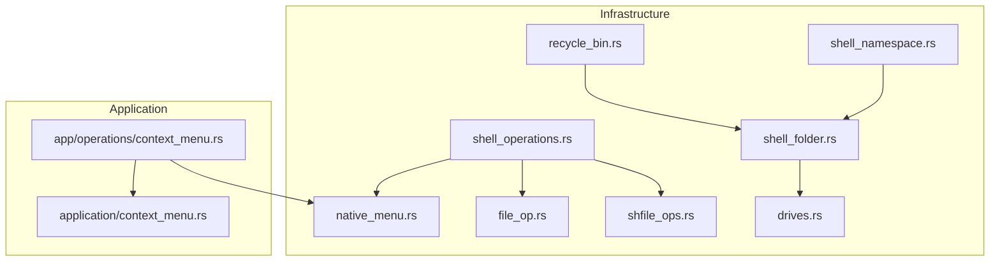
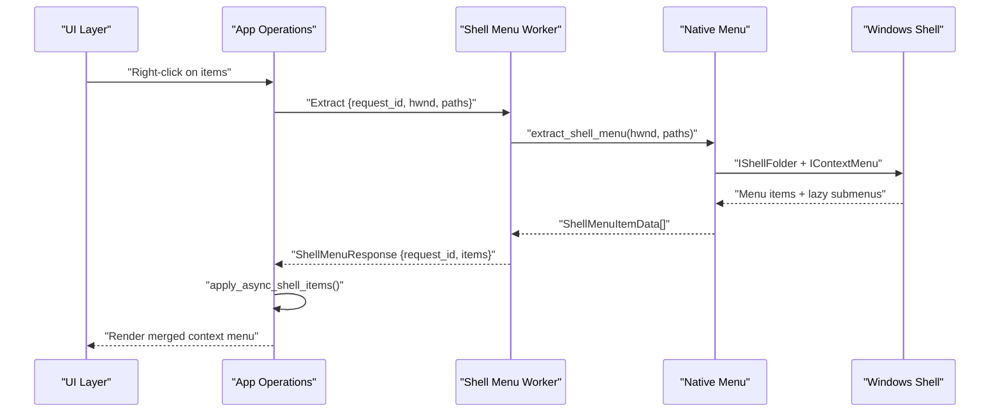
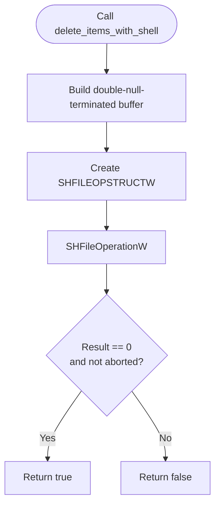
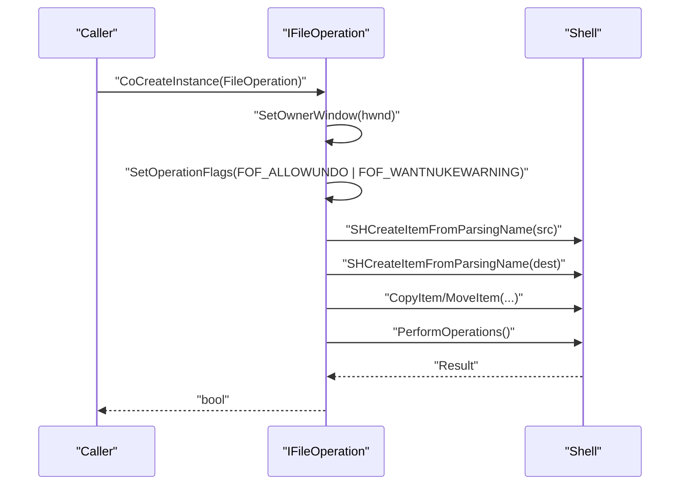
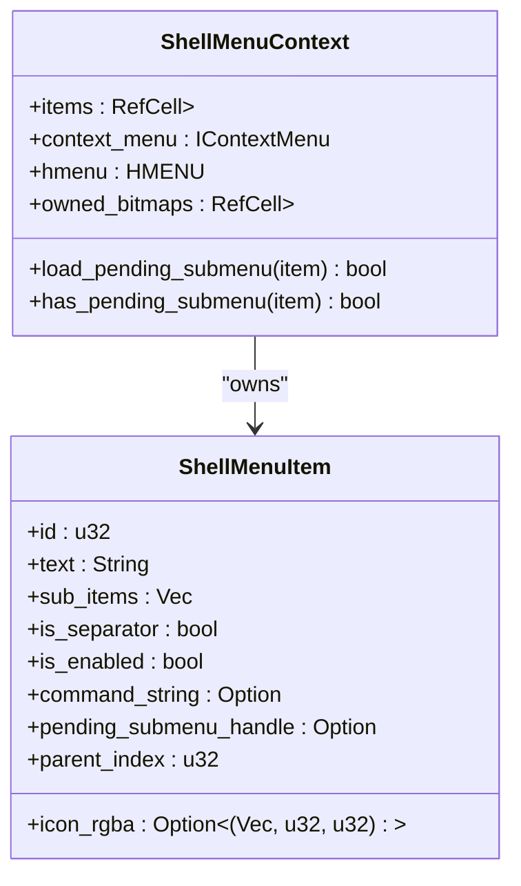
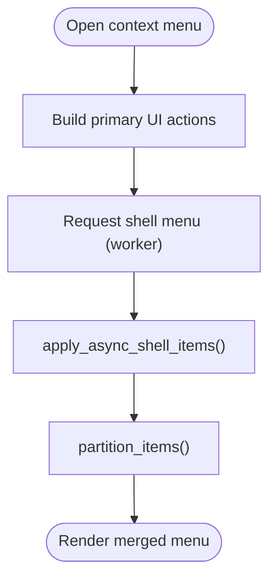
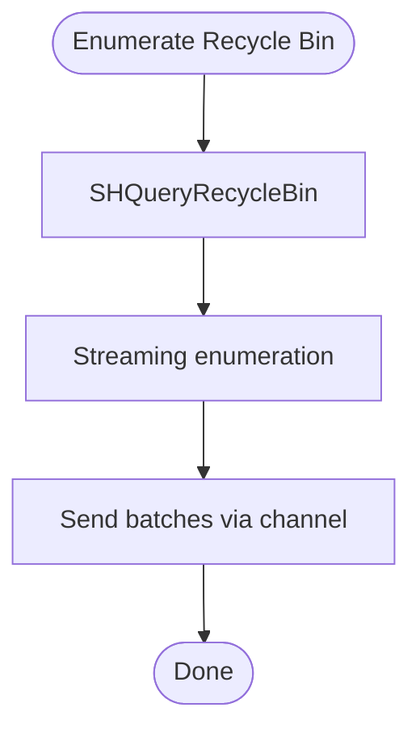
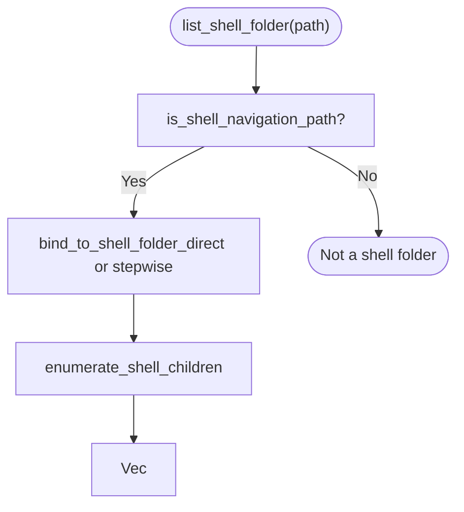
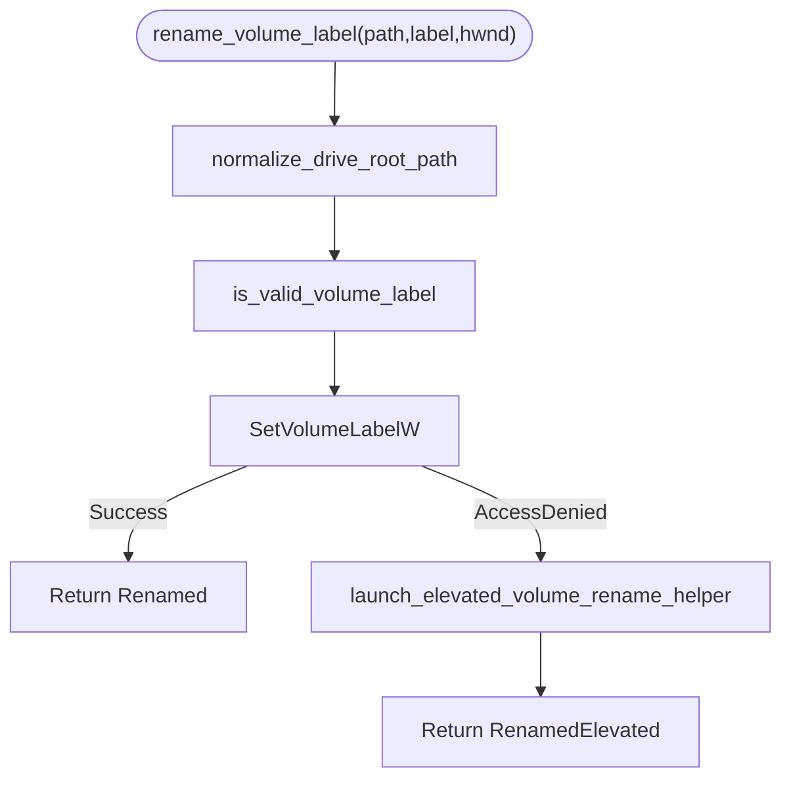
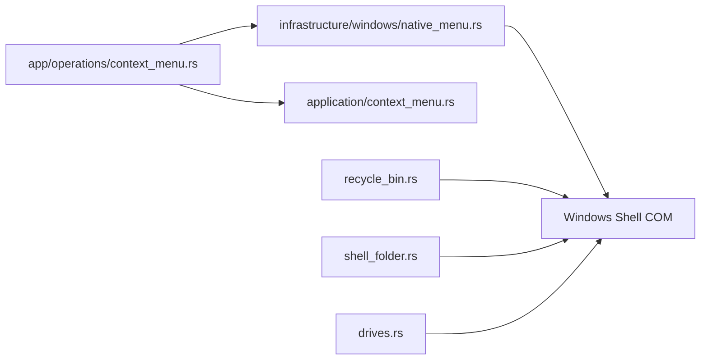

# Windows Shell Integration

<cite>
**Referenced Files in This Document**
- [shell_operations.rs](file://src/infrastructure/windows/shell_operations.rs)
- [shfile_ops.rs](file://src/infrastructure/windows/shell_operations/shfile_ops.rs)
- [context_menu.rs](file://src/infrastructure/windows/shell_operations/context_menu.rs)
- [file_op.rs](file://src/infrastructure/windows/shell_operations/file_op.rs)
- [native_menu.rs](file://src/infrastructure/windows/native_menu.rs)
- [context_menu.rs](file://src/application/context_menu.rs)
- [context_menu.rs](file://src/app/operations/context_menu.rs)
- [recycle_bin.rs](file://src/infrastructure/windows/recycle_bin.rs)
- [shell_folder.rs](file://src/infrastructure/windows/shell_folder.rs)
- [drives.rs](file://src/infrastructure/windows/drives.rs)
- [shell_namespace.rs](file://src/infrastructure/security/shell_namespace.rs)
</cite>

## Table of Contents
1. [Introduction](#introduction)
2. [Project Structure](#project-structure)
3. [Core Components](#core-components)
4. [Architecture Overview](#architecture-overview)
5. [Detailed Component Analysis](#detailed-component-analysis)
6. [Dependency Analysis](#dependency-analysis)
7. [Performance Considerations](#performance-considerations)
8. [Troubleshooting Guide](#troubleshooting-guide)
9. [Conclusion](#conclusion)

## Introduction
This document explains MTT File Manager’s Windows Shell integration, focusing on native Shell API usage for file operations (Copy, Move, Delete, Rename), context menu extraction and invocation, shell namespace navigation, recycle bin integration, and desktop/UI integration patterns. It covers the SHFileOperation wrapper, IFileOperation fallback, progress dialog behavior, and safe COM usage patterns. Practical workflows, error handling strategies, and performance optimizations for large operations are included.

## Project Structure
The Shell integration spans several modules:
- Infrastructure-level Windows Shell wrappers and utilities
- Application-layer context menu orchestration and UI integration
- Recycle Bin metadata and operations
- Virtual shell folder enumeration for archives and namespaces
- Drive/volume label and filesystem utilities

**Diagram sources**
- [shell_operations.rs:1-15](file://src/infrastructure/windows/shell_operations.rs#L1-L15)
- [shfile_ops.rs:1-242](file://src/infrastructure/windows/shell_operations/shfile_ops.rs#L1-L242)
- [file_op.rs:1-245](file://src/infrastructure/windows/shell_operations/file_op.rs#L1-L245)
- [native_menu.rs:1-544](file://src/infrastructure/windows/native_menu.rs#L1-L544)
- [context_menu.rs:1-476](file://src/app/operations/context_menu.rs#L1-L476)
- [context_menu.rs:1-271](file://src/application/context_menu.rs#L1-L271)
- [recycle_bin.rs:1-132](file://src/infrastructure/windows/recycle_bin.rs#L1-L132)
- [shell_folder.rs:1-289](file://src/infrastructure/windows/shell_folder.rs#L1-L289)
- [drives.rs:1-550](file://src/infrastructure/windows/drives.rs#L1-L550)
- [shell_namespace.rs:1-84](file://src/infrastructure/security/shell_namespace.rs#L1-L84)

**Section sources**
- [shell_operations.rs:1-15](file://src/infrastructure/windows/shell_operations.rs#L1-L15)
- [context_menu.rs:1-476](file://src/app/operations/context_menu.rs#L1-L476)

## Core Components
- SHFileOperation wrapper: Provides single-call batch operations with native progress dialogs and undo support. Supports Copy, Move, Delete, Rename, and double-null-terminated path buffers.
- IFileOperation fallback: Robust copy/move using IFileOperation for modern shell features (e.g., ZIP virtual folders), with graceful fallback to SHFileOperation.
- Native context menu extraction and invocation: Extracts IContextMenu items, handles lazy submenus, manages GDI bitmap lifetimes, and invokes commands safely.
- Recycle Bin integration: Enumerates items with robust metadata (original path, deletion date), restore and permanent delete operations, and total count/size queries.
- Shell folder enumeration: Navigates virtual folders (archives, namespaces) using IShellFolder and IShellItem2 for accurate metadata.
- Drive/volume utilities: Volume label validation and rename (including elevation), drive detection, filesystem capability checks, and display label formatting.

**Section sources**
- [shfile_ops.rs:26-242](file://src/infrastructure/windows/shell_operations/shfile_ops.rs#L26-L242)
- [file_op.rs:30-245](file://src/infrastructure/windows/shell_operations/file_op.rs#L30-L245)
- [native_menu.rs:137-544](file://src/infrastructure/windows/native_menu.rs#L137-L544)
- [recycle_bin.rs:86-132](file://src/infrastructure/windows/recycle_bin.rs#L86-L132)
- [shell_folder.rs:58-289](file://src/infrastructure/windows/shell_folder.rs#L58-L289)
- [drives.rs:278-401](file://src/infrastructure/windows/drives.rs#L278-L401)

## Architecture Overview
The integration follows a layered design:
- Application orchestrates UI and user actions, requests shell menu extraction, and merges results into the UI model.
- Infrastructure exposes safe wrappers around Windows Shell APIs, managing COM lifetimes and resource cleanup.
- Recycle Bin and shell folder modules encapsulate metadata retrieval and operations.
- Drive utilities provide filesystem and volume label services.

**Diagram sources**
- [context_menu.rs:291-309](file://src/app/operations/context_menu.rs#L291-L309)
- [native_menu.rs:140-247](file://src/infrastructure/windows/native_menu.rs#L140-L247)

## Detailed Component Analysis

### SHFileOperation Wrapper
Implements:
- Single-item and multi-item Copy/Move/Delete/Rename with native progress and undo support.
- Double-null-terminated path buffers for robust multi-path operations.
- Permanent delete without recycle bin and rename safety checks.

Key behaviors:
- Batch operations produce a single progress dialog.
- Undo support via FOF_ALLOWUNDO.
- Confirmation dialogs via FOF_WANTNUKEWARNING for destructive operations.

**Diagram sources**
- [shfile_ops.rs:48-71](file://src/infrastructure/windows/shell_operations/shfile_ops.rs#L48-L71)

**Section sources**
- [shfile_ops.rs:26-242](file://src/infrastructure/windows/shell_operations/shfile_ops.rs#L26-L242)

### IFileOperation Fallback
Implements:
- Robust copy/move using IFileOperation for modern shell features (ZIP, virtual folders).
- Graceful fallback to SHFileOperation on failure.
- Per-operation owner window and flags configuration.

**Diagram sources**
- [file_op.rs:30-130](file://src/infrastructure/windows/shell_operations/file_op.rs#L30-L130)

**Section sources**
- [file_op.rs:30-245](file://src/infrastructure/windows/shell_operations/file_op.rs#L30-L245)

### Native Context Menu Extraction and Invocation
Core capabilities:
- Extracts IContextMenu from parent folder for one or more items.
- Builds a popup menu and queries items with QueryContextMenu.
- Handles lazy submenus via WM_INITMENUPOPUP and on-demand loading.
- Safely collects and cleans GDI bitmaps to prevent leaks.
- Invokes commands with proper unicode and async flags.

**Diagram sources**
- [native_menu.rs:16-490](file://src/infrastructure/windows/native_menu.rs#L16-L490)

**Section sources**
- [native_menu.rs:137-544](file://src/infrastructure/windows/native_menu.rs#L137-L544)
- [context_menu.rs:73-194](file://src/infrastructure/windows/shell_operations/context_menu.rs#L73-L194)

### Application Context Menu Orchestration
Responsibilities:
- Builds primary UI actions (Cut/Copy/Paste/Rename/Delete/Properties).
- Merges native shell items asynchronously, filtering known verbs and blacklisted strings.
- Partitions items into primary, secondary, and overflow categories.
- Manages lazy submenu loading via worker messages.

**Diagram sources**
- [context_menu.rs:43-309](file://src/app/operations/context_menu.rs#L43-L309)

**Section sources**
- [context_menu.rs:43-476](file://src/app/operations/context_menu.rs#L43-L476)
- [context_menu.rs:133-271](file://src/application/context_menu.rs#L133-L271)

### Recycle Bin Integration
Capabilities:
- Property keys for size, original path, deletion date, and display name.
- Streaming enumeration with batching and generation tracking.
- Restore and permanent-delete operations with native confirmation dialogs.
- Total count and size queries.

**Diagram sources**
- [recycle_bin.rs:86-111](file://src/infrastructure/windows/recycle_bin.rs#L86-L111)

**Section sources**
- [recycle_bin.rs:1-132](file://src/infrastructure/windows/recycle_bin.rs#L1-L132)

### Shell Folder Enumeration (Virtual Folders)
Capabilities:
- Detects virtual paths (archives, namespace URIs).
- Direct binding for top-level archives and stepwise navigation for nested paths.
- Enumerates children via IShellFolder with IShellItem2 metadata.
- Heuristic handling of folder/stream attributes.

**Diagram sources**
- [shell_folder.rs:58-208](file://src/infrastructure/windows/shell_folder.rs#L58-L208)

**Section sources**
- [shell_folder.rs:36-289](file://src/infrastructure/windows/shell_folder.rs#L36-L289)
- [shell_namespace.rs:19-47](file://src/infrastructure/security/shell_namespace.rs#L19-L47)

### Drive and Volume Utilities
Capabilities:
- Validates and renames volume labels with elevation support.
- Detects drive roots and supports volume label rename for specific drive types.
- Retrieves filesystem info, total/free space, and cross-process notification capabilities.
- Formats display labels and resolves volume names via Shell or GetVolumeInformation.

**Diagram sources**
- [drives.rs:278-300](file://src/infrastructure/windows/drives.rs#L278-L300)

**Section sources**
- [drives.rs:278-401](file://src/infrastructure/windows/drives.rs#L278-L401)

## Dependency Analysis
- Application depends on infrastructure for menu extraction and file operations.
- Native menu module depends on Windows Shell COM interfaces and GDI for icon handling.
- Recycle Bin module depends on IShellItem2 for metadata and Shell operations for restore/delete/empty.
- Shell folder module depends on IShellFolder/IShellItem2 and property keys.
- Drive utilities depend on Win32 volume APIs and Shell display names.

**Diagram sources**
- [context_menu.rs:291-309](file://src/app/operations/context_menu.rs#L291-L309)
- [native_menu.rs:1-544](file://src/infrastructure/windows/native_menu.rs#L1-L544)
- [recycle_bin.rs:1-132](file://src/infrastructure/windows/recycle_bin.rs#L1-L132)
- [shell_folder.rs:1-289](file://src/infrastructure/windows/shell_folder.rs#L1-L289)
- [drives.rs:1-550](file://src/infrastructure/windows/drives.rs#L1-L550)

**Section sources**
- [context_menu.rs:291-309](file://src/app/operations/context_menu.rs#L291-L309)
- [native_menu.rs:1-544](file://src/infrastructure/windows/native_menu.rs#L1-L544)

## Performance Considerations
- Prefer IFileOperation for batch operations to leverage Shell optimizations and reduce UI thread work.
- Use SHFileOperation for single-item operations to minimize COM overhead.
- Warmup shell extensions on startup to reduce first-use latency for context menus.
- Stream Recycle Bin enumeration to avoid large memory allocations.
- Avoid redundant COM initialization; reuse guards and initialize only when needed.
- Use lazy submenu loading to defer expensive shell extension calls until user interaction.

[No sources needed since this section provides general guidance]

## Troubleshooting Guide
Common issues and strategies:
- Access Denied on volume label rename: The module handles elevation automatically and returns structured errors. Log and present user-friendly messages.
- Context menu items missing on first call: Use warmup_shell_extensions to pre-load shell extensions.
- Bitmap leaks or silent failures: The native menu module defers GDI bitmap deletion until after DestroyMenu to avoid leaks.
- Drive targets: Certain operations are disabled for drive roots; detect and disable actions accordingly.
- Large operations: Use IFileOperation or SHFileOperation batch calls to benefit from native progress and undo.

**Section sources**
- [drives.rs:278-300](file://src/infrastructure/windows/drives.rs#L278-L300)
- [native_menu.rs:96-112](file://src/infrastructure/windows/native_menu.rs#L96-L112)
- [context_menu.rs:101-118](file://src/app/operations/context_menu.rs#L101-L118)

## Conclusion
MTT File Manager integrates deeply with Windows Shell to provide a familiar, efficient file management experience. The design balances robustness (COM guards, resource cleanup, fallbacks) with performance (lazy loading, streaming, batch operations). The combination of SHFileOperation, IFileOperation, native context menu extraction, and shell folder enumeration delivers Explorer-compatible workflows while maintaining UI responsiveness.